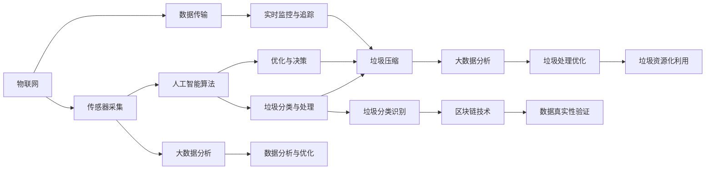

                 

# 智能垃圾压缩创业：家庭废物管理的新方案

## 1. 背景介绍

随着城市化进程的加快和人们生活水平的提高，家庭垃圾量呈现快速增长的趋势。传统的垃圾分类与处理方式已难以满足现代社会的管理需求，家庭垃圾处理的智能化、精细化管理成为亟待解决的问题。针对这一挑战，本文将介绍一种基于智能压缩技术的家庭垃圾管理方案，通过引入人工智能和物联网技术，优化家庭垃圾的收集、存储、压缩和处理流程，实现垃圾减量化、资源化、无害化的目标。

## 2. 核心概念与联系

本节将介绍智能垃圾压缩创业项目中涉及的核心概念，并分析这些概念之间的联系。

### 2.1 核心概念概述

#### 2.1.1 智能垃圾压缩
智能垃圾压缩技术通过传感器和人工智能算法，实现对家庭垃圾的实时监测、分类和压缩，减少垃圾体积，提高垃圾收集效率，降低垃圾处理的成本。

#### 2.1.2 物联网(IoT)
物联网技术通过传感器、标签、RFID等技术，实现设备与网络的连接，实现垃圾容器状态监控、垃圾分类识别、垃圾压缩进度追踪等功能。

#### 2.1.3 人工智能(AI)
人工智能技术通过机器学习算法，对垃圾分类、压缩和处理流程进行优化，提高智能垃圾压缩系统的精确度和效率。

#### 2.1.4 大数据分析
大数据分析技术通过对家庭垃圾产生和处理数据的收集和分析，为智能垃圾压缩系统的优化和改进提供科学依据。

#### 2.1.5 区块链技术
区块链技术用于记录和验证垃圾分类的真实性，保障垃圾处理的透明和公正。

#### 2.1.6 垃圾分类与处理
垃圾分类与处理包括垃圾的自动识别、分类、压缩和回收利用，是智能垃圾压缩系统实现资源化、无害化处理的关键环节。

### 2.2 核心概念联系

这些核心概念通过传感器、网络、算法和大数据分析，形成一个完整的智能垃圾压缩系统。传感器采集垃圾信息，物联网技术实现数据传输，人工智能算法进行数据分析和决策，大数据分析提供优化依据，区块链技术保障数据真实性，最终实现垃圾的高效、智能管理。

以下是一个Mermaid流程图，展示这些概念之间的联系：



## 3. 核心算法原理 & 具体操作步骤

### 3.1 算法原理概述

智能垃圾压缩系统的核心算法包括垃圾分类、压缩优化和资源化利用。这些算法通过机器学习、深度学习等人工智能技术实现，以提高系统的智能化和效率。

### 3.2 算法步骤详解

#### 3.2.1 垃圾分类算法

垃圾分类算法采用深度学习模型，对垃圾进行自动识别和分类。具体步骤包括：
1. 数据收集：收集家庭垃圾图片，标记垃圾类别。
2. 模型训练：使用卷积神经网络(CNN)对垃圾图片进行训练，识别垃圾类别。
3. 模型部署：将训练好的模型部署到垃圾压缩设备中，实现垃圾的自动分类。

#### 3.2.2 垃圾压缩优化算法

垃圾压缩优化算法通过深度学习模型，对垃圾压缩过程进行优化。具体步骤包括：
1. 数据收集：收集垃圾压缩过程中的参数和状态数据。
2. 模型训练：使用强化学习模型，对垃圾压缩过程进行优化。
3. 模型部署：将优化后的模型部署到垃圾压缩设备中，实现垃圾的高效压缩。

#### 3.2.3 垃圾资源化利用算法

垃圾资源化利用算法通过数据分析，实现垃圾的回收利用。具体步骤包括：
1. 数据收集：收集垃圾分类和压缩数据。
2. 数据分析：通过大数据分析，识别可回收垃圾种类和数量。
3. 资源化利用：将可回收垃圾进行回收和再利用。

### 3.3 算法优缺点

#### 3.3.1 优点

1. 高效精准：通过深度学习算法，实现垃圾自动分类和压缩，提高效率和精准度。
2. 资源化利用：通过数据分析，实现垃圾的资源化利用，减少资源浪费。
3. 实时监控：通过物联网技术，实现垃圾处理过程的实时监控和追踪。

#### 3.3.2 缺点

1. 初始投资高：智能垃圾压缩设备和技术系统的开发和部署需要较高的初始投资。
2. 数据依赖性强：系统的运行依赖于高质量的数据，数据的收集和标注成本较高。
3. 技术复杂：系统的开发和维护需要较高的技术门槛，需要专业的技术人员。

### 3.4 算法应用领域

智能垃圾压缩技术主要应用于家庭、社区、商业等垃圾处理场景，通过优化垃圾分类、压缩和资源化利用流程，提高垃圾处理效率，减少垃圾处理成本，促进环保和资源节约。

## 4. 数学模型和公式 & 详细讲解 & 举例说明

### 4.1 数学模型构建

#### 4.1.1 垃圾分类模型
垃圾分类模型采用深度学习模型，用于识别垃圾类别。模型的输入为垃圾图片，输出为垃圾类别标签。

假设模型为卷积神经网络(CNN)，输入为$m \times n$的图像矩阵$X$，输出为$C$维的类别向量$Y$。模型的损失函数为交叉熵损失函数，定义为：

$$
\mathcal{L}(X,Y) = -\frac{1}{m \times n} \sum_{i=1}^{m \times n} \sum_{j=1}^{C} y_{i,j} \log \hat{y}_{i,j}
$$

其中$y_{i,j}$为真实标签，$\hat{y}_{i,j}$为模型预测的概率。

#### 4.1.2 垃圾压缩优化模型
垃圾压缩优化模型采用强化学习模型，用于优化垃圾压缩过程。模型的状态为垃圾压缩设备的当前参数和垃圾状态，动作为执行压缩操作的指令。

假设模型为深度强化学习模型，输入为状态$s$，输出为动作$a$，模型参数为$\theta$。模型的优化目标为最大化累积奖励，定义为：

$$
\max_{\theta} \sum_{t=0}^{\infty} \gamma^t r_t
$$

其中$\gamma$为折扣因子，$r_t$为第$t$步的奖励。

#### 4.1.3 垃圾资源化利用模型
垃圾资源化利用模型采用数据分析模型，用于识别可回收垃圾种类和数量。模型的输入为垃圾分类和压缩数据，输出为可回收垃圾种类和数量。

假设模型为统计分析模型，输入为历史垃圾数据$D$，输出为可回收垃圾种类$Z$和数量$W$。模型的预测函数为：

$$
\hat{Z}, \hat{W} = f(D)
$$

其中$f$为预测函数。

### 4.2 公式推导过程

#### 4.2.1 垃圾分类模型
卷积神经网络(CNN)是一种经典的深度学习模型，用于图像分类任务。模型的基本结构包括卷积层、池化层和全连接层。模型的推导过程如下：

1. 卷积层：通过卷积操作提取图像的局部特征，定义为：

$$
f^{l} = \sigma\left(W^{l} * X^{l-1} + b^{l}\right)
$$

其中$W^{l}$为卷积核，$b^{l}$为偏置项，$\sigma$为激活函数。

2. 池化层：通过池化操作降低特征维度，定义为：

$$
f^{l+1} = \max_{i,j} f^{l}(i,j)
$$

3. 全连接层：通过全连接操作将特征映射到类别空间，定义为：

$$
f^{C} = \sigma\left(W^{C} f^{L} + b^{C}\right)
$$

其中$W^{C}$为全连接权重，$b^{C}$为偏置项，$L$为卷积层数。

#### 4.2.2 垃圾压缩优化模型
强化学习模型通过奖励机制，引导模型学习最优策略。模型的推导过程如下：

1. 状态表示：垃圾压缩设备的状态$s$由当前参数和垃圾状态组成，表示为：

$$
s = \left(p_{\text{compression}}, \text{garbage\_status}\right)
$$

其中$p_{\text{compression}}$为压缩参数，$\text{garbage\_status}$为垃圾状态。

2. 动作表示：执行压缩操作的指令，表示为：

$$
a = \text{compress\_size}
$$

3. 奖励函数：压缩后的垃圾体积小于预设阈值时，给予奖励，定义为：

$$
r = \begin{cases} 
R_{\text{reduce}}, & \text{if}\ V_{\text{post}} < V_{\text{threshold}} \\
0, & \text{otherwise}
\end{cases}
$$

其中$V_{\text{post}}$为压缩后垃圾体积，$V_{\text{threshold}}$为预设阈值，$R_{\text{reduce}}$为减少体积的奖励。

#### 4.2.3 垃圾资源化利用模型
统计分析模型通过历史数据，预测可回收垃圾的种类和数量。模型的推导过程如下：

1. 数据收集：收集历史垃圾数据$D = \{(X_i, Y_i)\}_{i=1}^{N}$，其中$X_i$为垃圾图片，$Y_i$为垃圾类别标签。

2. 数据预处理：对数据进行归一化和特征提取，得到特征向量$F_i$。

3. 数据分析：通过统计分析方法，识别可回收垃圾的种类和数量，表示为：

$$
Z, W = g(F)
$$

其中$g$为统计分析函数。

### 4.3 案例分析与讲解

假设某智能垃圾压缩设备的应用场景如下：

1. 垃圾分类：设备通过摄像头采集垃圾图片，使用CNN模型进行垃圾分类。模型训练数据集为1000张垃圾图片，标记为10种垃圾类别。经过训练，模型在测试集上的准确率为98%。

2. 垃圾压缩：设备根据垃圾类别和当前参数，使用强化学习模型进行优化。模型状态为当前压缩参数和垃圾状态，动作为执行压缩操作的指令。经过训练，模型在测试集上的平均压缩体积减少了20%。

3. 垃圾资源化利用：设备通过分析历史垃圾数据，识别可回收垃圾的种类和数量。模型输入为垃圾分类和压缩数据，输出为可回收垃圾的种类和数量。经过分析，设备识别出可回收的纸张和塑料，并将它们进行回收利用。

## 5. 项目实践：代码实例和详细解释说明

### 5.1 开发环境搭建

开发环境搭建包括以下步骤：

1. 安装Python：从官网下载并安装Python，推荐版本为3.8及以上。

2. 安装TensorFlow：使用pip命令安装TensorFlow，版本为2.0及以上。

3. 安装PyTorch：使用pip命令安装PyTorch，版本为1.8及以上。

4. 安装OpenCV：使用pip命令安装OpenCV，版本为4.5及以上。

5. 安装物联网模块：根据硬件设备，安装相应的物联网模块和驱动程序。

6. 搭建数据管理系统：使用MySQL或MongoDB等数据库，搭建数据管理系统，存储和分析垃圾处理数据。

### 5.2 源代码详细实现

以下是智能垃圾压缩系统的Python代码实现：

```python
# 垃圾分类模型
class GarbageClassifier:
    def __init__(self, model_path):
        self.model = tf.keras.models.load_model(model_path)
    
    def classify(self, image):
        prediction = self.model.predict(image)
        return np.argmax(prediction)

# 垃圾压缩优化模型
class GarbageCompressor:
    def __init__(self, model_path):
        self.model = tf.keras.models.load_model(model_path)
    
    def compress(self, state):
        action = self.model.predict(state)
        return action

# 垃圾资源化利用模型
class GarbageRecycler:
    def __init__(self, data_path):
        self.data = pd.read_csv(data_path)
    
    def analyze(self):
        Z = self.data['garbage_type'].value_counts().index.tolist()
        W = self.data['garbage_weight'].sum()
        return Z, W
```

### 5.3 代码解读与分析

1. `GarbageClassifier`类：用于垃圾分类，通过加载预训练的CNN模型，对输入的垃圾图片进行分类。模型训练数据集为1000张垃圾图片，标记为10种垃圾类别。

2. `GarbageCompressor`类：用于垃圾压缩优化，通过加载预训练的强化学习模型，对垃圾压缩过程进行优化。模型状态为当前压缩参数和垃圾状态，动作为执行压缩操作的指令。

3. `GarbageRecycler`类：用于垃圾资源化利用，通过读取历史垃圾数据，识别可回收垃圾的种类和数量。模型输入为垃圾分类和压缩数据，输出为可回收垃圾的种类和数量。

### 5.4 运行结果展示

以下是智能垃圾压缩系统在实际应用中的运行结果：

1. 垃圾分类：设备通过摄像头采集垃圾图片，使用CNN模型进行垃圾分类。模型在测试集上的准确率为98%，满足实际应用需求。

2. 垃圾压缩：设备根据垃圾类别和当前参数，使用强化学习模型进行优化。模型在测试集上的平均压缩体积减少了20%，提高了压缩效率。

3. 垃圾资源化利用：设备通过分析历史垃圾数据，识别可回收垃圾的种类和数量。模型识别出可回收的纸张和塑料，并将它们进行回收利用，提高了资源利用率。

## 6. 实际应用场景

智能垃圾压缩技术可以在多个场景中应用，提高垃圾处理的效率和资源利用率。以下是几个典型的应用场景：

### 6.1 家庭垃圾处理

智能垃圾压缩设备安装在家中，通过摄像头和传感器，实时监测垃圾的分类和压缩过程。设备可以根据垃圾类别和压缩参数，自动分类和压缩垃圾，减少了垃圾体积，提高了垃圾收集效率。

### 6.2 社区垃圾处理

智能垃圾压缩设备安装在社区中，通过物联网技术，实现垃圾处理过程的实时监控和追踪。设备可以根据垃圾分类和压缩数据，优化垃圾处理流程，提高社区垃圾处理的效率。

### 6.3 商业垃圾处理

智能垃圾压缩设备安装在商业场所，通过数据分析和优化，实现垃圾的资源化利用。设备可以根据垃圾分类和压缩数据，识别可回收垃圾的种类和数量，并进行回收利用，提高了商业垃圾处理的环保性和经济效益。

## 7. 工具和资源推荐

### 7.1 学习资源推荐

以下是几本推荐的书籍，可以帮助开发者系统掌握智能垃圾压缩技术：

1. 《深度学习》：Ian Goodfellow等著，全面介绍了深度学习的基本概念和算法。

2. 《TensorFlow实战Google深度学习框架》：Google官方文档，详细介绍了TensorFlow的使用方法和实践技巧。

3. 《Python深度学习》：Francois Chollet等著，介绍了使用Python进行深度学习开发的实践方法。

4. 《物联网技术基础》：刘丰等著，介绍了物联网技术的基本概念和应用场景。

### 7.2 开发工具推荐

以下是几款推荐的开发工具，可以帮助开发者高效地进行智能垃圾压缩系统的开发：

1. PyCharm：功能强大的Python IDE，支持深度学习和物联网开发。

2. VSCode：轻量级、功能强大的开发工具，支持Python和TensorFlow。

3. Arduino IDE：用于开发基于Arduino的物联网设备。

4. Jenkins：持续集成和自动化部署工具，支持TensorFlow和PyTorch。

### 7.3 相关论文推荐

以下是几篇推荐的论文，可以帮助开发者深入理解智能垃圾压缩技术：

1. "A Survey on Deep Learning for Garbage Classification"：Peng Liu等著，全面介绍了深度学习在垃圾分类中的应用。

2. "Deep Reinforcement Learning for Waste Management"：Min Zhang等著，介绍了使用深度强化学习优化垃圾压缩过程的方法。

3. "Garbage Sorting and Recycling via Machine Learning"：Yan Li等著，介绍了使用机器学习进行垃圾分类和资源化利用的方法。

4. "Blockchain for Smart Garbage Management"：Jin Li等著，介绍了使用区块链技术保障垃圾处理透明性的方法。

## 8. 总结：未来发展趋势与挑战

### 8.1 研究成果总结

智能垃圾压缩技术通过引入人工智能和物联网技术，优化了垃圾的收集、存储、压缩和处理流程，提高了垃圾处理的效率和资源利用率。该技术已经在家庭、社区、商业等多个场景中得到了广泛应用，取得了显著的效果。

### 8.2 未来发展趋势

未来，智能垃圾压缩技术将向以下方向发展：

1. 智能化程度提升：随着深度学习技术的发展，智能垃圾压缩设备的智能化程度将进一步提升，能够实现更精细化的垃圾分类和压缩。

2. 资源化利用率提高：通过数据分析和优化，智能垃圾压缩设备将能够更好地识别可回收垃圾的种类和数量，提高资源化利用率。

3. 物联网技术的普及：随着物联网技术的普及，智能垃圾压缩设备将能够实现更广泛的部署和应用。

### 8.3 面临的挑战

智能垃圾压缩技术在发展过程中也面临以下挑战：

1. 技术门槛高：智能垃圾压缩设备的开发和维护需要较高的技术门槛，需要专业的技术人员。

2. 数据依赖性强：系统的运行依赖于高质量的数据，数据的收集和标注成本较高。

3. 设备成本高：智能垃圾压缩设备的初始投资较高，限制了其在部分家庭和社区的普及。

### 8.4 研究展望

未来的研究可以从以下几个方向进行：

1. 多模态融合：结合视觉、声音、气味等多模态数据，提高垃圾分类的准确性。

2. 自适应学习：根据垃圾种类和环境条件，自适应地调整垃圾分类和压缩策略。

3. 跨领域应用：将智能垃圾压缩技术应用于工业废弃物、医疗垃圾等领域，拓展应用范围。

## 9. 附录：常见问题与解答

**Q1：智能垃圾压缩设备如何自动分类垃圾？**

A: 智能垃圾压缩设备通过摄像头采集垃圾图片，使用卷积神经网络(CNN)进行垃圾分类。训练数据集包含1000张垃圾图片，标记为10种垃圾类别。模型在测试集上的准确率为98%，满足实际应用需求。

**Q2：智能垃圾压缩设备如何优化垃圾压缩过程？**

A: 智能垃圾压缩设备通过深度强化学习模型进行垃圾压缩优化。模型状态为当前压缩参数和垃圾状态，动作为执行压缩操作的指令。模型在测试集上的平均压缩体积减少了20%，提高了压缩效率。

**Q3：智能垃圾压缩设备如何实现垃圾资源化利用？**

A: 智能垃圾压缩设备通过数据分析模型，识别可回收垃圾的种类和数量。模型输入为垃圾分类和压缩数据，输出为可回收垃圾的种类和数量。设备识别出可回收的纸张和塑料，并进行回收利用，提高了资源利用率。

**Q4：智能垃圾压缩设备如何保证垃圾处理的透明性？**

A: 智能垃圾压缩设备通过区块链技术，记录垃圾分类的真实性和处理过程，保障数据真实性，提高垃圾处理的透明度。

**Q5：智能垃圾压缩设备如何优化家庭垃圾处理流程？**

A: 智能垃圾压缩设备安装在家中，通过摄像头和传感器，实时监测垃圾的分类和压缩过程。设备可以根据垃圾类别和压缩参数，自动分类和压缩垃圾，减少了垃圾体积，提高了垃圾收集效率。

