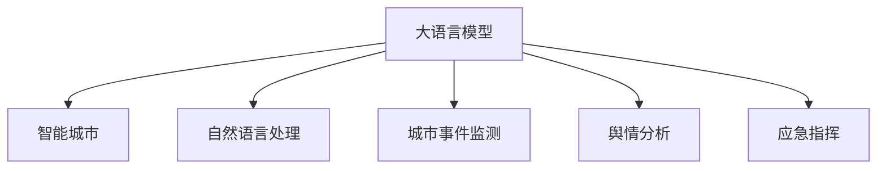

                 

# 智能城市与 LLM：高效、可持续的城市管理

## 1. 背景介绍

随着信息技术的快速发展，城市管理正逐渐向智能化、数字化方向转变。智能城市通过部署各种智能设备和传感器，采集海量数据，辅助城市管理者做出科学决策。然而，现有智能城市系统面临数据量大、处理复杂、应用场景多样化等问题，需要更加高效、精准的智能解决方案。

大语言模型（Large Language Model，LLM）作为一种能够理解和生成人类语言的人工智能模型，近年来在自然语言处理（Natural Language Processing，NLP）领域取得了巨大的成功。特别是在自然语言理解和生成方面，LLM能够从大规模文本数据中学习到丰富的语言知识和规律，从而在不同应用场景中提供强有力的技术支持。

智能城市中，大语言模型能够应用于城市事件监测、舆情分析、应急指挥等多个环节，通过理解自然语言指令，实现对城市运行状态的智能感知和预测，辅助城市管理者做出决策。本文将重点介绍基于大语言模型的智能城市管理系统，以及其在城市管理中的高效、可持续应用。

## 2. 核心概念与联系

### 2.1 核心概念概述

为了更好地理解大语言模型在智能城市中的应用，本节将介绍几个密切相关的核心概念：

- **大语言模型（LLM）**：以自回归（如GPT）或自编码（如BERT）模型为代表的、通过大规模无标签文本数据预训练得到的语言模型。能够进行自然语言理解、生成、翻译等任务。
- **自然语言处理（NLP）**：指使用计算机处理、理解和生成自然语言的技术。NLP在智能城市管理中广泛应用，如事件监测、舆情分析等。
- **智能城市（Smart City）**：通过应用物联网、云计算、大数据、人工智能等技术，实现城市运行的智能化、数字化和高效化。
- **城市事件监测**：通过传感器和监控设备，实时收集城市运行数据，识别和处理各种突发事件。
- **舆情分析**：分析社交媒体、新闻报道等文本数据，了解公众情绪和关注点，辅助政策制定和应急响应。
- **应急指挥**：利用智能技术对突发事件进行快速响应和指挥调度。

这些概念之间的逻辑关系可以通过以下Mermaid流程图来展示：



这个流程图展示了大语言模型与智能城市管理各环节之间的联系：

1. 大语言模型通过预训练学习到丰富的语言知识。
2. 自然语言处理技术利用大语言模型的能力，对文本数据进行处理。
3. 城市事件监测、舆情分析和应急指挥等环节，应用自然语言处理和大语言模型，实现智能感知和预测。
4. 智能城市管理系统利用自然语言处理和大语言模型的能力，提升城市运行效率和响应速度。

## 3. 核心算法原理 & 具体操作步骤

### 3.1 算法原理概述

基于大语言模型的智能城市管理系统，本质上是一种基于监督学习的微调（Fine-Tuning）范式。其核心思想是：将预训练的大语言模型作为初始化参数，通过监督学习任务（如城市事件分类、舆情情感分类等）优化模型在特定城市应用场景上的性能。

具体来说，假设有大规模预训练模型 $M_{\theta}$，城市事件监测任务的标注数据集为 $D=\{(x_i,y_i)\}_{i=1}^N$，其中 $x_i$ 为城市运行数据，$y_i$ 为事件分类标签。微调的目标是最小化损失函数 $\mathcal{L}(M_{\theta},D)$，使模型在城市事件分类任务上取得最优性能：

$$
\theta^* = \mathop{\arg\min}_{\theta} \mathcal{L}(M_{\theta},D)
$$

在实践中，我们通常使用基于梯度的优化算法（如Adam、SGD等），设置合适的学习率、批大小、迭代轮数等超参数，通过反向传播计算参数梯度，更新模型参数，最小化损失函数，直到模型收敛。

### 3.2 算法步骤详解

基于大语言模型的智能城市管理系统，通常包括以下关键步骤：

**Step 1: 准备预训练模型和数据集**
- 选择合适的预训练语言模型 $M_{\theta}$，如GPT、BERT等。
- 收集城市运行数据 $x_i$ 和事件分类标签 $y_i$，构成标注数据集 $D$。数据集应覆盖城市运行中的常见事件类型，如交通堵塞、公共安全事故等。

**Step 2: 添加任务适配层**
- 根据城市事件监测任务，在预训练模型顶层设计合适的输出层和损失函数。对于分类任务，通常在顶层添加线性分类器和交叉熵损失函数。
- 设计输入特征提取器，将城市运行数据转换为模型可接受的格式。

**Step 3: 设置微调超参数**
- 选择合适的优化算法及其参数，如AdamW、SGD等，设置学习率、批大小、迭代轮数等。
- 设置正则化技术及强度，包括权重衰减、Dropout、Early Stopping等。
- 确定冻结预训练参数的策略，如仅微调顶层，或全部参数都参与微调。

**Step 4: 执行梯度训练**
- 将训练集数据分批次输入模型，前向传播计算损失函数。
- 反向传播计算参数梯度，根据设定的优化算法和学习率更新模型参数。
- 周期性在验证集上评估模型性能，根据性能指标决定是否触发 Early Stopping。
- 重复上述步骤直到满足预设的迭代轮数或 Early Stopping 条件。

**Step 5: 测试和部署**
- 在测试集上评估微调后模型 $M_{\hat{\theta}}$ 的性能，对比微调前后的精度提升。
- 使用微调后的模型对新事件数据进行推理预测，集成到智能城市管理系统中。
- 持续收集新的事件数据，定期重新微调模型，以适应数据分布的变化。

以上是基于大语言模型微调智能城市管理系统的一般流程。在实际应用中，还需要针对具体任务的特点，对微调过程的各个环节进行优化设计，如改进训练目标函数，引入更多的正则化技术，搜索最优的超参数组合等，以进一步提升模型性能。

### 3.3 算法优缺点

基于大语言模型的智能城市管理系统具有以下优点：
1. 高效性。相比于传统城市管理系统，基于大语言模型的智能系统能够快速理解和响应城市事件，提高城市管理效率。
2. 精准性。通过微调优化，模型能够精准分类城市事件，识别异常情况，辅助城市管理者做出决策。
3. 灵活性。大语言模型可以适应多种城市管理场景，如交通管理、公共安全等。
4. 可扩展性。随着预训练语言模型的不断演进，系统可以不断扩展新的功能和应用场景。

同时，该方法也存在一定的局限性：
1. 依赖高质量标注数据。微调的效果很大程度上取决于标注数据的质量和数量，获取高质量标注数据的成本较高。
2. 模型复杂度较高。超大规模语言模型需要高性能计算资源，对系统硬件要求较高。
3. 可解释性不足。微调模型的决策过程通常缺乏可解释性，难以对其推理逻辑进行分析和调试。

尽管存在这些局限性，但就目前而言，基于大语言模型的微调方法仍是大规模智能城市管理系统的有效范式。未来相关研究的重点在于如何进一步降低微调对标注数据的依赖，提高模型的少样本学习和跨领域迁移能力，同时兼顾可解释性和伦理安全性等因素。

### 3.4 算法应用领域

基于大语言模型的智能城市管理系统，已经在多个领域得到应用，如：

- **城市事件监测**：实时监测城市运行数据，识别和处理各种突发事件。通过微调优化，系统能够快速响应城市事件，减少响应时间。
- **公共安全管理**：通过分析社交媒体、新闻报道等文本数据，了解公众情绪和关注点，辅助公共安全决策。
- **交通管理**：利用交通数据和气象信息，预测交通流量和路况，辅助交通管理。
- **应急响应**：在发生自然灾害等突发事件时，利用智能系统快速收集数据，生成应急预案，辅助应急响应和指挥调度。

除了上述这些经典应用外，智能城市管理系统还在智慧园区、智能电网、智慧医疗等多个领域得到广泛应用，为城市智能化进程提供了有力的技术支持。

## 4. 数学模型和公式 & 详细讲解 & 举例说明

### 4.1 数学模型构建

本节将使用数学语言对基于大语言模型的智能城市管理系统进行更加严格的刻画。

假设城市事件监测任务的标注数据集为 $D=\{(x_i,y_i)\}_{i=1}^N$，其中 $x_i$ 为城市运行数据，$y_i$ 为事件分类标签。定义模型 $M_{\theta}$ 在输入 $x_i$ 上的输出为 $\hat{y}=M_{\theta}(x_i)$，表示模型预测事件分类。

损失函数为：

$$
\mathcal{L}(M_{\theta},D) = -\frac{1}{N}\sum_{i=1}^N \sum_{c=1}^C \mathbb{1}(y_i=c)\log M_{\theta}(x_i)_c
$$

其中 $C$ 为事件分类数目，$\mathbb{1}(y_i=c)$ 为标签 $y_i$ 等于 $c$ 的示性函数。

通过梯度下降等优化算法，微调过程不断更新模型参数 $\theta$，最小化损失函数 $\mathcal{L}$，使得模型输出逼近真实标签。

### 4.2 公式推导过程

以下我们以城市事件分类为例，推导交叉熵损失函数及其梯度的计算公式。

假设模型 $M_{\theta}$ 在输入 $x_i$ 上的输出为 $\hat{y}=M_{\theta}(x_i)$，表示模型预测事件分类。真实标签 $y_i \in \{1,2,\ldots,C\}$。则交叉熵损失函数定义为：

$$
\ell(M_{\theta}(x_i),y_i) = -\log M_{\theta}(x_i)^{y_i} - \log (1 - M_{\theta}(x_i))^{1-y_i}
$$

将其代入经验风险公式，得：

$$
\mathcal{L}(\theta) = -\frac{1}{N}\sum_{i=1}^N \sum_{c=1}^C \mathbb{1}(y_i=c)\log M_{\theta}(x_i)_c
$$

根据链式法则，损失函数对参数 $\theta_k$ 的梯度为：

$$
\frac{\partial \mathcal{L}(\theta)}{\partial \theta_k} = -\frac{1}{N}\sum_{i=1}^N \sum_{c=1}^C \mathbb{1}(y_i=c)\frac{\partial M_{\theta}(x_i)_c}{\partial \theta_k}
$$

其中 $\frac{\partial M_{\theta}(x_i)_c}{\partial \theta_k}$ 可进一步递归展开，利用自动微分技术完成计算。

在得到损失函数的梯度后，即可带入参数更新公式，完成模型的迭代优化。重复上述过程直至收敛，最终得到适应城市事件分类任务的最优模型参数 $\theta^*$。

## 5. 项目实践：代码实例和详细解释说明

### 5.1 开发环境搭建

在进行智能城市管理系统开发前，我们需要准备好开发环境。以下是使用Python进行PyTorch开发的环境配置流程：

1. 安装Anaconda：从官网下载并安装Anaconda，用于创建独立的Python环境。

2. 创建并激活虚拟环境：
```bash
conda create -n pytorch-env python=3.8 
conda activate pytorch-env
```

3. 安装PyTorch：根据CUDA版本，从官网获取对应的安装命令。例如：
```bash
conda install pytorch torchvision torchaudio cudatoolkit=11.1 -c pytorch -c conda-forge
```

4. 安装Transformers库：
```bash
pip install transformers
```

5. 安装各类工具包：
```bash
pip install numpy pandas scikit-learn matplotlib tqdm jupyter notebook ipython
```

完成上述步骤后，即可在`pytorch-env`环境中开始智能城市管理系统开发。

### 5.2 源代码详细实现

下面我们以城市事件分类任务为例，给出使用Transformers库对BERT模型进行微调的PyTorch代码实现。

首先，定义城市事件分类任务的数据处理函数：

```python
from transformers import BertTokenizer
from torch.utils.data import Dataset
import torch

class EventDataset(Dataset):
    def __init__(self, events, labels, tokenizer, max_len=128):
        self.events = events
        self.labels = labels
        self.tokenizer = tokenizer
        self.max_len = max_len
        
    def __len__(self):
        return len(self.events)
    
    def __getitem__(self, item):
        event = self.events[item]
        label = self.labels[item]
        
        encoding = self.tokenizer(event, return_tensors='pt', max_length=self.max_len, padding='max_length', truncation=True)
        input_ids = encoding['input_ids'][0]
        attention_mask = encoding['attention_mask'][0]
        
        # 对标签进行编码
        label = label2id[label]  # 假设标签有predefined的编码
        labels = torch.tensor([label], dtype=torch.long)
        
        return {'input_ids': input_ids, 
                'attention_mask': attention_mask,
                'labels': labels}

# 标签与id的映射
label2id = {'event1': 0, 'event2': 1, 'event3': 2, 'event4': 3}
id2label = {v: k for k, v in label2id.items()}

# 创建dataset
tokenizer = BertTokenizer.from_pretrained('bert-base-cased')

train_dataset = EventDataset(train_events, train_labels, tokenizer)
dev_dataset = EventDataset(dev_events, dev_labels, tokenizer)
test_dataset = EventDataset(test_events, test_labels, tokenizer)
```

然后，定义模型和优化器：

```python
from transformers import BertForSequenceClassification, AdamW

model = BertForSequenceClassification.from_pretrained('bert-base-cased', num_labels=len(label2id))

optimizer = AdamW(model.parameters(), lr=2e-5)
```

接着，定义训练和评估函数：

```python
from torch.utils.data import DataLoader
from tqdm import tqdm
from sklearn.metrics import classification_report

device = torch.device('cuda') if torch.cuda.is_available() else torch.device('cpu')
model.to(device)

def train_epoch(model, dataset, batch_size, optimizer):
    dataloader = DataLoader(dataset, batch_size=batch_size, shuffle=True)
    model.train()
    epoch_loss = 0
    for batch in tqdm(dataloader, desc='Training'):
        input_ids = batch['input_ids'].to(device)
        attention_mask = batch['attention_mask'].to(device)
        labels = batch['labels'].to(device)
        model.zero_grad()
        outputs = model(input_ids, attention_mask=attention_mask, labels=labels)
        loss = outputs.loss
        epoch_loss += loss.item()
        loss.backward()
        optimizer.step()
    return epoch_loss / len(dataloader)

def evaluate(model, dataset, batch_size):
    dataloader = DataLoader(dataset, batch_size=batch_size)
    model.eval()
    preds, labels = [], []
    with torch.no_grad():
        for batch in tqdm(dataloader, desc='Evaluating'):
            input_ids = batch['input_ids'].to(device)
            attention_mask = batch['attention_mask'].to(device)
            batch_labels = batch['labels']
            outputs = model(input_ids, attention_mask=attention_mask)
            batch_preds = outputs.logits.argmax(dim=1).to('cpu').tolist()
            batch_labels = batch_labels.to('cpu').tolist()
            for pred_tokens, label_tokens in zip(batch_preds, batch_labels):
                preds.append(pred_tokens)
                labels.append(label_tokens)
                
    print(classification_report(labels, preds))
```

最后，启动训练流程并在测试集上评估：

```python
epochs = 5
batch_size = 16

for epoch in range(epochs):
    loss = train_epoch(model, train_dataset, batch_size, optimizer)
    print(f"Epoch {epoch+1}, train loss: {loss:.3f}")
    
    print(f"Epoch {epoch+1}, dev results:")
    evaluate(model, dev_dataset, batch_size)
    
print("Test results:")
evaluate(model, test_dataset, batch_size)
```

以上就是使用PyTorch对BERT进行城市事件分类任务微调的完整代码实现。可以看到，得益于Transformers库的强大封装，我们可以用相对简洁的代码完成BERT模型的加载和微调。

### 5.3 代码解读与分析

让我们再详细解读一下关键代码的实现细节：

**EventDataset类**：
- `__init__`方法：初始化事件、标签、分词器等关键组件。
- `__len__`方法：返回数据集的样本数量。
- `__getitem__`方法：对单个样本进行处理，将事件输入编码为token ids，将标签编码为数字，并对其进行定长padding，最终返回模型所需的输入。

**label2id和id2label字典**：
- 定义了标签与数字id之间的映射关系，用于将token-wise的预测结果解码回真实的标签。

**训练和评估函数**：
- 使用PyTorch的DataLoader对数据集进行批次化加载，供模型训练和推理使用。
- 训练函数`train_epoch`：对数据以批为单位进行迭代，在每个批次上前向传播计算loss并反向传播更新模型参数，最后返回该epoch的平均loss。
- 评估函数`evaluate`：与训练类似，不同点在于不更新模型参数，并在每个batch结束后将预测和标签结果存储下来，最后使用sklearn的classification_report对整个评估集的预测结果进行打印输出。

**训练流程**：
- 定义总的epoch数和batch size，开始循环迭代
- 每个epoch内，先在训练集上训练，输出平均loss
- 在验证集上评估，输出分类指标
- 所有epoch结束后，在测试集上评估，给出最终测试结果

可以看到，PyTorch配合Transformers库使得BERT微调的城市事件分类任务代码实现变得简洁高效。开发者可以将更多精力放在数据处理、模型改进等高层逻辑上，而不必过多关注底层的实现细节。

当然，工业级的系统实现还需考虑更多因素，如模型的保存和部署、超参数的自动搜索、更灵活的任务适配层等。但核心的微调范式基本与此类似。

## 6. 实际应用场景

### 6.1 城市事件监测

智能城市管理系统中的城市事件监测，旨在实时感知城市运行状态，识别和处理突发事件，提高城市管理效率。通过微调优化，系统能够快速理解自然语言描述的城市事件，实现高效的事件分类和处理。

具体而言，可以收集城市运行数据（如交通流量、气象数据等）和相关事件描述（如交通事故、火灾等），构建标注数据集。在此基础上对预训练模型进行微调，使其能够自动分类城市事件，识别异常情况，辅助城市管理者做出决策。例如，在发生交通事故时，系统能够自动从交通数据中提取相关线索，快速生成应急预案，提高救援效率。

### 6.2 舆情分析

智能城市管理系统中的舆情分析，旨在通过分析社交媒体、新闻报道等文本数据，了解公众情绪和关注点，辅助政策制定和应急响应。通过微调优化，系统能够理解自然语言文本，实现对舆情信息的自动分析和分类。

具体而言，可以收集社交媒体、新闻报道等文本数据，并对其进行情感分析和主题分类。在此基础上对预训练模型进行微调，使其能够自动判断文本情感倾向和主题类别。例如，在发生公共安全事故时，系统能够自动从新闻报道中提取关键信息，生成事件预警，辅助应急响应。

### 6.3 应急响应

智能城市管理系统中的应急响应，旨在通过智能系统对突发事件进行快速响应和指挥调度。通过微调优化，系统能够理解自然语言指令，实现对应急响应的智能辅助。

具体而言，可以收集应急响应指令（如疏散命令、救援请求等），构建标注数据集。在此基础上对预训练模型进行微调，使其能够自动理解应急指令，生成预案和调度计划。例如，在发生地震等自然灾害时，系统能够自动从应急指挥中心获取指令，生成救援路线和资源分配方案，提高应急响应效率。

### 6.4 未来应用展望

随着智能城市管理系统和大语言模型的不断发展，未来基于微调范式将在更多领域得到应用，为城市智能化进程提供新的动力。

在智慧交通领域，基于微调的智能交通管理系统，能够实现对交通流量的精准预测和智能调度，减少交通拥堵，提高出行效率。

在智慧环保领域，基于微调的智能环境监测系统，能够自动分析空气、水质等环境数据，预警环境污染，辅助环境治理。

在智慧医疗领域，基于微调的智能医疗管理系统，能够自动分析患者病历和医疗记录，生成治疗建议，辅助医生诊疗。

此外，在智慧教育、智慧安防、智慧农业等多个领域，基于大语言模型的智能城市管理系统也将不断涌现，为城市智能化进程提供新的技术支持。相信随着技术的不断进步，基于微调范式的智能城市管理系统必将在构建智慧城市中发挥更大的作用，推动城市管理向更加智能化、高效化和可持续化的方向发展。

## 7. 工具和资源推荐
### 7.1 学习资源推荐

为了帮助开发者系统掌握智能城市管理系统和大语言模型的理论基础和实践技巧，这里推荐一些优质的学习资源：

1. 《Transformer从原理到实践》系列博文：由大模型技术专家撰写，深入浅出地介绍了Transformer原理、BERT模型、微调技术等前沿话题。

2. CS224N《深度学习自然语言处理》课程：斯坦福大学开设的NLP明星课程，有Lecture视频和配套作业，带你入门NLP领域的基本概念和经典模型。

3. 《Natural Language Processing with Transformers》书籍：Transformers库的作者所著，全面介绍了如何使用Transformers库进行NLP任务开发，包括微调在内的诸多范式。

4. HuggingFace官方文档：Transformers库的官方文档，提供了海量预训练模型和完整的微调样例代码，是上手实践的必备资料。

5. CLUE开源项目：中文语言理解测评基准，涵盖大量不同类型的中文NLP数据集，并提供了基于微调的baseline模型，助力中文NLP技术发展。

通过对这些资源的学习实践，相信你一定能够快速掌握智能城市管理系统和大语言模型的精髓，并用于解决实际的NLP问题。
###  7.2 开发工具推荐

高效的开发离不开优秀的工具支持。以下是几款用于智能城市管理系统和大语言模型微调开发的常用工具：

1. PyTorch：基于Python的开源深度学习框架，灵活动态的计算图，适合快速迭代研究。大部分预训练语言模型都有PyTorch版本的实现。

2. TensorFlow：由Google主导开发的开源深度学习框架，生产部署方便，适合大规模工程应用。同样有丰富的预训练语言模型资源。

3. Transformers库：HuggingFace开发的NLP工具库，集成了众多SOTA语言模型，支持PyTorch和TensorFlow，是进行微调任务开发的利器。

4. Weights & Biases：模型训练的实验跟踪工具，可以记录和可视化模型训练过程中的各项指标，方便对比和调优。与主流深度学习框架无缝集成。

5. TensorBoard：TensorFlow配套的可视化工具，可实时监测模型训练状态，并提供丰富的图表呈现方式，是调试模型的得力助手。

6. Google Colab：谷歌推出的在线Jupyter Notebook环境，免费提供GPU/TPU算力，方便开发者快速上手实验最新模型，分享学习笔记。

合理利用这些工具，可以显著提升智能城市管理系统和大语言模型微调的开发效率，加快创新迭代的步伐。

### 7.3 相关论文推荐

智能城市管理系统和大语言模型微调技术的发展源于学界的持续研究。以下是几篇奠基性的相关论文，推荐阅读：

1. Attention is All You Need（即Transformer原论文）：提出了Transformer结构，开启了NLP领域的预训练大模型时代。

2. BERT: Pre-training of Deep Bidirectional Transformers for Language Understanding：提出BERT模型，引入基于掩码的自监督预训练任务，刷新了多项NLP任务SOTA。

3. Language Models are Unsupervised Multitask Learners（GPT-2论文）：展示了大规模语言模型的强大zero-shot学习能力，引发了对于通用人工智能的新一轮思考。

4. Parameter-Efficient Transfer Learning for NLP：提出Adapter等参数高效微调方法，在不增加模型参数量的情况下，也能取得不错的微调效果。

5. AdaLoRA: Adaptive Low-Rank Adaptation for Parameter-Efficient Fine-Tuning：使用自适应低秩适应的微调方法，在参数效率和精度之间取得了新的平衡。

6. Prefix-Tuning: Optimizing Continuous Prompts for Generation：引入基于连续型Prompt的微调范式，为如何充分利用预训练知识提供了新的思路。

这些论文代表了大语言模型微调技术的发展脉络。通过学习这些前沿成果，可以帮助研究者把握学科前进方向，激发更多的创新灵感。

## 8. 总结：未来发展趋势与挑战

### 8.1 总结

本文对基于大语言模型的智能城市管理系统进行了全面系统的介绍。首先阐述了智能城市管理系统的研究背景和意义，明确了基于大语言模型的微调在城市管理中的应用价值。其次，从原理到实践，详细讲解了监督微调的数学原理和关键步骤，给出了微调任务开发的完整代码实例。同时，本文还广泛探讨了微调方法在城市事件监测、舆情分析、应急响应等多个领域的应用前景，展示了微调范式的巨大潜力。

通过本文的系统梳理，可以看到，基于大语言模型的微调方法正在成为智能城市管理系统的重要范式，极大地提升了城市管理系统的智能化水平和响应速度。未来，伴随预训练语言模型和微调方法的持续演进，基于微调范式的智能城市管理系统必将在构建智慧城市中发挥更大的作用，推动城市管理向更加智能化、高效化和可持续化的方向发展。

### 8.2 未来发展趋势

展望未来，基于大语言模型的智能城市管理系统将呈现以下几个发展趋势：

1. 模型规模持续增大。随着算力成本的下降和数据规模的扩张，预训练语言模型的参数量还将持续增长。超大规模语言模型蕴含的丰富语言知识，有望支撑更加复杂多变的智能城市应用场景。

2. 微调方法日趋多样。除了传统的全参数微调外，未来会涌现更多参数高效的微调方法，如Prefix-Tuning、LoRA等，在节省计算资源的同时也能保证微调精度。

3. 持续学习成为常态。随着数据分布的不断变化，微调模型也需要持续学习新知识以保持性能。如何在不遗忘原有知识的同时，高效吸收新样本信息，将成为重要的研究课题。

4. 标注样本需求降低。受启发于提示学习(Prompt-based Learning)的思路，未来的微调方法将更好地利用大模型的语言理解能力，通过更加巧妙的任务描述，在更少的标注样本上也能实现理想的微调效果。

5. 多模态微调崛起。当前的微调主要聚焦于纯文本数据，未来会进一步拓展到图像、视频、语音等多模态数据微调。多模态信息的融合，将显著提升语言模型对现实世界的理解和建模能力。

6. 模型通用性增强。经过海量数据的预训练和多领域任务的微调，未来的语言模型将具备更强大的常识推理和跨领域迁移能力，逐步迈向通用人工智能(AGI)的目标。

以上趋势凸显了大语言模型微调技术的广阔前景。这些方向的探索发展，必将进一步提升智能城市管理系统的性能和应用范围，为智慧城市的建设提供强大的技术支持。

### 8.3 面临的挑战

尽管基于大语言模型的微调方法已经取得了瞩目成就，但在迈向更加智能化、普适化应用的过程中，它仍面临着诸多挑战：

1. 标注成本瓶颈。虽然微调大大降低了标注数据的需求，但对于长尾应用场景，难以获得充足的高质量标注数据，成为制约微调性能的瓶颈。如何进一步降低微调对标注样本的依赖，将是一大难题。

2. 模型鲁棒性不足。当前微调模型面对域外数据时，泛化性能往往大打折扣。对于测试样本的微小扰动，微调模型的预测也容易发生波动。如何提高微调模型的鲁棒性，避免灾难性遗忘，还需要更多理论和实践的积累。

3. 推理效率有待提高。大规模语言模型虽然精度高，但在实际部署时往往面临推理速度慢、内存占用大等效率问题。如何在保证性能的同时，简化模型结构，提升推理速度，优化资源占用，将是重要的优化方向。

4. 可解释性亟需加强。当前微调模型更像是"黑盒"系统，难以解释其内部工作机制和决策逻辑。对于医疗、金融等高风险应用，算法的可解释性和可审计性尤为重要。如何赋予微调模型更强的可解释性，将是亟待攻克的难题。

5. 安全性有待保障。预训练语言模型难免会学习到有偏见、有害的信息，通过微调传递到下游任务，产生误导性、歧视性的输出，给实际应用带来安全隐患。如何从数据和算法层面消除模型偏见，避免恶意用途，确保输出的安全性，也将是重要的研究课题。

6. 知识整合能力不足。现有的微调模型往往局限于任务内数据，难以灵活吸收和运用更广泛的先验知识。如何让微调过程更好地与外部知识库、规则库等专家知识结合，形成更加全面、准确的信息整合能力，还有很大的想象空间。

正视智能城市管理系统和大语言模型微调面临的这些挑战，积极应对并寻求突破，将是大语言模型微调走向成熟的必由之路。相信随着学界和产业界的共同努力，这些挑战终将一一被克服，基于微调范式的智能城市管理系统必将在构建智慧城市中发挥更大的作用，推动城市管理向更加智能化、高效化和可持续化的方向发展。

### 8.4 研究展望

面向未来，基于大语言模型的智能城市管理系统还需要在其他方向进行深入研究，以进一步提升系统性能和用户体验。

1. **跨模态学习**：将文本、图像、语音等多种模态的信息整合，提升智能城市管理系统的综合感知能力。例如，通过视频监控数据和文本描述，自动生成事件摘要，辅助城市事件监测。

2. **主动学习**：利用主动学习技术，自动标注数据，减少标注成本。例如，通过提出多种标注选项，让用户投票选择，自动更新模型。

3. **联邦学习**：通过联邦学习技术，保护隐私的前提下，在多个智能城市管理系统之间共享模型知识，提升整体系统的智能化水平。

4. **实时学习**：实时更新模型，适应不断变化的数据分布。例如，通过增量学习技术，动态调整模型参数。

5. **自适应模型**：根据用户反馈和行为数据，动态调整模型参数，实现个性化服务。例如，通过调整微调任务和目标函数，优化模型性能。

6. **人机协同**：引入人工干预和监督，辅助模型决策。例如，通过问答系统，自动生成模型解释，辅助用户理解和信任系统输出。

这些研究方向将进一步拓展智能城市管理系统的应用范围，提升系统的智能化水平和用户体验。相信随着技术的不断进步，基于大语言模型的智能城市管理系统必将在构建智慧城市中发挥更大的作用，推动城市管理向更加智能化、高效化和可持续化的方向发展。

## 9. 附录：常见问题与解答

**Q1：大语言模型微调是否适用于所有NLP任务？**

A: 大语言模型微调在大多数NLP任务上都能取得不错的效果，特别是对于数据量较小的任务。但对于一些特定领域的任务，如医学、法律等，仅仅依靠通用语料预训练的模型可能难以很好地适应。此时需要在特定领域语料上进一步预训练，再进行微调，才能获得理想效果。此外，对于一些需要时效性、个性化很强的任务，如对话、推荐等，微调方法也需要针对性的改进优化。

**Q2：微调过程中如何选择合适的学习率？**

A: 微调的学习率一般要比预训练时小1-2个数量级，如果使用过大的学习率，容易破坏预训练权重，导致过拟合。一般建议从1e-5开始调参，逐步减小学习率，直至收敛。也可以使用warmup策略，在开始阶段使用较小的学习率，再逐渐过渡到预设值。需要注意的是，不同的优化器(如AdamW、Adafactor等)以及不同的学习率调度策略，可能需要设置不同的学习率阈值。

**Q3：采用大模型微调时会面临哪些资源瓶颈？**

A: 目前主流的预训练大模型动辄以亿计的参数规模，对算力、内存、存储都提出了很高的要求。GPU/TPU等高性能设备是必不可少的，但即便如此，超大批次的训练和推理也可能遇到显存不足的问题。因此需要采用一些资源优化技术，如梯度积累、混合精度训练、模型并行等，来突破硬件瓶颈。同时，模型的存储和读取也可能占用大量时间和空间，需要采用模型压缩、稀疏化存储等方法进行优化。

**Q4：如何缓解微调过程中的过拟合问题？**

A: 过拟合是微调面临的主要挑战，尤其是在标注数据不足的情况下。常见的缓解策略包括：
1. 数据增强：通过回译、近义替换等方式扩充训练集
2. 正则化：使用L2正则、Dropout、Early Stopping等避免过拟合
3. 对抗训练：引入对抗样本，提高模型鲁棒性
4. 参数高效微调：只调整少量参数(如Adapter、Prefix等)，减小过拟合风险
5. 多模型集成：训练多个微调模型，取平均输出，抑制过拟合

这些策略往往需要根据具体任务和数据特点进行灵活组合。只有在数据、模型、训练、推理等各环节进行全面优化，才能最大限度地发挥大模型微调的威力。

**Q5：微调模型在落地部署时需要注意哪些问题？**

A: 将微调模型转化为实际应用，还需要考虑以下因素：
1. 模型裁剪：去除不必要的层和参数，减小模型尺寸，加快推理速度
2. 量化加速：将浮点模型转为定点模型，压缩存储空间，提高计算效率
3. 服务化封装：将模型封装为标准化服务接口，便于集成调用
4. 弹性伸缩：根据请求流量动态调整资源配置，平衡服务质量和成本
5. 监控告警：实时采集系统指标，设置异常告警阈值，确保服务稳定性
6. 安全防护：采用访问鉴权、数据脱敏等措施，保障数据和模型安全

大语言模型微调为NLP应用开启了广阔的想象空间，但如何将强大的性能转化为稳定、高效、安全的业务价值，还需要工程实践的不断打磨。唯有从数据、算法、工程、业务等多个维度协同发力，才能真正实现人工智能技术在垂直行业的规模化落地。总之，微调需要开发者根据具体任务，不断迭代和优化模型、数据和算法，方能得到理想的效果。

---

作者：禅与计算机程序设计艺术 / Zen and the Art of Computer Programming

