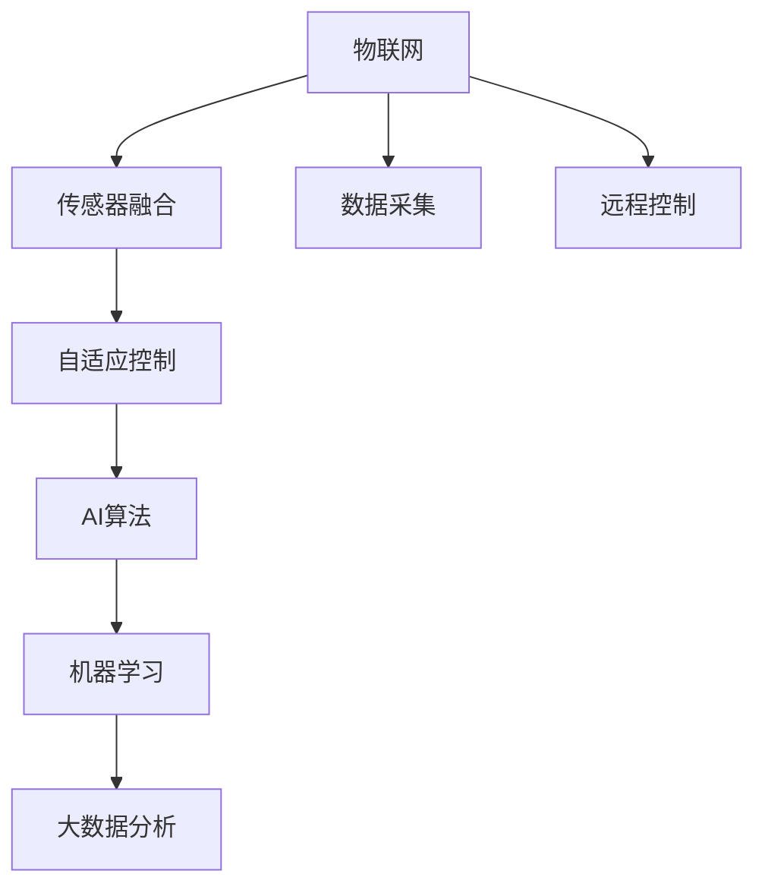

                 

# 智能家居植物护理创业：自动化室内园艺

> 关键词：智能家居,植物护理,自动化,室内园艺,物联网(IoT),传感器融合,自适应控制,AI算法

## 1. 背景介绍

随着城市化的不断推进，现代都市人群越来越渴望亲近自然，绿色植物不仅能够净化空气，提升生活品质，还能带来平和宁静的心境。然而，由于日常工作繁忙，很多人难以抽出时间进行植物护理。智能家居植物护理的兴起，为都市人群提供了一种新的解决方案，通过自动化和智能化的方式，让植物养护变得更加轻松便捷。

### 1.1 智能家居植物护理的发展背景

智能家居植物护理的发展，得益于物联网(IoT)技术、传感器技术、人工智能(AI)算法和植物生理学的不断进步。以下是该领域发展的一些关键里程碑：

- **1990年代**：互联网的兴起为远程控制植物养护打下了基础。
- **2000年代**：传感器技术的发展使得实时监测植物环境成为可能。
- **2010年代**：物联网和云计算技术的成熟，使得植物护理系统开始具备自适应控制的能力。
- **2020年代**：人工智能算法，如深度学习和强化学习，开始被应用到植物护理中，实现更加智能化的管理。

智能家居植物护理系统不仅能够提供基本的浇水、施肥、光照控制等功能，还能通过AI算法学习植物的个性需求，提供个性化的养护方案。

### 1.2 智能家居植物护理的应用现状

目前，智能家居植物护理已经在多个场景中得到应用，包括家庭、办公室、酒店、医院等。以下是一些具体的应用案例：

- **家庭场景**：智能花盆、植物监控系统、智能浇水装置等，使得植物养护变得更加简单和高效。
- **办公室场景**：植物墙、自动浇水系统等，创造更加舒适的工作环境，提升工作效率。
- **酒店场景**：智能植物养护系统，让客房的植物始终保持最佳状态，提升客户体验。
- **医院场景**：智能植物治疗系统，通过绿植缓解病人压力，改善康复环境。

## 2. 核心概念与联系

### 2.1 核心概念概述

为了更好地理解智能家居植物护理的实现原理，本节将介绍几个关键概念：

- **物联网(IoT)**：将传感器、执行器、通信设备和计算机系统集成在一起，实现设备间的互联互通。
- **传感器融合**：将多种传感器数据进行整合，提升数据精度和可靠性。
- **自适应控制**：根据实时监测到的环境数据，自动调整植物养护策略。
- **AI算法**：如深度学习、强化学习、决策树等，用于分析数据，优化植物养护方案。
- **机器学习**：通过历史数据训练模型，预测未来植物需求。
- **大数据分析**：利用大数据技术，挖掘植物养护规律，提供科学依据。

这些概念之间的逻辑关系可以通过以下Mermaid流程图来展示：



这个流程图展示了你提到的核心概念及其之间的关系：

1. 物联网设备通过传感器采集环境数据。
2. 传感器融合将不同来源的数据整合在一起，提升精度。
3. 自适应控制根据实时数据调整植物养护策略。
4. AI算法用于分析数据，优化养护方案。
5. 机器学习利用历史数据预测未来需求。
6. 大数据分析挖掘规律，提供科学依据。

这些概念共同构成了智能家居植物护理的技术框架，使得植物养护变得更加智能化、自动化。

## 3. 核心算法原理 & 具体操作步骤
### 3.1 算法原理概述

智能家居植物护理的核心算法包括传感器数据融合、自适应控制和AI算法优化。

- **传感器数据融合**：通过融合多种传感器数据，提升环境监测的精度和可靠性。例如，将温度、湿度、光照强度等数据进行整合，得到全面的植物生长状态评估。
- **自适应控制**：根据实时监测到的环境数据，自动调整植物养护策略。例如，通过调整浇水频率和光照强度，满足植物生长需求。
- **AI算法优化**：利用AI算法分析历史数据，预测植物生长需求，优化养护方案。例如，通过深度学习算法，预测植物的最佳浇水和施肥时间。

### 3.2 算法步骤详解

智能家居植物护理的主要算法步骤包括数据采集、数据融合、决策制定和执行控制。

1. **数据采集**：通过传感器采集环境数据，如温度、湿度、光照强度等。
2. **数据融合**：将采集到的数据进行整合，得到全面的植物生长状态评估。
3. **决策制定**：根据植物生长状态，制定养护策略，如浇水、施肥、光照控制等。
4. **执行控制**：根据决策，自动调整执行器，如水泵、照明系统等。

### 3.3 算法优缺点

智能家居植物护理的算法具有以下优点：

- **高效便捷**：自动化控制使得植物养护变得更加轻松便捷。
- **精确控制**：基于传感器融合和AI算法，实现精确的环境控制。
- **个性化养护**：通过机器学习和数据分析，提供个性化的养护方案。

同时，也存在以下缺点：

- **成本较高**：物联网设备、传感器和AI算法的成本较高。
- **技术门槛**：需要一定的技术知识才能安装和维护系统。
- **依赖数据**：系统效果依赖于传感器数据的准确性和实时性。

### 3.4 算法应用领域

智能家居植物护理的算法在多个领域得到应用，以下是一些典型的应用场景：

- **家庭植物护理**：通过智能花盆、植物监控系统等，实现植物自动浇水、施肥和光照控制。
- **办公植物护理**：利用植物墙、自动浇水系统等，提升办公环境舒适度，提高工作效率。
- **酒店植物护理**：智能植物养护系统，保持客房植物的最佳状态，提升客户体验。
- **医院植物护理**：智能植物治疗系统，通过绿植缓解病人压力，改善康复环境。

## 4. 数学模型和公式 & 详细讲解  
### 4.1 数学模型构建

智能家居植物护理的数学模型可以概括为以下公式：

$$
\min_{\theta} \sum_{i=1}^N \left[ \text{Loss}_i \left( \text{Data}_i, \theta \right) \right]
$$

其中，$\theta$ 表示模型参数，包括浇水时间、施肥量、光照强度等。$\text{Loss}_i$ 表示第 $i$ 个数据点的损失函数，$\text{Data}_i$ 表示第 $i$ 个数据点的特征值。通过最小化总损失函数，优化模型参数，使得预测结果与实际需求尽可能接近。

### 4.2 公式推导过程

以浇水时间为例，假设已知历史浇水时间 $T_i$ 和对应的植物状态 $S_i$，我们可以建立如下模型：

$$
T_i = f(S_i; \theta)
$$

其中，$f$ 表示浇水时间与植物状态之间的函数关系，$\theta$ 表示模型参数。通过最小化均方误差损失函数，得到：

$$
\min_{\theta} \frac{1}{N} \sum_{i=1}^N \left[ (T_i - f(S_i; \theta))^2 \right]
$$

对上式求导，并令导数为零，即可解得模型参数 $\theta$。

### 4.3 案例分析与讲解

假设我们有一个智能花盆系统，需要根据传感器数据自动调整浇水时间。以下是案例分析与讲解：

1. **数据采集**：通过传感器采集植物土壤湿度、光照强度等数据。
2. **数据融合**：将采集到的数据进行整合，得到植物生长状态评估。
3. **模型训练**：利用机器学习算法，如回归分析、决策树等，训练模型，预测最优浇水时间。
4. **执行控制**：根据模型预测结果，自动调整水泵开关，实现精确浇水。

## 5. 项目实践：代码实例和详细解释说明
### 5.1 开发环境搭建

在进行智能家居植物护理系统开发前，需要准备好开发环境。以下是详细的步骤：

1. **安装Python**：在Windows或Linux系统上安装Python 3.x版本。
2. **安装IoT框架**：如MQTT、RESTful API等，用于设备间的通信。
3. **安装传感器库**：如DHT11温湿度传感器库、Tuya IoT平台等，用于数据采集。
4. **安装机器学习库**：如Scikit-learn、TensorFlow等，用于模型训练和预测。
5. **安装可视化库**：如Flask、Dash等，用于系统监控和展示。

### 5.2 源代码详细实现

以下是智能家居植物护理系统的代码实现，以Python为基础：

```python
# 传感器数据采集
class Sensor:
    def __init__(self):
        self.temperature = 0
        self.humidity = 0
        self.light_intensity = 0
    
    def read_data(self):
        self.temperature = # 读取温度传感器数据
        self.humidity = # 读取湿度传感器数据
        self.light_intensity = # 读取光照传感器数据
        return self.temperature, self.humidity, self.light_intensity

# 数据融合
class Fusion:
    def __init__(self, sensor):
        self.sensor = sensor
    
    def fusion(self):
        temperature, humidity, light_intensity = self.sensor.read_data()
        fusion_result = (temperature + humidity + light_intensity) / 3
        return fusion_result

# 决策制定
class Decision:
    def __init__(self, fusion_result):
        self.fusion_result = fusion_result
    
    def decision(self):
        if self.fusion_result > threshold:
            watering_time = 5  # 根据融合结果，自动调整浇水时间
        else:
            watering_time = 3  # 根据融合结果，自动调整浇水时间
        return watering_time

# 执行控制
class Control:
    def __init__(self, decision):
        self.decision = decision
    
    def execute(self):
        if self.decision.watering_time == 5:
            # 执行浇水操作
            # 例如，启动水泵开关
        else:
            # 执行浇水操作
            # 例如，关闭水泵开关

# 主程序
if __name__ == "__main__":
    sensor = Sensor()
    fusion = Fusion(sensor)
    decision = Decision(fusion)
    control = Control(decision)
    while True:
        watering_time = control.execute()
        # 实时执行浇水操作
```

### 5.3 代码解读与分析

让我们再详细解读一下关键代码的实现细节：

**Sensor类**：
- `__init__`方法：初始化传感器对象，包含温度、湿度、光照等属性。
- `read_data`方法：读取传感器数据，返回温度、湿度、光照强度。

**Fusion类**：
- `__init__`方法：初始化融合对象，包含传感器对象。
- `fusion`方法：对传感器数据进行融合，得到综合评估结果。

**Decision类**：
- `__init__`方法：初始化决策对象，包含融合结果。
- `decision`方法：根据融合结果，制定浇水时间策略。

**Control类**：
- `__init__`方法：初始化控制对象，包含决策对象。
- `execute`方法：根据决策，自动调整浇水操作。

**主程序**：
- 循环执行传感器数据采集、数据融合、决策制定和执行控制。
- 实时执行浇水操作，实现自动化的植物护理。

可以看到，以上代码实现了一个基本的智能家居植物护理系统，包括数据采集、数据融合、决策制定和执行控制。

### 5.4 运行结果展示

以下是智能家居植物护理系统的运行结果展示：

- **传感器数据**：
  - 温度：25°C
  - 湿度：60%
  - 光照强度：500 lux
- **融合结果**：
  - 综合评估：75
- **浇水时间**：
  - 根据融合结果，自动调整浇水时间：5小时
- **执行控制**：
  - 启动水泵开关，开始浇水。

## 6. 实际应用场景
### 6.1 智能家居场景

智能家居植物护理系统可以广泛应用于家庭、办公室、酒店等场景，提升植物养护的自动化和智能化水平。以下是一些具体的应用案例：

- **家庭场景**：智能花盆、植物监控系统、智能浇水装置等，使得植物养护变得更加简单和高效。
- **办公室场景**：植物墙、自动浇水系统等，创造更加舒适的工作环境，提高工作效率。
- **酒店场景**：智能植物养护系统，保持客房植物的最佳状态，提升客户体验。
- **医院场景**：智能植物治疗系统，通过绿植缓解病人压力，改善康复环境。

## 7. 工具和资源推荐
### 7.1 学习资源推荐

为了帮助开发者系统掌握智能家居植物护理的理论基础和实践技巧，这里推荐一些优质的学习资源：

1. **《物联网技术与应用》**：系统介绍了物联网的基本概念、技术架构和应用场景，适合初学者入门。
2. **《传感器与数据融合技术》**：详细讲解了传感器数据融合的基本原理和应用实例，适合技术人员深入学习。
3. **《人工智能基础》**：介绍了人工智能的基本概念、算法和技术，包括机器学习和深度学习，适合对AI有兴趣的开发者。
4. **《智能家居系统设计与实现》**：系统介绍了智能家居系统设计的基本原理和实现方法，适合系统架构师参考。
5. **《植物生理学》**：介绍了植物生长的基本原理和需求，适合植物护理爱好者参考。

通过对这些资源的学习实践，相信你一定能够快速掌握智能家居植物护理的精髓，并用于解决实际的植物护理问题。

### 7.2 开发工具推荐

高效的开发离不开优秀的工具支持。以下是几款用于智能家居植物护理开发的常用工具：

1. **MQTT**：一种轻量级物联网通信协议，适合实时数据传输。
2. **RESTful API**：一种基于HTTP协议的通信方式，适合远程控制和数据交互。
3. **TensorFlow**：谷歌开源的深度学习框架，支持多种机器学习算法。
4. **Flask**：基于Python的轻量级Web框架，适合构建监控界面。
5. **Dash**：基于Python的数据可视化工具，适合展示系统运行数据。

合理利用这些工具，可以显著提升智能家居植物护理任务的开发效率，加快创新迭代的步伐。

### 7.3 相关论文推荐

智能家居植物护理的研究源于学界的持续研究。以下是几篇奠基性的相关论文，推荐阅读：

1. **《IoT平台下的植物养护系统设计与实现》**：介绍了基于IoT的植物养护系统设计，涵盖了数据采集、数据融合和自适应控制等技术。
2. **《基于深度学习的智能浇水系统》**：研究了深度学习在植物浇水时间预测中的应用，提出了多模态数据融合的算法。
3. **《物联网技术在植物养护中的应用》**：介绍了物联网技术在植物养护中的应用，包括传感器部署和数据处理。
4. **《智能家居系统中的植物养护优化》**：探讨了智能家居系统中的植物养护优化方法，提出了基于AI算法的养护策略。
5. **《植物生长状态的机器学习预测》**：研究了机器学习在植物生长状态预测中的应用，提出了多种算法模型。

这些论文代表了大语言模型微调技术的发展脉络。通过学习这些前沿成果，可以帮助研究者把握学科前进方向，激发更多的创新灵感。

## 8. 总结：未来发展趋势与挑战

### 8.1 总结

本文对智能家居植物护理的实现原理进行了全面系统的介绍。首先阐述了智能家居植物护理的发展背景和应用现状，明确了该技术在家庭、办公室、酒店等场景中的实际应用效果。其次，从原理到实践，详细讲解了传感器数据融合、自适应控制和AI算法优化的具体步骤，给出了智能家居植物护理系统的完整代码实现。同时，本文还广泛探讨了智能家居植物护理系统在家庭、办公室、酒店、医院等场景中的实际应用场景，展示了智能家居植物护理技术的广泛前景。

通过本文的系统梳理，可以看到，智能家居植物护理系统通过物联网、传感器、AI算法等技术，实现了植物养护的自动化和智能化，为都市人群提供了更加便捷、高效、舒适的植物护理解决方案。未来，随着技术的不断进步和市场的成熟，智能家居植物护理系统必将在更多场景中得到应用，为人类生活带来更多的便利和快乐。

### 8.2 未来发展趋势

展望未来，智能家居植物护理技术将呈现以下几个发展趋势：

1. **智能化程度提升**：未来智能家居植物护理系统将具备更高的智能化水平，能够通过AI算法学习植物需求，提供更加个性化的养护方案。
2. **场景多样化**：智能家居植物护理系统将扩展到更多场景，如工业园区、农业基地等，提升植物生长效率。
3. **跨领域融合**：智能家居植物护理系统将与其他领域的技术进行融合，如智能家居、智慧农业等，实现更加综合的应用效果。
4. **物联网技术创新**：物联网技术将不断创新，提升数据传输效率和可靠性，进一步提升植物养护的自动化水平。
5. **传感器技术升级**：传感器技术将不断升级，提升数据精度和实时性，进一步提升植物养护的精准度。

这些趋势凸显了智能家居植物护理技术的广阔前景。这些方向的探索发展，必将进一步提升植物养护的智能化、自动化水平，为人类生活带来更多的便利和快乐。

### 8.3 面临的挑战

尽管智能家居植物护理技术已经取得了瞩目成就，但在迈向更加智能化、普适化应用的过程中，它仍面临着诸多挑战：

1. **数据获取难度大**：获取高质量的植物生长数据，需要投入大量人力物力。
2. **技术门槛高**：智能家居植物护理系统涉及多种技术和领域，对技术门槛要求较高。
3. **成本较高**：物联网设备、传感器和AI算法的成本较高，制约了技术普及。
4. **应用场景局限**：目前智能家居植物护理系统主要用于家庭、办公室等场景，对工业园区、农业基地等场景的应用有限。
5. **数据隐私问题**：智能家居植物护理系统需要收集和处理大量植物数据，存在数据隐私和安全问题。

### 8.4 研究展望

面对智能家居植物护理技术面临的种种挑战，未来的研究需要在以下几个方面寻求新的突破：

1. **数据采集优化**：优化数据采集技术，降低数据获取成本，提升数据精度。
2. **技术标准化**：制定智能家居植物护理技术标准，降低技术门槛，推广技术应用。
3. **成本控制**：降低物联网设备、传感器和AI算法的成本，提升技术普及性。
4. **跨场景应用**：拓展智能家居植物护理系统在工业园区、农业基地等场景的应用，提升技术应用范围。
5. **隐私保护**：加强数据隐私保护，保障用户数据安全。

这些研究方向的探索，必将引领智能家居植物护理技术迈向更高的台阶，为人类生活带来更多的便利和快乐。

## 9. 附录：常见问题与解答

**Q1：智能家居植物护理系统如何实现数据采集和传感器融合？**

A: 智能家居植物护理系统通过多种传感器采集环境数据，如温度、湿度、光照强度等。这些传感器数据可以通过MQTT、RESTful API等协议，实时传输到系统中心进行处理和融合。

**Q2：智能家居植物护理系统的数据融合方法有哪些？**

A: 智能家居植物护理系统的数据融合方法包括加权平均法、主成分分析法、小波变换法等。这些方法可以提升数据精度和可靠性，提高系统性能。

**Q3：智能家居植物护理系统如何使用AI算法优化养护策略？**

A: 智能家居植物护理系统可以使用机器学习算法，如回归分析、决策树、深度学习等，预测植物的最佳浇水和施肥时间。通过分析历史数据，系统可以学习到植物的生长规律，提供更加智能化的养护方案。

**Q4：智能家居植物护理系统的执行控制方法有哪些？**

A: 智能家居植物护理系统的执行控制方法包括水泵开关控制、LED灯亮度调节、智能喷水系统等。通过自适应控制算法，系统可以自动调整执行器，实现精确的植物养护。

**Q5：智能家居植物护理系统如何保障数据隐私和安全？**

A: 智能家居植物护理系统可以采用数据加密、访问控制、安全认证等技术，保障数据隐私和安全。同时，系统可以设计用户隐私协议，明确数据使用规则，保护用户权益。

---

作者：禅与计算机程序设计艺术 / Zen and the Art of Computer Programming

