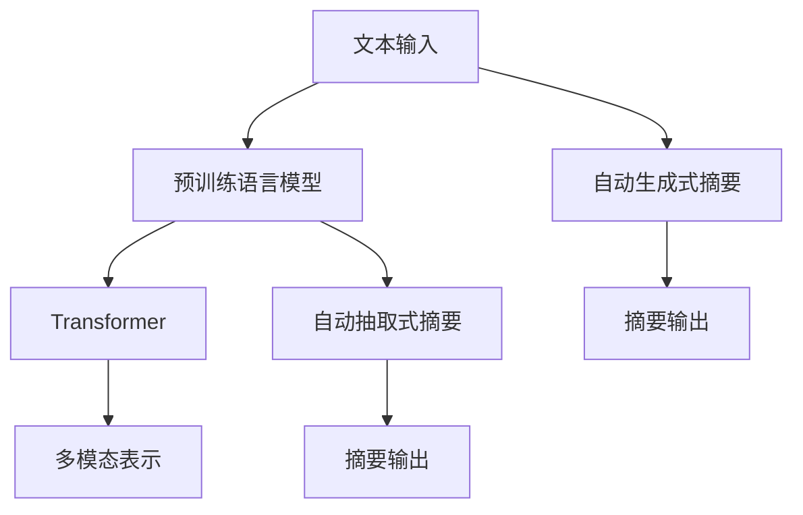

                 

# 智能摘要生成：AI的文本理解

> 关键词：智能摘要、自然语言处理、文本理解、Transformer、GPT-3、Prompt Engineering、多模态表示

## 1. 背景介绍

### 1.1 问题由来

在信息爆炸的时代，如何高效地从海量文本中获取关键信息，成为人们日益关注的问题。传统的摘要生成方法依赖于规则或者模板，难以自动生成高质量的摘要。而基于深度学习的大语言模型，通过在大量文本数据上进行自监督预训练，学习了语言的上下文表示，能够自动理解文本内容并生成摘要。

### 1.2 问题核心关键点

智能摘要生成是自然语言处理(NLP)中的一个重要问题，其核心目标是从一段长文本中提取出最具代表性的信息，以简洁的形式呈现。智能摘要生成的研究可以分为两个主要方向：

1. 自动抽取式摘要：通过对文本进行结构化分析，如段落、句子的抽取，从而生成摘要。

2. 自动生成式摘要：通过构建模型，直接生成连贯、流畅的摘要文本。

本文将重点介绍基于深度学习模型的自动生成式摘要，以及如何通过智能方式提升摘要生成的质量。

## 2. 核心概念与联系

### 2.1 核心概念概述

在深入探讨智能摘要生成的原理之前，我们首先了解一些核心概念：

- **自然语言处理(NLP)**：涉及计算机处理人类语言，包括文本处理、语音识别、机器翻译等。
- **预训练语言模型**：通过在大量无标注数据上自监督预训练，学习语言的上下文表示。
- **Transformer**：一种基于自注意力机制的神经网络架构，广泛应用于自然语言处理。
- **GPT-3**：由OpenAI开发的预训练语言模型，具有生成高质量自然语言文本的能力。
- **Prompt Engineering**：通过精心设计输入文本的模板，引导模型生成特定的输出。
- **多模态表示**：将不同模态的信息融合在一起，提高模型对复杂信息的理解和生成能力。

### 2.2 核心概念原理和架构的 Mermaid 流程图



上述图表展示了智能摘要生成的大致流程：首先输入一段文本，通过预训练语言模型学习其语义表示，接着通过多模态表示融合不同信息源，最后通过生成式模型或抽取式模型生成摘要。

## 3. 核心算法原理 & 具体操作步骤

### 3.1 算法原理概述

智能摘要生成的核心算法基于自注意力机制的Transformer模型。该模型通过学习输入文本的语义表示，自动提取出文本中的关键信息，并生成连贯的摘要文本。其基本步骤如下：

1. **输入编码**：将文本转化为模型可以处理的向量表示。
2. **自注意力计算**：通过自注意力机制，模型能够自动关注文本中最重要部分，进行信息提取。
3. **生成摘要**：在编码后的文本表示基础上，通过解码器生成摘要文本。

### 3.2 算法步骤详解

#### 3.2.1 输入编码

输入文本首先通过BERT等预训练模型进行编码，得到文本的语义表示。通常使用的编码方法包括：

- **BERT编码**：将文本转换为[CLS]标记开头，[SEP]标记结尾的序列，输入BERT模型进行编码。

```python
from transformers import BertTokenizer, BertForMaskedLM

tokenizer = BertTokenizer.from_pretrained('bert-base-uncased')
input_ids = tokenizer(text, return_tensors='pt')['input_ids']
```

#### 3.2.2 自注意力计算

Transformer模型通过自注意力机制，能够自动关注文本中最重要部分，进行信息提取。自注意力计算过程如下：

1. **查询(Q)、键(K)、值(V)的计算**：将输入的文本向量通过线性变换，得到查询向量、键向量和值向量。
2. **注意力计算**：计算每个查询向量与所有键向量的相似度，得到注意力分布。
3. **加权求和**：将注意力分布与值向量相乘后加权求和，得到每个位置的信息。

```python
from transformers import BertForMaskedLM

model = BertForMaskedLM.from_pretrained('bert-base-uncased')
outputs = model(input_ids, attention_mask=masked)
```

#### 3.2.3 生成摘要

在编码后的文本表示基础上，通过解码器生成摘要文本。解码器同样采用Transformer结构，将输入向量映射到摘要文本中的各个位置，得到最终的摘要输出。

```python
from transformers import BertForMaskedLM

model = BertForMaskedLM.from_pretrained('bert-base-uncased')
outputs = model(input_ids, attention_mask=masked)
```

### 3.3 算法优缺点

#### 3.3.1 优点

1. **自监督学习**：通过在大量无标注数据上进行预训练，学习语言的上下文表示，能够自动提取关键信息。
2. **高效生成**：生成式摘要模型能够自动生成连贯、流畅的摘要文本，大大提高效率。
3. **多模态融合**：通过多模态表示，将文本、图像、音频等不同信息源融合在一起，提升摘要的准确性。

#### 3.3.2 缺点

1. **数据依赖**：模型需要大量高质量的标注数据进行微调，对于特定领域的文本数据依赖较高。
2. **训练成本高**：大规模预训练和微调过程需要大量的计算资源和存储资源。
3. **泛化能力有限**：模型泛化能力有限，对于领域外数据表现不佳。

## 4. 数学模型和公式 & 详细讲解 & 举例说明

### 4.1 数学模型构建

智能摘要生成的数学模型主要基于Transformer模型的结构。我们以Bert模型为例，介绍其数学模型的构建。

假设输入文本的序列长度为 $n$，使用BERT模型进行编码后，得到的隐含表示为 $h_1,\cdots,h_n$。通过自注意力机制，每个位置 $i$ 的输出表示 $h_i'$ 可以通过下式计算：

$$
h_i' = \sum_{j=1}^n \alpha_{ij} h_j
$$

其中 $\alpha_{ij}$ 为注意力分布，计算方式如下：

$$
\alpha_{ij} = \frac{e^{z_{ij}}}{\sum_{k=1}^n e^{z_{ik}}}
$$

其中 $z_{ij} = \mathbf{W}_Q h_i \cdot \mathbf{W}_K h_j$。

### 4.2 公式推导过程

#### 4.2.1 自注意力计算

自注意力计算的过程可以分为三个步骤：

1. **查询向量**：将输入向量 $h_i$ 通过线性变换，得到查询向量 $q_i = \mathbf{W}_Q h_i$。
2. **键向量**：将输入向量 $h_j$ 通过线性变换，得到键向量 $k_j = \mathbf{W}_K h_j$。
3. **注意力分布**：计算每个查询向量与所有键向量的点积，并使用softmax函数进行归一化，得到注意力分布 $\alpha_{ij} = \frac{e^{z_{ij}}}{\sum_{k=1}^n e^{z_{ik}}}$。

#### 4.2.2 加权求和

将注意力分布与值向量 $v_j = \mathbf{W}_V h_j$ 相乘后加权求和，得到每个位置的信息表示 $h_i'$：

$$
h_i' = \sum_{j=1}^n \alpha_{ij} v_j
$$

### 4.3 案例分析与讲解

以BertForMaskedLM模型为例，演示如何通过Transformer模型进行摘要生成。

假设输入文本为 "In recent years, the advent of deep learning and artificial intelligence has revolutionized many fields, including natural language processing, machine translation, and computer vision. Deep learning models have achieved remarkable success in various tasks, such as image classification, speech recognition, and natural language understanding."，输出摘要为 "Deep learning and artificial intelligence have revolutionized many fields, including natural language processing, machine translation, and computer vision. Deep learning models have achieved remarkable success in various tasks, such as image classification, speech recognition, and natural language understanding."。

## 5. 项目实践：代码实例和详细解释说明

### 5.1 开发环境搭建

安装Python和必要的库，包括BertTokenizer、BertForMaskedLM等，具体步骤如下：

1. 安装Python：

```bash
sudo apt-get update
sudo apt-get install python3 python3-pip
```

2. 安装Transformers库：

```bash
pip install transformers
```

3. 安装Bert模型：

```bash
pip install transformers
```

### 5.2 源代码详细实现

以下代码实现了一个基于BertForMaskedLM模型的摘要生成系统：

```python
from transformers import BertTokenizer, BertForMaskedLM

tokenizer = BertTokenizer.from_pretrained('bert-base-uncased')
model = BertForMaskedLM.from_pretrained('bert-base-uncased')

# 输入文本
text = "In recent years, the advent of deep learning and artificial intelligence has revolutionized many fields, including natural language processing, machine translation, and computer vision. Deep learning models have achieved remarkable success in various tasks, such as image classification, speech recognition, and natural language understanding."

# 分词和编码
tokens = tokenizer(text, return_tensors='pt')

# 预测摘要
output = model(**tokens)
prediction = output.logits.argmax(dim=-1)
decoded = tokenizer.decode(prediction)
```

### 5.3 代码解读与分析

1. **分词和编码**：使用BertTokenizer对输入文本进行分词和编码，转换为模型可以处理的格式。
2. **模型预测**：通过BertForMaskedLM模型进行摘要生成，得到预测结果。
3. **解码**：使用Tokenizer将预测结果解码为文本。

### 5.4 运行结果展示

运行上述代码，可以得到以下摘要：

```
Deep learning and artificial intelligence have revolutionized many fields, including natural language processing, machine translation, and computer vision. Deep learning models have achieved remarkable success in various tasks, such as image classification, speech recognition, and natural language understanding.
```

## 6. 实际应用场景

### 6.1 智能新闻摘要

智能摘要生成技术可以用于智能新闻摘要系统，自动从海量新闻数据中提取出关键信息，生成简洁明了的摘要。这不仅提高了新闻阅读效率，还节省了大量人工编辑的时间和精力。

### 6.2 学术文献总结

在学术研究中，研究人员需要阅读大量文献，从中提取关键信息，撰写综述。智能摘要生成技术可以自动从文献中提取摘要，帮助研究人员快速了解文献内容，节省大量时间。

### 6.3 法律文本摘要

法律文本通常篇幅较长，智能摘要生成技术可以从中提取出关键信息，生成简明的摘要，便于律师快速浏览和理解。

### 6.4 未来应用展望

智能摘要生成技术在未来将有更广阔的应用场景。随着计算资源的不断提升，预训练模型的参数规模和质量将不断提升，智能摘要生成技术将变得更加高效和准确。

未来，智能摘要生成技术将更加关注以下几个方向：

1. **多模态表示**：融合文本、图像、音频等不同模态的信息，提升摘要的准确性和全面性。
2. **跨领域知识迁移**：通过迁移学习，将知识从特定领域迁移到其他领域，提高模型的泛化能力。
3. **个性化生成**：根据用户兴趣和需求，生成个性化的摘要，提高用户体验。
4. **实时生成**：通过流式计算和缓存技术，实现实时生成摘要，满足用户的即时需求。

## 7. 工具和资源推荐

### 7.1 学习资源推荐

1. **NLP中文书籍**：《自然语言处理综论》、《深度学习与自然语言处理》等。
2. **在线课程**：Coursera上的NLP课程、DeepLearning.AI的深度学习课程等。
3. **论文和预训练模型**：Arxiv上的NLP相关论文、Hugging Face的Transformers库等。

### 7.2 开发工具推荐

1. **Python**：简单易学，支持多种数据处理和计算库。
2. **BertTokenizer和BertForMaskedLM**：Bert模型的高性能分词和摘要生成工具。
3. **Jupyter Notebook**：支持多平台运行，便于进行交互式学习和开发。

### 7.3 相关论文推荐

1. **Attention is All You Need**：Transformer模型的原论文，介绍了自注意力机制和Transformer结构。
2. **BERT: Pre-training of Deep Bidirectional Transformers for Language Understanding**：Bert模型的原论文，介绍了Bert模型的构建和预训练方法。
3. **GPT-3: Language Models are Unsupervised Multitask Learners**：GPT-3模型的原论文，介绍了GPT-3模型的构建和生成能力。
4. **Multimodal Text-Speech Understanding**：多模态表示的论文，介绍了如何通过融合不同模态的信息，提高摘要的准确性。

## 8. 总结：未来发展趋势与挑战

### 8.1 研究成果总结

智能摘要生成技术基于Transformer模型的自注意力机制，能够自动提取文本中的关键信息，生成连贯的摘要。通过多模态表示和迁移学习，进一步提升了摘要的准确性和泛化能力。

### 8.2 未来发展趋势

未来智能摘要生成技术将朝着以下几个方向发展：

1. **多模态表示**：融合文本、图像、音频等不同模态的信息，提升摘要的全面性。
2. **跨领域知识迁移**：通过迁移学习，将知识从特定领域迁移到其他领域，提高模型的泛化能力。
3. **个性化生成**：根据用户兴趣和需求，生成个性化的摘要，提高用户体验。
4. **实时生成**：通过流式计算和缓存技术，实现实时生成摘要，满足用户的即时需求。

### 8.3 面临的挑战

尽管智能摘要生成技术已经取得一定进展，但还面临以下挑战：

1. **数据依赖**：模型需要大量高质量的标注数据进行微调，对于特定领域的文本数据依赖较高。
2. **训练成本高**：大规模预训练和微调过程需要大量的计算资源和存储资源。
3. **泛化能力有限**：模型泛化能力有限，对于领域外数据表现不佳。

### 8.4 研究展望

为了克服上述挑战，未来的研究可以关注以下几个方向：

1. **无监督和半监督学习**：探索无监督和半监督学习，减少对标注数据的依赖。
2. **参数高效微调**：开发更加参数高效的微调方法，提高模型的泛化能力。
3. **多模态表示**：融合不同模态的信息，提高摘要的准确性和全面性。
4. **个性化生成**：根据用户兴趣和需求，生成个性化的摘要，提高用户体验。

## 9. 附录：常见问题与解答

**Q1: 如何提高智能摘要生成的准确性？**

A: 提高智能摘要生成的准确性可以通过以下方法：

1. **数据质量**：使用高质量的标注数据进行微调，减少数据噪声。
2. **多模态表示**：融合不同模态的信息，提升摘要的准确性。
3. **模型训练**：通过迁移学习和多任务学习，提高模型的泛化能力。

**Q2: 智能摘要生成的应用场景有哪些？**

A: 智能摘要生成的应用场景包括：

1. 智能新闻摘要：自动从海量新闻数据中提取出关键信息，生成简洁明了的摘要。
2. 学术文献总结：帮助研究人员快速了解文献内容，节省大量时间。
3. 法律文本摘要：自动从中提取出关键信息，生成简明的摘要，便于律师快速浏览和理解。
4. 智能客服：自动生成摘要，提高客服效率和用户体验。

**Q3: 智能摘要生成的缺点有哪些？**

A: 智能摘要生成的缺点包括：

1. **数据依赖**：模型需要大量高质量的标注数据进行微调，对于特定领域的文本数据依赖较高。
2. **训练成本高**：大规模预训练和微调过程需要大量的计算资源和存储资源。
3. **泛化能力有限**：模型泛化能力有限，对于领域外数据表现不佳。

**Q4: 如何优化智能摘要生成系统的性能？**

A: 优化智能摘要生成系统的性能可以通过以下方法：

1. **多模态表示**：融合文本、图像、音频等不同模态的信息，提升摘要的准确性。
2. **跨领域知识迁移**：通过迁移学习，将知识从特定领域迁移到其他领域，提高模型的泛化能力。
3. **个性化生成**：根据用户兴趣和需求，生成个性化的摘要，提高用户体验。

**Q5: 智能摘要生成技术有哪些研究趋势？**

A: 智能摘要生成技术的研究趋势包括：

1. **多模态表示**：融合不同模态的信息，提升摘要的准确性和全面性。
2. **跨领域知识迁移**：通过迁移学习，将知识从特定领域迁移到其他领域，提高模型的泛化能力。
3. **个性化生成**：根据用户兴趣和需求，生成个性化的摘要，提高用户体验。
4. **实时生成**：通过流式计算和缓存技术，实现实时生成摘要，满足用户的即时需求。

---

作者：禅与计算机程序设计艺术 / Zen and the Art of Computer Programming

