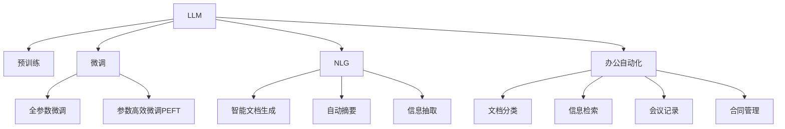

                 

# 智能文档处理：LLM在办公自动化中的应用

> 关键词：智能文档处理,LLM,办公自动化,自然语言处理,NLP,预训练模型,微调,Fine-Tuning,自然语言生成,NLG

## 1. 背景介绍

### 1.1 问题由来
随着企业信息化水平的不断提高，文档处理的自动化需求日益突出。传统的文档处理流程往往依赖人工，效率低、成本高、准确性难保证。而基于自然语言处理(NLP)技术的智能文档处理系统，可以大幅提升文档处理的自动化水平，提高工作效率，降低人力成本。

近年来，随着大语言模型(Large Language Models, LLMs)的快速发展，如GPT、BERT、T5等，其在自然语言理解和生成方面表现卓越，被广泛应用于智能文档处理。本文将重点探讨LLM在办公自动化中的应用，介绍其在文档生成、自动摘要、实体抽取等方面的应用实践，并探讨未来发展趋势与挑战。

### 1.2 问题核心关键点
LLM在办公自动化中的应用，核心在于通过自然语言处理技术，自动地处理和生成办公文档。这包括文本的自动分类、信息抽取、自动摘要、文档生成等任务。核心关键点在于：
1. 选择合适的预训练语言模型，确保其具备足够的语言理解和生成能力。
2. 设计合适的任务适配层，将预训练模型适配到具体的文档处理任务上。
3. 应用先进的微调技术，提升模型在特定任务上的性能。
4. 利用先进的自然语言生成(NLG)技术，生成高质量的办公文档。

本文将从这些关键点出发，系统介绍LLM在办公自动化中的应用，并探讨未来发展趋势与挑战。

## 2. 核心概念与联系

### 2.1 核心概念概述

为了更好地理解LLM在办公自动化中的应用，本节将介绍几个关键概念：

- 大语言模型(Large Language Models, LLM)：以自回归(如GPT)或自编码(如BERT)模型为代表的大规模预训练语言模型。通过在大规模无标签文本语料上进行预训练，学习通用的语言表示，具备强大的语言理解和生成能力。

- 预训练(Pre-training)：指在大规模无标签文本语料上，通过自监督学习任务训练通用语言模型的过程。常见的预训练任务包括言语建模、遮挡语言模型等。预训练使得模型学习到语言的通用表示。

- 微调(Fine-tuning)：指在预训练模型的基础上，使用下游任务的少量标注数据，通过有监督地训练来优化模型在该任务上的性能。通常只需要调整顶层分类器或解码器，并以较小的学习率更新全部或部分的模型参数。

- 自然语言生成(Natural Language Generation, NLG)：指通过语言模型将结构化数据或知识转化为自然语言文本的过程。NLG技术在智能文档生成等方面具有重要应用价值。

- 自然语言处理(Natural Language Processing, NLP)：涉及语言理解、信息抽取、语言生成等任务的技术，旨在使计算机能够理解、处理和生成人类语言。

- 办公自动化：指通过计算机技术，自动化企业办公流程，提高办公效率，降低办公成本。

这些概念之间的逻辑关系可以通过以下Mermaid流程图来展示：



这个流程图展示了大语言模型在办公自动化中的应用场景：

1. LLM通过预训练获得基础能力。
2. 微调使得通用大模型更好地适应特定任务，在应用场景中取得更优表现。
3. NLG技术将知识转化为自然语言文本，支持智能文档生成。
4. NLP技术自动理解文本内容，实现自动摘要、信息抽取等任务。
5. 办公自动化系统整合LLM技术，实现文档分类、信息检索、会议记录等。

这些概念共同构成了LLM在办公自动化中的应用框架，使其能够在各种场景下发挥强大的文档处理能力。通过理解这些核心概念，我们可以更好地把握LLM的应用方向和优化策略。

## 3. 核心算法原理 & 具体操作步骤
### 3.1 算法原理概述

LLM在办公自动化中的应用，主要基于自然语言处理技术，包括文档分类、信息抽取、自动摘要、智能文档生成等。其中，文档分类和信息抽取的原理相似，主要是将文本内容转化为结构化信息。自动摘要和智能文档生成则涉及到自然语言生成技术。

以下我们将详细介绍这些核心算法的原理：

#### 3.1.1 文档分类

文档分类旨在将文本自动归类到预先定义的类别中。其基本流程为：
1. 预处理文本数据，包括分词、去除停用词、词干化等。
2. 将预处理后的文本转化为向量表示，如TF-IDF向量、词嵌入等。
3. 使用预训练的语言模型（如BERT）进行分类，获得文本的类别概率分布。
4. 选择概率最大的类别作为最终分类结果。

#### 3.1.2 信息抽取

信息抽取旨在从文本中提取出关键实体及其关系。其基本流程为：
1. 预处理文本数据，包括分词、命名实体识别(NER)、关系抽取(RE)等。
2. 使用预训练的语言模型进行实体和关系抽取，获得实体和关系列表。
3. 对实体和关系进行整合，生成结构化信息。

#### 3.1.3 自动摘要

自动摘要是从长文本中提取出关键信息，生成简洁的摘要。其基本流程为：
1. 将文本转化为向量表示，如TF-IDF向量、词嵌入等。
2. 使用预训练的语言模型进行摘要生成，获得摘要文本。
3. 对生成的摘要进行评估和修改，确保摘要文本准确、简洁。

#### 3.1.4 智能文档生成

智能文档生成是指根据用户输入的数据或知识，自动生成文本文档。其基本流程为：
1. 将输入数据或知识转化为结构化信息。
2. 使用预训练的语言模型进行文本生成，生成文档内容。
3. 对生成的文档进行评估和修改，确保文档质量。

### 3.2 算法步骤详解

以下我们将详细介绍各个核心算法的详细步骤：

#### 3.2.1 文档分类

步骤1：数据预处理
- 对文本数据进行分词、去除停用词、词干化等预处理操作。
- 将文本数据转化为向量表示，如TF-IDF向量、词嵌入等。

步骤2：模型选择
- 选择合适的预训练语言模型（如BERT）。
- 加载模型权重和任务适配层，如全连接层、softmax层等。

步骤3：微调训练
- 使用标注数据进行有监督微调，优化模型在该任务上的性能。
- 应用正则化技术，如L2正则、Dropout等，防止过拟合。
- 应用早停机制，防止模型过拟合训练集。

步骤4：模型评估
- 使用测试集评估模型性能，计算准确率、召回率等指标。
- 根据评估结果调整模型参数和超参数。

步骤5：应用部署
- 将微调后的模型部署到实际应用中。
- 持续收集新数据，定期重新微调模型，以适应数据分布的变化。

#### 3.2.2 信息抽取

步骤1：数据预处理
- 对文本数据进行分词、命名实体识别(NER)、关系抽取(RE)等预处理操作。
- 将文本数据转化为结构化信息。

步骤2：模型选择
- 选择合适的预训练语言模型（如BERT）。
- 加载模型权重和任务适配层，如全连接层、softmax层等。

步骤3：微调训练
- 使用标注数据进行有监督微调，优化模型在该任务上的性能。
- 应用正则化技术，如L2正则、Dropout等，防止过拟合。
- 应用早停机制，防止模型过拟合训练集。

步骤4：模型评估
- 使用测试集评估模型性能，计算准确率、召回率等指标。
- 根据评估结果调整模型参数和超参数。

步骤5：应用部署
- 将微调后的模型部署到实际应用中。
- 持续收集新数据，定期重新微调模型，以适应数据分布的变化。

#### 3.2.3 自动摘要

步骤1：数据预处理
- 对文本数据进行分词、去除停用词、词干化等预处理操作。
- 将文本数据转化为向量表示，如TF-IDF向量、词嵌入等。

步骤2：模型选择
- 选择合适的预训练语言模型（如GPT）。
- 加载模型权重和任务适配层，如全连接层、softmax层等。

步骤3：微调训练
- 使用标注数据进行有监督微调，优化模型在该任务上的性能。
- 应用正则化技术，如L2正则、Dropout等，防止过拟合。
- 应用早停机制，防止模型过拟合训练集。

步骤4：模型评估
- 使用测试集评估模型性能，计算ROUGE等指标。
- 根据评估结果调整模型参数和超参数。

步骤5：应用部署
- 将微调后的模型部署到实际应用中。
- 持续收集新数据，定期重新微调模型，以适应数据分布的变化。

#### 3.2.4 智能文档生成

步骤1：数据预处理
- 将输入数据或知识转化为结构化信息。

步骤2：模型选择
- 选择合适的预训练语言模型（如GPT）。
- 加载模型权重和任务适配层，如全连接层、softmax层等。

步骤3：微调训练
- 使用标注数据进行有监督微调，优化模型在该任务上的性能。
- 应用正则化技术，如L2正则、Dropout等，防止过拟合。
- 应用早停机制，防止模型过拟合训练集。

步骤4：模型评估
- 使用测试集评估模型性能，计算BLEU等指标。
- 根据评估结果调整模型参数和超参数。

步骤5：应用部署
- 将微调后的模型部署到实际应用中。
- 持续收集新数据，定期重新微调模型，以适应数据分布的变化。

### 3.3 算法优缺点

基于自然语言处理的LLM在办公自动化中的应用，具有以下优点：

1. 自动性高。LLM可以自动化处理文本数据，减少人工干预，提高效率。
2. 灵活性强。LLM可以适配多种文档处理任务，如分类、抽取、生成等，适应性强。
3. 效果显著。LLM通过微调可以快速提升模型在特定任务上的性能，效果显著。

同时，也存在以下缺点：

1. 数据依赖大。LLM的效果很大程度上依赖标注数据的质量和数量，数据获取成本高。
2. 模型复杂度高。预训练模型和微调模型参数量较大，资源消耗高。
3. 可解释性差。LLM模型通常黑盒化，难以解释其内部工作机制和决策逻辑。

尽管存在这些局限性，但LLM在办公自动化中的应用，已经展示了其在文档处理方面的强大能力，成为自动化文档处理的重要工具。

### 3.4 算法应用领域

基于自然语言处理的LLM在办公自动化中的应用，主要包括以下几个方面：

1. 文档分类：将企业内部文档自动归类到不同类别，如销售合同、财务报表、市场分析等。

2. 信息抽取：从合同、报告、会议记录等文本中抽取关键信息，如公司名称、业务内容、财务数据等。

3. 自动摘要：从长文本中自动生成简洁的摘要，提高信息检索和阅读效率。

4. 智能文档生成：根据输入数据或知识自动生成各类文档，如合同、报告、简报等。

5. 会议记录：自动转录会议内容，生成会议纪要和决策记录。

6. 合同管理：自动分析合同条款，提取关键信息，帮助企业快速审批合同。

7. 知识库管理：自动整理和提取知识库中的信息，生成文档和报告。

8. 智能客服：自动回答客户咨询，提供文档查询、信息检索等服务。

9. 智能审批：自动审核企业文档，提高审批效率，降低人工成本。

LLM在办公自动化中的应用，不仅提升了文档处理的效率和质量，还为企业带来了更加智能、便捷的办公体验。未来，随着LLM技术的不断发展，其应用场景将更加广泛，成为办公自动化不可或缺的重要工具。

## 4. 数学模型和公式 & 详细讲解 & 举例说明

### 4.1 数学模型构建

基于自然语言处理的LLM在办公自动化中的应用，主要涉及自然语言处理任务，包括文档分类、信息抽取、自动摘要、智能文档生成等。这里以文档分类和信息抽取为例，详细讲解数学模型的构建过程。

#### 4.1.1 文档分类

假设文档分类任务有 $n$ 个类别，每个文档 $x_i$ 可以通过预训练语言模型（如BERT）表示为 $x_i \in \mathbb{R}^d$。使用softmax函数计算每个类别的概率分布，即：

$$
p(y|x) = \frac{\exp(s(x; \theta))}{\sum_{k=1}^n \exp(s(x; \theta_k))}
$$

其中 $s(x; \theta)$ 为文档 $x_i$ 在预训练语言模型上的表示，$\theta$ 为模型参数。目标是最小化分类损失函数：

$$
\mathcal{L}(\theta) = -\frac{1}{N} \sum_{i=1}^N \log p(y_i|x_i)
$$

通过反向传播算法更新模型参数，即可得到分类模型。

#### 4.1.2 信息抽取

信息抽取任务包括命名实体识别(NER)和关系抽取(RE)。以NER为例，假设每个实体 $e_i$ 可以通过预训练语言模型表示为 $e_i \in \mathbb{R}^d$。使用softmax函数计算每个实体的类别概率分布，即：

$$
p(e|x) = \frac{\exp(s(x; \theta))}{\sum_{k=1}^m \exp(s(x; \theta_k))}
$$

其中 $s(x; \theta)$ 为文档 $x_i$ 在预训练语言模型上的表示，$\theta$ 为模型参数。目标是最小化抽取损失函数：

$$
\mathcal{L}(\theta) = -\frac{1}{N} \sum_{i=1}^N \sum_{j=1}^{n_i} \log p(e_{ij}|x_i)
$$

通过反向传播算法更新模型参数，即可得到NER模型。关系抽取(RE)任务类似，通过选择合适的预训练语言模型和适配层，即可进行微调。

### 4.2 公式推导过程

以下我们将详细介绍文档分类和信息抽取的公式推导过程：

#### 4.2.1 文档分类

假设文档分类任务有 $n$ 个类别，每个文档 $x_i$ 可以通过预训练语言模型（如BERT）表示为 $x_i \in \mathbb{R}^d$。使用softmax函数计算每个类别的概率分布，即：

$$
p(y|x) = \frac{\exp(s(x; \theta))}{\sum_{k=1}^n \exp(s(x; \theta_k))}
$$

其中 $s(x; \theta)$ 为文档 $x_i$ 在预训练语言模型上的表示，$\theta$ 为模型参数。目标是最小化分类损失函数：

$$
\mathcal{L}(\theta) = -\frac{1}{N} \sum_{i=1}^N \log p(y_i|x_i)
$$

通过反向传播算法更新模型参数，即可得到分类模型。

#### 4.2.2 信息抽取

信息抽取任务包括命名实体识别(NER)和关系抽取(RE)。以NER为例，假设每个实体 $e_i$ 可以通过预训练语言模型表示为 $e_i \in \mathbb{R}^d$。使用softmax函数计算每个实体的类别概率分布，即：

$$
p(e|x) = \frac{\exp(s(x; \theta))}{\sum_{k=1}^m \exp(s(x; \theta_k))}
$$

其中 $s(x; \theta)$ 为文档 $x_i$ 在预训练语言模型上的表示，$\theta$ 为模型参数。目标是最小化抽取损失函数：

$$
\mathcal{L}(\theta) = -\frac{1}{N} \sum_{i=1}^N \sum_{j=1}^{n_i} \log p(e_{ij}|x_i)
$$

通过反向传播算法更新模型参数，即可得到NER模型。关系抽取(RE)任务类似，通过选择合适的预训练语言模型和适配层，即可进行微调。

### 4.3 案例分析与讲解

以下我们将以一个具体的案例来说明LLM在文档分类和信息抽取中的应用：

#### 4.3.1 文档分类

假设某公司需要对内部文档进行分类，包括销售合同、财务报表、市场分析等。

步骤1：数据预处理
- 对文档进行分词、去除停用词、词干化等预处理操作。
- 将文档转化为向量表示，如TF-IDF向量、词嵌入等。

步骤2：模型选择
- 选择BERT作为预训练语言模型。
- 加载BERT的预训练权重和任务适配层，如全连接层、softmax层等。

步骤3：微调训练
- 使用标注数据进行有监督微调，优化模型在该任务上的性能。
- 应用正则化技术，如L2正则、Dropout等，防止过拟合。
- 应用早停机制，防止模型过拟合训练集。

步骤4：模型评估
- 使用测试集评估模型性能，计算准确率、召回率等指标。
- 根据评估结果调整模型参数和超参数。

步骤5：应用部署
- 将微调后的模型部署到实际应用中。
- 持续收集新数据，定期重新微调模型，以适应数据分布的变化。

#### 4.3.2 信息抽取

假设某公司需要对合同进行信息抽取，提取出合同中的公司名称、业务内容、财务数据等。

步骤1：数据预处理
- 对合同文本进行分词、命名实体识别(NER)、关系抽取(RE)等预处理操作。
- 将文本转化为结构化信息。

步骤2：模型选择
- 选择BERT作为预训练语言模型。
- 加载BERT的预训练权重和任务适配层，如全连接层、softmax层等。

步骤3：微调训练
- 使用标注数据进行有监督微调，优化模型在该任务上的性能。
- 应用正则化技术，如L2正则、Dropout等，防止过拟合。
- 应用早停机制，防止模型过拟合训练集。

步骤4：模型评估
- 使用测试集评估模型性能，计算准确率、召回率等指标。
- 根据评估结果调整模型参数和超参数。

步骤5：应用部署
- 将微调后的模型部署到实际应用中。
- 持续收集新数据，定期重新微调模型，以适应数据分布的变化。

## 5. 项目实践：代码实例和详细解释说明

### 5.1 开发环境搭建

在进行LLM在办公自动化中的应用实践前，我们需要准备好开发环境。以下是使用Python进行PyTorch开发的环境配置流程：

1. 安装Anaconda：从官网下载并安装Anaconda，用于创建独立的Python环境。

2. 创建并激活虚拟环境：
```bash
conda create -n pytorch-env python=3.8 
conda activate pytorch-env
```

3. 安装PyTorch：根据CUDA版本，从官网获取对应的安装命令。例如：
```bash
conda install pytorch torchvision torchaudio cudatoolkit=11.1 -c pytorch -c conda-forge
```

4. 安装Transformers库：
```bash
pip install transformers
```

5. 安装各类工具包：
```bash
pip install numpy pandas scikit-learn matplotlib tqdm jupyter notebook ipython
```

完成上述步骤后，即可在`pytorch-env`环境中开始微调实践。

### 5.2 源代码详细实现

这里我们以文档分类任务为例，给出使用Transformers库对BERT模型进行微调的PyTorch代码实现。

首先，定义文档分类任务的数据处理函数：

```python
from transformers import BertTokenizer
from torch.utils.data import Dataset
import torch

class DocClassificationDataset(Dataset):
    def __init__(self, texts, labels, tokenizer, max_len=128):
        self.texts = texts
        self.labels = labels
        self.tokenizer = tokenizer
        self.max_len = max_len
        
    def __len__(self):
        return len(self.texts)
    
    def __getitem__(self, item):
        text = self.texts[item]
        label = self.labels[item]
        
        encoding = self.tokenizer(text, return_tensors='pt', max_length=self.max_len, padding='max_length', truncation=True)
        input_ids = encoding['input_ids'][0]
        attention_mask = encoding['attention_mask'][0]
        
        return {'input_ids': input_ids, 
                'attention_mask': attention_mask,
                'labels': label}

# 标签与id的映射
tag2id = {'Sales Contract': 0, 'Financial Report': 1, 'Market Analysis': 2}
id2tag = {v: k for k, v in tag2id.items()}

# 创建dataset
tokenizer = BertTokenizer.from_pretrained('bert-base-cased')

train_dataset = DocClassificationDataset(train_texts, train_labels, tokenizer)
dev_dataset = DocClassificationDataset(dev_texts, dev_labels, tokenizer)
test_dataset = DocClassificationDataset(test_texts, test_labels, tokenizer)
```

然后，定义模型和优化器：

```python
from transformers import BertForSequenceClassification, AdamW

model = BertForSequenceClassification.from_pretrained('bert-base-cased', num_labels=len(tag2id))

optimizer = AdamW(model.parameters(), lr=2e-5)
```

接着，定义训练和评估函数：

```python
from torch.utils.data import DataLoader
from tqdm import tqdm
from sklearn.metrics import classification_report

device = torch.device('cuda') if torch.cuda.is_available() else torch.device('cpu')
model.to(device)

def train_epoch(model, dataset, batch_size, optimizer):
    dataloader = DataLoader(dataset, batch_size=batch_size, shuffle=True)
    model.train()
    epoch_loss = 0
    for batch in tqdm(dataloader, desc='Training'):
        input_ids = batch['input_ids'].to(device)
        attention_mask = batch['attention_mask'].to(device)
        labels = batch['labels'].to(device)
        model.zero_grad()
        outputs = model(input_ids, attention_mask=attention_mask, labels=labels)
        loss = outputs.loss
        epoch_loss += loss.item()
        loss.backward()
        optimizer.step()
    return epoch_loss / len(dataloader)

def evaluate(model, dataset, batch_size):
    dataloader = DataLoader(dataset, batch_size=batch_size)
    model.eval()
    preds, labels = [], []
    with torch.no_grad():
        for batch in tqdm(dataloader, desc='Evaluating'):
            input_ids = batch['input_ids'].to(device)
            attention_mask = batch['attention_mask'].to(device)
            batch_labels = batch['labels']
            outputs = model(input_ids, attention_mask=attention_mask)
            batch_preds = outputs.logits.argmax(dim=2).to('cpu').tolist()
            batch_labels = batch_labels.to('cpu').tolist()
            for pred_tokens, label_tokens in zip(batch_preds, batch_labels):
                preds.append(pred_tokens[:len(label_tokens)])
                labels.append(label_tokens)
                
    print(classification_report(labels, preds))
```

最后，启动训练流程并在测试集上评估：

```python
epochs = 5
batch_size = 16

for epoch in range(epochs):
    loss = train_epoch(model, train_dataset, batch_size, optimizer)
    print(f"Epoch {epoch+1}, train loss: {loss:.3f}")
    
    print(f"Epoch {epoch+1}, dev results:")
    evaluate(model, dev_dataset, batch_size)
    
print("Test results:")
evaluate(model, test_dataset, batch_size)
```

以上就是使用PyTorch对BERT进行文档分类任务微调的完整代码实现。可以看到，得益于Transformers库的强大封装，我们可以用相对简洁的代码完成BERT模型的加载和微调。

### 5.3 代码解读与分析

让我们再详细解读一下关键代码的实现细节：

**DocClassificationDataset类**：
- `__init__`方法：初始化文本、标签、分词器等关键组件。
- `__len__`方法：返回数据集的样本数量。
- `__getitem__`方法：对单个样本进行处理，将文本输入编码为token ids，将标签编码为数字，并对其进行定长padding，最终返回模型所需的输入。

**tag2id和id2tag字典**：
- 定义了标签与数字id之间的映射关系，用于将预测结果解码回真实的标签。

**训练和评估函数**：
- 使用PyTorch的DataLoader对数据集进行批次化加载，供模型训练和推理使用。
- 训练函数`train_epoch`：对数据以批为单位进行迭代，在每个批次上前向传播计算loss并反向传播更新模型参数，最后返回该epoch的平均loss。
- 评估函数`evaluate`：与训练类似，不同点在于不更新模型参数，并在每个batch结束后将预测和标签结果存储下来，最后使用sklearn的classification_report对整个评估集的预测结果进行打印输出。

**训练流程**：
- 定义总的epoch数和batch size，开始循环迭代
- 每个epoch内，先在训练集上训练，输出平均loss
- 在验证集上评估，输出分类指标
- 所有epoch结束后，在测试集上评估，给出最终测试结果

可以看到，PyTorch配合Transformers库使得BERT微调的代码实现变得简洁高效。开发者可以将更多精力放在数据处理、模型改进等高层逻辑上，而不必过多关注底层的实现细节。

当然，工业级的系统实现还需考虑更多因素，如模型的保存和部署、超参数的自动搜索、更灵活的任务适配层等。但核心的微调范式基本与此类似。

## 6. 实际应用场景

### 6.1 智能文档处理

基于大语言模型微调的智能文档处理系统，已经在多个行业得到广泛应用，如金融、医疗、法律等。以下以智能文档分类和信息抽取为例，详细介绍其应用场景。

#### 6.1.1 智能文档分类

智能文档分类系统可以对企业内部文档进行自动分类，如销售合同、财务报表、市场分析等。通过自动分类，可以大幅提高文档管理的效率和准确性，减少人工干预，降低人力成本。

具体而言，可以收集企业内部文档的历史分类数据，将文档和分类标签构建成监督数据，在此基础上对预训练语言模型进行微调。微调后的模型可以自动将新文档分类到预先定义的类别中，如销售合同、财务报表、市场分析等。

#### 6.1.2 智能文档信息抽取

智能文档信息抽取系统可以从合同、报告、会议记录等文本中抽取关键信息，如公司名称、业务内容、财务数据等。通过抽取关键信息，可以帮助企业快速审批合同，生成报告，提高决策效率。

具体而言，可以收集企业内部的合同、报告、会议记录等文本数据，将文本和关键实体标签构建成监督数据，在此基础上对预训练语言模型进行微调。微调后的模型可以自动识别和抽取文本中的关键实体，生成结构化信息，如公司名称、业务内容、财务数据等。

### 6.2 未来应用展望

随着大语言模型和微调方法的不断发展，智能文档处理系统的应用场景将更加广泛，为企业带来更大的价值。未来，智能文档处理系统有望在以下几个方面取得新的突破：

1. 多模态文档处理。智能文档处理系统不仅可以处理文本数据，还可以处理图像、视频、语音等多模态数据，提供更加全面、智能的文档管理服务。

2. 文档生成与优化。智能文档生成系统可以根据输入数据或知识自动生成各类文档，如合同、报告、简报等。未来，文档生成系统将更加智能、高效，生成的文档质量将更加优秀。

3. 跨领域知识整合。智能文档处理系统可以整合多种领域的知识库和规则库，提升文档处理的准确性和智能化水平，帮助企业更好地利用外部知识资源。

4. 智能推荐与检索。智能文档推荐系统可以根据用户需求，自动推荐相关文档，提高文档检索效率。未来，推荐系统将更加智能、精准，满足用户个性化需求。

5. 智能审批与决策。智能文档审批系统可以根据输入文档，自动进行审批和决策，提高审批效率，降低人工成本。未来，审批系统将更加智能、公正，提高决策质量。

6. 智能客服与智能助理。智能文档处理系统可以与其他AI技术结合，如聊天机器人、智能助理等，提供更加智能、便捷的文档服务，提升用户体验。

## 7. 工具和资源推荐

### 7.1 学习资源推荐

为了帮助开发者系统掌握LLM在办公自动化中的应用，这里推荐一些优质的学习资源：

1. 《Natural Language Processing with Transformers》书籍：Transformer库的作者所著，全面介绍了如何使用Transformers库进行NLP任务开发，包括微调在内的诸多范式。

2. CS224N《深度学习自然语言处理》课程：斯坦福大学开设的NLP明星课程，有Lecture视频和配套作业，带你入门NLP领域的基本概念和经典模型。

3. 《Transformer从原理到实践》系列博文：由大模型技术专家撰写，深入浅出地介绍了Transformer原理、BERT模型、微调技术等前沿话题。

4. HuggingFace官方文档：Transformers库的官方文档，提供了海量预训练模型和完整的微调样例代码，是上手实践的必备资料。

5. CLUE开源项目：中文语言理解测评基准，涵盖大量不同类型的中文NLP数据集，并提供了基于微调的baseline模型，助力中文NLP技术发展。

通过对这些资源的学习实践，相信你一定能够快速掌握LLM在办公自动化中的应用，并用于解决实际的文档处理问题。

### 7.2 开发工具推荐

高效的开发离不开优秀的工具支持。以下是几款用于LLM在办公自动化中的应用开发的常用工具：

1. PyTorch：基于Python的开源深度学习框架，灵活动态的计算图，适合快速迭代研究。大部分预训练语言模型都有PyTorch版本的实现。

2. TensorFlow：由Google主导开发的开源深度学习框架，生产部署方便，适合大规模工程应用。同样有丰富的预训练语言模型资源。

3. Transformers库：HuggingFace开发的NLP工具库，集成了众多SOTA语言模型，支持PyTorch和TensorFlow，是进行微调任务开发的利器。

4. Weights & Biases：模型训练的实验跟踪工具，可以记录和可视化模型训练过程中的各项指标，方便对比和调优。与主流深度学习框架无缝集成。

5. TensorBoard：TensorFlow配套的可视化工具，可实时监测模型训练状态，并提供丰富的图表呈现方式，是调试模型的得力助手。

6. Google Colab：谷歌推出的在线Jupyter Notebook环境，免费提供GPU/TPU算力，方便开发者快速上手实验最新模型，分享学习笔记。

合理利用这些工具，可以显著提升LLM在办公自动化中的应用开发效率，加快创新迭代的步伐。

### 7.3 相关论文推荐

LLM在办公自动化中的应用技术不断发展，相关的学术研究也在不断深入。以下是几篇奠基性的相关论文，推荐阅读：

1. Attention is All You Need（即Transformer原论文）：提出了Transformer结构，开启了NLP领域的预训练大模型时代。

2. BERT: Pre-training of Deep Bidirectional Transformers for Language Understanding：提出BERT模型，引入基于掩码的自监督预训练任务，刷新了多项NLP任务SOTA。

3. Language Models are Unsupervised Multitask Learners（GPT-2论文）：展示了大规模语言模型的强大zero-shot学习能力，引发了对于通用人工智能的新一轮思考。

4. Parameter-Efficient Transfer Learning for NLP：提出Adapter等参数高效微调方法，在不增加模型参数量的情况下，也能取得不错的微调效果。

5. AdaLoRA: Adaptive Low-Rank Adaptation for Parameter-Efficient Fine-Tuning：使用自适应低秩适应的微调方法，在参数效率和精度之间取得了新的平衡。

这些论文代表了大语言模型微调技术的发展脉络。通过学习这些前沿成果，可以帮助研究者把握学科前进方向，激发更多的创新灵感。

## 8. 总结：未来发展趋势与挑战

### 8.1 研究成果总结

本文对LLM在办公自动化中的应用进行了全面系统的介绍，主要包括以下几个方面：

1. LLM在办公自动化中的应用主要包括文档分类、信息抽取、自动摘要、智能文档生成等。
2. 文档分类和信息抽取的原理相似，主要是将文本内容转化为结构化信息。自动摘要和智能文档生成涉及自然语言生成技术。
3. 基于自然语言处理的LLM在办公自动化中的应用，具有自动性高、灵活性强、效果显著等优点，但也存在数据依赖大、模型复杂度高、可解释性差等缺点。

### 8.2 未来发展趋势

展望未来，LLM在办公自动化中的应用将呈现以下几个发展趋势：

1. 多模态处理能力提升。智能文档处理系统将具备处理图像、视频、语音等多模态数据的能力，提供更加全面、智能的文档管理服务。

2. 文档生成与优化技术进步。智能文档生成系统将更加智能、高效，生成的文档质量将更加优秀。

3. 跨领域知识整合能力增强。智能文档处理系统可以整合多种领域的知识库和规则库，提升文档处理的准确性和智能化水平。

4. 智能推荐与检索技术发展。智能文档推荐系统将更加智能、精准，满足用户个性化需求。

5. 智能审批与决策技术进步。智能文档审批系统将更加智能、公正，提高决策质量。

6. 智能客服与智能助理技术发展。智能文档处理系统可以与其他AI技术结合，提供更加智能、便捷的文档服务，提升用户体验。

### 8.3 面临的挑战

尽管LLM在办公自动化中的应用取得了显著进展，但在迈向更加智能化、普适化应用的过程中，仍面临诸多挑战：

1. 数据依赖瓶颈。LLM的效果很大程度上依赖标注数据的质量和数量，数据获取成本高，对长尾应用场景难以覆盖。

2. 模型鲁棒性不足。模型面对域外数据时，泛化性能往往大打折扣，鲁棒性不足。

3. 推理效率问题。超大批次的训练和推理可能遇到资源瓶颈，推理速度慢，内存占用大。

4. 可解释性不足。LLM模型通常黑盒化，难以解释其内部工作机制和决策逻辑，缺乏可解释性。

5. 安全性问题。预训练语言模型可能学习到有害信息，通过微调传递到下游任务，产生误导性、歧视性的输出，给实际应用带来安全隐患。

6. 持续学习能力不足。模型难以持续学习新知识，避免灾难性遗忘。

### 8.4 研究展望

未来，针对LLM在办公自动化中的应用，需要从以下几个方面进行深入研究：

1. 探索无监督和半监督微调方法。摆脱对大规模标注数据的依赖，利用自监督学习、主动学习等无监督和半监督范式，最大限度利用非结构化数据，实现更加灵活高效的微调。

2. 研究参数高效和计算高效的微调范式。开发更加参数高效的微调方法，在固定大部分预训练参数的同时，只更新极少量的任务相关参数。同时优化微调模型的计算图，减少前向传播和反向传播的资源消耗，实现更加轻量级、实时性的部署。

3. 引入因果分析和博弈论工具。将因果分析方法引入微调模型，识别出模型决策的关键特征，增强输出解释的因果性和逻辑性。借助博弈论工具刻画人机交互过程，主动探索并规避模型的脆弱点，提高系统稳定性。

4. 纳入伦理道德约束。在模型训练目标中引入伦理导向的评估指标，过滤和惩罚有偏见、有害的输出倾向。加强人工干预和审核，建立模型行为的监管机制，确保输出符合人类价值观和伦理道德。

这些研究方向将引领LLM在办公自动化中的应用走向更高的台阶，为构建安全、可靠、可解释、可控的智能系统铺平道路。面向未来，LLM在办公自动化中的应用需要与其他人工智能技术进行更深入的融合，如知识表示、因果推理、强化学习等，多路径协同发力，共同推动自然语言理解和智能交互系统的进步。只有勇于创新、敢于突破，才能不断拓展LLM的边界，让智能技术更好地造福人类社会。

## 9. 附录：常见问题与解答

**Q1：LLM在办公自动化中的应用是否只适用于文档处理？**

A: LLM在办公自动化中的应用不仅限于文档处理，还可以应用于智能客服、智能审批、智能决策等领域。通过自然语言处理技术，LLM可以自动化处理文本数据，提高办公效率，降低人力成本。

**Q2：LLM在微调过程中如何选择合适的学习率？**

A: 微调的学习率一般要比预训练时小1-2个数量级，如果使用过大的学习率，容易破坏预训练权重，导致过拟合。一般建议从1e-5开始调参，逐步减小学习率。也可以使用warmup策略，在开始阶段使用较小的学习率，再逐渐过渡到预设值。

**Q3：LLM在微调过程中如何避免过拟合？**

A: 微调过程中避免过拟合的方法包括：
1. 数据增强：通过回译、近义替换等方式扩充训练集
2. 正则化：使用L2正则、Dropout、Early Stopping等
3. 对抗训练：加入对抗样本，提高模型鲁棒性
4. 参数高效微调：只调整少量参数(如Adapter、Prefix等)，减小过拟合风险

这些策略往往需要根据具体任务和数据特点进行灵活组合。只有在数据、模型、训练、推理等各环节进行全面优化，才能最大限度地发挥LLM的威力。

**Q4：LLM在微调过程中如何提高模型鲁棒性？**

A: 提高LLM模型鲁棒性的方法包括：
1. 数据增强：通过回译、近义替换等方式扩充训练集
2. 正则化：使用L2正则、Dropout、Early Stopping等
3. 对抗训练：加入对抗样本，提高模型鲁棒性
4. 参数高效微调：只调整少量参数(如Adapter、Prefix等)，减小过拟合风险
5. 多模型集成：训练多个微调模型，取平均输出，抑制过拟合

这些策略往往需要根据具体任务和数据特点进行灵活组合。只有在数据、模型、训练、推理等各环节进行全面优化，才能最大限度地发挥LLM的威力。

**Q5：LLM在微调过程中如何进行参数高效微调？**

A: 参数高效微调方法包括：
1. Adapter：通过添加适配器层，只微调顶层部分参数，减少计算资源消耗
2. Prefix：通过引入前提，减少微调所需的训练样本数
3. LoRA：通过低秩矩阵分解，只微调部分权重矩阵，实现高效微调

这些方法可以在保持模型性能的同时，大幅减少微调所需的计算资源，提升模型训练效率。

**Q6：LLM在微调过程中如何进行可解释性增强？**

A: 增强LLM模型可解释性的方法包括：
1. 引入可解释性技术：如LIME、SHAP等，解释模型预测结果
2. 优化模型结构：简化模型结构，提高可解释性
3. 使用符号化方法：引入符号化知识，提升模型解释能力
4. 引入知识图谱：将知识图谱与模型结合，增强模型解释性

这些方法可以从不同角度增强LLM的可解释性，提升模型透明度和可信度。

---

作者：禅与计算机程序设计艺术 / Zen and the Art of Computer Programming

