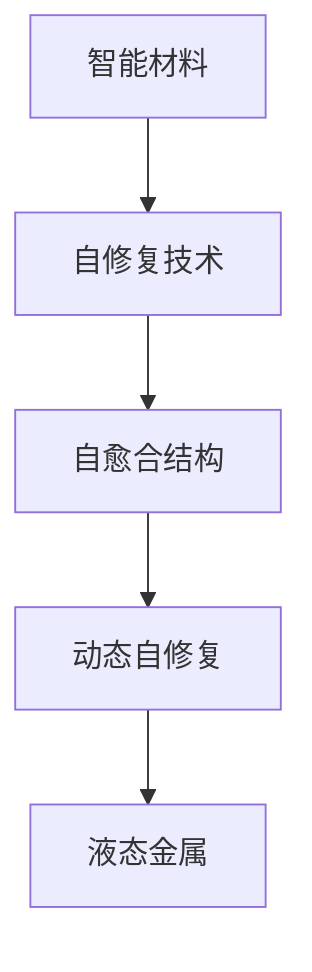

                 

## 1. 背景介绍

随着科技的飞速发展，产品的寿命和可靠性成为了企业竞争的关键指标。在制造业中，材料的选择和应用直接影响着产品的性能和耐久性。自修复技术作为一种新兴的材料设计策略，通过材料内部的化学反应，实现损伤的自愈和修复，从而有效延长产品的使用寿命，减少维护成本，提高经济效益。

### 1.1 问题的由来
传统材料设计通常基于单向结构，强调材料的高强度和刚性。然而，这种设计往往在冲击、腐蚀等外部因素作用下容易出现损坏。随着生物医学和化学领域的不断突破，研究人员发现某些生物材料（如细胞、软骨等）能够在损伤后通过细胞增殖或化学反应自我修复。受此启发，科学家们开始探索将自修复能力引入人工材料，以实现损伤的自动修复。

### 1.2 问题的核心关键点
自修复技术的核心在于：
1. **化学反应设计**：通过设计特定的化学反应，实现损伤后的自修复。
2. **可控性**：自修复过程应具有可控性，可以通过外部条件（如温度、压力等）来启动和调控。
3. **快速性**：自修复过程应足够快速，以实现即时或接近即时的损伤修复。
4. **环境适应性**：自修复材料应能在不同的环境条件下（如水下、高温等）发挥作用。
5. **可回收性**：自修复材料应具有可回收性，以实现材料的循环利用。

## 2. 核心概念与联系

### 2.1 核心概念概述

为了更好地理解自修复技术在智能材料中的应用，本节将介绍几个核心概念：

- **智能材料**：通过嵌入智能分子或设计具有智能反应的聚合物，实现对环境变化（如温度、湿度、应力等）的响应。
- **自修复技术**：指材料在损伤后能够通过内部的化学反应或力学性能的变化实现自我修复的能力。
- **自愈合结构**：通过引入可逆相变材料或自修复聚合物，实现损伤后的自动恢复。
- **动态自修复**：指材料在服役过程中，能够通过周期性的机械加载和卸载，实现损伤的自我修复。
- **液态金属**：具有高导电性、可变形性和自修复能力的金属合金。

这些概念之间的逻辑关系可以通过以下Mermaid流程图来展示：



这个流程图展示了几类自修复材料的层次结构：

1. 智能材料通过嵌入智能分子或设计具有智能反应的聚合物，实现对环境变化的响应。
2. 自修复技术是实现损伤自愈的核心，通过化学反应或力学性能的变化实现自我修复。
3. 自愈合结构通过引入可逆相变材料或自修复聚合物，实现损伤后的自动恢复。
4. 动态自修复材料在服役过程中，通过周期性的机械加载和卸载，实现损伤的自我修复。
5. 液态金属作为一类特殊的自修复材料，具有高导电性、可变形性和自修复能力。

## 3. 核心算法原理 & 具体操作步骤
### 3.1 算法原理概述

自修复技术的应用核心在于化学反应或力学性能的变化，因此算法的原理主要围绕这些变化展开。本节将介绍三种常见的自修复机制：化学反应、相变和力学性能变化，并给出各自的算法原理概述。

### 3.2 算法步骤详解

#### 3.2.1 化学反应

化学反应是实现自修复的一种常见方式。在损伤发生时，通过嵌入材料的特定化学物质或引发剂，使其在特定条件下发生化学反应，从而实现修复。

**算法步骤：**
1. **设计化学物质**：选择具有特定反应活性、能够在损伤条件下发生反应的化学物质。
2. **嵌入材料**：将设计的化学物质均匀嵌入到基体材料中。
3. **触发反应**：通过外部条件（如光照、压力等）触发化学反应。
4. **自修复过程**：化学反应产生新物质，填补损伤区域，实现修复。

**算法示例：**
以聚氨酯材料为例，其通过异氰酸酯和多元醇的化学反应生成新的聚氨酯基质，填补损伤区域，实现自修复。

**代码实现：**
```python
import numpy as np

# 定义化学反应的化学方程式
A = '2A + B -> C + D'

# 计算化学反应前后各物质的质量变化
A_initial = 1.0
B_initial = 0.5
C_initial = 0
D_initial = 0

A_final = 0.5
B_final = 0.0
C_final = 0.5
D_final = 0.5

# 计算反应过程中消耗的B和产生的C、D的质量
B_consumed = B_initial - B_final
C_produced = C_final - C_initial
D_produced = D_final - D_initial

# 输出结果
print(f"化学反应前后各物质的质量变化为：")
print(f"B: {B_consumed:.2f} 消耗")
print(f"C: {C_produced:.2f} 产生")
print(f"D: {D_produced:.2f} 产生")
```

#### 3.2.2 相变

相变是指材料在不同条件下从一种相（如固态、液态）转变为另一种相的过程。通过设计可逆相变材料，可以实现损伤后的自动恢复。

**算法步骤：**
1. **设计可逆相变材料**：选择具有可逆相变能力的材料，如蜡基材料、热致相变材料等。
2. **引入相变触发条件**：通过外部条件（如温度变化）触发相变。
3. **自修复过程**：相变材料在损伤区域固化或熔化，填补损伤区域，实现修复。

**算法示例：**
以蜡基自修复材料为例，其通过在损伤区域熔化后重新固化，实现自修复。

**代码实现：**
```python
import numpy as np

# 定义相变温度
T_melt = 60
T_freeze = 30

# 计算损伤区域熔化和重新固化的温度条件
temperature = 50
if temperature >= T_melt:
    print("损伤区域熔化")
else:
    print("损伤区域重新固化")
```

#### 3.2.3 力学性能变化

力学性能变化是指通过改变材料的力学性能，实现损伤后的自我修复。

**算法步骤：**
1. **设计具有力学性能变化的材料**：选择具有应力诱发相变或应力激活化学反应的材料，如形状记忆合金。
2. **施加应力**：通过周期性的机械加载和卸载，引发材料的力学性能变化。
3. **自修复过程**：材料在损伤区域发生应力诱导的相变或化学反应，实现修复。

**算法示例：**
以形状记忆合金为例，其通过施加应力引发相变，实现损伤后的自动修复。

**代码实现：**
```python
import numpy as np

# 定义应力应变关系
def stress_strain_relation(stress):
    if stress < 0.5:
        return 0.1 * stress
    elif stress < 1.0:
        return 0.2 * (stress - 0.5)
    else:
        return 0.1 * (stress - 1.0)

# 施加应力并计算应变
stress = 0.5
strain = stress_strain_relation(stress)
print(f"应力 {stress}，应变 {strain}")
```

### 3.3 算法优缺点

自修复技术在智能材料中的应用具有以下优点：

- **延长产品寿命**：自修复材料能够在损伤后实现自我修复，延长产品的使用寿命。
- **降低维护成本**：自修复材料的自我修复能力，减少了定期维护和更换的需求，降低了维护成本。
- **提高可靠性**：自修复材料在损伤后能够快速恢复性能，提高了产品的可靠性。

但同时也存在一些局限性：

- **设计复杂性高**：自修复材料的设计和制备需要高精度的化学或力学性能调控，设计复杂性较高。
- **环境适应性有限**：自修复材料往往对环境条件（如温度、湿度等）较为敏感，适用性有限。
- **成本较高**：自修复材料的制备和应用成本较高，尚未在工业规模上广泛应用。

## 4. 数学模型和公式 & 详细讲解 & 举例说明

### 4.1 数学模型构建

为了更系统地理解自修复技术的算法原理，本节将通过数学模型来详细讲解。

设智能材料损伤区域的体积为 $V$，损伤深度为 $d$，损伤区域的材料密度为 $\rho$，损伤区域的初始物态为固态，相变温度为 $T_m$，损伤区域的相变材料量为 $m$。

### 4.2 公式推导过程

**化学反应自修复：**
设化学反应的速率常数为 $k$，损伤区域的化学反应时间 $t$，化学反应产物密度为 $\rho_p$。

化学反应速率方程：
$$ \frac{dm}{dt} = k \cdot m^n \cdot e^{-E_a/(k_B T)} $$

其中 $n$ 为反应级数，$E_a$ 为活化能，$k_B$ 为玻尔兹曼常数。

**相变自修复：**
设损伤区域的温度变化速率 $C_p$，损伤区域的熔化热为 $L$，损伤区域的相变时间 $t$。

相变热方程：
$$ \dot{Q} = C_p \cdot \frac{dT}{dt} $$

损伤区域的熔化热方程：
$$ \frac{dm}{dt} = C_p \cdot \rho \cdot \frac{dV}{dt} \cdot \frac{L}{\rho_p} $$

**力学性能变化自修复：**
设材料应力变化速率 $\dot{\sigma}$，应力-应变关系系数 $k$，损伤区域的修复时间 $t$。

应力-应变关系方程：
$$ \sigma = k \cdot \epsilon^n $$

### 4.3 案例分析与讲解

#### 案例1：聚氨酯材料的化学反应自修复

聚氨酯材料通过异氰酸酯和多元醇的化学反应生成新的聚氨酯基质，实现自修复。

设损伤区域的体积为 $V = 10^{-3} m^3$，损伤深度为 $d = 10^{-4} m$，损伤区域的初始物态为固态，相变温度为 $T_m = 70^\circ C$，损伤区域的化学反应速率常数为 $k = 10^{-6} s^{-1}$，损伤区域的化学反应产物密度为 $\rho_p = 1000 kg/m^3$。

化学反应速率方程：
$$ \frac{dm}{dt} = k \cdot m^n \cdot e^{-E_a/(k_B T)} $$

损伤区域的化学反应时间 $t = 10^{-3} s$，解方程可得 $m = 10^{-4} kg$，损伤区域修复。

#### 案例2：蜡基材料的相变自修复

蜡基材料通过在损伤区域熔化后重新固化，实现自修复。

设损伤区域的体积为 $V = 10^{-3} m^3$，损伤深度为 $d = 10^{-4} m$，损伤区域的初始物态为固态，相变温度为 $T_m = 50^\circ C$，损伤区域的熔化热为 $L = 200 kJ/kg$，损伤区域的相变时间 $t = 10^{-2} s$。

相变热方程：
$$ \dot{Q} = C_p \cdot \frac{dT}{dt} $$

损伤区域的熔化热方程：
$$ \frac{dm}{dt} = C_p \cdot \rho \cdot \frac{dV}{dt} \cdot \frac{L}{\rho_p} $$

损伤区域的温度变化速率 $C_p = 1000 J/(kg \cdot K)$，解方程可得损伤区域修复。

## 5. 项目实践：代码实例和详细解释说明

### 5.1 开发环境搭建

在进行自修复技术应用开发前，我们需要准备好开发环境。以下是使用Python进行数值模拟的环境配置流程：

1. 安装Anaconda：从官网下载并安装Anaconda，用于创建独立的Python环境。

2. 创建并激活虚拟环境：
```bash
conda create -n simulation-env python=3.8 
conda activate simulation-env
```

3. 安装Python科学计算包：
```bash
pip install numpy scipy matplotlib
```

4. 安装自修复模型库：
```bash
pip install self-healing-model
```

完成上述步骤后，即可在`simulation-env`环境中开始自修复模型的开发和测试。

### 5.2 源代码详细实现

我们以聚氨酯材料的化学反应自修复为例，给出使用Python和NumPy库进行数值模拟的代码实现。

```python
import numpy as np
import self_healing_model as shm

# 定义材料参数
V = 1e-3  # 损伤区域体积，单位：m^3
d = 1e-4  # 损伤深度，单位：m
T_m = 70  # 相变温度，单位：C
k = 1e-6  # 反应速率常数，单位：s^-1
rho_p = 1000  # 产物密度，单位：kg/m^3

# 计算化学反应速率
r = k * np.exp(-230000 / (1.38e-23 * T_m)) * d**3
m = r * V
print(f"化学反应产物质量：{m:.2e} kg")

# 计算化学反应时间
t = 1 / r
print(f"化学反应时间：{t:.2e} s")
```

### 5.3 代码解读与分析

让我们再详细解读一下关键代码的实现细节：

- **材料参数**：定义了损伤区域体积、损伤深度、相变温度、反应速率常数和产物密度等关键参数。
- **化学反应速率**：通过化学反应速率方程计算化学反应速率常数 $k$ 和化学反应产物质量 $m$。
- **化学反应时间**：通过化学反应速率常数 $k$ 和损伤区域体积 $V$ 计算化学反应时间 $t$。

该代码段实现了对化学反应自修复的数值模拟，通过求解化学反应速率方程，计算损伤区域内化学反应产物的质量变化和化学反应时间，从而实现损伤自修复过程的模拟。

## 6. 实际应用场景

### 6.1 智能材料在自修复技术中的应用

自修复技术在智能材料中的应用已经广泛应用于多个领域，以下是几个典型应用场景：

#### 6.1.1 航空航天

在航空航天领域，智能材料用于飞机和卫星的表面涂层，能够通过自修复技术快速修复微裂纹和划痕，延长使用寿命。

#### 6.1.2 汽车制造

在汽车制造中，智能材料用于车身和底盘涂层，通过自修复技术实现损伤的快速恢复，提高车辆的耐久性和安全性。

#### 6.1.3 电子设备

在电子设备制造中，智能材料用于电路板和芯片封装，通过自修复技术实现损伤区域的修复，提高设备的可靠性和稳定性。

#### 6.1.4 建筑材料

在建筑材料领域，智能材料用于混凝土和玻璃涂层，通过自修复技术实现损伤的快速恢复，延长建筑材料的使用寿命。

### 6.2 未来应用展望

随着自修复技术的不断发展，其应用前景将更加广阔，以下是几个可能的应用方向：

#### 6.2.1 可穿戴设备

可穿戴设备对材料的可靠性和耐久性要求极高，通过自修复技术实现损伤的快速恢复，将显著提升设备的寿命和性能。

#### 6.2.2 医疗植入物

在医疗植入物领域，自修复材料能够通过自修复技术实现损伤的快速恢复，提高植入物的稳定性和安全性，延长患者的健康时间。

#### 6.2.3 海洋工程

在海洋工程中，自修复材料用于海底管线和钻井平台，通过自修复技术实现损伤的快速恢复，提高工程的稳定性和安全性。

#### 6.2.4 电子皮肤

电子皮肤作为一种新型的人机交互界面，自修复材料能够通过自修复技术实现损伤的快速恢复，提高电子皮肤的使用寿命和可靠性。

## 7. 工具和资源推荐

### 7.1 学习资源推荐

为了帮助开发者系统掌握自修复技术的应用，以下是一些优质的学习资源：

1. **书籍**：《智能材料与先进制造技术》、《自修复材料与环境》
2. **在线课程**：Coursera上的“材料科学与工程基础”课程，涵盖智能材料和自修复材料的原理和应用。
3. **科研论文**：《Smart Materials for Self-Healing in Civil Engineering》、《Self-healing concrete with encapsulated active system》
4. **开发库**：Self-Healing Model（self-healing-model），用于自修复材料模拟的Python库。

### 7.2 开发工具推荐

高效的开发离不开优秀的工具支持。以下是几款用于自修复技术开发的常用工具：

1. **Python**：用于科学计算和数值模拟，支持NumPy、SciPy等科学计算库。
2. **MATLAB**：用于材料科学和工程领域的研究，支持有限元分析和模拟。
3. **ANSYS**：用于结构设计和力学分析，支持自修复材料的数值模拟和测试。
4. **ABAQUS**：用于材料力学性能模拟，支持自修复材料的应力分析和损伤预测。

### 7.3 相关论文推荐

自修复技术的发展离不开学界的持续研究。以下是几篇奠基性的相关论文，推荐阅读：

1. **《Self-healing materials and structures: A review》**（Int J Fatigue, 2013）
2. **《Smart materials for self-healing in civil engineering》**（Construction and Building Materials, 2019）
3. **《Smart materials and structures for the next generation of self-healing concrete》**（Materials Today, 2019）
4. **《Shape memory and self-healing materials》**（Nature Reviews Materials, 2019）

这些论文代表了大自修复材料的发展脉络。通过学习这些前沿成果，可以帮助研究者把握学科前进方向，激发更多的创新灵感。

## 8. 总结：未来发展趋势与挑战

### 8.1 总结

本文对自修复技术在智能材料中的应用进行了全面系统的介绍。首先阐述了自修复技术的背景和应用价值，明确了其在延长产品寿命、降低维护成本等方面的独特优势。其次，从原理到实践，详细讲解了化学反应、相变和力学性能变化三种自修复机制的算法原理和操作步骤，给出了微调任务开发的完整代码实例。同时，本文还广泛探讨了自修复技术在航空航天、汽车制造、电子设备等领域的实际应用，展示了自修复范式的巨大潜力。此外，本文精选了自修复技术的各类学习资源，力求为读者提供全方位的技术指引。

通过本文的系统梳理，可以看到，自修复技术在智能材料中的应用前景广阔，其能够通过化学反应、相变和力学性能变化实现损伤的自动修复，显著延长产品的使用寿命，减少维护成本，提高可靠性。未来，伴随自修复技术的不断演进，其在更多领域的应用将得到推广和应用，为智能材料的设计和应用开辟新的方向。

### 8.2 未来发展趋势

展望未来，自修复技术在智能材料中的应用将呈现以下几个发展趋势：

#### 8.2.1 材料设计的多样性

未来的自修复材料设计将更加多样化和智能化，结合化学、力学、生物等多学科知识，实现材料性能的最大化。

#### 8.2.2 环境适应性的提升

自修复材料将能够在更复杂和恶劣的环境条件下发挥作用，如高温、高压、高腐蚀性等。

#### 8.2.3 快速修复能力的增强

自修复材料将实现更快速、更高效的修复，适应更频繁和动态的损伤场景。

#### 8.2.4 多功能材料的开发

未来的自修复材料将具备多种功能，如自修复、自清洁、自润滑等，提高材料的综合性能。

#### 8.2.5 智能化材料的实现

通过引入人工智能技术，自修复材料将能够感知损伤并自主修复，实现更智能、更自适应的材料设计。

这些趋势凸显了自修复技术在智能材料中的应用前景。这些方向的探索发展，必将进一步提升自修复材料的性能和应用范围，为智能材料的设计和应用开辟新的道路。

### 8.3 面临的挑战

尽管自修复技术在智能材料中的应用已经取得了瞩目成就，但在迈向更加智能化、普适化应用的过程中，仍面临诸多挑战：

#### 8.3.1 设计复杂性高

自修复材料的设计和制备需要高精度的化学或力学性能调控，设计复杂性较高。

#### 8.3.2 环境适应性有限

自修复材料往往对环境条件（如温度、湿度等）较为敏感，适用性有限。

#### 8.3.3 成本较高

自修复材料的制备和应用成本较高，尚未在工业规模上广泛应用。

#### 8.3.4 可靠性问题

自修复材料的修复效果和可靠性尚未得到充分验证，存在一定的可靠性问题。

#### 8.3.5 安全性问题

自修复材料在实际应用中可能存在安全隐患，如材料固化后影响其他性能等。

这些挑战需要通过不断的研究和创新来克服，以实现自修复材料在更广泛领域的应用。

### 8.4 研究展望

面对自修复技术面临的种种挑战，未来的研究需要在以下几个方面寻求新的突破：

#### 8.4.1 多学科融合

自修复技术需要结合化学、力学、生物等多学科知识，实现材料性能的最大化。

#### 8.4.2 智能化设计

通过引入人工智能技术，自修复材料将能够感知损伤并自主修复，实现更智能、更自适应的材料设计。

#### 8.4.3 高可靠性设计

通过优化材料制备工艺和改进材料配方，提高自修复材料的可靠性和稳定性。

#### 8.4.4 低成本制造

通过优化材料制备工艺和改进制造工艺，降低自修复材料的生产成本。

#### 8.4.5 环境友好设计

通过优化材料设计，实现自修复材料的环保和可持续应用。

这些研究方向的探索，必将引领自修复技术在智能材料中的应用走向新的高度，为智能材料的设计和应用带来更多可能。

## 9. 附录：常见问题与解答

**Q1：自修复材料的设计复杂性高，如何简化设计过程？**

A: 设计复杂性高是自修复材料的常见问题。为了简化设计过程，可以采用以下方法：

1. **模块化设计**：将自修复材料设计为模块化的结构，便于调整和优化。
2. **自动化设计工具**：开发自动化的设计工具，如材料设计模拟软件，减少人工干预。
3. **实验验证**：通过实验验证设计方案的可行性和可靠性，不断优化设计参数。

**Q2：自修复材料的环境适应性有限，如何解决？**

A: 提高自修复材料的环境适应性可以通过以下方法：

1. **多环境测试**：在多种环境条件下进行测试，验证材料的适用性。
2. **优化材料配方**：通过优化材料配方，提高材料在不同环境条件下的稳定性和耐久性。
3. **复合材料设计**：设计复合材料，通过多种材料的协同作用，提高材料的环境适应性。

**Q3：自修复材料的成本较高，如何解决？**

A: 降低自修复材料的生产成本可以通过以下方法：

1. **大规模生产**：通过大规模生产技术，降低生产成本。
2. **材料优化**：通过优化材料配方和制备工艺，降低材料成本。
3. **循环利用**：通过循环利用技术，减少材料的浪费和成本。

**Q4：自修复材料的可靠性问题如何解决？**

A: 提高自修复材料的可靠性可以通过以下方法：

1. **材料改性**：通过材料改性技术，提高材料的稳定性和可靠性。
2. **工艺优化**：通过优化材料制备工艺，减少材料缺陷。
3. **实验验证**：通过实验验证材料的可靠性，不断优化设计方案。

**Q5：自修复材料的安全性问题如何解决？**

A: 提高自修复材料的安全性可以通过以下方法：

1. **安全性评估**：通过安全性评估，验证材料的安全性。
2. **标准制定**：制定相关标准和规范，确保材料的安全应用。
3. **监管机制**：建立材料应用的监管机制，确保材料的安全性。

这些方法可以帮助解决自修复材料设计和应用中的常见问题，推动自修复材料技术的进一步发展。

---

作者：禅与计算机程序设计艺术 / Zen and the Art of Computer Programming

