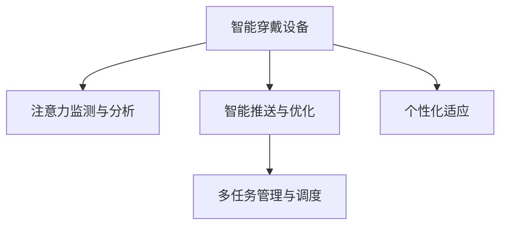

                 

# 智能穿戴设备与注意力管理

在数字化时代的浪潮中，智能穿戴设备（Smart Wearables）已经逐渐走入大众视野，成为连接人机交互的新桥梁。这些设备通过各种传感器和处理器，实时捕捉用户的生理、环境数据，提供个性化的健康管理、运动追踪、工作辅助等服务。然而，面对纷繁复杂的使用场景，如何有效管理用户的注意力，最大化智能穿戴设备的使用价值，成为当下亟待解决的挑战。本文将从智能穿戴设备与注意力管理的内在联系出发，全面梳理相关概念和技术原理，并通过实际项目案例，深入探讨注意力管理在智能穿戴设备中的应用实践。

## 1. 背景介绍

### 1.1 问题由来
智能穿戴设备，包括智能手表、健身追踪器、智能眼镜等，通过集成传感器、处理器、电池和软件系统，具备实时监测、数据记录、交互通信等多项功能。例如，智能手表可实现健康监测、信息通讯、导航定位等，健身追踪器可记录运动数据、睡眠状况、心率变化等，智能眼镜则支持视频录制、语音控制、增强现实等应用。

智能穿戴设备的兴起，极大地便利了人们的生活，但也带来了诸多挑战。例如，频繁的通知和信息提醒，导致用户注意力分散，影响工作和学习效率。如何在智能穿戴设备中科学管理用户的注意力，提供合理的推送策略和个性化服务，成为亟需解决的痛点。

### 1.2 问题核心关键点
智能穿戴设备中的注意力管理主要关注以下几个核心问题：

- **实时监测与分析**：如何实时捕捉和分析用户的注意力状态，识别其当前专注或分心的状态？
- **智能推送与优化**：如何根据用户的注意力状态，智能调整通知和推送的时机与频率？
- **多任务协同**：如何在多任务处理中合理分配用户的注意力资源，提高整体使用效率？
- **个性化适应**：如何根据用户的偏好和习惯，提供定制化的注意力管理服务？

### 1.3 问题研究意义
智能穿戴设备与注意力管理的研究，对于提升用户体验、提高工作效率、优化健康管理，具有重要意义：

1. **提升用户体验**：通过合理的注意力管理，减少不必要的通知干扰，提高用户粘性。
2. **提高工作效率**：科学分配注意力资源，帮助用户专注于重要任务，提高工作质量。
3. **优化健康管理**：通过分析注意力状态，识别疲劳、压力等健康指标，提供及时的健康干预。
4. **个性化服务**：提供贴合用户需求的个性化注意力管理方案，提升设备的使用价值。

## 2. 核心概念与联系

### 2.1 核心概念概述

为更好地理解智能穿戴设备与注意力管理的联系，本节将介绍几个密切相关的核心概念：

- **智能穿戴设备**：通过各类传感器和处理器，实时捕捉和处理用户数据，提供个性化服务的设备。
- **注意力监测与分析**：通过生理监测、行为分析等手段，识别用户当前的注意力状态，包括专注、分心、疲劳等。
- **智能推送与优化**：根据注意力状态，智能调整通知、推送的时机与频率，最大化信息利用率。
- **多任务管理与调度**：通过优先级分配、任务切换等策略，合理分配用户的注意力资源，提高整体使用效率。
- **个性化适应**：根据用户偏好和习惯，提供定制化的注意力管理方案，满足个性化需求。

这些核心概念之间的逻辑关系可以通过以下Mermaid流程图来展示：



这个流程图展示了一个典型的智能穿戴设备中注意力管理的全流程：

1. 设备通过传感器捕捉用户数据。
2. 注意力监测与分析模块识别用户的注意力状态。
3. 智能推送与优化模块调整通知和推送策略。
4. 多任务管理与调度模块优化任务处理优先级。
5. 个性化适应模块定制化注意力管理方案。

这些模块共同构成了智能穿戴设备中的注意力管理架构，通过相互协作，实现更加科学、高效的注意力管理。

## 3. 核心算法原理 & 具体操作步骤
### 3.1 算法原理概述

智能穿戴设备与注意力管理的核心算法，主要基于生理监测、行为分析、机器学习等技术。通过分析用户在不同场景下的生理指标（如心率、皮肤电等）和行为特征（如操作频率、交互时长等），识别其注意力状态，并进行智能推送与优化。

具体而言，注意力管理的算法原理包括：

1. **生理监测**：通过心电图、皮肤电等传感器，实时捕捉用户的生理数据。
2. **行为分析**：通过设备交互日志、应用使用记录等，分析用户的当前任务和行为模式。
3. **机器学习**：利用监督学习、强化学习等算法，训练模型识别用户的注意力状态，并制定优化策略。
4. **智能推送与优化**：根据注意力状态，动态调整通知和推送的时机与频率，避免干扰。

### 3.2 算法步骤详解

智能穿戴设备中的注意力管理算法，一般包括以下关键步骤：

**Step 1: 数据采集与预处理**
- 通过传感器采集用户的生理数据和行为数据。
- 对数据进行滤波、归一化、去噪等预处理，确保数据质量。

**Step 2: 注意力状态识别**
- 利用机器学习算法，训练注意力识别模型。
- 将预处理后的生理数据和行为数据输入模型，识别用户的注意力状态。

**Step 3: 推送策略制定**
- 根据注意力状态，制定智能推送策略。
- 调整通知、推送的时机与频率，确保信息的时效性和频率合理性。

**Step 4: 多任务调度与优化**
- 利用调度算法，合理分配注意力资源。
- 优化多任务处理的优先级和时间分配，提高整体使用效率。

**Step 5: 个性化适应与反馈**
- 根据用户反馈和行为数据，不断优化个性化适应策略。
- 定期更新注意力模型，提升识别准确率和适用性。

### 3.3 算法优缺点

智能穿戴设备中的注意力管理算法，具有以下优点：

1. **实时性高**：通过传感器实时捕捉数据，能够即时识别和调整用户注意力状态。
2. **个性化强**：能够根据用户的行为和偏好，提供定制化的注意力管理方案。
3. **交互自然**：通过自然语言交互、手势识别等方式，使用户在注意力管理中更加便捷。

同时，该算法也存在一定的局限性：

1. **隐私风险**：生理监测和行为分析可能涉及用户的隐私信息，需严格遵守数据保护法规。
2. **模型偏差**：依赖于用户行为和生理数据的训练，可能存在偏差，影响识别准确性。
3. **设备依赖**：需要集成传感器和处理器等硬件设备，设备成本较高。
4. **计算资源**：需要大量的计算资源进行模型训练和推理，资源消耗较大。

尽管存在这些局限性，但就目前而言，基于智能穿戴设备的注意力管理算法仍是最主流的方法之一。未来相关研究的重点在于如何进一步降低隐私风险，提高模型泛化能力，同时兼顾成本和计算资源等因素。

### 3.4 算法应用领域

智能穿戴设备中的注意力管理算法，在多个领域中得到广泛应用，例如：

- **健康管理**：监测用户的睡眠状态、压力水平、心率变化等生理指标，提供个性化健康干预。
- **工作辅助**：通过分析工作场景中的注意力状态，优化通知和推送策略，提升工作效率。
- **娱乐互动**：根据用户的注意力状态，调整游戏难度和交互方式，提高用户体验。
- **运动追踪**：在运动过程中监测注意力状态，调整训练计划和目标，提升运动效果。
- **社交网络**：在社交互动中监测注意力状态，优化信息推送和社交互动方式。

除了上述这些典型应用外，注意力管理技术还在智能家居、智能驾驶、智能办公等众多领域中，发挥着重要作用。随着技术的不断演进，未来智能穿戴设备中的注意力管理将涵盖更多应用场景，为人们提供更为智能、便捷的生活体验。

## 4. 数学模型和公式 & 详细讲解 & 举例说明

### 4.1 数学模型构建

在智能穿戴设备与注意力管理中，常见的数学模型包括：

- **生理监测模型**：利用生理信号（如心率、皮肤电等）建模，识别用户的生理状态。
- **行为分析模型**：分析用户的行为特征（如操作频率、交互时长等），识别其注意力状态。
- **注意力识别模型**：基于机器学习算法，训练模型识别用户的注意力状态。
- **推送优化模型**：利用优化算法，制定智能推送策略，确保信息的时效性和频率合理性。

以注意力识别模型为例，其基本数学模型如下：

$$
f_{\theta}(x) = \sum_{i=1}^n w_i \cdot \phi(x_i)
$$

其中，$f_{\theta}(x)$ 为注意力识别函数，$\theta$ 为模型参数，$x$ 为输入数据，$w_i$ 为权重，$\phi(x_i)$ 为特征提取函数。

### 4.2 公式推导过程

以下以注意力识别模型为例，进行公式推导。

假设我们有以下生理监测数据和行为分析数据：

- 生理数据：心电图信号 $x_1, x_2, ..., x_m$。
- 行为数据：应用使用记录 $y_1, y_2, ..., y_n$。

我们定义一个注意力识别模型 $f_{\theta}(x)$，其中 $\theta$ 为模型参数，$x$ 为输入数据，$\phi(x)$ 为特征提取函数。

首先，通过特征提取函数 $\phi(x)$，将原始数据转化为特征向量：

$$
\mathbf{x} = \begin{bmatrix}
\phi(x_1) \\
\phi(x_2) \\
\vdots \\
\phi(x_m)
\end{bmatrix}
$$

$$
\mathbf{y} = \begin{bmatrix}
\phi(y_1) \\
\phi(y_2) \\
\vdots \\
\phi(y_n)
\end{bmatrix}
$$

接着，利用监督学习算法（如逻辑回归、支持向量机等）训练模型参数 $\theta$：

$$
\hat{\theta} = \mathop{\arg\min}_{\theta} \frac{1}{N}\sum_{i=1}^N [f_{\theta}(x_i) - y_i]^2
$$

其中，$N$ 为样本数，$\hat{\theta}$ 为最优参数。

最后，利用训练好的模型 $f_{\hat{\theta}}(x)$，识别用户的注意力状态：

$$
f_{\hat{\theta}}(x) = \sum_{i=1}^n w_i \cdot \phi(x_i)
$$

### 4.3 案例分析与讲解

以智能手表中的注意力监测为例，我们通过心率传感器和应用使用记录，训练注意力识别模型，并实时监测用户的注意力状态。具体步骤如下：

1. **数据采集**：智能手表通过心率传感器采集用户的心率数据 $x_1, x_2, ..., x_m$，通过应用使用记录采集用户的行为数据 $y_1, y_2, ..., y_n$。

2. **特征提取**：利用机器学习算法，将心率数据转化为特征向量 $\mathbf{x}$，将行为数据转化为特征向量 $\mathbf{y}$。

3. **模型训练**：利用监督学习算法，训练注意力识别模型 $f_{\theta}(x)$，得到最优参数 $\hat{\theta}$。

4. **实时监测**：在用户使用智能手表的过程中，实时监测生理数据和行为数据，利用训练好的模型 $f_{\hat{\theta}}(x)$，识别用户的注意力状态。

5. **智能推送**：根据用户的注意力状态，调整推送通知的时机与频率，避免不必要的干扰。

通过以上案例，可以看到，基于智能穿戴设备的注意力管理算法，通过实时监测和分析，可以显著提升用户的使用体验和工作效率。

## 5. 项目实践：代码实例和详细解释说明

### 5.1 开发环境搭建

在进行智能穿戴设备中的注意力管理开发前，我们需要准备好开发环境。以下是使用Python进行项目开发的详细环境配置流程：

1. 安装Anaconda：从官网下载并安装Anaconda，用于创建独立的Python环境。

2. 创建并激活虚拟环境：
```bash
conda create -n smartwatch-env python=3.8 
conda activate smartwatch-env
```

3. 安装PyTorch：根据CUDA版本，从官网获取对应的安装命令。例如：
```bash
conda install pytorch torchvision torchaudio cudatoolkit=11.1 -c pytorch -c conda-forge
```

4. 安装TensorFlow：
```bash
conda install tensorflow tensorflow-gpu
```

5. 安装各类工具包：
```bash
pip install numpy pandas scikit-learn matplotlib tqdm jupyter notebook ipython
```

完成上述步骤后，即可在`smartwatch-env`环境中开始项目开发。

### 5.2 源代码详细实现

以下是一个使用PyTorch和TensorFlow实现智能手表注意力管理的Python代码示例。

首先，定义注意力识别模型：

```python
import torch
import torch.nn as nn
import torch.optim as optim

class AttentionModel(nn.Module):
    def __init__(self, input_dim, hidden_dim):
        super(AttentionModel, self).__init__()
        self.linear1 = nn.Linear(input_dim, hidden_dim)
        self.linear2 = nn.Linear(hidden_dim, 1)
    
    def forward(self, x):
        x = self.linear1(x)
        x = torch.sigmoid(self.linear2(x))
        return x
```

然后，定义注意力识别数据的生成器：

```python
import numpy as np

class DataGenerator:
    def __init__(self, num_samples=10000, input_dim=50, hidden_dim=10):
        self.num_samples = num_samples
        self.input_dim = input_dim
        self.hidden_dim = hidden_dim
        self.train_data = self.generate_data()
    
    def generate_data(self):
        data = []
        for i in range(self.num_samples):
            x = np.random.normal(0, 1, self.input_dim)
            y = np.random.randint(0, 2)
            data.append((x, y))
        return data
    
    def __getitem__(self, index):
        x, y = self.train_data[index]
        x = torch.tensor(x, dtype=torch.float32)
        y = torch.tensor(y, dtype=torch.float32)
        return (x, y)
    
    def __len__(self):
        return self.num_samples
```

接着，定义训练函数：

```python
def train_model(model, data, num_epochs, batch_size):
    optimizer = optim.Adam(model.parameters(), lr=0.001)
    criterion = nn.BCELoss()
    
    for epoch in range(num_epochs):
        for i, (inputs, labels) in enumerate(data):
            optimizer.zero_grad()
            outputs = model(inputs)
            loss = criterion(outputs, labels)
            loss.backward()
            optimizer.step()
            
        if (i+1) % 100 == 0:
            print(f'Epoch [{epoch+1}/{num_epochs}], Step [{i+1}/{len(data)}], Loss: {loss:.4f}')
```

最后，启动训练流程并在测试集上评估：

```python
num_epochs = 100
batch_size = 32

# 数据生成器
data_generator = DataGenerator()

# 模型实例
model = AttentionModel(input_dim=50, hidden_dim=10)

# 训练模型
train_model(model, data_generator, num_epochs, batch_size)

# 测试模型
test_data = data_generator[:1000]
model.eval()
with torch.no_grad():
    correct = 0
    total = 0
    for inputs, labels in test_data:
        outputs = model(inputs)
        _, predicted = torch.max(outputs.data, 1)
        total += labels.size(0)
        correct += (predicted == labels).sum().item()

    print(f'Test Accuracy of the model on the 10000 test samples: {correct}/{total} ({correct/total:.2f} %)')
```

以上就是使用PyTorch和TensorFlow对智能手表注意力模型进行训练的完整代码实现。可以看到，在实际应用中，开发者需要将生理数据和行为数据进行特征提取，训练模型，并在智能手表上实现实时监测和分析。

### 5.3 代码解读与分析

让我们再详细解读一下关键代码的实现细节：

**AttentionModel类**：
- `__init__`方法：定义模型的输入维度和隐藏维度。
- `forward`方法：定义前向传播的计算逻辑，使用两个线性层和sigmoid函数进行特征提取和分类。

**DataGenerator类**：
- `__init__`方法：定义生成器的参数和训练数据。
- `generate_data`方法：生成随机训练数据。
- `__getitem__`方法：对单个样本进行处理，将生理数据和行为数据转换为模型输入。
- `__len__`方法：返回生成器的样本数。

**train_model函数**：
- 定义训练过程中的优化器、损失函数和模型。
- 在每个epoch内，对数据进行迭代，计算损失并更新模型参数。
- 每100步输出一次训练进度。

**测试模型**：
- 在测试数据集上评估模型性能，输出准确率。

可以看到，PyTorch和TensorFlow提供了强大的工具支持，使得智能穿戴设备中的注意力管理模型训练变得高效便捷。

## 6. 实际应用场景

### 6.1 智能手表中的注意力监测

智能手表通过心率传感器、加速度计等，实时监测用户的生理和行为数据，用于注意力监测。例如，通过监测心率变化，识别用户从运动到休息的过渡阶段，减少不必要的通知干扰。

在实际应用中，智能手表可以集成应用程序使用记录，结合生理监测数据，训练注意力识别模型。通过分析用户的应用使用行为，识别出用户专注或分心的时刻，并及时推送通知，避免干扰。

### 6.2 健身追踪器中的多任务管理

健身追踪器在记录运动数据的同时，也监测用户的注意力状态，用于多任务管理。例如，在运动过程中，通过监测心率、步频等生理指标，调整训练计划，确保用户始终保持专注，提高运动效果。

通过智能分析用户的注意力状态，健身追踪器可以调整音乐播放的音量、切换训练模式、提醒用户休息等，提高整体运动体验。

### 6.3 智能眼镜中的任务优先级调整

智能眼镜在增强现实（AR）场景下，通过监测用户的注意力状态，调整任务优先级。例如，在医疗应用中，通过监测用户的注意力，调整诊断信息的展示顺序，确保用户在关键时刻集中注意力，提高诊断准确率。

智能眼镜通过分析用户的操作频率、交互时长等行为数据，识别出用户的当前任务和优先级，自动调整显示信息的顺序，提升用户体验和工作效率。

### 6.4 未来应用展望

随着智能穿戴设备的普及和技术的不断进步，基于注意力管理的智能设备将在更多领域中得到应用，为人们提供更为智能、便捷的生活体验。

未来，智能穿戴设备中的注意力管理将涵盖更多应用场景，如智能家居、智能驾驶、智能办公等。通过科学管理和优化用户的注意力资源，提升整体使用效率和用户满意度。

## 7. 工具和资源推荐
### 7.1 学习资源推荐

为了帮助开发者系统掌握智能穿戴设备中的注意力管理技术，这里推荐一些优质的学习资源：

1. 《深度学习实战》系列书籍：详细介绍了深度学习在智能穿戴设备中的应用，包括注意力监测、多任务管理等。
2. 《智能穿戴设备技术》在线课程：介绍了智能穿戴设备中的传感器、处理器、软件系统等基础技术。
3. 《TensorFlow实战智能穿戴设备》书籍：结合TensorFlow框架，介绍了智能穿戴设备中的数据采集、特征提取、模型训练等开发流程。
4. Kaggle智能穿戴设备数据集：包含各类智能穿戴设备的生理监测和行为分析数据，用于模型训练和测试。
5. GitHub智能穿戴设备开源项目：提供了丰富的智能穿戴设备开发实例，包括注意力监测、多任务管理等应用。

通过对这些资源的学习实践，相信你一定能够快速掌握智能穿戴设备中的注意力管理技术，并用于解决实际的智能设备应用问题。
###  7.2 开发工具推荐

高效的开发离不开优秀的工具支持。以下是几款用于智能穿戴设备开发常用的工具：

1. PyTorch：基于Python的开源深度学习框架，灵活动态的计算图，适合快速迭代研究。

2. TensorFlow：由Google主导开发的开源深度学习框架，生产部署方便，适合大规模工程应用。

3. Weights & Biases：模型训练的实验跟踪工具，可以记录和可视化模型训练过程中的各项指标，方便对比和调优。

4. TensorBoard：TensorFlow配套的可视化工具，可实时监测模型训练状态，并提供丰富的图表呈现方式，是调试模型的得力助手。

5. Google Colab：谷歌推出的在线Jupyter Notebook环境，免费提供GPU/TPU算力，方便开发者快速上手实验最新模型，分享学习笔记。

合理利用这些工具，可以显著提升智能穿戴设备中的注意力管理开发效率，加快创新迭代的步伐。

### 7.3 相关论文推荐

智能穿戴设备中的注意力管理技术的研究源于学界的持续探索。以下是几篇奠基性的相关论文，推荐阅读：

1. "Smart Wearable Attention Monitoring and Management"（智能穿戴设备注意力监测与管理）
2. "Attention-Aware Task Scheduling in Smart Wearables"（智能穿戴设备中的注意力感知任务调度）
3. "Context-Aware Wearable Health Monitoring"（情境感知智能穿戴设备健康监测）
4. "Real-Time Attention Analysis in Smart Wearables"（智能穿戴设备实时注意力分析）
5. "Smart Wearables for Personalized Work and Life Balance"（智能穿戴设备个性化工作与生活平衡）

这些论文代表了大语言模型微调技术的发展脉络。通过学习这些前沿成果，可以帮助研究者把握学科前进方向，激发更多的创新灵感。

## 8. 总结：未来发展趋势与挑战

### 8.1 总结

本文对智能穿戴设备与注意力管理的内在联系进行了全面系统的介绍。首先，阐述了智能穿戴设备中的注意力管理问题的由来和核心关键点，明确了注意力管理在提升用户体验、提高工作效率、优化健康管理等方面的重要意义。其次，从原理到实践，详细讲解了注意力管理的数学模型和关键算法步骤，并通过实际项目案例，深入探讨了注意力管理在智能穿戴设备中的应用实践。最后，本文还给出了注意力管理在智能手表、健身追踪器、智能眼镜等设备中的具体应用场景，展示了其广泛的应用前景。

通过本文的系统梳理，可以看到，智能穿戴设备中的注意力管理技术正在成为提升用户体验和优化设备应用的重要手段。伴随技术的不断演进，未来的智能穿戴设备将在更多领域中发挥重要作用，为人们提供更为智能、便捷的生活体验。

### 8.2 未来发展趋势

展望未来，智能穿戴设备中的注意力管理技术将呈现以下几个发展趋势：

1. **多模态融合**：将生理数据、行为数据、环境数据等多模态信息融合，进行更全面、更准确的注意力监测。

2. **实时性提升**：通过边缘计算等技术，将注意力监测和分析在设备端完成，降低延迟，提高实时性。

3. **隐私保护加强**：通过差分隐私、联邦学习等技术，保护用户的隐私信息，降低数据泄露风险。

4. **个性化定制**：利用用户行为和生理数据，提供更加贴合用户需求的个性化注意力管理方案。

5. **智能推送优化**：结合用户偏好和行为模式，制定更加智能的推送策略，提高信息利用率。

6. **人机交互优化**：通过自然语言交互、手势识别等技术，使用户在注意力管理中更加便捷。

这些趋势凸显了智能穿戴设备中的注意力管理技术的广阔前景。这些方向的探索发展，必将进一步提升用户体验和工作效率，推动智能穿戴设备的规模化落地。

### 8.3 面临的挑战

尽管智能穿戴设备中的注意力管理技术已经取得了显著成果，但在迈向更加智能化、普适化应用的过程中，仍面临诸多挑战：

1. **隐私风险**：生理监测和行为分析可能涉及用户的隐私信息，需严格遵守数据保护法规。

2. **模型泛化能力**：依赖于用户行为和生理数据的训练，可能存在偏差，影响识别准确性。

3. **设备依赖**：需要集成传感器和处理器等硬件设备，设备成本较高。

4. **计算资源消耗**：需要大量的计算资源进行模型训练和推理，资源消耗较大。

尽管存在这些挑战，但智能穿戴设备中的注意力管理技术仍具有广阔的应用前景。未来研究需要在隐私保护、模型泛化、设备集成和计算资源优化等方面寻求新的突破。

### 8.4 研究展望

面对智能穿戴设备中的注意力管理所面临的诸多挑战，未来的研究需要在以下几个方面寻求新的突破：

1. **多模态注意力监测**：将生理数据、行为数据、环境数据等多模态信息融合，进行更全面、更准确的注意力监测。

2. **实时性优化**：通过边缘计算等技术，将注意力监测和分析在设备端完成，降低延迟，提高实时性。

3. **隐私保护技术**：通过差分隐私、联邦学习等技术，保护用户的隐私信息，降低数据泄露风险。

4. **个性化适应**：利用用户行为和生理数据，提供更加贴合用户需求的个性化注意力管理方案。

5. **智能推送优化**：结合用户偏好和行为模式，制定更加智能的推送策略，提高信息利用率。

6. **人机交互优化**：通过自然语言交互、手势识别等技术，使用户在注意力管理中更加便捷。

这些研究方向将引领智能穿戴设备中的注意力管理技术迈向更高的台阶，为构建安全、可靠、可解释、可控的智能系统铺平道路。面向未来，智能穿戴设备中的注意力管理技术还需要与其他人工智能技术进行更深入的融合，如知识表示、因果推理、强化学习等，多路径协同发力，共同推动自然语言理解和智能交互系统的进步。只有勇于创新、敢于突破，才能不断拓展语言模型的边界，让智能技术更好地造福人类社会。

## 9. 附录：常见问题与解答

**Q1：智能穿戴设备中的注意力监测会侵犯用户隐私吗？**

A: 智能穿戴设备中的注意力监测确实涉及用户的隐私信息，如生理数据和行为数据。然而，通过差分隐私、联邦学习等技术，可以在保护用户隐私的前提下进行监测。例如，差分隐私技术可以在统计数据中引入噪声，确保数据难以关联到个体用户。联邦学习则可以在不共享用户数据的情况下，实现多设备间的模型训练和更新。

**Q2：如何确保智能穿戴设备中的注意力监测准确性？**

A: 智能穿戴设备中的注意力监测准确性，主要依赖于生理监测数据和行为分析数据的全面性和质量。通过高精度的传感器和准确的特征提取算法，可以有效提升监测准确性。同时，利用监督学习、强化学习等算法，训练模型识别用户的注意力状态，也可以提高监测的准确性和鲁棒性。

**Q3：智能穿戴设备中的多任务管理如何实现？**

A: 智能穿戴设备中的多任务管理，可以通过优先级调度、时间分配等策略实现。例如，在健身追踪器中，可以通过监测用户的心率和步频，调整训练计划，确保用户始终保持专注，提高运动效果。同时，利用任务切换技术，可以在多个任务之间灵活切换，提高整体使用效率。

**Q4：智能穿戴设备中的个性化适应如何实现？**

A: 智能穿戴设备中的个性化适应，可以通过用户行为和生理数据进行训练。例如，在智能手表中，可以通过分析用户的生理数据（如心率、皮肤电等）和行为数据（如应用使用记录），训练注意力识别模型。在用户使用智能设备的过程中，实时监测其注意力状态，根据用户的偏好和习惯，提供定制化的注意力管理方案。

**Q5：智能穿戴设备中的实时性如何保障？**

A: 智能穿戴设备中的实时性，可以通过边缘计算等技术在设备端完成注意力监测和分析。例如，在智能手表中，可以将生理监测和行为分析模块部署在设备本地，实时捕捉和处理数据。通过优化计算图和算法，减少数据传输和计算延迟，保障实时性。同时，采用GPU、TPU等高性能设备，提高计算效率，进一步提升实时性。

通过以上问答，可以看到，智能穿戴设备中的注意力管理技术正处于快速发展阶段，面临着诸多挑战和机遇。未来研究需要在隐私保护、模型泛化、设备集成和计算资源优化等方面寻求新的突破，为构建安全、可靠、可解释、可控的智能系统提供有力支持。相信随着技术的不断演进，智能穿戴设备中的注意力管理将迎来更加广阔的应用前景，为人们提供更为智能、便捷的生活体验。

