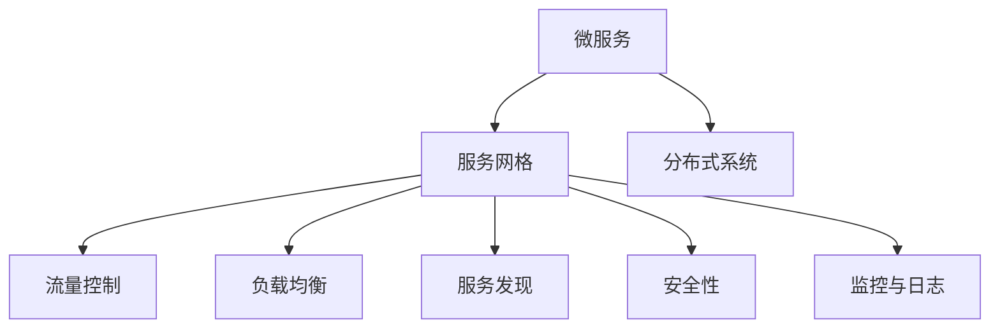

                 

# 服务网格（Service Mesh）：微服务通信的基础设施

> 关键词：服务网格,微服务,通信,基础设施

## 1. 背景介绍

### 1.1 问题由来

在现代互联网应用中，微服务架构（Microservices Architecture）因其灵活性、可扩展性、可维护性等优点，得到了广泛的应用。微服务架构将应用程序拆分为多个独立、自治的服务，这些服务通过轻量级通信机制进行交互，从而实现敏捷开发和高效运维。然而，随着微服务架构的复杂度不断增加，服务之间的通信和协调也变得越来越复杂。在微服务架构中，服务之间的通信往往依赖于分布式系统中的网络通信，而网络通信中的负载均衡、流量控制、安全、监控等问题也逐渐成为系统的瓶颈。为解决这些问题，服务网格（Service Mesh）技术应运而生。

服务网格是一种专门用于优化微服务架构中服务间通信的网络基础设施，其目的是通过统一管理和调度，提高服务的可靠性、性能、安全性和可观察性。通过服务网格，开发者可以在不修改服务代码的情况下，实现对服务通信的微调，从而提升整个系统的运行效率和用户体验。

### 1.2 问题核心关键点

服务网格的核心目标是通过统一的通信层，屏蔽微服务架构中的网络细节，提供全面的服务治理能力。其主要关键点包括：

- **统一通信层**：通过服务网格，将服务之间的通信抽象为一个统一的网络基础设施，隐藏底层网络细节，简化服务间的交互。

- **全面治理**：提供全面的服务治理能力，包括流量控制、负载均衡、服务发现、安全性、监控等，帮助开发者更好地管理和运维微服务系统。

- **高效扩展**：通过服务网格，开发者可以方便地扩展和调整服务，同时保持系统的稳定性和可靠性。

- **灵活开发**：服务网格通过API插件等机制，允许开发者在不修改服务代码的情况下，快速进行功能和性能的优化。

- **统一监控**：提供统一的监控和日志收集机制，帮助开发者快速定位问题，优化系统性能。

## 2. 核心概念与联系

### 2.1 核心概念概述

为更好地理解服务网格技术，本节将介绍几个密切相关的核心概念：

- **微服务（Microservices）**：将应用程序拆分为多个独立、自治的服务，每个服务负责特定的业务逻辑，服务之间通过轻量级通信机制进行交互，从而实现敏捷开发和高效运维。

- **分布式系统（Distributed System）**：由多个独立的、自治的计算节点组成，这些节点之间通过网络进行通信和协作，以实现共同的任务。

- **服务网格（Service Mesh）**：一种专门用于优化微服务架构中服务间通信的网络基础设施，其目的是通过统一的通信层，屏蔽微服务架构中的网络细节，提供全面的服务治理能力。

- **流量控制（Traffic Control）**：在微服务架构中，通过服务网格对服务流量进行管理和控制，实现负载均衡、限流、熔断等，保障系统的稳定性和可靠性。

- **负载均衡（Load Balancing）**：在服务网格中，通过负载均衡算法将请求合理地分配到多个服务实例上，避免单点故障和性能瓶颈。

- **服务发现（Service Discovery）**：在微服务架构中，通过服务发现机制，自动地找到服务实例，并进行通信，实现服务的动态管理和扩展。

- **安全性（Security）**：在服务网格中，通过统一的安全策略，保障服务间通信的安全性，防止数据泄露和攻击。

- **监控与日志（Monitoring & Logging）**：在微服务架构中，通过服务网格提供统一的监控和日志收集机制，帮助开发者快速定位问题，优化系统性能。

这些核心概念之间的逻辑关系可以通过以下Mermaid流程图来展示：



这个流程图展示了大语言模型的核心概念及其之间的关系：

1. 微服务通过服务网格进行通信和治理。
2. 服务网格在微服务架构中扮演关键角色，提供统一的通信层和服务治理能力。
3. 分布式系统是微服务架构的基础，服务网格通过服务发现、负载均衡等机制实现系统的动态管理和扩展。
4. 流量控制、负载均衡、安全性、监控与日志等都是服务网格的关键能力，共同保障系统的可靠性和性能。

## 3. 核心算法原理 & 具体操作步骤
### 3.1 算法原理概述

服务网格技术是基于统一的通信层，实现微服务架构中服务间通信的优化和治理。其核心思想是通过服务网格的代理层（Proxy），在服务之间的通信中进行拦截和处理，实现服务间的负载均衡、流量控制、安全防护等功能。

服务网格的代理层通常部署在每个服务实例上，形成一个网格，每个代理层通过代理网络（Proxy Network）进行通信。代理层负责处理服务的请求和响应，并记录相关的日志和指标，供监控和分析使用。通过服务网格的代理层，开发者可以在不修改服务代码的情况下，对服务通信进行微调，从而提升系统的性能和可靠性。

### 3.2 算法步骤详解

服务网格的实现通常包括以下几个关键步骤：

**Step 1: 部署代理层（Proxy）**

- 在每个服务实例上部署服务网格的代理层，通常是轻量级的Kubernetes Pod或Docker Container。
- 配置代理层的参数，如负载均衡算法、安全策略、日志收集等。

**Step 2: 代理网络（Proxy Network）**

- 建立服务网格的代理网络，使服务之间的通信能够通过代理层进行转发。
- 代理网络通常使用Istio、Linkerd等框架实现，提供全面、灵活的服务治理能力。

**Step 3: 流量控制（Traffic Control）**

- 配置流量控制规则，如限流、熔断、重试等，保障系统的稳定性。
- 使用代理层的流量控制功能，监控和调整服务流量，防止单点故障和性能瓶颈。

**Step 4: 服务发现（Service Discovery）**

- 通过服务网格的服务发现机制，自动发现和注册服务实例。
- 使用服务发现功能，动态更新服务路由和负载均衡策略。

**Step 5: 安全性（Security）**

- 配置统一的安全策略，如认证、授权、加密等，保障服务间通信的安全性。
- 使用代理层的安全功能，防止数据泄露和攻击，确保系统的安全。

**Step 6: 监控与日志（Monitoring & Logging）**

- 使用代理层的监控和日志功能，收集和分析服务通信的指标和日志。
- 通过统一的监控平台，可视化服务运行状态，快速定位和解决问题。

### 3.3 算法优缺点

服务网格技术具有以下优点：

1. **统一的通信层**：通过服务网格，开发者可以在不修改服务代码的情况下，实现对服务通信的微调，提升系统的灵活性和可扩展性。
2. **全面治理能力**：提供流量控制、负载均衡、服务发现、安全性、监控等全面的服务治理能力，帮助开发者更好地管理和运维微服务系统。
3. **高效扩展**：通过服务网格，开发者可以方便地扩展和调整服务，同时保持系统的稳定性和可靠性。
4. **灵活开发**：服务网格通过API插件等机制，允许开发者快速进行功能和性能的优化。
5. **统一监控**：提供统一的监控和日志收集机制，帮助开发者快速定位问题，优化系统性能。

同时，服务网格技术也存在以下缺点：

1. **性能开销**：服务网格的代理层增加了额外的网络开销和计算资源消耗，可能会影响系统的性能。
2. **部署复杂性**：部署服务网格需要额外的配置和管理工作，增加了系统的复杂性。
3. **学习成本**：服务网格技术涉及复杂的概念和机制，对开发者有较高的学习成本。

尽管存在这些缺点，但就目前而言，服务网格技术仍是大规模微服务架构优化的重要手段。未来相关研究的重点在于如何进一步优化代理层的性能和配置，降低部署和管理成本，提升用户体验。

### 3.4 算法应用领域

服务网格技术已经在金融、电商、电信、医疗等多个领域得到了广泛的应用，成为微服务架构优化的重要工具。以下是几个典型应用场景：

- **金融行业**：在金融行业中，服务网格技术被用于构建高可用、高性能的交易系统和风控系统，保障交易的稳定性和安全性。
- **电商行业**：在电商行业中，服务网格技术被用于构建高并发、高弹性的订单系统和库存管理系统，提升用户体验和交易速度。
- **电信行业**：在电信行业中，服务网格技术被用于构建高可扩展、高稳定的通信网络和数据处理系统，保障网络稳定和数据安全。
- **医疗行业**：在医疗行业中，服务网格技术被用于构建高可靠、高安全性的医疗数据共享和患者管理系统，保障医疗数据的隐私和安全。

除了上述这些经典应用外，服务网格技术还被创新性地应用到更多场景中，如智能合约、边缘计算、物联网等，为微服务架构带来新的突破。

## 4. 数学模型和公式 & 详细讲解 & 举例说明
### 4.1 数学模型构建

服务网格技术的核心是一个统一的通信层，用于实现服务之间的通信和治理。在服务网格中，每个代理层都负责处理服务的请求和响应，并记录相关的日志和指标。代理层通过代理网络进行通信，代理网络中的每个节点都是一个独立的微服务实例。服务网格通过代理层实现对服务流量、负载均衡、安全性的统一管理，并提供监控和日志收集机制。

### 4.2 公式推导过程

服务网格的代理层通常使用TCP或HTTP协议进行通信，其核心通信模型可以表示为：

$$
\text{通信模型} = \{A_i, S_i, R_i, T_i, C_i\}
$$

其中：

- $A_i$ 表示第 $i$ 个代理层的地址。
- $S_i$ 表示第 $i$ 个代理层支持的协议类型，如TCP、HTTP等。
- $R_i$ 表示第 $i$ 个代理层的负载均衡算法，如随机负载均衡、轮询负载均衡等。
- $T_i$ 表示第 $i$ 个代理层的服务发现机制，如Consul、Kubernetes等。
- $C_i$ 表示第 $i$ 个代理层的安全策略，如TLS加密、OAuth认证等。

在服务网格中，代理层的通信模型可以进一步扩展为：

$$
\text{通信模型} = \{A_i, S_i, R_i, T_i, C_i, L_i\}
$$

其中 $L_i$ 表示第 $i$ 个代理层的日志收集机制，用于记录和分析服务通信的指标和日志。

### 4.3 案例分析与讲解

以Istio为例，Istio是一个开源的服务网格解决方案，其核心组件包括：

- **Sidecar Proxy**：在每个微服务实例上部署的代理层，负责处理服务的请求和响应。
- **Mixer**：用于收集和处理代理层记录的日志和指标，提供统一的安全和监控机制。
- **Pilot**：用于服务发现和负载均衡，动态更新服务路由和负载均衡策略。
- **DestinationRule**：用于定义服务的流量控制规则，如限流、熔断等。
- **VirtualService**：用于定义服务的流量路由规则，如规则匹配、路由策略等。

Istio通过这些组件实现对服务通信的全面治理，其典型应用场景包括：

- **流量控制**：通过DestinationRule和VirtualService，定义限流、熔断、重试等流量控制策略，保障系统的稳定性。
- **负载均衡**：通过Pilot和VirtualService，动态更新服务路由和负载均衡策略，实现服务的高可用性和高性能。
- **服务发现**：通过Pilot和DestinationRule，自动发现和注册服务实例，实现服务的动态管理和扩展。
- **安全性**：通过Istio的OAuth和TLS机制，保障服务间通信的安全性，防止数据泄露和攻击。
- **监控与日志**：通过Mixer收集和处理代理层记录的日志和指标，提供统一的监控和日志收集机制，帮助开发者快速定位问题，优化系统性能。

## 5. 项目实践：代码实例和详细解释说明
### 5.1 开发环境搭建

在进行服务网格实践前，我们需要准备好开发环境。以下是使用Kubernetes进行Istio部署的环境配置流程：

1. 安装Minikube：从官网下载并安装Minikube，用于本地构建Kubernetes集群。

2. 启动Minikube集群：
```bash
minikube start
```

3. 安装Istio：从Istio官网下载安装包，解压并安装Istio。

4. 安装kube-proxy：
```bash
kubectl apply -f https://raw.githubusercontent.com/istio/istio/master/helm/istio-1.10.1/components/kube-proxy/manifests
```

5. 安装istio-autoscaler：
```bash
kubectl apply -f https://raw.githubusercontent.com/istio/istio/master/helm/istio-1.10.1/components/istio-autoscaler/manifests
```

6. 安装istio-mixer：
```bash
kubectl apply -f https://raw.githubusercontent.com/istio/istio/master/helm/istio-1.10.1/components/istio-mixer/manifests
```

完成上述步骤后，即可在Minikube集群中开始Istio部署实践。

### 5.2 源代码详细实现

这里我们以Istio为例，展示Istio的安装和微服务部署的代码实现。

首先，安装Istio和kube-proxy：

```bash
kubectl apply -f https://raw.githubusercontent.com/istio/istio/master/helm/istio-1.10.1/components/kube-proxy/manifests
```

然后，部署Istio：

```bash
kubectl apply -f https://raw.githubusercontent.com/istio/istio/master/helm/istio-1.10.1/istio.yaml
```

接着，部署示例微服务：

```python
kubectl create deployment echo-deployment --image=echo:latest --replicas=2
kubectl create service kubernetes -type=ClusterIP -name=echo-service --port=80 --target-port=8080 -selector=hello:echo
```

最后，使用Istio Mixer收集和处理代理层记录的日志和指标：

```python
kubectl apply -f https://raw.githubusercontent.com/istio/istio/master/helm/istio-1.10.1/components/istio-mixer/manifests
```

### 5.3 代码解读与分析

让我们再详细解读一下关键代码的实现细节：

**Istio安装**：
- 使用kubectl apply命令安装Istio的各个组件，安装后系统会在Kubernetes集群中自动部署代理层、Mixer、Pilot等组件。

**微服务部署**：
- 创建名为echo-deployment的Deployment，指定服务镜像、副本数等参数。
- 创建名为echo-service的Service，定义服务类型为ClusterIP，并指定端口和目标端口。
- 使用Mixer收集和处理代理层记录的日志和指标，可以通过kubectl apply命令将istio-mixer的manifests文件应用到Kubernetes集群。

在实际应用中，开发者可以根据具体需求，通过Istio提供的API插件等机制，进行更多功能的开发和扩展，如限流、熔断、服务发现等。

## 6. 实际应用场景
### 6.1 智能合约

服务网格技术在智能合约（Smart Contract）的构建中，可以提供更灵活、高效的服务通信和治理能力。智能合约通常需要处理多个服务间的协同工作，如跨链交易、共识协议等。通过服务网格，开发者可以在不修改服务代码的情况下，快速构建和扩展智能合约系统，提升系统的可靠性和可扩展性。

### 6.2 边缘计算

在边缘计算中，服务网格可以用于构建高性能、低延迟的边缘计算服务。边缘计算系统通常需要处理大量的本地数据和实时计算任务，需要高效的服务通信和治理机制。通过服务网格，开发者可以方便地扩展和调整边缘计算服务，同时保持系统的稳定性和可靠性。

### 6.3 物联网

在物联网（IoT）中，服务网格可以用于构建高可靠、高安全性的物联网系统。物联网系统通常需要处理大量的传感器数据和实时计算任务，需要高效的服务通信和治理机制。通过服务网格，开发者可以方便地扩展和调整物联网服务，同时保持系统的稳定性和可靠性。

### 6.4 未来应用展望

随着服务网格技术的不断发展，未来的应用场景将更加多样，覆盖更多行业领域。

在智慧城市治理中，服务网格可以用于构建高可靠、高安全性的城市运行管理系统。通过服务网格，开发者可以方便地扩展和调整城市运行管理服务，同时保持系统的稳定性和可靠性。

在航空航天领域，服务网格可以用于构建高可靠、高安全性的航天器控制系统。通过服务网格，开发者可以方便地扩展和调整航天器控制系统服务，同时保持系统的稳定性和可靠性。

在教育领域，服务网格可以用于构建高可靠、高安全性的在线教育平台。通过服务网格，开发者可以方便地扩展和调整在线教育平台服务，同时保持系统的稳定性和可靠性。

此外，在物流、医疗、制造等众多领域，服务网格技术也将带来新的突破，为各行各业带来新的创新应用。

## 7. 工具和资源推荐
### 7.1 学习资源推荐

为了帮助开发者系统掌握服务网格技术，这里推荐一些优质的学习资源：

1. 《Kubernetes: Up and Running》：这是一本由Google编写的开源容器编排技术入门书籍，介绍了Kubernetes的基本概念和实践。
2. 《Istio: Service Mesh for Modern Cloud Native Applications》：这是一本由Istio社区编写的开源服务网格技术入门书籍，详细介绍了Istio的服务治理机制和实践。
3. 《Service Mesh: Cloud-Native Microservices》：这是一篇由Cloud Native Computing Foundation（CNCF）发布的关于服务网格技术的白皮书，全面介绍了服务网格的核心概念和实现机制。
4. 《Istio Documentation》：这是Istio官方文档，提供了丰富的代码样例和教程，帮助开发者快速上手Istio服务网格。
5. 《Google Cloud Service Mesh》：这是Google云平台上的服务网格解决方案，提供了丰富的服务治理能力和文档支持，帮助开发者构建高性能、高可靠性的云原生应用。

通过对这些资源的学习实践，相信你一定能够快速掌握服务网格技术的精髓，并用于解决实际的微服务问题。

### 7.2 开发工具推荐

高效的开发离不开优秀的工具支持。以下是几款用于服务网格开发的常用工具：

1. Kubernetes：由Google主导开发的开源容器编排平台，用于管理大规模的容器化应用。
2. Istio：由Istio社区开发的开源服务网格解决方案，提供全面、灵活的服务治理能力。
3. Prometheus：由Google主导开发的开源监控和告警系统，用于收集和分析服务指标。
4. Grafana：由Grafana Labs开发的开源数据可视化平台，用于可视化服务网格的监控数据。
5. Jaeger：由Uber开发的开源分布式追踪系统，用于追踪服务通信和性能问题。

合理利用这些工具，可以显著提升服务网格的开发效率，加快创新迭代的步伐。

### 7.3 相关论文推荐

服务网格技术的发展源于学界的持续研究。以下是几篇奠基性的相关论文，推荐阅读：

1. Meshing Service Communication with Datacenter-Friendly Flow Distribution：由Kushal Kasetti等人发表的论文，提出了使用流控分配机制优化微服务通信的思路，为服务网格的发展奠定了基础。
2. Towards Distributed Consensus in the Internet of Things：由Ali Aghayari等人发表的论文，探讨了在物联网中构建高可靠、高安全性的分布式共识协议，为服务网格在物联网中的应用提供了新的思路。
3. Service Mesh: Service Communication with Tailored Performance：由Animesh Soni等人发表的论文，详细介绍了服务网格的核心架构和机制，为服务网格的发展提供了理论基础。
4. Microservices Architecture: A Survey：由Manjunath M.H.等人发表的论文，全面介绍了微服务架构的核心概念和实践，为服务网格技术提供了背景支持。

这些论文代表了大语言模型微调技术的发展脉络。通过学习这些前沿成果，可以帮助研究者把握学科前进方向，激发更多的创新灵感。

## 8. 总结：未来发展趋势与挑战
### 8.1 总结

本文对服务网格技术进行了全面系统的介绍。首先阐述了服务网格在微服务架构中的核心目标和应用场景，明确了服务网格技术在优化微服务通信中的重要价值。其次，从原理到实践，详细讲解了服务网格的核心算法和操作步骤，给出了服务网格技术开发的全流程代码实现。同时，本文还广泛探讨了服务网格技术在智能合约、边缘计算、物联网等多个领域的应用前景，展示了服务网格技术的广泛应用潜力。

通过本文的系统梳理，可以看到，服务网格技术正在成为微服务架构优化的重要手段，极大地提升了微服务系统的运行效率和用户体验。未来，伴随服务网格技术的不断发展，服务网格将进一步优化微服务架构的各个环节，为构建高效、可靠、可扩展的系统提供新的动力。

### 8.2 未来发展趋势

展望未来，服务网格技术将呈现以下几个发展趋势：

1. **分布式系统**：随着服务网格技术的不断发展，未来的微服务系统将进一步向分布式系统方向发展，服务网格将更好地适应分布式环境下的复杂通信需求。
2. **全面治理能力**：服务网格将提供更加全面、灵活的服务治理能力，包括流量控制、负载均衡、服务发现、安全性、监控等，帮助开发者更好地管理和运维微服务系统。
3. **高可用性和高可靠性**：服务网格将进一步提升系统的可用性和可靠性，通过多副本、故障转移、弹性伸缩等机制，保障服务的稳定性和高效性。
4. **跨领域应用**：服务网格技术将进一步拓展应用领域，如智能合约、物联网、医疗等，带来新的创新应用和商业模式。
5. **持续创新**：服务网格技术将持续进行技术创新和优化，如引入更高效的负载均衡算法、更灵活的安全策略、更全面的监控和日志收集机制等，不断提升系统性能和用户体验。

以上趋势凸显了服务网格技术在微服务架构优化中的重要地位。这些方向的探索发展，必将进一步提升微服务系统的运行效率和用户体验，为构建高效、可靠、可扩展的系统提供新的动力。

### 8.3 面临的挑战

尽管服务网格技术已经取得了瞩目成就，但在迈向更加智能化、普适化应用的过程中，它仍面临着诸多挑战：

1. **学习成本**：服务网格技术涉及复杂的概念和机制，对开发者有较高的学习成本，需要系统性的培训和实践。
2. **性能开销**：服务网格的代理层增加了额外的网络开销和计算资源消耗，可能会影响系统的性能。
3. **配置复杂性**：服务网格的部署和配置需要较高的技术水平和经验积累，增加了系统的复杂性。
4. **兼容性问题**：服务网格技术需要与各种容器编排平台（如Kubernetes、Docker Swarm等）进行兼容和集成，存在一定的兼容性问题。
5. **安全问题**：服务网格的广泛应用可能会引入新的安全风险，如服务间的安全漏洞、数据泄露等，需要加强安全防护。

尽管存在这些挑战，但服务网格技术的核心价值和优势仍然显著。未来，随着技术不断进步和完善，服务网格必将更好地适应复杂的微服务架构，为系统的稳定性和可扩展性提供有力保障。

### 8.4 研究展望

面对服务网格技术面临的挑战，未来的研究需要在以下几个方面寻求新的突破：

1. **高效配置**：进一步优化代理层的配置和管理机制，降低部署和管理成本，提升系统的可扩展性。
2. **低延迟和高性能**：引入更高效的负载均衡算法和网络优化技术，提高服务的性能和响应速度。
3. **跨领域适用性**：开发更加通用的服务网格框架和组件，支持跨领域应用的灵活部署和扩展。
4. **安全防护**：引入更全面的安全机制和策略，保障服务间的安全性和隐私保护。
5. **多云和混合云支持**：支持多云和混合云环境下的服务网格部署和集成，实现云原生应用的跨云迁移和协同。

这些研究方向的探索，必将引领服务网格技术迈向更高的台阶，为构建高效、可靠、可扩展的微服务系统提供新的动力。面向未来，服务网格技术还需要与其他人工智能技术进行更深入的融合，如知识表示、因果推理、强化学习等，多路径协同发力，共同推动微服务架构的发展。

## 9. 附录：常见问题与解答

**Q1：服务网格在微服务架构中的作用是什么？**

A: 服务网格在微服务架构中的作用是提供一个统一的通信层和服务治理机制，屏蔽微服务架构中的网络细节，提供全面的服务治理能力，如流量控制、负载均衡、服务发现、安全性、监控等，帮助开发者更好地管理和运维微服务系统。

**Q2：服务网格对微服务性能有什么影响？**

A: 服务网格的代理层增加了额外的网络开销和计算资源消耗，可能会影响系统的性能。然而，服务网格提供了更高效的服务治理机制，如流量控制、负载均衡等，可以在一定程度上优化服务性能，提升系统的稳定性和可靠性。

**Q3：服务网格的代理层是如何工作的？**

A: 服务网格的代理层部署在每个微服务实例上，通过代理网络进行通信。代理层负责处理服务的请求和响应，记录日志和指标，并提供安全性和监控功能。通过代理层，开发者可以在不修改服务代码的情况下，实现对服务通信的微调，提升系统的灵活性和可扩展性。

**Q4：如何部署和管理服务网格？**

A: 服务网格的部署和管理需要一定的技术水平和经验积累。一般来说，可以使用Kubernetes等容器编排平台进行部署，并结合Istio等服务网格解决方案进行管理和优化。在部署过程中，需要注意代理层的配置和管理，以及服务网格的网络和资源优化。

**Q5：服务网格的未来发展方向是什么？**

A: 服务网格的未来发展方向包括提升系统的可用性和可靠性、增强服务治理能力、优化代理层的配置和管理机制、引入更高效的网络优化技术和安全机制等。未来服务网格将进一步拓展应用领域，支持跨领域应用的灵活部署和扩展，成为微服务架构优化的重要工具。

通过本文的系统梳理，可以看到，服务网格技术正在成为微服务架构优化的重要手段，极大地提升了微服务系统的运行效率和用户体验。未来，伴随服务网格技术的不断发展，服务网格将进一步优化微服务架构的各个环节，为构建高效、可靠、可扩展的系统提供新的动力。

---

作者：禅与计算机程序设计艺术 / Zen and the Art of Computer Programming

