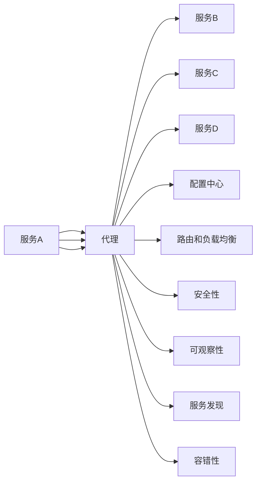

                 

# 服务网格：微服务通信和管理

> 关键词：服务网格, 微服务, 分布式系统, 负载均衡, 可观察性, 安全性, 服务发现, 容错性

## 1. 背景介绍

### 1.1 问题由来
随着微服务架构在企业级应用中的普及，微服务间的通信和管理变得复杂而繁琐。每个服务需要维护自己的负载均衡、路由、安全性、可观察性等，导致开发、运维和扩展的难度急剧增加。面对分布式系统的不断扩展和应用场景的快速变化，需要一种新的解决方案来提高微服务的通信效率和管理能力。

### 1.2 问题核心关键点
服务网格(Servicemesh)就是在这样的背景下被提出的一种架构模式。它通过在应用层实现微服务间的通信和治理，能够灵活、高效地管理微服务的各种复杂场景，使微服务架构变得可观察、可配置、可扩展。

服务网格的引入旨在解决以下核心问题：
1. **负载均衡**：自动分发请求，避免单点故障。
2. **路由和熔断**：控制流量，确保服务可靠性。
3. **安全性**：统一处理认证和授权，减少安全隐患。
4. **可观察性**：集中收集日志、指标和追踪信息，方便排查问题。
5. **配置管理**：动态修改服务路由和配置，支持A/B测试和蓝绿部署。
6. **可靠性**：自动重试和降级策略，保证系统健壮性。
7. **服务发现**：服务自动注册和发现，简化服务配置。

服务网格的出现，使得微服务的治理变得透明、简单、可控，极大地提升了分布式系统的开发和运维效率。

### 1.3 问题研究意义
服务网格的引入为微服务架构带来了革命性的变化，具体意义如下：
1. **提升开发效率**：服务网格自动处理了许多底层复杂性，让开发者能够更专注于业务逻辑。
2. **简化运维**：集中管理微服务间的通信和配置，降低了运维成本。
3. **增强可扩展性**：灵活地支持多语言、多平台和多种通信协议。
4. **提高可靠性**：通过集中管理和服务链的自动处理，提高了系统的整体可靠性。
5. **增强安全性**：统一处理认证和授权，提高了系统的安全性。
6. **改善用户体验**：通过路由和负载均衡等机制，保证了服务的稳定性和高效性。

本文将详细介绍服务网格的核心概念、原理和操作流程，并通过实际案例说明其应用。

## 2. 核心概念与联系

### 2.1 核心概念概述

服务网格是一个位于应用层的数据平面基础设施，用于实现微服务间的通信和治理。它通过拦截、控制和增强微服务的流量管理，提供了一种全新的分布式系统管理方式。

服务网格的核心组件包括：

- **代理**：拦截微服务间的通信，处理请求和响应。
- **配置中心**：集中管理微服务的配置信息。
- **路由和负载均衡**：自动分发请求，确保负载均衡。
- **安全性**：统一处理认证和授权，保证系统安全。
- **可观察性**：收集日志、指标和追踪信息，便于故障排查。
- **服务发现**：自动注册和发现服务，简化服务配置。
- **容错性**：自动重试和降级策略，确保系统健壮性。

服务网格通过在每个微服务部署一个代理，集中管理微服务间的通信和治理，实现了分布式系统的高效、灵活和可控。

### 2.2 核心概念原理和架构的 Mermaid 流程图(Mermaid 流程节点中不要有括号、逗号等特殊字符)



该图展示了服务网格的基本架构：每个微服务通过代理连接到服务网格，代理拦截和处理微服务间的通信，同时与配置中心、路由、负载均衡、安全性、可观察性、服务发现和容错性组件协同工作，实现微服务的全面管理。

## 3. 核心算法原理 & 具体操作步骤

### 3.1 算法原理概述

服务网格通过拦截微服务间的请求和响应，实现负载均衡、路由、安全性、可观察性、服务发现、容错性等功能。这些功能的实现依赖于以下几个关键算法：

1. **负载均衡算法**：将请求分散到不同的微服务实例上，避免单点故障，提高系统的吞吐量和稳定性。
2. **路由算法**：根据请求的目标服务，选择最合适的服务实例进行处理，实现服务的高可用性和负载均衡。
3. **安全性算法**：统一处理认证和授权，防止未授权访问和数据泄露。
4. **可观察性算法**：收集、聚合和分析微服务的日志、指标和追踪信息，帮助开发和运维人员快速定位问题。
5. **服务发现算法**：自动注册和发现服务，简化服务配置和扩展。
6. **容错性算法**：自动重试和降级策略，确保系统在故障情况下的可用性和健壮性。

服务网格的核心算法通过拦截请求和响应的全生命周期，实现微服务的全面管理。

### 3.2 算法步骤详解

服务网格的基本操作流程包括以下几个关键步骤：

**Step 1: 准备服务网格环境**
- 安装并配置服务网格代理。
- 部署配置中心，用于集中管理微服务的配置信息。
- 配置路由和负载均衡规则。
- 设置安全性策略和认证机制。
- 启用可观察性收集工具。
- 实现服务发现机制。
- 配置容错性策略和降级规则。

**Step 2: 部署微服务**
- 部署微服务实例，并设置服务元数据。
- 通过代理拦截和处理微服务间的请求和响应。

**Step 3: 配置和调试**
- 根据实际需求配置负载均衡、路由、安全性、可观察性、服务发现和容错性等策略。
- 使用监控工具和日志分析工具调试和优化系统性能。

**Step 4: 上线和运维**
- 将微服务实例上线，并逐步验证各功能的正常运行。
- 持续监控系统性能和健康状态，及时处理异常情况。
- 定期更新配置信息和安全性策略，保持系统的安全性和稳定性。

### 3.3 算法优缺点

服务网格的优点包括：
1. **透明性**：自动处理微服务间的通信和治理，减少了开发和运维的复杂度。
2. **灵活性**：支持多种编程语言和通信协议，满足不同业务场景的需求。
3. **可扩展性**：通过集中管理配置和路由，简化了微服务的扩展和部署。
4. **可靠性**：通过自动重试和降级策略，提高了系统的可用性和健壮性。
5. **安全性**：统一处理认证和授权，增强了系统的安全性。
6. **可观察性**：集中收集日志、指标和追踪信息，便于故障排查和性能优化。

服务网格的缺点包括：
1. **性能开销**：服务网格代理的引入可能会对系统的性能产生一定影响。
2. **复杂性**：服务网格的配置和管理相对复杂，需要一定的学习成本。
3. **运维成本**：服务网格的集中管理需要专门的运维团队，增加了运维成本。

### 3.4 算法应用领域

服务网格广泛应用于各种分布式系统中，如银行、电商、游戏、互联网等。其主要应用领域包括：

- **金融领域**：银行和保险业需要处理大量的实时交易和高并发请求，服务网格可以有效提升系统的可靠性和安全性。
- **电商领域**：电商平台需要处理大量用户请求和订单处理，服务网格可以确保系统的高可用性和负载均衡。
- **游戏领域**：在线游戏需要处理高并发、低延迟的请求，服务网格可以提升系统的稳定性和响应速度。
- **互联网领域**：互联网公司需要处理大量的用户请求和数据交互，服务网格可以提供强大的路由和负载均衡功能。

## 4. 数学模型和公式 & 详细讲解 & 举例说明（备注：数学公式请使用latex格式，latex嵌入文中独立段落使用 $$，段落内使用 $)
### 4.1 数学模型构建

服务网格的核心算法依赖于数学模型来描述和计算。以下是服务网格中常用的几个数学模型：

**1. 负载均衡模型**

负载均衡模型用于描述如何公平地将请求分配到多个服务实例上。常用的负载均衡算法包括：

- **轮询算法**：按照服务实例的顺序轮流处理请求。
- **随机算法**：随机选择一个服务实例处理请求。
- **加权轮询算法**：根据服务实例的负载情况，按照权重分配请求。
- **最小连接算法**：选择连接数最少的服务实例处理请求。

**2. 路由模型**

路由模型用于描述如何根据请求的目标服务，选择最合适的服务实例进行处理。常用的路由算法包括：

- **静态路由算法**：按照预定义的路由规则进行请求分发。
- **动态路由算法**：根据请求的属性和当前的服务状态动态调整路由规则。
- **可配置路由算法**：根据配置信息进行灵活的路由选择。

**3. 安全性模型**

安全性模型用于描述如何统一处理认证和授权，防止未授权访问和数据泄露。常用的安全性算法包括：

- **基于角色的访问控制(RBAC)**：根据角色的权限进行访问控制。
- **OAuth2**：通过OAuth2协议进行认证和授权。
- **JWT**：通过JSON Web Tokens进行身份验证和授权。

**4. 可观察性模型**

可观察性模型用于描述如何收集、聚合和分析微服务的日志、指标和追踪信息。常用的可观察性算法包括：

- **日志收集模型**：收集和存储微服务的日志信息。
- **指标聚合模型**：聚合和分析微服务的性能指标。
- **追踪信息模型**：记录和分析请求的调用链路和依赖关系。

**5. 服务发现模型**

服务发现模型用于描述如何自动注册和发现服务，简化服务配置和扩展。常用的服务发现算法包括：

- **Consul**：通过Consul进行服务注册和发现。
- **Etcd**：通过Etcd进行服务注册和发现。
- **Kubernetes**：通过Kubernetes进行服务注册和发现。

**6. 容错性模型**

容错性模型用于描述如何自动重试和降级策略，确保系统在故障情况下的可用性和健壮性。常用的容错性算法包括：

- **重试策略**：自动重试失败的请求，减少系统故障。
- **降级策略**：在故障情况下降级到备用服务或简化功能。

### 4.2 公式推导过程

以下以负载均衡算法中的轮询算法为例，推导其计算公式。

假设服务网格中有N个服务实例，每个实例的负载均衡因子为w_i。轮询算法的负载均衡公式为：

$$
\text{Load Balancing Factor} = \frac{1}{\sum_{i=1}^{N}w_i}
$$

根据公式，可以计算每个请求被分配到各个服务实例上的概率。例如，如果请求被分配到第i个服务实例，其概率为：

$$
P_i = \frac{w_i}{\sum_{i=1}^{N}w_i}
$$

在实际应用中，可以根据服务实例的负载情况，动态调整w_i的值，实现更公平的负载均衡。

### 4.3 案例分析与讲解

假设一个电商平台的订单处理系统由三个微服务实例组成，分别为订单服务、支付服务和物流服务。订单服务负责处理订单信息，支付服务负责处理支付请求，物流服务负责处理物流信息。

**案例1: 负载均衡**

订单系统在处理订单信息时，需要调用支付服务和物流服务。为了保证负载均衡，可以采用轮询算法或加权轮询算法。假设订单系统平均每秒收到100个订单请求，支付服务每秒可以处理50个请求，物流服务每秒可以处理30个请求。

1. 采用轮询算法：每个服务实例的处理请求数相等，为100/3=33.33个。
2. 采用加权轮询算法：根据服务实例的负载情况，支付服务的权重为2，物流服务的权重为1。每个服务实例的处理请求数为：
   $$
   P_{\text{Pay}} = \frac{2}{2+1} \times 100 = 66.67, \quad P_{\text{Log}} = \frac{1}{2+1} \times 100 = 33.33
   $$

通过负载均衡算法，可以确保每个服务实例的处理请求数均衡，避免单点故障。

**案例2: 路由**

订单系统在处理订单信息时，需要调用支付服务和物流服务。为了确保服务的高可用性和负载均衡，可以采用动态路由算法。假设订单系统接收到一个订单请求，并根据当前服务实例的负载情况，选择最合适的服务实例进行处理。

1. 选择支付服务：如果支付服务的负载因子为0.6，物流服务的负载因子为0.4，则订单系统选择支付服务进行支付处理。
2. 选择物流服务：如果支付服务的负载因子为0.9，物流服务的负载因子为0.1，则订单系统选择物流服务进行物流处理。

通过路由算法，可以确保订单系统根据当前服务实例的负载情况，选择最合适的服务实例进行处理，提高系统的可用性和负载均衡能力。

## 5. 项目实践：代码实例和详细解释说明

### 5.1 开发环境搭建

以下是使用Spring Cloud和Istio实现服务网格的开发环境搭建流程：

1. 安装JDK和Maven：从官网下载并安装JDK和Maven。
2. 创建Spring Boot项目：使用Maven创建Spring Boot项目。
3. 添加Spring Cloud依赖：在pom.xml文件中添加Spring Cloud依赖。
4. 配置Istio：从Istio官网下载并安装Istio。
5. 配置Kubernetes集群：在Kubernetes集群中创建服务网格资源。
6. 部署微服务：将微服务部署到Kubernetes集群中。

完成上述步骤后，即可在服务网格环境中进行微服务的开发和部署。

### 5.2 源代码详细实现

以下是使用Spring Cloud和Istio实现服务网格的代码实现：

1. 创建微服务实例：
```java
@SpringBootApplication
public class OrderServiceApplication {
    public static void main(String[] args) {
        SpringApplication.run(OrderServiceApplication.class, args);
    }
}
```

2. 配置Istio服务：
```yaml
apiVersion: serviceMeshOperator.example.com/v1
namespace: order
app: order-service
```

3. 部署微服务：
```bash
kubectl apply -f order-service.yaml
```

4. 配置路由和负载均衡：
```yaml
apiVersion: networking.istio.io/v1alpha3
kind: VirtualService
metadata:
  name: order-service
spec:
  hosts:
  - "*"
  http:
  - match:
    - uri:
        exact: /orders
    route:
    - destination:
        host: order-service
```

5. 配置安全性：
```yaml
apiVersion: networking.istio.io/v1alpha3
kind: Gateway
metadata:
  name: api-gateway
spec:
  selector:
    istio: ingressgateway
  servers:
  - port:
      number: 80
      name: http
      protocol: HTTP
    hosts:
    - "api.example.com"
```

6. 配置可观察性：
```yaml
apiVersion: networking.istio.io/v1alpha3
kind: Prometheus
metadata:
  name: prometheus
spec:
  serviceMonitor:
  - namespace: order
    selector:
      matchLabels:
        app: order-service
    prometheus:
      path: /metrics
```

7. 配置服务发现：
```yaml
apiVersion: networking.istio.io/v1alpha3
kind: ServiceEntry
metadata:
  name: order-service
spec:
  hosts:
  - "*"
  ports:
  - number: 80
    protocol: TCP
  selector:
    app: order-service
```

### 5.3 代码解读与分析

以下是服务网格实现的关键代码解读：

1. 微服务实例的创建：
```java
@SpringBootApplication
public class OrderServiceApplication {
    public static void main(String[] args) {
        SpringApplication.run(OrderServiceApplication.class, args);
    }
}
```

2. Istio服务配置：
```yaml
apiVersion: serviceMeshOperator.example.com/v1
namespace: order
app: order-service
```

3. 路由和负载均衡配置：
```yaml
apiVersion: networking.istio.io/v1alpha3
kind: VirtualService
metadata:
  name: order-service
spec:
  hosts:
  - "*"
  http:
  - match:
    - uri:
        exact: /orders
    route:
    - destination:
        host: order-service
```

4. 安全性配置：
```yaml
apiVersion: networking.istio.io/v1alpha3
kind: Gateway
metadata:
  name: api-gateway
spec:
  selector:
    istio: ingressgateway
  servers:
  - port:
      number: 80
      name: http
      protocol: HTTP
    hosts:
    - "api.example.com"
```

5. 可观察性配置：
```yaml
apiVersion: networking.istio.io/v1alpha3
kind: Prometheus
metadata:
  name: prometheus
spec:
  serviceMonitor:
  - namespace: order
    selector:
      matchLabels:
        app: order-service
    prometheus:
      path: /metrics
```

6. 服务发现配置：
```yaml
apiVersion: networking.istio.io/v1alpha3
kind: ServiceEntry
metadata:
  name: order-service
spec:
  hosts:
  - "*"
  ports:
  - number: 80
    protocol: TCP
  selector:
    app: order-service
```

## 6. 实际应用场景

### 6.1 金融领域

金融行业需要处理大量的实时交易和高并发请求，服务网格可以提供强大的负载均衡和安全性功能。例如，银行可以通过服务网格自动分发交易请求，避免单点故障，同时统一处理认证和授权，增强系统的安全性。

### 6.2 电商领域

电商平台需要处理大量用户请求和订单处理，服务网格可以确保系统的高可用性和负载均衡。例如，通过服务网格，电商平台可以自动分发订单请求，同时统一处理支付和物流信息，提高系统的整体效率。

### 6.3 游戏领域

在线游戏需要处理高并发、低延迟的请求，服务网格可以提升系统的稳定性和响应速度。例如，通过服务网格，游戏公司可以自动分发游戏请求，同时统一处理用户信息和数据，提高系统的可靠性和用户体验。

### 6.4 互联网领域

互联网公司需要处理大量的用户请求和数据交互，服务网格可以提供强大的路由和负载均衡功能。例如，通过服务网格，互联网公司可以自动分发请求，同时统一处理数据和用户信息，提高系统的性能和用户体验。

## 7. 工具和资源推荐

### 7.1 学习资源推荐

为了帮助开发者系统掌握服务网格的核心概念和实现方法，这里推荐一些优质的学习资源：

1. Istio官方文档：Istio的官方文档提供了详细的配置和管理指南，是学习服务网格的最佳资源。
2. Spring Cloud官方文档：Spring Cloud的官方文档介绍了如何使用Spring Cloud实现服务网格，提供了丰富的示例和教程。
3. Kubernetes官方文档：Kubernetes的官方文档提供了详细的集群管理和部署指南，是学习服务网格的基础。
4. 《微服务架构设计》书籍：介绍了微服务架构的设计原则和实现方法，有助于理解服务网格的核心思想。
5. 《Istio实战》书籍：详细介绍了Istio的配置和管理方法，提供了丰富的实践案例和经验分享。

通过学习这些资源，相信你一定能够快速掌握服务网格的核心概念和实现方法，并用于解决实际的微服务问题。

### 7.2 开发工具推荐

服务网格的实现依赖于多种开发工具，以下是几款常用的工具：

1. Spring Cloud：Spring Cloud是一个微服务框架，提供了丰富的微服务开发工具和组件，可以与Istio无缝集成。
2. Istio：Istio是一个开源的服务网格项目，提供了强大的负载均衡、路由和安全功能。
3. Kubernetes：Kubernetes是一个开源的容器编排平台，可以提供稳定的容器运行环境和负载均衡功能。
4. Prometheus：Prometheus是一个开源的监控系统，可以实时收集和分析服务网格的性能数据。
5. Jaeger：Jaeger是一个开源的分布式追踪系统，可以实时追踪服务网格的调用链路和依赖关系。

合理利用这些工具，可以显著提升服务网格的开发效率和系统性能，实现高质量的微服务治理。

### 7.3 相关论文推荐

服务网格的研究和应用近年来取得了诸多进展，以下是几篇奠基性的相关论文，推荐阅读：

1. End-to-End Application Performance in Production: A Large-Scale Case Study：介绍了Istio在大规模生产环境中的实际应用和性能优化方法。
2. Microservices in Production: Surviving the Next 10 Years：探讨了微服务架构在生产环境中的挑战和解决方案，提供了丰富的实践经验。
3. Unikernel: Software-Defined Networking for Containers：介绍了一种基于无内核虚拟化技术的网络解决方案，适用于服务网格的部署和管理。
4. Circuit Breaker: A Solution to Software Designing with Resilience: Concepts, Principles, Practices：探讨了断路器算法在服务网格中的应用，提供了实用的设计和实现方案。
5. Locality-aware Load Balancing in Web-scale Services：介绍了一种基于本地性的负载均衡算法，适用于服务网格的负载均衡设计。

这些论文代表了服务网格领域的前沿研究成果，有助于深入理解服务网格的核心算法和设计思想。

## 8. 总结：未来发展趋势与挑战

### 8.1 总结

本文详细介绍了服务网格的核心概念、原理和操作流程，并通过实际案例说明其应用。服务网格作为一种新兴的分布式系统管理方式，为微服务架构带来了革命性的变化，极大地提升了系统的开发和运维效率。

通过本文的系统梳理，可以看到，服务网格为分布式系统提供了全面的管理和优化能力，降低了开发和运维的复杂度，提高了系统的稳定性和可用性。未来，随着服务网格技术的不断演进，微服务架构将变得更加透明、简单、可控，为分布式系统的开发和运维带来新的突破。

### 8.2 未来发展趋势

服务网格的未来发展趋势包括：

1. **多云支持**：服务网格将支持跨云环境下的微服务管理，进一步提升系统的可扩展性和灵活性。
2. **服务治理**：服务网格将实现更加全面的服务治理功能，包括路由、负载均衡、安全性、可观察性等。
3. **智能路由**：服务网格将引入智能路由算法，根据实时数据动态调整路由策略，提升系统的可用性和负载均衡能力。
4. **微服务治理**：服务网格将引入微服务治理机制，包括服务发现、配置管理、断路器等，提高系统的可靠性和健壮性。
5. **持续集成**：服务网格将实现持续集成和持续部署，提升系统的开发和运维效率。
6. **开源生态**：服务网格将进一步开源化，吸引更多开发者和社区贡献，形成完整的生态体系。

这些趋势表明，服务网格将继续演进，成为分布式系统管理和优化的重要工具，推动微服务架构的广泛应用和不断发展。

### 8.3 面临的挑战

服务网格在实际应用中还面临着诸多挑战：

1. **性能开销**：服务网格的代理和中间件引入可能会对系统的性能产生一定影响，需要优化算法和配置，提升性能。
2. **配置复杂性**：服务网格的配置和管理相对复杂，需要专业的运维团队，增加了运维成本。
3. **兼容性**：服务网格需要兼容不同的语言和通信协议，需要进一步优化兼容性和兼容性。
4. **安全性和隐私**：服务网格需要统一处理认证和授权，需要保证系统的安全性和隐私性。
5. **可观察性**：服务网格需要收集和分析大量的日志、指标和追踪信息，需要优化数据处理和分析能力。

这些挑战需要社区和开发者共同努力，通过不断的优化和改进，克服技术难题，实现服务网格的广泛应用和不断发展。

### 8.4 研究展望

未来，服务网格的研究方向包括：

1. **智能化路由**：引入智能算法，根据实时数据动态调整路由策略，提高系统的可用性和负载均衡能力。
2. **微服务治理**：引入微服务治理机制，包括服务发现、配置管理、断路器等，提高系统的可靠性和健壮性。
3. **多云支持**：支持跨云环境下的微服务管理，提升系统的可扩展性和灵活性。
4. **开源生态**：吸引更多开发者和社区贡献，形成完整的生态体系，推动服务网格的广泛应用。
5. **隐私和安全**：加强数据保护和安全机制，确保系统的隐私性和安全性。

通过不断探索和创新，服务网格有望成为分布式系统管理和优化的重要工具，推动微服务架构的广泛应用和发展。

## 9. 附录：常见问题与解答

**Q1: 服务网格和API网关的区别是什么？**

A: 服务网格和API网关都是微服务架构中的关键组件，但它们的作用和设计思路不同。服务网格主要解决微服务间的通信和管理问题，提供负载均衡、路由、安全性、可观察性等功能，适用于复杂的分布式系统。API网关则主要解决微服务的统一入口问题，提供请求转发、协议转换、安全控制等功能，适用于简单的分布式系统。

**Q2: 服务网格如何实现负载均衡？**

A: 服务网格通过拦截请求和响应的全生命周期，实现负载均衡功能。负载均衡算法包括轮询、随机、加权轮询、最小连接等，可以根据服务实例的负载情况，自动分发请求，避免单点故障，提高系统的吞吐量和稳定性。

**Q3: 服务网格的代理是如何工作的？**

A: 服务网格的代理拦截微服务间的请求和响应，处理负载均衡、路由、安全性、可观察性、服务发现和容错性等功能。代理通过拦截和转发请求，实现微服务的全面管理。代理的实现依赖于Istio等开源项目，可以方便地部署和管理。

**Q4: 服务网格在实际应用中需要注意哪些问题？**

A: 服务网格在实际应用中需要注意以下问题：
1. 代理的性能开销：代理的引入可能会对系统的性能产生一定影响，需要优化算法和配置，提升性能。
2. 配置的复杂性：服务网格的配置和管理相对复杂，需要专业的运维团队，增加了运维成本。
3. 兼容性和安全性：服务网格需要兼容不同的语言和通信协议，需要保证系统的兼容性和安全性。
4. 数据处理和分析：服务网格需要收集和分析大量的日志、指标和追踪信息，需要优化数据处理和分析能力。

这些问题的解决需要开发者和运维团队共同努力，通过不断的优化和改进，实现服务网格的广泛应用和不断发展。

**Q5: 服务网格的未来发展方向是什么？**

A: 服务网格的未来发展方向包括：
1. 多云支持：服务网格将支持跨云环境下的微服务管理，提升系统的可扩展性和灵活性。
2. 智能化路由：引入智能算法，根据实时数据动态调整路由策略，提高系统的可用性和负载均衡能力。
3. 微服务治理：引入微服务治理机制，包括服务发现、配置管理、断路器等，提高系统的可靠性和健壮性。
4. 开源生态：吸引更多开发者和社区贡献，形成完整的生态体系，推动服务网格的广泛应用。
5. 隐私和安全：加强数据保护和安全机制，确保系统的隐私性和安全性。

通过不断探索和创新，服务网格有望成为分布式系统管理和优化的重要工具，推动微服务架构的广泛应用和发展。

