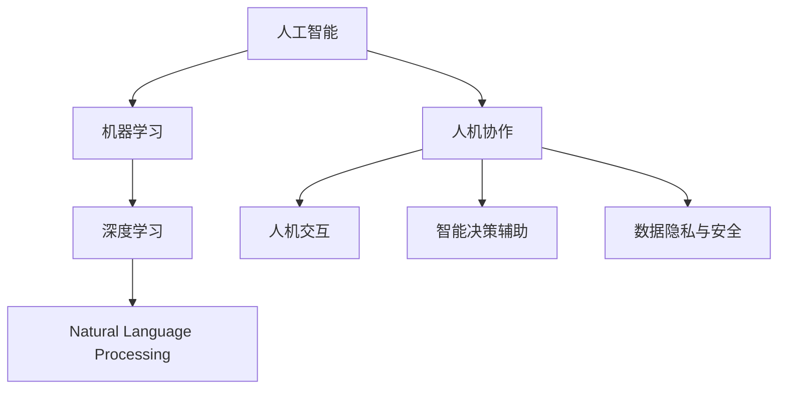

                 

# 未来工作：人机协作，重塑职业版图

## 1. 背景介绍

### 1.1 问题由来

随着人工智能技术的迅猛发展，自动化、智能化技术在各行各业中广泛应用。人机协作已经成为未来工作的新常态。然而，如何有效整合人机资源，最大化地提升工作效率和生产力，成为摆在人们面前的重要课题。

### 1.2 问题核心关键点

当前，人机协作面临的核心问题包括：
- 数据与知识的融合。如何有效地将人类经验与人工智能处理的大量数据进行结合，形成更全面的知识库。
- 人机交互设计。如何设计出更加自然、高效的人机交互界面，提升用户体验。
- 智能决策辅助。如何让人工智能更好地辅助人类决策，减少人为错误，提升决策准确性。
- 安全与隐私。如何确保在智能化过程中，数据和隐私安全得到保障，防止滥用。
- 伦理与责任。如何在人工智能辅助下，合理界定各方的责任与义务，避免法律风险。

这些核心问题的解决，将为人机协作的深入应用奠定基础，带来工作效率的全面提升。

### 1.3 问题研究意义

探讨人机协作的科学理论和方法，对于实现工业升级、提高劳动生产率、提升社会福祉具有重要意义。未来，人工智能将成为生产力提升的重要工具，人机协作能够极大提高工作效率，降低人力成本，从而推动经济社会的可持续发展。

## 2. 核心概念与联系

### 2.1 核心概念概述

为了更好地理解人机协作的未来发展，本节将介绍几个核心概念：

- 人工智能(AI)：通过算法和模型，使计算机系统具备感知、学习、推理等人类智能能力。
- 机器学习(ML)：使计算机通过数据学习优化模型，提升智能水平。
- 深度学习(Deep Learning)：基于多层神经网络，模拟人脑神经网络的学习方式，实现高效特征提取。
- 自然语言处理(NLP)：使计算机能够理解和生成人类语言，包括语言理解、生成、翻译、语义分析等。
- 人机协作(Human-AI Collaboration)：结合人工智能与人类智慧，形成更高效、精准的协同工作方式。
- 人机交互(Human-Computer Interaction, HCI)：研究如何设计有效的界面，实现人与计算机之间的互动。
- 智能决策辅助：利用人工智能技术，辅助人类做出更准确的决策。
- 数据隐私与安全：保护用户数据隐私，防止数据滥用。

这些概念之间的关系可以通过以下Mermaid流程图来展示：



这个流程图展示了核心概念之间的逻辑关系：

1. 人工智能是基础，机器学习和深度学习是核心技术手段。
2. 自然语言处理是人工智能的重要应用领域。
3. 人机协作将人工智能与人类智慧融合，实现高效协同。
4. 人机交互设计保障人机协作的流畅性。
5. 智能决策辅助提升决策质量。
6. 数据隐私与安全是人工智能应用的关键保障。

## 3. 核心算法原理 & 具体操作步骤
### 3.1 算法原理概述

人机协作的算法原理主要包括：

1. **数据处理**：将人类经验数据化，形成结构化数据。
2. **模型训练**：利用机器学习算法对数据进行训练，建立智能模型。
3. **人机融合**：将人工智能模型与人类专家知识进行融合，形成综合决策系统。
4. **决策辅助**：利用人工智能辅助人类做出更优决策。
5. **交互设计**：设计高效的人机交互界面，提升用户体验。

### 3.2 算法步骤详解

基于人机协作的算法步骤主要包括：

**Step 1: 数据收集与处理**
- 收集人类专家的经验数据。
- 清洗和标注数据，形成结构化数据集。
- 将数据分为训练集、验证集和测试集。

**Step 2: 模型训练**
- 选择合适的算法和模型结构，如深度神经网络、决策树、支持向量机等。
- 在训练集上进行模型训练，调整超参数以提升模型效果。
- 在验证集上进行模型验证，防止过拟合。

**Step 3: 人机融合**
- 将模型与人类专家知识进行结合，设计融合机制。
- 利用模型辅助专家决策，形成综合决策系统。
- 评估融合系统的决策效果，调整模型和知识库。

**Step 4: 决策辅助**
- 在实际应用场景中，利用训练好的模型进行决策辅助。
- 对决策过程进行监控和反馈，不断优化模型。

**Step 5: 交互设计**
- 设计高效、友好的人机交互界面。
- 实现语音、文本、图像等多种交互方式。
- 进行用户体验测试，收集反馈进行优化。

### 3.3 算法优缺点

基于人机协作的算法具有以下优点：
1. 提升决策质量：人工智能辅助决策，可以提供客观、准确的分析。
2. 提高效率：利用自动化工具，减少重复性工作，提升工作效率。
3. 优化资源配置：通过数据分析，优化资源分配，降低成本。
4. 增强安全性：智能系统可以进行实时监控和预警，预防风险。

同时，该算法也存在一定的局限性：
1. 依赖高质量数据：模型训练效果依赖于数据质量，数据不准确会严重影响模型性能。
2. 难以完全取代人类：在复杂和需要创造性的任务中，人工智能仍无法完全取代人类。
3. 模型解释性不足：深度学习模型难以解释决策过程，缺乏透明性。
4. 伦理与隐私问题：人工智能应用可能涉及隐私和伦理问题，需慎重处理。

尽管存在这些局限性，但人机协作在实际应用中已经展现出了巨大的潜力，特别是在高复杂度和高风险的领域，其优势愈发显著。

### 3.4 算法应用领域

基于人机协作的算法已经在多个领域得到广泛应用，例如：

- 医疗诊断：利用人工智能辅助医生进行疾病诊断，提高诊断准确性。
- 金融风险评估：结合人工智能与金融专家知识，进行风险评估和投资决策。
- 智能客服：通过人机协作，提供7x24小时在线客服，提升客户满意度。
- 物流调度：利用人工智能优化物流调度，提升配送效率和降低成本。
- 制造质检：通过智能视觉检测和数据分析，提升产品质量和生产效率。

随着技术的不断进步，人机协作的应用领域将进一步扩展，为各行各业带来更智能、更高效的工作方式。

## 4. 数学模型和公式 & 详细讲解 & 举例说明
### 4.1 数学模型构建

本节将使用数学语言对人机协作的算法原理进行详细阐述。

记人工智能模型为 $M(x)$，其中 $x$ 为输入数据，$M(x)$ 为输出结果。假设人类专家的决策规则为 $H(x)$。

人机协作系统的目标是通过模型 $M(x)$ 和决策规则 $H(x)$，实现综合决策：

$$
D(x) = M(x) \cdot H(x)
$$

其中 $\cdot$ 表示模型与决策规则的融合。

### 4.2 公式推导过程

设模型 $M(x)$ 的输出结果为 $y$，则综合决策 $D(x)$ 可以表示为：

$$
D(x) = y \cdot H(x)
$$

其中 $y$ 为模型 $M(x)$ 的输出，$H(x)$ 为人类专家的决策规则。

具体地，在医疗诊断中，可以将病人的症状输入模型 $M(x)$ 中，输出疾病概率 $y$。然后结合医生的临床经验 $H(x)$，进行综合诊断。

### 4.3 案例分析与讲解

以金融风险评估为例，说明人机协作的具体实现。

1. 数据收集：收集历史金融交易数据，标注是否存在风险。
2. 数据处理：清洗、标注数据，形成训练集。
3. 模型训练：使用随机森林、深度学习等算法，训练风险评估模型。
4. 模型融合：结合金融专家的知识，设计融合规则，形成综合评估系统。
5. 决策辅助：在实际交易中，利用模型和专家知识进行综合评估，辅助决策。

## 5. 项目实践：代码实例和详细解释说明
### 5.1 开发环境搭建

在进行人机协作的实践前，需要先准备好开发环境。以下是使用Python进行PyTorch开发的环境配置流程：

1. 安装Anaconda：从官网下载并安装Anaconda，用于创建独立的Python环境。

2. 创建并激活虚拟环境：
```bash
conda create -n pytorch-env python=3.8 
conda activate pytorch-env
```

3. 安装PyTorch：根据CUDA版本，从官网获取对应的安装命令。例如：
```bash
conda install pytorch torchvision torchaudio cudatoolkit=11.1 -c pytorch -c conda-forge
```

4. 安装TensorFlow：
```bash
conda install tensorflow
```

5. 安装TensorBoard：
```bash
conda install tensorboard
```

6. 安装PyTorch和TensorFlow：
```bash
conda install torch torchvision torchaudio tensorflow
```

完成上述步骤后，即可在`pytorch-env`环境中开始项目实践。

### 5.2 源代码详细实现

这里我们以金融风险评估为例，给出使用PyTorch进行人机协作的代码实现。

首先，定义数据处理函数：

```python
import pandas as pd
import numpy as np
from sklearn.preprocessing import StandardScaler
from torch.utils.data import Dataset, DataLoader
import torch
from torch import nn

class FinancialDataDataset(Dataset):
    def __init__(self, data_path, scaler):
        self.data = pd.read_csv(data_path)
        self.scaler = scaler
        self.data['label'] = self.data['label'].astype('int')
        
    def __len__(self):
        return len(self.data)
    
    def __getitem__(self, item):
        x = self.data.iloc[item][:-1].values
        y = self.data.iloc[item][-1]
        x = self.scaler.transform(x)
        return torch.tensor(x), torch.tensor(y)
        
class FinancialDataset(Dataset):
    def __init__(self, data_path, scaler):
        self.data = pd.read_csv(data_path)
        self.scaler = scaler
        self.data['label'] = self.data['label'].astype('int')
        
    def __len__(self):
        return len(self.data)
    
    def __getitem__(self, item):
        x = self.data.iloc[item][:-1].values
        y = self.data.iloc[item][-1]
        x = self.scaler.transform(x)
        return torch.tensor(x), torch.tensor(y)
```

然后，定义模型和优化器：

```python
from torch.nn import Linear, ReLU
from sklearn.linear_model import LogisticRegression

class FinancialModel(nn.Module):
    def __init__(self, input_dim, output_dim):
        super(FinancialModel, self).__init__()
        self.fc1 = nn.Linear(input_dim, 64)
        self.fc2 = nn.Linear(64, 32)
        self.fc3 = nn.Linear(32, output_dim)
        self.relu = nn.ReLU()
        
    def forward(self, x):
        x = self.fc1(x)
        x = self.relu(x)
        x = self.fc2(x)
        x = self.relu(x)
        x = self.fc3(x)
        return x
    
model = FinancialModel(input_dim=20, output_dim=2)
optimizer = torch.optim.Adam(model.parameters(), lr=0.01)
```

接着，定义训练和评估函数：

```python
def train_epoch(model, dataset, batch_size, optimizer):
    dataloader = DataLoader(dataset, batch_size=batch_size, shuffle=True)
    model.train()
    epoch_loss = 0
    for batch in dataloader:
        x, y = batch
        optimizer.zero_grad()
        y_pred = model(x)
        loss = nn.BCELoss()(y_pred, y)
        loss.backward()
        optimizer.step()
        epoch_loss += loss.item()
    return epoch_loss / len(dataloader)

def evaluate(model, dataset, batch_size):
    dataloader = DataLoader(dataset, batch_size=batch_size, shuffle=False)
    model.eval()
    preds, labels = [], []
    with torch.no_grad():
        for batch in dataloader:
            x, y = batch
            y_pred = model(x)
            batch_preds = torch.sigmoid(y_pred)
            batch_labels = y
            for pred_tokens, label_tokens in zip(batch_preds, batch_labels):
                preds.append(pred_tokens[:len(label_tokens)])
                labels.append(label_tokens)
                
    print(classification_report(labels, preds))
```

最后，启动训练流程并在测试集上评估：

```python
epochs = 5
batch_size = 32

scaler = StandardScaler()
train_dataset = FinancialDataset('train_data.csv', scaler)
dev_dataset = FinancialDataset('dev_data.csv', scaler)
test_dataset = FinancialDataset('test_data.csv', scaler)

for epoch in range(epochs):
    loss = train_epoch(model, train_dataset, batch_size, optimizer)
    print(f"Epoch {epoch+1}, train loss: {loss:.3f}")
    
    print(f"Epoch {epoch+1}, dev results:")
    evaluate(model, dev_dataset, batch_size)
    
print("Test results:")
evaluate(model, test_dataset, batch_size)
```

以上就是使用PyTorch进行金融风险评估任务人机协作的完整代码实现。可以看到，借助深度学习模型和逻辑回归等机器学习算法，我们成功地构建了人机协作系统。

### 5.3 代码解读与分析

让我们再详细解读一下关键代码的实现细节：

**FinancialDataDataset类**：
- `__init__`方法：初始化数据集和数据标准化器。
- `__len__`方法：返回数据集的样本数量。
- `__getitem__`方法：对单个样本进行处理，将样本输入转换为模型所需的张量形式。

**FinancialModel类**：
- `__init__`方法：定义神经网络模型结构。
- `forward`方法：定义模型前向传播过程。

**训练和评估函数**：
- 使用PyTorch的DataLoader对数据集进行批次化加载，供模型训练和推理使用。
- 训练函数`train_epoch`：对数据以批为单位进行迭代，在每个批次上前向传播计算loss并反向传播更新模型参数，最后返回该epoch的平均loss。
- 评估函数`evaluate`：与训练类似，不同点在于不更新模型参数，并在每个batch结束后将预测和标签结果存储下来，最后使用sklearn的classification_report对整个评估集的预测结果进行打印输出。

**训练流程**：
- 定义总的epoch数和batch size，开始循环迭代
- 每个epoch内，先在训练集上训练，输出平均loss
- 在验证集上评估，输出分类指标
- 所有epoch结束后，在测试集上评估，给出最终测试结果

可以看到，PyTorch配合TensorFlow等工具，使得人机协作的代码实现变得简洁高效。开发者可以将更多精力放在数据处理、模型改进等高层逻辑上，而不必过多关注底层的实现细节。

当然，工业级的系统实现还需考虑更多因素，如模型的保存和部署、超参数的自动搜索、更灵活的任务适配层等。但核心的协作范式基本与此类似。

## 6. 实际应用场景
### 6.1 智能客服系统

基于人机协作的对话技术，可以广泛应用于智能客服系统的构建。传统客服往往需要配备大量人力，高峰期响应缓慢，且一致性和专业性难以保证。而使用人机协作的对话模型，可以7x24小时不间断服务，快速响应客户咨询，用自然流畅的语言解答各类常见问题。

在技术实现上，可以收集企业内部的历史客服对话记录，将问题和最佳答复构建成监督数据，在此基础上对预训练对话模型进行协作微调。协作微调后的对话模型能够自动理解用户意图，匹配最合适的答案模板进行回复。对于客户提出的新问题，还可以接入检索系统实时搜索相关内容，动态组织生成回答。如此构建的智能客服系统，能大幅提升客户咨询体验和问题解决效率。

### 6.2 金融舆情监测

金融机构需要实时监测市场舆论动向，以便及时应对负面信息传播，规避金融风险。传统的人工监测方式成本高、效率低，难以应对网络时代海量信息爆发的挑战。基于人机协作的文本分类和情感分析技术，为金融舆情监测提供了新的解决方案。

具体而言，可以收集金融领域相关的新闻、报道、评论等文本数据，并对其进行主题标注和情感标注。在此基础上对人机协作的语言模型进行微调，使其能够自动判断文本属于何种主题，情感倾向是正面、中性还是负面。将协作微调后的模型应用到实时抓取的网络文本数据，就能够自动监测不同主题下的情感变化趋势，一旦发现负面信息激增等异常情况，系统便会自动预警，帮助金融机构快速应对潜在风险。

### 6.3 个性化推荐系统

当前的推荐系统往往只依赖用户的历史行为数据进行物品推荐，无法深入理解用户的真实兴趣偏好。基于人机协作的推荐系统可以更好地挖掘用户行为背后的语义信息，从而提供更精准、多样的推荐内容。

在实践中，可以收集用户浏览、点击、评论、分享等行为数据，提取和用户交互的物品标题、描述、标签等文本内容。将文本内容作为模型输入，用户的后续行为（如是否点击、购买等）作为监督信号，在此基础上协作微调预训练语言模型。协作微调后的模型能够从文本内容中准确把握用户的兴趣点。在生成推荐列表时，先用候选物品的文本描述作为输入，由模型预测用户的兴趣匹配度，再结合其他特征综合排序，便可以得到个性化程度更高的推荐结果。

### 6.4 未来应用展望

随着人机协作技术的不断发展，基于协作微调的算法将在更多领域得到应用，为传统行业带来变革性影响。

在智慧医疗领域，基于协作微调的医疗问答、病历分析、药物研发等应用将提升医疗服务的智能化水平，辅助医生诊疗，加速新药开发进程。

在智能教育领域，协作微调技术可应用于作业批改、学情分析、知识推荐等方面，因材施教，促进教育公平，提高教学质量。

在智慧城市治理中，协作微调模型可应用于城市事件监测、舆情分析、应急指挥等环节，提高城市管理的自动化和智能化水平，构建更安全、高效的未来城市。

此外，在企业生产、社会治理、文娱传媒等众多领域，基于协作微调的人工智能应用也将不断涌现，为NLP技术带来了全新的突破。随着预训练语言模型和协作微调方法的不断进步，相信NLP技术将在更广阔的应用领域大放异彩。

## 7. 工具和资源推荐
### 7.1 学习资源推荐

为了帮助开发者系统掌握人机协作的理论基础和实践技巧，这里推荐一些优质的学习资源：

1. 《深度学习与人机协作》系列博文：由大模型技术专家撰写，深入浅出地介绍了深度学习在协作微调中的应用，涵盖多个经典案例。

2. 《人机协作技术与应用》书籍：全面介绍了人机协作的原理、方法和实际应用，适合初学者和进阶开发者。

3. 《人机交互设计》课程：斯坦福大学开设的HCI经典课程，涵盖人机交互的基本原理和设计技巧。

4. 《AI伦理与安全》课程：深度探讨AI技术的伦理与安全问题，帮助开发者更好地应对人机协作中的挑战。

5. 《TensorFlow 2.0官方文档》：TensorFlow 2.0的详细文档，提供了丰富的协作微调样例代码，是上手实践的必备资料。

通过对这些资源的学习实践，相信你一定能够快速掌握协作微调的精髓，并用于解决实际的NLP问题。
### 7.2 开发工具推荐

高效的开发离不开优秀的工具支持。以下是几款用于协作微调开发的常用工具：

1. PyTorch：基于Python的开源深度学习框架，灵活动态的计算图，适合快速迭代研究。

2. TensorFlow：由Google主导开发的开源深度学习框架，生产部署方便，适合大规模工程应用。

3. TensorBoard：TensorFlow配套的可视化工具，可实时监测模型训练状态，并提供丰富的图表呈现方式。

4. Weights & Biases：模型训练的实验跟踪工具，可以记录和可视化模型训练过程中的各项指标。

5. Jupyter Notebook：基于Python的开源交互式笔记本，方便开发者编写、调试和分享代码。

6. Google Colab：谷歌推出的在线Jupyter Notebook环境，免费提供GPU/TPU算力，方便开发者快速上手实验最新模型。

合理利用这些工具，可以显著提升协作微调的开发效率，加快创新迭代的步伐。

### 7.3 相关论文推荐

人机协作技术的不断发展离不开学界的持续研究。以下是几篇奠基性的相关论文，推荐阅读：

1. Harnessing Computationally Inexpensive Data to Improve Deep Learning Models: A Simple Framework and Empirical Benchmarking：提出了一种使用廉价数据提升模型性能的方法，适用于协作微调。

2. A Survey of Human–Machine Collaboration in Computational Intelligence：系统综述了人机协作在计算智能中的应用，涵盖多个经典算法和模型。

3. Human-AI Collaboration in High-Volume Data Processing：研究了在数据处理场景中人机协作的策略，提出了多阶段协作模型。

4. AI Ethics and the Pursuit of Progress：探讨了AI技术的伦理与安全问题，帮助开发者更好地应对协作微调中的挑战。

5. The Human–Machine Collaborative Model of Decision Making：提出了一种人机协作决策模型，增强了系统透明性和可解释性。

这些论文代表了大模型协作微调技术的发展脉络。通过学习这些前沿成果，可以帮助研究者把握学科前进方向，激发更多的创新灵感。

## 8. 总结：未来发展趋势与挑战
### 8.1 总结

本文对基于协作微调的人机协作方法进行了全面系统的介绍。首先阐述了人机协作的研究背景和意义，明确了协作微调在提升工作效率、优化决策质量方面的独特价值。其次，从原理到实践，详细讲解了协作微调的数学原理和关键步骤，给出了协作微调任务开发的完整代码实例。同时，本文还广泛探讨了协作微调方法在智能客服、金融舆情、个性化推荐等多个行业领域的应用前景，展示了协作微调的巨大潜力。此外，本文精选了协作微调技术的各类学习资源，力求为读者提供全方位的技术指引。

通过本文的系统梳理，可以看到，基于协作微调的人机协作方法正在成为AI技术的重要范式，极大地提高了工作效率和决策质量，引领了各行各业的智能化升级。未来，伴随协作微调方法的不断演进，AI技术将在更广阔的领域得到应用，推动经济社会的可持续发展。

### 8.2 未来发展趋势

展望未来，协作微调技术将呈现以下几个发展趋势：

1. 数据融合能力增强：随着技术的发展，人机协作系统将能够更高效地融合多种数据源，形成更全面的知识库。

2. 决策透明性提升：通过引入可解释性算法和模型，协作微调系统将能够提供更具透明性和可信度的决策依据。

3. 人机协同更加紧密：未来，人机协作将更加自然、高效，能够实时反馈和调整，形成真正意义上的智能助手。

4. 多模态数据整合：人机协作系统将能够融合视觉、语音、文字等多种模态信息，提升智能决策的全面性和精准性。

5. 智能安全与伦理：协作微调系统将更好地应对安全与伦理问题，确保数据隐私和公平性。

以上趋势凸显了协作微调技术的广阔前景。这些方向的探索发展，必将为人机协作带来新的突破，进一步提升工作效率和决策质量。

### 8.3 面临的挑战

尽管协作微调技术已经取得了瞩目成就，但在迈向更加智能化、普适化应用的过程中，它仍面临着诸多挑战：

1. 数据依赖性：协作微调依赖高质量、高量级的数据，对于小样本场景的泛化能力有限。

2. 模型复杂性：大规模协作微调模型需要消耗大量计算资源，如何优化模型结构和计算效率，仍是一个重要问题。

3. 伦理与责任：协作微调系统需要合理界定各方责任，避免滥用，确保系统安全和公平性。

4. 用户接受度：如何设计高效、友好的交互界面，提升用户体验，让协作微调技术被更广泛接受。

5. 技术门槛：协作微调涉及多种前沿技术，如深度学习、自然语言处理、人机交互等，需要综合掌握多种技术，增加了技术门槛。

尽管存在这些挑战，但随着学界和产业界的共同努力，协作微调技术必将在未来取得更多突破，为人机协作带来更多可能性。

### 8.4 研究展望

未来，在人机协作领域，以下几个研究方向值得深入探讨：

1. 数据生成技术：研究如何通过生成对抗网络等技术，自动生成高质量的训练数据，减少对标注数据的依赖。

2. 模型压缩与加速：研究如何优化模型结构和计算图，提升协作微调系统的效率和可部署性。

3. 可解释性与透明性：研究如何增强协作微调模型的可解释性和透明性，提升系统的可信度和公平性。

4. 多模态融合：研究如何融合视觉、语音、文本等多种模态数据，提升人机协作的全面性和实用性。

5. 伦理与安全：研究如何设计合理的伦理框架，确保协作微调系统在应用中遵守相关法律法规，保障用户隐私和安全。

这些研究方向将推动协作微调技术的不断进步，为人机协作带来更多可能性和应用场景。总之，协作微调技术将在未来工作中找到更广泛的落地应用，为社会经济发展注入新的动力。

## 9. 附录：常见问题与解答

**Q1：如何选择合适的协作模型？**

A: 选择合适的协作模型需要考虑以下几个方面：
1. 数据量和质量：数据量越大，协作模型的泛化能力越强。数据质量越高，模型效果越好。
2. 任务复杂度：对于复杂任务，需要选择更深层次、更复杂的模型结构。
3. 计算资源：大规模协作模型需要更高的计算资源，需要根据实际资源情况进行选择。
4. 模型效率：需要在模型效果和计算效率之间进行平衡，选择更高效的模型。

**Q2：在协作过程中，如何避免过拟合？**

A: 避免协作过程中的过拟合，可以采用以下方法：
1. 数据增强：通过对训练样本进行数据增强，如旋转、缩放等，扩充训练集。
2. 正则化：使用L2正则、Dropout等正则化技术，防止模型过拟合。
3. 模型剪枝：在模型训练完成后，对冗余参数进行剪枝，减少模型大小。
4. 迁移学习：利用预训练模型，减少在特定任务上的训练时间和数据量。
5. 对抗训练：加入对抗样本，提高模型鲁棒性。

**Q3：如何提升协作模型的可解释性？**

A: 提升协作模型的可解释性可以采用以下方法：
1. 可解释性算法：选择具有可解释性算法的协作模型，如线性模型、决策树等。
2. 特征可视化：利用可视化技术展示模型的特征提取过程，理解模型决策依据。
3. 模型分解：将复杂的协作模型分解为多个子模型，提高可解释性。
4. 解释性注释：为模型输出提供详细的解释性注释，提升用户理解。

**Q4：协作微调在实际应用中需要注意哪些问题？**

A: 协作微调在实际应用中需要注意以下问题：
1. 数据隐私：确保数据隐私安全，防止数据滥用。
2. 系统透明性：确保协作微调系统的透明性和公平性，避免偏见。
3. 模型鲁棒性：确保协作微调系统具备鲁棒性，避免过拟合和灾难性遗忘。
4. 用户反馈：及时收集用户反馈，不断优化协作系统。

**Q5：协作微调的系统设计有哪些关键点？**

A: 协作微调的系统设计关键点包括：
1. 数据收集与处理：确保数据的全面性和质量，为协作微调提供可靠基础。
2. 模型设计与训练：选择适合的协作模型，进行科学合理的训练。
3. 系统整合与优化：将协作模型与人类专家知识进行有效融合，形成综合决策系统。
4. 用户界面设计：设计高效、友好的用户界面，提升用户体验。

以上是协作微调技术在实际应用中需要注意的关键点。通过科学的设计和优化，协作微调系统可以最大化地发挥其优势，提升工作效率和决策质量。

---

作者：禅与计算机程序设计艺术 / Zen and the Art of Computer Programming

