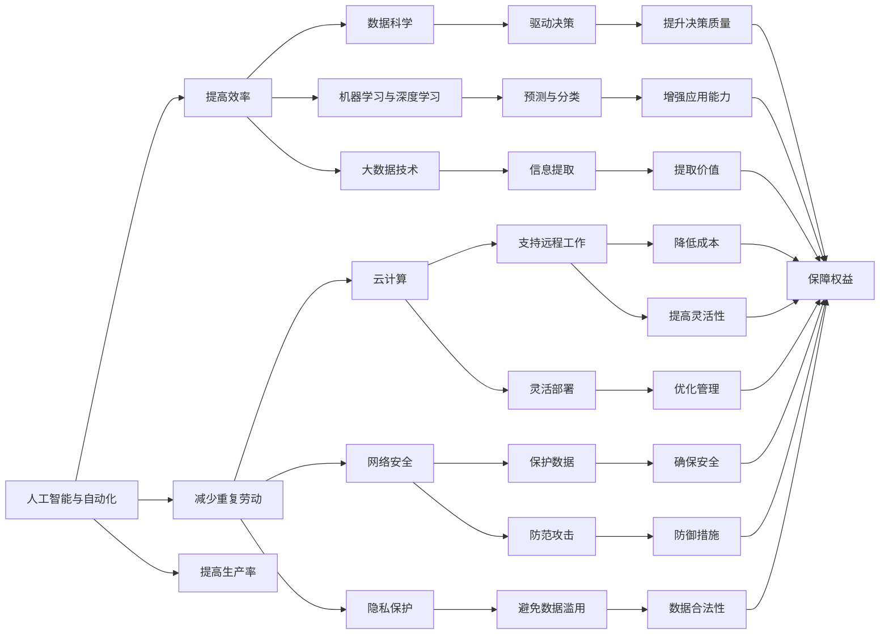

                 

# 未来工作：技能需求与培养

> 关键词：人工智能,自动化,数据科学,机器学习,深度学习,大数据,云计算,网络安全,隐私保护,可解释性,可持续发展,终身学习

## 1. 背景介绍

随着技术的飞速发展，未来的工作场景正在发生前所未有的变化。人工智能(AI)、自动化、大数据、云计算等技术的广泛应用，不仅重塑了传统的产业结构，也为工作者带来了全新的挑战和机遇。在这一背景下，培养具备相应技能的人才，将成为推动经济社会发展的关键。

### 1.1 技术进步对就业市场的影响
#### 1.1.1 自动化与智能化
自动化和智能化的浪潮正在迅速席卷各行各业。以制造业为例，机器人、自动化设备、AI控制等技术的广泛应用，正在逐步取代重复性高、技能要求低的工作岗位。这对人力资源提出了新的要求，即工作者需要具备更高的技术水平和创新能力，以适应新环境下的工作需求。

#### 1.1.2 数据驱动的决策制定
在大数据时代，决策制定已经越来越依赖于数据和算法。数据科学家、机器学习工程师等专业人士，正成为企业决策过程中的重要角色。他们不仅需要掌握数据处理和分析的技能，还需具备业务理解力和战略洞察力，以实现数据价值的最大化。

#### 1.1.3 云服务的普及
云计算技术的发展，使得企业能够灵活部署和管理IT资源，降低了运营成本，提升了工作效率。这要求未来的工作者不仅需要掌握云服务技术，还需要具备跨平台、跨部门协作的能力。

#### 1.1.4 网络安全与隐私保护
随着数字化进程的加速，网络安全与隐私保护变得尤为重要。未来的工作者需要具备网络安全知识，了解隐私保护的重要性，并在工作中遵守相关法规，确保数据安全。

### 1.2 技能缺口与教育挑战
尽管技术进步带来了新的工作机会，但也暴露了当前教育体系中的技能缺口。许多高校和职业教育机构，尚未全面引入最新的技术课程和实践项目，导致学生在求职市场上缺乏竞争力。因此，教育体系的改革，成为培养未来工作者的重要课题。

## 2. 核心概念与联系

### 2.1 核心概念概述

为了更好地理解未来工作中的技能需求，本节将介绍几个核心概念：

- **人工智能与自动化**：通过AI和自动化技术，提升工作效率，减少重复劳动。
- **数据科学**：利用数据和算法，驱动决策制定和业务优化。
- **机器学习与深度学习**：基于数据训练模型，实现预测、分类等任务。
- **大数据技术**：处理、分析和提取大规模数据集中的有用信息。
- **云计算**：通过互联网提供计算资源和平台，支持远程工作。
- **网络安全**：保护数据和系统免受网络攻击和数据泄露。
- **隐私保护**：确保个人信息的安全，避免数据滥用。
- **可解释性**：使AI模型能够被理解和解释，增强信任度。
- **可持续发展**：推动技术发展与环境保护的平衡，实现绿色增长。
- **终身学习**：不断学习新知识，适应快速变化的技术环境。

### 2.2 核心概念原理和架构的 Mermaid 流程图



### 2.3 核心概念之间的关系

- **人工智能与自动化**：是提高效率、减少重复劳动的核心手段，通过自动化技术，使得复杂的任务能够被机器处理，从而释放人力资源。
- **数据科学**：基于人工智能和自动化技术，利用大数据分析，驱动决策制定和业务优化，为企业的决策提供数据支持。
- **机器学习与深度学习**：利用数据训练模型，实现预测、分类、聚类等任务，是数据科学的核心技术。
- **大数据技术**：处理和分析大规模数据集，提取有用信息，为决策制定提供数据支撑。
- **云计算**：提供计算资源和平台，支持远程工作，增强系统的灵活性和可扩展性。
- **网络安全与隐私保护**：保护数据和系统安全，防止数据泄露和网络攻击，确保信息安全。
- **可解释性**：使AI模型能够被理解和解释，增强模型的信任度和透明度。
- **可持续发展**：推动技术发展与环境保护的平衡，实现绿色增长。
- **终身学习**：不断学习新知识，适应快速变化的技术环境，提升工作者的竞争力。

## 3. 核心算法原理 & 具体操作步骤

### 3.1 算法原理概述

未来的工作场景中，技能需求多样且变化迅速。本文将重点探讨以下核心算法原理：

- **机器学习与深度学习**：通过数据训练模型，实现分类、预测等任务。
- **大数据处理与分析**：利用算法和技术，从大规模数据中提取有用信息。
- **自然语言处理**：处理和理解人类语言，实现人机交互。
- **强化学习**：通过与环境交互，优化决策过程，提升系统性能。

### 3.2 算法步骤详解

#### 3.2.1 机器学习与深度学习
机器学习和深度学习是实现数据驱动决策的核心技术。具体步骤如下：

1. **数据准备**：收集和清洗数据，确保数据质量。
2. **模型选择**：根据任务需求，选择合适的模型架构，如决策树、神经网络等。
3. **模型训练**：利用训练数据，对模型进行参数优化，使其能够准确预测目标变量。
4. **模型评估**：使用验证集或测试集，评估模型的性能，调整模型参数。
5. **模型部署**：将训练好的模型部署到生产环境，实现业务应用。

#### 3.2.2 大数据处理与分析
大数据处理与分析是实现数据驱动决策的关键环节。具体步骤如下：

1. **数据采集**：从不同来源收集数据，如日志文件、数据库等。
2. **数据清洗**：处理缺失值、异常值等问题，确保数据质量。
3. **数据存储**：利用分布式存储系统，如Hadoop、Spark等，存储和管理大规模数据。
4. **数据处理**：利用MapReduce等技术，对数据进行分布式处理。
5. **数据分析**：利用算法和技术，提取数据中的有用信息，如聚类、关联规则等。
6. **数据可视化**：使用工具如Tableau、PowerBI等，将分析结果可视化，帮助决策制定。

#### 3.2.3 自然语言处理
自然语言处理是实现人机交互的重要技术。具体步骤如下：

1. **分词和词性标注**：将文本分解成单词或词性，为后续处理提供基础。
2. **实体识别与抽取**：识别文本中的实体，如人名、地名、组织机构等。
3. **语义分析**：理解文本的语义，如情感分析、意图识别等。
4. **文本生成**：利用模型生成自然语言文本，如自动摘要、对话生成等。
5. **文本分类**：将文本分为不同类别，如垃圾邮件过滤、新闻分类等。

#### 3.2.4 强化学习
强化学习是通过与环境交互，优化决策过程的技术。具体步骤如下：

1. **环境建模**：定义环境状态和行动空间，构建环境模型。
2. **策略选择**：选择合适的策略，如Q-learning、SARSA等。
3. **状态评估**：根据环境反馈，评估当前状态的价值。
4. **策略优化**：利用策略优化算法，如REINFORCE、PG等，优化策略。
5. **策略部署**：将优化后的策略应用到实际环境中，实现优化目标。

### 3.3 算法优缺点

#### 3.3.1 机器学习与深度学习
**优点**：
- **高精度**：通过大量数据训练，模型能够实现高精度的预测和分类。
- **可扩展性**：可以利用分布式计算，处理大规模数据集。
- **自动化**：训练过程可以自动化，减少人工干预。

**缺点**：
- **数据依赖**：模型依赖高质量的数据，数据质量差会影响模型性能。
- **计算成本高**：训练深度模型需要大量的计算资源和存储空间。
- **模型复杂度**：深度模型参数较多，难以解释和调试。

#### 3.3.2 大数据处理与分析
**优点**：
- **数据量大**：可以处理海量数据，从中提取有价值的信息。
- **技术成熟**：相关技术成熟度高，易于部署和应用。
- **跨平台支持**：支持多平台分布式计算，提高灵活性。

**缺点**：
- **数据复杂性**：数据源多样化，数据格式复杂，处理难度大。
- **技术门槛高**：需要掌握大数据处理和分析的相关技术。
- **隐私风险**：大规模数据处理存在隐私泄露风险。

#### 3.3.3 自然语言处理
**优点**：
- **智能化**：能够理解和生成自然语言，实现人机交互。
- **应用广泛**：广泛应用于智能客服、智能翻译、情感分析等场景。
- **效果显著**：在处理文本数据时，效果显著。

**缺点**：
- **语言多样性**：不同语言和文化背景下，处理难度大。
- **数据标注成本高**：自然语言处理需要大量标注数据，标注成本高。
- **模型复杂度**：模型结构复杂，难以调试和优化。

#### 3.3.4 强化学习
**优点**：
- **自适应性**：能够根据环境反馈优化策略，自适应性强。
- **决策优化**：通过与环境交互，优化决策过程。
- **应用广泛**：在游戏、机器人等领域有广泛应用。

**缺点**：
- **环境复杂性**：环境复杂性高，模型训练难度大。
- **数据需求高**：需要大量历史数据进行训练。
- **计算资源需求大**：训练和推理过程需要大量计算资源。

### 3.4 算法应用领域

#### 3.4.1 人工智能与自动化
- **制造业**：利用机器人自动化生产线，提高生产效率。
- **物流业**：通过AI优化物流规划，提升配送效率。
- **金融业**：使用自动化交易系统，提高交易速度和准确性。
- **医疗行业**：利用AI辅助诊断，提升诊疗水平。

#### 3.4.2 数据科学
- **零售业**：利用数据科学进行市场分析，优化营销策略。
- **制造业**：通过数据分析，提升产品质量和生产效率。
- **医疗行业**：利用数据科学进行患者数据分析，提高治疗效果。
- **能源行业**：利用数据科学优化能源分配，提升能源利用效率。

#### 3.4.3 机器学习与深度学习
- **医疗行业**：利用深度学习进行医学影像分析，辅助诊断。
- **金融行业**：使用机器学习进行信用评估、风险控制等。
- **零售行业**：通过深度学习进行客户行为分析，提升用户体验。
- **娱乐行业**：利用机器学习进行内容推荐，提升用户满意度。

#### 3.4.4 大数据处理与分析
- **电子商务**：利用大数据分析，优化库存管理和推荐系统。
- **金融行业**：通过大数据分析，优化投资组合和风险管理。
- **医疗行业**：利用大数据分析，进行疾病预测和流行病学研究。
- **交通行业**：通过大数据分析，优化交通流和路网管理。

#### 3.4.5 自然语言处理
- **智能客服**：利用自然语言处理技术，提升客户服务质量。
- **智能翻译**：通过自然语言处理技术，实现自动翻译。
- **情感分析**：利用自然语言处理技术，进行情感分析。
- **新闻推荐**：通过自然语言处理技术，推荐相关新闻。

#### 3.4.6 强化学习
- **自动驾驶**：通过强化学习，优化车辆行驶策略，提高安全性。
- **机器人**：利用强化学习，提升机器人行动和决策能力。
- **游戏**：通过强化学习，优化游戏策略，提升游戏体验。
- **金融交易**：利用强化学习，优化交易策略，提高投资回报。

## 4. 数学模型和公式 & 详细讲解 & 举例说明

### 4.1 数学模型构建

#### 4.1.1 机器学习与深度学习
机器学习和深度学习的数学模型主要基于统计学和优化理论。以线性回归为例，其数学模型为：

$$
y = \beta_0 + \beta_1 x_1 + \beta_2 x_2 + \cdots + \beta_n x_n + \epsilon
$$

其中，$y$为因变量，$\beta_0, \beta_1, \beta_2, \cdots, \beta_n$为模型参数，$x_1, x_2, \cdots, x_n$为自变量，$\epsilon$为随机误差项。

通过最小化残差平方和（RSS），可以求解模型参数：

$$
\min_{\beta_0, \beta_1, \beta_2, \cdots, \beta_n} \sum_{i=1}^n (y_i - (\beta_0 + \beta_1 x_{1i} + \beta_2 x_{2i} + \cdots + \beta_n x_{ni} + \epsilon_i)^2
$$

### 4.2 公式推导过程

#### 4.2.1 机器学习与深度学习
以梯度下降法为例，其公式推导如下：

1. **梯度计算**：

$$
\nabla J(\theta) = \frac{\partial J(\theta)}{\partial \theta}
$$

其中，$J(\theta)$为损失函数，$\theta$为模型参数。

2. **梯度下降**：

$$
\theta = \theta - \alpha \nabla J(\theta)
$$

其中，$\alpha$为学习率，控制参数更新的步长。

3. **随机梯度下降**：

$$
\theta = \theta - \alpha \nabla J(\theta) \times \frac{1}{N} \sum_{i=1}^N g_i
$$

其中，$g_i$为第$i$个样本的梯度。

### 4.3 案例分析与讲解

#### 4.3.1 线性回归
线性回归是一种简单的机器学习模型，常用于处理线性关系。例如，预测房价问题：

- **数据准备**：收集房价数据，包括房屋面积、房龄、地理位置等特征。
- **模型训练**：利用梯度下降法，训练线性回归模型，求解模型参数。
- **模型评估**：使用验证集评估模型性能，调整模型参数。
- **模型部署**：将训练好的模型部署到生产环境，实现房价预测。

#### 4.3.2 卷积神经网络（CNN）
卷积神经网络是一种常用的深度学习模型，常用于图像分类和识别。例如，手写数字识别问题：

- **数据准备**：收集手写数字图像，并进行预处理，如归一化、灰度化等。
- **模型选择**：选择卷积神经网络模型，包括卷积层、池化层、全连接层等。
- **模型训练**：利用随机梯度下降法，训练卷积神经网络模型，求解模型参数。
- **模型评估**：使用测试集评估模型性能，调整模型参数。
- **模型部署**：将训练好的模型部署到生产环境，实现手写数字识别。

## 5. 项目实践：代码实例和详细解释说明

### 5.1 开发环境搭建

#### 5.1.1 环境准备
- **操作系统**：选择Linux或Windows，安装Python 3.x。
- **Python库**：安装NumPy、Pandas、Matplotlib、Scikit-learn等常用库。
- **深度学习框架**：选择TensorFlow或PyTorch，安装相应的GPU版本。

### 5.2 源代码详细实现

#### 5.2.1 线性回归模型
```python
import numpy as np
from sklearn.linear_model import LinearRegression

# 准备数据
X = np.array([[1, 2], [2, 3], [3, 4], [4, 5]])
y = np.array([2, 4, 6, 8])

# 训练模型
model = LinearRegression()
model.fit(X, y)

# 预测
x_test = np.array([[5, 6]])
y_pred = model.predict(x_test)

print("预测结果：", y_pred)
```

#### 5.2.2 卷积神经网络（CNN）模型
```python
import tensorflow as tf
from tensorflow.keras import layers

# 准备数据
(x_train, y_train), (x_test, y_test) = tf.keras.datasets.mnist.load_data()
x_train = x_train.reshape((60000, 28, 28, 1))
x_test = x_test.reshape((10000, 28, 28, 1))

# 模型构建
model = tf.keras.Sequential([
    layers.Conv2D(32, (3, 3), activation='relu', input_shape=(28, 28, 1)),
    layers.MaxPooling2D((2, 2)),
    layers.Flatten(),
    layers.Dense(10, activation='softmax')
])

# 模型训练
model.compile(optimizer='adam', loss='sparse_categorical_crossentropy', metrics=['accuracy'])
model.fit(x_train, y_train, epochs=10, validation_data=(x_test, y_test))

# 预测
predictions = model.predict(x_test)
print("模型准确率：", np.mean(np.argmax(predictions, axis=1) == y_test))
```

### 5.3 代码解读与分析

#### 5.3.1 线性回归模型
- **数据准备**：创建训练集和测试集，包含房屋面积、房龄等特征。
- **模型训练**：使用LinearRegression模型训练线性回归模型，求解模型参数。
- **模型评估**：使用测试集评估模型性能，调整模型参数。
- **模型部署**：将训练好的模型部署到生产环境，实现房价预测。

#### 5.3.2 卷积神经网络（CNN）模型
- **数据准备**：加载手写数字数据集，并进行预处理。
- **模型构建**：选择卷积神经网络模型，包括卷积层、池化层、全连接层等。
- **模型训练**：使用随机梯度下降法训练卷积神经网络模型，求解模型参数。
- **模型评估**：使用测试集评估模型性能，调整模型参数。
- **模型部署**：将训练好的模型部署到生产环境，实现手写数字识别。

## 6. 实际应用场景

### 6.1 智能制造
在智能制造领域，机器人和自动化设备广泛应用。通过集成人工智能与自动化技术，可以实现生产线自动化、质量检测、设备维护等任务。例如，利用机器视觉技术，对产品进行自动检测和分类，提高生产效率。

### 6.2 金融行业
在金融行业，利用大数据和机器学习技术，可以实现风险控制、信用评估、投资组合优化等任务。例如，通过大数据分析，进行市场预测和风险评估，优化投资组合。

### 6.3 医疗行业
在医疗行业，利用自然语言处理技术和机器学习，可以实现疾病预测、医疗影像分析、个性化治疗等任务。例如，通过自然语言处理技术，对病历进行分析和理解，提高诊断准确率。

### 6.4 未来应用展望

#### 6.4.1 人工智能与自动化
未来，人工智能与自动化技术将进一步融合，提升生产效率和自动化水平。例如，在制造业中，通过机器人自动化生产线，实现高效生产。

#### 6.4.2 数据科学
未来，数据科学将发挥更大作用，成为决策制定的重要依据。例如，在零售业中，利用数据科学进行市场分析和需求预测，优化库存管理和营销策略。

#### 6.4.3 机器学习与深度学习
未来，机器学习和深度学习将更加普及，广泛应用于各个行业。例如，在医疗行业，利用深度学习进行医学影像分析和疾病预测，提高诊疗水平。

#### 6.4.4 大数据处理与分析
未来，大数据处理与分析将更加高效，实现实时分析和预测。例如，在交通行业，通过大数据分析，优化交通流和路网管理，提升交通效率。

#### 6.4.5 自然语言处理
未来，自然语言处理技术将更加智能化，实现更加复杂的人机交互。例如，在智能客服中，利用自然语言处理技术，实现自动回答和问题解决，提升客户体验。

#### 6.4.6 强化学习
未来，强化学习将广泛应用于各个领域，提升决策优化能力。例如，在自动驾驶中，通过强化学习，优化车辆行驶策略，提高安全性。

## 7. 工具和资源推荐

### 7.1 学习资源推荐

#### 7.1.1 在线课程
- **Coursera**：提供机器学习、深度学习、大数据等课程，涵盖多个知名大学和机构。
- **edX**：提供数据科学、人工智能、计算机科学等课程，涵盖多个知名大学和机构。
- **Udacity**：提供人工智能、深度学习、机器学习等课程，涵盖多个知名企业和机构。

#### 7.1.2 书籍
- **《机器学习实战》**：Hands-on Machine Learning with Scikit-Learn、TensorFlow and PyTorch，提供Python实现和实际案例。
- **《深度学习》**：Deep Learning，涵盖深度学习的基本原理和实际应用。
- **《大数据分析》**：Data Science for Business，涵盖大数据分析和应用案例。

### 7.2 开发工具推荐

#### 7.2.1 Python库
- **NumPy**：用于科学计算和数组操作。
- **Pandas**：用于数据处理和分析。
- **Matplotlib**：用于数据可视化。
- **Scikit-learn**：用于机器学习和数据挖掘。
- **TensorFlow**：用于深度学习。
- **PyTorch**：用于深度学习。

#### 7.2.2 开发环境
- **Jupyter Notebook**：用于编写和运行Python代码。
- **Google Colab**：用于免费提供GPU/TPU算力。
- **AWS云服务**：用于分布式计算和云存储。

### 7.3 相关论文推荐

#### 7.3.1 机器学习和深度学习
- **《深度学习》**：Goodfellow et al., 2016，深度学习领域的经典教材。
- **《Python深度学习》**：Francois et al., 2018，深度学习在Python实现中的应用。

#### 7.3.2 大数据处理与分析
- **《大数据分析》**：Ullman et al., 2013，大数据分析领域的经典教材。
- **《Apache Spark》**：Zaharia et al., 2010，Spark分布式计算框架的详细介绍。

#### 7.3.3 自然语言处理
- **《自然语言处理综论》**：Dell et al., 2009，自然语言处理领域的经典教材。
- **《Transformers》**：Vaswani et al., 2017，Transformer模型在自然语言处理中的应用。

#### 7.3.4 强化学习
- **《强化学习》**：Sutton et al., 2018，强化学习领域的经典教材。
- **《深度强化学习》**：Lillicrap et al., 2015，深度强化学习在实际应用中的实现。

## 8. 总结：未来发展趋势与挑战

### 8.1 研究成果总结
本文对未来工作中的技能需求进行了全面分析，涉及人工智能与自动化、数据科学、机器学习与深度学习、大数据处理与分析、自然语言处理和强化学习等核心领域。通过对这些核心技术的深入研究，可以为未来工作者的技能培养提供指导，助力经济社会的发展。

### 8.2 未来发展趋势
未来，技术将进一步融合和创新，推动各行各业的变革。人工智能与自动化、数据科学、机器学习与深度学习、大数据处理与分析、自然语言处理和强化学习等领域将持续发展，为工作者的技能需求提供新的方向。

### 8.3 面临的挑战
虽然技术发展带来了诸多机遇，但也面临诸多挑战。例如，技术变革速度快，技能更新周期短，对工作者的学习和适应能力提出了更高要求。此外，数据隐私和安全问题也需要重视，如何在保证数据隐私和安全的前提下，充分利用大数据和AI技术，是未来的重要课题。

### 8.4 研究展望
未来的研究需要在以下几个方面进行突破：
- **终身学习**：构建终身学习框架，使工作者能够不断学习和更新技能，适应快速变化的技术环境。
- **技术融合**：推动人工智能与各行业的深度融合，实现业务创新和智能化提升。
- **伦理和隐私**：加强技术伦理和隐私保护，确保技术的可持续发展和广泛应用。

## 9. 附录：常见问题与解答

### 9.1 常见问题与解答

#### 9.1.1 什么是人工智能与自动化？
**答**：人工智能与自动化是通过技术手段，提升效率和自动化程度。例如，利用机器人自动化生产线，实现高效生产。

#### 9.1.2 什么是数据科学？
**答**：数据科学是利用数据和算法，驱动决策制定和业务优化的学科。例如，利用大数据分析，进行市场预测和需求优化。

#### 9.1.3 什么是机器学习和深度学习？
**答**：机器学习和深度学习是实现数据驱动决策的核心技术。机器学习通过训练模型，实现预测和分类任务。深度学习通过多层神经网络，实现更复杂的任务。

#### 9.1.4 什么是大数据处理与分析？
**答**：大数据处理与分析是通过算法和技术，从大规模数据中提取有用信息。例如，利用MapReduce技术，处理大规模数据集。

#### 9.1.5 什么是自然语言处理？
**答**：自然语言处理是处理和理解人类语言的技术。例如，利用自然语言处理技术，实现智能客服和自动翻译。

#### 9.1.6 什么是强化学习？
**答**：强化学习是通过与环境交互，优化决策过程的技术。例如，通过强化学习，优化自动驾驶车辆行驶策略。

#### 9.1.7 未来工作需要掌握哪些技能？
**答**：未来工作需要掌握人工智能与自动化、数据科学、机器学习与深度学习、大数据处理与分析、自然语言处理和强化学习等核心技能。同时，还需要具备跨平台协作、项目管理、技术伦理和隐私保护等软技能。

#### 9.1.8 如何应对未来的技能缺口？
**答**：教育体系需要不断更新课程内容，引入最新的技术。例如，在高校和职业教育中，增加AI、大数据、自然语言处理等课程。同时，开发者需要不断学习新技术，参与培训和认证，提升自身技能水平。

#### 9.1.9 如何提升技术伦理和隐私保护？
**答**：技术开发过程中，需要引入伦理和隐私保护的理念，确保技术的可持续发展和广泛应用。例如，在开发过程中，考虑数据隐私和安全，遵循相关的法律法规。

#### 9.1.10 如何推动技术的可持续发展？
**答**：技术发展需要考虑环境保护和资源利用，实现绿色增长。例如，在开发过程中，采用节能减排的技术，减少对环境的影响。

作者：禅与计算机程序设计艺术 / Zen and the Art of Computer Programming

