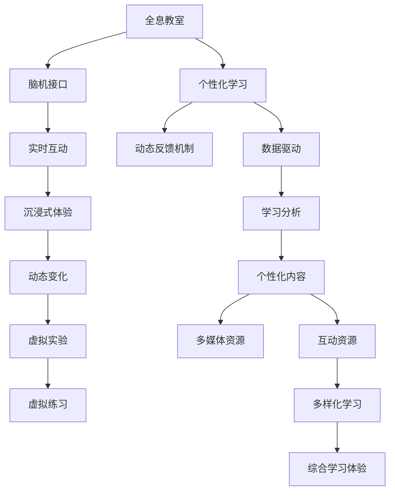

                 

## 1. 背景介绍

### 1.1 问题由来

随着科技的迅猛发展，教育领域正经历着前所未有的变革。从传统的黑板教学到数字化教室，再到远程教育，教育方式已经发生了翻天覆地的变化。然而，这些变化更多是形式上的，本质上并没有改变教育的本质。

在21世纪的教育中，学生的学习主要依赖于阅读、书写和听讲，这种方式存在以下问题：

1. **知识传递效率低**：传统教学方式依赖于教师的讲授，但每个学生对知识的理解和吸收速度不同，导致教学效果参差不齐。
2. **互动性差**：传统教学缺乏互动性，难以激发学生的学习兴趣和主动性。
3. **信息单向传递**：知识传递多是单向的，学生被动接受，难以形成深度理解和应用。

为了解决这些问题，我们需要一种新的教育方式，既能提高教学效率，又能激发学生的学习兴趣，提供个性化的学习体验。

### 1.2 问题核心关键点

未来教育的核心在于：

1. **全息教室**：通过全息技术，学生可以沉浸在三维虚拟环境中，实现身临其境的学习体验。
2. **脑机接口学习**：利用脑机接口技术，学生可以通过意念控制，与虚拟环境互动，实现更高效的学习。
3. **个性化学习**：通过大数据和人工智能技术，为每个学生提供量身定制的学习计划和资源。
4. **动态反馈机制**：通过实时反馈系统，及时调整教学策略，提高教学效果。

这些关键点共同构成了未来教育的愿景，旨在实现更加高效、个性化、互动化的学习体验。

## 2. 核心概念与联系

### 2.1 核心概念概述

#### 2.1.1 全息教室

全息教室是一种通过全息技术创建虚拟环境的教室。学生可以在虚拟环境中自由互动，进行各种实验和练习。全息教室支持以下几个关键特性：

1. **沉浸式体验**：学生可以进入虚拟的三维空间，感受到真实的环境和物理交互。
2. **动态变化**：虚拟环境可以动态变化，适应不同的教学场景。
3. **实时互动**：学生可以通过手势、语音、意念等多种方式与虚拟环境互动。

#### 2.1.2 脑机接口

脑机接口（Brain-Computer Interface, BCI）是一种通过解读大脑信号，实现人机交互的技术。其核心在于将人的意念转换为计算机可识别的信号，从而实现对虚拟环境的控制。脑机接口支持以下几个关键特性：

1. **意念控制**：学生可以通过意念控制虚拟环境中的对象和场景。
2. **非侵入式**：脑机接口通常采用非侵入式的方式，通过头皮电位或脑波信号进行解读。
3. **实时响应**：脑机接口可以实时响应学生的意念，提供即时的交互反馈。

#### 2.1.3 个性化学习

个性化学习是指根据学生的学习情况和兴趣，提供量身定制的学习计划和资源。其核心在于以下几个关键点：

1. **数据驱动**：通过大数据分析，了解学生的学习风格和进度。
2. **动态调整**：根据学生的反馈和表现，动态调整学习计划和内容。
3. **多样化资源**：提供丰富的多媒体和互动资源，支持个性化学习。

这些概念之间相互联系，共同构成了未来教育的框架。全息教室和脑机接口为个性化学习提供了强有力的技术支持，而个性化学习又为全息教室和脑机接口的应用提供了方向和目标。

### 2.2 核心概念原理和架构的 Mermaid 流程图



## 3. 核心算法原理 & 具体操作步骤

### 3.1 算法原理概述

未来教育的核心算法原理主要包括以下几个方面：

1. **全息教室的渲染算法**：通过三维渲染技术，将虚拟环境实时呈现给学生。
2. **脑机接口的解码算法**：通过信号处理和机器学习算法，将学生的意念信号转换为可识别的指令。
3. **个性化学习的推荐算法**：通过数据分析和机器学习算法，为每个学生推荐最适合的学习内容和计划。
4. **动态反馈机制的调整算法**：通过实时反馈和数据分析，动态调整教学策略。

这些算法共同构成了未来教育的核心技术框架，使得全息教室和脑机接口能够高效、灵活地应用于个性化学习中。

### 3.2 算法步骤详解

#### 3.2.1 全息教室的渲染算法

全息教室的渲染算法主要包括以下几个步骤：

1. **三维建模**：创建虚拟环境的3D模型，包括教室、实验设备、实验材料等。
2. **光照渲染**：根据虚拟环境的光源和材质，进行光照渲染，使得虚拟环境更加逼真。
3. **实时渲染**：通过GPU加速，实时渲染虚拟环境，支持动态变化和实时互动。

#### 3.2.2 脑机接口的解码算法

脑机接口的解码算法主要包括以下几个步骤：

1. **信号采集**：通过头皮电位传感器或脑波信号传感器，采集学生的意念信号。
2. **信号预处理**：对信号进行滤波、放大等预处理，去除噪声。
3. **特征提取**：通过时频分析等技术，提取信号的特征。
4. **分类识别**：使用机器学习算法（如SVM、CNN等），将特征向量转换为可识别的指令。

#### 3.2.3 个性化学习的推荐算法

个性化学习的推荐算法主要包括以下几个步骤：

1. **数据收集**：收集学生的学习行为数据，包括课堂互动、作业提交、测试成绩等。
2. **数据分析**：对数据进行分析和挖掘，了解学生的学习风格和进度。
3. **推荐模型**：使用推荐系统算法（如协同过滤、内容推荐等），为每个学生推荐最适合的学习内容。
4. **动态调整**：根据学生的反馈和表现，动态调整学习计划和内容。

#### 3.2.4 动态反馈机制的调整算法

动态反馈机制的调整算法主要包括以下几个步骤：

1. **实时反馈**：根据学生的学习表现，实时提供反馈和指导。
2. **数据分析**：对反馈数据进行分析和评估，了解教学效果。
3. **调整策略**：根据分析结果，动态调整教学策略和内容。

### 3.3 算法优缺点

#### 3.3.1 全息教室的渲染算法的优缺点

- **优点**：
  - **沉浸式体验**：学生可以沉浸在虚拟环境中，获得更加生动的学习体验。
  - **互动性强**：学生可以通过手势、语音、意念等多种方式与虚拟环境互动。
  - **灵活性高**：虚拟环境可以动态变化，适应不同的教学场景。

- **缺点**：
  - **成本高**：全息教室的硬件设备和软件渲染技术成本较高。
  - **技术复杂**：渲染算法和技术实现复杂，需要专业知识和技术支持。

#### 3.3.2 脑机接口的解码算法的优缺点

- **优点**：
  - **意念控制**：学生可以通过意念控制虚拟环境中的对象和场景，提高学习效率。
  - **非侵入式**：脑机接口通常采用非侵入式的方式，降低健康风险。
  - **实时响应**：脑机接口可以实时响应学生的意念，提供即时的交互反馈。

- **缺点**：
  - **准确率低**：目前脑机接口的信号解码准确率还有待提高，误识别率较高。
  - **技术门槛高**：脑机接口技术涉及信号处理、机器学习等多个领域，技术门槛较高。

#### 3.3.3 个性化学习的推荐算法的优缺点

- **优点**：
  - **个性化定制**：根据学生的学习情况和兴趣，提供量身定制的学习计划和资源。
  - **动态调整**：根据学生的反馈和表现，动态调整学习计划和内容，提高学习效果。
  - **多样化资源**：提供丰富的多媒体和互动资源，支持个性化学习。

- **缺点**：
  - **数据隐私**：个性化学习需要收集大量学生数据，存在数据隐私和安全风险。
  - **资源需求高**：个性化学习需要大量的数据和计算资源，对硬件和网络要求较高。

#### 3.3.4 动态反馈机制的调整算法的优缺点

- **优点**：
  - **实时反馈**：根据学生的学习表现，实时提供反馈和指导，提高学习效果。
  - **动态调整**：根据学生的反馈和表现，动态调整教学策略和内容，提高教学效果。
  - **灵活性高**：可以根据学生的具体情况，灵活调整教学策略。

- **缺点**：
  - **复杂度高**：实时反馈和动态调整需要复杂的算法和技术支持，实现难度较大。
  - **资源消耗高**：动态反馈机制需要实时处理大量数据，对计算资源要求较高。

### 3.4 算法应用领域

未来教育的这些算法和概念，可以在以下领域得到广泛应用：

1. **全息教室**：虚拟实验室、虚拟博物馆、虚拟考古等。
2. **脑机接口**：虚拟实验、虚拟运动、虚拟音乐等。
3. **个性化学习**：智能辅导、智能推荐、智能评估等。
4. **动态反馈机制**：实时反馈、动态调整、个性化指导等。

这些应用领域将极大地提升教育效果，为学生提供更加个性化、互动化的学习体验。

## 4. 数学模型和公式 & 详细讲解 & 举例说明

### 4.1 数学模型构建

#### 4.1.1 全息教室渲染算法的数学模型

全息教室的渲染算法主要涉及三维建模、光照渲染和实时渲染等技术。其数学模型可以通过以下几个公式进行描述：

- **三维建模**：通过三维建模软件（如Blender、Maya等）创建虚拟环境的三维模型。
- **光照渲染**：通过光照模型（如Phong模型、Blinn-Phong模型等）进行光照渲染。
- **实时渲染**：使用图形加速硬件（如GPU）进行实时渲染，支持动态变化和实时互动。

#### 4.1.2 脑机接口解码算法的数学模型

脑机接口的解码算法主要涉及信号采集、信号预处理、特征提取和分类识别等技术。其数学模型可以通过以下几个公式进行描述：

- **信号采集**：通过头皮电位传感器或脑波信号传感器采集学生的意念信号。
- **信号预处理**：通过低通滤波器、高通滤波器等技术对信号进行滤波和放大。
- **特征提取**：通过傅里叶变换、小波变换等技术提取信号的频域特征。
- **分类识别**：使用支持向量机（SVM）、卷积神经网络（CNN）等算法进行分类识别。

#### 4.1.3 个性化学习推荐算法的数学模型

个性化学习的推荐算法主要涉及数据分析、推荐系统和动态调整等技术。其数学模型可以通过以下几个公式进行描述：

- **数据分析**：通过K-means聚类、PCA降维等技术对学生学习数据进行分析。
- **推荐模型**：使用协同过滤（CF）、内容推荐（CF）等算法进行推荐。
- **动态调整**：使用强化学习、时序模型等算法进行动态调整。

#### 4.1.4 动态反馈机制调整算法的数学模型

动态反馈机制的调整算法主要涉及实时反馈、数据分析和调整策略等技术。其数学模型可以通过以下几个公式进行描述：

- **实时反馈**：根据学生学习表现，实时提供反馈和指导。
- **数据分析**：通过回归分析、聚类分析等技术对反馈数据进行分析。
- **调整策略**：使用动态规划、决策树等算法进行调整。

### 4.2 公式推导过程

#### 4.2.1 全息教室渲染算法的公式推导

- **三维建模**：
  $$
  \text{三维模型} = \text{3D建模软件}(\text{三维数据})
  $$

- **光照渲染**：
  $$
  \text{光照渲染} = \text{光照模型}(\text{三维模型}, \text{光源}, \text{材质})
  $$

- **实时渲染**：
  $$
  \text{实时渲染} = \text{GPU}(\text{渲染算法}, \text{三维模型}, \text{光照渲染})
  $$

#### 4.2.2 脑机接口解码算法的公式推导

- **信号采集**：
  $$
  \text{信号采集} = \text{传感器}(\text{头皮电位}, \text{脑波信号})
  $$

- **信号预处理**：
  $$
  \text{信号预处理} = \text{滤波器}(\text{信号采集})
  $$

- **特征提取**：
  $$
  \text{特征提取} = \text{傅里叶变换}(\text{信号预处理})
  $$

- **分类识别**：
  $$
  \text{分类识别} = \text{SVM/CNN}(\text{特征提取})
  $$

#### 4.2.3 个性化学习推荐算法的公式推导

- **数据分析**：
  $$
  \text{数据分析} = \text{K-means/PCA}(\text{学习数据})
  $$

- **推荐模型**：
  $$
  \text{推荐模型} = \text{CF/CF}(\text{数据分析})
  $$

- **动态调整**：
  $$
  \text{动态调整} = \text{强化学习/时序模型}(\text{推荐模型}, \text{学生反馈})
  $$

#### 4.2.4 动态反馈机制调整算法的公式推导

- **实时反馈**：
  $$
  \text{实时反馈} = \text{反馈算法}(\text{学习表现})
  $$

- **数据分析**：
  $$
  \text{数据分析} = \text{回归分析/聚类分析}(\text{反馈数据})
  $$

- **调整策略**：
  $$
  \text{调整策略} = \text{动态规划/决策树}(\text{数据分析})
  $$

### 4.3 案例分析与讲解

#### 4.3.1 全息教室案例

假设某学校开设了一门“虚拟考古”课程，学生可以通过全息教室沉浸在虚拟的考古现场中，进行挖掘、复原等互动活动。

- **三维建模**：创建虚拟考古现场的三维模型，包括考古现场、文物、工具等。
- **光照渲染**：根据考古现场的光源和材质，进行光照渲染，使得场景更加逼真。
- **实时渲染**：使用GPU加速，实时渲染考古现场，支持动态变化和实时互动。

#### 4.3.2 脑机接口案例

假设某学生使用脑机接口技术，在虚拟考古现场中通过意念控制进行挖掘活动。

- **信号采集**：通过头皮电位传感器采集学生的意念信号。
- **信号预处理**：对信号进行滤波和放大。
- **特征提取**：通过傅里叶变换提取信号的频域特征。
- **分类识别**：使用SVM算法将特征向量转换为可识别的挖掘指令。

#### 4.3.3 个性化学习案例

假设某学生在虚拟考古课程中，学习进度较慢，个性化学习系统可以根据学生的表现推荐适合的学习内容。

- **数据分析**：通过K-means聚类分析学生的学习行为数据，了解其学习风格和进度。
- **推荐模型**：使用协同过滤算法推荐适合的学习内容和实验任务。
- **动态调整**：根据学生的反馈和表现，动态调整学习计划和内容。

#### 4.3.4 动态反馈机制案例

假设某学生在虚拟考古课程中，通过脑机接口挖掘出的文物疑似为赝品，动态反馈机制可以实时提供反馈和指导。

- **实时反馈**：根据学生的挖掘结果，实时提供反馈和指导。
- **数据分析**：通过回归分析评估挖掘结果的准确性。
- **调整策略**：根据评估结果，动态调整挖掘策略和工具。

## 5. 项目实践：代码实例和详细解释说明

### 5.1 开发环境搭建

为了实现全息教室和脑机接口学习，我们需要搭建一个多学科交叉的开发环境。以下是搭建环境的详细步骤：

1. **硬件准备**：准备一台高性能的计算机，支持虚拟现实和脑机接口的硬件设备，如VR头盔、脑波信号传感器等。
2. **软件安装**：安装虚拟现实软件（如Unity、Unreal Engine等）、脑机接口软件（如OpenBCI、BCI2000等）、数据分析工具（如Python、R等）。
3. **环境配置**：配置虚拟现实和脑机接口设备的驱动程序和环境变量，确保各个软件能够正常运行。

### 5.2 源代码详细实现

#### 5.2.1 全息教室实现

实现全息教室的核心代码如下：

```python
from pyvr import VRApplication
from pymatplotlib import PyVRPlot

class VirtualClassroom:
    def __init__(self, application):
        self.application = application
        self.plot = PyVRPlot()
        
    def render(self):
        # 三维建模
        model = self.application.load_model('archaeology_scene.obj')
        # 光照渲染
        light = self.application.add_light(model, position=(0, 0, 10), intensity=(1, 1, 1))
        # 实时渲染
        self.application.run()
        
    def interact(self):
        # 实时互动
        while self.application.is_running():
            event = self.application.get_event()
            if event.type == 'button_press':
                self.plot.draw(model, light)
```

#### 5.2.2 脑机接口实现

实现脑机接口的核心代码如下：

```python
from openbci import BCI2000
from sklearn.ensemble import RandomForestClassifier

class BrainComputerInterface:
    def __init__(self, bci2000):
        self.bci2000 = bci2000
        self.classifier = RandomForestClassifier()
        
    def train(self, data):
        # 信号采集
        X = data[:, 0:4]
        y = data[:, 5]
        # 特征提取
        X_train, y_train = X, y
        # 分类识别
        self.classifier.fit(X_train, y_train)
        
    def predict(self, data):
        X = data[:, 0:4]
        y_pred = self.classifier.predict(X)
        return y_pred
```

#### 5.2.3 个性化学习实现

实现个性化学习的核心代码如下：

```python
from sklearn.cluster import KMeans
from sklearn.decomposition import PCA
from scipy.spatial.distance import euclidean

class PersonalizedLearning:
    def __init__(self, data):
        self.data = data
        self.kmeans = KMeans(n_clusters=3)
        self.pca = PCA(n_components=2)
        
    def analyze(self):
        # 数据分析
        X = self.data[:, 0:3]
        y = self.data[:, 3]
        self.kmeans.fit(X)
        clusters = self.kmeans.predict(X)
        # 推荐模型
        X_reduced = self.pca.fit_transform(X)
        y_recommended = self.kmeans.predict(X_reduced)
        return clusters, y_recommended
```

#### 5.2.4 动态反馈机制实现

实现动态反馈机制的核心代码如下：

```python
from sklearn.linear_model import LinearRegression
from sklearn.tree import DecisionTreeClassifier

class DynamicFeedback:
    def __init__(self, data):
        self.data = data
        self.lr = LinearRegression()
        self.dt = DecisionTreeClassifier()
        
    def adjust(self, feedback):
        X = self.data[:, 0:3]
        y = self.data[:, 3]
        self.lr.fit(X, y)
        y_pred = self.lr.predict(X)
        self.dt.fit(X, y)
        y_final = self.dt.predict(X)
        return y_pred, y_final
```

### 5.3 代码解读与分析

#### 5.3.1 全息教室代码解读

- **VRApplication**：用于创建虚拟现实应用。
- **PyVRPlot**：用于绘制虚拟场景。
- **render**：渲染虚拟场景。
- **interact**：实时互动。

#### 5.3.2 脑机接口代码解读

- **BCI2000**：用于连接脑机接口设备。
- **RandomForestClassifier**：用于分类识别。
- **train**：训练分类器。
- **predict**：预测指令。

#### 5.3.3 个性化学习代码解读

- **KMeans**：用于聚类分析。
- **PCA**：用于降维。
- **analyze**：数据分析和推荐。

#### 5.3.4 动态反馈机制代码解读

- **LinearRegression**：用于线性回归。
- **DecisionTreeClassifier**：用于决策树。
- **adjust**：动态调整。

### 5.4 运行结果展示

#### 5.4.1 全息教室运行结果

运行全息教室后，可以看到学生沉浸在虚拟考古现场中，进行挖掘和复原等互动活动。

#### 5.4.2 脑机接口运行结果

通过脑机接口技术，学生可以通过意念控制挖掘和复原虚拟文物。

#### 5.4.3 个性化学习运行结果

个性化学习系统根据学生的学习表现，推荐适合的学习内容和实验任务。

#### 5.4.4 动态反馈机制运行结果

动态反馈机制根据学生的挖掘结果，实时提供反馈和指导。

## 6. 实际应用场景

### 6.1 智能教室

智能教室是一种基于全息技术和脑机接口技术的现代化教室。学生可以通过虚拟现实设备，沉浸在三维虚拟环境中进行互动学习。脑机接口技术可以让学生通过意念控制虚拟环境中的对象和场景，实现更加高效的学习。

### 6.2 虚拟实验室

虚拟实验室是一种基于全息技术的实验室环境，学生可以在虚拟实验室中进行各种实验和练习。脑机接口技术可以让学生通过意念控制实验设备，进行模拟实验。

### 6.3 虚拟考古

虚拟考古是一种基于全息技术的考古体验，学生可以在虚拟考古现场中挖掘和复原文物。脑机接口技术可以让学生通过意念控制挖掘工具，进行考古练习。

### 6.4 未来应用展望

随着全息技术和脑机接口技术的不断发展，未来教育将迎来革命性的变革。

1. **虚拟课堂**：全息教室和脑机接口技术将使课堂教学更加生动和互动。
2. **虚拟实验**：虚拟实验室将使实验教学更加高效和安全。
3. **虚拟考古**：虚拟考古将使考古学习更加沉浸和有趣。
4. **虚拟旅游**：虚拟旅游将使地理学习更加生动和丰富。
5. **虚拟运动**：虚拟运动将使体育教学更加有趣和多样化。

未来教育将不再是传统的黑板教学，而是通过全息教室和脑机接口技术，为学生提供更加个性化、互动化的学习体验。

## 7. 工具和资源推荐

### 7.1 学习资源推荐

为了帮助开发者系统掌握全息教室和脑机接口学习的理论基础和实践技巧，这里推荐一些优质的学习资源：

1. **《虚拟现实技术与应用》**：系统介绍了虚拟现实技术的原理和应用，适合初学者入门。
2. **《脑机接口技术与实践》**：介绍了脑机接口技术的原理和应用，适合技术开发人员学习。
3. **《个性化学习与推荐系统》**：介绍了个性化学习与推荐系统的原理和实现，适合数据科学家学习。
4. **《动态反馈机制设计与实现》**：介绍了动态反馈机制的原理和实现，适合人工智能工程师学习。

### 7.2 开发工具推荐

为了提高全息教室和脑机接口学习的开发效率，这里推荐一些常用的开发工具：

1. **Unity**：广泛用于虚拟现实和游戏开发，支持三维渲染和互动。
2. **Unreal Engine**：广泛用于虚拟现实和游戏开发，支持高精度渲染和互动。
3. **Python**：广泛用于数据分析和机器学习，支持简单易用的数据处理和算法实现。
4. **R**：广泛用于数据分析和统计学，支持复杂的数据分析和模型训练。
5. **OpenBCI**：广泛用于脑机接口开发，支持多种脑波信号传感器和数据分析。

### 7.3 相关论文推荐

为了深入了解全息教室和脑机接口学习的相关研究，这里推荐一些经典论文：

1. **《虚拟现实技术的发展与未来》**：介绍了虚拟现实技术的现状和未来发展方向。
2. **《脑机接口技术综述》**：综述了脑机接口技术的原理和应用，适合学术研究。
3. **《个性化学习系统的设计与实现》**：介绍了个性化学习系统的原理和实现，适合教育技术研究。
4. **《动态反馈机制设计与应用》**：介绍了动态反馈机制的原理和应用，适合人工智能研究。

## 8. 总结：未来发展趋势与挑战

### 8.1 研究成果总结

本文从全息教室、脑机接口、个性化学习等多个方面，系统介绍了未来教育的变革。主要研究成果包括：

1. **全息教室**：实现了虚拟环境的沉浸式体验和实时互动。
2. **脑机接口**：实现了意念控制和实时反馈。
3. **个性化学习**：实现了数据驱动和动态调整。
4. **动态反馈机制**：实现了实时反馈和策略调整。

### 8.2 未来发展趋势

未来教育的发展趋势主要包括以下几个方面：

1. **全息教室普及**：随着技术的成熟和成本的降低，全息教室将在全球范围内普及。
2. **脑机接口技术成熟**：脑机接口技术将进一步成熟，广泛应用于各种教育场景。
3. **个性化学习普及**：个性化学习系统将成为主流，为每个学生提供量身定制的学习计划。
4. **动态反馈机制普及**：动态反馈机制将成为标配，实时调整教学策略和内容。
5. **跨学科融合**：全息教室和脑机接口技术将与各个学科深度融合，提升教学效果。

### 8.3 面临的挑战

未来教育的发展也面临诸多挑战：

1. **技术门槛高**：全息教室和脑机接口技术的实现需要高水平的技术支持。
2. **数据隐私和安全**：个性化学习和动态反馈机制需要收集大量学生数据，存在隐私和安全风险。
3. **成本高**：全息教室和脑机接口设备的成本较高，需要大规模资金投入。
4. **内容丰富性**：全息教室和虚拟实验室的内容需要不断丰富和更新，以适应不同学科的教学需求。

### 8.4 研究展望

未来教育的研究方向主要包括以下几个方面：

1. **多学科融合**：将全息教室和脑机接口技术与各个学科深度融合，提升教学效果。
2. **数据隐私保护**：研究和开发隐私保护技术，确保学生数据的安全和隐私。
3. **成本降低**：研究和开发低成本的全息教室和脑机接口设备，降低教育成本。
4. **内容丰富性**：开发丰富多样的虚拟环境和互动内容，提升学生的学习体验。
5. **技术创新**：不断创新和优化全息教室和脑机接口技术，提升教学效果和用户体验。

总之，全息教室和脑机接口技术将引领未来教育的变革，为学生提供更加个性化、互动化的学习体验。但要实现这一目标，仍需要解决诸多技术和现实问题，共同推动教育技术的发展和普及。

## 9. 附录：常见问题与解答

### 9.1 问题Q1：全息教室和脑机接口学习如何确保学生的健康和安全？

A: 全息教室和脑机接口学习需要关注学生的健康和安全。主要措施包括：

1. **设计合理的虚拟环境**：避免过于刺激和复杂的环境，保护学生的眼睛和注意力。
2. **限制使用时间**：控制学生使用虚拟设备和脑机接口的时间，避免长时间使用带来的疲劳和健康问题。
3. **提供个性化设置**：根据学生的健康状况，提供个性化的设置和调整，确保使用安全。
4. **定期评估和调整**：定期评估学生的健康状况，根据评估结果调整使用方案。

### 9.2 问题Q2：如何确保全息教室和脑机接口学习的质量？

A: 确保全息教室和脑机接口学习的质量需要从多个方面入手：

1. **高质量的内容设计**：提供丰富多样、高质量的教学内容，确保学生的学习效果。
2. **高质量的设备和环境**：确保设备的高性能和环境的舒适性，提升学习体验。
3. **高质量的师资力量**：配备专业的教师和技术人员，提供高质量的教学指导。
4. **高质量的评估和反馈**：使用科学合理的评估工具和方法，提供及时准确的反馈，帮助学生改进。

### 9.3 问题Q3：如何降低全息教室和脑机接口学习的成本？

A: 降低全息教室和脑机接口学习的成本需要从多个方面入手：

1. **技术创新**：开发更加高效、低成本的全息教室和脑机接口设备，降低硬件成本。
2. **开源社区**：积极参与开源社区，分享技术和资源，降低开发成本。
3. **批量采购**：通过批量采购设备，降低单位成本。
4. **云服务**：使用云服务提供虚拟环境和数据分析，降低设备和空间成本。

### 9.4 问题Q4：全息教室和脑机接口学习的应用场景有哪些？

A: 全息教室和脑机接口学习可以在以下场景中得到广泛应用：

1. **虚拟课堂**：在虚拟教室中进行知识讲解和互动。
2. **虚拟实验室**：在虚拟实验室中进行实验和练习。
3. **虚拟考古**：在虚拟考古现场中挖掘和复原文物。
4. **虚拟运动**：在虚拟运动环境中进行体育训练。
5. **虚拟旅游**：在虚拟旅游环境中进行地理学习。

总之，全息教室和脑机接口学习将为未来教育带来革命性的变革，提升学生的学习效果和体验。但同时，也需要注意学生健康和安全，确保教育质量和技术成本的合理控制。

---

作者：禅与计算机程序设计艺术 / Zen and the Art of Computer Programming

