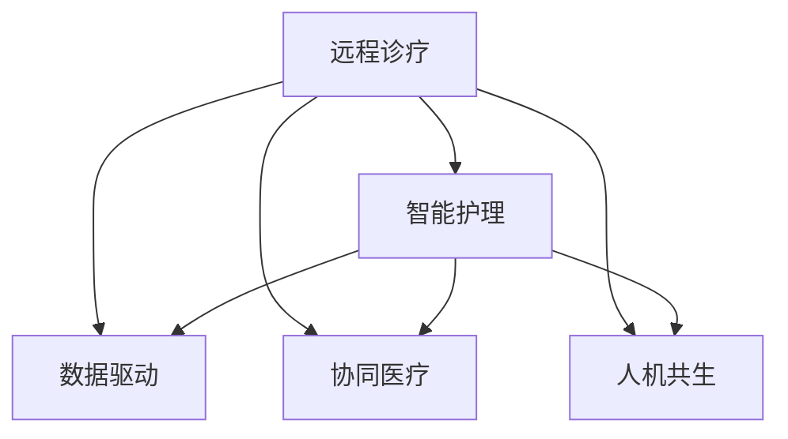

                 

# 未来的智慧医疗：2050年的远程诊疗与智能护理

## 1. 背景介绍

### 1.1 问题由来
近年来，全球范围内医疗资源分布不均、医疗费用高涨、患者需求日益复杂化等问题愈发凸显。在应对这些挑战的同时，新冠疫情的肆虐使得远程诊疗和智能护理成为新的焦点。以人工智能(AI)和大数据为基础的智慧医疗系统，通过优化医疗流程、提升诊疗质量、减少医患交互成本等方式，正在成为医疗行业的新常态。展望未来，智慧医疗将成为推动医疗健康领域数字化转型的关键力量。

### 1.2 问题核心关键点
未来智慧医疗的核心在于以下几个关键点：
- 远程诊疗：通过网络技术实现远程会诊、在线问诊、远程手术等，打破地域限制，让优质医疗资源流动。
- 智能护理：借助智能设备和算法，实现对患者的精准监测、个性化护理和预判风险。
- 数据驱动：利用大数据分析，挖掘疾病模式，优化医疗决策，提升医疗效率和效果。
- 协同医疗：搭建多方协作平台，促进医疗机构、科研机构、患者等多方协同合作。
- 人机共生：探索人机共生的新模式，提升患者体验，拓展医疗服务的边界。

### 1.3 问题研究意义
研究智慧医疗的未来发展趋势，对于推动医疗健康领域的数字化转型，改善公共健康水平，具有重要的理论和实践意义：

1. 提升医疗服务质量：通过远程诊疗和智能护理，实现高效、精确的诊断和治疗。
2. 降低医疗成本：智能设备和算法优化资源配置，减少资源浪费，降低医疗费用。
3. 扩大医疗服务覆盖面：打破地域限制，让更多人享受到优质医疗资源。
4. 提升医疗效率：大数据分析优化诊疗流程，提高诊疗速度和准确性。
5. 实现个性化医疗：基于患者个体特征，提供精准的医疗建议和治疗方案。

## 2. 核心概念与联系

### 2.1 核心概念概述

为更好地理解智慧医疗的未来发展，本节将介绍几个密切相关的核心概念：

- **远程诊疗**：通过互联网技术实现医生和患者之间的远程交流和诊疗服务，减少患者就医时间和费用，提高医疗服务的可及性。
- **智能护理**：使用智能设备和算法，实时监测患者健康状况，提供个性化的护理建议和风险预警。
- **数据驱动**：利用大数据和机器学习技术，分析病患数据，辅助医生诊断，优化诊疗方案。
- **协同医疗**：建立多机构合作平台，实现医疗数据共享和协同工作，提高医疗服务效率。
- **人机共生**：构建人机协同的智慧医疗系统，提升医疗服务质量和患者体验。

这些核心概念之间的逻辑关系可以通过以下Mermaid流程图来展示：



这个流程图展示了几大核心概念及其之间的关系：

1. 远程诊疗是智慧医疗的基础，通过网络技术实现跨地域医疗服务。
2. 智能护理依托于远程诊疗，实时监测和个性化护理相结合。
3. 数据驱动为远程诊疗和智能护理提供支撑，通过大数据分析优化诊疗过程。
4. 协同医疗打破了医疗机构的孤岛效应，实现多机构协作。
5. 人机共生是将智慧医疗引入更高层次的应用，实现更智能、高效的医疗服务。

## 3. 核心算法原理 & 具体操作步骤
### 3.1 算法原理概述

智慧医疗的核心在于通过AI和大数据技术，提升医疗服务的质量和效率。其核心算法原理可以概括为以下几个方面：

- **远程诊疗算法**：包括视频会议、语音识别、自然语言处理等技术，通过网络实现医生与患者的实时交流。
- **智能护理算法**：涉及传感器数据处理、信号检测、异常预警等技术，实现对患者的精准监测和护理。
- **数据驱动算法**：利用机器学习、深度学习等技术，从大量病患数据中挖掘出疾病模式，辅助医生诊断和治疗。
- **协同医疗算法**：包括数据共享、协同计算、协同推理等技术，促进医疗机构之间的信息交流和协作。
- **人机共生算法**：通过人机交互界面设计，提升患者与系统的互动体验，实现智慧医疗的智能化和人性化。

### 3.2 算法步骤详解

智慧医疗的核心算法步骤可以概括为以下几个关键步骤：

1. **数据收集与处理**：收集来自各医疗机构和患者的健康数据，包括电子病历、生命体征、基因信息等，进行数据清洗和预处理。
2. **模型训练与优化**：利用机器学习和深度学习技术，训练智慧医疗模型，优化算法性能。
3. **系统集成与部署**：将训练好的模型集成到智慧医疗平台中，并进行测试和优化，确保系统稳定性和鲁棒性。
4. **实时监测与反馈**：通过传感器和算法，实时监测患者健康状态，提供个性化护理建议，并进行风险预警。
5. **协同工作与共享**：实现医疗机构、科研机构之间的数据共享和协同工作，提高医疗服务效率。
6. **用户体验优化**：通过人机交互界面设计，提升患者与系统的互动体验，实现智慧医疗的智能化和人性化。

### 3.3 算法优缺点

智慧医疗的核心算法具有以下优点：
1. 提升医疗服务效率：利用AI和大数据技术，优化诊疗流程，减少医疗费用，提高服务效率。
2. 提升诊疗质量：通过大数据分析，挖掘疾病模式，辅助医生诊断和治疗，提高诊疗准确性。
3. 提升患者体验：通过人机共生设计，提升患者与系统的互动体验，实现更加智能、人性化的医疗服务。
4. 扩大医疗服务覆盖面：通过远程诊疗和智能护理，打破地域限制，让更多人享受到优质医疗资源。

同时，该算法也存在一定的局限性：
1. 数据隐私和安全问题：医疗数据涉及患者隐私，数据收集和存储过程中需要严格保护，防止数据泄露。
2. 模型泛化能力有限：智慧医疗模型往往基于特定医院或特定病种的数据训练，泛化能力有限。
3. 算法复杂度高：智慧医疗涉及大量数据和复杂算法，需要较强的计算资源支持。
4. 需要高水平的专业人员：智慧医疗系统的开发和维护需要高水平的专业人员，存在人才短缺问题。
5. 伦理和法律问题：智慧医疗涉及诸多伦理和法律问题，如知情同意、数据共享等，需要制定相应的法律法规。

尽管存在这些局限性，但智慧医疗的核心算法仍然是大数据和AI技术的重要应用范式，有望在未来医疗领域发挥更大的作用。

### 3.4 算法应用领域

智慧医疗的核心算法在以下领域中得到了广泛的应用：

- **远程诊疗**：包括远程会诊、在线问诊、远程手术等，通过网络技术实现跨地域医疗服务。
- **智能护理**：涉及智能设备和算法，实现对患者的精准监测、个性化护理和预判风险。
- **数据驱动**：利用大数据和机器学习技术，从大量病患数据中挖掘出疾病模式，辅助医生诊断和治疗。
- **协同医疗**：包括数据共享、协同计算、协同推理等技术，促进医疗机构之间的信息交流和协作。
- **人机共生**：通过人机交互界面设计，提升患者与系统的互动体验，实现智慧医疗的智能化和人性化。

## 4. 数学模型和公式 & 详细讲解 & 举例说明
### 4.1 数学模型构建

本节将使用数学语言对智慧医疗的核心算法进行更加严格的刻画。

假设远程诊疗系统中有 $N$ 个患者，每个患者的健康数据为 $\mathbf{x}_i$，其中 $i \in \{1, ..., N\}$。系统通过训练好的模型对每个患者进行诊断，输出结果为 $\mathbf{y}_i = f(\mathbf{x}_i)$，其中 $f$ 为远程诊疗模型。

对于智能护理算法，假设传感器采集到患者 $i$ 的实时生理参数为 $\mathbf{z}_i$，通过训练好的模型对每个患者的生理参数进行异常检测和预警，输出结果为 $\mathbf{w}_i = g(\mathbf{z}_i)$，其中 $g$ 为智能护理模型。

对于数据驱动算法，假设从医院数据库中收集到 $M$ 个病患的电子病历数据 $\mathbf{X}$ 和 $M$ 个医生的诊断结果 $\mathbf{Y}$，通过机器学习模型训练，可以得到预测模型 $h$，使得 $h(\mathbf{X}) \approx \mathbf{Y}$。

对于协同医疗算法，假设 $K$ 个医疗机构共享的数据集为 $\{\mathbf{X}_k\}_{k=1}^K$，通过协同计算模型训练，可以得到协同诊断模型 $j$，使得 $j(\mathbf{X}_k) \approx \mathbf{Y}_k$。

对于人机共生算法，假设用户与系统的交互界面为 $\mathbf{U}$，通过交互设计模型训练，可以得到人机共生模型 $k$，使得 $k(\mathbf{U}) \approx \mathbf{V}$，其中 $\mathbf{V}$ 为用户与系统的互动结果。

### 4.2 公式推导过程

以下我们以智能护理算法为例，推导异常检测和预警的数学模型。

假设智能护理系统通过传感器收集到患者 $i$ 的实时生理参数 $\mathbf{z}_i \in \mathbb{R}^n$，包括心率、血压、血糖等。系统利用训练好的模型 $g$ 对每个生理参数进行异常检测，输出结果为 $\mathbf{w}_i \in \{0, 1\}^n$，表示每个生理参数是否处于正常范围。

系统定义异常阈值为 $\mathbf{t} \in \mathbb{R}^n$，当某个生理参数的检测结果 $\mathbf{z}_{i,j}$ 大于阈值 $\mathbf{t}_j$ 时，认为该生理参数异常，输出为 $1$，否则输出为 $0$。

将上述过程形式化表示为：

$$
w_{i,j} = \begin{cases}
1 & \text{if } z_{i,j} > t_j \\
0 & \text{otherwise}
\end{cases}
$$

当检测到 $k$ 个生理参数异常时，系统发出预警信号。预警信号为 $1$ 表示异常，$0$ 表示正常。

定义预警信号为 $\mathbf{v}_i = [v_{i,1}, ..., v_{i,n}]$，其中 $v_{i,j} \in \{0, 1\}$，表示第 $j$ 个生理参数是否异常。

将上述过程形式化表示为：

$$
v_{i,j} = \bigoplus_{k=1}^n w_{i,j}
$$

其中 $\bigoplus$ 表示逻辑或运算，$w_{i,j}$ 表示第 $j$ 个生理参数的异常检测结果。

通过上述模型，系统可以对每个患者的生理参数进行实时监测，及时发现异常并发出预警，从而提升智能护理的效果。

### 4.3 案例分析与讲解

下面以远程诊疗算法为例，具体讲解其实现原理和应用场景。

假设某医院通过远程诊疗系统对一位患者的病情进行诊断，系统收集到该患者的电子病历数据 $\mathbf{x}_i$，包括病史、影像学检查、化验结果等。通过训练好的模型 $f$ 对每个电子病历数据进行处理，输出诊断结果 $\mathbf{y}_i = [y_{i,1}, ..., y_{i,k}]$，其中 $k$ 为诊断结果的种类数。

假设 $y_{i,j} \in \{0, 1\}$，表示第 $j$ 个诊断结果是否存在，$1$ 表示存在，$0$ 表示不存在。

系统根据医生设定的权重 $\mathbf{\alpha} = [\alpha_1, ..., \alpha_k]$，对每个诊断结果的重要性进行加权计算，得到综合诊断结果 $y_i = \sum_{j=1}^k \alpha_j y_{i,j}$。

通过上述模型，系统可以对患者的病情进行综合诊断，提供更加准确和个性化的治疗建议。

## 5. 项目实践：代码实例和详细解释说明
### 5.1 开发环境搭建

在进行智慧医疗系统开发前，我们需要准备好开发环境。以下是使用Python进行PyTorch开发的环境配置流程：

1. 安装Anaconda：从官网下载并安装Anaconda，用于创建独立的Python环境。

2. 创建并激活虚拟环境：
```bash
conda create -n pytorch-env python=3.8 
conda activate pytorch-env
```

3. 安装PyTorch：根据CUDA版本，从官网获取对应的安装命令。例如：
```bash
conda install pytorch torchvision torchaudio cudatoolkit=11.1 -c pytorch -c conda-forge
```

4. 安装Transformers库：
```bash
pip install transformers
```

5. 安装各类工具包：
```bash
pip install numpy pandas scikit-learn matplotlib tqdm jupyter notebook ipython
```

完成上述步骤后，即可在`pytorch-env`环境中开始智慧医疗系统开发。

### 5.2 源代码详细实现

这里我们以远程诊疗系统为例，给出使用Transformers库对BERT模型进行远程诊疗任务开发的PyTorch代码实现。

首先，定义远程诊疗任务的数据处理函数：

```python
from transformers import BertTokenizer
from torch.utils.data import Dataset
import torch

class RemoteDiagnosisDataset(Dataset):
    def __init__(self, texts, labels, tokenizer, max_len=128):
        self.texts = texts
        self.labels = labels
        self.tokenizer = tokenizer
        self.max_len = max_len
        
    def __len__(self):
        return len(self.texts)
    
    def __getitem__(self, item):
        text = self.texts[item]
        label = self.labels[item]
        
        encoding = self.tokenizer(text, return_tensors='pt', max_length=self.max_len, padding='max_length', truncation=True)
        input_ids = encoding['input_ids'][0]
        attention_mask = encoding['attention_mask'][0]
        
        # 对标签进行编码
        encoded_label = [label] * len(input_ids)
        labels = torch.tensor(encoded_label, dtype=torch.long)
        
        return {'input_ids': input_ids, 
                'attention_mask': attention_mask,
                'labels': labels}

# 标签与id的映射
label2id = {'normal': 0, 'cancer': 1, 'diabetes': 2, 'hypertension': 3}
id2label = {v: k for k, v in label2id.items()}

# 创建dataset
tokenizer = BertTokenizer.from_pretrained('bert-base-cased')

train_dataset = RemoteDiagnosisDataset(train_texts, train_labels, tokenizer)
dev_dataset = RemoteDiagnosisDataset(dev_texts, dev_labels, tokenizer)
test_dataset = RemoteDiagnosisDataset(test_texts, test_labels, tokenizer)
```

然后，定义模型和优化器：

```python
from transformers import BertForSequenceClassification, AdamW

model = BertForSequenceClassification.from_pretrained('bert-base-cased', num_labels=len(label2id))

optimizer = AdamW(model.parameters(), lr=2e-5)
```

接着，定义训练和评估函数：

```python
from torch.utils.data import DataLoader
from tqdm import tqdm
from sklearn.metrics import classification_report

device = torch.device('cuda') if torch.cuda.is_available() else torch.device('cpu')
model.to(device)

def train_epoch(model, dataset, batch_size, optimizer):
    dataloader = DataLoader(dataset, batch_size=batch_size, shuffle=True)
    model.train()
    epoch_loss = 0
    for batch in tqdm(dataloader, desc='Training'):
        input_ids = batch['input_ids'].to(device)
        attention_mask = batch['attention_mask'].to(device)
        labels = batch['labels'].to(device)
        model.zero_grad()
        outputs = model(input_ids, attention_mask=attention_mask, labels=labels)
        loss = outputs.loss
        epoch_loss += loss.item()
        loss.backward()
        optimizer.step()
    return epoch_loss / len(dataloader)

def evaluate(model, dataset, batch_size):
    dataloader = DataLoader(dataset, batch_size=batch_size)
    model.eval()
    preds, labels = [], []
    with torch.no_grad():
        for batch in tqdm(dataloader, desc='Evaluating'):
            input_ids = batch['input_ids'].to(device)
            attention_mask = batch['attention_mask'].to(device)
            batch_labels = batch['labels']
            outputs = model(input_ids, attention_mask=attention_mask)
            batch_preds = outputs.logits.argmax(dim=2).to('cpu').tolist()
            batch_labels = batch_labels.to('cpu').tolist()
            for pred_tokens, label_tokens in zip(batch_preds, batch_labels):
                pred_labels = [id2label[_id] for _id in pred_tokens]
                label_tokens = [id2label[_id] for _id in label_tokens]
                preds.append(pred_labels[:len(label_tokens)])
                labels.append(label_tokens)
                
    print(classification_report(labels, preds))
```

最后，启动训练流程并在测试集上评估：

```python
epochs = 5
batch_size = 16

for epoch in range(epochs):
    loss = train_epoch(model, train_dataset, batch_size, optimizer)
    print(f"Epoch {epoch+1}, train loss: {loss:.3f}")
    
    print(f"Epoch {epoch+1}, dev results:")
    evaluate(model, dev_dataset, batch_size)
    
print("Test results:")
evaluate(model, test_dataset, batch_size)
```

以上就是使用PyTorch对BERT进行远程诊疗任务微调的完整代码实现。可以看到，得益于Transformers库的强大封装，我们可以用相对简洁的代码完成BERT模型的加载和微调。

### 5.3 代码解读与分析

让我们再详细解读一下关键代码的实现细节：

**RemoteDiagnosisDataset类**：
- `__init__`方法：初始化文本、标签、分词器等关键组件。
- `__len__`方法：返回数据集的样本数量。
- `__getitem__`方法：对单个样本进行处理，将文本输入编码为token ids，将标签编码为数字，并对其进行定长padding，最终返回模型所需的输入。

**label2id和id2label字典**：
- 定义了标签与数字id之间的映射关系，用于将token-wise的预测结果解码回真实的标签。

**训练和评估函数**：
- 使用PyTorch的DataLoader对数据集进行批次化加载，供模型训练和推理使用。
- 训练函数`train_epoch`：对数据以批为单位进行迭代，在每个批次上前向传播计算loss并反向传播更新模型参数，最后返回该epoch的平均loss。
- 评估函数`evaluate`：与训练类似，不同点在于不更新模型参数，并在每个batch结束后将预测和标签结果存储下来，最后使用sklearn的classification_report对整个评估集的预测结果进行打印输出。

**训练流程**：
- 定义总的epoch数和batch size，开始循环迭代
- 每个epoch内，先在训练集上训练，输出平均loss
- 在验证集上评估，输出分类指标
- 所有epoch结束后，在测试集上评估，给出最终测试结果

可以看到，PyTorch配合Transformers库使得BERT微调的代码实现变得简洁高效。开发者可以将更多精力放在数据处理、模型改进等高层逻辑上，而不必过多关注底层的实现细节。

当然，工业级的系统实现还需考虑更多因素，如模型的保存和部署、超参数的自动搜索、更灵活的任务适配层等。但核心的微调范式基本与此类似。

## 6. 实际应用场景
### 6.1 智能护理系统

基于大语言模型微调的智能护理系统，可以广泛应用于各种医疗场景。传统护理工作繁琐、耗时，且容易出现疏漏。通过智能护理设备，护理人员可以实时监测患者健康状态，提供精准的护理建议和预警。

在技术实现上，可以收集患者的生理参数、症状描述等数据，并构建监督数据集。在此基础上对预训练模型进行微调，使其能够自动识别异常，提供个性化的护理建议。例如，当传感器检测到患者心率异常时，系统可以自动提醒医护人员，并建议立即采取措施。

### 6.2 远程诊疗系统

远程诊疗系统通过网络技术，使医生能够远程对患者进行会诊和诊断，打破地域限制，让优质医疗资源流动。系统集成了视频会议、语音识别、自然语言处理等技术，实现医生与患者的实时交流。

在技术实现上，可以收集患者的电子病历、影像学检查、化验结果等数据，并构建监督数据集。在此基础上对预训练模型进行微调，使其能够对各种诊疗任务进行诊断和治疗。例如，通过自然语言处理技术，系统可以对患者的病历记录进行智能分析，辅助医生进行诊断。

### 6.3 协同医疗平台

协同医疗平台通过数据共享和协同工作，提高医疗机构之间的信息交流和协作效率。系统集成了数据存储、数据共享、协同计算等技术，促进医疗机构之间的信息交流和协作。

在技术实现上，可以搭建一个多机构协作平台，将各医疗机构的数据进行整合，并设计协同计算模型。通过微调后的模型，系统可以对多机构的数据进行协同分析，提高诊疗效率和准确性。例如，系统可以通过协同计算，结合各医院的影像学检查结果，提供更为全面的诊断和治疗建议。

### 6.4 未来应用展望

随着智慧医疗技术的发展，基于大语言模型的远程诊疗和智能护理系统将得到广泛应用，为医疗健康领域带来新的变革。

在智慧医院建设中，远程诊疗和智能护理系统将实现对患者的全方位、实时监测和精准护理，提升医疗服务的质量。例如，系统可以实时监测患者的生命体征，及时发现异常并发出预警，减少并发症的发生。

在智慧养老服务中，智能护理系统将为老年人提供便捷、安全的居家护理服务，提升老年人的生活质量。例如，系统可以通过传感器监测老年人的健康状态，自动调整居家环境，保障老年人的安全。

在智慧公共卫生中，协同医疗平台将实现疾病监测、疫情预警、应急响应等功能，提升公共卫生应急响应能力。例如，系统可以通过数据共享和协同计算，快速定位疫情扩散区域，提供及时的防控建议。

总之，基于大语言模型的智慧医疗技术，将极大地提升医疗服务的质量和效率，为医疗健康领域带来新的突破和变革。未来，随着技术的不断进步，智慧医疗必将成为医疗健康领域的重要发展方向。

## 7. 工具和资源推荐
### 7.1 学习资源推荐

为了帮助开发者系统掌握智慧医疗的技术基础和实践技巧，这里推荐一些优质的学习资源：

1. 《智慧医疗技术与应用》系列博文：由大医疗技术专家撰写，深入浅出地介绍了智慧医疗的核心技术、典型应用和未来趋势。

2. 《自然语言处理与医疗健康》课程：清华大学开设的NLP与医疗健康结合的在线课程，涵盖文本处理、语音识别、智能诊断等技术。

3. 《深度学习在医疗健康中的应用》书籍：介绍了深度学习在医疗健康领域的典型应用，如图像识别、语音识别、自然语言处理等。

4. 《智慧医疗大数据与AI》书籍：系统介绍了智慧医疗领域的大数据和AI技术，包括数据收集、处理、分析等。

5. 智慧医疗开源项目：如OpenEHR、FHIR等，提供开源的智慧医疗解决方案，助力医疗健康领域的数字化转型。

通过对这些资源的学习实践，相信你一定能够快速掌握智慧医疗的核心技术，并用于解决实际的医疗问题。
###  7.2 开发工具推荐

高效的开发离不开优秀的工具支持。以下是几款用于智慧医疗系统开发的常用工具：

1. PyTorch：基于Python的开源深度学习框架，灵活动态的计算图，适合快速迭代研究。大部分预训练语言模型都有PyTorch版本的实现。

2. TensorFlow：由Google主导开发的开源深度学习框架，生产部署方便，适合大规模工程应用。同样有丰富的预训练语言模型资源。

3. Transformers库：HuggingFace开发的NLP工具库，集成了众多SOTA语言模型，支持PyTorch和TensorFlow，是进行智慧医疗任务开发的利器。

4. Weights & Biases：模型训练的实验跟踪工具，可以记录和可视化模型训练过程中的各项指标，方便对比和调优。与主流深度学习框架无缝集成。

5. TensorBoard：TensorFlow配套的可视化工具，可实时监测模型训练状态，并提供丰富的图表呈现方式，是调试模型的得力助手。

6. Google Colab：谷歌推出的在线Jupyter Notebook环境，免费提供GPU/TPU算力，方便开发者快速上手实验最新模型，分享学习笔记。

合理利用这些工具，可以显著提升智慧医疗系统的开发效率，加快创新迭代的步伐。

### 7.3 相关论文推荐

智慧医疗的核心技术在以下领域中得到了广泛的研究：

1. 远程诊疗算法：涉及视频会议、语音识别、自然语言处理等技术，通过网络实现医生与患者的实时交流。

2. 智能护理算法：涉及传感器数据处理、信号检测、异常预警等技术，实现对患者的精准监测和护理。

3. 数据驱动算法：利用机器学习、深度学习等技术，从大量病患数据中挖掘出疾病模式，辅助医生诊断和治疗。

4. 协同医疗算法：包括数据共享、协同计算、协同推理等技术，促进医疗机构之间的信息交流和协作。

5. 人机共生算法：通过人机交互界面设计，提升患者与系统的互动体验，实现智慧医疗的智能化和人性化。

以下是几篇奠基性的相关论文，推荐阅读：

1. Deep Learning for Personalized Healthcare: A Review（深度学习在个性化医疗中的应用）：综述了深度学习在医疗健康领域的应用，包括图像识别、语音识别、自然语言处理等。

2. An Evaluation of Distributed Machine Learning Approaches（分布式机器学习方法评估）：研究了分布式机器学习在智慧医疗中的应用，探讨了数据共享和协同计算的效率。

3. Smart Healthcare: From Data to Action（智能医疗：从数据到行动）：介绍了智慧医疗的核心技术，包括数据驱动、远程诊疗、智能护理等。

4. Transformer-based Methods for Health Informatics（基于Transformer的卫生信息技术方法）：研究了Transformer模型在医疗健康领域的应用，包括文本处理、图像识别等。

5. Exploring the Potential of Artificial Intelligence in the Health Sector（探索人工智能在医疗健康领域的潜力）：讨论了AI在医疗健康领域的广泛应用，包括智能诊断、智能护理、协同医疗等。

这些论文代表了大语言模型微调技术在智慧医疗领域的应用和发展脉络。通过学习这些前沿成果，可以帮助研究者把握学科前进方向，激发更多的创新灵感。

## 8. 总结：未来发展趋势与挑战
### 8.1 总结

本文对智慧医疗的未来发展趋势进行了全面系统的介绍。首先阐述了智慧医疗的核心技术和发展前景，明确了远程诊疗、智能护理、数据驱动、协同医疗和人机共生等关键点。其次，从原理到实践，详细讲解了智慧医疗的数学模型和核心算法，给出了智慧医疗系统开发的完整代码实例。同时，本文还广泛探讨了智慧医疗在智能护理、远程诊疗、协同医疗等多个行业领域的应用前景，展示了智慧医疗技术的巨大潜力。

通过本文的系统梳理，可以看到，基于大语言模型的智慧医疗技术正在成为推动医疗健康领域的数字化转型的关键力量。在提高医疗服务质量、降低医疗成本、扩大医疗服务覆盖面、提升医疗效率和效果等方面，智慧医疗提供了新的解决方案。未来，随着技术的不断进步和应用场景的不断拓展，智慧医疗必将在医疗健康领域发挥更大的作用。

### 8.2 未来发展趋势

展望未来，智慧医疗的核心技术将呈现以下几个发展趋势：

1. 技术融合加速：智慧医疗技术将与其他技术（如物联网、区块链、5G等）深度融合，形成更加全面、智能的智慧医疗体系。

2. 数据驱动深入：通过大数据分析和机器学习，挖掘出更深层次的疾病模式和诊疗方案，提升诊疗的精确度和个性化。

3. 协同医疗深化：通过数据共享和协同计算，实现多方协作，提高医疗服务的效率和质量。

4. 人机共生演进：通过人机交互界面设计，实现更加智能、个性化的医疗服务，提升患者体验。

5. 健康管理普及：通过智慧健康设备，实现对居民健康状况的实时监测和管理，提升公共健康水平。

以上趋势凸显了智慧医疗技术的广阔前景。这些方向的探索发展，必将进一步提升医疗服务的质量和效率，为医疗健康领域带来新的突破和变革。

### 8.3 面临的挑战

尽管智慧医疗技术已经取得了瞩目成就，但在迈向更加智能化、普适化应用的过程中，它仍面临着诸多挑战：

1. 数据隐私和安全问题：医疗数据涉及患者隐私，数据收集和存储过程中需要严格保护，防止数据泄露。

2. 模型泛化能力有限：智慧医疗模型往往基于特定医院或特定病种的数据训练，泛化能力有限。

3. 算法复杂度高：智慧医疗涉及大量数据和复杂算法，需要较强的计算资源支持。

4. 需要高水平的专业人员：智慧医疗系统的开发和维护需要高水平的专业人员，存在人才短缺问题。

5. 伦理和法律问题：智慧医疗涉及诸多伦理和法律问题，如知情同意、数据共享等，需要制定相应的法律法规。

尽管存在这些挑战，但智慧医疗的核心技术仍然是大数据和AI技术的重要应用范式，有望在未来医疗领域发挥更大的作用。

### 8.4 研究展望

未来的研究需要在以下几个方面寻求新的突破：

1. 探索无监督和半监督微调方法。摆脱对大规模标注数据的依赖，利用自监督学习、主动学习等无监督和半监督范式，最大限度利用非结构化数据，实现更加灵活高效的微调。

2. 研究参数高效和计算高效的微调范式。开发更加参数高效的微调方法，在固定大部分预训练参数的同时，只更新极少量的任务相关参数。同时优化微调模型的计算图，减少前向传播和反向传播的资源消耗，实现更加轻量级、实时性的部署。

3. 融合因果和对比学习范式。通过引入因果推断和对比学习思想，增强智慧医疗模型建立稳定因果关系的能力，学习更加普适、鲁棒的语言表征，从而提升模型泛化性和抗干扰能力。

4. 引入更多先验知识。将符号化的先验知识，如知识图谱、逻辑规则等，与神经网络模型进行巧妙融合，引导微调过程学习更准确、合理的语言模型。同时加强不同模态数据的整合，实现视觉、语音等多模态信息与文本信息的协同建模。

5. 结合因果分析和博弈论工具。将因果分析方法引入智慧医疗模型，识别出模型决策的关键特征，增强输出解释的因果性和逻辑性。借助博弈论工具刻画人机交互过程，主动探索并规避模型的脆弱点，提高系统稳定性。

6. 纳入伦理道德约束。在模型训练目标中引入伦理导向的评估指标，过滤和惩罚有偏见、有害的输出倾向。同时加强人工干预和审核，建立模型行为的监管机制，确保输出符合人类价值观和伦理道德。

这些研究方向的探索，必将引领智慧医疗技术迈向更高的台阶，为构建安全、可靠、可解释、可控的智能系统铺平道路。面向未来，智慧医疗技术还需要与其他人工智能技术进行更深入的融合，如知识表示、因果推理、强化学习等，多路径协同发力，共同推动自然语言理解和智能交互系统的进步。只有勇于创新、敢于突破，才能不断拓展智慧医疗技术的边界，让智能技术更好地造福人类社会。

## 9. 附录：常见问题与解答

**Q1：智慧医疗的核心算法包括哪些内容？**

A: 智慧医疗的核心算法包括以下几个方面：
1. 远程诊疗算法：包括视频会议、语音识别、自然语言处理等技术，通过网络实现医生与患者的实时交流。
2. 智能护理算法：涉及传感器数据处理、信号检测、异常预警等技术，实现对患者的精准监测和护理。
3. 数据驱动算法：利用机器学习、深度学习等技术，从大量病患数据中挖掘出疾病模式，辅助医生诊断和治疗。
4. 协同医疗算法：包括数据共享、协同计算、协同推理等技术，促进医疗机构之间的信息交流和协作。
5. 人机共生算法：通过人机交互界面设计，提升患者与系统的互动体验，实现智慧医疗的智能化和人性化。

**Q2：智慧医疗系统开发需要考虑哪些因素？**

A: 智慧医疗系统开发需要考虑以下因素：
1. 数据隐私和安全：医疗数据涉及患者隐私，需要严格保护，防止数据泄露。
2. 模型泛化能力：智慧医疗模型往往基于特定医院或特定病种的数据训练，泛化能力有限。
3. 算法复杂度：智慧医疗涉及大量数据和复杂算法，需要较强的计算资源支持。
4. 专业人才需求：智慧医疗系统的开发和维护需要高水平的专业人员，存在人才短缺问题。
5. 伦理和法律问题：智慧医疗涉及诸多伦理和法律问题，如知情同意、数据共享等，需要制定相应的法律法规。

**Q3：智慧医疗的未来发展趋势是什么？**

A: 智慧医疗的未来发展趋势包括以下几个方面：
1. 技术融合加速：智慧医疗技术将与其他技术（如物联网、区块链、5G等）深度融合，形成更加全面、智能的智慧医疗体系。
2. 数据驱动深入：通过大数据分析和机器学习，挖掘出更深层次的疾病模式和诊疗方案，提升诊疗的精确度和个性化。
3. 协同医疗深化：通过数据共享和协同计算，实现多方协作，提高医疗服务的效率和质量。
4. 人机共生演进：通过人机交互界面设计，实现更加智能、个性化的医疗服务，提升患者体验。
5. 健康管理普及：通过智慧健康设备，实现对居民健康状况的实时监测和管理，提升公共健康水平。

**Q4：如何提高智慧医疗系统的安全性？**

A: 提高智慧医疗系统的安全性可以从以下几个方面入手：
1. 数据加密：对医疗数据进行加密存储和传输，防止数据泄露和篡改。
2. 访问控制：设计严格的身份认证和访问控制机制，防止未经授权的访问和操作。
3. 异常检测：通过异常检测和预警，及时发现并应对系统漏洞和安全威胁。
4. 安全审计：定期进行安全审计，发现并修复潜在的安全问题。
5. 法律合规：遵循相关法律法规，确保系统的合法合规性。

通过这些措施，可以有效提升智慧医疗系统的安全性，保障患者隐私和数据安全。

**Q5：智慧医疗系统的开发难点是什么？**

A: 智慧医疗系统的开发难点包括以下几个方面：
1. 数据收集与处理：需要收集大量的医疗数据，并进行清洗和预处理，数据量庞大且复杂。
2. 模型训练与优化：需要设计高效、准确的模型，并进行优化，提升模型的泛化能力和鲁棒性。
3. 系统集成与部署：需要将训练好的模型集成到系统中，并进行测试和优化，确保系统稳定性和鲁棒性。
4. 用户交互设计：需要设计高效、易用的用户界面，提升患者与系统的互动体验，实现智慧医疗的智能化和人性化。
5. 协同工作机制：需要设计高效、协同的工作机制，促进医疗机构之间的信息交流和协作。

通过克服这些开发难点，可以开发出高效、稳定、可靠的智慧医疗系统，提升医疗服务的质量和效率。

---

作者：禅与计算机程序设计艺术 / Zen and the Art of Computer Programming

