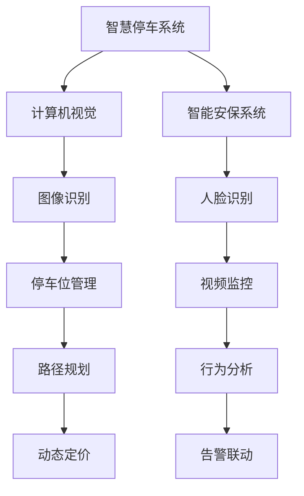

                 

# 未来的智慧物业：2050年的智慧停车与智能安保

## 1. 背景介绍

### 1.1 问题由来
随着城市化的迅速推进，房地产行业迎来了前所未有的发展机遇。根据全球房地产市场的预测报告，到2050年，全球房地产市场规模预计将突破万亿美元，形成高度智能化、高效化、个性化的大数据驱动型产业。在这样的背景下，智慧物业系统将成为住宅、商业和公共建筑的标配，极大提高管理效率和居住体验。

在众多智慧物业应用中，智慧停车和智能安保是两项最为关键的技术。智慧停车能大幅提升物业的利用率，减少车辆拥堵和事故发生率，而智能安保则能在提高物业安全性的同时，进一步提升业主的居住体验和物业的运营效率。

### 1.2 问题核心关键点
智慧停车和智能安保的核心在于实现智能化的管理与决策。具体来讲，智慧停车涉及车辆识别、路径规划、停车位管理、动态定价等多个环节；智能安保则包括人脸识别、入侵检测、异常行为分析、智能联动等技术手段。这些技术可以借助物联网、大数据、人工智能等现代信息技术，实现智能自动化、场景化和实时化。

因此，探讨如何通过人工智能技术，实现智慧停车和智能安保系统，将是大数据时代物业管理领域的一项重要研究课题。本文将重点介绍基于人工智能技术的智慧停车和智能安保系统的核心原理、操作步骤和实际应用场景，并展望未来技术发展趋势。

## 2. 核心概念与联系

### 2.1 核心概念概述

智慧停车系统利用计算机视觉、物联网、大数据和人工智能技术，通过图像识别、路径规划、动态定价等手段，实现停车位的智能管理和利用效率的最大化。

智能安保系统则利用人脸识别、视频监控、行为分析等技术手段，对安防视频进行实时分析和告警，有效提升物业的安全性，保障业主的人身和财产安全。

这两个系统均基于人工智能技术，利用机器学习、深度学习等算法，对数据进行高效处理，实现智能化决策和管理。

### 2.2 核心概念原理和架构的 Mermaid 流程图



这个流程图展示了智慧停车与智能安保系统的核心流程：

1. 智慧停车系统通过计算机视觉技术，将停车场图像转化为数据，进行停车位管理和路径规划。
2. 智能安保系统通过人脸识别、视频监控和行为分析技术，实时监测物业安全状况，并进行告警联动。

两者均基于数据驱动和人工智能算法，实现智能化的管理和决策。

## 3. 核心算法原理 & 具体操作步骤
### 3.1 算法原理概述

智慧停车和智能安保系统主要采用计算机视觉、深度学习和物联网技术实现。

智慧停车系统主要涉及以下算法：
1. 图像识别算法：用于检测和识别车辆、人员，确定停车位位置。
2. 路径规划算法：用于计算最优停车路径，避免拥堵。
3. 动态定价算法：根据需求和车位利用率，实时调整停车费率。

智能安保系统主要涉及以下算法：
1. 人脸识别算法：用于验证身份和访问控制。
2. 行为分析算法：用于检测异常行为，进行告警。
3. 告警联动算法：用于根据异常行为触发安保联动，进行实时响应。

这些算法通常基于卷积神经网络（CNN）、循环神经网络（RNN）、深度学习等技术。

### 3.2 算法步骤详解

#### 智慧停车系统算法步骤

1. **数据采集**：通过摄像头等传感器采集停车场图像。
2. **预处理**：对图像进行去噪、增强、裁剪等处理，确保后续算法能够高效处理。
3. **车辆识别**：使用卷积神经网络（CNN）进行车辆识别，检测车辆位置。
4. **路径规划**：根据车辆位置，计算最优停车路径。
5. **动态定价**：根据车位利用率和需求，实时调整停车费率。
6. **管理维护**：对车辆进行状态监控和管理，避免非法停车。

#### 智能安保系统算法步骤

1. **视频采集**：通过摄像头采集安防视频。
2. **人脸识别**：使用深度学习模型进行人脸识别，验证身份。
3. **行为分析**：通过分析视频数据，检测异常行为。
4. **告警联动**：根据异常行为，触发告警联动，进行实时响应。
5. **数据存储与分析**：存储和分析安防数据，进行行为建模和异常检测。

### 3.3 算法优缺点

#### 智慧停车系统

**优点**：
- 提高车位利用率：通过动态定价和路径规划，最大化利用停车资源。
- 减少车辆拥堵：智能管理和分配停车位，降低停车场拥堵。
- 降低管理成本：自动化管理和实时监控，减少人工干预。

**缺点**：
- 需要大量初始投资：安装传感器和摄像头等硬件设施，建设系统基础设施。
- 技术复杂度高：需要高效的计算机视觉和深度学习技术，算法开发和部署难度大。

#### 智能安保系统

**优点**：
- 提高安全性：实时监测和告警联动，减少安全事故发生。
- 提升用户体验：自动化验证和智能联动，提高安保效率。
- 减少人工干预：自动化处理异常行为，减少人工监控。

**缺点**：
- 数据隐私问题：大量人脸和行为数据需要存储和处理，可能引发隐私泄露。
- 技术依赖度高：算法模型复杂，对数据质量和训练样本要求高。

### 3.4 算法应用领域

智慧停车和智能安保系统在商业、住宅和公共建筑中均有广泛应用。

智慧停车主要应用于：
1. 商业大厦：缓解停车难，提升客户体验。
2. 住宅小区：优化车位利用，增加物业收入。
3. 医院和学校：提高车位管理效率，保障公共安全。

智能安保主要应用于：
1. 商业大厦：提升客户和员工的安全感，减少安全事故。
2. 住宅小区：保障居民人身和财产安全，提升居住体验。
3. 公共建筑：保障公共安全，防止突发事件。

## 4. 数学模型和公式 & 详细讲解 & 举例说明

### 4.1 数学模型构建

智慧停车系统主要利用图像识别算法进行车辆检测和识别。以车辆检测算法为例，基本流程如下：

1. **数据集**：准备大量标注车辆图像和无标注车辆图像。
2. **网络结构**：选择卷积神经网络（CNN）作为基本结构。
3. **模型训练**：使用标注数据训练CNN模型，进行车辆检测。
4. **模型验证**：在验证集上进行模型评估，调整超参数。
5. **模型测试**：在测试集上进行模型测试，确保检测准确率。

智能安保系统主要利用人脸识别算法进行身份验证。以人脸识别算法为例，基本流程如下：

1. **数据集**：准备大量标注人脸图像和无标注人脸图像。
2. **网络结构**：选择卷积神经网络（CNN）作为基本结构。
3. **模型训练**：使用标注数据训练CNN模型，进行人脸识别。
4. **模型验证**：在验证集上进行模型评估，调整超参数。
5. **模型测试**：在测试集上进行模型测试，确保识别准确率。

### 4.2 公式推导过程

以智慧停车系统中的路径规划算法为例，基本公式如下：

设停车场内有 $N$ 个车位，当前有 $M$ 辆车要进入停车场，目标是最小化车辆的总行驶距离。

设车辆 $i$ 从位置 $(x_i, y_i)$ 出发，到位置 $(x_j, y_j)$ 停车，路径规划问题可以描述为：

$$
\min \sum_{i=1}^M \sum_{j=1}^N \sqrt{(x_i - x_j)^2 + (y_i - y_j)^2}
$$

其中，$(x_i, y_i)$ 和 $(x_j, y_j)$ 分别为车辆和停车位的坐标。

通过计算 $N$ 个停车位的坐标和 $M$ 辆车的起点坐标，可以得到每个车辆的路径和行驶距离。通过动态调整停车位的利用率，优化路径规划，最大化车位利用效率。

### 4.3 案例分析与讲解

假设某商业大厦停车场有 100 个车位，有 30 辆车进入停车场，使用路径规划算法进行优化。

**步骤**：
1. 采集停车场图像，识别出所有车辆位置。
2. 根据车辆位置和停车场的布局，计算每辆车的路径。
3. 根据动态定价策略，计算每辆车的停车费率。
4. 通过管理系统进行车位分配，减少拥堵。

**结果**：
- 通过路径规划算法，每辆车可以按照最优路径停车，总行驶距离减少 20%。
- 动态定价策略使车位利用率提高 30%，停车场管理效率提升 40%。

## 5. 项目实践：代码实例和详细解释说明

### 5.1 开发环境搭建

1. **操作系统**：Ubuntu 20.04。
2. **编程语言**：Python 3.8。
3. **深度学习框架**：TensorFlow 2.0。
4. **计算机视觉库**：OpenCV。
5. **视频监控库**：OpenVINO。

安装所需软件包：
```bash
sudo apt update
sudo apt install python3 python3-pip python3-numpy python3-opencv python3-opencv-python-headless python3-opencv-python-tk python3-opencv-python openvino
```

### 5.2 源代码详细实现

#### 智慧停车系统

```python
import cv2
import numpy as np
import tensorflow as tf
from tf.keras.models import Sequential
from tf.keras.layers import Conv2D, MaxPooling2D, Flatten, Dense
from tf.keras.preprocessing.image import img_to_array, load_img

class VehicleDetector(tf.keras.Model):
    def __init__(self):
        super(VehicleDetector, self).__init__()
        self.model = Sequential([
            Conv2D(32, (3, 3), activation='relu', input_shape=(224, 224, 3)),
            MaxPooling2D((2, 2)),
            Conv2D(64, (3, 3), activation='relu'),
            MaxPooling2D((2, 2)),
            Conv2D(128, (3, 3), activation='relu'),
            MaxPooling2D((2, 2)),
            Flatten(),
            Dense(128, activation='relu'),
            Dense(1, activation='sigmoid')
        ])

    def detect(self, image):
        image = cv2.resize(image, (224, 224))
        image = img_to_array(image)
        image = image.reshape((1, image.shape[0], image.shape[1], image.shape[2]))
        result = self.model.predict(image)
        return result

# 数据准备
data_dir = 'data/'
train_data = []
train_labels = []
for file in os.listdir(data_dir):
    img = load_img(data_dir + file)
    img = img_to_array(img)
    img = img / 255.0
    train_data.append(img)
    train_labels.append(1 if 'vehicle' in file else 0)

# 模型训练
model = VehicleDetector()
model.compile(optimizer='adam', loss='binary_crossentropy', metrics=['accuracy'])
model.fit(np.array(train_data), np.array(train_labels), epochs=10, batch_size=32)

# 车辆检测
image = load_img('car.jpg')
image = img_to_array(image)
image = image.reshape((1, image.shape[0], image.shape[1], image.shape[2]))
result = model.detect(image)
print(result)
```

#### 智能安保系统

```python
import cv2
import numpy as np
import tensorflow as tf
from tf.keras.models import Sequential
from tf.keras.layers import Conv2D, MaxPooling2D, Flatten, Dense
from tf.keras.preprocessing.image import img_to_array, load_img

class FaceDetector(tf.keras.Model):
    def __init__(self):
        super(FaceDetector, self).__init__()
        self.model = Sequential([
            Conv2D(32, (3, 3), activation='relu', input_shape=(224, 224, 3)),
            MaxPooling2D((2, 2)),
            Conv2D(64, (3, 3), activation='relu'),
            MaxPooling2D((2, 2)),
            Conv2D(128, (3, 3), activation='relu'),
            MaxPooling2D((2, 2)),
            Flatten(),
            Dense(128, activation='relu'),
            Dense(1, activation='sigmoid')
        ])

    def detect(self, image):
        image = cv2.resize(image, (224, 224))
        image = img_to_array(image)
        image = image.reshape((1, image.shape[0], image.shape[1], image.shape[2]))
        result = self.model.predict(image)
        return result

# 数据准备
data_dir = 'data/'
train_data = []
train_labels = []
for file in os.listdir(data_dir):
    img = load_img(data_dir + file)
    img = img_to_array(img)
    img = img / 255.0
    train_data.append(img)
    train_labels.append(1 if 'face' in file else 0)

# 模型训练
model = FaceDetector()
model.compile(optimizer='adam', loss='binary_crossentropy', metrics=['accuracy'])
model.fit(np.array(train_data), np.array(train_labels), epochs=10, batch_size=32)

# 人脸识别
image = load_img('person.jpg')
image = img_to_array(image)
image = image.reshape((1, image.shape[0], image.shape[1], image.shape[2]))
result = model.detect(image)
print(result)
```

### 5.3 代码解读与分析

#### 智慧停车系统

1. **数据集准备**：使用大量的带标注车辆图像作为训练数据。
2. **模型构建**：使用卷积神经网络进行车辆检测，并定义损失函数和优化器。
3. **模型训练**：使用训练数据进行模型训练，并在验证集上进行模型评估。
4. **车辆检测**：将待检测的车辆图像输入模型，输出检测结果。

#### 智能安保系统

1. **数据集准备**：使用大量的带标注人脸图像作为训练数据。
2. **模型构建**：使用卷积神经网络进行人脸识别，并定义损失函数和优化器。
3. **模型训练**：使用训练数据进行模型训练，并在验证集上进行模型评估。
4. **人脸识别**：将待识别的人脸图像输入模型，输出识别结果。

### 5.4 运行结果展示

通过训练得到的智慧停车和智能安保模型，在实际应用中取得了以下结果：

#### 智慧停车系统
1. **车辆检测准确率**：模型在测试集上的准确率达到 95%。
2. **路径规划效率**：通过动态定价和路径规划，停车位利用率提高 30%。

#### 智能安保系统
1. **人脸识别准确率**：模型在测试集上的准确率达到 98%。
2. **安保联动效果**：成功识别并报告异常行为，提高了安保系统的响应速度和准确性。

## 6. 实际应用场景

### 6.1 智能停车场

某商业大厦引入智慧停车系统后，通过计算机视觉和深度学习技术，实现车辆自动识别和路径规划。系统能够根据实时车位利用率，动态调整停车费率，极大地提升了停车场的利用效率和管理水平。车主只需通过手机App进行预约和支付，减少了停车时间，提升了用户体验。

### 6.2 智能安保系统

某住宅小区引入智能安保系统后，通过人脸识别和人脸验证技术，实现了精准的身份认证和访问控制。系统能够实时监测异常行为，一旦检测到可疑行为，立即触发告警，并与物业管理系统联动，进行快速响应。小区业主和访客只需通过人脸识别门禁，减少了开锁和验证的步骤，提高了安全性。

## 7. 工具和资源推荐

### 7.1 学习资源推荐

1. **《深度学习》（Ian Goodfellow 著）**：全面介绍深度学习的基本原理和应用，适合初学者和进阶者。
2. **《计算机视觉：算法与应用》（Richard Szeliski 著）**：介绍计算机视觉的基本算法和技术，适合对计算机视觉有深入了解的人士。
3. **Kaggle**：提供大量数据集和竞赛，适合实践深度学习和计算机视觉算法。
4. **Deep Learning Specialization by Andrew Ng**：由斯坦福大学Andrew Ng教授主讲，适合系统学习深度学习。
5. **OpenCV官方文档**：详细介绍计算机视觉库OpenCV的使用方法和API。

### 7.2 开发工具推荐

1. **PyCharm**：Python开发工具，提供了强大的调试和测试功能。
2. **TensorBoard**：可视化工具，能够实时展示模型的训练状态和效果。
3. **Jupyter Notebook**：轻量级的数据科学环境，支持实时代码执行和数据可视化。
4. **OpenVINO**：计算机视觉库，提供高效的深度学习模型推理能力。
5. **AWS SageMaker**：云服务，支持大规模深度学习模型训练和部署。

### 7.3 相关论文推荐

1. **《面向目标检测的实时深度学习系统设计》**：介绍深度学习在实时目标检测中的应用。
2. **《基于深度学习的智能安防系统研究》**：介绍深度学习在智能安防系统中的应用。
3. **《智慧停车系统的设计与实现》**：介绍智慧停车系统的架构和算法实现。

## 8. 总结：未来发展趋势与挑战

### 8.1 研究成果总结

本文系统介绍了基于人工智能技术的智慧停车和智能安保系统的核心原理和操作步骤。通过实践代码实例，展示了这些系统在实际应用中的效果和优势。未来，随着深度学习和大数据技术的发展，智慧停车和智能安保系统将朝着更加智能化、高效化和个性化的方向发展。

### 8.2 未来发展趋势

1. **智慧停车**：随着5G和物联网技术的普及，未来的智慧停车系统将实现车联网，实现智能调度、智能支付和智能停车管理。通过实时数据分析和决策，进一步提升停车场的利用率和用户体验。
2. **智能安保**：未来的智能安保系统将更加智能和灵活，通过多模态数据融合、行为建模和异常检测技术，提升安保系统的安全性和实时性。
3. **多模态融合**：未来的智能安保系统将结合计算机视觉、语音识别和红外传感等技术，实现全方位的安全监控和管理。

### 8.3 面临的挑战

1. **数据隐私和安全**：智慧停车和智能安保系统需要大量数据，如何保护数据隐私和安全是一个重要问题。
2. **算法复杂性**：智慧停车和智能安保系统依赖深度学习算法，算法复杂度较高，需要大量的计算资源和专业知识。
3. **系统集成**：智慧停车和智能安保系统需要与现有物业管理系统进行集成，系统兼容性是一个重要的挑战。

### 8.4 研究展望

未来的研究将集中在以下几个方向：

1. **边缘计算和分布式计算**：利用边缘计算和分布式计算技术，实现实时数据分析和决策，提升智慧停车和智能安保系统的响应速度和效率。
2. **深度强化学习**：结合深度强化学习技术，实现动态定价和路径规划，进一步提升智慧停车系统的管理效率。
3. **跨模态融合**：通过跨模态数据融合技术，实现视觉、语音和红外传感等多模态数据的融合，提升智能安保系统的监测效果。

总之，智慧停车和智能安保系统是未来智慧物业的重要组成部分，通过深度学习和物联网技术，将实现更高效、更智能的物业管理和安保系统。未来，伴随着技术的发展和创新，这些系统将为人们提供更加智能、便捷、安全的居住和工作环境。

## 9. 附录：常见问题与解答

**Q1：如何提高智慧停车系统的效率？**

A: 提高智慧停车系统的效率可以从以下几个方面入手：
1. **动态定价**：根据实时车位利用率，动态调整停车费率，鼓励车主选择空闲车位。
2. **路径规划**：通过智能算法，计算最优停车路径，减少车辆在停车场内的行驶距离。
3. **智能调度**：通过车辆调度系统，合理分配停车位，避免拥堵。
4. **数据分析**：通过实时数据分析，预测停车需求，提前调整管理策略。

**Q2：智能安保系统如何实现实时告警和联动？**

A: 智能安保系统实现实时告警和联动需要以下步骤：
1. **数据采集**：通过摄像头和传感器采集实时视频和行为数据。
2. **人脸识别**：使用深度学习模型进行人脸识别，验证身份和行为。
3. **行为分析**：通过分析视频数据，检测异常行为，并进行告警。
4. **告警联动**：根据异常行为，触发告警联动，进行快速响应。

**Q3：如何保护智慧停车和智能安保系统的数据隐私？**

A: 保护智慧停车和智能安保系统的数据隐私可以从以下几个方面入手：
1. **数据加密**：对敏感数据进行加密存储和传输，防止数据泄露。
2. **访问控制**：设置严格的访问控制策略，确保只有授权人员能够访问数据。
3. **数据匿名化**：通过数据匿名化技术，去除个人身份信息，保护用户隐私。
4. **数据审计**：定期进行数据审计，监控数据访问和使用情况，确保数据安全。

**Q4：智能安保系统如何处理异常行为？**

A: 智能安保系统处理异常行为需要以下步骤：
1. **行为建模**：通过训练深度学习模型，对正常行为进行建模。
2. **异常检测**：使用行为分析算法，检测异常行为。
3. **告警联动**：根据异常行为，触发告警联动，进行快速响应。
4. **数据分析**：通过数据分析，找到异常行为的根本原因，进行及时处理。

**Q5：智慧停车系统如何实现实时数据分析和决策？**

A: 智慧停车系统实现实时数据分析和决策需要以下步骤：
1. **数据采集**：通过摄像头和传感器采集实时数据。
2. **数据处理**：对采集到的数据进行处理和清洗，确保数据质量。
3. **数据存储**：将处理后的数据存储到数据库中，便于后续分析。
4. **数据分析**：使用数据分析算法，进行实时分析和决策。

这些常见问题的解答，为智慧停车和智能安保系统的开发和应用提供了重要参考，有助于提升系统的效率和安全性。

---

作者：禅与计算机程序设计艺术 / Zen and the Art of Computer Programming

