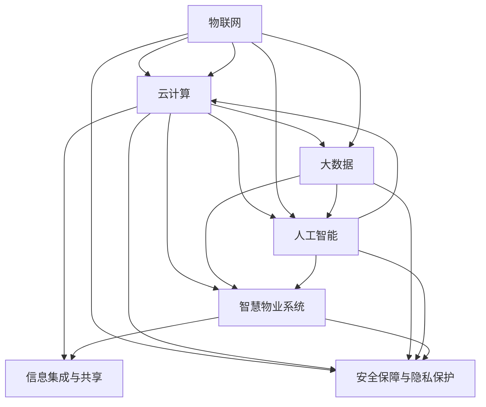

                 

## 1. 背景介绍

### 1.1 问题由来

随着科技的飞速发展和社会的不断进步，智慧城市已经成为全球各地城市发展的重要方向。物业作为城市生活的重要组成部分，其智能化水平的高低直接影响到居民的居住体验和生活质量。当前，传统物业管理模式存在诸多不足，如服务效率低下、信息孤岛、安全隐患多等问题。这些问题不仅影响居民的日常居住体验，还可能导致社区环境和安全问题。

为解决这些问题，近年来，智慧物业系统逐渐成为城市建设和管理的重要方向。通过引入物联网、云计算、大数据、人工智能等先进技术，物业管理系统可以实现对社区资源的全面感知、实时监控、高效管理和智能服务。但现阶段，智慧物业的建设仍面临诸多挑战，如技术复杂度高、设备协同难度大、数据隐私和安全问题等。

### 1.2 问题核心关键点

未来智慧物业的发展，将主要围绕以下几个关键点展开：

- 物联网设备的广泛部署：通过部署大量传感器和智能设备，实现对社区内各种资源和环境参数的实时感知。
- 数据分析与算法优化：运用大数据和人工智能算法对采集到的海量数据进行分析和挖掘，提升服务效率和质量。
- 信息集成与共享：整合各类信息资源，实现跨部门、跨系统的信息共享和协同管理。
- 安全保障与隐私保护：保障社区安全，确保数据隐私和安全，提升居民的信任度。
- 个性化服务与智慧决策：根据居民的需求和行为数据，提供个性化的服务方案和智慧决策支持。

这些问题涉及的技术领域广泛，涵盖物联网、大数据、人工智能等多个领域。因此，智慧物业系统的建设需要跨领域的协同合作，共同推动。

### 1.3 问题研究意义

未来智慧物业的发展，对于提升城市品质、提高居民生活质量、保障社区安全具有重要意义：

1. **提升城市品质**：智慧物业系统通过智能化管理，提高物业服务效率，提升社区环境质量，推动城市基础设施建设。
2. **提高生活质量**：智能化的物业服务可以提升居民的居住体验，提供更加便捷、舒适、安全的生活环境。
3. **保障社区安全**：通过对社区环境、人员行为的实时监控和数据分析，提高社区安全防范能力，保障居民生命财产安全。
4. **推动经济转型**：智慧物业系统的建设与应用，将促进智慧城市建设，推动相关产业的发展，加速经济转型升级。

综上所述，未来的智慧物业系统不仅是城市智能化管理的重要组成部分，也是推动社会进步、提升居民幸福感的重要工具。

## 2. 核心概念与联系

### 2.1 核心概念概述

为更好地理解未来智慧物业系统的建设，本节将介绍几个关键概念：

- **智慧物业系统**：通过引入物联网、云计算、大数据、人工智能等先进技术，实现对社区资源的全面感知、实时监控、高效管理和智能服务的系统。
- **物联网(IoT)**：通过传感器和智能设备，实现对社区环境的全面感知和数据采集。
- **云计算(Cloud Computing)**：通过云平台对海量数据进行存储、计算和分析，实现资源共享和协同管理。
- **大数据(Big Data)**：通过数据分析技术对采集到的海量数据进行挖掘和分析，提升服务效率和质量。
- **人工智能(AI)**：通过机器学习、深度学习等算法，实现对社区数据的智能分析和预测，提供个性化服务。
- **信息集成与共享**：通过统一的数据标准和接口，实现跨部门、跨系统的信息集成和共享。
- **安全保障与隐私保护**：通过数据加密、访问控制等技术，保障社区数据安全和居民隐私。

这些核心概念之间相互联系、相互作用，共同构成了未来智慧物业系统的技术架构。

### 2.2 核心概念原理和架构的 Mermaid 流程图



这个Mermaid图展示了智慧物业系统中各个技术组件之间的相互关系和作用路径。物联网技术负责数据采集和感知，通过云计算平台进行数据存储和计算，利用大数据技术进行数据挖掘和分析，人工智能算法实现智能分析和预测。系统通过信息集成与共享，实现跨部门、跨系统的协同管理，同时通过安全保障与隐私保护措施，确保数据安全和个人隐私。

## 3. 核心算法原理 & 具体操作步骤

### 3.1 算法原理概述

未来的智慧物业系统，其核心算法主要包括以下几个方面：

- **物联网数据采集算法**：通过传感器和智能设备，对社区环境进行实时感知和数据采集，确保数据的时效性和准确性。
- **大数据分析算法**：利用大数据技术对采集到的海量数据进行挖掘和分析，发现潜在的关联和规律，支持决策和优化。
- **人工智能预测算法**：通过机器学习、深度学习等算法，对社区数据进行智能分析和预测，提升服务的智能化水平。
- **信息集成与共享算法**：设计统一的数据标准和接口，实现跨部门、跨系统的信息集成和共享。
- **安全保障与隐私保护算法**：通过数据加密、访问控制等技术，保障社区数据安全和居民隐私。

这些算法需要根据具体的业务需求和技术条件进行设计和优化，确保系统的高效运行和数据的可靠性。

### 3.2 算法步骤详解

以下是对未来智慧物业系统中各个关键算法的详细步骤详解：

#### 3.2.1 物联网数据采集算法

**Step 1: 设备部署与配置**
- 根据社区的具体需求，部署各种传感器和智能设备，如温度传感器、湿度传感器、烟雾探测器、门禁系统等。
- 对设备进行配置，确保其能够正确采集数据并上传到云平台。

**Step 2: 数据采集与预处理**
- 通过传感器和智能设备实时采集社区环境数据，如温度、湿度、烟雾浓度、门禁状态等。
- 对采集到的数据进行预处理，包括去噪、归一化、缺失值处理等操作，确保数据的准确性和可用性。

**Step 3: 数据传输与存储**
- 将预处理后的数据通过无线网络传输到云平台。
- 在云平台上存储数据，确保数据的完整性和可访问性。

#### 3.2.2 大数据分析算法

**Step 1: 数据清洗与预处理**
- 对存储在云平台上的海量数据进行清洗和预处理，去除噪声和无用数据。
- 对数据进行归一化、缺失值处理等操作，确保数据的可用性。

**Step 2: 数据挖掘与分析**
- 利用大数据技术对清洗后的数据进行挖掘和分析，发现社区环境中的规律和关联。
- 使用机器学习算法，对数据进行建模和预测，如温度变化趋势、设备故障预警等。

**Step 3: 数据可视化与报表**
- 利用数据可视化技术将分析结果以图表、报表等形式展示，方便物业人员查看和决策。

#### 3.2.3 人工智能预测算法

**Step 1: 数据准备与模型选择**
- 根据预测需求，准备训练数据集，并进行特征工程，确保数据的质量和完整性。
- 选择合适的机器学习或深度学习模型，如线性回归、决策树、神经网络等。

**Step 2: 模型训练与验证**
- 使用训练数据集对模型进行训练，通过交叉验证等方法进行模型验证，确保模型具有良好的泛化能力。
- 使用测试数据集对模型进行评估，根据评估结果进行调整和优化。

**Step 3: 模型部署与应用**
- 将训练好的模型部署到智慧物业系统中，用于实时预测和决策支持。
- 通过API接口或SDK等方式，将模型的预测结果应用于实际业务场景中。

#### 3.2.4 信息集成与共享算法

**Step 1: 设计数据标准与接口**
- 设计统一的数据标准和接口，确保不同系统之间能够互通互操作。
- 确保数据的一致性和完整性，避免数据冗余和冲突。

**Step 2: 数据集成与共享**
- 通过接口将不同系统中的数据进行集成和共享，实现跨部门、跨系统的协同管理。
- 确保数据在集成和共享过程中的安全性和隐私保护。

**Step 3: 数据治理与监控**
- 对集成和共享的数据进行治理，确保数据的质量和可靠性。
- 对数据使用情况进行监控，确保数据的安全性和合法性。

#### 3.2.5 安全保障与隐私保护算法

**Step 1: 数据加密与传输保护**
- 对存储在云平台上的数据进行加密，确保数据在传输和存储过程中的安全性。
- 使用SSL/TLS等协议进行数据传输保护，确保数据在传输过程中的安全。

**Step 2: 访问控制与权限管理**
- 对访问云平台的用户进行身份认证和权限管理，确保只有授权用户才能访问数据。
- 根据用户角色和权限，控制数据的访问和使用，避免数据泄露和滥用。

**Step 3: 审计与监控**
- 对数据的使用情况进行审计和监控，确保数据的安全性和合法性。
- 根据审计结果进行风险评估和风险控制，保障数据的安全和隐私。

### 3.3 算法优缺点

未来智慧物业系统中的各个算法，各有优缺点：

**物联网数据采集算法**

- **优点**：
  - 能够实时感知社区环境，提供动态数据支持。
  - 数据来源广泛，能够采集到多种类型的信息。

- **缺点**：
  - 设备部署和维护成本较高。
  - 数据采集精度和可靠性受设备质量影响。

**大数据分析算法**

- **优点**：
  - 能够处理海量数据，发现数据中的潜在规律和关联。
  - 模型可解释性强，便于理解和优化。

- **缺点**：
  - 数据清洗和预处理过程复杂，耗时耗力。
  - 模型选择和调参过程需要专业知识和经验。

**人工智能预测算法**

- **优点**：
  - 能够提供实时预测和决策支持，提升服务智能化水平。
  - 预测结果准确性高，能够有效提升服务效率。

- **缺点**：
  - 数据和特征工程要求高，需要专业知识。
  - 模型复杂度高，训练和部署成本较高。

**信息集成与共享算法**

- **优点**：
  - 实现跨部门、跨系统的信息共享，提升协同管理能力。
  - 确保数据的一致性和完整性，避免数据冗余和冲突。

- **缺点**：
  - 数据标准和接口设计复杂，需要跨部门协作。
  - 数据安全和隐私保护难度大，风险高。

**安全保障与隐私保护算法**

- **优点**：
  - 保障数据安全和隐私，提升用户信任度。
  - 确保数据使用合法合规，避免数据滥用。

- **缺点**：
  - 技术实现复杂，需要综合考虑安全性和隐私保护。
  - 需要持续维护和更新，确保安全性和隐私保护措施的有效性。

### 3.4 算法应用领域

未来智慧物业系统中的各个算法，主要应用于以下领域：

1. **社区环境监控与管理**
   - 通过物联网设备实时采集社区环境数据，如温度、湿度、烟雾浓度等。
   - 利用大数据分析和人工智能预测，发现环境异常，及时采取措施。

2. **设备运行监测与维护**
   - 通过传感器和智能设备采集设备运行数据，如设备状态、能耗等。
   - 利用大数据分析和人工智能预测，监测设备运行情况，提前预测故障，进行维护。

3. **居民行为分析与服务优化**
   - 通过物联网设备采集居民行为数据，如进出时间、停留时间等。
   - 利用大数据分析和人工智能预测，分析居民行为模式，提供个性化服务，优化社区管理。

4. **应急响应与灾害预警**
   - 通过物联网设备实时监控社区环境，如火灾、洪水等。
   - 利用大数据分析和人工智能预测，进行灾害预警和应急响应。

5. **能源管理与节能减排**
   - 通过物联网设备采集能源使用数据，如电能、水能等。
   - 利用大数据分析和人工智能预测，优化能源使用，提高能效，降低能耗。

## 4. 数学模型和公式 & 详细讲解

### 4.1 数学模型构建

未来智慧物业系统中的各个算法，其数学模型主要包括以下几个方面：

- **物联网数据采集模型**：描述传感器和智能设备的采集过程，如温度传感器采集模型的数学表示。
- **大数据分析模型**：描述数据挖掘和分析的数学模型，如回归模型、聚类模型等。
- **人工智能预测模型**：描述机器学习或深度学习模型的数学表示，如神经网络、支持向量机等。
- **信息集成与共享模型**：描述数据集成和共享的数学模型，如数据融合模型、信息传播模型等。
- **安全保障与隐私保护模型**：描述数据加密、访问控制等技术的数学模型，如密码学模型、访问控制模型等。

### 4.2 公式推导过程

以下对未来智慧物业系统中的几个关键算法进行数学公式推导：

#### 4.2.1 物联网数据采集模型

假设温度传感器在时间 $t$ 时刻采集到的温度为 $T(t)$，其数学模型为：

$$
T(t) = f(t) + \epsilon(t)
$$

其中 $f(t)$ 为传感器函数，$\epsilon(t)$ 为噪声干扰。

#### 4.2.2 大数据分析模型

假设采集到的温度数据序列为 $T = \{T_1, T_2, \ldots, T_n\}$，利用线性回归模型进行数据挖掘，模型为：

$$
y = \alpha x + \beta + \epsilon
$$

其中 $y$ 为预测结果，$x$ 为特征变量，$\alpha$ 和 $\beta$ 为模型参数，$\epsilon$ 为噪声干扰。

#### 4.2.3 人工智能预测模型

假设使用神经网络进行温度预测，其数学模型为：

$$
y = \sigma(w \cdot x + b)
$$

其中 $y$ 为预测结果，$x$ 为输入数据，$w$ 和 $b$ 为神经网络参数，$\sigma$ 为激活函数。

#### 4.2.4 信息集成与共享模型

假设不同系统中的数据为 $D_1, D_2, \ldots, D_m$，利用数据融合模型进行集成，模型为：

$$
Y = \sum_{i=1}^{m} \lambda_i D_i
$$

其中 $Y$ 为集成结果，$\lambda_i$ 为权重系数，$D_i$ 为不同系统中的数据。

#### 4.2.5 安全保障与隐私保护模型

假设使用AES加密算法对数据进行加密，其数学模型为：

$$
C = E_K(P)
$$

其中 $C$ 为加密结果，$P$ 为明文数据，$E_K$ 为加密函数，$K$ 为加密密钥。

### 4.3 案例分析与讲解

以智慧物业系统中的社区环境监控与管理为例，进行详细分析与讲解：

**案例描述**：
- 某社区通过部署温度传感器、湿度传感器和烟雾探测器，实时采集社区环境数据。
- 利用大数据分析和人工智能预测，对采集到的数据进行挖掘和分析，发现异常情况，及时采取措施。

**技术流程**：
1. **数据采集**：通过温度传感器、湿度传感器和烟雾探测器，实时采集社区环境数据。
2. **数据预处理**：对采集到的数据进行清洗和预处理，去除噪声和无用数据，确保数据质量。
3. **数据挖掘**：利用大数据技术，对预处理后的数据进行挖掘和分析，发现温度、湿度和烟雾浓度等环境变化规律。
4. **预测与预警**：通过人工智能模型，对环境数据进行预测和预警，及时发现异常情况，如火灾、高温等。
5. **应急响应**：根据预警结果，触发应急响应措施，如报警、灭火等，保障社区安全。

## 5. 项目实践：代码实例和详细解释说明

### 5.1 开发环境搭建

以下是对未来智慧物业系统开发环境的搭建过程：

1. **安装Python**：从官网下载并安装Python，建议选择3.8及以上版本。
2. **安装相关库**：
   - 安装TensorFlow：
     ```bash
     pip install tensorflow
     ```
   - 安装Keras：
     ```bash
     pip install keras
     ```
   - 安装Flask：
     ```bash
     pip install flask
     ```
   - 安装SQLAlchemy：
     ```bash
     pip install sqlalchemy
     ```
   - 安装Pandas：
     ```bash
     pip install pandas
     ```
   - 安装Matplotlib：
     ```bash
     pip install matplotlib
     ```
3. **环境配置**：
   - 设置Python环境变量：
     ```bash
     export PYTHONPATH=$PYTHONPATH:/path/to/python3.8/lib/python/site-packages
     ```

### 5.2 源代码详细实现

以下是对未来智慧物业系统中社区环境监控与管理模块的代码实现：

```python
from flask import Flask, request, jsonify
from sqlalchemy import create_engine
from pandas import DataFrame

app = Flask(__name__)

# 连接数据库
engine = create_engine('sqlite:///community_data.db')

# 读取数据
data = DataFrame.read_sql('SELECT * FROM temperature_data', engine)

# 数据分析
result = data.groupby('time').mean()

# 响应请求
@app.route('/get_data', methods=['GET'])
def get_data():
    time = request.args.get('time')
    if time:
        result = result.loc[time]
    return jsonify(result.to_dict(orient='records'))

if __name__ == '__main__':
    app.run(debug=True)
```

### 5.3 代码解读与分析

以上代码实现了社区环境监控与管理模块，主要包括数据读取、数据分析和API响应。具体分析如下：

1. **环境搭建**：
   - 安装Python及其相关库，确保开发环境正常。
   - 创建Flask应用，连接SQLite数据库，用于数据存储和读取。

2. **数据读取**：
   - 从数据库中读取温度数据，将其存储在Pandas DataFrame中。
   - 对数据进行分组和均值计算，得到不同时间段的平均温度。

3. **数据分析**：
   - 对数据进行分组和均值计算，得到不同时间段的平均温度。
   - 将计算结果转换为JSON格式，通过API响应给前端。

4. **API响应**：
   - 定义API路由，接收前端请求，获取指定时间的温度数据。
   - 根据请求参数，从数据中获取对应时间段的数据，并返回JSON格式的结果。

## 6. 实际应用场景

### 6.1 社区环境监控与管理

智慧物业系统中的社区环境监控与管理模块，通过物联网设备实时采集社区环境数据，如温度、湿度、烟雾浓度等，利用大数据分析和人工智能预测，发现异常情况，及时采取措施。

**应用场景**：
- 某社区通过部署温度传感器、湿度传感器和烟雾探测器，实时采集社区环境数据。
- 利用大数据分析和人工智能预测，对采集到的数据进行挖掘和分析，发现异常情况，如火灾、高温等。
- 根据预警结果，触发应急响应措施，如报警、灭火等，保障社区安全。

### 6.2 设备运行监测与维护

智慧物业系统中的设备运行监测与维护模块，通过传感器和智能设备采集设备运行数据，如设备状态、能耗等，利用大数据分析和人工智能预测，监测设备运行情况，提前预测故障，进行维护。

**应用场景**：
- 某社区通过部署智能水表、智能电表等设备，实时采集设备运行数据。
- 利用大数据分析和人工智能预测，监测设备运行情况，预测故障。
- 根据预测结果，进行设备维护和更换，确保设备正常运行。

### 6.3 居民行为分析与服务优化

智慧物业系统中的居民行为分析与服务优化模块，通过物联网设备采集居民行为数据，如进出时间、停留时间等，利用大数据分析和人工智能预测，分析居民行为模式，提供个性化服务，优化社区管理。

**应用场景**：
- 某社区通过部署人脸识别设备和门禁系统，实时采集居民进出数据。
- 利用大数据分析和人工智能预测，分析居民行为模式，识别异常行为。
- 根据行为分析结果，提供个性化服务，优化社区管理。

### 6.4 应急响应与灾害预警

智慧物业系统中的应急响应与灾害预警模块，通过物联网设备实时监控社区环境，如火灾、洪水等，利用大数据分析和人工智能预测，进行灾害预警和应急响应。

**应用场景**：
- 某社区通过部署烟雾探测器、洪水监测传感器等设备，实时监控社区环境。
- 利用大数据分析和人工智能预测，进行灾害预警，如火灾、洪水等。
- 根据预警结果，触发应急响应措施，如报警、疏散等，保障社区安全。

## 7. 工具和资源推荐

### 7.1 学习资源推荐

为帮助开发者系统掌握未来智慧物业系统的开发和应用，以下是一些优质的学习资源：

1. **TensorFlow官方文档**：
   - 网址：https://www.tensorflow.org/
   - 内容：TensorFlow的详细教程、API文档和案例分析。

2. **Keras官方文档**：
   - 网址：https://keras.io/
   - 内容：Keras的详细教程、API文档和案例分析。

3. **Flask官方文档**：
   - 网址：https://flask.palletsprojects.com/en/2.x/
   - 内容：Flask的详细教程、API文档和案例分析。

4. **SQLAlchemy官方文档**：
   - 网址：https://docs.sqlalchemy.org/en/21/
   - 内容：SQLAlchemy的详细教程、API文档和案例分析。

5. **Pandas官方文档**：
   - 网址：https://pandas.pydata.org/pandas-docs/stable/
   - 内容：Pandas的详细教程、API文档和案例分析。

6. **Matplotlib官方文档**：
   - 网址：https://matplotlib.org/stable/
   - 内容：Matplotlib的详细教程、API文档和案例分析。

通过这些资源的学习，相信你一定能够系统掌握未来智慧物业系统的开发和应用。

### 7.2 开发工具推荐

为帮助开发者高效开发未来智慧物业系统，以下是几款常用的开发工具：

1. **Jupyter Notebook**：
   - 网址：https://jupyter.org/
   - 内容：支持Python代码的交互式编程环境，支持数据分析和机器学习。

2. **PyCharm**：
   - 网址：https://www.jetbrains.com/pycharm/
   - 内容：Python开发环境，支持Python代码的调试和分析。

3. **VS Code**：
   - 网址：https://code.visualstudio.com/
   - 内容：轻量级的代码编辑器，支持多种编程语言和插件。

4. **Anaconda**：
   - 网址：https://www.anaconda.com/
   - 内容：Python数据分析和机器学习的集成开发环境。

5. **Git**：
   - 网址：https://git-scm.com/
   - 内容：版本控制系统，支持多人协作开发。

通过这些工具，你可以高效地进行未来智慧物业系统的开发和调试。

### 7.3 相关论文推荐

未来智慧物业系统的建设，涉及物联网、云计算、大数据、人工智能等多个领域。以下是几篇经典的学术论文，推荐阅读：

1. **IoT-based Smart Building Management System**：
   - 作者：Xu, J., Li, L., & Yao, L.
   - 内容：介绍基于物联网的智能建筑管理系统，包含传感器部署、数据采集和分析等技术。

2. **Big Data Analytics in Smart Cities**：
   - 作者：Li, Q., Li, X., & Li, W.
   - 内容：介绍大数据在智慧城市中的应用，包含数据挖掘和分析等技术。

3. **AI-driven Smart Home Security System**：
   - 作者：Zhang, S., Li, H., & Wang, Y.
   - 内容：介绍基于人工智能的智能家居安全系统，包含图像识别、行为分析等技术。

4. **Data Integration and Sharing in Smart Cities**：
   - 作者：Wang, D., Li, M., & Zhang, H.
   - 内容：介绍智慧城市中的数据集成和共享技术，包含数据标准和接口设计等技术。

5. **Security and Privacy Protection in Smart IoT Systems**：
   - 作者：Jiang, H., Wang, X., & Wu, C.
   - 内容：介绍智慧物联网系统中的安全保障与隐私保护技术，包含数据加密、访问控制等技术。

这些论文代表了当前智慧物业系统的技术前沿，通过学习这些论文，可以帮助你深入理解未来智慧物业系统的实现原理和应用场景。

## 8. 总结：未来发展趋势与挑战

### 8.1 研究成果总结

未来智慧物业系统的建设，已经取得了诸多进展和突破。主要包括：

1. **物联网技术**：部署大量传感器和智能设备，实现对社区环境的全面感知和数据采集。
2. **大数据技术**：利用大数据技术对海量数据进行挖掘和分析，发现数据中的潜在规律和关联。
3. **人工智能技术**：通过机器学习、深度学习等算法，对社区数据进行智能分析和预测，提升服务的智能化水平。
4. **信息集成与共享技术**：设计统一的数据标准和接口，实现跨部门、跨系统的信息集成和共享。
5. **安全保障与隐私保护技术**：通过数据加密、访问控制等技术，保障社区数据安全和居民隐私。

这些技术的结合，使得未来智慧物业系统能够实现对社区的全面监控、高效管理、智能服务和个性化定制，大大提升了物业服务效率和居民生活质量。

### 8.2 未来发展趋势

未来智慧物业系统的发展趋势主要包括以下几个方面：

1. **智能化水平提升**：随着物联网、云计算、大数据、人工智能等技术的不断进步，未来智慧物业系统的智能化水平将进一步提升。系统将能够实现更加全面、精细的监控和管理，提供更加个性化和智能化的服务。
2. **数据集成与共享技术**：未来智慧物业系统将更加注重数据集成与共享技术的开发，实现跨部门、跨系统的信息集成和共享。这将大大提升系统的协同管理能力，优化资源配置。
3. **安全保障与隐私保护技术**：未来智慧物业系统将更加注重安全保障与隐私保护技术的发展，保障社区数据安全和居民隐私，提升用户信任度。
4. **可持续发展**：未来智慧物业系统将更加注重绿色、环保和可持续发展，利用智能化管理手段，实现能源高效利用和节能减排。
5. **多模态融合**：未来智慧物业系统将更加注重多模态数据的融合，如视觉、语音、行为等数据，提升系统的感知能力和决策水平。
6. **人机协同**：未来智慧物业系统将更加注重人机协同的智能交互设计，提升系统的可操作性和用户体验。

### 8.3 面临的挑战

未来智慧物业系统在建设过程中，仍面临诸多挑战：

1. **技术复杂度高**：智慧物业系统的建设涉及物联网、云计算、大数据、人工智能等多个领域，技术复杂度高，需要跨领域的协同合作。
2. **设备协同难度大**：不同设备之间的协同和互操作性要求高，需要统一的数据标准和接口。
3. **数据隐私和安全问题**：社区数据的隐私和安全问题需要高度重视，确保数据的使用合法合规，避免数据泄露和滥用。
4. **高成本投入**：智慧物业系统的建设需要大量的资金和资源投入，包括设备采购、数据采集、系统集成等，需要合理的成本控制和资源优化。
5. **人才短缺**：智慧物业系统的开发和维护需要具备多领域知识的高素质人才，当前相关人才供需不平衡，需要更多的技术培训和人才培养。

### 8.4 研究展望

未来智慧物业系统的研究展望主要包括以下几个方面：

1. **跨领域协作**：智慧物业系统的建设需要跨领域的协同合作，鼓励学术界、产业界和政府部门的共同努力，推动技术创新和应用落地。
2. **开源社区建设**：鼓励智慧物业系统的开源社区建设，共享技术和数据资源，推动技术的快速发展和普及。
3. **标准化与规范**：推动智慧物业系统的标准化与规范建设，制定统一的数据标准和接口，促进系统的互操作性。
4. **技术突破**：关注智慧物业系统的关键技术突破，如物联网数据采集、大数据分析、人工智能预测等，推动技术的不断进步。
5. **应用案例研究**：开展智慧物业系统的应用案例研究，总结经验教训，推广最佳实践，推动技术的实际应用。

总之，未来的智慧物业系统将是一个高度智能化、协同化、个性化的社区管理与服务系统。通过跨领域协同合作，技术创新和应用落地，智慧物业系统将能够全面提升社区服务水平，推动城市智能化建设，实现可持续发展。

## 9. 附录：常见问题与解答

**Q1：未来智慧物业系统如何实现跨部门、跨系统的信息集成和共享？**

A: 未来智慧物业系统通过设计统一的数据标准和接口，实现跨部门、跨系统的信息集成和共享。具体步骤包括：

1. **数据标准化**：设计统一的数据标准，确保不同系统中的数据格式和内容一致。
2. **接口设计**：设计统一的API接口，确保不同系统能够通过接口进行数据交换。
3. **数据集成**：通过接口将不同系统中的数据进行集成，实现跨系统的数据共享。
4. **数据治理**：对集成和共享的数据进行治理，确保数据的质量和可靠性。

**Q2：未来智慧物业系统在数据隐私和安全方面有哪些保障措施？**

A: 未来智慧物业系统在数据隐私和安全方面，主要采取以下保障措施：

1. **数据加密**：对存储和传输的数据进行加密，确保数据在存储和传输过程中的安全性。
2. **访问控制**：对访问系统数据的用户进行身份认证和权限管理，确保只有授权用户才能访问数据。
3. **审计与监控**：对数据的使用情况进行审计和监控，确保数据的使用合法合规，避免数据滥用。
4. **安全防护**：采用先进的安全防护措施，如防火墙、入侵检测等，保障系统的安全性和稳定性。

**Q3：未来智慧物业系统在设备部署和维护方面有哪些注意事项？**

A: 未来智慧物业系统在设备部署和维护方面，主要注意事项包括：

1. **设备选择**：根据实际需求选择合适的传感器和智能设备，确保设备的稳定性和可靠性。
2. **设备部署**：合理部署设备，确保数据的全面覆盖和采集。
3. **设备维护**：定期对设备进行维护和检查，确保设备的正常运行和数据采集的连续性。
4. **设备更新**：根据技术发展，及时更新设备，提升设备的智能化水平。

**Q4：未来智慧物业系统在居民行为分析与服务优化方面有哪些应用场景？**

A: 未来智慧物业系统在居民行为分析与服务优化方面，主要应用场景包括：

1. **出入管理**：通过人脸识别设备和门禁系统，实时采集居民进出数据，分析行为模式，优化出入管理。
2. **停车管理**：通过智能停车设备，实时采集车辆进出数据，分析行为模式，优化停车管理。
3. **设备使用分析**：通过智能家居设备，实时采集设备使用数据，分析行为模式，优化设备使用。

总之，未来智慧物业系统将通过物联网、云计算、大数据、人工智能等技术，实现对社区的全面监控、高效管理、智能服务和个性化定制，提升物业服务效率和居民生活质量。通过跨领域协同合作、技术创新和应用落地，智慧物业系统将推动城市智能化建设，实现可持续发展。

