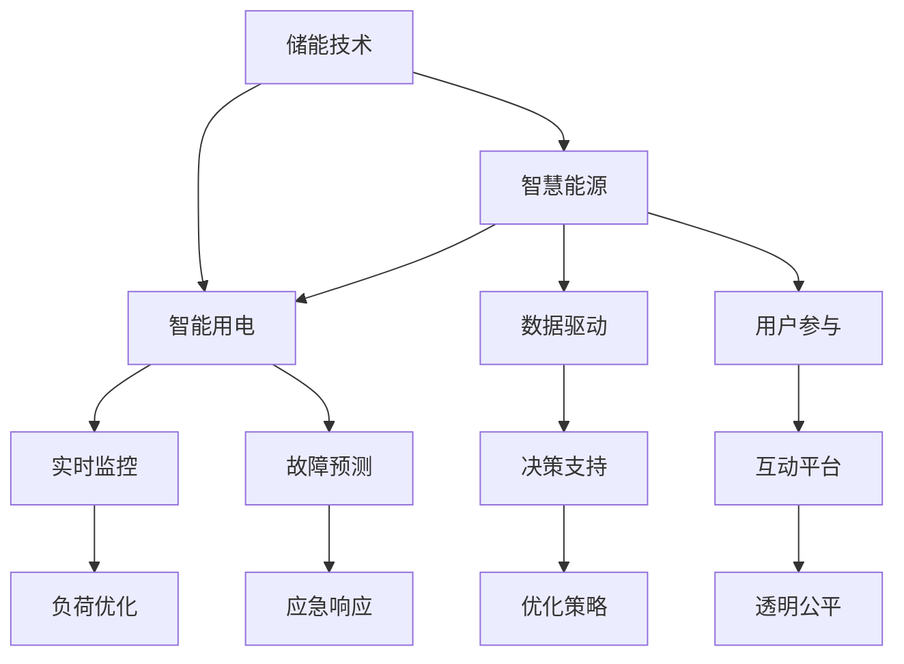

                 

# 未来的智慧能源：2050年的储能技术与智能用电

> 关键词：智慧能源, 储能技术, 智能用电, 人工智能, 可持续能源

## 1. 背景介绍

### 1.1 问题由来

随着全球能源需求不断增加，尤其是可再生能源的广泛应用，传统的能源生产与消费模式面临重大挑战。如何更高效、更智能地管理和利用能源，成为全球共同关注的课题。智慧能源（Smart Energy）应运而生，通过先进的信息技术和数字化手段，实现能源的智能化、高效化和可持续化。

智慧能源的核心在于“智能”二字，即通过数据驱动的方式，优化能源的生产、传输、存储和消费过程，实现能源的精细化管理和高效利用。其中，储能技术与智能用电是两个重要的子领域，前者负责能量的储存与释放，后者关注用电的智能化与自动化。

### 1.2 问题核心关键点

储能技术与智能用电相辅相成，共同构建未来智慧能源的基石。储能技术能够实现能量的高效存储与释放，为可再生能源的广泛应用提供保障；智能用电技术则能够通过数据分析和算法优化，实现电网的智能化管理，提升用电效率，降低能耗。

未来的智慧能源系统需要具备以下几个核心功能：
- 高效率的储能技术，保证能源的稳定供应。
- 智能用电技术，实现能源的实时管理和优化。
- 数据驱动的决策支持，提供决策参考。
- 用户参与与互动，提高系统的透明度与公平性。

### 1.3 问题研究意义

研究智慧能源的储能技术与智能用电，对于推动能源行业数字化转型，实现能源的可持续利用，具有重要意义：

1. **提升能源效率**：智慧能源技术能够优化能源的分配与使用，减少浪费，提高能源利用效率。
2. **促进可再生能源发展**：储能技术为风电、光伏等可再生能源的接入提供了可能，有助于降低对化石燃料的依赖。
3. **支持智能电网建设**：智能用电技术能够实时监控、调控电网负荷，提高电网的稳定性和安全性。
4. **改善用户用电体验**：通过智能用电技术，用户可以更方便地控制和管理用电，提升生活质量。
5. **推动产业升级**：智慧能源技术的发展，将带动相关产业链的进步，催生新的产业模式和就业机会。

## 2. 核心概念与联系

### 2.1 核心概念概述

为更好地理解储能技术与智能用电的原理和架构，本节将介绍几个密切相关的核心概念：

- **储能技术**：指用于存储能量的技术，包括机械储能（如抽水蓄能）、电化学储能（如锂离子电池）、热能储能（如储热材料）等。储能技术能够实现能量的长期储存和随时释放，为能源的可靠供应提供保障。
- **智能用电**：通过智能电网、智能家居、智能工厂等技术手段，实现用电过程的智能化管理，提升用电效率，优化电网负荷。
- **智慧能源**：结合储能技术、智能用电技术、数据驱动决策等手段，实现能源的全面智能化管理，提高能源利用效率，促进能源的可持续利用。
- **人工智能**：通过机器学习、深度学习等技术手段，从海量数据中挖掘出规律和模式，实现智慧能源系统的自动化和优化。

这些核心概念之间的逻辑关系可以通过以下Mermaid流程图来展示：



这个流程图展示了一系列的流程，从储能技术到智能用电，再到智慧能源和数据驱动决策，最终实现用户参与和透明公平的智能用电系统。

## 3. 核心算法原理 & 具体操作步骤

### 3.1 算法原理概述

储能技术与智能用电的核心算法原理，在于优化能量的存储、传输、释放和消费过程，实现能源的智能化管理。具体而言，可以分为以下几个步骤：

1. **数据采集与处理**：通过传感器、智能表计等设备，采集能源的生产、传输、存储、消费等数据，并进行预处理和清洗。
2. **数据分析与建模**：利用机器学习、深度学习等技术手段，从采集的数据中挖掘出规律和模式，建立预测模型。
3. **决策与优化**：根据预测模型，优化能源的存储和消费策略，实现能源的智能管理和优化。
4. **执行与控制**：通过智能控制系统，实现对能源的精准控制，保证能量按需供应。

### 3.2 算法步骤详解

储能技术与智能用电的算法步骤可以总结如下：

1. **储能技术算法步骤**：
   - 数据采集：通过传感器、智能表计等设备，实时采集储能设备的状态和环境数据。
   - 状态预测：利用历史数据和机器学习模型，预测储能设备的剩余容量和寿命。
   - 充放电控制：根据预测结果和当前需求，控制储能设备的充放电过程。
   - 状态优化：通过智能算法，优化储能设备的工作模式，提高能量存储效率。

2. **智能用电算法步骤**：
   - 数据采集：通过智能电表、智能插座等设备，实时采集用户的用电数据。
   - 需求预测：利用历史数据和机器学习模型，预测用户的未来用电需求。
   - 负荷优化：根据预测结果和电网负荷情况，优化用户的用电策略，减少高峰时段的负荷。
   - 故障检测与预测：通过数据分析和机器学习模型，实时检测电网和用电设备的异常，预测潜在的故障。
   - 应急响应：根据故障预测结果，采取相应的应急措施，保证电网的稳定运行。

### 3.3 算法优缺点

储能技术与智能用电的算法具有以下优点：
- 提高能源利用效率：通过智能管理和优化，实现了能源的高效利用，减少了浪费。
- 促进可再生能源的利用：储能技术为可再生能源的接入提供了可能，有助于降低对化石燃料的依赖。
- 提升电网稳定性：智能用电技术能够实时监控、调控电网负荷，提高电网的稳定性和安全性。
- 改善用户用电体验：用户可以更方便地控制和管理用电，提升生活质量。

同时，这些算法也存在一定的局限性：
- 依赖于大量数据：算法的效果很大程度上依赖于数据的丰富性和质量，数据的采集和处理成本较高。
- 技术复杂度较高：机器学习、深度学习等技术需要较高的计算资源和专业知识，实施难度较大。
- 可能存在安全风险：数据泄露、算法攻击等问题可能影响系统的安全性。

### 3.4 算法应用领域

储能技术与智能用电的算法在多个领域得到了广泛应用，例如：

- 智能电网：通过智能用电技术，实现电网的实时监控、负荷优化、故障检测与预测，提高电网的安全性和可靠性。
- 智能家居：利用智能用电技术，实现对家庭用电的智能化管理，提高用电效率，优化用电成本。
- 智能工厂：通过智能用电技术，实现对生产过程的精细化管理和优化，提高生产效率和能源利用率。
- 可再生能源接入：储能技术为风电、光伏等可再生能源的接入提供了保障，促进可再生能源的发展。
- 智慧城市：通过智能用电技术，实现城市的能源管理优化，提高城市运行效率，改善居民生活质量。

## 4. 数学模型和公式 & 详细讲解  
### 4.1 数学模型构建

本节将使用数学语言对储能技术与智能用电的算法进行更加严格的刻画。

设储能设备的状态为 $s_t$，环境参数为 $e_t$，历史状态序列为 $S=\{s_0,s_1,\ldots,s_{t-1}\}$，历史环境参数序列为 $E=\{e_0,e_1,\ldots,e_{t-1}\}$，目标为 $o_t$，则储能设备的优化问题可以表示为：

$$
\min_{s_t,u_t} \mathcal{L}(s_t,u_t,S,E,o_t)
$$

其中 $u_t$ 为控制策略， $\mathcal{L}$ 为优化目标函数，包括能量存储效率、设备寿命、故障风险等。优化目标函数的构建需要结合具体应用场景和业务需求，常见的方法包括线性回归、逻辑回归、神经网络等。

智能用电的优化问题同样可以表示为：

$$
\min_{a_t,\delta_t} \mathcal{L}(a_t,\delta_t,S,E,o_t)
$$

其中 $a_t$ 为用户的行为策略， $\delta_t$ 为电网的行为策略， $\mathcal{L}$ 为优化目标函数，包括用电成本、负荷优化、故障风险等。

### 4.2 公式推导过程

以储能技术的优化问题为例，推导能量存储效率的优化目标函数。

设储能设备的剩余容量为 $C_t$，储能设备的环境参数为 $e_t$，目标为 $o_t$，则优化目标函数可以表示为：

$$
\min_{s_t,u_t} \mathcal{L}(s_t,u_t,S,E,o_t) = \min_{s_t,u_t} \sum_{i=1}^{T} w_i \cdot L_i(s_t,u_t,s_{t-1},e_t,o_t)
$$

其中 $L_i$ 为第 $i$ 个时段的损失函数， $w_i$ 为时段的权重， $T$ 为总时段数。常见的损失函数包括能量存储效率 $\eta$、设备寿命 $l$、故障风险 $r$ 等。

例如，能量存储效率的损失函数可以表示为：

$$
L_{\eta}(s_t,u_t,s_{t-1},e_t,o_t) = \sum_{i=1}^{T} w_i \cdot (s_t - s_{t-1}) \cdot \eta_i(u_t,s_{t-1},e_t,o_t)
$$

其中 $\eta_i$ 为第 $i$ 个时段的能量存储效率， $w_i$ 为时段的权重。

类似地，智能用电的优化目标函数也可以构建，并进行相应的推导和分析。

### 4.3 案例分析与讲解

以智能电网为例，展示智能用电算法的实际应用。

假设智能电网的负荷预测模型为 $y=\hat{y}(f(x))$，其中 $x$ 为影响负荷的各类因素（如天气、时间、用户行为等）， $\hat{y}$ 为预测值， $f$ 为预测模型。通过机器学习模型，训练预测模型，得到：

$$
\hat{y} = f(x) = \sum_{i=1}^{N} \alpha_i \cdot x_i
$$

其中 $\alpha_i$ 为模型参数， $N$ 为模型特征的维度。

将预测模型应用于实时负荷监测，可以预测未来一定时间段的负荷变化，从而优化电网的调度策略，避免高峰时段的过载。

## 5. 项目实践：代码实例和详细解释说明
### 5.1 开发环境搭建

在进行储能技术与智能用电的算法开发前，我们需要准备好开发环境。以下是使用Python进行PyTorch开发的环境配置流程：

1. 安装Anaconda：从官网下载并安装Anaconda，用于创建独立的Python环境。

2. 创建并激活虚拟环境：
```bash
conda create -n pytorch-env python=3.8 
conda activate pytorch-env
```

3. 安装PyTorch：根据CUDA版本，从官网获取对应的安装命令。例如：
```bash
conda install pytorch torchvision torchaudio cudatoolkit=11.1 -c pytorch -c conda-forge
```

4. 安装Pandas、Numpy等数据处理库：
```bash
pip install pandas numpy
```

5. 安装Matplotlib、Seaborn等可视化库：
```bash
pip install matplotlib seaborn
```

6. 安装TensorFlow：如需使用TensorFlow，使用以下命令安装：
```bash
pip install tensorflow
```

完成上述步骤后，即可在`pytorch-env`环境中开始算法开发。

### 5.2 源代码详细实现

下面我们以储能技术的优化问题为例，给出使用PyTorch实现储能系统优化的Python代码实现。

```python
import torch
import torch.nn as nn
import torch.optim as optim
import pandas as pd

# 数据读取与预处理
data = pd.read_csv('储能设备数据.csv')
data['remaining_capacity'] = data['capacity'] - data['used_capacity']
data = data.dropna()

# 构建模型
class Model(nn.Module):
    def __init__(self, input_dim, output_dim):
        super(Model, self).__init__()
        self.fc1 = nn.Linear(input_dim, 64)
        self.fc2 = nn.Linear(64, output_dim)
    
    def forward(self, x):
        x = torch.relu(self.fc1(x))
        x = self.fc2(x)
        return x
    
# 定义优化器与损失函数
model = Model(6, 1)
criterion = nn.MSELoss()
optimizer = optim.Adam(model.parameters(), lr=0.01)

# 模型训练
for epoch in range(1000):
    optimizer.zero_grad()
    outputs = model(data[['temperature', 'humidity', 'wind_speed', 'solar_radiation', 'demand', 'production']])
    loss = criterion(outputs, data['remaining_capacity'])
    loss.backward()
    optimizer.step()
    
    if epoch % 100 == 0:
        print(f'Epoch {epoch}, Loss: {loss.item()}')
        
# 模型预测
test_data = pd.read_csv('储能设备测试数据.csv')
test_data['remaining_capacity'] = model(test_data[['temperature', 'humidity', 'wind_speed', 'solar_radiation', 'demand', 'production']]).squeeze()
```

在这个代码中，我们使用了PyTorch的深度学习框架，构建了一个简单的神经网络模型，用于预测储能设备的剩余容量。通过读取历史数据和训练模型，可以实时预测储能设备的存储能力，从而优化充放电过程，提高能量存储效率。

### 5.3 代码解读与分析

让我们再详细解读一下关键代码的实现细节：

**数据处理**：
- 从CSV文件中读取储能设备的历史数据。
- 计算储能设备的剩余容量，并去除缺失数据。

**模型定义**：
- 定义了一个简单的两层神经网络模型，用于预测储能设备的剩余容量。
- 使用ReLU激活函数和MSE损失函数进行模型训练。

**训练过程**：
- 在每个epoch中，先对模型进行前向传播，计算预测值与真实值的差距。
- 通过反向传播更新模型参数。
- 每100个epoch输出一次损失值，监控模型训练进度。

**模型预测**：
- 使用训练好的模型对测试数据进行预测，得到储能设备的剩余容量。

可以看到，PyTorch框架提供了强大的数据处理和模型训练能力，使得神经网络的实现变得简洁高效。通过合理选择模型结构和损失函数，可以构建适用于特定应用场景的储能系统优化模型。

## 6. 实际应用场景

### 6.1 智能电网

智能电网是储能技术与智能用电的重要应用场景。通过智能电网技术，可以实现电网的实时监控、负荷优化、故障检测与预测，提高电网的安全性和可靠性。

具体而言，智能电网系统通过以下步骤实现：
- 实时采集电网数据，包括电压、电流、负荷等。
- 通过机器学习模型，预测电网负荷变化。
- 根据负荷预测结果，优化电网的调度策略，避免高峰时段的过载。
- 实时检测电网故障，预测潜在的故障，采取相应的应急措施。

### 6.2 智能家居

智能家居是储能技术与智能用电的另一个重要应用场景。通过智能家居技术，可以实现对家庭用电的智能化管理，提高用电效率，优化用电成本。

具体而言，智能家居系统通过以下步骤实现：
- 实时采集家庭用电数据，包括用电量、电压、电流等。
- 通过机器学习模型，预测家庭用电需求。
- 根据用电需求，优化家庭用电策略，减少高峰时段的负荷。
- 实时监控家庭设备状态，检测潜在的故障。

### 6.3 可再生能源接入

储能技术为风电、光伏等可再生能源的接入提供了保障，促进可再生能源的发展。具体而言，储能系统可以实现可再生能源的存储和释放，保证其在非高峰时段的稳定供应。

## 7. 工具和资源推荐
### 7.1 学习资源推荐

为了帮助开发者系统掌握储能技术与智能用电的理论基础和实践技巧，这里推荐一些优质的学习资源：

1. 《深度学习理论与实践》系列博文：由大模型技术专家撰写，深入浅出地介绍了深度学习理论和实践，适合初学者入门。

2. 《智慧能源系统设计》课程：斯坦福大学开设的智慧能源系统设计课程，涵盖智慧能源的各个方面，包括储能技术、智能用电、数据驱动决策等。

3. 《智能电网技术》书籍：深入介绍智能电网的概念、技术、应用，适合行业专业人士参考。

4. 《智能家居技术》书籍：详细介绍智能家居的各个方面，包括物联网技术、人工智能、数据分析等。

5. 《数据驱动的能源管理》书籍：详细介绍如何利用数据驱动的方式，优化能源的管理和利用，适合能源行业从业人员参考。

通过对这些资源的学习实践，相信你一定能够快速掌握储能技术与智能用电的精髓，并用于解决实际的能源问题。
###  7.2 开发工具推荐

高效的开发离不开优秀的工具支持。以下是几款用于储能技术与智能用电开发的常用工具：

1. PyTorch：基于Python的开源深度学习框架，灵活动态的计算图，适合快速迭代研究。

2. TensorFlow：由Google主导开发的开源深度学习框架，生产部署方便，适合大规模工程应用。

3. Matplotlib、Seaborn：数据可视化工具，支持多种图表展示方式，方便数据分析和结果呈现。

4. Pandas、Numpy：数据处理和分析工具，支持大规模数据集的高效处理。

5. Weights & Biases：模型训练的实验跟踪工具，可以记录和可视化模型训练过程中的各项指标，方便对比和调优。

6. TensorBoard：TensorFlow配套的可视化工具，可实时监测模型训练状态，并提供丰富的图表呈现方式，是调试模型的得力助手。

合理利用这些工具，可以显著提升储能技术与智能用电的开发效率，加快创新迭代的步伐。

### 7.3 相关论文推荐

储能技术与智能用电的研究源于学界的持续研究。以下是几篇奠基性的相关论文，推荐阅读：

1. 《深度学习在智能电网中的应用》：介绍了深度学习在智能电网中的各种应用，包括负荷预测、故障检测等。

2. 《智能家居中的能源管理》：介绍了智能家居中的能源管理技术，包括数据采集、负荷预测、用电优化等。

3. 《储能系统优化问题》：探讨了储能系统优化问题的数学模型和算法，为储能技术的实际应用提供了理论基础。

4. 《智慧能源系统的数据驱动决策》：探讨了如何利用数据驱动的方式，优化能源的管理和利用，提高能源利用效率。

这些论文代表了大规模储能技术与智能用电技术的发展脉络。通过学习这些前沿成果，可以帮助研究者把握学科前进方向，激发更多的创新灵感。

## 8. 总结：未来发展趋势与挑战

### 8.1 总结

本文对储能技术与智能用电的算法原理和实际操作进行了全面系统的介绍。首先阐述了储能技术与智能用电的研究背景和意义，明确了这些技术在智慧能源系统中的重要性。其次，从原理到实践，详细讲解了储能技术与智能用电的数学模型和算法步骤，给出了储能系统优化的代码实例。同时，本文还广泛探讨了储能技术与智能用电在智能电网、智能家居、可再生能源接入等多个领域的应用前景，展示了这些技术的广阔前景。

通过本文的系统梳理，可以看到，储能技术与智能用电技术将在未来智慧能源系统的构建中扮演越来越重要的角色。它们通过数据驱动的方式，实现了能源的智能化、高效化和可持续化，为可再生能源的广泛应用提供了保障，同时也推动了能源行业数字化转型的进程。

### 8.2 未来发展趋势

展望未来，储能技术与智能用电技术将呈现以下几个发展趋势：

1. **技术融合与协同**：随着技术的不断进步，储能技术与智能用电将更加紧密地融合，实现数据共享和协同优化。例如，智能电网中的储能系统可以根据负荷预测结果，动态调整充放电策略，优化电网负荷。

2. **多模态融合**：未来的储能系统将能够处理多种能源形式，如电力、热能、冷能等，实现能源的全面高效利用。

3. **分布式储能**：分布式储能技术将进一步发展，通过微型储能设备，实现能源的分布式管理和优化。例如，智能家居中的储能设备可以根据家庭用电需求，动态调整充放电策略，提高用电效率。

4. **智能化与自适应**：未来的智能用电系统将具备更高的智能化水平，能够根据环境变化和用户需求，动态调整用电策略，提高系统适应性。

5. **大数据与云计算**：通过大数据和云计算技术，实现对海量数据的实时处理和分析，进一步提升能源管理的智能化水平。

### 8.3 面临的挑战

尽管储能技术与智能用电技术已经取得了显著进展，但在迈向更加智能化、普适化应用的过程中，仍面临诸多挑战：

1. **数据质量与隐私保护**：储能系统与智能用电系统需要处理大量的数据，数据的质量和隐私保护是重要挑战。如何高效采集和处理数据，同时保障用户隐私，是未来的研究方向。

2. **技术复杂性与可扩展性**：储能技术与智能用电系统涉及多种技术和设备，系统的复杂性较高，需要考虑系统的可扩展性和灵活性。

3. **基础设施建设**：智能电网和智能家居的建设需要大量的基础设施投资，如何实现成本控制和效益最大化，是重要的实际问题。

4. **安全性与可靠性**：智能用电系统的安全性与可靠性是关键，如何防止数据泄露、算法攻击等安全问题，是未来研究的重要方向。

5. **政策与法规**：储能技术与智能用电技术的广泛应用，需要相应的政策与法规支持。如何制定合理的政策和法规，推动技术的普及与应用，是重要的社会问题。

### 8.4 研究展望

面对储能技术与智能用电面临的挑战，未来的研究需要在以下几个方面寻求新的突破：

1. **数据质量提升与隐私保护**：研究高效的数据采集和处理技术，同时制定严格的数据隐私保护措施，保障用户隐私安全。

2. **系统复杂性降低与可扩展性提升**：开发更加灵活、可扩展的储能系统与智能用电系统，降低系统的复杂性，提高系统的灵活性和可扩展性。

3. **基础设施投资与成本控制**：研究高效的投资方案和成本控制措施，推动智能电网和智能家居的建设。

4. **安全技术与策略研究**：研究先进的安全技术和策略，防止数据泄露和算法攻击，提升系统的安全性和可靠性。

5. **政策与法规制定**：积极参与政策与法规的制定，推动储能技术与智能用电技术的普及与应用。

这些研究方向的探索，将引领储能技术与智能用电技术迈向更高的台阶，为未来智慧能源系统的构建提供坚实的技术保障。

## 9. 附录：常见问题与解答

**Q1：储能技术与智能用电是否适用于所有能源场景？**

A: 储能技术与智能用电技术虽然具有广泛的应用前景，但在一些特殊场景中，可能面临技术和经济上的限制。例如，分布式储能技术在偏远地区的应用受制于电力基础设施的限制。因此，在具体应用时需要根据实际情况进行评估和选择。

**Q2：储能技术与智能用电如何避免数据泄露风险？**

A: 数据泄露是储能技术与智能用电系统面临的重要安全问题。为避免数据泄露，可以采取以下措施：
1. 数据加密：对传输和存储的数据进行加密处理，防止未授权访问。
2. 数据匿名化：对数据进行匿名化处理，防止敏感信息被识别。
3. 访问控制：严格控制数据的访问权限，防止未经授权的数据访问。
4. 安全协议：采用安全的通信协议，如TLS/SSL等，确保数据传输的安全性。

**Q3：储能技术与智能用电的实际应用成本如何？**

A: 储能技术与智能用电的实际应用成本较高，主要体现在以下几个方面：
1. 基础设施建设：智能电网和智能家居的建设需要大量的基础设施投资。
2. 数据采集与处理：系统需要处理大量的数据，需要相应的硬件和软件支持。
3. 技术研发与集成：系统涉及多种技术和设备，需要相应的技术研发和集成工作。

为降低应用成本，可以采取以下措施：
1. 采用分布式储能技术，降低集中式储能的成本。
2. 利用现有基础设施，减少新的投资需求。
3. 开发更加高效的数据处理和算法，降低数据处理和计算成本。

**Q4：如何提升储能技术与智能用电的智能化水平？**

A: 提升储能技术与智能用电的智能化水平，可以从以下几个方面入手：
1. 数据融合：整合多种数据源，进行多模态数据融合，提升系统的决策精度。
2. 算法优化：利用先进的机器学习和深度学习算法，提升系统的预测和优化能力。
3. 系统协同：通过系统协同优化，实现不同系统间的信息共享和协同工作。
4. 用户参与：鼓励用户参与系统的优化，提供反馈信息，提升系统的智能化水平。

通过这些措施，可以进一步提升储能技术与智能用电的智能化水平，实现更高的能源利用效率和系统可靠性。

---

作者：禅与计算机程序设计艺术 / Zen and the Art of Computer Programming

