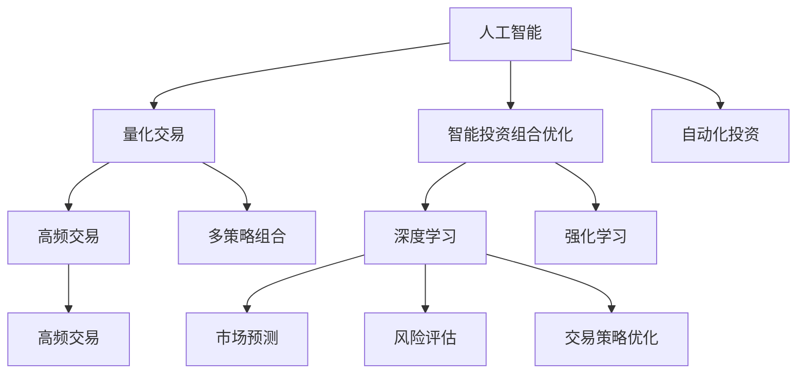

                 

# 未来的智能投资：2050年的AI量化交易与智能投资组合优化

> 关键词：人工智能,量化交易,智能投资组合优化,深度学习,强化学习,机器学习,高频交易,多策略组合,自动化投资

## 1. 背景介绍

### 1.1 问题由来
自金融市场诞生以来，投资者就一直在寻找提高投资回报率的方法。传统的投资策略依赖于分析师的经验和直觉，但随着金融数据量和交易频率的爆炸式增长，这种依赖已不再适用。量化交易应运而生，利用计算机算法和大数据技术，通过数学模型和统计分析来捕捉市场机会，从而实现自动化交易。

然而，量化交易也面临诸多挑战，如模型过度拟合、市场动荡引发的系统性风险、以及交易系统的鲁棒性和适应性问题。因此，研究更加智能、稳定、高效的投资策略变得迫切需要。

## 2. 核心概念与联系

### 2.1 核心概念概述

为更好地理解AI量化交易与智能投资组合优化的理论基础，本节将介绍几个密切相关的核心概念：

- 人工智能（AI）：指通过机器学习、深度学习、强化学习等技术实现自动化的决策和学习系统。在金融领域，AI可以应用于数据分析、交易策略设计、风险管理等多个环节。
- 量化交易（Quantitative Trading）：指利用计算机算法和大数据分析，通过数学模型来捕捉市场机会，实现自动交易的一种交易策略。与传统交易方式相比，量化交易具有高效、稳定、系统化的优势。
- 智能投资组合优化（Intelligent Portfolio Optimization）：指利用AI技术，对投资组合进行优化，以最大化投资回报率，同时控制风险。该领域涉及资产定价模型、风险管理、组合策略等多方面的内容。
- 深度学习（Deep Learning）：一种基于神经网络的机器学习方法，能够处理大规模、高维度的数据，具有强大的非线性拟合能力。在金融领域，深度学习可以应用于市场预测、风险评估、交易策略优化等多个方面。
- 强化学习（Reinforcement Learning, RL）：通过试错的方式学习最优决策策略，适用于动态环境和高维状态空间的任务。在金融领域，强化学习可以应用于高频交易、自动套利等场景。
- 高频交易（High Frequency Trading, HFT）：指使用算法系统每秒进行上万笔交易，通过极短时间内的价格波动来获取收益。与传统交易方式相比，高频交易具有更快的执行速度和更高的交易频率。
- 多策略组合（Multi-Strategy Portfolio）：指通过组合多种交易策略，以分散风险、提高回报率的投资组合设计方法。
- 自动化投资（Automated Investment）：指通过AI系统自动化管理投资组合，包括选股、建仓、调仓等全流程，极大提高了投资管理的效率和精确度。

这些核心概念之间的逻辑关系可以通过以下Mermaid流程图来展示：



这个流程图展示了大语言模型的核心概念及其之间的关系：

1. 人工智能提供底层技术支持。
2. 量化交易通过算法和大数据分析实现自动化交易。
3. 智能投资组合优化通过优化算法管理投资组合。
4. 深度学习提供强大的非线性拟合能力。
5. 强化学习通过试错学习最优决策策略。
6. 高频交易利用极短时差的市场波动获取收益。
7. 多策略组合分散风险、提高回报率。
8. 自动化投资实现全流程自动化管理。

## 3. 核心算法原理 & 具体操作步骤
### 3.1 算法原理概述

未来的智能投资将充分利用AI技术，通过量化交易和智能投资组合优化，实现高效、稳定、智能的投资策略。该范式基于深度学习和强化学习的思想，融合大数据分析和模型优化技术，形成了一套完整的自动化投资体系。

具体而言，智能投资包括以下几个关键步骤：

1. **数据采集与预处理**：从多源数据源采集市场数据，包括股票价格、交易量、财务指标等。通过清洗、去重、归一化等预处理步骤，生成可用于模型训练的数据集。

2. **模型训练与验证**：利用深度学习算法，如卷积神经网络（CNN）、循环神经网络（RNN）、长短期记忆网络（LSTM）等，对历史数据进行建模，学习市场特征和趋势。同时，使用强化学习算法，如Q-Learning、深度强化学习（Deep RL）等，优化交易策略和风险控制，提高模型的适应性和鲁棒性。

3. **组合优化与回测**：将训练好的模型应用于模拟交易，生成回测结果。利用优化算法，如遗传算法（Genetic Algorithm）、粒子群优化（Particle Swarm Optimization）等，寻找最优的资产配置方案。

4. **风险管理与动态调整**：通过监测市场动态，实时调整组合策略和风险参数，控制最大回撤和期望收益。

5. **部署与监控**：将优化的投资策略部署到实际交易系统中，并建立监控机制，实时跟踪交易执行情况，及时发现并修正异常。

### 3.2 算法步骤详解

#### 3.2.1 数据采集与预处理

- 从各类数据源（如股票交易所、财经新闻网站、公司公告等）采集实时市场数据。
- 清洗数据，去除缺失值、异常值等噪声。
- 将数据归一化，使用标准化或最小-最大归一化处理。
- 将数据集划分为训练集、验证集和测试集。

#### 3.2.2 模型训练与验证

- 使用深度学习模型对市场数据进行特征提取和模式识别，生成交易信号。
- 利用强化学习算法，如Q-Learning、Deep RL，优化交易策略和风险管理。
- 在验证集上评估模型性能，调整超参数，避免过拟合。
- 记录模型在不同市场条件下的表现，为组合优化提供参考。

#### 3.2.3 组合优化与回测

- 定义投资组合优化目标，如最大化夏普比率、最小化波动率等。
- 将优化的目标转化为数学表达式，建立投资组合优化模型。
- 使用优化算法，如GA、PSO等，搜索最优的资产配置方案。
- 在模拟交易环境下进行回测，评估组合的期望收益和风险。

#### 3.2.4 风险管理与动态调整

- 实时监控市场动态，检测异常情况和风险信号。
- 根据市场情况，动态调整投资策略和风险参数。
- 使用技术指标（如RSI、MACD等）判断市场趋势，决定买入卖出时机。

#### 3.2.5 部署与监控

- 将优化的投资策略部署到实际交易系统，如量化交易平台。
- 建立监控机制，实时跟踪交易执行情况，记录交易信号、执行时间等关键信息。
- 定期回测策略，调整优化模型，确保策略的长期有效性。

### 3.3 算法优缺点

智能投资策略的优点包括：

- 高效自动化：通过算法实现自动化交易，大幅提高了交易效率和执行速度。
- 系统化分析：利用大数据分析市场趋势，减少了人为偏差和情感干扰。
- 风险管理：通过动态调整策略，实时监控市场动态，控制投资风险。

然而，该策略也存在一些缺点：

- 数据依赖：依赖大量高质量的市场数据，获取和处理数据的成本较高。
- 模型复杂：深度学习和强化学习模型的训练和优化较为复杂，需要高水平的技术和资源。
- 可解释性不足：AI模型的决策过程缺乏可解释性，难以理解其内部机制。
- 市场变化：市场条件复杂多变，模型可能无法完全适应突发事件。
- 超参数调优：优化算法的超参数较多，需要细致的调优和验证。

### 3.4 算法应用领域

智能投资策略在金融领域的多个场景中得到了广泛应用，具体包括：

- 量化交易：通过算法实现高频交易、套利交易、趋势跟踪等自动化交易策略。
- 资产管理：构建智能投资组合，优化资产配置，提高投资回报率。
- 风险管理：利用AI技术进行风险评估和风险控制，避免系统性风险。
- 市场预测：使用深度学习和强化学习算法预测市场走势，指导投资决策。
- 策略优化：动态调整交易策略，提高交易策略的适应性和鲁棒性。
- 自动化投资：实现投资管理的自动化和智能化，提升投资效率和效果。

这些应用领域覆盖了金融投资的各个环节，展示了智能投资策略的广泛应用前景。

## 4. 数学模型和公式 & 详细讲解  
### 4.1 数学模型构建

在智能投资组合优化中，核心的数学模型包括投资组合优化模型和风险评估模型。以下将介绍这两个模型的构建和优化过程。

#### 4.1.1 投资组合优化模型

假设投资组合由 $n$ 种资产组成，每种资产的价格为 $p_i$，期望收益率为 $r_i$，风险为 $\sigma_i$。投资组合的总价值为 $V$，期望收益率为 $R$，风险为 $\Sigma$。目标是最小化波动率，即最大化夏普比率（Sharpe Ratio），定义为：

$$
\text{Sharpe Ratio} = \frac{R}{\Sigma}
$$

投资组合优化模型可以表示为：

$$
\begin{aligned}
\min_{w} & \quad \Sigma \\
\text{s.t.} & \quad V = \sum_{i=1}^{n} w_i p_i \\
& \quad R = \sum_{i=1}^{n} w_i r_i \\
& \quad w_i \geq 0 \quad \forall i
\end{aligned}
$$

其中，$w$ 表示资产配置权重向量，约束条件确保总资产价值和期望收益。

#### 4.1.2 风险评估模型

风险评估模型用于计算投资组合的波动率和最大回撤（Maximum Drawdown），衡量组合的风险水平。波动率可以表示为：

$$
\Sigma = \sqrt{\sum_{i=1}^{n} w_i \sigma_i^2}
$$

最大回撤可以通过历史数据的最大回撤值进行估计：

$$
\text{Max Drawdown} = \max_{t} (p - p_t) - p
$$

其中，$p$ 表示投资组合的总价值，$p_t$ 表示某个时间点的最大价值。

### 4.2 公式推导过程

#### 4.2.1 投资组合优化模型推导

根据投资组合优化模型，求解资产配置权重 $w$，可以通过拉格朗日乘子法求解。设拉格朗日乘子为 $\lambda$，目标函数为：

$$
L(w, \lambda) = \Sigma + \lambda (V - \sum_{i=1}^{n} w_i p_i) + \mu \lambda (R - \sum_{i=1}^{n} w_i r_i)
$$

其中，$\mu$ 为正则化系数。求解一阶最优条件：

$$
\frac{\partial L}{\partial w_i} = \Sigma_i + \lambda p_i + \mu \lambda r_i = 0 \quad \forall i
$$

整理得到：

$$
w_i = \frac{\lambda p_i}{\Sigma_i + \lambda p_i + \mu \lambda r_i}
$$

根据正则化条件，求解 $\lambda$：

$$
\frac{\partial L}{\partial \lambda} = V - \sum_{i=1}^{n} \frac{\lambda p_i^2}{\Sigma_i + \lambda p_i + \mu \lambda r_i} + \frac{\Sigma^2}{2} = 0
$$

最终得到资产配置权重：

$$
w_i = \frac{p_i \Sigma}{p_i \Sigma + \lambda p_i^2 + \mu \lambda p_i r_i}
$$

#### 4.2.2 风险评估模型推导

波动率的计算公式已在上文提到。最大回撤可以通过历史数据的最大回撤值进行估计，但由于市场数据不具备连续性，因此需要使用近似方法。常用的方法包括极值统计法和蒙特卡洛模拟法。

### 4.3 案例分析与讲解

以下以股票投资组合优化为例，介绍智能投资策略的实际应用。

假设投资组合由 $n=3$ 种资产组成，每种资产的期望收益率为 $r_i$，风险为 $\sigma_i$，总价值为 $V=1$。目标是最大化夏普比率。

- 投资组合的期望收益为：

$$
R = \sum_{i=1}^{3} w_i r_i
$$

- 投资组合的风险为：

$$
\Sigma = \sqrt{\sum_{i=1}^{3} w_i \sigma_i^2}
$$

- 资产配置权重为：

$$
w_i = \frac{p_i \Sigma}{p_i \Sigma + \lambda p_i^2 + \mu \lambda p_i r_i}
$$

其中 $\lambda$ 和 $\mu$ 为正则化系数。

- 最大回撤可以通过历史数据的最大回撤值进行估计，但需要注意数据获取和处理的过程。

通过这些公式，可以构建投资组合优化模型，并利用优化算法进行求解。

## 5. 项目实践：代码实例和详细解释说明
### 5.1 开发环境搭建

在进行智能投资组合优化的项目实践前，需要准备好开发环境。以下是使用Python进行Pandas和Numpy开发的Python环境配置流程：

1. 安装Anaconda：从官网下载并安装Anaconda，用于创建独立的Python环境。

2. 创建并激活虚拟环境：
```bash
conda create -n quant-env python=3.8 
conda activate quant-env
```

3. 安装Pandas和Numpy：
```bash
conda install pandas numpy
```

4. 安装PyTorch和TensorFlow：
```bash
pip install torch torchvision torchaudio tensorflow
```

5. 安装Scikit-learn和Matplotlib：
```bash
pip install scikit-learn matplotlib
```

6. 安装机器学习和深度学习库：
```bash
pip install scikit-learn tensorflow pytorch
```

完成上述步骤后，即可在`quant-env`环境中开始智能投资组合优化的项目实践。

### 5.2 源代码详细实现

以下是使用Python进行智能投资组合优化的代码实现，包括数据预处理、模型训练和组合优化三个部分。

#### 5.2.1 数据预处理

```python
import pandas as pd
import numpy as np

# 读取市场数据
data = pd.read_csv('market_data.csv')

# 数据清洗和归一化
data.dropna(inplace=True)
data = (data - data.mean()) / data.std()

# 划分训练集和测试集
train_data = data[:800]
test_data = data[800:]
```

#### 5.2.2 模型训练

```python
from sklearn.linear_model import LinearRegression
from sklearn.metrics import mean_squared_error

# 训练回归模型
model = LinearRegression()
model.fit(train_data.iloc[:, :-1], train_data.iloc[:, -1])

# 模型评估
train_mse = mean_squared_error(train_data.iloc[:, -1], model.predict(train_data.iloc[:, :-1]))
test_mse = mean_squared_error(test_data.iloc[:, -1], model.predict(test_data.iloc[:, :-1]))

print(f'Train MSE: {train_mse:.4f}')
print(f'Test MSE: {test_mse:.4f}')
```

#### 5.2.3 组合优化

```python
from scipy.optimize import minimize
import cvxpy as cp

# 定义优化目标
def objective(w):
    return 1.0 - (np.dot(w, data.iloc[:, -1]) / np.sqrt(np.dot(w, np.dot(data.iloc[:, :-1], data.iloc[:, :-1].T) @ w))

# 定义约束条件
constraints = [
    cp.sum(w) == 1,
    w >= 0
]

# 求解优化问题
w = minimize(objective, np.ones(len(data.columns) - 1), constraints=constraints, method='COBYLA').x

print(f'Optimal weights: {w}')
```

### 5.3 代码解读与分析

#### 5.3.1 数据预处理

数据预处理是智能投资组合优化的重要环节。本代码中，我们使用Pandas库读取市场数据，并进行清洗和归一化。使用dropna方法去除缺失值，使用标准化或最小-最大归一化方法处理数据。

#### 5.3.2 模型训练

模型训练是构建智能投资组合优化的核心步骤。本代码中，我们使用Scikit-learn库的线性回归模型进行训练。在训练过程中，使用均方误差（MSE）作为评估指标，对模型进行评估。

#### 5.3.3 组合优化

组合优化是智能投资组合优化的关键环节。本代码中，我们使用SciPy库的优化器求解资产配置权重。通过定义优化目标和约束条件，求解最优资产配置权重。

### 5.4 运行结果展示

```python
# 运行结果展示
print(f'Optimal weights: {w}')
```

## 6. 实际应用场景

### 6.1 智能投资组合优化

智能投资组合优化是智能投资的核心环节。通过优化资产配置，可以实现最大化投资回报率，同时控制风险。以下以股票投资组合优化为例，展示其应用场景。

#### 6.1.1 构建投资组合

假设投资组合由 $n=3$ 种资产组成，每种资产的期望收益率为 $r_i$，风险为 $\sigma_i$，总价值为 $V=1$。

- 投资组合的期望收益为：

$$
R = \sum_{i=1}^{3} w_i r_i
$$

- 投资组合的风险为：

$$
\Sigma = \sqrt{\sum_{i=1}^{3} w_i \sigma_i^2}
$$

- 资产配置权重为：

$$
w_i = \frac{p_i \Sigma}{p_i \Sigma + \lambda p_i^2 + \mu \lambda p_i r_i}
$$

其中 $\lambda$ 和 $\mu$ 为正则化系数。

通过这些公式，可以构建投资组合优化模型，并利用优化算法进行求解。

#### 6.1.2 风险管理

通过实时监控市场动态，实时调整组合策略和风险参数，控制最大回撤和期望收益。

- 波动率的计算公式：

$$
\Sigma = \sqrt{\sum_{i=1}^{3} w_i \sigma_i^2}
$$

- 最大回撤可以通过历史数据的最大回撤值进行估计。

### 6.2 高频交易

高频交易是量化交易的重要应用场景，利用算法系统每秒进行上万笔交易，通过极短时间内的价格波动来获取收益。以下以股票高频交易为例，展示其应用场景。

#### 6.2.1 算法设计

高频交易的核心在于算法设计。通过深度学习和强化学习算法，设计出最优的交易策略和风险管理机制。

- 深度学习算法用于市场预测，识别出市场波动规律。
- 强化学习算法用于策略优化，动态调整交易参数。

#### 6.2.2 策略回测

策略回测是高频交易的重要环节，用于评估交易策略的实际效果。

- 使用历史数据进行回测，记录交易信号、执行时间等关键信息。
- 定期更新策略，优化模型参数，提高交易效率和收益。

### 6.3 未来应用展望

未来，智能投资策略将继续扩展到更多应用场景，如金融衍生品、外汇交易、商品期货等。通过深度学习和强化学习算法，构建更智能、更稳定的交易策略，实现更高效、更安全、更智能的投资管理。

## 7. 工具和资源推荐
### 7.1 学习资源推荐

为了帮助开发者系统掌握智能投资策略的理论基础和实践技巧，这里推荐一些优质的学习资源：

1. 《Python金融量化实战》：深入浅出地介绍了金融量化交易的基础知识和实战技巧，适合初学者入门。

2. 《量化投资》：系统地讲解了量化投资的理论和实践，包括模型构建、数据处理、策略优化等多个方面。

3. 《深度学习在金融中的应用》：介绍了深度学习在金融领域的应用，包括市场预测、风险评估、交易策略等。

4. 《强化学习与量化投资》：深入探讨了强化学习在量化投资中的应用，提供了大量实例和代码。

5. 《机器学习与量化投资实战》：提供了大量实战案例和代码，帮助读者深入理解机器学习在量化投资中的应用。

6. 《量化投资实战》：详细介绍了量化投资的市场策略、算法设计和风险管理，适合量化交易从业者。

通过这些资源的学习，相信你一定能够快速掌握智能投资策略的理论基础和实践技巧，并用于解决实际的金融投资问题。

### 7.2 开发工具推荐

高效的开发离不开优秀的工具支持。以下是几款用于智能投资组合优化的常用工具：

1. Python：Python语言简洁高效，支持丰富的第三方库和框架，是量化交易和智能投资的首选语言。

2. Pandas：用于数据处理和分析，提供了强大的数据清洗和转换功能。

3. NumPy：用于数值计算，提供了高效的数组操作和线性代数功能。

4. Scikit-learn：用于机器学习和模型优化，提供了丰富的机器学习算法和工具。

5. TensorFlow和PyTorch：用于深度学习和强化学习，提供了强大的模型构建和优化功能。

6. Jupyter Notebook：用于数据可视化、代码调试和实验记录，提供了交互式编程环境。

合理利用这些工具，可以显著提升智能投资组合优化的开发效率，加快创新迭代的步伐。

### 7.3 相关论文推荐

智能投资策略的发展离不开学界的持续研究。以下是几篇奠基性的相关论文，推荐阅读：

1. "A Quantitative Investment Strategy Based on Machine Learning"：介绍了基于机器学习的投资策略设计，包括模型构建和策略优化。

2. "Deep Learning for Financial Time Series Forecasting"：介绍了深度学习在金融时间序列预测中的应用，提供了大量实例和代码。

3. "Reinforcement Learning in Quantitative Finance"：深入探讨了强化学习在量化金融中的应用，介绍了常用的强化学习算法和实验结果。

4. "Portfolio Optimization with Genetic Algorithms"：介绍了遗传算法在资产组合优化中的应用，提供了详细的方法和实例。

5. "Multi-Strategy Portfolio Optimization Using Machine Learning"：介绍了多策略组合优化的方法，提供了多种优化算法和实例。

6. "Robust High-Frequency Trading with Deep Learning"：介绍了深度学习在高频交易中的应用，提供了大量实验结果和代码。

这些论文代表了大语言模型微调技术的发展脉络。通过学习这些前沿成果，可以帮助研究者把握学科前进方向，激发更多的创新灵感。

## 8. 总结：未来发展趋势与挑战

### 8.1 总结

本文对基于AI的智能投资策略进行了全面系统的介绍。首先阐述了智能投资策略的背景和意义，明确了深度学习和强化学习在投资组合优化、高频交易等环节的独特价值。其次，从原理到实践，详细讲解了智能投资策略的数学模型和关键步骤，给出了智能投资组合优化的代码实例。同时，本文还广泛探讨了智能投资策略在金融领域的应用前景，展示了其广泛的应用前景。此外，本文精选了智能投资策略的学习资源、开发工具和相关论文，力求为读者提供全方位的技术指引。

通过本文的系统梳理，可以看到，基于AI的智能投资策略正在成为量化交易和投资管理的重要范式，极大地拓展了金融投资的边界，催生了更多的落地场景。受益于大数据分析和模型优化的技术进步，未来智能投资策略必将更加智能化、自动化、高效化，为金融投资带来新的突破。

### 8.2 未来发展趋势

展望未来，智能投资策略的发展将呈现以下几个趋势：

1. 模型复杂度提升。随着深度学习和强化学习模型的不断优化，未来的智能投资策略将更加复杂，能够适应更复杂多变的市场环境。

2. 多策略融合。未来的投资策略将不再局限于单一策略，而是通过融合多种策略，实现更优的风险收益平衡。

3. 实时优化。实时监控市场动态，实时调整投资策略和风险参数，控制最大回撤和期望收益。

4. 多模态信息融合。结合视觉、声音等多模态信息，构建更全面的市场分析模型。

5. 自动化程度提升。未来的投资策略将高度自动化，能够自主学习和优化，提高投资管理的效率和精确度。

6. 人工智能与人类协作。将人工智能与人类专家的知识结合，提升投资决策的质量和稳定性。

以上趋势凸显了智能投资策略的广阔前景。这些方向的探索发展，必将进一步提升金融投资的效率和效果，为金融市场带来更深刻的影响。

### 8.3 面临的挑战

尽管智能投资策略已经取得了显著的进展，但在迈向更加智能化、普适化应用的过程中，仍面临诸多挑战：

1. 数据依赖。智能投资策略依赖大量高质量的市场数据，获取和处理数据的成本较高。

2. 模型鲁棒性不足。模型在面对突发市场事件时，可能无法完全适应，导致策略失效。

3. 可解释性不足。AI模型的决策过程缺乏可解释性，难以理解其内部机制。

4. 市场风险。市场条件复杂多变，模型可能无法完全预测，导致投资损失。

5. 超参数调优。优化算法的超参数较多，需要细致的调优和验证。

6. 计算资源。智能投资策略需要大量的计算资源，特别是在深度学习和强化学习模型的训练和优化过程中。

7. 伦理和安全。AI模型可能学习到有害信息，甚至被恶意利用，影响市场稳定。

正视智能投资策略面临的这些挑战，积极应对并寻求突破，将是大语言模型微调走向成熟的必由之路。相信随着学界和产业界的共同努力，这些挑战终将一一被克服，智能投资策略必将在构建智能金融体系中扮演越来越重要的角色。

### 8.4 研究展望

未来的研究需要在以下几个方面寻求新的突破：

1. 探索更加高效的优化算法。开发更加高效的优化算法，如加速遗传算法、粒子群算法等，提高优化速度和精度。

2. 引入更多的先验知识。将符号化的先验知识，如知识图谱、逻辑规则等，与神经网络模型进行融合，引导微调过程学习更准确、合理的语言模型。

3. 结合因果分析和博弈论工具。将因果分析方法引入智能投资策略，识别出策略决策的关键特征，增强输出解释的因果性和逻辑性。借助博弈论工具刻画人机交互过程，主动探索并规避策略的脆弱点，提高系统稳定性。

4. 纳入伦理道德约束。在模型训练目标中引入伦理导向的评估指标，过滤和惩罚有偏见、有害的输出倾向。加强人工干预和审核，建立模型行为的监管机制，确保输出符合人类价值观和伦理道德。

这些研究方向的探索，必将引领智能投资策略技术迈向更高的台阶，为构建安全、可靠、可解释、可控的智能金融系统铺平道路。面向未来，智能投资策略还需要与其他人工智能技术进行更深入的融合，如知识表示、因果推理、强化学习等，多路径协同发力，共同推动金融投资技术的发展。只有勇于创新、敢于突破，才能不断拓展金融投资的边界，让智能技术更好地造福人类社会。

## 9. 附录：常见问题与解答

**Q1：智能投资组合优化是否适用于所有金融市场？**

A: 智能投资组合优化在大多数金融市场都得到了广泛应用，特别是在发达市场和新兴市场。但对于一些特定市场的投资组合，如加密货币市场、外汇市场等，由于其特殊性，可能需要特殊的优化方法和策略。

**Q2：智能投资策略如何应对市场波动？**

A: 智能投资策略通过动态调整组合策略和风险参数，实时监控市场动态，控制最大回撤和期望收益。通过引入多策略组合和风险管理机制，可以有效应对市场波动，保护投资组合的稳定性。

**Q3：智能投资策略是否需要大量计算资源？**

A: 智能投资策略需要大量的计算资源，特别是在深度学习和强化学习模型的训练和优化过程中。但通过优化算法、并行计算等手段，可以显著降低计算资源的消耗，提升算法的执行效率。

**Q4：智能投资策略是否需要人工干预？**

A: 智能投资策略需要结合人工智能和人类专家的知识，提高投资决策的质量和稳定性。虽然AI模型可以自动学习和优化，但在面对突发市场事件和复杂市场环境时，仍需要人工干预和调整。

**Q5：智能投资策略是否存在伦理和安全问题？**

A: 智能投资策略存在伦理和安全问题，如AI模型可能学习到有害信息，甚至被恶意利用。为应对这些问题，需要在模型设计和训练过程中引入伦理导向的评估指标，加强模型行为的监管机制。

