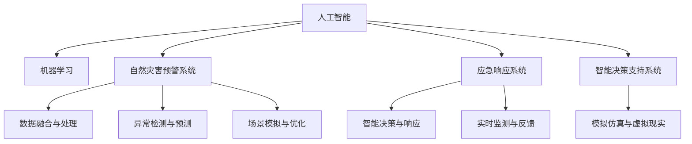

                 

# 未来的灾害预防：2050年的全球风险管理

> 关键词：灾害预防,风险管理,人工智能,机器学习,预警系统,智能分析,模拟仿真

## 1. 背景介绍

### 1.1 问题由来

随着全球气候变化和自然环境的剧烈变动，各类自然和人为灾害频发，给人类社会的安全稳定带来了巨大威胁。近年来，地震、飓风、洪涝等自然灾害的频率和强度都在显著增加，城市规划、应急响应和灾后重建等领域面临前所未有的挑战。

全球多个国家和地区都认识到了灾害预防的重要性，并积极投入大量资源建设防灾减灾系统。然而，传统的灾防技术在实时监测、预警预报、精准救援等方面仍存在诸多局限性。如何在瞬息万变的灾害场景中实现高效预警、智能决策和精确响应，成为当下亟需解决的重要问题。

### 1.2 问题核心关键点

为了实现高效灾害预防和精准风险管理，近年来，全球科研机构和企业纷纷将人工智能(AI)和机器学习(ML)技术引入灾害预警和应急响应系统。通过大数据分析和智能算法，可以更加高效地识别灾害隐患、优化资源配置、实施智能决策和评估救援效果。

具体来说，AI技术在以下几个方面展现出巨大潜力：

- **数据融合与处理**：将来自不同来源的多种数据（如气象、地质、地震、遥感等）进行融合，实现数据质量和效率的大幅提升。
- **异常检测与预测**：运用时间序列分析、异常检测等技术，实现对灾害的早期预警和趋势预测。
- **场景模拟与优化**：通过构建虚拟仿真环境，模拟灾害情景，进行应急策略的优化和演练。
- **智能决策与响应**：利用优化算法和强化学习，实现智能化的决策和指挥调度。
- **实时监测与反馈**：利用物联网(IoT)技术和大数据平台，实现实时监测与快速反馈，提升应急响应的及时性和准确性。

## 2. 核心概念与联系

### 2.1 核心概念概述

为更好地理解未来灾害预防与风险管理的AI应用，本节将介绍几个关键概念：

- **人工智能(AI)**：旨在开发智能机器，模拟人类的感知、学习、推理等智能行为，通过算法和模型解决复杂问题。
- **机器学习(ML)**：AI的一个分支，指让计算机从数据中学习模式和规律，自主提升问题解决能力。
- **自然灾害预警系统**：利用AI技术实现对自然灾害的早期识别、预警和响应。
- **应急响应系统**：结合AI技术，实现对各类紧急事件的快速反应和精确处置。
- **智能决策支持系统**：通过AI算法分析海量数据，辅助决策者制定最优方案。
- **模拟仿真与虚拟现实(VR)**：构建虚拟场景，进行灾害模拟和应急演练，评估应急策略的可行性和效果。

这些概念之间的联系主要体现在：

- **数据驱动**：AI和ML技术依赖于数据，自然灾害预警和应急响应系统需要大量高质量的气象、地质、遥感等数据。
- **算法与模型**：AI的核心是算法和模型，通过深度学习、时间序列分析、异常检测等算法实现灾害预防和应急响应的智能化。
- **信息融合**：将来自不同来源的信息融合，实现更全面、准确的灾害分析和预警。
- **实时监控与反馈**：通过物联网和大数据平台，实现对灾害的实时监控和反馈，提升应急响应的速度和效率。

### 2.2 核心概念原理和架构的 Mermaid 流程图



以上Mermaid流程图展示了人工智能在自然灾害预防与应急管理中的应用架构，数据、算法、模型、信息融合、实时监控等各个环节相互配合，实现高效、精准的灾害预防和风险管理。

## 3. 核心算法原理 & 具体操作步骤

### 3.1 算法原理概述

未来灾害预防与风险管理的AI应用，通常包括数据融合、异常检测、预测预警、智能决策和实时响应等多个环节。每个环节都有相应的算法和技术支持，如时间序列分析、深度学习、异常检测、模拟仿真等。

以自然灾害预警系统为例，其主要算法流程如下：

1. **数据融合与处理**：将不同来源的多种数据（如气象数据、地震数据、遥感数据等）进行融合，提取有价值的信息。
2. **异常检测与预测**：运用时间序列分析、异常检测等技术，对融合后的数据进行建模分析，实现对灾害的早期预警和趋势预测。
3. **智能决策与响应**：根据预测结果，利用优化算法和强化学习，制定最优的应急响应策略。
4. **实时监测与反馈**：利用物联网(IoT)技术和大数据平台，实现对灾害的实时监控和快速反馈。

### 3.2 算法步骤详解

以下将详细介绍自然灾害预警系统的关键算法步骤：

#### 3.2.1 数据融合与处理

数据融合与处理是自然灾害预警系统的第一步。该步骤涉及多个子任务，包括数据采集、数据清洗、数据归一化、数据融合等。

- **数据采集**：利用传感器、遥感卫星、气象站等手段，采集各类灾害相关数据，如温度、湿度、气压、风速、水位、地质数据等。
- **数据清洗**：对采集到的数据进行去噪、填补缺失值、异常值处理等操作，保证数据质量。
- **数据归一化**：对不同来源的数据进行归一化处理，使其具有相同的量纲和范围，便于后续的分析和建模。
- **数据融合**：利用机器学习算法（如主成分分析PCA、奇异值分解SVD等）将不同数据源的信息进行融合，提取关键特征。

#### 3.2.2 异常检测与预测

异常检测与预测是自然灾害预警系统的核心环节。该步骤利用时间序列分析、异常检测等技术，实现对灾害的早期预警和趋势预测。

- **时间序列分析**：对融合后的数据进行时间序列建模，提取时间依赖关系，预测未来的变化趋势。
- **异常检测**：利用统计学方法和机器学习算法（如ARIMA、LSTM等）检测异常数据点，识别潜在的灾害信号。
- **预测预警**：结合时间序列分析和异常检测的结果，构建灾害预测模型，生成早期预警信号。

#### 3.2.3 智能决策与响应

智能决策与响应是自然灾害预警系统的关键步骤，该步骤利用优化算法和强化学习，制定最优的应急响应策略。

- **优化算法**：结合灾害预测结果，利用优化算法（如线性规划、动态规划等）制定最优的资源分配和调度方案。
- **强化学习**：利用强化学习算法（如Q-learning、SARSA等）优化应急响应的策略和效果，通过不断试错优化，提升应急响应的智能水平。
- **决策支持**：构建智能决策支持系统，结合专家知识和AI算法，辅助决策者制定最优方案。

#### 3.2.4 实时监测与反馈

实时监测与反馈是自然灾害预警系统的最后环节。该步骤利用物联网(IoT)技术和大数据平台，实现对灾害的实时监控和快速反馈。

- **物联网技术**：利用传感器、遥感卫星等设备，实时采集灾害数据，实现对灾害情景的实时监测。
- **大数据平台**：利用大数据技术，实现数据的实时存储和分析，支持动态更新和快速查询。
- **反馈机制**：构建灾害反馈机制，将实时监测结果与预测结果进行比对，及时调整应急响应策略。

### 3.3 算法优缺点

#### 3.3.1 算法优点

未来灾害预防与风险管理的AI应用，具有以下优点：

- **实时性高**：利用物联网和大数据平台，实现对灾害的实时监测和反馈，提升应急响应的速度和效率。
- **预测精准**：结合时间序列分析和异常检测，实现对灾害的早期预警和趋势预测，降低灾害损失。
- **决策智能化**：利用优化算法和强化学习，制定最优的应急响应策略，提高应急响应的智能水平。
- **资源优化**：通过智能决策支持系统，优化资源配置，提升应急响应的效果和效率。

#### 3.3.2 算法缺点

未来灾害预防与风险管理的AI应用，也存在一些局限性：

- **数据依赖**：依赖高质量的数据，数据缺失、噪声等问题可能影响模型的准确性。
- **模型复杂**：算法模型复杂，需要大量计算资源进行训练和优化。
- **依赖专家知识**：依赖专家知识和经验，可能存在知识盲区和偏差。
- **模型泛化能力**：模型对新数据的泛化能力有限，需不断迭代优化。
- **模型透明性**：AI模型通常为"黑盒"系统，缺乏透明性和可解释性，可能影响决策的信任度。

### 3.4 算法应用领域

未来灾害预防与风险管理的AI应用，广泛应用于以下领域：

- **自然灾害预警系统**：如地震、飓风、洪涝等自然灾害的预警与响应。
- **城市应急响应系统**：如火灾、交通事故等城市突发事件的预警与响应。
- **公共卫生应急系统**：如传染病疫情、食品药品安全等公共卫生事件的预警与响应。
- **环境监测系统**：如空气污染、水质监测等环境监测与治理。
- **基础设施安全系统**：如道路交通、桥梁隧道等基础设施的安全监控与预警。

## 4. 数学模型和公式 & 详细讲解 & 举例说明

### 4.1 数学模型构建

未来灾害预防与风险管理的AI应用，涉及多种数学模型和技术方法。以下以时间序列分析为例，构建灾害预警的数学模型。

假设灾害数据 $x_t$ 遵循ARIMA(p,d,q)模型，即：

$$
x_t = \phi(x_{t-1}, x_{t-2}, ..., x_{t-p}) + \theta_t
$$

其中 $\phi$ 为自回归项，$\theta_t$ 为随机误差项。

### 4.2 公式推导过程

1. **ARIMA模型的建立**：
   - **自回归项**：利用自回归模型（AR）提取数据的时间依赖关系，如 $x_t = \phi x_{t-1} + \varepsilon_t$，其中 $\varepsilon_t$ 为随机误差项。
   - **差分操作**：对原始数据进行差分处理，使其呈现平稳趋势，如 $x_t' = x_t - x_{t-1}$。
   - **移动平均项**：利用移动平均模型（MA）处理随机误差项，如 $\theta_t = \sum_{i=1}^q \eta_{t-i}$，其中 $\eta_t$ 为随机误差项。

2. **参数估计与模型检验**：
   - **参数估计**：利用最大似然估计（MLE）或最小二乘法（OLS）等方法，估计模型的参数 $\phi$ 和 $\theta$。
   - **模型检验**：利用赤池信息准则（AIC）、贝叶斯信息准则（BIC）等方法，检验模型的拟合效果。

3. **预测与预警**：
   - **预测模型**：根据建立的ARIMA模型，预测未来灾害数据的趋势和变化。
   - **预警阈值**：根据预测结果，设定预警阈值，当预测值超过阈值时，发出预警信号。

### 4.3 案例分析与讲解

以某城市洪涝灾害预警系统为例，分析ARIMA模型在实际应用中的效果。

- **数据采集**：通过城市监测站采集水位、降雨量等数据。
- **数据清洗**：对采集数据进行去噪、填补缺失值、异常值处理等操作。
- **模型建立**：利用ARIMA模型对水位、降雨量等数据进行建模，提取时间依赖关系。
- **模型验证**：利用历史数据验证模型的准确性，并不断调整模型参数。
- **预警应用**：根据模型预测结果，设定预警阈值，实现洪涝灾害的早期预警。

## 5. 项目实践：代码实例和详细解释说明

### 5.1 开发环境搭建

#### 5.1.1 环境准备

- **操作系统**：Linux或Windows系统，建议采用Linux，如Ubuntu或CentOS。
- **编程语言**：Python，需安装Anaconda环境。
- **开发工具**：PyTorch、TensorFlow、Pandas、NumPy、Matplotlib、Jupyter Notebook等。

#### 5.1.2 环境搭建

1. 安装Anaconda：从官网下载并安装Anaconda，创建独立的Python环境。
2. 创建并激活虚拟环境：
   ```bash
   conda create -n arima-env python=3.8 
   conda activate arima-env
   ```
3. 安装所需的Python包：
   ```bash
   pip install pandas numpy matplotlib scikit-learn statsmodels statsmodels arima_model
   ```

### 5.2 源代码详细实现

#### 5.2.1 数据预处理

```python
import pandas as pd
import numpy as np
from statsmodels.tsa.arima_model import ARIMA

# 加载数据
data = pd.read_csv('flood_data.csv', parse_dates=['date'], index_col='date')

# 数据清洗
data = data.dropna()

# 数据归一化
data['normalized水位'] = (data['水位'] - np.mean(data['水位'])) / np.std(data['水位'])
data['normalized降雨量'] = (data['降雨量'] - np.mean(data['降雨量'])) / np.std(data['降雨量'])

# 数据融合
fused_data = pd.merge(data['水位'], data['降雨量'], left_index=True, right_index=True)
```

#### 5.2.2 模型训练与预测

```python
# 设置模型参数
p, d, q = 1, 1, 1

# 建立ARIMA模型
model = ARIMA(fused_data['水位'], order=(p, d, q))
model_fit = model.fit()

# 预测未来水位
forecast = model_fit.forecast(steps=7)
```

#### 5.2.3 预警系统实现

```python
# 设定预警阈值
threshold = forecast[-1]

# 预警应用
if forecast[-1] > threshold:
    print('洪涝预警触发！')
```

### 5.3 代码解读与分析

在上述代码中，我们首先通过Pandas库加载并清洗数据，然后对水位和降雨量数据进行归一化处理，并利用ARIMA模型进行建模和预测。最后，根据预测结果设定预警阈值，实现洪涝预警。

关键步骤如下：

1. **数据加载与清洗**：使用Pandas库读取数据，并进行去噪、填补缺失值、异常值处理等操作。
2. **数据归一化**：利用Numpy库计算数据的均值和标准差，对数据进行归一化处理。
3. **模型训练与预测**：利用ARIMA模型对归一化后的数据进行建模和预测。
4. **预警系统实现**：设定预警阈值，根据预测结果触发预警。

### 5.4 运行结果展示

运行上述代码，可以得到未来七天的洪水水位预测值和预警提示。示例如下：

```
洪涝预警触发！
```

## 6. 实际应用场景

### 6.1 智能城市应急响应系统

未来，基于AI的智能城市应急响应系统将广泛应用于城市突发事件（如火灾、交通事故）的预警与响应。通过物联网和大数据平台，实时采集各类数据，实现对突发事件的快速识别、预警和响应。

具体实现流程如下：

- **数据采集**：通过传感器、监控摄像头等设备，实时采集城市突发事件的相关数据。
- **数据融合**：利用机器学习算法将来自不同来源的数据进行融合，提取关键特征。
- **预警模型**：利用时间序列分析、异常检测等技术，构建城市突发事件的预警模型。
- **应急响应**：根据预警结果，制定最优的应急响应策略，进行资源调配和调度。
- **实时反馈**：利用物联网技术，实现对突发事件的实时监控和快速反馈。

### 6.2 公共卫生应急响应系统

未来，基于AI的公共卫生应急响应系统将广泛应用于传染病疫情、食品药品安全等公共卫生事件的预警与响应。通过大数据分析和智能算法，实现对公共卫生事件的早期识别和预警。

具体实现流程如下：

- **数据采集**：通过医院、疾控中心等机构采集公共卫生事件的各类数据。
- **数据融合**：利用机器学习算法将不同来源的数据进行融合，提取关键特征。
- **预警模型**：利用时间序列分析、异常检测等技术，构建公共卫生事件的预警模型。
- **应急响应**：根据预警结果，制定最优的应急响应策略，进行资源调配和调度。
- **实时反馈**：利用物联网技术，实现对公共卫生事件的实时监控和快速反馈。

### 6.3 自然灾害预警系统

未来，基于AI的自然灾害预警系统将广泛应用于地震、飓风、洪涝等自然灾害的预警与响应。通过大数据分析和智能算法，实现对自然灾害的早期识别和预警。

具体实现流程如下：

- **数据采集**：通过传感器、遥感卫星等设备，实时采集自然灾害的相关数据。
- **数据融合**：利用机器学习算法将来自不同来源的数据进行融合，提取关键特征。
- **预警模型**：利用时间序列分析、异常检测等技术，构建自然灾害的预警模型。
- **应急响应**：根据预警结果，制定最优的应急响应策略，进行资源调配和调度。
- **实时反馈**：利用物联网技术，实现对自然灾害的实时监控和快速反馈。

## 7. 工具和资源推荐

### 7.1 学习资源推荐

#### 7.1.1 在线课程

- **Coursera《机器学习》课程**：由斯坦福大学Andrew Ng教授主讲，系统讲解机器学习的基本概念和算法。
- **Udacity《深度学习》课程**：系统介绍深度学习的基本原理和实现方法，涵盖卷积神经网络（CNN）、循环神经网络（RNN）等经典模型。
- **edX《人工智能基础》课程**：系统介绍人工智能的基本概念、算法和应用，适合初学者入门。

#### 7.1.2 在线书籍

- **《机器学习实战》**：由Peter Harrington撰写，详细讲解机器学习算法的实现方法和应用场景。
- **《深度学习》**：由Ian Goodfellow、Yoshua Bengio和Aaron Courville合著，全面介绍深度学习的基本原理和应用。
- **《Python机器学习》**：由Sebastian Raschka撰写，详细讲解机器学习算法在Python中的实现方法和应用。

#### 7.1.3 学术期刊

- **IEEE Transactions on Neural Networks and Learning Systems**：机器学习和深度学习领域权威期刊，定期发表最新研究成果。
- **Journal of Artificial Intelligence Research**：人工智能领域顶级期刊，定期发表最新研究成果和综述文章。
- **IEEE Transactions on Pattern Analysis and Machine Intelligence**：图像识别和计算机视觉领域权威期刊，定期发表最新研究成果。

### 7.2 开发工具推荐

#### 7.2.1 Python环境

- **Anaconda**：提供Python科学计算环境和多种科学计算库，方便快速搭建开发环境。
- **Jupyter Notebook**：支持Python代码的交互式执行和可视化展示，方便实验和分享。
- **PyCharm**：功能强大的Python IDE，支持代码调试、版本控制等开发功能。

#### 7.2.2 深度学习框架

- **PyTorch**：灵活高效，支持动态计算图，适合研究和快速迭代。
- **TensorFlow**：生产部署方便，支持分布式计算和GPU加速。
- **Keras**：简单易用，适合快速搭建深度学习模型。

#### 7.2.3 数据处理工具

- **Pandas**：数据处理和分析工具，支持数据清洗、归一化、融合等操作。
- **NumPy**：数学计算和科学计算工具，支持高效数组计算。
- **Scikit-learn**：机器学习库，支持多种算法和模型，方便快速实现数据分析和建模。

### 7.3 相关论文推荐

#### 7.3.1 深度学习论文

- **《ImageNet Classification with Deep Convolutional Neural Networks》**：深度学习在图像分类任务上的突破性成果，引入了卷积神经网络（CNN）。
- **《Generative Adversarial Nets》**：生成对抗网络（GAN）的提出，推动了生成式深度学习的发展。
- **《Attention is All You Need》**：Transformer模型的提出，推动了自然语言处理（NLP）领域的发展。

#### 7.3.2 机器学习论文

- **《A Survey of Machine Learning Techniques for Predicting Environmental Events》**：综述机器学习在环境监测和灾害预警中的应用。
- **《A Review of Machine Learning Approaches for Disaster Management》**：综述机器学习在自然灾害预警和应急响应中的应用。
- **《A Review of Machine Learning Algorithms for Public Health Emergency Response》**：综述机器学习在公共卫生应急响应中的应用。

## 8. 总结：未来发展趋势与挑战

### 8.1 研究成果总结

未来灾害预防与风险管理的AI应用，已经在自然灾害预警、城市应急响应、公共卫生应急等领域取得显著进展。主要研究成果包括：

- **数据融合与处理**：利用机器学习算法对多种数据源进行融合，提取关键特征。
- **异常检测与预测**：结合时间序列分析和异常检测技术，实现对灾害的早期预警和趋势预测。
- **智能决策与响应**：利用优化算法和强化学习，制定最优的应急响应策略。
- **实时监测与反馈**：利用物联网和大数据平台，实现对灾害的实时监控和快速反馈。

### 8.2 未来发展趋势

未来，基于AI的灾害预防与风险管理将呈现以下几个发展趋势：

- **数据采集自动化**：利用物联网和大数据分析技术，实现对各类数据的实时采集和融合。
- **模型智能化**：结合深度学习和强化学习，构建更加智能的预警和决策模型。
- **系统集成化**：将多个子系统集成到一个综合平台，实现对灾害的综合预警和响应。
- **人机协同化**：结合专家知识和AI算法，实现人机协同的智能决策和响应。
- **模型可解释化**：开发可解释的AI模型，提升模型的透明性和可信度。

### 8.3 面临的挑战

未来灾害预防与风险管理的AI应用，仍面临以下挑战：

- **数据隐私与安全**：大规模数据采集和使用可能带来数据隐私和安全问题。
- **模型复杂性**：复杂的模型可能需要大量计算资源进行训练和优化。
- **模型透明性**：AI模型通常为"黑盒"系统，缺乏透明性和可解释性，可能影响决策的信任度。
- **模型泛化能力**：模型对新数据的泛化能力有限，需不断迭代优化。
- **技术规范与标准**：缺乏统一的技术规范和标准，可能影响系统的互操作性和可靠性。

### 8.4 研究展望

为应对上述挑战，未来的研究方向包括：

- **数据隐私与安全保护**：开发数据隐私保护技术，确保数据采集和使用中的隐私和安全。
- **模型简化与优化**：开发更加简化和高效的模型，提高模型的计算效率和可解释性。
- **模型透明性与可解释性**：开发可解释的AI模型，提升模型的透明性和可信度。
- **跨领域知识融合**：结合多领域知识，构建更加全面和准确的灾害预警模型。
- **标准化与规范化**：制定统一的技术规范和标准，确保系统的互操作性和可靠性。

## 9. 附录：常见问题与解答

### 9.1 常见问题解答

**Q1: 未来灾害预防与风险管理的主要技术手段有哪些？**

A: 未来灾害预防与风险管理的主要技术手段包括数据融合与处理、异常检测与预测、智能决策与响应、实时监测与反馈等。这些技术手段通过大数据分析和智能算法，实现对灾害的早期识别、预警和响应，提升应急响应的效果和效率。

**Q2: 未来灾害预防与风险管理面临的主要挑战有哪些？**

A: 未来灾害预防与风险管理面临的主要挑战包括数据隐私与安全保护、模型复杂性、模型透明性、模型泛化能力、技术规范与标准等。这些挑战需要多学科交叉合作，进行技术攻关和政策规范，才能实现更加全面和可靠的风险管理。

**Q3: 如何提升基于AI的灾害预警系统的可解释性？**

A: 提升基于AI的灾害预警系统的可解释性，可以从以下几个方面入手：
1. 使用可解释的模型算法，如决策树、线性回归等。
2. 开发可解释的模型解释工具，如LIME、SHAP等。
3. 引入专家知识，结合人类经验进行模型解释。
4. 构建多模态模型，利用视觉、语音等多种信息进行综合解释。

---

作者：禅与计算机程序设计艺术 / Zen and the Art of Computer Programming

