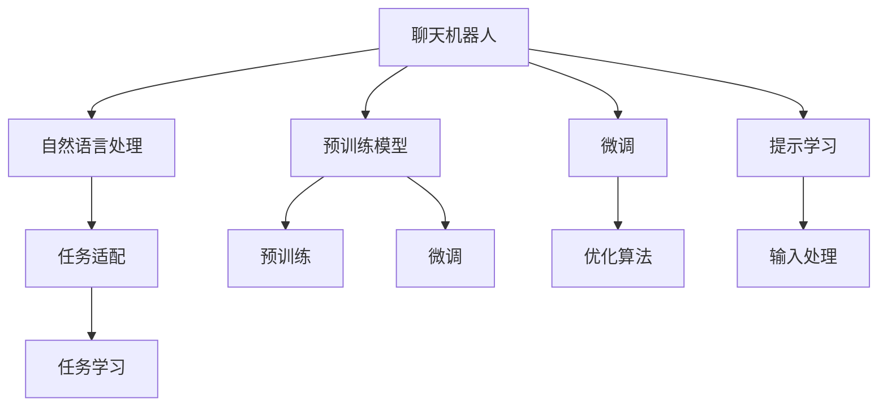

                 

# 构建你自己的聊天机器人：入门指南

> 关键词：
- 聊天机器人, 自然语言处理(NLP), 对话系统, 深度学习, 预训练模型, 微调, 提示学习

## 1. 背景介绍

### 1.1 问题由来
随着人工智能技术的飞速发展，聊天机器人（Chatbot）正逐渐成为智能应用的重要组成部分，广泛应用于客服、教育、健康、娱乐等多个领域。它们不仅能提供24/7的即时响应，还能解决大量的重复性、标准化问题，极大地提升了用户体验和效率。然而，构建一个具有高智能水平、能够理解复杂语义和上下文、能够处理多轮对话的聊天机器人，并不是一件易事。传统的基于规则或模板的聊天机器人，往往缺乏足够的灵活性和自然性，难以应对复杂的自然语言处理（Natural Language Processing, NLP）任务。

### 1.2 问题核心关键点
当前，构建智能聊天机器人主要依赖于深度学习技术和大规模预训练语言模型。这些模型通过在大量文本数据上进行自监督预训练，学习到丰富的语言知识和表示能力，再通过微调(Fine-tuning)或提示学习(Prompt Learning)等技术，适配特定任务和对话场景。这种基于深度学习的自然语言理解（NLU）和生成（NLG）能力，使得聊天机器人能够处理自然语言输入，理解用户意图，提供符合预期的回答，从而实现更自然、更高效的人机交互。

构建聊天机器人的关键在于选择合适的预训练模型、理解其架构和工作原理、学会如何利用它进行任务适配和性能优化。本文将系统性地介绍这些技术细节，并提供实际代码示例，帮助读者构建自己的聊天机器人。

### 1.3 问题研究意义
构建聊天机器人是自然语言处理领域的一个重要研究方向，它将深度学习技术与实际应用紧密结合，推动了NLP技术的产业化进程。通过本文的学习，读者将掌握聊天机器人的核心技术原理，学会使用预训练模型进行任务适配，获得构建高效、智能聊天机器人的能力。这不仅对于开发人员和AI工程师来说是一次技术能力的提升，也对自然语言理解和生成技术的普及和应用有着重要意义。

## 2. 核心概念与联系

### 2.1 核心概念概述

为更好地理解聊天机器人的构建过程，本节将介绍几个关键核心概念：

- 聊天机器人(Chatbot)：一种能够理解和生成自然语言、实现人机对话的智能软件系统。
- 自然语言处理(NLP)：涉及计算机与人类语言之间交互的技术，包括语音识别、文本分类、情感分析、对话系统等。
- 预训练模型(Pre-trained Model)：通过在无标签大规模语料上自监督学习得到的通用语言模型，如BERT、GPT等。
- 微调(Fine-tuning)：在预训练模型的基础上，使用下游任务的少量标注数据进行有监督学习，优化模型在特定任务上的性能。
- 提示学习(Prompt Learning)：通过在输入文本中添加模板或引导语，使模型根据特定的语境或指令输出结果。
- 对话系统(Dialogue System)：能够自动完成多轮对话的系统，包括任务导向型和开放域对话。

这些核心概念之间的逻辑关系可以通过以下Mermaid流程图来展示：



这个流程图展示了聊天机器人构建的核心流程和关键技术：

1. 聊天机器人通过自然语言处理技术理解用户输入，并通过任务适配生成输出。
2. 预训练模型为聊天机器人提供了丰富的语言知识和表示能力。
3. 微调和提示学习技术使得聊天机器人能够适应特定任务和对话场景。
4. 任务适配层将预训练模型与具体任务相结合，实现对话生成和语义理解。
5. 优化算法和输入处理保证了聊天机器人在计算上的高效性和稳定性。

## 3. 核心算法原理 & 具体操作步骤

### 3.1 算法原理概述

聊天机器人的核心算法基于自然语言处理和深度学习，主要包括以下几个步骤：

1. 数据准备：收集对话数据和标签，进行预处理和标注。
2. 模型选择：选择合适的预训练模型，如BERT、GPT等。
3. 任务适配：在预训练模型的基础上，设计或微调适配层，适配特定的任务需求。
4. 训练和评估：使用标注数据对模型进行训练，并通过评估指标评估模型性能。
5. 部署和维护：将训练好的模型部署到实际应用中，并进行持续的更新和维护。

### 3.2 算法步骤详解

#### 3.2.1 数据准备

构建聊天机器人需要大量的对话数据和相应的标签。数据来源可以是历史客服记录、用户反馈、社交媒体互动等。首先，我们需要对这些数据进行清洗和标注。以客户服务对话数据为例，可以将其标注为不同类型的问题和回答，如咨询、投诉、建议等。

```python
import pandas as pd
from sklearn.model_selection import train_test_split

# 加载数据
data = pd.read_csv('customers_service.csv')

# 预处理
data = data.dropna()  # 去除缺失值
data['question'] = data['question'].apply(lambda x: x.strip())  # 去除前后空格
data['answer'] = data['answer'].apply(lambda x: x.strip())

# 标注
data['label'] = data['question'].apply(lambda x: 'consult' if '咨询' in x else 'complaint' if '投诉' in x else 'suggestion')

# 划分训练集和测试集
train_data, test_data = train_test_split(data, test_size=0.2)
```

#### 3.2.2 模型选择

选择合适的预训练模型是构建聊天机器人的关键步骤。目前，BERT、GPT、T5等大型预训练模型在NLP任务中表现优异。

```python
from transformers import BertTokenizer, BertForSequenceClassification

# 初始化BERT模型和分词器
tokenizer = BertTokenizer.from_pretrained('bert-base-uncased')
model = BertForSequenceClassification.from_pretrained('bert-base-uncased', num_labels=3)
```

#### 3.2.3 任务适配

任务适配层根据具体任务设计，用于将预训练模型输出转换为可解释的语义信息。对于分类任务，通常使用线性分类器和交叉熵损失函数。

```python
from transformers import BertForSequenceClassification

class ClassificationHead(BertForSequenceClassification):
    def __init__(self, num_labels, output_attentions=False, output_hidden_states=False):
        super(ClassificationHead, self).__init__(num_labels, output_attentions, output_hidden_states)

    def forward(self, input_ids=None, attention_mask=None, token_type_ids=None, labels=None):
        if labels is None:
            return super().forward(input_ids, attention_mask=attention_mask, token_type_ids=token_type_ids)
        else:
            return super().forward(input_ids, attention_mask=attention_mask, token_type_ids=token_type_ids, labels=labels)
```

#### 3.2.4 训练和评估

在训练过程中，我们通常使用交叉熵损失函数，并使用Adam优化器进行优化。训练过程分为多个epoch，每个epoch内进行前向传播和反向传播，更新模型参数。

```python
from transformers import AdamW, Trainer, TrainingArguments

# 训练参数
training_args = TrainingArguments(
    output_dir="./results",
    per_device_train_batch_size=16,
    per_device_eval_batch_size=16,
    num_train_epochs=3,
    weight_decay=0.01,
    logging_steps=500,
    logging_dir="./logs",
    evaluation_strategy="epoch",
    learning_rate=2e-5,
    evaluation_dataloaders=eval_dataloaders,
    output_dir="./results",
    evaluation_strategy="epoch",
    resume_from_checkpoint="./results/checkpoint-1000",
    save_strategy="epoch"
)

# 创建Trainer对象
trainer = Trainer(
    model=model,
    args=training_args,
    train_dataset=train_data,
    eval_dataset=test_data
)

# 训练
trainer.train()
```

#### 3.2.5 部署和维护

训练好的模型需要部署到实际应用中，并进行持续的更新和维护。可以使用AWS Lambda、Azure Functions等云服务进行部署，并定期更新模型参数以适应新数据。

### 3.3 算法优缺点

聊天机器人的构建过程具有以下优点：

1. 自动化程度高：使用深度学习模型可以自动学习语言规律，无需手动编写规则或模板。
2. 泛化能力强：通过预训练模型，可以学习到通用的语言表示，适应不同场景。
3. 易于扩展：随着模型和数据量的增加，聊天机器人的性能可以持续提升。

但同时，构建聊天机器人也面临一些挑战：

1. 数据需求大：需要大量的对话数据和标注，数据获取和标注成本较高。
2. 模型复杂度高：大型预训练模型和深度学习模型的计算资源需求高，部署和维护成本较大。
3. 过拟合风险高：模型可能会过拟合特定任务或数据集，泛化能力下降。
4. 对话质量不稳定：对话生成依赖于模型和数据，对话质量受限于模型性能和数据质量。

### 3.4 算法应用领域

聊天机器人在多个领域有着广泛的应用：

1. 客户服务：提供24/7客户支持，减少客服人员的工作量，提升客户满意度。
2. 教育：辅助在线教育，解答学生疑问，提供个性化学习建议。
3. 健康医疗：提供健康咨询，协助医生诊疗，提高医疗服务的可达性。
4. 娱乐：与用户互动，提供定制化内容，增强用户粘性。

## 4. 数学模型和公式 & 详细讲解  
### 4.1 数学模型构建

聊天机器人的构建主要依赖于自然语言处理和深度学习技术，以下是基本的数学模型构建：

- 输入表示：将自然语言文本转换为模型可以处理的向量表示。
- 隐藏表示：通过预训练模型，将输入向量映射到高维空间，学习语义信息。
- 输出表示：将隐藏表示转换为模型需要的格式，如分类标签、文本回答等。

### 4.2 公式推导过程

以分类任务为例，假设预训练模型为 $M_{\theta}$，输入为 $x$，输出为 $y$，损失函数为 $\ell(y, M_{\theta}(x))$。训练的目标是最小化损失函数，即：

$$
\theta^* = \mathop{\arg\min}_{\theta} \ell(y, M_{\theta}(x))
$$

其中，$\ell$ 可以是交叉熵损失、均方误差损失等。在实际应用中，我们通常使用基于梯度的优化算法，如Adam，进行模型训练。

### 4.3 案例分析与讲解

以文本分类任务为例，我们可以使用BERT模型进行微调，具体步骤如下：

1. 数据准备：收集标注好的文本数据。
2. 模型选择：选择BERT作为预训练模型。
3. 任务适配：在BERT的基础上添加分类头。
4. 训练和评估：使用标注数据训练模型，评估模型性能。

## 5. 项目实践：代码实例和详细解释说明
### 5.1 开发环境搭建

构建聊天机器人需要Python编程语言和相关的深度学习框架，如PyTorch和Transformers库。

1. 安装Python和相关库：
```bash
pip install torch transformers
```

2. 初始化项目：
```bash
mkdir chatbot
cd chatbot
```

3. 安装相关依赖：
```bash
pip install pandas numpy scikit-learn transformers
```

完成上述步骤后，即可开始构建聊天机器人的项目实践。

### 5.2 源代码详细实现

以下是使用PyTorch和BERT构建聊天机器人的完整代码示例：

```python
import torch
from transformers import BertTokenizer, BertForSequenceClassification, Trainer, TrainingArguments

# 初始化分词器和BERT模型
tokenizer = BertTokenizer.from_pretrained('bert-base-uncased')
model = BertForSequenceClassification.from_pretrained('bert-base-uncased', num_labels=3)

# 数据准备
train_data = ...
test_data = ...

# 训练参数
training_args = TrainingArguments(
    output_dir="./results",
    per_device_train_batch_size=16,
    per_device_eval_batch_size=16,
    num_train_epochs=3,
    weight_decay=0.01,
    logging_steps=500,
    logging_dir="./logs",
    evaluation_strategy="epoch",
    learning_rate=2e-5,
    evaluation_dataloaders=eval_dataloaders,
    output_dir="./results",
    evaluation_strategy="epoch",
    resume_from_checkpoint="./results/checkpoint-1000",
    save_strategy="epoch"
)

# 创建Trainer对象
trainer = Trainer(
    model=model,
    args=training_args,
    train_dataset=train_data,
    eval_dataset=test_data
)

# 训练
trainer.train()

# 部署模型
model.eval()
```

### 5.3 代码解读与分析

聊天机器人的代码实现主要包括以下几个步骤：

1. 初始化分词器和BERT模型。
2. 准备训练和测试数据集。
3. 定义训练参数，包括模型输出目录、批次大小、训练轮数、学习率等。
4. 创建Trainer对象，指定训练和评估数据集。
5. 训练模型，并保存训练好的模型参数。
6. 部署模型，进行推理预测。

## 6. 实际应用场景
### 6.1 客户服务

聊天机器人在客户服务中的应用非常广泛。企业可以利用预训练模型进行微调，构建智能客服系统，提供24/7的客户支持。通过不断收集和标注历史客服记录，聊天机器人可以逐步提升对常见问题的处理能力，减少客服人员的工作量，提升客户满意度。

### 6.2 教育

在教育领域，聊天机器人可以用于在线辅助教学，解答学生问题，提供学习建议。通过微调模型，可以实现个性化学习路径推荐，提升学生的学习效果。

### 6.3 健康医疗

聊天机器人可以帮助患者进行健康咨询，解答常见医疗问题，提供健康建议。通过微调模型，可以实现医疗领域的智能化诊疗，提升医疗服务的可及性和效率。

### 6.4 娱乐

聊天机器人可以与用户互动，提供定制化内容，增强用户粘性。通过微调模型，可以提升对话的趣味性和互动性，提供更加贴近用户需求的娱乐体验。

## 7. 工具和资源推荐
### 7.1 学习资源推荐

为了帮助读者系统掌握聊天机器人的构建技术，以下是一些优质的学习资源：

1. 《深度学习自然语言处理》：斯坦福大学开设的NLP课程，系统介绍了NLP的基本概念和经典模型。
2. 《自然语言处理与深度学习》：深入浅出地介绍了自然语言处理和深度学习的相关技术。
3. 《Transformers权威指南》：介绍Transformers库的使用和自然语言处理任务的开发。

### 7.2 开发工具推荐

以下是几款用于聊天机器人开发的常用工具：

1. PyTorch：开源深度学习框架，支持动态计算图，适合快速迭代研究。
2. TensorFlow：Google开发的深度学习框架，支持分布式计算和GPU加速，适合大规模工程应用。
3. HuggingFace Transformers：NLP工具库，提供预训练模型和微调样例代码。
4. TensorBoard：TensorFlow配套的可视化工具，实时监测模型训练状态。

### 7.3 相关论文推荐

以下是几篇奠基性的相关论文，推荐阅读：

1. Attention is All You Need：提出Transformer模型，开创了预训练语言模型的新纪元。
2. BERT: Pre-training of Deep Bidirectional Transformers for Language Understanding：提出BERT模型，通过掩码语言建模和下一句预测任务进行预训练。
3. GPT-3：展示了大规模预训练模型在自然语言理解、生成和推理方面的强大能力。

## 8. 总结：未来发展趋势与挑战

### 8.1 总结

本文系统介绍了聊天机器人的构建过程和技术细节，包括数据准备、模型选择、任务适配、训练和评估等关键步骤。通过详细的代码示例和分析，帮助读者构建自己的聊天机器人。聊天机器人在多个领域有着广泛的应用前景，成为NLP技术的典型应用之一。

### 8.2 未来发展趋势

未来，聊天机器人将呈现以下几个发展趋势：

1. 更加智能化：随着预训练模型和微调技术的不断发展，聊天机器人的智能化水平将不断提升。
2. 跨领域应用：聊天机器人的应用将从传统的客服、教育、医疗等垂直领域，扩展到更多行业，如金融、法律、旅游等。
3. 多模态融合：聊天机器人将整合文本、图像、语音等多模态信息，提升对话交互的丰富性和自然性。
4. 情感计算：通过引入情感分析技术，聊天机器人能够更加准确地理解用户的情绪和需求，提供更贴心的服务。
5. 人机协同：聊天机器人将与人类专家结合，形成人机协同的智能系统，提升服务质量和效率。

### 8.3 面临的挑战

尽管聊天机器人已经取得了诸多进展，但在实际应用中仍然面临一些挑战：

1. 数据稀缺：聊天机器人需要大量的对话数据和标注，获取数据成本较高。
2. 模型复杂度高：大型预训练模型和深度学习模型的计算资源需求高，部署和维护成本较大。
3. 对话质量不稳定：对话生成依赖于模型和数据，对话质量受限于模型性能和数据质量。
4. 用户需求多样：不同用户的需求和对话场景各异，单一模型难以全面覆盖。

### 8.4 研究展望

未来，聊天机器人的研究将集中在以下几个方向：

1. 数据增强：利用数据增强技术扩充对话数据，提高模型泛化能力。
2. 参数高效微调：开发参数高效微调方法，减少模型计算资源需求。
3. 多任务学习：将多个任务适配层融合，提高模型的多任务处理能力。
4. 迁移学习：将聊天机器人模型迁移到其他领域，提升模型的泛化性和适应性。
5. 跨领域适配：开发通用适配层，使聊天机器人能够适应更多领域的需求。

## 9. 附录：常见问题与解答

**Q1：构建聊天机器人需要哪些技术？**

A: 构建聊天机器人需要以下关键技术：
1. 自然语言处理：涉及文本清洗、分词、词性标注等基础任务。
2. 深度学习：使用预训练模型进行微调，通过反向传播更新模型参数。
3. 分布式计算：处理大规模数据和模型，提高计算效率。
4. 语言模型：使用预训练模型学习语言规律，提升对话质量。

**Q2：如何选择合适的预训练模型？**

A: 选择合适的预训练模型需要考虑以下几个因素：
1. 任务需求：根据任务类型选择合适的模型，如分类、生成、对话等。
2. 数据规模：考虑预训练模型的参数规模和计算资源需求。
3. 性能表现：评估预训练模型在类似任务上的表现，确保其泛化能力。

**Q3：微调过程中如何防止过拟合？**

A: 防止过拟合可以通过以下方法：
1. 数据增强：通过回译、近义替换等方式扩充训练集。
2. 正则化：使用L2正则、Dropout等防止模型过度适应数据。
3. 对抗训练：加入对抗样本，提高模型鲁棒性。
4. 参数高效微调：只调整少量参数，减少过拟合风险。

**Q4：部署聊天机器人需要注意哪些问题？**

A: 部署聊天机器人需要注意以下几个问题：
1. 模型裁剪：去除不必要的层和参数，减小模型尺寸，提高推理速度。
2. 量化加速：将浮点模型转为定点模型，压缩存储空间，提高计算效率。
3. 服务化封装：将模型封装为标准化服务接口，便于集成调用。
4. 弹性伸缩：根据请求流量动态调整资源配置，平衡服务质量和成本。
5. 监控告警：实时采集系统指标，设置异常告警阈值，确保服务稳定性。

**Q5：如何评估聊天机器人的性能？**

A: 聊天机器人的性能评估可以从以下几个方面进行：
1. 对话质量：通过人工评估或自动评估指标，如BLEU、ROUGE等，评估对话的自然性和质量。
2. 用户满意度：收集用户反馈，评估聊天机器人是否能够满足用户的需求。
3. 任务完成率：统计聊天机器人完成任务的成功率和准确率。
4. 系统稳定性：评估聊天机器人在不同场景下的稳定性和可靠性。

---

作者：禅与计算机程序设计艺术 / Zen and the Art of Computer Programming

