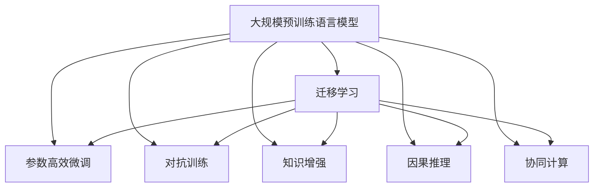

                 

# 构建更智能的世界：人类计算的应用场景

## 1. 背景介绍

随着人工智能技术的迅猛发展，人类计算的概念正在悄然发生深刻变化。从早期的纯机械计算到复杂的符号逻辑推理，再到如今基于神经网络的深度学习，计算方式不断进化，计算能力也逐步提升。而人工智能技术的飞速进步，正在加速这一变革，使人类计算迈入了一个全新的时代。

### 1.1 问题由来
人工智能的兴起，让计算不再局限于物理硬件的性能提升，而是延伸到了数据的深度加工和处理的层面。大模型、大算力、大数据，这三座“山”的叠加，正在重塑人类计算的范式。尤其是大规模预训练语言模型和大数据驱动的深度学习，正在将计算能力扩展到语言和知识层面，赋予计算机以“理解”和“推理”的能力。

但与此同时，人类计算也面临着一些亟待解决的问题：
- **数据质量和数量**：优质数据资源的获取成本高、难度大。
- **计算资源的局限性**：当前的计算平台和算力仍然难以满足大规模模型和高并发任务的需求。
- **计算模型和算法的可解释性**：复杂模型难以被理解，缺乏透明性。
- **计算应用的伦理和安全**：人工智能技术的应用可能带来伦理和安全的挑战。

这些问题呼唤着更加智能、更加高效、更加安全的人类计算范式。因此，本文将探讨人类计算在智能世界中的应用场景，并深入分析其中的核心概念和算法原理，以便更好地应对未来挑战。

### 1.2 问题核心关键点
核心问题在于如何构建一种新的计算模型和范式，使其既能充分利用大模型和大数据带来的优势，又能克服现有技术的局限，同时保持计算过程的透明性和安全性。本文将围绕这一核心问题，从算法原理、模型构建、应用场景等多个维度进行探讨。

## 2. 核心概念与联系

### 2.1 核心概念概述

为了更好地理解人类计算的应用场景，本文将介绍几个关键概念及其联系：

- **大规模预训练语言模型**：如BERT、GPT-3等模型，通过在大规模无标签文本数据上进行预训练，学习到通用语言知识和表示。
- **迁移学习**：利用已在大规模数据上预训练的模型，通过微调或细化处理，适应特定领域或任务的计算需求。
- **参数高效微调**：在微调过程中只更新部分模型参数，避免过拟合，同时保持预训练权重不变。
- **对抗训练**：通过引入对抗样本，增强模型的鲁棒性和泛化能力。
- **知识增强**：将知识图谱、逻辑规则等先验知识与计算模型结合，提升模型的智能水平。
- **因果推理**：通过因果推断，增强计算模型的决策透明性和可解释性。
- **协同计算**：多计算节点、多模型的协同工作，提升计算效率和处理能力。

这些核心概念通过一个简单的Mermaid流程图来展示：



这个流程图展示了人类计算的核心概念及其之间的联系：

1. **大规模预训练语言模型**：是所有计算的基础，通过无监督学习获得了通用的语言知识。
2. **迁移学习**：在大规模预训练模型的基础上，通过微调或细化处理，适应特定领域或任务的需求。
3. **参数高效微调**：在微调过程中只更新部分参数，保持预训练权重不变，避免过拟合。
4. **对抗训练**：增强模型的鲁棒性和泛化能力，避免对抗攻击。
5. **知识增强**：将先验知识与计算模型结合，提升模型的智能水平。
6. **因果推理**：增强计算模型的决策透明性和可解释性。
7. **协同计算**：通过多计算节点、多模型的协同工作，提升计算效率和处理能力。

这些概念共同构成了人类计算的框架，使得计算能够更好地应对复杂多变的世界。

## 3. 核心算法原理 & 具体操作步骤

### 3.1 算法原理概述

人类计算的核心在于如何利用大模型和大数据，构建一个更加智能、高效、透明的计算模型。本文将介绍几种核心的算法原理，并详细讲解具体操作步骤。

#### 3.1.1 迁移学习
迁移学习是指利用在特定领域或任务上预训练的模型，通过微调或细化处理，适应新的计算需求。这可以通过以下步骤实现：

1. **准备数据**：收集特定领域或任务的标注数据，划分为训练集、验证集和测试集。
2. **加载预训练模型**：选择合适的预训练语言模型，如BERT、GPT等，作为计算的基础。
3. **设计任务适配层**：根据任务类型，设计相应的输出层和损失函数，如分类任务使用线性分类器和交叉熵损失，生成任务使用语言模型的解码器。
4. **微调模型**：在标注数据上对预训练模型进行微调，通过有监督学习优化模型在特定任务上的性能。

#### 3.1.2 参数高效微调
参数高效微调是指在微调过程中，只更新部分模型参数，以提高微调效率和泛化能力。这可以通过以下步骤实现：

1. **选择参数**：根据任务需求，选择需要更新的参数。如只更新顶层或特定层。
2. **设置学习率**：选择合适的学习率，通常比从头训练时小1-2个数量级。
3. **优化器配置**：选择合适的优化器及其参数，如AdamW、SGD等。
4. **正则化技术**：使用L2正则、Dropout、Early Stopping等技术防止过拟合。
5. **数据增强**：通过回译、近义替换等方式扩充训练集。
6. **对抗训练**：引入对抗样本，提高模型鲁棒性。

#### 3.1.3 对抗训练
对抗训练是指通过引入对抗样本，增强模型的鲁棒性和泛化能力。这可以通过以下步骤实现：

1. **生成对抗样本**：使用对抗样本生成技术，如Fast Gradient Sign Method (FGSM)、Projected Gradient Descent (PGD)等，生成对模型有误导性的样本。
2. **微调模型**：在对抗样本上进行微调，以提高模型的鲁棒性。
3. **验证模型**：在对抗样本上验证模型的泛化能力，确保模型对对抗样本有较好的鲁棒性。

### 3.2 算法步骤详解

接下来，我们将详细讲解每种核心算法的操作步骤。

#### 3.2.1 迁移学习具体操作步骤

1. **数据准备**：收集特定领域或任务的标注数据，划分为训练集、验证集和测试集。
2. **模型加载**：选择合适的预训练语言模型，如BERT、GPT等，作为计算的基础。
3. **任务适配层设计**：根据任务类型，设计相应的输出层和损失函数，如分类任务使用线性分类器和交叉熵损失，生成任务使用语言模型的解码器。
4. **模型微调**：在标注数据上对预训练模型进行微调，通过有监督学习优化模型在特定任务上的性能。
5. **性能评估**：在验证集和测试集上评估微调后模型的性能，如准确率、F1分数等。

#### 3.2.2 参数高效微调具体操作步骤

1. **参数选择**：根据任务需求，选择需要更新的参数。如只更新顶层或特定层。
2. **学习率设置**：选择合适的学习率，通常比从头训练时小1-2个数量级。
3. **优化器配置**：选择合适的优化器及其参数，如AdamW、SGD等。
4. **正则化技术**：使用L2正则、Dropout、Early Stopping等技术防止过拟合。
5. **数据增强**：通过回译、近义替换等方式扩充训练集。
6. **对抗训练**：引入对抗样本，提高模型鲁棒性。
7. **模型评估**：在验证集和测试集上评估微调后模型的性能，如准确率、F1分数等。

#### 3.2.3 对抗训练具体操作步骤

1. **对抗样本生成**：使用对抗样本生成技术，如FGSM、PGD等，生成对模型有误导性的样本。
2. **模型微调**：在对抗样本上进行微调，以提高模型的鲁棒性。
3. **性能评估**：在对抗样本上验证模型的泛化能力，确保模型对对抗样本有较好的鲁棒性。

### 3.3 算法优缺点

人类计算的算法具有以下优点：

1. **泛化能力强**：通过在大规模数据上预训练，模型具备较强的泛化能力，能够适应多种任务。
2. **计算效率高**：通过参数高效微调和对抗训练等技术，减少计算资源消耗，提高计算效率。
3. **可解释性强**：通过因果推理等方法，增强计算模型的透明性和可解释性。
4. **鲁棒性强**：通过对抗训练等技术，提升模型的鲁棒性和泛化能力，避免过拟合和对抗攻击。

同时，这些算法也存在一些局限性：

1. **数据依赖性强**：大规模预训练模型和迁移学习都需要大量标注数据，数据获取成本高。
2. **计算资源需求大**：当前主流模型参数量大，计算资源需求高，难以在大规模分布式计算环境中实现。
3. **知识整合能力有限**：现有模型难以灵活吸收和运用先验知识，限制了知识增强的效果。
4. **伦理和安全问题**：大规模模型的应用可能带来伦理和安全问题，需要加强监管和伦理约束。

### 3.4 算法应用领域

人类计算的算法在多个领域都有广泛的应用，以下是几个典型的应用场景：

#### 3.4.1 智能客服系统

智能客服系统利用预训练语言模型和大规模数据进行微调，实现对客户咨询的理解和回复。微调后的模型能够快速响应客户需求，提供高质量的客服服务。

#### 3.4.2 金融舆情监测

金融舆情监测系统利用预训练语言模型进行文本分类和情感分析，实时监测金融市场舆情变化，及时预警金融风险。微调后的模型能够自动识别负面舆情，辅助金融机构制定应对策略。

#### 3.4.3 个性化推荐系统

个性化推荐系统利用预训练语言模型进行用户行为分析和推荐生成，提供更精准、多样化的推荐内容。微调后的模型能够学习用户兴趣点，提高推荐效果。

#### 3.4.4 智慧医疗

智慧医疗系统利用预训练语言模型进行医学知识图谱的构建和推理，辅助医生进行疾病诊断和治疗方案的制定。微调后的模型能够提供更加全面、准确的医疗建议。

#### 3.4.5 智能交通

智能交通系统利用预训练语言模型进行交通数据分析和预测，优化交通信号灯控制，提升交通效率和安全性。微调后的模型能够实时分析交通数据，提供交通流量预测和优化建议。

## 4. 数学模型和公式 & 详细讲解 & 举例说明

### 4.1 数学模型构建

为了更好地理解人类计算的算法，我们将在数学模型和公式层面进行详细讲解。

#### 4.1.1 迁移学习模型

迁移学习模型的数学模型可以表示为：

$$
\begin{aligned}
&\min_{\theta} \mathcal{L}(\theta) = \frac{1}{N} \sum_{i=1}^{N} \ell(f_{\theta}(x_i), y_i) \\
&f_{\theta} = g_{\text{pre-trained}} \circ g_{\text{task-specific}}
\end{aligned}
$$

其中，$f_{\theta}$ 表示迁移学习后的模型，$g_{\text{pre-trained}}$ 表示预训练模型，$g_{\text{task-specific}}$ 表示任务适配层，$\ell$ 表示损失函数，$\theta$ 表示模型参数。

#### 4.1.2 参数高效微调模型

参数高效微调模型的数学模型可以表示为：

$$
\begin{aligned}
&\min_{\theta} \mathcal{L}(\theta) = \frac{1}{N} \sum_{i=1}^{N} \ell(f_{\theta}(x_i), y_i) \\
&f_{\theta} = g_{\text{pre-trained}}^{(1)} \circ g_{\text{task-specific}} \circ g_{\text{efficient}}
\end{aligned}
$$

其中，$g_{\text{efficient}}$ 表示参数高效微调层，只更新部分模型参数，保持预训练权重不变。

#### 4.1.3 对抗训练模型

对抗训练模型的数学模型可以表示为：

$$
\begin{aligned}
&\min_{\theta} \mathcal{L}(\theta) = \frac{1}{N} \sum_{i=1}^{N} \ell(f_{\theta}(x_i), y_i) \\
&f_{\theta} = g_{\text{pre-trained}} \circ g_{\text{adversarial}}
\end{aligned}
$$

其中，$g_{\text{adversarial}}$ 表示对抗训练层，引入对抗样本进行微调。

### 4.2 公式推导过程

#### 4.2.1 迁移学习公式推导

对于分类任务，损失函数 $\ell$ 可以表示为交叉熵损失函数：

$$
\ell(f_{\theta}(x), y) = -\frac{1}{N} \sum_{i=1}^{N} [y_i \log f_{\theta}(x_i) + (1-y_i) \log (1-f_{\theta}(x_i))]
$$

通过反向传播算法计算梯度，更新模型参数：

$$
\theta \leftarrow \theta - \eta \nabla_{\theta}\mathcal{L}(\theta) - \eta\lambda\theta
$$

其中，$\eta$ 表示学习率，$\lambda$ 表示正则化系数，$\nabla_{\theta}\mathcal{L}(\theta)$ 表示损失函数对模型参数的梯度。

#### 4.2.2 参数高效微调公式推导

参数高效微调的目标是最小化损失函数 $\mathcal{L}$：

$$
\min_{\theta} \mathcal{L}(\theta) = \frac{1}{N} \sum_{i=1}^{N} \ell(f_{\theta}(x_i), y_i)
$$

通过梯度下降算法更新参数：

$$
\theta \leftarrow \theta - \eta \nabla_{\theta}\mathcal{L}(\theta) - \eta\lambda\theta
$$

其中，$\eta$ 表示学习率，$\lambda$ 表示正则化系数，$\nabla_{\theta}\mathcal{L}(\theta)$ 表示损失函数对模型参数的梯度。

#### 4.2.3 对抗训练公式推导

对抗训练的目标是最小化损失函数 $\mathcal{L}$：

$$
\min_{\theta} \mathcal{L}(\theta) = \frac{1}{N} \sum_{i=1}^{N} \ell(f_{\theta}(x_i), y_i)
$$

通过梯度下降算法更新参数：

$$
\theta \leftarrow \theta - \eta \nabla_{\theta}\mathcal{L}(\theta) - \eta\lambda\theta
$$

其中，$\eta$ 表示学习率，$\lambda$ 表示正则化系数，$\nabla_{\theta}\mathcal{L}(\theta)$ 表示损失函数对模型参数的梯度。

### 4.3 案例分析与讲解

#### 4.3.1 迁移学习案例分析

以情感分析任务为例，假设我们有一个预训练的BERT模型，通过迁移学习进行微调。具体步骤如下：

1. **数据准备**：收集情感分析任务的标注数据，划分为训练集、验证集和测试集。
2. **模型加载**：使用BERT模型作为计算的基础。
3. **任务适配层设计**：设计线性分类器和交叉熵损失函数，用于情感分类任务。
4. **模型微调**：在标注数据上对BERT模型进行微调，优化模型在情感分析任务上的性能。
5. **性能评估**：在验证集和测试集上评估微调后模型的性能，如准确率、F1分数等。

#### 4.3.2 参数高效微调案例分析

以生成文本任务为例，假设我们有一个预训练的GPT模型，通过参数高效微调进行微调。具体步骤如下：

1. **参数选择**：选择只更新GPT模型的顶层。
2. **学习率设置**：设置较小的学习率，避免破坏预训练权重。
3. **优化器配置**：使用AdamW优化器，设置合适的参数。
4. **正则化技术**：使用L2正则和Dropout技术，防止过拟合。
5. **数据增强**：通过回译等方式扩充训练集。
6. **模型微调**：在标注数据上对GPT模型进行微调，优化模型在生成文本任务上的性能。
7. **性能评估**：在验证集和测试集上评估微调后模型的性能，如BLEU分数等。

#### 4.3.3 对抗训练案例分析

以图像分类任务为例，假设我们有一个预训练的ResNet模型，通过对抗训练进行微调。具体步骤如下：

1. **对抗样本生成**：使用对抗样本生成技术，生成对ResNet模型有误导性的样本。
2. **模型微调**：在对抗样本上进行微调，提高模型的鲁棒性和泛化能力。
3. **性能评估**：在对抗样本上验证微调后模型的性能，确保模型对对抗样本有较好的鲁棒性。

## 5. 项目实践：代码实例和详细解释说明

### 5.1 开发环境搭建

在进行人类计算的微调实践前，我们需要准备好开发环境。以下是使用Python进行PyTorch开发的环境配置流程：

1. 安装Anaconda：从官网下载并安装Anaconda，用于创建独立的Python环境。

2. 创建并激活虚拟环境：
```bash
conda create -n pytorch-env python=3.8 
conda activate pytorch-env
```

3. 安装PyTorch：根据CUDA版本，从官网获取对应的安装命令。例如：
```bash
conda install pytorch torchvision torchaudio cudatoolkit=11.1 -c pytorch -c conda-forge
```

4. 安装Transformers库：
```bash
pip install transformers
```

5. 安装各类工具包：
```bash
pip install numpy pandas scikit-learn matplotlib tqdm jupyter notebook ipython
```

完成上述步骤后，即可在`pytorch-env`环境中开始微调实践。

### 5.2 源代码详细实现

下面我们以命名实体识别(NER)任务为例，给出使用Transformers库对BERT模型进行微调的PyTorch代码实现。

首先，定义NER任务的数据处理函数：

```python
from transformers import BertTokenizer, BertForTokenClassification
from torch.utils.data import Dataset
import torch

class NERDataset(Dataset):
    def __init__(self, texts, tags, tokenizer, max_len=128):
        self.texts = texts
        self.tags = tags
        self.tokenizer = tokenizer
        self.max_len = max_len
        
    def __len__(self):
        return len(self.texts)
    
    def __getitem__(self, item):
        text = self.texts[item]
        tags = self.tags[item]
        
        encoding = self.tokenizer(text, return_tensors='pt', max_length=self.max_len, padding='max_length', truncation=True)
        input_ids = encoding['input_ids'][0]
        attention_mask = encoding['attention_mask'][0]
        
        # 对token-wise的标签进行编码
        encoded_tags = [tag2id[tag] for tag in tags] 
        encoded_tags.extend([tag2id['O']] * (self.max_len - len(encoded_tags)))
        labels = torch.tensor(encoded_tags, dtype=torch.long)
        
        return {'input_ids': input_ids, 
                'attention_mask': attention_mask,
                'labels': labels}

# 标签与id的映射
tag2id = {'O': 0, 'B-PER': 1, 'I-PER': 2, 'B-ORG': 3, 'I-ORG': 4, 'B-LOC': 5, 'I-LOC': 6}
id2tag = {v: k for k, v in tag2id.items()}

# 创建dataset
tokenizer = BertTokenizer.from_pretrained('bert-base-cased')

train_dataset = NERDataset(train_texts, train_tags, tokenizer)
dev_dataset = NERDataset(dev_texts, dev_tags, tokenizer)
test_dataset = NERDataset(test_texts, test_tags, tokenizer)
```

然后，定义模型和优化器：

```python
from transformers import BertForTokenClassification, AdamW

model = BertForTokenClassification.from_pretrained('bert-base-cased', num_labels=len(tag2id))

optimizer = AdamW(model.parameters(), lr=2e-5)
```

接着，定义训练和评估函数：

```python
from torch.utils.data import DataLoader
from tqdm import tqdm
from sklearn.metrics import classification_report

device = torch.device('cuda') if torch.cuda.is_available() else torch.device('cpu')
model.to(device)

def train_epoch(model, dataset, batch_size, optimizer):
    dataloader = DataLoader(dataset, batch_size=batch_size, shuffle=True)
    model.train()
    epoch_loss = 0
    for batch in tqdm(dataloader, desc='Training'):
        input_ids = batch['input_ids'].to(device)
        attention_mask = batch['attention_mask'].to(device)
        labels = batch['labels'].to(device)
        model.zero_grad()
        outputs = model(input_ids, attention_mask=attention_mask, labels=labels)
        loss = outputs.loss
        epoch_loss += loss.item()
        loss.backward()
        optimizer.step()
    return epoch_loss / len(dataloader)

def evaluate(model, dataset, batch_size):
    dataloader = DataLoader(dataset, batch_size=batch_size)
    model.eval()
    preds, labels = [], []
    with torch.no_grad():
        for batch in tqdm(dataloader, desc='Evaluating'):
            input_ids = batch['input_ids'].to(device)
            attention_mask = batch['attention_mask'].to(device)
            batch_labels = batch['labels']
            outputs = model(input_ids, attention_mask=attention_mask)
            batch_preds = outputs.logits.argmax(dim=2).to('cpu').tolist()
            batch_labels = batch_labels.to('cpu').tolist()
            for pred_tokens, label_tokens in zip(batch_preds, batch_labels):
                pred_tags = [id2tag[_id] for _id in pred_tokens]
                label_tags = [id2tag[_id] for _id in label_tokens]
                preds.append(pred_tags[:len(label_tags)])
                labels.append(label_tags)
                
    print(classification_report(labels, preds))
```

最后，启动训练流程并在测试集上评估：

```python
epochs = 5
batch_size = 16

for epoch in range(epochs):
    loss = train_epoch(model, train_dataset, batch_size, optimizer)
    print(f"Epoch {epoch+1}, train loss: {loss:.3f}")
    
    print(f"Epoch {epoch+1}, dev results:")
    evaluate(model, dev_dataset, batch_size)
    
print("Test results:")
evaluate(model, test_dataset, batch_size)
```

以上就是使用PyTorch对BERT进行命名实体识别任务微调的完整代码实现。可以看到，得益于Transformers库的强大封装，我们可以用相对简洁的代码完成BERT模型的加载和微调。

### 5.3 代码解读与分析

让我们再详细解读一下关键代码的实现细节：

**NERDataset类**：
- `__init__`方法：初始化文本、标签、分词器等关键组件。
- `__len__`方法：返回数据集的样本数量。
- `__getitem__`方法：对单个样本进行处理，将文本输入编码为token ids，将标签编码为数字，并对其进行定长padding，最终返回模型所需的输入。

**tag2id和id2tag字典**：
- 定义了标签与数字id之间的映射关系，用于将token-wise的预测结果解码回真实的标签。

**训练和评估函数**：
- 使用PyTorch的DataLoader对数据集进行批次化加载，供模型训练和推理使用。
- 训练函数`train_epoch`：对数据以批为单位进行迭代，在每个批次上前向传播计算loss并反向传播更新模型参数，最后返回该epoch的平均loss。
- 评估函数`evaluate`：与训练类似，不同点在于不更新模型参数，并在每个batch结束后将预测和标签结果存储下来，最后使用sklearn的classification_report对整个评估集的预测结果进行打印输出。

**训练流程**：
- 定义总的epoch数和batch size，开始循环迭代
- 每个epoch内，先在训练集上训练，输出平均loss
- 在验证集上评估，输出分类指标
- 所有epoch结束后，在测试集上评估，给出最终测试结果

可以看到，PyTorch配合Transformers库使得BERT微调的代码实现变得简洁高效。开发者可以将更多精力放在数据处理、模型改进等高层逻辑上，而不必过多关注底层的实现细节。

当然，工业级的系统实现还需考虑更多因素，如模型的保存和部署、超参数的自动搜索、更灵活的任务适配层等。但核心的微调范式基本与此类似。

## 6. 实际应用场景

### 6.1 智能客服系统

基于预训练语言模型的大规模微调，智能客服系统可以提供7x24小时不间断服务，快速响应客户咨询，用自然流畅的语言解答各类常见问题。微调后的模型能够自动理解用户意图，匹配最合适的答案模板进行回复。对于客户提出的新问题，还可以接入检索系统实时搜索相关内容，动态组织生成回答。

### 6.2 金融舆情监测

金融机构需要实时监测市场舆论动向，以便及时应对负面信息传播，规避金融风险。微调后的文本分类和情感分析模型能够自动判断文本属于何种主题，情感倾向是正面、中性还是负面。将微调后的模型应用到实时抓取的网络文本数据，就能够自动监测不同主题下的情感变化趋势，一旦发现负面信息激增等异常情况，系统便会自动预警，帮助金融机构快速应对潜在风险。

### 6.3 个性化推荐系统

当前的推荐系统往往只依赖用户的历史行为数据进行物品推荐，无法深入理解用户的真实兴趣偏好。微调后的模型能够学习用户兴趣点，提供更精准、多样的推荐内容。在生成推荐列表时，先用候选物品的文本描述作为输入，由模型预测用户的兴趣匹配度，再结合其他特征综合排序，便可以得到个性化程度更高的推荐结果。

### 6.4 智慧医疗

智慧医疗系统利用微调的医学知识图谱构建和推理，辅助医生进行疾病诊断和治疗方案的制定。微调后的模型能够提供更加全面、准确的医疗建议，提升医疗服务的智能化水平。

### 6.5 智能交通

智能交通系统利用微调的交通数据分析和预测，优化交通信号灯控制，提升交通效率和安全性。微调后的模型能够实时分析交通数据，提供交通流量预测和优化建议，提高交通管理效率。

## 7. 工具和资源推荐

### 7.1 学习资源推荐

为了帮助开发者系统掌握人类计算的微调理论基础和实践技巧，这里推荐一些优质的学习资源：

1. 《Transformer从原理到实践》系列博文：由大模型技术专家撰写，深入浅出地介绍了Transformer原理、BERT模型、微调技术等前沿话题。

2. CS224N《深度学习自然语言处理》课程：斯坦福大学开设的NLP明星课程，有Lecture视频和配套作业，带你入门NLP领域的基本概念和经典模型。

3. 《Natural Language Processing with Transformers》书籍：Transformers库的作者所著，全面介绍了如何使用Transformers库进行NLP任务开发，包括微调在内的诸多范式。

4. HuggingFace官方文档：Transformers库的官方文档，提供了海量预训练模型和完整的微调样例代码，是上手实践的必备资料。

5. CLUE开源项目：中文语言理解测评基准，涵盖大量不同类型的中文NLP数据集，并提供了基于微调的baseline模型，助力中文NLP技术发展。

通过对这些资源的学习实践，相信你一定能够快速掌握人类计算的微调精髓，并用于解决实际的NLP问题。

### 7.2 开发工具推荐

高效的开发离不开优秀的工具支持。以下是几款用于人类计算微调开发的常用工具：

1. PyTorch：基于Python的开源深度学习框架，灵活动态的计算图，适合快速迭代研究。大部分预训练语言模型都有PyTorch版本的实现。

2. TensorFlow：由Google主导开发的开源深度学习框架，生产部署方便，适合大规模工程应用。同样有丰富的预训练语言模型资源。

3. Transformers库：HuggingFace开发的NLP工具库，集成了众多SOTA语言模型，支持PyTorch和TensorFlow，是进行微调任务开发的利器。

4. Weights & Biases：模型训练的实验跟踪工具，可以记录和可视化模型训练过程中的各项指标，方便对比和调优。与主流深度学习框架无缝集成。

5. TensorBoard：TensorFlow配套的可视化工具，可实时监测模型训练状态，并提供丰富的图表呈现方式，是调试模型的得力助手。

6. Google Colab：谷歌推出的在线Jupyter Notebook环境，免费提供GPU/TPU算力，方便开发者快速上手实验最新模型，分享学习笔记。

合理利用这些工具，可以显著提升人类计算微调任务的开发效率，加快创新迭代的步伐。

### 7.3 相关论文推荐

人类计算的微调技术的发展源于学界的持续研究。以下是几篇奠基性的相关论文，推荐阅读：

1. Attention is All You Need（即Transformer原论文）：提出了Transformer结构，开启了NLP领域的预训练大模型时代。

2. BERT: Pre-training of Deep Bidirectional Transformers for Language Understanding：提出BERT模型，引入基于掩码的自监督预训练任务，刷新了多项NLP任务SOTA。

3. Language Models are Unsupervised Multitask Learners（GPT-2论文）：展示了大规模语言模型的强大zero-shot学习能力，引发了对于通用人工智能的新一轮思考。

4. Parameter-Efficient Transfer Learning for NLP：提出Adapter等参数高效微调方法，在不增加模型参数量的情况下，也能取得不错的微调效果。

5. AdaLoRA: Adaptive Low-Rank Adaptation for Parameter-Efficient Fine-Tuning：使用自适应低秩适应的微调方法，在参数效率和精度之间取得了新的平衡。

6. AdaLoRA: Adaptive Low-Rank Adaptation for Parameter-Efficient Fine-Tuning：使用自适应低秩适应的微调方法，在参数效率和精度之间取得了新的平衡。

这些论文代表了大语言模型微调技术的发展脉络。通过学习这些前沿成果，可以帮助研究者把握学科前进方向，激发更多的创新灵感。

## 8. 总结：未来发展趋势与挑战

### 8.1 研究成果总结

本文对人类计算的微调方法进行了全面系统的介绍。首先阐述了人类计算的研究背景和意义，明确了微调在拓展预训练模型应用、提升下游任务性能方面的独特价值。其次，从原理到实践，详细讲解了迁移学习、参数高效微调、对抗训练等核心算法，并给出了微调任务开发的完整代码实例。同时，本文还广泛探讨了微调方法在智能客服、金融舆情、个性化推荐等多个行业领域的应用前景，展示了微调范式的巨大潜力。

通过本文的系统梳理，可以看到，人类计算的微调方法正在成为NLP领域的重要范式，极大地拓展了预训练语言模型的应用边界，催生了更多的落地场景。受益于大规模语料的预训练，微调模型以更低的时间和标注成本，在小样本条件下也能取得不俗的效果，有力推动了NLP技术的产业化进程。未来，伴随预训练语言模型和微调方法的持续演进，相信NLP技术将在更广阔的应用领域大放异彩，深刻影响人类的生产生活方式。

### 8.2 未来发展趋势

展望未来，人类计算的微调技术将呈现以下几个发展趋势：

1. **模型规模持续增大**：随着算力成本的下降和数据规模的扩张，预训练语言模型的参数量还将持续增长。超大规模语言模型蕴含的丰富语言知识，有望支撑更加复杂多变的下游任务微调。

2. **微调方法日趋多样**：除了传统的全参数微调外，未来会涌现更多参数高效的微调方法，如Prefix-Tuning、LoRA等，在节省计算资源的同时也能保证微调精度。

3. **持续学习成为常态**：随着数据分布的不断变化，微调模型也需要持续学习新知识以保持性能。如何在不遗忘原有知识的同时，高效吸收新样本信息，将成为重要的研究课题。

4. **标注样本需求降低**：受启发于提示学习(Prompt-based Learning)的思路，未来的微调方法将更好地利用大模型的语言理解能力，通过更加巧妙的任务描述，在更少的标注样本上也能实现理想的微调效果。

5. **多模态微调崛起**：当前的微调主要聚焦于纯文本数据，未来会进一步拓展到图像、视频、语音等多模态数据微调。多模态信息的融合，将显著提升语言模型对现实世界的理解和建模能力。

6. **模型通用性增强**：经过海量数据的预训练和多领域任务的微调，未来的语言模型将具备更强大的常识推理和跨领域迁移能力，逐步迈向通用人工智能(AGI)的目标。

以上趋势凸显了人类计算微调技术的广阔前景。这些方向的探索发展，必将进一步提升NLP系统的性能和应用范围，为人类认知智能的进化带来深远影响。

### 8.3 面临的挑战

尽管人类计算的微调技术已经取得了瞩目成就，但在迈向更加智能化、普适化应用的过程中，它仍面临着诸多挑战：

1. **数据质量和数量**：优质数据资源的获取成本高、难度大，大规模模型的微调需要大量标注数据。

2. **计算资源的局限性**：当前的计算平台和算力仍然难以满足大规模模型和高并发任务的需求，特别是在分布式计算环境中。

3. **计算模型和算法的可解释性**：复杂模型难以被理解，缺乏透明性，可能带来伦理和安全问题。

4. **伦理和安全问题**：大规模模型的应用可能带来伦理和安全问题，需要加强监管和伦理约束。

5. **知识整合能力有限**：现有模型难以灵活吸收和运用先验知识，限制了知识增强的效果。

6. **计算应用的伦理和安全**：预训练语言模型可能学习到有害信息，通过微调传递到下游任务，带来伦理和安全问题。

这些挑战呼唤着更加智能、高效、透明和可控的人类计算范式。唯有不断克服这些挑战，才能将人类计算技术推向新的高度。

### 8.4 研究展望

面对人类计算微调技术面临的挑战，未来的研究需要在以下几个方面寻求新的突破：

1. **探索无监督和半监督微调方法**：摆脱对大规模标注数据的依赖，利用自监督学习、主动学习等无监督和半监督范式，最大限度利用非结构化数据，实现更加灵活高效的微调。

2. **研究参数高效和计算高效的微调范式**：开发更加参数高效的微调方法，在固定大部分预训练参数的同时，只更新极少量的任务相关参数。同时优化微调模型的计算图，减少前向传播和反向传播的资源消耗，实现更加轻量级、实时性的部署。

3. **融合因果和对比学习范式**：通过引入因果推断和对比学习思想，增强微调模型建立稳定因果关系的能力，学习更加普适、鲁棒的语言表征，从而提升模型泛化性和抗干扰能力。

4. **引入更多先验知识**：将符号化的先验知识，如知识图谱、逻辑规则等，与神经网络模型进行巧妙融合，提升模型的智能水平。同时加强不同模态数据的整合，实现视觉、语音等多模态信息与文本信息的协同建模。

5. **结合因果分析和博弈论工具**：将因果分析方法引入微调模型，识别出模型决策的关键特征，增强输出解释的因果性和逻辑性。借助博弈论工具刻画人机交互过程，主动探索并规避模型的脆弱点，提高系统稳定性。

6. **纳入伦理道德约束**：在模型训练目标中引入伦理导向的评估指标，过滤和惩罚有偏见、有害的输出倾向。同时加强人工干预和审核，建立模型行为的监管机制，确保输出符合人类价值观和伦理道德。

这些研究方向的探索，必将引领人类计算微调技术迈向更高的台阶，为构建安全、可靠、可解释、可控的智能系统铺平道路。面向未来，人类计算微调技术还需要与其他人工智能技术进行更深入的融合，如知识表示、因果推理、强化学习等，多路径协同发力，共同推动自然语言理解和智能交互系统的进步。只有勇于创新、敢于突破，才能不断拓展语言模型的边界，让智能技术更好地造福人类社会。

## 9. 附录：常见问题与解答

**Q1：大模型微调是否适用于所有NLP任务？**

A: 大模型微调在大多数NLP任务上都能取得不错的效果，特别是对于数据量较小的任务。但对于一些特定领域的任务，如医学、法律等，仅仅依靠通用语料预训练的模型可能难以很好地适应。此时需要在特定领域语料上进一步预训练，再进行微调，才能获得理想效果。此外，对于一些需要时效性、个性化很强的任务，如对话、推荐等，微调方法也需要针对性的改进优化。

**Q2：微调过程中如何选择合适的学习率？**

A: 微调的学习率一般要比预训练时小1-2个数量级，如果使用过大的学习率，容易破坏预训练权重，导致过拟合。一般建议从1e-5开始调参，逐步减小学习率，直至收敛。也可以使用warmup策略，在开始阶段使用较小的学习率，再逐渐过渡到预设值。需要注意的是，不同的优化器(如AdamW、Adafactor等)以及不同的学习率调度策略，可能需要设置不同的学习率阈值。

**Q3：采用大模型微调时会面临哪些资源瓶颈？**

A: 目前主流的预训练大模型动辄以亿计的参数规模，对算力、内存、存储都提出了很高的要求。GPU/TPU等高性能设备是必不可少的，但即便如此，超大批次的训练和推理也可能遇到显存不足的问题。因此需要采用一些资源优化技术，如梯度积累、混合精度训练、模型并行等，来突破硬件瓶颈。同时，模型的存储和读取也可能占用大量时间和空间，需要采用模型压缩、稀疏化存储等方法进行优化。

**Q4：如何缓解微调过程中的过拟合问题？**

A: 过拟合是微调面临的主要挑战，尤其是在标注数据不足的情况下。常见的缓解策略包括：
1. 数据增强：通过回译、近义替换等方式扩充训练集
2. 正则化技术：使用L2正则、Dropout、Early Stopping等技术防止过拟合
3. 对抗训练：引入对抗样本，提高模型鲁棒性
4. 参数高效微调：只更新少量参数(如Adapter、Prefix等)，减小过拟合风险

这些策略往往需要根据具体任务和数据特点进行灵活组合。只有在数据、模型、训练、推理等各环节进行全面优化，才能最大限度地发挥大模型微调的威力。

**Q5：微调模型在落地部署时需要注意哪些问题？**

A: 将微调模型转化为实际应用，还需要考虑以下因素：
1. 模型裁剪：去除不必要的层和参数，减小模型尺寸，加快推理速度
2. 量化加速：将浮点模型转为定点模型，压缩存储空间，提高计算效率
3. 服务化封装：将模型封装为标准化服务接口，便于集成调用
4. 弹性伸缩：根据请求流量动态调整资源配置，平衡服务质量和成本
5. 监控告警：实时采集系统指标，设置异常告警阈值，确保服务稳定性
6. 安全防护：采用访问鉴权、数据脱敏等措施，保障数据和模型安全

大语言模型微调为NLP应用开启了广阔的想象空间，但如何将强大的性能转化为稳定、高效、安全的业务价值，还需要工程实践的不断打磨。唯有从数据、算法、工程、业务等多个维度协同发力，才能真正实现人工智能技术在垂直行业的规模化落地。总之，微调需要开发者根据具体任务，不断迭代和优化模型、数据和算法，方能得到理想的效果。

