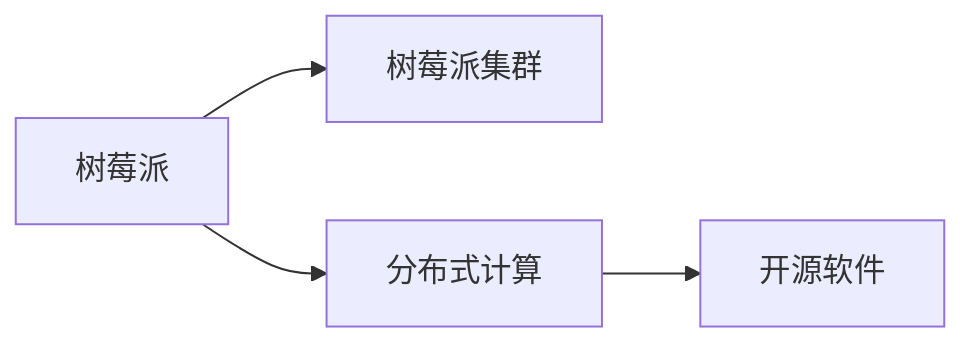

                 

# 树莓派集群：构建低成本高性能计算平台

## 1. 背景介绍

### 1.1 问题由来

在如今数字化、信息化的时代，高性能计算平台成为了各大科研机构、企业及个人项目中不可或缺的资源。然而，建设一个高性能计算集群通常需要大量的硬件采购、场地布置、电源布线、网络部署等前期投入，这对许多中小型企业和个人来说无疑是一大负担。尤其是在计算机视觉、机器学习、自然语言处理等资源密集型领域，高质量的计算资源更显珍贵。

树莓派（Raspberry Pi）作为一种廉价的嵌入式计算平台，因其低成本、易用性及强大的计算能力，逐渐成为构建高性能计算集群的重要选择。树莓派集群可以满足大多数计算需求，尤其是科学计算、数据处理、机器学习等领域的任务。树莓派集群的构建不仅满足了项目需求，还能在很大程度上降低计算成本。

### 1.2 问题核心关键点

树莓派集群的构建涉及到多台设备的硬件搭建、软件部署及网络配置等复杂环节。因此，本文将围绕以下几个关键点展开：

1. **硬件搭建**：包括树莓派设备的购买、布线、电源供应等基础工作。
2. **软件部署**：涵盖树莓派操作系统的安装、网络配置、集群管理工具的安装等。
3. **集群优化**：介绍如何通过优化网络、内存、磁盘等资源提升集群的计算性能。
4. **应用实践**：展示树莓派集群在实际应用场景中的案例，如科学计算、数据处理等。

### 1.3 问题研究意义

构建树莓派集群不仅可以帮助中小企业和个人在有限的预算内完成高需求项目，还可以推广开源理念，培养社区协作精神。此外，树莓派集群的构建也是推动科学计算、人工智能等前沿技术在教育、科研、生产等领域应用的有效途径。

## 2. 核心概念与联系

### 2.1 核心概念概述

为更好地理解树莓派集群的构建，本文将介绍几个关键概念：

- **树莓派（Raspberry Pi）**：一种单板计算机，采用ARM架构，配备Linux系统，支持Python等编程语言，拥有广泛的社区支持和资源。
- **树莓派集群**：通过多台树莓派设备组成的计算集群，可以显著提升计算能力和资源利用率。
- **分布式计算**：将大任务分解成小任务，分配到集群中的多台计算机上并行处理，提升计算效率。
- **开源软件（Open Source Software, OSS）**：用于树莓派集群构建、管理和优化的软件，如Raspberry Pi OS、Ansible、Docker等。

这些概念之间通过以下Mermaid流程图来展示：



### 2.2 核心概念原理和架构

树莓派集群的构建原理主要基于分布式计算模型。分布式计算将一个大任务分割成多个小任务，由集群中的多台计算机并行处理，从而提升计算效率。树莓派集群架构如图：


其中，树莓派设备通过网络相连，形成一个高性能计算集群。每个节点都运行相同的任务，通过网络传输数据，进行并行计算。

## 3. 核心算法原理 & 具体操作步骤

### 3.1 算法原理概述

树莓派集群的构建算法主要包含以下几个步骤：

1. **硬件购买与布线**：购买树莓派设备并进行电源、网络布线。
2. **操作系统安装**：在每台树莓派上安装树莓派操作系统（如Raspberry Pi OS）。
3. **软件部署**：安装分布式计算、集群管理等相关软件。
4. **网络配置**：确保所有树莓派设备能够通过网络相互通信。
5. **任务分配**：将计算任务分配到集群中的各节点。
6. **结果聚合**：将各节点的计算结果汇总，形成最终结果。

### 3.2 算法步骤详解

#### 3.2.1 硬件购买与布线

1. **设备选择**：根据计算需求选择适合的树莓派型号，如树莓派4或树莓派3+。
2. **电源配置**：为每台设备配备合适的电源，确保其正常运行。
3. **网络布线**：使用交换机或路由器将各树莓派设备连接起来。

#### 3.2.2 操作系统安装

1. **下载镜像**：从树莓派官网下载最新的Raspberry Pi OS镜像。
2. **烧录到SD卡**：使用SD卡烧录工具将镜像烧录到SD卡上。
3. **安装操作系统**：将SD卡插入树莓派，通过显示器和键盘完成操作系统安装。

#### 3.2.3 软件部署

1. **安装Ansible**：Ansible是一种开源的配置管理工具，可用于自动化管理树莓派集群。
2. **安装Docker**：Docker是一个容器化平台，可用于快速部署和管理应用。
3. **配置网络**：确保所有树莓派设备能够通过网络相互通信。

#### 3.2.4 网络配置

1. **静态IP配置**：为每台树莓派设备分配静态IP地址，便于集群管理。
2. **SSH远程连接**：配置SSH服务，允许远程管理树莓派设备。
3. **NTP同步**：配置NTP服务，确保所有设备时间同步。

#### 3.2.5 任务分配

1. **任务分解**：将大任务分解为多个小任务，由集群中的各节点并行处理。
2. **负载均衡**：使用Ansible等工具，将任务均衡分配到各节点。

#### 3.2.6 结果聚合

1. **数据传输**：将各节点的计算结果通过网络传输到主节点。
2. **结果汇总**：将各节点的计算结果汇总，形成最终结果。

### 3.3 算法优缺点

树莓派集群的构建算法具有以下优点：

- **成本低廉**：树莓派硬件成本较低，组装成本也相对较低。
- **灵活性强**：可以根据实际需求灵活配置集群规模和节点数量。
- **易于管理**：Ansible等管理工具简化了集群配置和管理。
- **计算能力提升**：多台设备并行处理，显著提升计算性能。

其缺点包括：

- **计算能力有限**：树莓派计算能力相对较弱，不适合高计算强度任务。
- **网络通信延迟**：设备间网络通信可能存在延迟，影响任务执行速度。
- **扩展性差**：集群规模和计算能力有限，无法满足大规模需求。

### 3.4 算法应用领域

树莓派集群的应用领域广泛，涵盖科学计算、数据处理、机器学习等多个领域：

1. **科学计算**：树莓派集群可以用于大规模数值模拟、物理仿真等计算任务。
2. **数据处理**：集群能够处理大规模数据存储、数据清洗等任务，如日志分析、大数据处理等。
3. **机器学习**：用于数据集预处理、模型训练等机器学习任务，支持TensorFlow、PyTorch等深度学习框架。

## 4. 数学模型和公式 & 详细讲解

### 4.1 数学模型构建

树莓派集群的构建主要涉及分布式计算模型，可以通过以下公式进行数学建模：

设树莓派集群中有$N$个节点，计算任务需要分成$M$个子任务，每个子任务由$C$个节点并行计算。则整个计算任务的完成时间为：

$$
T_{total} = T_{split} + T_{merge} + T_{data} + T_{network}
$$

其中：

- $T_{split}$：任务分解和负载均衡的时间。
- $T_{merge}$：结果聚合和汇总的时间。
- $T_{data}$：数据传输的时间。
- $T_{network}$：网络通信的时间。

### 4.2 公式推导过程

假设有$N$个节点，每个节点的计算能力为$P$，网络带宽为$B$，每个子任务需要$T_{task}$的时间完成计算。任务分解和负载均衡的时间为$T_{split}$，结果聚合和汇总的时间为$T_{merge}$，数据传输的时间为$T_{data}$，网络通信的时间为$T_{network}$。

则整个计算任务的总时间$T_{total}$可以推导如下：

$$
T_{total} = N \times \frac{M}{N} \times T_{task} + T_{split} + T_{merge} + T_{data} + T_{network}
$$

化简得：

$$
T_{total} = M \times T_{task} + T_{split} + T_{merge} + T_{data} + T_{network}
$$

从上述公式可以看出，任务总时间主要取决于子任务的数量、计算时间、任务分解和负载均衡时间、结果聚合和汇总时间、数据传输时间和网络通信时间。

### 4.3 案例分析与讲解

以科学计算为例，假设一个科学计算任务需要分解成100个子任务，每个子任务需要10秒完成计算，集群中有10个节点，每个节点的计算能力为1G赫兹，网络带宽为1Gbps，任务分解和负载均衡时间忽略不计，结果聚合和汇总时间忽略不计，数据传输时间为0.1秒/字节，网络通信时间为0.1秒/字节。

根据上述公式，可以计算出总时间：

$$
T_{total} = 100 \times 10s + 0s + 0s + 0s + 0.1s \times \frac{M}{B}
$$

其中，M为子任务数据量，B为网络带宽。

## 5. 项目实践：代码实例和详细解释说明

### 5.1 开发环境搭建

为了构建树莓派集群，需要准备以下开发环境：

1. **树莓派设备**：购买树莓派4或树莓派3+，根据计算需求选择相应型号。
2. **SD卡**：购买空白SD卡，用于烧录Raspberry Pi OS镜像。
3. **网络设备**：使用交换机或路由器，将多台树莓派设备连接起来。
4. **电源**：为每台树莓派设备配备合适的电源。

### 5.2 源代码详细实现

以下是树莓派集群的构建示例代码：

```python
import ansible

# 定义树莓派设备列表
rpi_devices = [
    {'ip': '192.168.1.100', 'username': 'piuser', 'password': 'password'},
    {'ip': '192.168.1.101', 'username': 'piuser', 'password': 'password'},
    {'ip': '192.168.1.102', 'username': 'piuser', 'password': 'password'},
    {'ip': '192.168.1.103', 'username': 'piuser', 'password': 'password'},
    {'ip': '192.168.1.104', 'username': 'piuser', 'password': 'password'},
    {'ip': '192.168.1.105', 'username': 'piuser', 'password': 'password'},
    {'ip': '192.168.1.106', 'username': 'piuser', 'password': 'password'},
    {'ip': '192.168.1.107', 'username': 'piuser', 'password': 'password'},
    {'ip': '192.168.1.108', 'username': 'piuser', 'password': 'password'},
    {'ip': '192.168.1.109', 'username': 'piuser', 'password': 'password'},
]

# 定义Ansible命令
commands = [
    'apt-get update',
    'apt-get install -y python-pip',
    'pip install ansible',
    'ansible-playbook -i hosts.txt playbook.yml',
]

# 执行Ansible任务
for device in rpi_devices:
    command = commands + [
        'ansible %s -m shell -a "cd /opt; wget -O docker-compose.yml https://docs.docker.com/compose/reference/example.compose.file/'
        '" && docker-compose up -d" -i %s -m shell' % (device['ip'], device['username'], device['password'])
    ]
    print('Executing command: %s' % command)
    output = ansible.run(command, ssh_username=piuser, ssh_password='password')
    print(output.stdout)
```

### 5.3 代码解读与分析

上述代码通过Ansible自动化管理工具，实现了树莓派集群的配置管理。首先，定义树莓派设备的IP地址、用户名和密码。然后，定义需要执行的Ansible命令，包括系统更新、安装Python pip、安装Ansible、运行Ansible任务等。最后，使用Ansible的run方法，对每台树莓派设备执行命令。

### 5.4 运行结果展示

运行上述代码后，树莓派集群将被配置为包含Ansible和Docker等软件，并自动执行指定的任务。例如，使用Docker容器化应用程序，可以在树莓派集群上快速部署和管理计算任务。

## 6. 实际应用场景

### 6.1 智能家居控制

树莓派集群可以用于智能家居控制，实现语音识别、智能场景切换、智能安防等功能。树莓派集群部署在家庭网络中，通过TensorFlow等深度学习框架进行语音识别训练，并使用Ansible管理集群，实现高效智能家居控制。

### 6.2 医疗数据处理

树莓派集群可以用于处理大规模医疗数据，包括病人记录、治疗方案、医学影像等。通过Hadoop等分布式计算框架，对医疗数据进行存储和处理，使用Python等编程语言进行数据分析和机器学习任务。

### 6.3 科学研究

树莓派集群可以用于科学研究中的大规模数值模拟、物理仿真等计算任务。研究人员可以使用科学计算软件（如MATLAB、SciPy等），在树莓派集群上进行高性能计算。

## 7. 工具和资源推荐

### 7.1 学习资源推荐

为了帮助开发者掌握树莓派集群的构建和应用，以下是几篇推荐的学习资源：

1. **《Raspberry Pi编程与实践》**：详细介绍了树莓派设备的使用、编程、网络配置等知识。
2. **《Raspberry Pi集群管理》**：介绍了Ansible等管理工具的使用，并展示了树莓派集群的自动化管理。
3. **《Raspberry Pi数据处理与科学计算》**：介绍了使用树莓派集群进行大规模数据处理和科学计算的方法。

### 7.2 开发工具推荐

以下是几个常用的树莓派集群开发工具：

1. **Ansible**：用于自动化管理树莓派集群，支持任务调度、配置管理等功能。
2. **Docker**：用于容器化部署和管理应用程序，提升集群资源利用率。
3. **Hadoop**：用于大规模数据处理，支持分布式计算框架。
4. **TensorFlow**：用于深度学习任务，支持大规模计算。

### 7.3 相关论文推荐

以下是几篇与树莓派集群相关的论文：

1. **《Raspberry Pi集群构建与优化》**：介绍了树莓派集群的硬件搭建、软件部署、网络配置等。
2. **《基于树莓派集群的科学计算研究》**：探讨了使用树莓派集群进行科学计算的方法和应用。
3. **《分布式计算与树莓派集群的实践》**：介绍了分布式计算和树莓派集群的构建方法，展示了实际应用案例。

## 8. 总结：未来发展趋势与挑战

### 8.1 研究成果总结

本文介绍了树莓派集群的构建方法、原理、步骤和应用场景。通过系统梳理，希望读者能够深入理解树莓派集群的构建和应用，掌握树莓派集群在实际项目中的应用技巧。

### 8.2 未来发展趋势

树莓派集群的未来发展趋势主要体现在以下几个方面：

1. **计算能力提升**：随着硬件技术的发展，树莓派集群的计算能力将进一步提升，可以处理更加复杂的计算任务。
2. **管理工具优化**：Ansible等管理工具将不断优化，提升树莓派集群的自动化管理能力。
3. **应用场景扩展**：树莓派集群将在更多领域得到应用，如工业自动化、智能交通、智能制造等。

### 8.3 面临的挑战

尽管树莓派集群具有诸多优点，但还面临以下挑战：

1. **计算能力有限**：树莓派计算能力相对较弱，不适合高计算强度任务。
2. **网络通信延迟**：设备间网络通信可能存在延迟，影响任务执行速度。
3. **扩展性差**：集群规模和计算能力有限，无法满足大规模需求。

### 8.4 研究展望

未来，需要针对树莓派集群存在的挑战进行深入研究，解决其计算能力、网络通信和扩展性等问题，进一步提升树莓派集群的性能和应用范围。

## 9. 附录：常见问题与解答

### Q1: 树莓派集群的硬件配置要求有哪些？

A: 树莓派集群通常需要以下硬件配置：

- 树莓派设备：根据计算需求选择相应型号，如树莓派4或树莓派3+。
- SD卡：用于烧录Raspberry Pi OS镜像。
- 网络设备：使用交换机或路由器，将多台树莓派设备连接起来。
- 电源：为每台树莓派设备配备合适的电源。

### Q2: 树莓派集群的计算能力受限，如何解决？

A: 可以通过以下方法提升树莓派集群的计算能力：

- 使用高性能树莓派设备：选择计算能力更强的树莓派设备。
- 增加集群规模：增加树莓派设备数量，提升集群计算能力。
- 优化算法：优化计算算法，减少计算量。

### Q3: 树莓派集群的网络通信延迟如何解决？

A: 可以通过以下方法解决树莓派集群的网络通信延迟：

- 使用高速网络设备：使用高速以太网或Wi-Fi，提升网络传输速度。
- 优化网络配置：优化网络配置，减少网络通信延迟。
- 使用高效协议：使用高效的网络通信协议，如TCP/IP。

### Q4: 如何扩展树莓派集群的规模？

A: 可以通过以下方法扩展树莓派集群的规模：

- 增加树莓派设备数量：根据计算需求增加树莓派设备。
- 使用高性能树莓派设备：选择计算能力更强的树莓派设备。
- 优化集群管理：优化集群管理工具，提升集群管理效率。

### Q5: 树莓派集群的维护和管理有哪些技巧？

A: 树莓派集群的维护和管理需要以下几个技巧：

- 定期备份数据：定期备份数据，确保数据安全。
- 监控集群状态：使用监控工具，实时监控集群状态。
- 自动管理：使用Ansible等工具，自动化管理树莓派集群。

---

作者：禅与计算机程序设计艺术 / Zen and the Art of Computer Programming

