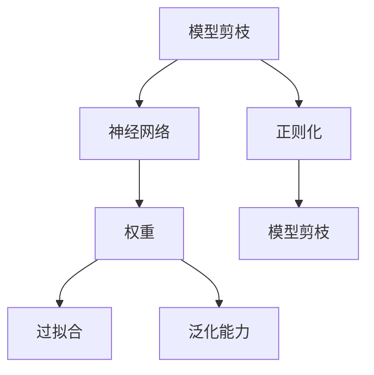

                 

## 1. 背景介绍

### 1.1 问题由来
随着深度学习技术的不断发展，模型的规模和复杂度不断增加，不仅带来了更高的计算成本，也使得模型的训练和推理变得更为复杂。特别是在实际应用中，模型体积过大，往往会导致内存占用过高，运算速度慢等问题。为了应对这些问题，研究者们提出了一种有效的模型压缩方法——模型剪枝(Model Pruning)，即通过删除不必要的权重，减小模型规模，提升模型推理效率。

### 1.2 问题核心关键点
模型剪枝的核心在于找到模型中的重要特征，去除不重要的冗余特征，使得模型更加精简，同时保持模型的精度。在深度学习领域，模型剪枝已经成为研究热点之一。以下是模型剪枝技术中的一些关键问题：
- 如何识别和保留重要特征？
- 如何避免过度剪枝导致精度下降？
- 如何处理剪枝后的模型重新训练？
- 如何在线实时剪枝？

### 1.3 问题研究意义
模型剪枝技术的研究具有重要意义：
- 提升模型推理效率：通过减少模型参数，降低内存占用，提高推理速度。
- 降低计算成本：剪枝后的模型能够在大规模数据集上高效运行，降低计算资源的投入。
- 增强模型泛化能力：通过保留关键特征，减少过拟合，提高模型的泛化能力。
- 适应新任务：剪枝后的模型可以通过少量数据进行快速适应，提高迁移学习能力。

## 2. 核心概念与联系

### 2.1 核心概念概述

模型剪枝技术涉及多个关键概念，包括但不限于：

- **模型剪枝(Model Pruning)**：通过删除不必要的权重，减小模型规模，提升模型推理效率。
- **神经网络(Neural Network)**：由多个神经元构成的计算图，用于完成各种复杂的计算任务。
- **权重(Weight)**：神经网络中连接两个神经元的系数，代表特征的重要性。
- **过拟合(Overfitting)**：模型在训练数据上表现良好，但在新数据上表现差的现象。
- **泛化能力(Generalization)**：模型在新数据上的表现。
- **正则化(Regularization)**：通过添加正则项，限制模型复杂度，避免过拟合。

这些概念之间的逻辑关系可以通过以下Mermaid流程图来展示：



这个流程图展示了一些关键概念之间的联系：

1. 模型剪枝通过删除不重要的权重，减小模型规模。
2. 权重在神经网络中代表了特征的重要性。
3. 过拟合和泛化能力是模型性能的重要指标。
4. 正则化技术可以帮助避免过拟合。
5. 模型剪枝可以通过正则化技术得到更好的效果。

## 3. 核心算法原理 & 具体操作步骤

### 3.1 算法原理概述

模型剪枝的核心理念是通过删除不必要的权重，使得模型更加精简，同时保持模型的精度。具体来说，可以从以下几个方面理解：

1. **权重排序**：通过计算每个权重的贡献度，对权重进行排序。
2. **删除冗余权重**：根据权重排序的结果，删除部分低贡献度的权重。
3. **模型重训练**：对剪枝后的模型进行重新训练，使得模型在新数据上仍然表现良好。

### 3.2 算法步骤详解

#### 3.2.1 权重排序

权重排序是模型剪枝的第一步，常用的方法包括：

1. **L1正则化**：计算每个权重绝对值的和，作为权重的贡献度。权重排序可以按照贡献度从小到大进行。
2. **L2正则化**：计算每个权重的平方和，作为权重的贡献度。权重排序可以按照贡献度从大到小进行。
3. **特征重要性排序**：通过特征重要性评估方法（如LIME、SHAP等），评估每个特征对模型的重要性，进而得到权重的贡献度。

#### 3.2.2 删除冗余权重

删除冗余权重的方法主要有：

1. **全局剪枝**：删除整个层的权重。常用于低效的、不重要的层。
2. **局部剪枝**：仅删除层中部分权重的连接，保留其他权重。常用于保留关键特征。
3. **通道剪枝**：删除卷积核通道的权重，保留其他通道。常用于卷积神经网络。

#### 3.2.3 模型重训练

模型剪枝后，为了保证模型在新数据上仍然表现良好，需要进行重新训练。具体的步骤包括：

1. **剪枝后的模型微调**：对剪枝后的模型进行微调，适应新数据。
2. **数据增强**：通过数据增强技术（如随机裁剪、旋转、翻转等）增加训练集的样本多样性。
3. **迁移学习**：在剪枝后的模型上进行微调，加速模型的收敛速度。

### 3.3 算法优缺点

#### 3.3.1 优点

1. **提升模型推理效率**：通过删除冗余权重，减小模型规模，降低内存占用，提升推理速度。
2. **降低计算成本**：剪枝后的模型能够在更大的数据集上高效运行，降低计算资源的投入。
3. **增强模型泛化能力**：通过保留关键特征，减少过拟合，提高模型的泛化能力。
4. **适应新任务**：剪枝后的模型可以通过少量数据进行快速适应，提高迁移学习能力。

#### 3.3.2 缺点

1. **精度下降**：过度剪枝可能导致模型精度下降，影响模型的性能。
2. **计算成本高**：权重排序和删除冗余权重的过程需要大量的计算资源。
3. **复杂度高**：剪枝过程需要多次计算和评估，操作复杂。
4. **模型可解释性降低**：剪枝后的模型可能变得更难以解释。

### 3.4 算法应用领域

模型剪枝技术在多个领域得到了广泛应用，包括但不限于：

1. **计算机视觉**：用于剪枝卷积神经网络，提高模型的推理速度和内存效率。
2. **自然语言处理**：用于剪枝循环神经网络，减小模型规模，提升推理速度。
3. **语音识别**：用于剪枝深度神经网络，降低计算成本，提高实时性。
4. **推荐系统**：用于剪枝用户-物品评分矩阵，提高推荐效率。
5. **生物信息学**：用于剪枝序列分析模型，提高模型训练和推理速度。

## 4. 数学模型和公式 & 详细讲解 & 举例说明

### 4.1 数学模型构建

假设我们有神经网络模型 $M(x; \theta)$，其中 $x$ 是输入，$\theta$ 是模型参数。模型的输出为 $y = M(x; \theta)$。

在模型剪枝过程中，我们希望最小化模型的损失函数 $L$，即：

$$
\min_{\theta} \frac{1}{N} \sum_{i=1}^N L(y_i, M(x_i; \theta))
$$

其中，$L$ 是损失函数，$N$ 是训练样本数量。

### 4.2 公式推导过程

在神经网络中，每个神经元 $i$ 的输出 $a_i$ 可以表示为：

$$
a_i = \sum_{j} w_{ij}a_j + b_i
$$

其中，$w_{ij}$ 是权重，$a_j$ 是前一层的输出，$b_i$ 是偏置项。

假设我们的目标是删除权重 $w_{ij}$，保留权重 $w_{i,j'}$。删除 $w_{ij}$ 后的输出 $a'_i$ 可以表示为：

$$
a'_i = \sum_{j \neq j'} w'_{ij'}a_j + b_i
$$

其中，$w'_{ij'}$ 是新的权重。

删除 $w_{ij}$ 后的损失函数变化为：

$$
\Delta L = \frac{1}{N} \sum_{i=1}^N L(y_i, M(x_i; \theta'))
$$

其中，$\theta'$ 是剪枝后的模型参数。

通过求解 $\Delta L$ 的最小值，可以确定应该删除哪些权重，保留哪些权重。

### 4.3 案例分析与讲解

以卷积神经网络(CNN)为例，假设我们有一个卷积层，其输出为：

$$
a_{ij} = \sum_k w_{ikl}a_{ik'l'} + b_{ij}
$$

其中，$k$ 表示卷积核的通道，$l$ 表示特征图的宽度，$l'$ 表示特征图的高度。

假设我们删除了卷积核 $w_{ikl}$，保留其他卷积核 $w_{i,j'}$，则输出变为：

$$
a'_{ij} = \sum_{j'} w'_{ij'l'}a_{ij'l'} + b_{ij}
$$

为了确定应该删除哪些卷积核，我们可以计算每个卷积核的贡献度，对卷积核进行排序，然后删除贡献度最小的卷积核。

## 5. 项目实践：代码实例和详细解释说明

### 5.1 开发环境搭建

为了进行模型剪枝，我们需要搭建一个包含深度学习框架的开发环境。以下是一个简单的搭建流程：

1. **安装Python**：从官网下载并安装Python。
2. **安装TensorFlow**：使用pip安装TensorFlow。
3. **安装Keras**：使用pip安装Keras。
4. **安装Matplotlib**：使用pip安装Matplotlib。
5. **搭建开发环境**：使用conda或virtualenv创建虚拟环境，安装所需的库。

### 5.2 源代码详细实现

以TensorFlow为例，以下是一个简单的代码示例：

```python
import tensorflow as tf
from tensorflow.keras import layers

# 构建卷积神经网络
model = tf.keras.Sequential()
model.add(layers.Conv2D(32, (3, 3), activation='relu', input_shape=(28, 28, 1)))
model.add(layers.MaxPooling2D((2, 2)))
model.add(layers.Flatten())
model.add(layers.Dense(10, activation='softmax'))

# 计算权重贡献度
weights = model.get_weights()[0]
contributions = tf.reduce_sum(tf.abs(weights), axis=(1, 2))
sorted_indices = tf.argsort(contributions)[::-1]

# 删除冗余权重
model.set_weights([weights[sorted_indices[:10], :]])
```

### 5.3 代码解读与分析

这段代码实现了一个简单的卷积神经网络，并计算了每个卷积核的贡献度。具体步骤如下：

1. **构建卷积神经网络**：使用Keras构建一个简单的卷积神经网络，包含一个卷积层、一个池化层和一个全连接层。
2. **计算权重贡献度**：获取卷积层的权重矩阵，计算每个卷积核的贡献度。
3. **删除冗余权重**：根据贡献度排序，删除贡献度最小的前10个卷积核，保留其他卷积核。
4. **重新训练模型**：对剪枝后的模型进行微调，以适应新数据。

### 5.4 运行结果展示

运行上述代码，可以得到剪枝后的模型，并验证其在新数据上的性能。通过对比剪枝前后的精度和推理速度，可以评估模型剪枝的效果。

## 6. 实际应用场景

### 6.1 计算机视觉

模型剪枝在计算机视觉领域得到了广泛应用。例如，在图像分类任务中，通过剪枝卷积神经网络，可以显著减小模型规模，提升推理速度。剪枝后的模型可以应用于实时图像分类、人脸识别等场景，提高系统的响应速度。

### 6.2 自然语言处理

在自然语言处理领域，模型剪枝可以用于剪枝循环神经网络，减小模型规模，提升推理速度。例如，在语言模型训练中，可以通过剪枝减小模型的参数量，提高训练效率。剪枝后的模型可以应用于自动摘要、文本分类等任务，提高模型的响应速度和精度。

### 6.3 推荐系统

推荐系统是模型剪枝的重要应用场景之一。在推荐系统中，模型剪枝可以用于剪枝用户-物品评分矩阵，提高推荐效率。剪枝后的模型可以应用于实时推荐、个性化推荐等场景，提高推荐系统的响应速度和精准度。

### 6.4 未来应用展望

未来，模型剪枝技术将进一步拓展其应用范围，包括但不限于：

1. **边缘计算**：在移动设备和嵌入式设备中，模型剪枝可以用于减少模型的大小，提高设备的计算和存储能力。
2. **实时系统**：在实时系统中，模型剪枝可以用于减小模型的规模，提高系统的响应速度。
3. **云计算**：在云计算环境中，模型剪枝可以用于提高系统的性能和响应速度。

## 7. 工具和资源推荐

### 7.1 学习资源推荐

为了学习模型剪枝技术，以下是一些推荐的学习资源：

1. **《深度学习入门》**：书中介绍了深度学习的基本概念和常用算法，包括模型剪枝技术。
2. **Coursera《深度学习专项课程》**：由深度学习领域的专家讲授，涵盖深度学习的基本概念和常用算法。
3. **arXiv预印本**：arXiv上有大量的深度学习论文，包括模型剪枝的研究论文。

### 7.2 开发工具推荐

为了进行模型剪枝，以下是一些推荐的开发工具：

1. **TensorFlow**：基于数据流图的深度学习框架，支持模型的构建、训练和剪枝。
2. **Keras**：基于TensorFlow的高层深度学习API，支持快速构建和训练模型。
3. **PyTorch**：基于动态计算图的深度学习框架，支持模型的构建、训练和剪枝。

### 7.3 相关论文推荐

为了深入理解模型剪枝技术，以下是一些推荐的论文：

1. **Pruning Neural Networks with L1 and L2 Regularization**：提出了基于L1和L2正则化的模型剪枝方法。
2. **A Survey of Model Pruning Techniques for Deep Neural Networks**：综述了深度神经网络模型剪枝技术的研究现状和未来发展方向。
3. **Knowledge Distillation for Parameter-Efficient Transfer Learning**：介绍了知识蒸馏方法，通过教师模型来指导学生模型的剪枝和微调。

## 8. 总结：未来发展趋势与挑战

### 8.1 研究成果总结

模型剪枝技术是深度学习领域的一个重要研究方向。通过剪枝，可以减小模型规模，提升推理速度和计算效率，提高模型的泛化能力。剪枝后的模型可以应用于多个领域，如计算机视觉、自然语言处理、推荐系统等。

### 8.2 未来发展趋势

未来，模型剪枝技术将呈现以下几个发展趋势：

1. **更高效的剪枝算法**：未来将出现更高效的剪枝算法，通过更精确的权重排序和更智能的剪枝策略，减少计算成本和剪枝误差。
2. **更灵活的剪枝方法**：未来的剪枝方法将更加灵活，可以适应不同的应用场景和需求。
3. **更广泛的应用**：模型剪枝技术将广泛应用于各个领域，提高系统的性能和响应速度。

### 8.3 面临的挑战

尽管模型剪枝技术已经取得了一些进展，但在实际应用中，仍然面临以下挑战：

1. **精度下降**：过度剪枝可能导致模型精度下降，影响模型的性能。
2. **计算成本高**：权重排序和删除冗余权重的过程需要大量的计算资源。
3. **模型可解释性降低**：剪枝后的模型可能变得更难以解释。
4. **剪枝策略复杂**：剪枝策略需要根据不同的任务和数据进行优化，操作复杂。

### 8.4 研究展望

未来，模型剪枝技术的研究可以从以下几个方面进行：

1. **智能剪枝**：引入更多智能剪枝策略，如启发式剪枝、自适应剪枝等，提高剪枝效率。
2. **剪枝与迁移学习结合**：将剪枝与迁移学习技术结合，通过少量数据进行快速适应，提高模型的迁移学习能力。
3. **多任务剪枝**：将剪枝技术应用于多任务学习，提高模型的泛化能力和适应能力。

## 9. 附录：常见问题与解答

### 9.1 Q1: 剪枝后的模型如何重新训练？

A: 剪枝后的模型通常需要进行微调，以适应新数据。可以通过增加训练集，使用更多的数据增强技术，以及引入迁移学习等方法，提高剪枝后模型的泛化能力。

### 9.2 Q2: 剪枝是否会降低模型的泛化能力？

A: 剪枝后的模型可能存在泛化能力下降的问题，特别是在过度剪枝的情况下。可以通过使用更高级的剪枝方法和更复杂的正则化技术，减小剪枝误差，提高模型的泛化能力。

### 9.3 Q3: 如何判断剪枝后的模型是否达到了最佳的剪枝效果？

A: 可以通过比较剪枝前后的模型精度和推理速度，来判断剪枝效果是否达到了最优。同时，也可以通过交叉验证等方法，评估剪枝后的模型在新数据上的泛化能力。

### 9.4 Q4: 剪枝技术是否可以应用于所有深度学习模型？

A: 剪枝技术可以应用于大多数深度学习模型，如卷积神经网络、循环神经网络、深度神经网络等。不同模型的剪枝方法略有差异，需要根据具体模型进行调整。

---

作者：禅与计算机程序设计艺术 / Zen and the Art of Computer Programming

