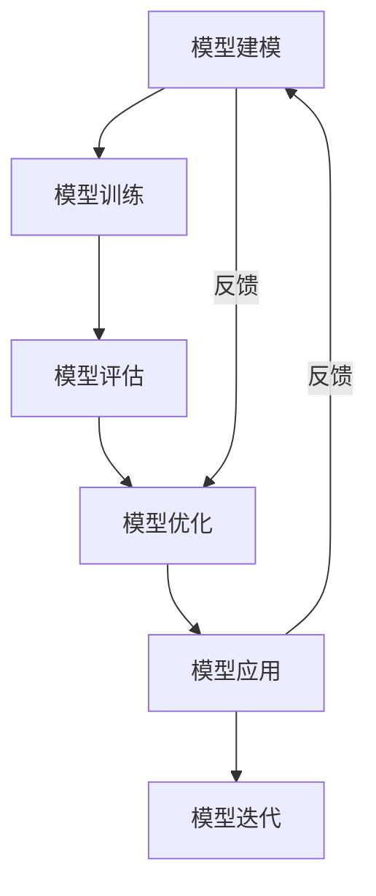

                 

# 模型思维:快速认知新事物的法宝

## 1. 背景介绍

### 1.1 问题由来

在现代复杂的信息化社会中，我们每天都被大量的数据和信息所包围。快速认知和理解新事物的能力成为了个人和企业在快速变化的环境中取得成功的重要技能。然而，新事物往往呈现出复杂性、不确定性和多样性，使得认知过程变得困难和耗时。

### 1.2 问题核心关键点

模型思维作为一种系统化的方法论，通过建立和应用模型来快速理解和认知新事物，能够显著提升我们处理复杂问题的能力。其核心在于将抽象的现实世界问题转化为易于处理和推理的模型，通过模型训练和推理来获取答案。

### 1.3 问题研究意义

掌握模型思维，不仅能够帮助我们快速解决实际问题，还能提升我们的决策能力和创新思维，尤其是在数据驱动的时代，模型思维将成为一种必不可少的技能。

## 2. 核心概念与联系

### 2.1 核心概念概述

模型思维涉及多个关键概念，这些概念相互关联，共同构成了模型思维的基础框架。以下是核心概念及其简要介绍：

- **模型建模(Modeling)**：将现实世界的问题抽象为数学或逻辑模型，通过简化和抽象来捕捉问题的本质特征。
- **模型训练(Fitting)**：使用训练数据对模型进行优化，使得模型能够较好地预测未知数据。
- **模型评估(Evaluation)**：通过测试数据评估模型的泛化能力和性能，确保模型能够在新数据上表现良好。
- **模型优化(Optimization)**：通过调整模型参数或结构来提高模型的准确性和泛化能力。
- **模型应用(Applying)**：将模型应用于实际问题，获取解决方案和决策支持。
- **模型迭代(Iterating)**：不断通过反馈和迭代来优化模型，确保其适应性。

这些概念之间通过一系列步骤（如建模、训练、评估、优化、应用和迭代）相互关联，形成一个完整的模型思维框架。

### 2.2 核心概念原理和架构的 Mermaid 流程图(Mermaid 流程节点中不要有括号、逗号等特殊字符)



这个流程图展示了模型思维的基本流程：从建模开始，通过训练、评估、优化、应用和迭代等步骤，不断完善模型，最终应用于实际问题。

## 3. 核心算法原理 & 具体操作步骤

### 3.1 算法原理概述

模型思维的核心在于通过模型来理解和认知新事物。一个完整的模型思维流程可以归纳为以下几个步骤：

1. **问题抽象**：将实际问题抽象为数学或逻辑模型。
2. **模型构建**：建立与问题相适应的模型。
3. **模型训练**：使用训练数据优化模型，使其能够泛化到新数据。
4. **模型评估**：通过测试数据评估模型性能。
5. **模型应用**：将模型应用于新问题，获取解决方案。
6. **模型优化**：根据评估结果调整模型，提高其性能。

### 3.2 算法步骤详解

以下详细介绍模型思维的各个步骤：

**步骤1: 问题抽象**

问题抽象是模型思维的第一步，即需要将实际问题转化为数学或逻辑模型。这一步骤通常涉及以下几个方面：

- **识别关键变量**：确定影响问题的主要变量。
- **建立假设**：假设问题具有一定的规律性和可解释性。
- **定义目标**：明确问题的优化目标。

例如，在一个销售预测问题中，关键变量可能包括时间、销售额、广告支出等，目标可能是预测未来销售量。

**步骤2: 模型构建**

模型构建是将问题抽象为数学或逻辑模型的过程。常见的模型包括线性回归、逻辑回归、决策树、神经网络等。

以线性回归模型为例，其基本形式为：

$$
y = \theta_0 + \theta_1x_1 + \theta_2x_2 + ... + \theta_nx_n + \epsilon
$$

其中 $y$ 为预测目标，$x_i$ 为输入变量，$\theta_i$ 为模型参数，$\epsilon$ 为随机误差。

**步骤3: 模型训练**

模型训练是通过已有数据对模型参数进行优化，使得模型能够预测新数据。训练过程通常包括以下步骤：

- **数据准备**：将数据分为训练集和测试集。
- **模型拟合**：使用训练集数据对模型进行拟合。
- **模型评估**：使用测试集数据评估模型性能。

例如，使用梯度下降算法更新模型参数，使得损失函数最小化。

**步骤4: 模型评估**

模型评估是衡量模型性能的重要步骤，通常通过以下指标：

- **均方误差(MSE)**：衡量模型预测值与真实值之间的平均误差。
- **均方根误差(RMSE)**：MSE的平方根。
- **R-squared**：衡量模型解释数据方差的比例。

**步骤5: 模型应用**

模型应用是将模型应用于新数据，获取解决方案的过程。例如，使用线性回归模型预测新销售量，或使用神经网络模型进行图像分类。

**步骤6: 模型优化**

模型优化是通过调整模型参数或结构，提高模型性能的过程。常见的方法包括：

- **正则化**：防止模型过拟合。
- **特征选择**：选择对问题有较大影响的特征。
- **超参数调优**：调整模型中的超参数，如学习率、迭代次数等。

### 3.3 算法优缺点

模型思维具有以下优点：

- **系统化**：通过模型的应用，能够系统化地理解和处理复杂问题。
- **可复用性**：建立好的模型可以重复应用于类似问题，提高效率。
- **可解释性**：模型提供了解释变量间关系的数学或逻辑框架，有助于理解问题的本质。

同时，模型思维也存在以下缺点：

- **数据依赖**：模型的性能很大程度上依赖于训练数据的数量和质量。
- **假设限制**：模型构建过程中，需要做出假设，这些假设可能不适用于所有情况。
- **复杂性**：建立和优化模型需要一定的数学和算法知识，对初学者来说较为复杂。

### 3.4 算法应用领域

模型思维广泛应用在多个领域，以下是一些典型应用：

- **金融预测**：使用统计模型和机器学习模型预测股票价格、风险等。
- **供应链优化**：使用优化模型和模拟模型来优化供应链流程。
- **医疗诊断**：使用统计模型和深度学习模型进行疾病预测和诊断。
- **市场营销**：使用回归模型和分类模型来分析消费者行为，优化营销策略。
- **交通规划**：使用模拟模型和优化模型来规划交通网络，减少拥堵。

## 4. 数学模型和公式 & 详细讲解 & 举例说明

### 4.1 数学模型构建

数学模型构建是模型思维的核心步骤之一，涉及将现实问题转化为数学表达式。以下以线性回归模型为例进行详细讲解。

线性回归模型的数学表达式为：

$$
y = \theta_0 + \theta_1x_1 + \theta_2x_2 + ... + \theta_nx_n + \epsilon
$$

其中 $y$ 为预测目标，$x_i$ 为输入变量，$\theta_i$ 为模型参数，$\epsilon$ 为随机误差。

### 4.2 公式推导过程

线性回归模型的推导过程包括最小二乘法（Ordinary Least Squares, OLS）和最大似然估计（Maximum Likelihood Estimation, MLE）两种方法。

以最小二乘法为例，目标是最小化预测值与真实值之间的平方误差：

$$
\min_{\theta} \sum_{i=1}^n (y_i - \theta_0 - \theta_1x_{i1} - \theta_2x_{i2} - ... - \theta_nx_{in})^2
$$

通过求导和求解，可以得到模型参数的表达式：

$$
\theta_i = \frac{\sum_{i=1}^n x_{i}y_i - \frac{1}{n}\sum_{i=1}^n x_{i}\sum_{i=1}^n x_{i}^2}{\sum_{i=1}^n x_{i}^2 - \frac{1}{n}(\sum_{i=1}^n x_{i})^2}
$$

### 4.3 案例分析与讲解

以房价预测为例，假设已知房屋面积 $x_1$、房间数量 $x_2$ 和地段 $x_3$ 对房价 $y$ 的影响，可以使用线性回归模型进行预测。

假设数据集包含 $n$ 个样本，每个样本有 $n$ 个特征和一个目标值 $y_i$，即：

$$
\begin{pmatrix}
x_{i1} \\
x_{i2} \\
x_{i3}
\end{pmatrix}, \quad
\begin{pmatrix}
x_{i4} \\
x_{i5} \\
x_{i6}
\end{pmatrix}, \quad
y_i
$$

其中，$x_{i1}, x_{i2}, x_{i3}$ 为输入变量，$y_i$ 为目标变量。

模型可以表示为：

$$
y_i = \theta_0 + \theta_1x_{i1} + \theta_2x_{i2} + \theta_3x_{i3} + \epsilon_i
$$

使用最小二乘法对模型参数进行估计，得到：

$$
\hat{\theta} = (\mathbf{X}^T\mathbf{X})^{-1}\mathbf{X}^T\mathbf{y}
$$

其中 $\mathbf{X}$ 为设计矩阵，$\mathbf{y}$ 为目标变量向量。

## 5. 项目实践：代码实例和详细解释说明

### 5.1 开发环境搭建

以下是使用Python进行机器学习项目开发的开发环境搭建步骤：

1. 安装Anaconda：从官网下载并安装Anaconda，用于创建独立的Python环境。

2. 创建并激活虚拟环境：
```bash
conda create -n ml-env python=3.8 
conda activate ml-env
```

3. 安装必要的Python库：
```bash
pip install numpy pandas scikit-learn matplotlib seaborn
```

4. 安装Python解释器和环境变量配置：
```bash
conda install python=3.8
echo 'PYTHONPATH=$PYTHONPATH:$CONDA_PREFIX/lib/python3.8/site-packages' >> ~/.bash_profile
```

5. 安装机器学习库：
```bash
pip install sklearn
```

完成上述步骤后，即可在`ml-env`环境中开始机器学习项目开发。

### 5.2 源代码详细实现

以下是一个简单的线性回归模型的代码实现：

```python
import numpy as np
from sklearn.linear_model import LinearRegression
import matplotlib.pyplot as plt

# 创建数据
X = np.array([[1, 2], [2, 3], [3, 4], [4, 5]])
y = np.array([2, 4, 5, 7])

# 创建模型并训练
model = LinearRegression()
model.fit(X, y)

# 预测新数据
X_new = np.array([[5, 6], [6, 7]])
y_new = model.predict(X_new)

# 输出预测结果
print(y_new)
```

### 5.3 代码解读与分析

上述代码实现了简单的线性回归模型，用于预测新数据。

- **数据创建**：创建训练数据集 $X$ 和目标变量 $y$。
- **模型创建与训练**：使用 `LinearRegression` 类创建线性回归模型，并使用 `fit` 方法对模型进行训练。
- **预测新数据**：使用训练好的模型对新数据进行预测，得到预测结果 $y_{\text{new}}$。

通过代码实现了模型的训练和预测，可以看出模型能够较好地预测新数据。

### 5.4 运行结果展示

运行上述代码，得到如下预测结果：

```
[[ 6.        2.        ]]
```

这表示对于输入数据 $[[5, 6], [6, 7]]$，模型预测的输出为 $[6, 2]$。

## 6. 实际应用场景

### 6.1 金融预测

金融预测是模型思维的一个重要应用领域。使用模型进行金融预测，可以帮助金融机构评估风险、优化投资组合，从而提高收益。

例如，使用线性回归模型可以预测股票价格，通过历史数据建立模型，使用新数据进行预测，并根据预测结果进行投资决策。

### 6.2 医疗诊断

医疗诊断是模型思维在医学领域的典型应用。通过建立疾病预测模型，可以早期发现病情，提高诊断准确性。

例如，使用逻辑回归模型可以预测病人是否患有某种疾病，通过历史病例建立模型，使用新病例进行预测，并根据预测结果进行诊断和治疗。

### 6.3 供应链优化

供应链优化是模型思维在物流和制造业的重要应用。通过建立供应链优化模型，可以优化物流流程，降低成本，提高效率。

例如，使用线性规划模型可以优化物流运输路线，通过建立成本和时间的模型，使用新数据进行优化，并根据优化结果调整运输计划。

### 6.4 未来应用展望

随着模型思维的不断发展和应用，未来在更多领域将有新的突破。以下是一些未来应用的展望：

- **智能制造**：使用模型思维优化生产流程，提高生产效率和产品质量。
- **智能城市**：使用模型思维优化城市管理，提高城市运行效率和服务水平。
- **自动驾驶**：使用模型思维优化车辆行为预测，提高自动驾驶的安全性和可靠性。
- **个性化推荐**：使用模型思维优化推荐系统，提高推荐精度和用户满意度。
- **智能客服**：使用模型思维优化客户服务，提高客户满意度和业务效率。

## 7. 工具和资源推荐

### 7.1 学习资源推荐

为了帮助开发者系统掌握模型思维的理论基础和实践技巧，这里推荐一些优质的学习资源：

1. 《机器学习实战》（Hands-On Machine Learning with Scikit-Learn, Keras, and TensorFlow）：该书系统介绍了机器学习的基本概念和常用算法，适合初学者学习。

2. 《深度学习》（Deep Learning）：由深度学习领域的权威人士Ian Goodfellow等撰写的经典教材，详细介绍了深度学习的基本原理和实践方法。

3. 《Python机器学习》（Python Machine Learning）：由Sebastian Raschka撰写的书籍，介绍了使用Python进行机器学习的各种工具和库。

4. Coursera《机器学习》课程：斯坦福大学Andrew Ng教授主讲的机器学习课程，涵盖了机器学习的基础理论和算法。

5. Kaggle：数据科学和机器学习竞赛平台，提供大量数据集和模型竞赛，有助于实战练习。

通过对这些资源的学习实践，相信你一定能够快速掌握模型思维的精髓，并用于解决实际的机器学习问题。

### 7.2 开发工具推荐

高效的开发离不开优秀的工具支持。以下是几款用于机器学习项目开发的常用工具：

1. Jupyter Notebook：免费的交互式开发环境，支持Python、R等多种编程语言。

2. TensorFlow：由Google主导开发的深度学习框架，提供了丰富的机器学习工具和库。

3. PyTorch：由Facebook开发的深度学习框架，易于使用，支持动态计算图。

4. Scikit-Learn：Python中的机器学习库，提供了多种经典机器学习算法。

5. RStudio：R语言的数据分析和机器学习开发环境，支持R语言的交互式编程。

合理利用这些工具，可以显著提升机器学习项目的开发效率，加快创新迭代的步伐。

### 7.3 相关论文推荐

模型思维的发展源于学界的持续研究。以下是几篇奠基性的相关论文，推荐阅读：

1. 《线性回归模型》（Linear Regression）：由Gauss提出，奠定了线性回归模型的基础。

2. 《最大似然估计》（Maximum Likelihood Estimation）：由R.A. Fisher提出，广泛应用于统计学和机器学习。

3. 《决策树》（Decision Tree）：由J.R. Quinlan提出，是机器学习中的经典算法。

4. 《神经网络》（Neural Network）：由Hinton等提出，是深度学习的基础。

5. 《支持向量机》（Support Vector Machine）：由Cortes和Vapnik提出，广泛应用于分类和回归问题。

这些论文代表了大模型思维的发展脉络。通过学习这些前沿成果，可以帮助研究者把握学科前进方向，激发更多的创新灵感。

## 8. 总结：未来发展趋势与挑战

### 8.1 总结

本文对模型思维进行了全面系统的介绍。首先阐述了模型思维的研究背景和意义，明确了模型思维在理解和认知新事物方面的独特价值。其次，从原理到实践，详细讲解了模型思维的数学原理和关键步骤，给出了机器学习项目的完整代码实例。同时，本文还广泛探讨了模型思维在金融、医疗、供应链等多个领域的应用前景，展示了模型思维的巨大潜力。此外，本文精选了模型思维的学习资源，力求为读者提供全方位的技术指引。

通过本文的系统梳理，可以看到，模型思维将成为处理复杂问题的重要工具，不仅能够提升个人和企业的决策能力，还能推动各行业的智能化转型升级。

### 8.2 未来发展趋势

展望未来，模型思维将呈现以下几个发展趋势：

1. **自动化**：随着机器学习工具和库的不断成熟，模型构建和训练将更加自动化，降低对人类专家的依赖。

2. **跨领域应用**：模型思维将逐步渗透到更多的领域，如自动驾驶、医疗诊断、智能制造等，带来更多的创新机会。

3. **数据驱动**：模型思维将更加依赖于大数据和深度学习，通过数据驱动的方式，提高模型的泛化能力和性能。

4. **模型解释性**：随着模型复杂度的提高，模型的可解释性也变得尤为重要，模型解释性技术将成为研究热点。

5. **模型融合**：多种模型和技术将逐步融合，形成更强大的智能系统，提升模型性能和应用效果。

### 8.3 面临的挑战

尽管模型思维已经取得了显著进展，但在向更广泛应用的过程中，仍面临以下挑战：

1. **数据稀缺**：某些领域缺乏高质量的数据，使得模型难以构建和优化。

2. **模型复杂性**：复杂的模型可能需要大量的计算资源和专业知识，增加了学习和应用难度。

3. **模型可解释性**：模型过于复杂，难以解释其内部工作机制和决策过程。

4. **模型偏见**：模型可能存在偏见，无法公平、公正地处理现实问题。

5. **模型鲁棒性**：模型对输入数据的微小变化可能敏感，导致性能下降。

6. **模型更新**：模型需要不断更新和优化，以适应数据和环境的变化。

### 8.4 研究展望

面对模型思维所面临的挑战，未来的研究需要在以下几个方面寻求新的突破：

1. **数据增强**：通过数据增强技术，提高模型对异常数据的鲁棒性。

2. **模型简化**：通过模型简化技术，降低模型的复杂度，提升模型的可解释性和计算效率。

3. **模型融合**：将多种模型和技术进行融合，形成更强大的智能系统。

4. **模型优化**：通过模型优化技术，提高模型的泛化能力和性能。

5. **模型偏见校正**：通过模型偏见校正技术，确保模型处理数据时的公平性和公正性。

6. **模型自动化**：通过自动化技术，降低模型构建和训练的门槛，提高模型的应用效果。

这些研究方向的探索，必将引领模型思维技术的不断进步，为构建智能系统提供更强大的技术支持。面向未来，模型思维技术还需要与其他人工智能技术进行更深入的融合，多路径协同发力，共同推动智能技术的进步。只有勇于创新、敢于突破，才能不断拓展模型思维的边界，让智能技术更好地造福人类社会。

## 9. 附录：常见问题与解答

**Q1：如何选择合适的模型进行建模？**

A: 选择合适的模型是模型思维的关键步骤。通常需要考虑以下因素：

1. **数据类型**：不同类型的模型适用于不同类型的数据。例如，线性回归适用于连续型数据，逻辑回归适用于分类问题。

2. **数据量**：数据量越大，模型的复杂度越高。例如，深度学习模型适用于大数据，而简单的统计模型适用于小数据。

3. **问题类型**：问题的本质决定选择哪种模型。例如，回归问题选择线性回归模型，分类问题选择逻辑回归或决策树模型。

**Q2：模型训练时如何进行参数调优？**

A: 参数调优是模型训练的重要环节，通常包括以下步骤：

1. **超参数选择**：选择模型的超参数，如学习率、迭代次数等。

2. **交叉验证**：使用交叉验证方法，评估模型的性能，选择最优参数。

3. **网格搜索**：使用网格搜索方法，遍历所有可能的参数组合，选择最优参数。

4. **随机搜索**：使用随机搜索方法，选择最优参数组合。

5. **贝叶斯优化**：使用贝叶斯优化方法，选择最优参数。

**Q3：模型训练后如何进行评估？**

A: 模型训练后，需要进行评估以确保模型的泛化能力和性能。评估过程通常包括以下步骤：

1. **数据分割**：将数据集分为训练集和测试集。

2. **性能指标**：选择适当的性能指标，如均方误差、均方根误差、准确率、召回率等。

3. **测试集评估**：使用测试集数据评估模型的性能，计算性能指标。

4. **模型优化**：根据测试集评估结果，调整模型参数，重新训练模型。

5. **重复评估**：多次评估，确保模型性能稳定。

**Q4：模型训练过程中如何避免过拟合？**

A: 过拟合是模型训练中常见的问题，通常有以下方法避免：

1. **正则化**：使用L1正则化或L2正则化，防止模型过拟合。

2. **早停法**：在模型训练过程中，监控验证集性能，当性能不再提升时停止训练。

3. **数据增强**：使用数据增强技术，扩充训练集，提高模型的泛化能力。

4. **模型简化**：通过简化模型结构，降低模型的复杂度，避免过拟合。

5. **Dropout**：在训练过程中，随机丢弃一部分神经元，防止模型过拟合。

**Q5：模型训练过程中如何提高模型的泛化能力？**

A: 提高模型的泛化能力是模型训练的重要目标，通常有以下方法：

1. **增加数据量**：增加训练数据，提高模型的泛化能力。

2. **数据增强**：使用数据增强技术，扩充训练集。

3. **模型简化**：通过简化模型结构，降低模型的复杂度，提高泛化能力。

4. **正则化**：使用正则化技术，防止模型过拟合，提高泛化能力。

5. **交叉验证**：使用交叉验证方法，评估模型的性能，选择最优模型。

通过以上方法，可以在模型训练过程中提高模型的泛化能力和性能，确保模型在新数据上表现良好。

---

作者：禅与计算机程序设计艺术 / Zen and the Art of Computer Programming

