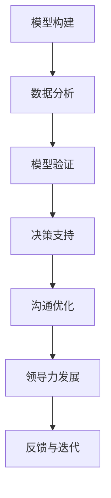

                 

# 模型思维在管理沟通中的运用

> 关键词：模型思维,管理沟通,数据驱动,组织行为,情感智能,协作优化,决策支持,领导力发展

## 1. 背景介绍

### 1.1 问题由来

在当今高度竞争和快速变化的市场环境中，管理沟通已成为企业成功的关键要素。传统依靠直觉和经验的管理方式难以应对复杂多变的商业环境，特别是全球化、数字化和技术革新对管理沟通提出了新的要求。模型思维作为一门新兴的理论与实践方法，正日益受到管理层的重视。它通过构建数学模型和数据分析，使管理决策更加科学、透明、可执行。

模型思维的核心在于将复杂问题简化为可度量的数学模型，并通过数据分析和仿真验证模型的准确性。在管理沟通中，模型思维能帮助管理者更好地理解组织行为、决策过程和员工情感，从而优化沟通策略、提高团队协作效率，并辅助高层决策。

### 1.2 问题核心关键点

1. **模型构建**：选择合适的数学模型作为分析工具，需要考虑数据的特征、问题的性质以及模型的适用性。
2. **数据分析**：有效利用数据分析技术，准确提取和处理数据，以支撑模型推断和决策。
3. **模型验证**：通过实验和仿真，验证模型的有效性，确保模型在实际应用中的可靠性和适用性。
4. **决策支持**：将模型分析结果应用于实际管理沟通，提供科学的决策支持。
5. **沟通优化**：通过模型分析，识别沟通障碍，优化沟通流程和方式。
6. **领导力发展**：通过模型思维提升管理者的数据素养和决策能力，助力领导力的发展。

## 2. 核心概念与联系

### 2.1 核心概念概述

模型思维在管理沟通中的应用，涉及以下几个关键概念：

- **模型构建**：选择适当的数学模型，构建有效的分析框架。
- **数据分析**：通过统计学、机器学习等方法，提取数据中的有价值信息。
- **模型验证**：利用实验、仿真等手段，验证模型的有效性，确保模型可靠性。
- **决策支持**：基于模型分析结果，辅助管理决策，提升决策科学性。
- **沟通优化**：识别沟通中的关键点，优化沟通流程和方式，提高沟通效率。
- **领导力发展**：提升管理者对模型思维的应用能力，促进其决策和沟通能力的发展。

这些概念相互关联，共同构成了一个基于模型思维的管理沟通体系。模型思维不仅能提供科学的决策支持，还能优化沟通流程，提升领导力，推动企业持续发展。

### 2.2 核心概念原理和架构的 Mermaid 流程图(Mermaid 流程节点中不要有括号、逗号等特殊字符)



此图表展示了模型思维在管理沟通中的应用流程。模型构建是基础，数据分析为模型提供数据支持，模型验证确保模型的可靠性，决策支持辅助管理决策，沟通优化提升沟通效率，领导力发展提升管理者能力，反馈与迭代保障流程持续优化。

## 3. 核心算法原理 & 具体操作步骤

### 3.1 算法原理概述

模型思维在管理沟通中的应用，基于以下数学模型和算法：

- **回归分析**：通过线性回归、逻辑回归等模型，预测管理沟通中的关键变量。
- **优化算法**：如梯度下降、遗传算法等，用于模型参数的优化和求解。
- **聚类分析**：如K-means、层次聚类等，用于识别组织内部的沟通群集和模式。
- **网络分析**：如社会网络分析（SNA），用于理解组织中的沟通网络和影响力。
- **情感分析**：利用自然语言处理技术，分析员工和管理者的情感倾向。

### 3.2 算法步骤详解

1. **数据收集**：收集组织内部的沟通数据，如会议记录、邮件交流、绩效评估等。
2. **特征提取**：对数据进行预处理和特征提取，包括文本清洗、情感标注、关键事件识别等。
3. **模型选择**：根据问题的性质和数据特征，选择合适的数学模型，如回归模型、聚类模型、网络模型等。
4. **参数优化**：利用优化算法，优化模型参数，提高模型的准确性和泛化能力。
5. **模型验证**：通过交叉验证、测试集评估等手段，验证模型的可靠性和有效性。
6. **应用实施**：将模型分析结果应用于实际管理沟通，辅助决策和优化流程。

### 3.3 算法优缺点

模型思维在管理沟通中的应用，具有以下优点：

- **科学决策**：基于数据和模型分析结果，提供科学的决策支持。
- **透明沟通**：使沟通过程透明化，增强员工的参与感和信任度。
- **数据驱动**：避免主观偏见，提高沟通和决策的客观性。
- **高效协作**：通过分析识别沟通障碍，优化沟通流程，提升团队协作效率。

同时，模型思维也存在一些局限：

- **数据依赖**：模型结果依赖于数据的准确性和完整性，缺乏高质量的数据可能导致误导性结果。
- **模型复杂性**：复杂的模型可能难以解释和理解，增加沟通成本。
- **过拟合风险**：模型可能在特定数据集上表现良好，但在新数据上泛化性较差。

### 3.4 算法应用领域

模型思维在管理沟通中的应用，涵盖多个领域：

- **组织行为分析**：通过数据分析和建模，理解员工行为模式和组织动态。
- **情感智能提升**：利用情感分析技术，识别和改善员工的情感状态，增强组织凝聚力。
- **决策支持系统**：构建基于模型的决策支持系统，辅助高层管理者进行复杂决策。
- **团队协作优化**：通过网络分析，识别团队沟通中的关键人物和信息流动，优化团队协作。
- **领导力发展**：通过模型思维提升管理者的数据分析和决策能力，助力领导力发展。

## 4. 数学模型和公式 & 详细讲解 & 举例说明

### 4.1 数学模型构建

假设组织内部有 $N$ 个员工，每对员工之间的沟通频率为 $c_{ij}$，则可构建一个 $N \times N$ 的沟通网络矩阵 $C$。模型构建的目标是理解员工之间的沟通模式，预测组织内部的信息流动。

### 4.2 公式推导过程

设员工 $i$ 和 $j$ 之间的沟通频率为 $c_{ij}$，则沟通网络的平均度中心性 $C_i$ 为：

$$ C_i = \sum_{j=1}^{N} c_{ij} $$

利用节点度中心性和聚类分析，可以识别组织内部的关键沟通节点，并分析信息流动的方向和强度。

### 4.3 案例分析与讲解

某企业通过员工之间的沟通频率数据，构建了一个沟通网络矩阵 $C$。利用聚类分析，识别出沟通中的三个关键集群，并分析了信息流动的方向。结果显示，集群一和集群二之间的沟通最为频繁，集群三则相对孤立，这可能与组织内部的团队结构有关。管理者根据这些分析结果，优化了团队协作机制，提高了信息传递效率。

## 5. 项目实践：代码实例和详细解释说明

### 5.1 开发环境搭建

- **Python环境**：确保Python版本在3.6以上，安装必要的依赖库，如Pandas、NumPy、Scikit-learn等。
- **数据准备**：收集员工之间的沟通数据，包括会议记录、邮件交流、绩效评估等。
- **数据预处理**：对数据进行清洗、特征提取和标注，如情感标注、关键事件识别等。

### 5.2 源代码详细实现

```python
import pandas as pd
import networkx as nx
import matplotlib.pyplot as plt
from sklearn.cluster import KMeans

# 读取数据
df = pd.read_csv('communication_data.csv')

# 构建沟通网络
G = nx.from_pandas_edgelist(df, 'employee', 'comm frequency')

# 计算度中心性
degree_centrality = nx.degree_centrality(G)

# 聚类分析
clustering = KMeans(n_clusters=3).fit_transform(degree_centrality.values.reshape(-1,1))

# 可视化结果
clusters = {0: 'Cluster 1', 1: 'Cluster 2', 2: 'Cluster 3'}
colors = ['red', 'green', 'blue']
for key, value in degree_centrality.items():
    plt.bar(key, value, color=colors[clustering[key] % 3], label=clusters[clustering[key]])
plt.title('Employee Degree Centrality Clusters')
plt.legend()
plt.show()
```

### 5.3 代码解读与分析

**数据读取与处理**：
- 使用Pandas读取沟通数据，并进行初步清洗。
- 利用networkx库，构建员工沟通网络。

**度中心性计算**：
- 使用networkx库计算每个员工的度中心性，表示其在沟通网络中的重要性。

**聚类分析**：
- 使用Scikit-learn库的K-means算法，对员工进行聚类分析，识别关键沟通集群。

**可视化结果**：
- 使用Matplotlib库，将员工的度中心性按聚类结果进行可视化，帮助管理者理解组织内部的沟通模式。

### 5.4 运行结果展示

通过上述代码，可以得到一个直观的员工沟通度中心性分布图，帮助管理者识别组织内部的关键沟通节点和集群。管理者可以基于这些分析结果，优化沟通机制，提升团队协作效率。

## 6. 实际应用场景

### 6.1 组织行为分析

组织行为分析是模型思维在管理沟通中的重要应用之一。通过构建组织沟通网络，识别关键节点和集群，可以理解组织内部的动态和行为模式，提供科学的决策支持。

### 6.2 情感智能提升

情感智能在组织管理中扮演重要角色，通过情感分析技术，可以识别员工的情感状态，及时发现和改善潜在问题，增强组织凝聚力。

### 6.3 决策支持系统

在企业高层决策中，模型思维可以帮助管理者基于数据和模型分析，进行科学决策。通过构建基于回归、优化等模型的决策支持系统，辅助管理者处理复杂问题。

### 6.4 团队协作优化

网络分析技术可以揭示团队内部的沟通模式和信息流动，帮助管理者优化团队协作机制，提升团队效率和效果。

### 6.5 领导力发展

模型思维的普及有助于提升管理者的数据分析和决策能力，助力其领导力发展。管理者可以通过学习和应用模型思维，更好地理解和应用数据，提高管理决策的科学性和透明性。

## 7. 工具和资源推荐

### 7.1 学习资源推荐

- **《数据科学导论》**：该书系统介绍了数据科学的基本概念和模型构建方法，适合初学者和进阶者阅读。
- **Coursera《数据科学专业证书》**：提供一系列高质量的在线课程，涵盖数据科学的核心技术。
- **Kaggle数据科学竞赛**：通过参与实际数据科学竞赛，提升数据分析和模型构建能力。

### 7.2 开发工具推荐

- **Jupyter Notebook**：基于Python的交互式开发环境，支持代码编写、数据处理和可视化。
- **TensorBoard**：用于可视化模型训练过程中的各项指标，帮助调试和优化模型。
- **Tableau**：数据可视化工具，支持复杂的数据分析和可视化展示。

### 7.3 相关论文推荐

- **J. Friedman, T. Hastie, and R. Tibshirani, "The Elements of Statistical Learning", 2001**：介绍了统计学和机器学习的基本概念和算法。
- **G. Hinton, "Deep Learning", 2012**：全面介绍了深度学习的基本理论和实践方法。
- **G. E. Pólya, "How to Solve It", 1945**：提供了模型思维的哲学和方法论，值得管理者深入阅读。

## 8. 总结：未来发展趋势与挑战

### 8.1 研究成果总结

模型思维在管理沟通中的应用，已经取得了显著的成果，包括但不限于组织行为分析、情感智能提升、决策支持系统、团队协作优化和领导力发展等方面。这些应用不仅提高了组织决策的科学性和透明性，还增强了员工满意度和组织凝聚力。

### 8.2 未来发展趋势

未来，模型思维在管理沟通中的应用将呈现以下几个发展趋势：

- **多模态融合**：结合视觉、听觉等多模态数据，提升情感智能和沟通效果。
- **实时分析**：利用流数据和实时计算技术，提供动态的决策支持。
- **模型自动化**：通过自动化模型构建和优化，减少人工干预，提升模型的可扩展性。
- **智能化沟通**：利用自然语言处理和智能推荐技术，提升沟通的智能化水平。

### 8.3 面临的挑战

模型思维在管理沟通中的应用，仍然面临一些挑战：

- **数据质量问题**：高质量的数据是模型分析的基础，但数据收集和处理成本较高。
- **模型复杂性**：复杂的模型可能难以解释和应用，增加沟通成本。
- **隐私和伦理**：在处理员工数据时，必须注意隐私保护和伦理问题。

### 8.4 研究展望

未来的研究将关注以下几个方向：

- **模型自动化**：开发更加自动化、智能化的模型构建和优化工具，提升应用效率。
- **多模态融合**：研究多模态数据融合技术，提升情感智能和沟通效果。
- **实时分析**：结合实时数据处理技术，实现动态决策支持。
- **模型解释性**：提升模型的可解释性，帮助管理者更好地理解和应用模型分析结果。

总之，模型思维在管理沟通中的应用，正处于快速发展阶段，未来有着广阔的应用前景和研究空间。通过不断探索和创新，相信模型思维将更好地服务于企业管理和决策，助力组织持续发展。

## 9. 附录：常见问题与解答

**Q1：模型思维在管理沟通中的具体应用案例有哪些？**

A: 模型思维在管理沟通中的具体应用案例包括：
- **组织行为分析**：通过构建员工沟通网络，识别关键节点和集群，理解组织内部的动态和行为模式。
- **情感智能提升**：利用情感分析技术，识别员工的情感状态，及时发现和改善潜在问题。
- **决策支持系统**：基于回归、优化等模型的决策支持系统，辅助高层管理者处理复杂问题。
- **团队协作优化**：通过网络分析，优化团队协作机制，提升团队效率和效果。
- **领导力发展**：通过模型思维提升管理者的数据分析和决策能力，助力领导力发展。

**Q2：数据质量对模型分析结果的影响有哪些？**

A: 数据质量对模型分析结果的影响主要体现在以下几个方面：
- **偏差和误差**：低质量的数据可能导致模型产生偏差和误差，影响分析结果的准确性。
- **泛化能力**：高质量的数据有助于提升模型的泛化能力，使其在新数据上表现更好。
- **可解释性**：高质量的数据有助于提升模型的可解释性，便于管理者理解和应用模型分析结果。

**Q3：模型自动化对管理沟通的潜在影响是什么？**

A: 模型自动化对管理沟通的潜在影响主要体现在以下几个方面：
- **提升效率**：自动化模型构建和优化工具，可以显著提升模型应用的效率，减少人工干预。
- **降低成本**：自动化模型构建和优化工具，可以减少数据处理和模型优化的成本，提升企业竞争力。
- **增强可扩展性**：自动化模型构建和优化工具，可以适应大规模数据和高性能计算的需求，提升模型可扩展性。

**Q4：如何在模型思维中平衡数据质量和模型复杂性？**

A: 在模型思维中平衡数据质量和模型复杂性，可以从以下几个方面入手：
- **数据预处理**：对数据进行清洗、去噪、归一化等预处理，提升数据质量。
- **模型简化**：选择简单、易于理解的模型，避免过度复杂的模型结构。
- **交叉验证**：利用交叉验证等技术，评估模型在训练集和验证集上的性能，确保模型泛化能力。
- **模型解释性**：选择具有较好可解释性的模型，便于管理者理解和应用模型分析结果。

**Q5：模型思维在领导力发展中的作用是什么？**

A: 模型思维在领导力发展中的作用主要体现在以下几个方面：
- **数据素养提升**：提升管理者的数据素养和数据分析能力，增强决策科学性。
- **决策能力提升**：通过模型思维，管理者能够基于数据和模型分析结果，进行科学决策，提升决策能力。
- **沟通能力提升**：利用模型思维，管理者能够更好地理解和应用数据，提高沟通效率和效果。

---

作者：禅与计算机程序设计艺术 / Zen and the Art of Computer Programming

