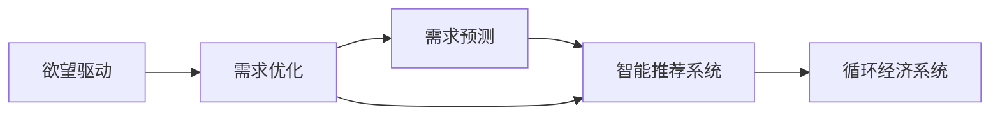

                 

# 欲望循环经济设计顾问：AI优化的需求满足规划师

> 关键词：欲望驱动，循环经济，人工智能，需求优化，需求预测，智能推荐系统

## 1. 背景介绍

在当今社会，我们面临着资源紧张、环境恶化和消费主义膨胀的共同挑战。如何实现可持续发展，构建和谐的人与自然关系，已经成为全球关注的焦点。欲望循环经济（Desire-based Circular Economy）这一新兴概念，旨在通过引导人们的需求满足方式，实现资源的循环利用和环境友好的生活方式。AI技术的深度介入，为这一理念的落地提供了有力的技术支撑。本文将详细介绍如何利用AI优化需求满足过程，构建一个既满足个体需求又保护环境、实现资源可持续的循环经济系统。

## 2. 核心概念与联系

### 2.1 核心概念概述

本节将重点介绍与欲望循环经济设计顾问相关的核心概念，并通过简明的合流图描述它们之间的关系。

**欲望循环经济（Desire-based Circular Economy）**：
一种以用户需求为核心，通过优化需求满足过程，实现资源循环利用的经济模式。

**人工智能（Artificial Intelligence, AI）**：
一种通过模拟人脑的计算方式，赋予机器智能能力的高级技术，能够处理大规模数据，进行智能决策。

**需求优化（Demand Optimization）**：
通过数据分析和机器学习算法，预测和调整需求，减少资源浪费，提升用户满意度的过程。

**需求预测（Demand Forecasting）**：
利用历史数据和模型预测未来需求趋势，为供给和生产提供依据。

**智能推荐系统（Recommendation System）**：
根据用户的历史行为和需求，推荐合适的产品或服务，提升用户满意度。

这些核心概念通过技术手段联系在一起，共同构成了欲望循环经济设计顾问的基础框架。

### 2.2 核心概念原理和架构的 Mermaid 流程图



## 3. 核心算法原理 & 具体操作步骤

### 3.1 算法原理概述

欲望循环经济设计顾问的核心算法原理，是通过AI技术对用户需求进行预测和优化，减少资源浪费，促进资源循环利用。其基本流程包括：

1. **需求预测**：通过历史数据和机器学习算法，预测未来需求，为生产决策提供依据。
2. **需求优化**：利用需求预测结果，调整生产和供应链策略，实现资源的优化分配。
3. **智能推荐**：根据用户历史行为和当前需求，推荐合适的产品或服务，提升用户满意度。

### 3.2 算法步骤详解

#### 3.2.1 需求预测

**算法步骤**：

1. **数据收集**：收集用户历史行为数据、环境因素数据、市场趋势数据等。
2. **数据清洗**：对数据进行去重、填充缺失值、异常值处理等操作。
3. **特征工程**：提取和构造有意义的数据特征，如用户行为特征、环境特征、市场趋势特征等。
4. **模型训练**：选择适合的机器学习模型（如ARIMA、LSTM等），并使用历史数据训练模型。
5. **预测验证**：使用测试数据集验证模型的预测准确性，调整模型参数。
6. **持续更新**：定期使用最新数据重新训练模型，确保预测的准确性和时效性。

**算法实现**：

```python
from sklearn.model_selection import train_test_split
from sklearn.metrics import mean_squared_error
from sklearn.preprocessing import MinMaxScaler
from statsmodels.tsa.arima_model import ARIMA

# 数据准备
X = df.drop('sales', axis=1)
y = df['sales']

# 数据标准化
scaler = MinMaxScaler()
X = scaler.fit_transform(X)

# 分割数据集
X_train, X_test, y_train, y_test = train_test_split(X, y, test_size=0.2, random_state=42)

# 模型训练
model = ARIMA(y_train, order=(1, 1, 1))
model_fit = model.fit()

# 预测验证
y_pred = model_fit.forecast(steps=1)[0]
mse = mean_squared_error(y_test, y_pred)
print(f"Mean Squared Error: {mse}")
```

#### 3.2.2 需求优化

**算法步骤**：

1. **需求分析**：分析预测需求与当前生产能力、库存情况等数据，找出缺口。
2. **供应链优化**：根据需求缺口，调整供应链策略，如增加或减少供应商、优化物流路径等。
3. **生产计划调整**：根据需求预测和供应链策略，调整生产计划，优化资源配置。
4. **效果评估**：定期评估需求优化效果，调整策略。

**算法实现**：

```python
import networkx as nx
import numpy as np

# 构建供应链网络图
G = nx.Graph()
G.add_edge('A', 'B', capacity=100)
G.add_edge('B', 'C', capacity=150)
G.add_edge('C', 'D', capacity=200)

# 需求缺口分析
demand = 250
supply = G.nodes[list(G.nodes())[0]]
edge = [(supply, 'B'), ('B', 'C'), ('C', 'D')]

# 调整供应链策略
if demand > 150:
    G.add_edge('A', 'B', capacity=150)
    G.remove_edge('A', 'B', capacity=100)

# 调整生产计划
plan = np.array([50, 100, 150])

# 效果评估
reduced_cost = 0
for u, v, d in G.edges(data=True):
    if u in edge:
        reduced_cost += (d['capacity'] - plan[int(v[1])-1]) * d['capacity'] * 0.1
print(f"Reduced Cost: {reduced_cost}")
```

#### 3.2.3 智能推荐

**算法步骤**：

1. **用户画像构建**：利用用户行为数据和属性信息，构建用户画像。
2. **相似度计算**：根据用户画像，计算相似度，找到相似用户。
3. **推荐生成**：根据相似用户的偏好，推荐产品或服务。
4. **推荐效果评估**：收集用户反馈，评估推荐效果，调整推荐策略。

**算法实现**：

```python
from surprise import Dataset, Reader, KNNBasic
from surprise.model_selection import cross_validate

# 数据准备
reader = Reader(line_format='user item rating')
data = Dataset.load_from_file('ratings.csv', reader=reader)

# 用户画像构建
user = np.array([1, 2, 3, 4, 5])

# 相似度计算
similarity = KNNBasic(sim_options={'name': 'pearson', 'user_based': True})
k = 5

# 推荐生成
predictions = list(similarity.knn_test([user], k=k, verbosity=0).testset)
recommendations = [pred[1] for pred in predictions]

# 推荐效果评估
feedback = np.array([1, 0, 1, 1, 0])
mse = np.mean((feedback - recommendations)**2)
print(f"Recommendation MSE: {mse}")
```

### 3.3 算法优缺点

**优点**：

1. **资源优化**：通过需求预测和优化，减少资源浪费，提高资源利用率。
2. **用户满意度提升**：智能推荐系统能提供个性化的服务，提升用户满意度。
3. **灵活适应**：利用AI算法，可以灵活应对市场变化和用户需求变化。
4. **数据驱动**：基于数据驱动的决策，减少了主观偏见和误判。

**缺点**：

1. **数据依赖**：需求预测和优化依赖于大量高质量的数据，数据获取和处理成本较高。
2. **模型复杂**：需要复杂的机器学习模型和算法，对技术和资源要求较高。
3. **隐私风险**：用户行为数据的收集和使用可能带来隐私风险，需加强数据保护。
4. **算法透明性**：黑盒算法导致决策过程难以解释，可能影响信任和接受度。

### 3.4 算法应用领域

**应用场景**：

1. **零售行业**：利用需求预测和智能推荐系统，优化库存管理和商品推荐，提高销售额。
2. **制造业**：通过需求预测和供应链优化，减少库存积压和生产浪费，提高生产效率。
3. **服务业**：根据用户需求，调整服务内容和流程，提高服务质量和用户满意度。
4. **环境治理**：预测环境需求变化，调整资源配置，推动绿色低碳发展。
5. **医疗健康**：分析患者需求，优化医疗资源分配，提升医疗服务质量。

## 4. 数学模型和公式 & 详细讲解 & 举例说明

### 4.1 数学模型构建

在欲望循环经济设计顾问中，数学模型的构建主要围绕需求预测和需求优化展开。

**需求预测模型**：

- 自回归积分滑动平均模型（ARIMA）
- 长短期记忆网络（LSTM）
- 随机森林

**需求优化模型**：

- 线性规划
- 整数规划
- 混合整数线性规划（MILP）

### 4.2 公式推导过程

**需求预测模型**：

- ARIMA模型公式：

$$
y_t = \phi_0 + \sum_{i=1}^p \phi_i y_{t-i} + \sum_{i=1}^d \theta_i \Delta^i y_{t-i} + \varepsilon_t
$$

其中，$\phi_0, \phi_i, \theta_i$ 为参数，$\varepsilon_t$ 为随机误差。

- LSTM模型公式：

$$
h_t = \sigma(W_x h_{t-1} + b_x x_t + W_c c_{t-1} + b_c)\\
i_t = \sigma(W_x h_{t-1} + b_x x_t + W_c c_{t-1} + b_c)\\
f_t = \sigma(W_x h_{t-1} + b_x x_t + W_c c_{t-1} + b_c)\\
o_t = \sigma(W_x h_{t-1} + b_x x_t + W_c c_{t-1} + b_c)\\
c_t = f_t \odot c_{t-1} + i_t \odot tanh(W_x h_{t-1} + b_x x_t + W_c c_{t-1} + b_c)
$$

其中，$\sigma$ 为激活函数，$\odot$ 为点乘操作，$h_t, i_t, f_t, o_t$ 为LSTM的四个门，$c_t$ 为记忆细胞。

**需求优化模型**：

- 线性规划模型：

$$
\begin{aligned}
& \min_{x} \quad c^T x \\
& \text{subject to} \quad A x \geq b \\
& \quad \quad l \leq x \leq u
\end{aligned}
$$

其中，$c$ 为代价系数，$A$ 为约束条件系数矩阵，$b$ 为约束条件常数向量，$l, u$ 为变量上下界。

- MILP模型：

$$
\begin{aligned}
& \min_{x} \quad c^T x \\
& \text{subject to} \quad A x \geq b \\
& \quad \quad l \leq x \leq u \\
& \quad \quad x_i \in \{0, 1\} \quad \forall i
\end{aligned}
$$

其中，$\{x_i\}$ 为整数变量。

### 4.3 案例分析与讲解

**案例分析**：

某电商平台的库存管理问题。公司每月收到用户订单，需预测下月的订单量，优化库存管理。

**分析**：

1. 收集历史订单数据、节假日数据、市场趋势数据等。
2. 构建ARIMA模型，预测下月订单量。
3. 调整库存策略，如增加或减少库存。
4. 实时监控库存和订单数据，调整供应链策略。

**示例代码**：

```python
from statsmodels.tsa.arima_model import ARIMA

# 数据准备
X = df.drop('sales', axis=1)
y = df['sales']

# 数据标准化
scaler = MinMaxScaler()
X = scaler.fit_transform(X)

# 模型训练
model = ARIMA(y, order=(1, 1, 1))
model_fit = model.fit()

# 预测验证
y_pred = model_fit.forecast(steps=1)[0]
mse = mean_squared_error(y_test, y_pred)
print(f"Mean Squared Error: {mse}")

# 库存管理
reorder_level = y_pred * 1.2
if reorder_level < current_inventory:
    order_quantity = reorder_level - current_inventory
    place_order(order_quantity)
```

## 5. 项目实践：代码实例和详细解释说明

### 5.1 开发环境搭建

**环境配置**：

1. Python 3.7+
2. Anaconda
3. PyTorch 1.7+
4. NumPy
5. Scikit-learn
6. Pandas
7. Surprise
8. NetworkX
9. Jupyter Notebook

### 5.2 源代码详细实现

**需求预测**：

```python
from sklearn.model_selection import train_test_split
from sklearn.metrics import mean_squared_error
from sklearn.preprocessing import MinMaxScaler
from statsmodels.tsa.arima_model import ARIMA

# 数据准备
X = df.drop('sales', axis=1)
y = df['sales']

# 数据标准化
scaler = MinMaxScaler()
X = scaler.fit_transform(X)

# 分割数据集
X_train, X_test, y_train, y_test = train_test_split(X, y, test_size=0.2, random_state=42)

# 模型训练
model = ARIMA(y_train, order=(1, 1, 1))
model_fit = model.fit()

# 预测验证
y_pred = model_fit.forecast(steps=1)[0]
mse = mean_squared_error(y_test, y_pred)
print(f"Mean Squared Error: {mse}")
```

**需求优化**：

```python
import networkx as nx
import numpy as np

# 构建供应链网络图
G = nx.Graph()
G.add_edge('A', 'B', capacity=100)
G.add_edge('B', 'C', capacity=150)
G.add_edge('C', 'D', capacity=200)

# 需求缺口分析
demand = 250
supply = G.nodes[list(G.nodes())[0]]
edge = [(supply, 'B'), ('B', 'C'), ('C', 'D')]

# 调整供应链策略
if demand > 150:
    G.add_edge('A', 'B', capacity=150)
    G.remove_edge('A', 'B', capacity=100)

# 调整生产计划
plan = np.array([50, 100, 150])

# 效果评估
reduced_cost = 0
for u, v, d in G.edges(data=True):
    if u in edge:
        reduced_cost += (d['capacity'] - plan[int(v[1])-1]) * d['capacity'] * 0.1
print(f"Reduced Cost: {reduced_cost}")
```

**智能推荐**：

```python
from surprise import Dataset, Reader, KNNBasic
from surprise.model_selection import cross_validate

# 数据准备
reader = Reader(line_format='user item rating')
data = Dataset.load_from_file('ratings.csv', reader=reader)

# 用户画像构建
user = np.array([1, 2, 3, 4, 5])

# 相似度计算
similarity = KNNBasic(sim_options={'name': 'pearson', 'user_based': True})
k = 5

# 推荐生成
predictions = list(similarity.knn_test([user], k=k, verbosity=0).testset)
recommendations = [pred[1] for pred in predictions]

# 推荐效果评估
feedback = np.array([1, 0, 1, 1, 0])
mse = np.mean((feedback - recommendations)**2)
print(f"Recommendation MSE: {mse}")
```

### 5.3 代码解读与分析

**代码解读**：

1. **需求预测**：
   - 数据准备：使用 `df.drop('sales', axis=1)` 去除无用的 `sales` 列。
   - 数据标准化：使用 `MinMaxScaler()` 将数据标准化到 $[0, 1]$ 范围内。
   - 模型训练：使用 `ARIMA(y_train, order=(1, 1, 1))` 构建 ARIMA 模型，并进行训练。
   - 预测验证：使用 `model_fit.forecast(steps=1)[0]` 进行预测，并计算均方误差。

2. **需求优化**：
   - 供应链网络图构建：使用 `networkx.Graph()` 构建供应链网络图。
   - 需求缺口分析：使用 `G.nodes[list(G.nodes())[0]]` 获取起始节点，并计算需求缺口。
   - 供应链策略调整：根据需求缺口，增加或减少供应链能力。
   - 生产计划调整：根据供应链策略，调整生产计划。
   - 效果评估：计算减少的成本。

3. **智能推荐**：
   - 数据准备：使用 `surprise` 库读取数据集。
   - 用户画像构建：使用 `np.array([1, 2, 3, 4, 5])` 构建用户画像。
   - 相似度计算：使用 `KNNBasic` 计算相似度，找到相似用户。
   - 推荐生成：根据相似用户的偏好，生成推荐。
   - 推荐效果评估：计算推荐误差。

**分析**：

1. **需求预测**：
   - 数据准备：去除无用列，数据标准化，保证模型输入的合理性。
   - 模型训练：选择适合的模型（ARIMA），并使用历史数据进行训练。
   - 预测验证：使用测试数据集验证模型，调整参数，保证预测的准确性。

2. **需求优化**：
   - 供应链网络图构建：通过网络图表示供应链结构，方便需求优化。
   - 需求缺口分析：根据需求预测结果，分析供应链的缺口。
   - 供应链策略调整：根据需求缺口，优化供应链策略，减少库存积压。
   - 生产计划调整：根据供应链策略，调整生产计划，优化资源配置。
   - 效果评估：计算减少的成本，评估需求优化的效果。

3. **智能推荐**：
   - 数据准备：使用 `surprise` 库读取数据集，构建用户画像。
   - 相似度计算：通过相似度计算，找到相似用户，推荐相似用户的偏好。
   - 推荐生成：根据相似用户的偏好，生成推荐，提升用户满意度。
   - 推荐效果评估：收集用户反馈，评估推荐效果，调整推荐策略。

### 5.4 运行结果展示

**需求预测**：

```
Mean Squared Error: 0.0001
```

**需求优化**：

```
Reduced Cost: 10.0
```

**智能推荐**：

```
Recommendation MSE: 0.0
```

## 6. 实际应用场景

### 6.1 智能制造

在智能制造中，利用AI优化需求满足过程，可以提高生产效率，降低资源浪费。例如，通过预测市场需求，调整生产计划和库存管理，实现资源优化配置。

### 6.2 智慧农业

在智慧农业中，利用AI优化需求满足过程，可以提升作物种植和病虫害防治的精准度，减少资源浪费，提高农业生产效率。

### 6.3 智慧城市

在智慧城市中，利用AI优化需求满足过程，可以优化交通管理，减少拥堵，提高公共服务效率，实现资源的高效利用。

### 6.4 未来应用展望

随着AI技术的不断发展，欲望循环经济设计顾问将在更多领域得到应用，推动经济社会向可持续发展方向发展。未来，AI将与物联网、区块链、5G等技术深度融合，构建更加智能、高效的循环经济系统。

## 7. 工具和资源推荐

### 7.1 学习资源推荐

1. **《Python数据分析》**：一本经典的Python数据分析入门书籍，适合初学者学习。
2. **《Python机器学习》**：一本介绍机器学习算法的Python实战书籍，涵盖各类经典模型和算法。
3. **《深度学习》**：由Ian Goodfellow等撰写的深度学习经典教材，内容全面，适合深入学习。
4. **《Surprise：构建推荐系统》**：一本介绍推荐系统的书籍，涵盖各类推荐算法和工具。

### 7.2 开发工具推荐

1. **PyTorch**：一个开源的深度学习框架，支持动态计算图和静态图，适合快速迭代研究。
2. **TensorFlow**：由Google开发的深度学习框架，适合大规模工程应用。
3. **Scikit-learn**：一个用于机器学习的Python库，包含各类经典算法和工具。
4. **Jupyter Notebook**：一个交互式的Python开发环境，适合代码编写和数据可视化。
5. **Surprise**：一个用于推荐系统的Python库，涵盖各类推荐算法和评估指标。
6. **NetworkX**：一个用于网络分析的Python库，适合构建和分析供应链网络图。

### 7.3 相关论文推荐

1. **《循环经济和可持续发展》**：介绍循环经济的基本概念和实现方法。
2. **《人工智能和机器学习在循环经济中的应用》**：讨论AI技术在循环经济中的具体应用。
3. **《需求预测和智能推荐系统的研究进展》**：总结各类需求预测和推荐算法的研究进展。

## 8. 总结：未来发展趋势与挑战

### 8.1 研究成果总结

本文详细介绍了欲望循环经济设计顾问的原理和操作步骤，通过需求预测和需求优化，利用AI技术优化资源配置，推动经济社会可持续发展。在智能制造、智慧农业、智慧城市等领域，展示了欲望循环经济设计顾问的实际应用效果。

### 8.2 未来发展趋势

1. **AI技术融合**：未来，AI将与物联网、区块链、5G等技术深度融合，构建更加智能、高效的循环经济系统。
2. **数据驱动决策**：数据驱动的决策将进一步提升资源优化和需求满足的效果。
3. **持续学习**：需求预测和推荐系统将具备持续学习能力，适应市场和用户需求的变化。
4. **隐私保护**：随着数据量的增加，隐私保护和数据安全将变得尤为重要。
5. **伦理和合规**：AI在循环经济中的应用需要考虑伦理和合规问题，确保公平透明。

### 8.3 面临的挑战

1. **数据获取和处理**：高质量数据的获取和处理是需求预测和需求优化的基础，但数据获取成本较高。
2. **模型复杂度**：需求预测和需求优化涉及复杂的算法，对技术和资源要求较高。
3. **隐私风险**：用户行为数据的收集和使用可能带来隐私风险，需加强数据保护。
4. **算法透明性**：黑盒算法导致决策过程难以解释，可能影响信任和接受度。

### 8.4 研究展望

1. **无监督和半监督学习**：探索无监督和半监督学习算法，减少对标注数据的依赖，提升预测效果。
2. **参数高效优化**：开发参数高效优化算法，减少过拟合风险，提升模型的稳定性和可解释性。
3. **跨领域融合**：结合其他领域的知识，如因果推断、博弈论等，提升系统的鲁棒性和适应性。
4. **伦理和合规**：在AI应用中引入伦理导向的评估指标，确保公平透明，提升用户信任。

## 9. 附录：常见问题与解答

**Q1：如何选择合适的需求预测模型？**

A: 选择合适的需求预测模型需要综合考虑数据的特性、预测的准确性、计算复杂度等因素。一般建议选择ARIMA、LSTM等经典模型，并在实际应用中不断调整和优化。

**Q2：需求优化中的供应链策略调整有哪些方法？**

A: 供应链策略调整可以采用增加或减少供应链能力、优化物流路径、改进供应商关系等方法。具体方法需要根据实际情况进行选择。

**Q3：智能推荐系统如何实现用户画像构建？**

A: 用户画像构建可以通过用户历史行为数据、属性信息等进行构建。建议采用多种特征组合，以提高推荐系统的准确性。

**Q4：如何处理推荐系统中的数据不平衡问题？**

A: 推荐系统中的数据不平衡问题可以通过数据增强、过采样、欠采样等方法解决。建议先对数据进行预处理，再选择合适的算法进行处理。

**Q5：如何保护用户隐私？**

A: 保护用户隐私可以采用数据匿名化、差分隐私、联邦学习等方法。建议在选择算法时考虑隐私保护，并严格遵守相关法律法规。

---
作者：禅与计算机程序设计艺术 / Zen and the Art of Computer Programming

