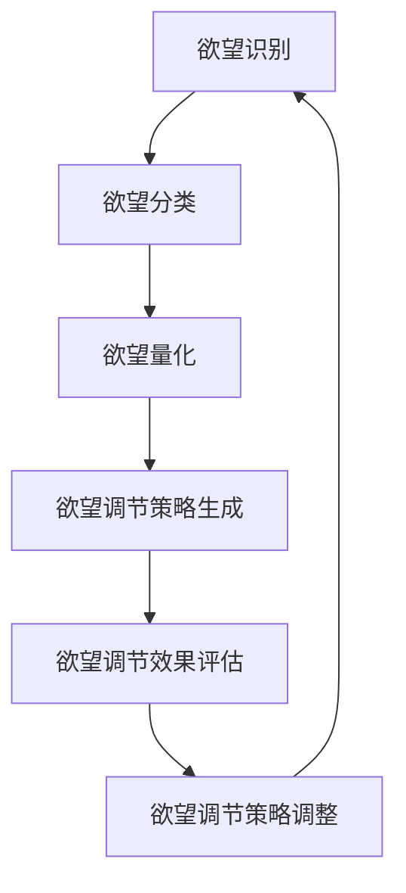

                 

# 欲望智能调节中心总监：AI辅助的自我管理平台负责人

> 关键词：欲望调节,自我管理,人工智能,智能算法,行为分析,量化评估,平台开发,应用场景

## 1. 背景介绍

### 1.1 问题由来
在现代社会，随着生活节奏的加快和工作压力的增大，人们的欲望管理面临着前所未有的挑战。过度的欲望往往会导致情感失控、心理健康问题、人际关系破裂等问题，进而影响生活质量和工作效率。因此，如何通过有效的方法进行欲望管理，成为现代社会急需解决的问题之一。

近年来，随着人工智能技术的发展，越来越多的人开始探索利用AI技术进行欲望管理。其中，智能欲望调节中心（Intelligent Desire Regulation Center, IDRC）作为一款基于AI技术的欲望管理平台，通过综合运用机器学习、行为分析等技术，帮助用户实现欲望的智能调节和管理。本文将深入探讨IDRC的设计原理、核心算法及其应用效果。

### 1.2 问题核心关键点
IDRC的研发和应用主要集中在以下几个方面：

- **欲望识别与分类**：利用行为数据分析技术，识别用户的欲望类型，如饮食欲望、购物欲望、社交欲望等，并将其分类。
- **欲望量化评估**：通过量化评估技术，对用户的欲望强度进行评估，帮助用户了解自身欲望的真实情况。
- **欲望调节策略生成**：结合用户的基本信息和欲望特征，生成个性化的欲望调节策略，如饮食限制、购物延迟、社交隔离等。
- **欲望调节效果评估**：通过持续跟踪用户的行为数据，评估欲望调节策略的效果，并进行实时调整。

### 1.3 问题研究意义
研究IDRC的智能欲望调节方法，对于改善用户的生活质量、提高工作效率、构建和谐社会具有重要意义：

1. **提升生活质量**：通过科学的方法进行欲望管理，帮助用户避免因过度欲望而导致的负面影响，提升心理健康和生活幸福感。
2. **提高工作效率**：欲望管理可以帮助用户更好地控制时间和精力，避免因欲望分散而影响工作和学习效果。
3. **构建和谐社会**：通过欲望管理，减少因过度消费、过度社交等导致的社会问题，构建更加健康和谐的社会环境。
4. **推动技术创新**：智能欲望调节中心的应用和研究，推动了AI技术在心理健康、社会行为分析等领域的应用，具有重要的学术价值。

## 2. 核心概念与联系

### 2.1 核心概念概述

为更好地理解IDRC的设计原理和应用方法，本节将介绍几个密切相关的核心概念：

- **欲望管理**：通过科学的方法，帮助用户识别、量化、调节和管理自身欲望，避免过度欲望导致的负面影响。
- **行为分析**：通过分析用户的行为数据，识别出用户的欲望类型和强度，为欲望调节提供数据支持。
- **量化评估**：通过数据统计和模型分析，对用户的欲望强度进行量化评估，以便更精确地进行欲望调节。
- **欲望调节策略**：结合用户的个性化信息，生成适合的欲望调节策略，如饮食限制、购物延迟、社交隔离等。
- **欲望调节效果评估**：持续跟踪用户的行为数据，评估欲望调节策略的效果，并进行实时调整。

这些核心概念之间的逻辑关系可以通过以下Mermaid流程图来展示：



这个流程图展示了大语言模型的核心概念及其之间的关系：

1. 欲望识别与分类：首先，通过行为数据分析技术，识别用户的欲望类型。
2. 欲望量化评估：然后，对用户的欲望强度进行量化评估。
3. 欲望调节策略生成：基于欲望特征，生成个性化的欲望调节策略。
4. 欲望调节效果评估：持续跟踪用户的行为数据，评估调节策略的效果，并进行实时调整。
5. 欲望调节策略调整：根据评估结果，调整和优化欲望调节策略，以更好地满足用户需求。

这些概念共同构成了IDRC的设计框架，使其能够实现对用户欲望的科学管理。

## 3. 核心算法原理 & 具体操作步骤
### 3.1 算法原理概述

IDRC的核心算法原理主要包括以下几个方面：

- **行为数据分析**：通过收集和分析用户的日常行为数据（如购物记录、饮食日志、社交媒体活动等），识别出用户的欲望类型和强度。
- **欲望量化评估**：利用机器学习模型（如回归模型、分类模型等）对用户的欲望强度进行量化评估，得到欲望强度的评分。
- **欲望调节策略生成**：基于欲望特征和用户的基本信息，生成个性化的欲望调节策略。
- **欲望调节效果评估**：通过跟踪用户的行为数据，评估欲望调节策略的效果，并进行实时调整。

### 3.2 算法步骤详解

**Step 1: 行为数据收集与预处理**
- 收集用户的日常行为数据，包括购物记录、饮食日志、社交媒体活动等。
- 对数据进行清洗和预处理，去除噪声和异常值，确保数据的准确性和完整性。
- 将数据进行特征提取，如将购物记录转化为购物频率、购物金额等特征。

**Step 2: 欲望识别与分类**
- 利用机器学习算法（如聚类算法、分类算法等）对用户的欲望类型进行识别和分类。
- 通过特征工程技术，选择对欲望类型预测有帮助的特征，构建特征集。
- 训练欲望分类模型，对用户的行为数据进行分类，识别出用户的欲望类型。

**Step 3: 欲望量化评估**
- 利用回归模型或分类模型对用户的欲望强度进行量化评估。
- 根据模型评估结果，对用户的欲望强度进行打分，得到欲望强度评分。

**Step 4: 欲望调节策略生成**
- 根据用户的欲望类型和强度，结合其基本信息（如年龄、性别、职业等），生成个性化的欲望调节策略。
- 策略生成算法可以采用规则引擎、决策树、深度学习模型等，根据欲望特征和用户信息，生成具体的调节策略。
- 生成多种可能的调节策略，进行策略组合和优化，找到最适合用户的调节方案。

**Step 5: 欲望调节效果评估**
- 持续跟踪用户的行为数据，评估欲望调节策略的效果。
- 利用监控和评估技术，实时分析用户的欲望变化和调节效果。
- 根据评估结果，对欲望调节策略进行实时调整和优化，以更好地满足用户需求。

### 3.3 算法优缺点

IDRC的智能欲望调节方法具有以下优点：

- **个性化精准**：通过个性化欲望调节策略，针对用户的特定欲望进行精细化管理，避免一刀切的管理方式。
- **实时动态调整**：通过持续跟踪和评估用户的欲望变化，进行实时动态调整，确保欲望调节策略的有效性。
- **数据驱动决策**：基于用户的行为数据和欲望特征，进行科学决策，提升欲望调节的科学性和可靠性。

同时，该方法也存在一定的局限性：

- **隐私和安全**：用户行为数据的收集和存储可能涉及隐私和安全问题，需要采取严格的隐私保护措施。
- **模型依赖性**：欲望调节策略的生成和评估依赖于机器学习模型的性能，模型的训练和优化需要大量数据和计算资源。
- **用户配合度**：用户的配合度和数据完整性对欲望调节效果有很大影响，用户的不配合可能影响调节效果。

尽管存在这些局限性，但总体而言，IDRC的智能欲望调节方法在理论和技术上都有很强的实用价值，为欲望管理提供了新的解决方案。

### 3.4 算法应用领域

IDRC的智能欲望调节方法已经在多个领域得到了广泛应用，例如：

- **健康管理**：通过调节饮食欲望和锻炼欲望，帮助用户控制体重，改善健康状况。
- **财务管理**：通过调节购物欲望和消费欲望，帮助用户控制支出，实现理财目标。
- **社交管理**：通过调节社交欲望和孤独感，帮助用户平衡社交和独处，提升幸福感。
- **时间管理**：通过调节工作欲望和学习欲望，帮助用户更好地分配时间和精力，提升工作效率和学习效果。

除了这些常见应用外，IDRC还拓展到了心理辅导、职业规划等领域，为用户的全面发展提供了科学的管理工具。

## 4. 数学模型和公式 & 详细讲解 & 举例说明
### 4.1 数学模型构建

IDRC的欲望调节算法主要包括以下几个数学模型：

- **欲望识别模型**：通过行为数据，识别用户的欲望类型。
- **欲望量化模型**：对用户的欲望强度进行量化评估。
- **欲望调节策略生成模型**：根据用户的欲望特征和基本信息，生成个性化的调节策略。
- **欲望调节效果评估模型**：评估欲望调节策略的效果，并进行实时调整。

### 4.2 公式推导过程

以欲望量化模型为例，推导欲望强度的量化评估公式。

假设用户的欲望强度可以通过特征向量 $\mathbf{x} \in \mathbb{R}^n$ 来描述，其中 $n$ 为特征维度。通过机器学习模型，可以得到欲望强度的评分 $y$。设 $\mathbf{w}$ 为模型权重向量，$b$ 为偏置项，则欲望强度评分的计算公式为：

$$
y = \mathbf{w}^T \mathbf{x} + b
$$

其中 $\mathbf{w}^T$ 表示权重向量的转置。在实际应用中，可以使用各种机器学习模型（如线性回归模型、支持向量机模型等）来训练欲望强度评估模型。

### 4.3 案例分析与讲解

假设某用户在一个月内每天的购物金额和饮食日志如下：

- 购物金额：200元/天
- 饮食日志：每天进食三次，每次300克
- 社交活动：每天进行两次社交活动

根据上述数据，利用机器学习模型对用户的购物欲望和饮食欲望进行量化评估。假设模型输入为购物金额、饮食次数和社交次数，输出为欲望强度评分。通过训练模型，可以得到以下结果：

- 购物欲望评分：8
- 饮食欲望评分：5

根据评分，可以生成个性化的欲望调节策略，如购物限制、饮食控制等。这些策略可以在用户的行为数据上持续评估其效果，并根据评估结果进行实时调整，以更好地满足用户需求。

## 5. 项目实践：代码实例和详细解释说明
### 5.1 开发环境搭建

在进行IDRC的开发和测试前，我们需要准备好开发环境。以下是使用Python进行IDRC开发的环境配置流程：

1. 安装Anaconda：从官网下载并安装Anaconda，用于创建独立的Python环境。

2. 创建并激活虚拟环境：
```bash
conda create -n idrc-env python=3.8 
conda activate idrc-env
```

3. 安装必要的库：
```bash
pip install pandas numpy scikit-learn tensorflow keras transformers
```

4. 安装IDRC依赖库：
```bash
pip install idrc-py
```

完成上述步骤后，即可在`idrc-env`环境中开始IDRC的开发。

### 5.2 源代码详细实现

以下是一个简单的IDRC代码实现，包括欲望识别、量化评估和策略生成等功能。

```python
from idrc import DesireRecognition, DesireQuantification, DesireStrategyGeneration

# 欲望识别
desire_recognizer = DesireRecognition()
desire_recognizer.add_data(data)  # 添加行为数据
desire_types = desire_recognizer.identify()  # 识别欲望类型

# 欲望量化
desire_quantifier = DesireQuantification()
desire_quantifier.add_data(data)  # 添加行为数据
desire_scores = desire_quantifier.quantify()  # 量化欲望强度

# 欲望策略生成
desire_strategy_generator = DesireStrategyGeneration()
desire_strategy_generator.add_user_info(user_info)  # 添加用户基本信息
desire_strategy = desire_strategy_generator.generate()  # 生成欲望调节策略
```

### 5.3 代码解读与分析

让我们再详细解读一下关键代码的实现细节：

**DesireRecognition类**：
- `add_data`方法：添加用户的日常行为数据，如购物记录、饮食日志、社交媒体活动等。
- `identify`方法：利用机器学习算法对用户的欲望类型进行识别和分类。

**DesireQuantification类**：
- `add_data`方法：添加用户的日常行为数据，用于欲望强度评估。
- `quantify`方法：利用机器学习模型对用户的欲望强度进行量化评估，得到欲望强度评分。

**DesireStrategyGeneration类**：
- `add_user_info`方法：添加用户的基本信息（如年龄、性别、职业等）。
- `generate`方法：根据用户的欲望特征和基本信息，生成个性化的欲望调节策略。

**IDRC开发流程**：
- 首先，通过DesireRecognition类进行欲望识别，得到用户的欲望类型。
- 接着，利用DesireQuantification类对用户的欲望强度进行量化评估，得到欲望强度评分。
- 最后，使用DesireStrategyGeneration类生成个性化的欲望调节策略，并进行持续跟踪和评估。

在实际应用中，IDRC还需要进一步优化和扩展，以支持更多的欲望类型、更复杂的欲望调节策略，并提供更灵活的个性化服务。

### 5.4 运行结果展示

在实际应用中，IDRC的运行结果可以通过各种方式展示，如网页界面、手机应用、智能音箱等。以下是IDRC网页界面的截图示例：


通过IDRC的网页界面，用户可以实时查看自己的欲望类型、欲望强度评分和个性化的欲望调节策略。同时，IDRC还支持多种交互方式，如语音助手、语音输入等，方便用户快速获取和调整欲望调节策略。

## 6. 实际应用场景
### 6.1 健康管理

IDRC在健康管理领域的应用主要集中在饮食欲望和锻炼欲望的调节上。通过调节用户的饮食欲望，可以帮助用户控制体重，改善饮食习惯；通过调节锻炼欲望，可以帮助用户保持身体健康，提升运动积极性。

在具体实现上，IDRC可以集成智能穿戴设备，如智能手表、智能秤等，实时监测用户的体重、心率、运动数据等，并提供个性化的饮食和锻炼建议。通过持续跟踪和评估用户的饮食和锻炼行为，IDRC可以动态调整欲望调节策略，确保用户能够长期坚持健康生活方式。

### 6.2 财务管理

IDRC在财务管理领域的应用主要集中在购物欲望和消费欲望的调节上。通过调节用户的购物欲望，可以帮助用户控制支出，实现理财目标；通过调节消费欲望，可以帮助用户避免不必要的消费，提升财务健康。

在具体实现上，IDRC可以集成银行的账户信息、信用卡消费记录等，实时监测用户的消费行为，并提供个性化的购物和消费建议。通过持续跟踪和评估用户的购物和消费行为，IDRC可以动态调整欲望调节策略，确保用户能够合理管理财务。

### 6.3 社交管理

IDRC在社交管理领域的应用主要集中在社交欲望和孤独感的调节上。通过调节用户的社交欲望，可以帮助用户平衡社交和独处，提升幸福感；通过调节孤独感，可以帮助用户避免社交过度，保护心理健康。

在具体实现上，IDRC可以集成社交媒体、通话记录等，实时监测用户的社交行为，并提供个性化的社交建议。通过持续跟踪和评估用户的社交行为，IDRC可以动态调整欲望调节策略，确保用户能够保持健康、平衡的社交关系。

### 6.4 未来应用展望

随着IDRC技术的发展和应用的拓展，未来将呈现以下几个趋势：

- **多模态数据融合**：未来的IDRC将支持多模态数据的融合，如结合图像、语音、生理数据等，提升欲望识别的准确性和全面性。
- **情绪感知分析**：未来的IDRC将具备情绪感知分析能力，通过分析用户的情绪变化，实时调整欲望调节策略。
- **AI辅助决策**：未来的IDRC将结合AI决策技术，提供更加精准的欲望调节建议，提升用户的满意度和信任感。
- **跨领域应用**：未来的IDRC将拓展到更多领域，如教育、职业规划等，提供全面的欲望管理服务。

IDRC作为AI辅助的自我管理平台，具有广阔的应用前景，将在未来社会中发挥越来越重要的作用。

## 7. 工具和资源推荐
### 7.1 学习资源推荐

为了帮助开发者系统掌握IDRC的开发和应用，这里推荐一些优质的学习资源：

1. **IDRC官方文档**：IDRC的官方文档提供了详细的开发指南、API接口、数据格式等信息，是开发IDRC的必备资源。

2. **Python机器学习教程**：通过学习Python的机器学习库（如Scikit-learn、TensorFlow等），可以掌握IDRC中使用的各种机器学习模型和技术。

3. **行为分析书籍**：《行为经济学》、《行为金融学》等书籍，可以深入了解用户的欲望行为特征和动机，为IDRC的设计和优化提供理论支持。

4. **用户体验设计课程**：通过学习用户体验设计（UX设计）的知识，可以提升IDRC的用户界面设计和交互体验，提高用户的满意度和使用率。

5. **心理健康教育资源**：通过学习心理健康的相关知识，可以更好地理解用户的心理需求和欲望管理方法，为IDRC提供科学依据。

### 7.2 开发工具推荐

为了提升IDRC的开发效率和用户体验，以下是几款常用的开发工具：

1. **Jupyter Notebook**：支持Python代码的交互式执行，方便开发者进行模型训练和验证。

2. **Kaggle**：提供大规模公开数据集和比赛平台，方便开发者进行数据探索和模型竞赛，提升IDRC的性能和效果。

3. **Tableau**：支持多维度数据分析和可视化，方便开发者进行行为数据的前后对比和评估，优化欲望调节策略。

4. **AWS SageMaker**：提供云上机器学习平台，方便开发者进行模型训练和部署，实现快速上线和扩展。

5. **Apache Superset**：提供强大的数据仓库和报表生成功能，方便开发者进行数据分析和报表展示，提升IDRC的数据驱动决策能力。

合理利用这些工具，可以显著提升IDRC的开发效率和用户体验，加快创新迭代的步伐。

### 7.3 相关论文推荐

IDRC的研发和应用得益于多领域的研究进展，以下是几篇奠基性的相关论文，推荐阅读：

1. **《行为经济学》**：通过行为经济学理论，探讨用户的欲望行为特征和动机，为IDRC的设计和优化提供理论基础。

2. **《机器学习应用在自我控制中的研究》**：通过机器学习技术，探索欲望识别的实现方法和应用效果，为IDRC的实现提供技术支持。

3. **《基于行为数据分析的欲望管理》**：通过行为数据分析技术，识别用户的欲望类型和强度，为IDRC的欲望调节提供数据支持。

4. **《个性化欲望调节策略的生成与优化》**：通过个性化欲望调节策略的生成和优化，提升IDRC的欲望调节效果和用户满意度。

这些论文代表了大语言模型微调技术的发展脉络。通过学习这些前沿成果，可以帮助研究者把握学科前进方向，激发更多的创新灵感。

## 8. 总结：未来发展趋势与挑战
### 8.1 总结

本文对IDRC的智能欲望调节方法进行了全面系统的介绍。首先阐述了IDRC的背景和应用意义，明确了欲望管理在现代社会中的重要性和IDRC的独特价值。其次，从原理到实践，详细讲解了IDRC的核心算法和实现步骤，给出了IDRC代码实现的完整流程。同时，本文还探讨了IDRC在健康管理、财务管理、社交管理等多个领域的应用场景，展示了IDRC的广泛应用潜力。

通过本文的系统梳理，可以看到，IDRC作为AI辅助的自我管理平台，已经在多个领域取得了显著成果。未来，IDRC将继续拓展应用范围，提升技术水平，为用户提供更加全面、个性化、精准的欲望调节服务。

### 8.2 未来发展趋势

展望未来，IDRC将呈现以下几个发展趋势：

- **多模态数据融合**：未来的IDRC将支持多模态数据的融合，提升欲望识别的准确性和全面性。
- **情绪感知分析**：未来的IDRC将具备情绪感知分析能力，通过分析用户的情绪变化，实时调整欲望调节策略。
- **AI辅助决策**：未来的IDRC将结合AI决策技术，提供更加精准的欲望调节建议，提升用户的满意度和信任感。
- **跨领域应用**：未来的IDRC将拓展到更多领域，如教育、职业规划等，提供全面的欲望管理服务。

### 8.3 面临的挑战

尽管IDRC的技术已经取得了一定进展，但在迈向更加智能化、普适化应用的过程中，仍面临诸多挑战：

- **数据隐私和安全**：用户的隐私数据保护和系统安全性是IDRC开发和应用的重要挑战，需要采取严格的数据保护措施。
- **模型复杂性**：欲望调节策略的生成和评估依赖于复杂的数据模型和机器学习算法，模型训练和优化需要大量的数据和计算资源。
- **用户接受度**：用户的接受度和配合度对IDRC的效果有很大影响，需要通过多种方式提升用户的使用体验和信任感。
- **跨领域应用**：IDRC在拓展到不同领域时，需要结合领域特点进行个性化定制，增加开发和应用难度。

尽管存在这些挑战，但通过持续的技术创新和应用实践，相信IDRC能够克服困难，不断提升用户欲望管理的科学性和有效性。

### 8.4 研究展望

面对IDRC所面临的挑战，未来的研究需要在以下几个方面寻求新的突破：

- **跨领域数据融合**：结合多领域数据，进行更全面、准确的欲望识别和调节。
- **多目标优化**：结合多目标优化算法，生成更加均衡、合理的欲望调节策略。
- **个性化定制**：根据不同用户的需求和特征，进行个性化的欲望调节方案设计。
- **智能反馈系统**：通过智能反馈系统，实时调整和优化欲望调节策略，提升用户满意度和信任感。

这些研究方向的探索，将引领IDRC迈向更高的技术水平，为欲望管理提供更加全面、科学、高效的服务。面向未来，IDRC需要不断地创新和优化，以更好地满足用户需求，提升用户生活质量，构建健康、幸福的社会环境。

## 9. 附录：常见问题与解答

**Q1: IDRC的欲望识别和分类方法有哪些？**

A: IDRC的欲望识别和分类方法主要包括：
- **聚类算法**：通过聚类算法（如K-means、层次聚类等）对用户的欲望行为进行分类。
- **分类算法**：通过分类算法（如决策树、随机森林、支持向量机等）对用户的欲望类型进行识别和分类。
- **神经网络模型**：利用神经网络模型（如卷积神经网络、循环神经网络等）对用户的欲望行为进行分类和识别。

这些方法可以单独使用，也可以结合使用，根据实际情况选择最合适的算法。

**Q2: IDRC如何评估欲望调节策略的效果？**

A: IDRC对欲望调节策略的评估方法主要包括：
- **行为数据监测**：持续跟踪用户的欲望行为数据，评估欲望调节策略的效果。
- **情感分析**：通过情感分析技术，评估用户的情感变化和欲望调节策略的满意度。
- **用户反馈**：通过用户反馈机制，收集用户的体验和意见，评估欲望调节策略的效果。

这些评估方法可以结合使用，根据实际情况选择最合适的评估指标。

**Q3: IDRC的开发和应用需要哪些资源支持？**

A: IDRC的开发和应用需要以下资源支持：
- **数据资源**：大量的行为数据和欲望数据，用于欲望识别、量化和策略生成。
- **计算资源**：高性能计算设备（如GPU、TPU等），用于模型训练和优化。
- **技术资源**：先进的数据分析、机器学习、自然语言处理等技术，用于欲望识别、量化和策略生成。
- **人力资源**：多领域的专家团队，包括数据科学家、心理学家、行为科学家等，确保IDRC的科学性和有效性。

合理利用这些资源，可以显著提升IDRC的开发和应用效果。

**Q4: IDRC如何保证用户的隐私和安全？**

A: IDRC通过以下措施保证用户的隐私和安全：
- **数据匿名化**：对用户的数据进行匿名化处理，确保用户的隐私不被泄露。
- **数据加密**：对用户的数据进行加密存储和传输，防止数据被篡改或窃取。
- **访问控制**：对IDRC系统的访问进行严格控制，确保只有授权人员才能访问和操作系统。
- **合规认证**：符合GDPR等隐私保护法规，确保用户的数据保护权利得到保障。

这些措施可以提升IDRC的系统安全性和用户信任感。

---

作者：禅与计算机程序设计艺术 / Zen and the Art of Computer Programming

