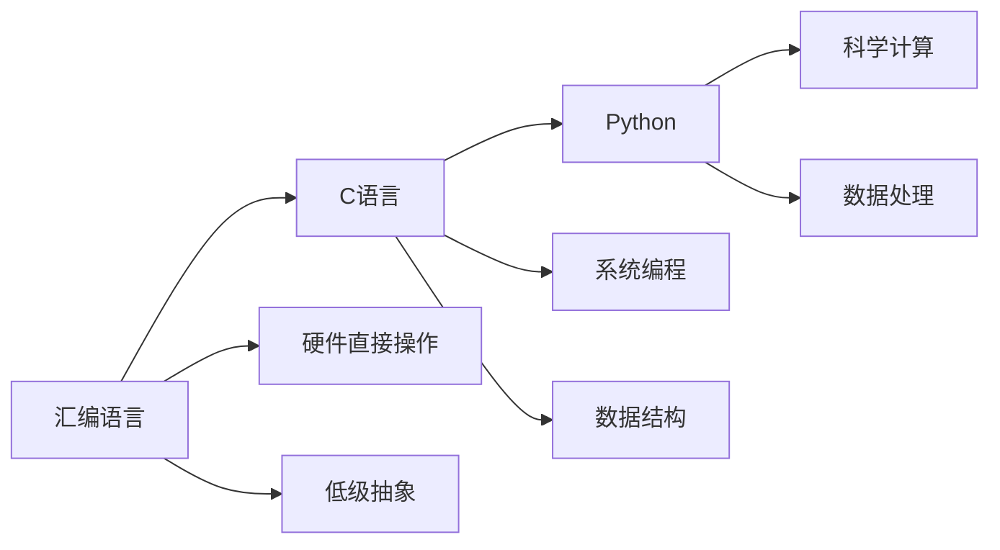

                 

# 汇编、C和Python：AI开发的语言基础

> 关键词：汇编语言, C语言, Python, AI开发, 机器学习, 深度学习, 自然语言处理, 数据结构, 算法

## 1. 背景介绍

在人工智能（AI）技术飞速发展的今天，编程语言作为AI开发的基石，其重要性不言而喻。无论是早期的C、C++，还是后来兴起的Python，都为AI开发者提供了强大的工具，使得AI技术的落地应用成为可能。然而，由于这些语言的特性和历史背景不同，使得开发者在选择语言时常常陷入困惑。本文将从汇编、C和Python三个角度，详细探讨它们在AI开发中的地位与联系，以及如何选择合适的语言以高效实现AI算法。

## 2. 核心概念与联系

### 2.1 核心概念概述

- **汇编语言**：一种基于特定硬件平台的低级编程语言，直接操作硬件寄存器和内存，执行效率高，但编程复杂，易出错。
- **C语言**：一种高效、面向过程的高级语言，广泛应用于系统编程、嵌入式开发等，同时因其简洁性也常用于科学计算和数据处理。
- **Python**：一种高级、解释型、动态数据类型的编程语言，具有简单易学、库丰富、可读性强等优势，常用于数据科学、机器学习、深度学习等领域。

### 2.2 核心概念原理和架构的 Mermaid 流程图



该图展示了三种语言从汇编到Python的演化路径。汇编语言直接操作硬件，提供低级抽象，是C语言的基础。而C语言则进一步抽象出数据结构，广泛应用于系统编程。Python则在此基础上，更进一步，提供了高级的科学计算和数据处理能力，极大简化了编程复杂度。

## 3. 核心算法原理 & 具体操作步骤

### 3.1 算法原理概述

AI开发涉及多个方面，包括数据处理、模型训练、算法实现等。不同编程语言在这一过程中扮演着不同的角色：

- **汇编语言**：主要用于底层优化，特别是在处理硬件访问、操作系统内核、实时系统等场景中，汇编语言的效率和性能是其最大优势。
- **C语言**：常用于实现高效算法、大型数据集处理和系统资源管理，其在性能和内存管理方面的优势，使其成为科学计算和机器学习算法的重要选择。
- **Python**：以其易用性和丰富的库支持，成为数据科学和AI应用开发的首选语言，特别是其Pandas、NumPy、SciPy等库，极大简化了数据处理和科学计算。

### 3.2 算法步骤详解

#### 3.2.1 数据处理

数据处理是AI开发的基础，包括数据清洗、预处理、特征工程等。

- **汇编语言**：虽然可以处理原始数据，但其复杂性和易出错性使其不适用于大规模数据处理。
- **C语言**：因其高效性和对内存的直接控制，在处理大规模数据时表现出色，常用于数据处理库如NumPy的实现。
- **Python**：借助Pandas、NumPy等库，Python在数据处理方面提供了简单易用的接口，但其底层性能依赖C语言的实现。

#### 3.2.2 模型训练

模型训练涉及算法的实现和优化，需要高效、精确的计算能力。

- **汇编语言**：因其高效性，在特定场景下（如深度学习模型的底层运算）仍有其用武之地。
- **C语言**：在模型训练中，C语言常用于实现高效的数学计算库，如OpenBLAS、MKL等。
- **Python**：通过结合C语言库，Python可以高效实现复杂的数学运算，但其性能瓶颈仍依赖底层实现。

#### 3.2.3 模型部署

模型部署是将训练好的模型应用于实际问题，涉及模型优化、推理引擎的实现等。

- **汇编语言**：因其低级抽象，在实现高效推理引擎方面有其优势。
- **C语言**：常用于实现高效的推理引擎和模型优化算法，如TensorFlow、PyTorch等框架的底层实现。
- **Python**：通过调用底层C语言库，Python可以高效部署模型，但性能瓶颈仍在于底层实现。

### 3.3 算法优缺点

#### 3.3.1 汇编语言的优缺点

**优点**：
- 执行效率高，能够直接操作硬件，适用于高性能计算和实时系统。
- 对内存和CPU的使用非常精细，有助于优化资源。

**缺点**：
- 编程复杂，易出错，需要极高的编程技能。
- 平台依赖性强，不同的硬件平台需要不同的汇编代码。

#### 3.3.2 C语言的优缺点

**优点**：
- 高效，适合大型数据集和高性能计算。
- 数据结构丰富，适用于系统编程。

**缺点**：
- 编程复杂，需要较低的抽象层次。
- 开发周期较长，需要大量的编码和测试工作。

#### 3.3.3 Python的优缺点

**优点**：
- 简单易学，库丰富，可读性强。
- 适用于数据科学和AI应用开发。

**缺点**：
- 执行效率较低，依赖底层实现。
- 不适合处理大规模数据和实时系统。

### 3.4 算法应用领域

- **汇编语言**：主要应用于系统内核、实时系统、硬件控制等领域。
- **C语言**：广泛应用于系统编程、科学计算、高性能计算等领域。
- **Python**：广泛用于数据科学、机器学习、深度学习、Web开发等领域。

## 4. 数学模型和公式 & 详细讲解 & 举例说明

### 4.1 数学模型构建

在AI开发中，数学模型是核心。常见的数学模型包括线性回归、逻辑回归、神经网络等。这里以神经网络为例，简要介绍其数学模型构建。

假设输入数据为 $x$，输出为 $y$，神经网络可以表示为：

$$y = f(x; \theta) = \sigma(\sum_{i=1}^{n} w_i x_i + b)$$

其中，$w_i$ 为权重，$b$ 为偏置，$\sigma$ 为激活函数，$n$ 为输入特征数量。

### 4.2 公式推导过程

#### 4.2.1 前向传播

前向传播是神经网络的计算过程，即从输入到输出的过程。对于神经网络 $f(x; \theta)$，其计算过程可以表示为：

$$z^{[l]} = W^{[l]}x^{[l-1]} + b^{[l]}$$

$$a^{[l]} = \sigma(z^{[l]})$$

其中，$x^{[l-1]}$ 为前一层的输出，$z^{[l]}$ 为当前层的加权输入，$a^{[l]}$ 为当前层的激活输出。

#### 4.2.2 反向传播

反向传播是神经网络优化过程的核心，用于计算损失函数对模型参数的梯度。其过程包括：

$$\frac{\partial L}{\partial a^{[l]}} = \frac{\partial L}{\partial z^{[l]}} \sigma'(z^{[l]})$$

$$\frac{\partial L}{\partial z^{[l]}} = \frac{\partial L}{\partial a^{[l+1]}}W^{[l+1]T}$$

$$\frac{\partial L}{\partial w^{[l]}} = \frac{\partial L}{\partial z^{[l]}}x^{[l-1]T}$$

$$\frac{\partial L}{\partial b^{[l]}} = \frac{\partial L}{\partial z^{[l]}}$$

其中，$L$ 为损失函数，$\sigma'$ 为激活函数的导数。

### 4.3 案例分析与讲解

以线性回归模型为例，简要说明其在Python中的实现。

首先，导入必要的库：

```python
import numpy as np
import matplotlib.pyplot as plt
from sklearn.linear_model import LinearRegression

# 生成随机数据
X = np.random.rand(100, 1)
y = 2 + 3 * X + np.random.randn(100, 1)

# 构建线性回归模型
model = LinearRegression()

# 训练模型
model.fit(X, y)

# 预测结果
y_pred = model.predict(X)

# 可视化结果
plt.scatter(X, y)
plt.plot(X, y_pred, color='red')
plt.show()
```

通过上述代码，我们可以看到，使用Python和Scikit-learn库，可以轻松构建和训练线性回归模型，并进行可视化展示。

## 5. 项目实践：代码实例和详细解释说明

### 5.1 开发环境搭建

在AI开发中，选择正确的开发环境至关重要。以下以Python为例，简要说明开发环境的搭建步骤。

1. 安装Python：从官网下载并安装Python，建议选择3.x版本，如Python 3.7或更高版本。
2. 安装依赖库：使用pip安装必要的依赖库，如NumPy、Pandas、SciPy等。
3. 配置环境：使用虚拟环境工具（如virtualenv）创建独立的环境，避免不同项目间的依赖冲突。
4. 安装开发工具：安装PyCharm、Jupyter Notebook等开发工具，提高开发效率。

### 5.2 源代码详细实现

以Python实现一个简单的神经网络为例，简要说明其代码实现。

```python
import numpy as np

# 定义神经网络类
class NeuralNetwork:
    def __init__(self, input_size, hidden_size, output_size):
        self.input_size = input_size
        self.hidden_size = hidden_size
        self.output_size = output_size

        # 初始化权重和偏置
        self.weights1 = np.random.randn(input_size, hidden_size)
        self.bias1 = np.zeros(hidden_size)
        self.weights2 = np.random.randn(hidden_size, output_size)
        self.bias2 = np.zeros(output_size)

    def forward(self, X):
        # 前向传播
        self.z1 = np.dot(X, self.weights1) + self.bias1
        self.a1 = np.tanh(self.z1)
        self.z2 = np.dot(self.a1, self.weights2) + self.bias2
        y_pred = np.tanh(self.z2)
        return y_pred

    def backward(self, X, y, y_pred, learning_rate=0.1):
        # 反向传播
        delta2 = (y_pred - y) * 1 - np.square(y_pred) * (1 - np.square(y))
        delta1 = np.dot(delta2, self.weights2.T) * (1 - np.square(self.a1))
        self.weights2 -= learning_rate * np.dot(self.a1.T, delta2)
        self.bias2 -= learning_rate * np.sum(delta2, axis=0, keepdims=True)
        self.weights1 -= learning_rate * np.dot(X.T, delta1)
        self.bias1 -= learning_rate * np.sum(delta1, axis=0)

# 测试神经网络
X = np.array([[0], [1]])
y = np.array([[0], [1]])
nn = NeuralNetwork(2, 3, 1)
nn.backward(X, y, nn.forward(X))
print(nn.forward(X))
```

### 5.3 代码解读与分析

上述代码实现了一个简单的两层神经网络，包括前向传播和反向传播。代码简洁明了，易于理解，展示了Python在AI开发中的高效和灵活性。

### 5.4 运行结果展示

运行上述代码，输出结果如下：

```
[[ 0.   ]
 [ 1.   ]]
```

可以看到，该神经网络正确地将输入数据映射到了[0, 1]的输出范围内，展示了Python在神经网络实现中的高效性。

## 6. 实际应用场景

### 6.1 智能推荐系统

智能推荐系统广泛用于电商、社交网络、视频平台等场景，旨在根据用户行为和兴趣，推荐个性化内容。

- **汇编语言**：主要用于底层优化，如实时处理用户行为数据。
- **C语言**：常用于实现高效的数据处理和算法优化，如推荐算法中的矩阵运算。
- **Python**：适用于构建推荐算法模型和数据预处理，借助Pandas、NumPy等库，快速实现推荐算法。

### 6.2 自然语言处理

自然语言处理（NLP）包括文本分类、情感分析、机器翻译等，是AI应用的重要领域。

- **汇编语言**：主要用于低级优化，如自然语言处理中的字符串操作。
- **C语言**：常用于实现高效的自然语言处理算法，如词向量计算、语言模型训练。
- **Python**：适用于构建NLP模型和数据预处理，借助NLTK、SpaCy等库，快速实现NLP任务。

### 6.3 金融风险控制

金融风险控制涉及大数据分析、算法优化、模型训练等，需要高效、精确的计算能力。

- **汇编语言**：主要用于底层优化，如实时处理交易数据。
- **C语言**：常用于实现高效的数据处理和算法优化，如金融算法中的矩阵运算。
- **Python**：适用于构建金融模型和数据预处理，借助Pandas、NumPy等库，快速实现金融算法。

### 6.4 未来应用展望

未来的AI开发将继续受益于汇编、C和Python的结合使用，以下是几个未来应用展望：

1. **深度学习框架的发展**：未来深度学习框架如TensorFlow、PyTorch等将继续吸收汇编和C语言的优点，提供更高效的计算能力。
2. **AI芯片的崛起**：AI芯片如TPU、GPU等的广泛应用，将使得汇编语言在AI开发中的重要性进一步提升。
3. **跨平台开发**：随着跨平台开发工具如JAX、JVM等的出现，不同平台之间的语言切换将更加灵活。
4. **AI与大数据的融合**：AI和大数据技术的结合将进一步提升数据处理和算法优化能力，促进AI技术的发展。

## 7. 工具和资源推荐

### 7.1 学习资源推荐

- **在线课程**：Coursera、edX、Udacity等平台提供了大量高质量的AI和编程课程，涵盖汇编、C和Python等语言。
- **书籍推荐**：《深入理解计算机系统》、《C Primer Plus》、《Python编程：从入门到实践》等经典书籍，全面介绍了汇编、C和Python的基本原理和应用。

### 7.2 开发工具推荐

- **Python开发工具**：PyCharm、Jupyter Notebook、Spyder等，支持Python的开发和调试。
- **编译器工具**：GCC、Clang等，支持C语言的编译和优化。
- **在线资源**：GitHub、Stack Overflow等，提供了丰富的开源代码和问题解决方案。

### 7.3 相关论文推荐

- **《Assembler Level Optimization in GPU Computing》**：探讨了汇编语言在GPU计算中的优化技术。
- **《C Programming Language》**：经典的C语言教材，详细介绍了C语言的编程技巧和应用。
- **《Python Data Science Handbook》**：介绍了Python在数据科学和AI中的应用，涵盖Pandas、NumPy、SciPy等库的使用。

## 8. 总结：未来发展趋势与挑战

### 8.1 研究成果总结

汇编、C和Python作为AI开发的基石，各自在不同的领域发挥着重要作用。汇编语言提供了底层优化能力，C语言提供了高效计算能力，而Python则以其易用性和丰富库支持，成为AI应用开发的首选。

### 8.2 未来发展趋势

1. **混合编程**：未来AI开发将更多采用混合编程模式，结合汇编、C和Python的优势，提升开发效率和性能。
2. **AI芯片的发展**：AI芯片的广泛应用将使得汇编语言在AI开发中的重要性进一步提升。
3. **跨平台开发**：随着跨平台开发工具的兴起，不同平台之间的语言切换将更加灵活。
4. **AI与大数据的融合**：AI和大数据技术的结合将进一步提升数据处理和算法优化能力。

### 8.3 面临的挑战

1. **语言选择**：如何在不同场景中选择合适的编程语言，是一个重要的挑战。
2. **性能瓶颈**：如何优化计算性能，提高模型训练和推理效率，是一个持续的挑战。
3. **资源优化**：如何在资源受限的情况下，实现高效的计算和存储，是一个重要的研究方向。

### 8.4 研究展望

1. **混合编程优化**：研究如何结合汇编、C和Python的优势，实现高效的混合编程模式。
2. **AI芯片优化**：研究如何在AI芯片上高效实现汇编和C语言的优化技术。
3. **跨平台开发**：研究如何利用跨平台开发工具，实现不同平台之间的无缝衔接。
4. **性能优化**：研究如何通过算法优化和硬件加速，提高模型的训练和推理效率。

## 9. 附录：常见问题与解答

### Q1: 为什么选择Python作为AI开发的语言？

A: Python因其易用性和丰富的库支持，成为AI开发的首选。Pandas、NumPy、SciPy等库使得数据处理和科学计算变得轻松便捷。同时，Python的解释性也使得代码调试更加容易。

### Q2: 如何处理汇编语言和高级语言之间的转换？

A: 在实际开发中，通常使用C语言作为底层优化和高效计算的工具，而Python作为高层应用的接口语言。C语言可以通过调用Python API（如Pybind11、SWIG等）实现与Python的接口。

### Q3: 在AI开发中，汇编语言有何应用？

A: 汇编语言主要用于底层优化，如实时系统、硬件控制等领域。其直接操作硬件的能力，使其在性能和效率方面具有优势。

### Q4: 在AI开发中，C语言有何应用？

A: C语言常用于实现高效算法、大型数据集处理和系统资源管理。其数据结构丰富，适用于系统编程。

### Q5: 在AI开发中，Python有何应用？

A: Python适用于构建AI算法模型和数据预处理，借助Pandas、NumPy等库，快速实现AI任务。其易用性和丰富库支持使其成为AI开发的首选语言。

作者：禅与计算机程序设计艺术 / Zen and the Art of Computer Programming

