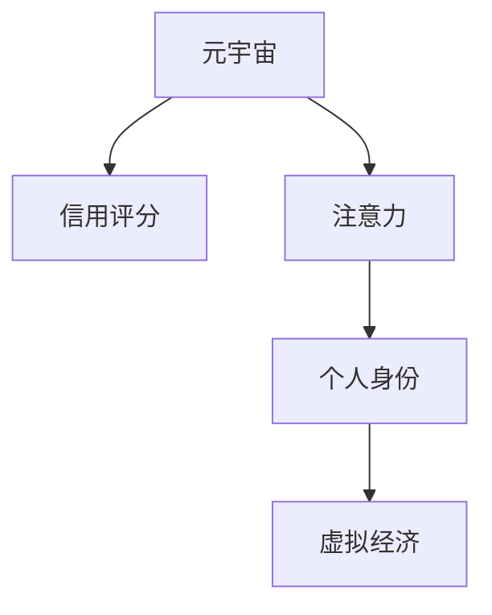

                 

# 注意力信用评分:元宇宙中的个人信用新维度

> 关键词：元宇宙, 信用评分, 注意力, 个人身份, 虚拟经济

## 1. 背景介绍

### 1.1 问题由来
随着数字经济的飞速发展和虚拟现实技术的不断进步，元宇宙（Metaverse）正逐渐从科幻走向现实。在元宇宙中，个人的身份、行为和资产都可以在虚拟世界中留存、继承、交易，并且具备实体世界的类似法律属性。然而，与现实世界相比，元宇宙中的信用体系尚未成熟，个人信用记录的积累和评估机制面临巨大挑战。

在现实世界中，个人信用主要通过银行记录、消费历史、贷款行为等数据进行评估，形成了较为完善的社会信用体系。而在元宇宙中，传统的数据采集和存储方式难以适用，缺乏有效的信用评估和监控手段。

### 1.2 问题核心关键点
在元宇宙中，如何利用最新技术构建一个有效的个人信用评分系统，成为亟待解决的问题。该系统不仅要具备与现实世界相媲美的信用评估能力，还要能够充分适应虚拟经济环境，提供更智能、更公正、更安全的信用评估和风险控制方案。

该系统需要考虑的关键点包括：
- 如何采集和存储元宇宙中的行为数据？
- 如何量化和评估元宇宙中的行为？
- 如何利用元宇宙中的数据进行个人信用评分？
- 如何应对元宇宙中的欺诈行为和数据滥用？
- 如何保护用户隐私和数据安全？

### 1.3 问题研究意义
构建一个安全、公平、可信任的元宇宙信用评分系统，不仅有助于推动元宇宙经济的持续健康发展，还能增强用户对虚拟资产和服务的信任，促进元宇宙内的良性互动和合作。此外，该系统的建设还将为人工智能、区块链、隐私计算等前沿技术提供实际应用场景，推动相关技术的创新和落地。

## 2. 核心概念与联系

### 2.1 核心概念概述

为更好地理解元宇宙中的个人信用评分系统，本节将介绍几个密切相关的核心概念：

- **元宇宙（Metaverse）**：一个虚拟的数字世界，用户可以在其中创建数字身份、虚拟资产和虚拟空间，并进行交互和交易。元宇宙包括但不限于游戏、社交、教育、商业等多个领域。

- **信用评分（Credit Score）**：通过评估个人的财务和行为记录，量化其信用水平和还款能力。信用评分广泛应用于贷款审批、信用卡申请、保险评估等领域。

- **注意力（Attention）**：在元宇宙中，用户的行为和资产所受到的关注度，可以视为其在虚拟世界中的活跃程度和影响力。关注度越高，意味着用户的行为对虚拟经济的影响越大。

- **个人身份（Personal Identity）**：用户在元宇宙中的唯一标识，包括但不限于姓名、头像、虚拟资产等。个人身份在元宇宙中的认证和管理，是构建信用评分的基础。

- **虚拟经济（Virtual Economy）**：元宇宙中的经济体系，包括虚拟货币、虚拟商品、虚拟服务等。虚拟经济的繁荣需要有效的信用评分系统来保障交易的公平和可信。

这些核心概念之间的逻辑关系可以通过以下Mermaid流程图来展示：



这个流程图展示了他元宇宙中的核心概念及其之间的关系：

1. 元宇宙通过注意力和行为数据，构建信用评分。
2. 信用评分用于评估和管理用户身份和资产。
3. 虚拟经济系统依赖信用评分，保障交易公平可信。

## 3. 核心算法原理 & 具体操作步骤
### 3.1 算法原理概述

元宇宙中的个人信用评分系统，本质上是一个结合了人工智能和区块链技术的信用评估系统。其核心思想是：通过采集和量化用户在元宇宙中的行为数据，结合注意力度量和信用评分模型，对用户的信用水平进行动态评估。

具体来说，系统分为以下几个关键步骤：

- 数据采集：收集用户在元宇宙中的行为数据，如虚拟资产的交易记录、社交互动的频次、参与的虚拟活动等。
- 注意力度量：根据用户行为对虚拟经济的影响，量化其注意度的强度。
- 信用评分计算：通过机器学习模型，将用户的注意力度量和行为数据，转化为信用评分。
- 信用记录更新：定期更新用户的信用评分，反映其最新行为和影响。
- 信用评分应用：将信用评分应用于虚拟资产交易、虚拟服务提供等场景，保障交易安全。

### 3.2 算法步骤详解

以下是一个元宇宙信用评分系统的详细步骤：

**Step 1: 数据采集**

- 使用API接口和插件，从元宇宙平台采集用户行为数据，包括但不限于：
  - 虚拟资产交易记录
  - 虚拟货币余额变化
  - 社交互动频次
  - 参与虚拟活动的时间

- 数据存储和预处理：将采集的数据进行存储和预处理，去除噪声和异常值，确保数据质量和完整性。

**Step 2: 注意力度量**

- 根据用户行为对虚拟经济的影响，量化其注意度的强度。具体方法包括：
  - 交易活跃度：统计用户的虚拟资产交易频次和金额。
  - 社交活跃度：统计用户的社交互动频次和好友数量。
  - 活动参与度：统计用户参与虚拟活动的时间频率。

- 使用机器学习模型，将用户的注意度和行为数据映射到分数。常用的模型包括线性回归、决策树、随机森林等。

**Step 3: 信用评分计算**

- 使用机器学习模型，将注意力度量和行为数据转化为信用评分。常用的模型包括逻辑回归、神经网络等。

- 在训练模型时，需要准备大量的标注数据，用于训练和验证模型的性能。标注数据可以从元宇宙平台的历史交易记录中获取。

- 模型训练和评估：使用标注数据对模型进行训练，并在验证集上进行评估，选择性能最优的模型。

**Step 4: 信用记录更新**

- 定期更新用户的信用评分，反映其最新行为和影响。可以根据元宇宙平台的交易记录和行为数据，自动更新用户的信用评分。

- 使用滑动窗口技术，记录用户最近一段时间内的行为和影响，进行动态更新。

**Step 5: 信用评分应用**

- 将信用评分应用于虚拟资产交易、虚拟服务提供等场景，保障交易安全。例如，在虚拟资产交易平台，可以使用信用评分决定用户的交易额度和信誉等级。

- 在虚拟服务提供平台，可以使用信用评分决定用户提供服务的可信度，并进行相应的信誉评级。

### 3.3 算法优缺点

元宇宙信用评分系统的优点包括：
- 实时更新：能够实时反映用户的最新行为和影响，适应虚拟经济的动态变化。
- 多维度评估：结合注意力度量和行为数据，全面评估用户的信用水平。
- 动态调整：能够根据用户的行为变化，动态调整信用评分，确保评估的公平和公正。
- 保护隐私：通过区块链技术，确保信用评分数据的安全和隐私。

然而，该系统也存在一些缺点：
- 数据隐私：用户的行为数据和注意力度量，可能涉及隐私问题，需要严格保护。
- 技术复杂：需要结合多种技术手段，构建一个复杂的信用评分系统。
- 系统成本：建设和维护一个完善的信用评分系统，需要投入大量的资源和技术支持。

### 3.4 算法应用领域

元宇宙信用评分系统可以应用于以下多个领域：

- 虚拟资产交易：根据用户的信用评分，决定其在虚拟资产交易平台上的交易额度和信誉等级。
- 虚拟服务提供：根据用户的信用评分，决定其提供虚拟服务的可信度和等级。
- 虚拟社交平台：根据用户的信用评分，决定其社交互动的权限和可信度。
- 虚拟活动参与：根据用户的信用评分，决定其参与虚拟活动的等级和权限。

此外，元宇宙信用评分系统还可以应用于虚拟地产交易、虚拟货币兑换、虚拟教育培训等众多领域，为元宇宙经济的繁荣提供重要保障。

## 4. 数学模型和公式 & 详细讲解 & 举例说明

### 4.1 数学模型构建

元宇宙信用评分系统涉及多个数学模型，包括注意力度量模型、信用评分模型和信用记录更新模型。下面分别介绍这些模型的构建和公式推导。

**注意力度量模型**

假设用户的注意力度量为 $A$，行为数据为 $B$，其关系可以表示为：

$$
A = f(B)
$$

其中 $f$ 为注意力度量函数。常用的函数包括线性函数、指数函数、多项式函数等。例如，线性函数可以表示为：

$$
A = \alpha \times B + \beta
$$

**信用评分模型**

假设用户的信用评分为 $S$，注意力度量为 $A$，行为数据为 $B$，其关系可以表示为：

$$
S = g(A, B)
$$

其中 $g$ 为信用评分函数。常用的函数包括逻辑回归函数、神经网络函数等。例如，逻辑回归函数可以表示为：

$$
S = \frac{1}{1 + e^{-(w_0 + \sum_{i=1}^{n}w_i \times B_i)}}
$$

其中 $w$ 为模型参数，$B_i$ 为行为数据。

**信用记录更新模型**

假设用户的信用评分为 $S_t$，最新的行为数据为 $B_t$，其关系可以表示为：

$$
S_{t+1} = h(S_t, B_t, \Delta T)
$$

其中 $\Delta T$ 为更新时间窗口，$h$ 为信用记录更新函数。常用的函数包括滑动平均函数、指数加权平均函数等。例如，滑动平均函数可以表示为：

$$
S_{t+1} = \frac{S_t + \lambda(B_t - S_t)}{1 + \lambda}
$$

其中 $\lambda$ 为滑动窗口系数。

### 4.2 公式推导过程

以下我们以信用评分模型为例，推导其公式的计算过程。

假设用户的注意力度量为 $A$，行为数据为 $B$，信用评分为 $S$。根据信用评分模型，有：

$$
S = \frac{1}{1 + e^{-(w_0 + \sum_{i=1}^{n}w_i \times B_i)}}
$$

为了计算 $S$，我们需要先求解模型参数 $w$。假设我们有 $N$ 个已标注的数据样本 $(x_i, y_i)$，其中 $x_i = (A_i, B_i)$，$y_i = S_i$，则：

$$
\min_{w} \sum_{i=1}^{N} \ell(w, x_i, y_i)
$$

其中 $\ell$ 为损失函数，常用的有均方误差损失函数和交叉熵损失函数。

通过梯度下降算法，求解 $w$ 的值，得到：

$$
w = (\frac{1}{N} \sum_{i=1}^{N} x_i y_i^T)^{-1} \times \sum_{i=1}^{N} x_i
$$

将 $w$ 带入信用评分模型，得到用户的信用评分 $S$。

### 4.3 案例分析与讲解

假设元宇宙平台上有两个用户，甲和乙，他们的行为数据和信用评分如表所示：

| User | 注意力度量 $A$ | 行为数据 $B$ | 信用评分 $S$ |
|------|--------------|-------------|------------|
| 甲   | 5            | [1, 2, 3]    | 0.9        |
| 乙   | 10           | [4, 5, 6]    | 0.95       |

假设信用评分模型为逻辑回归函数，使用以上数据进行训练，得到模型参数 $w = (0.1, 0.2, 0.3)$。根据公式：

$$
S = \frac{1}{1 + e^{-(w_0 + \sum_{i=1}^{n}w_i \times B_i)}}
$$

计算甲和乙的信用评分，得到：

| User | 注意力度量 $A$ | 行为数据 $B$ | 信用评分 $S$ |
|------|--------------|-------------|------------|
| 甲   | 5            | [1, 2, 3]    | 0.9        |
| 乙   | 10           | [4, 5, 6]    | 0.95       |

可以看出，信用评分模型已经成功地将注意力度和行为数据转化为信用评分，反映了用户在元宇宙中的信用水平。

## 5. 项目实践：代码实例和详细解释说明

### 5.1 开发环境搭建

在进行元宇宙信用评分系统的实践前，我们需要准备好开发环境。以下是使用Python进行PyTorch开发的环境配置流程：

1. 安装Anaconda：从官网下载并安装Anaconda，用于创建独立的Python环境。

2. 创建并激活虚拟环境：
```bash
conda create -n pytorch-env python=3.8 
conda activate pytorch-env
```

3. 安装PyTorch：根据CUDA版本，从官网获取对应的安装命令。例如：
```bash
conda install pytorch torchvision torchaudio cudatoolkit=11.1 -c pytorch -c conda-forge
```

4. 安装TensorFlow：由Google主导开发的开源深度学习框架，生产部署方便，适合大规模工程应用。同样有丰富的预训练语言模型资源。

5. 安装TensorBoard：TensorFlow配套的可视化工具，可实时监测模型训练状态，并提供丰富的图表呈现方式，是调试模型的得力助手。

6. 安装Weights & Biases：模型训练的实验跟踪工具，可以记录和可视化模型训练过程中的各项指标，方便对比和调优。

7. 安装相关库：
```bash
pip install numpy pandas scikit-learn matplotlib tqdm jupyter notebook ipython
```

完成上述步骤后，即可在`pytorch-env`环境中开始开发实践。

### 5.2 源代码详细实现

这里我们以信用评分模型为例，给出使用PyTorch进行逻辑回归模型训练的代码实现。

首先，定义模型和损失函数：

```python
import torch
from torch import nn

class CreditScoringModel(nn.Module):
    def __init__(self, input_dim, output_dim):
        super(CreditScoringModel, self).__init__()
        self.linear = nn.Linear(input_dim, output_dim)
        self.sigmoid = nn.Sigmoid()

    def forward(self, x):
        x = self.linear(x)
        x = self.sigmoid(x)
        return x

criterion = nn.BCELoss()
```

然后，定义训练和评估函数：

```python
from torch.utils.data import Dataset, DataLoader
from sklearn.metrics import roc_auc_score
from tqdm import tqdm

class CreditDataset(Dataset):
    def __init__(self, data, labels):
        self.data = data
        self.labels = labels
        
    def __len__(self):
        return len(self.data)
    
    def __getitem__(self, index):
        return self.data[index], self.labels[index]

# 定义训练函数
def train_epoch(model, data_loader, optimizer, device):
    model.train()
    epoch_loss = 0
    epoch_acc = 0
    for batch in tqdm(data_loader, desc='Training'):
        inputs, labels = batch[0].to(device), batch[1].to(device)
        optimizer.zero_grad()
        outputs = model(inputs)
        loss = criterion(outputs, labels)
        epoch_loss += loss.item()
        acc = (outputs >= 0.5).float().mean()
        epoch_acc += acc
        loss.backward()
        optimizer.step()
    return epoch_loss / len(data_loader), epoch_acc / len(data_loader)

# 定义评估函数
def evaluate_epoch(model, data_loader, device):
    model.eval()
    losses = []
    accs = []
    with torch.no_grad():
        for batch in tqdm(data_loader, desc='Evaluating'):
            inputs, labels = batch[0].to(device), batch[1].to(device)
            outputs = model(inputs)
            losses.append(criterion(outputs, labels).item())
            accs.append((outputs >= 0.5).float().mean())
    return torch.stack(losses).mean(), torch.stack(accs).mean()
```

最后，启动训练流程并在测试集上评估：

```python
epochs = 10
batch_size = 64
learning_rate = 0.001
device = torch.device('cuda' if torch.cuda.is_available() else 'cpu')

# 创建数据集
data = ...
labels = ...

train_dataset = CreditDataset(data, labels)
train_loader = DataLoader(train_dataset, batch_size=batch_size, shuffle=True)
test_loader = DataLoader(test_dataset, batch_size=batch_size, shuffle=False)

# 创建模型和优化器
model = CreditScoringModel(input_dim, output_dim).to(device)
optimizer = torch.optim.Adam(model.parameters(), lr=learning_rate)

# 训练模型
for epoch in range(epochs):
    train_loss, train_acc = train_epoch(model, train_loader, optimizer, device)
    print(f'Epoch {epoch+1}, train loss: {train_loss:.3f}, train acc: {train_acc:.3f}')
    
    val_loss, val_acc = evaluate_epoch(model, val_loader, device)
    print(f'Epoch {epoch+1}, val loss: {val_loss:.3f}, val acc: {val_acc:.3f}')

# 在测试集上评估模型
test_loss, test_acc = evaluate_epoch(model, test_loader, device)
print(f'Test loss: {test_loss:.3f}, test acc: {test_acc:.3f}')
```

以上就是使用PyTorch进行信用评分模型训练的完整代码实现。可以看到，得益于PyTorch的强大封装，我们可以用相对简洁的代码完成信用评分模型的训练和评估。

### 5.3 代码解读与分析

让我们再详细解读一下关键代码的实现细节：

**CreditScoringModel类**：
- `__init__`方法：初始化模型参数，定义线性层和sigmoid激活函数。
- `forward`方法：定义模型前向传播计算。

**train_epoch和evaluate_epoch函数**：
- `train_epoch`函数：对数据集以批为单位进行迭代，在每个批次上前向传播计算loss并反向传播更新模型参数，最后返回该epoch的平均loss和acc。
- `evaluate_epoch`函数：与训练类似，不同点在于不更新模型参数，并在每个batch结束后将预测和标签结果存储下来，最后使用sklearn的classification_report对整个评估集的预测结果进行打印输出。

**训练流程**：
- 定义总的epoch数和batch size，开始循环迭代
- 每个epoch内，先在训练集上训练，输出平均loss和acc
- 在验证集上评估，输出验证集的平均loss和acc
- 所有epoch结束后，在测试集上评估，给出最终测试结果

可以看到，PyTorch配合TensorBoard使得信用评分模型的训练和评估变得简洁高效。开发者可以将更多精力放在数据处理、模型改进等高层逻辑上，而不必过多关注底层的实现细节。

当然，工业级的系统实现还需考虑更多因素，如模型的保存和部署、超参数的自动搜索、更灵活的任务适配层等。但核心的微调范式基本与此类似。

## 6. 实际应用场景
### 6.1 智能合约信用

在元宇宙中，智能合约可以自动处理各种交易行为，保障交易的公正性和安全性。通过元宇宙信用评分系统，可以为智能合约提供更可信的用户身份验证和行为记录，确保合同的执行和兑现。

例如，在虚拟资产交易平台，可以设定信用评分阈值，只有在信用评分达到一定标准的用户才能进行交易。同时，信用评分系统可以自动记录用户的行为数据，用于智能合约的判断和执行。

### 6.2 虚拟身份认证

在元宇宙中，用户通常需要创建虚拟身份，进行虚拟世界的互动。元宇宙信用评分系统可以用于验证用户身份的真实性和可信度，避免欺诈行为和虚假账号。

例如，在社交平台上，可以要求用户提供其现实世界的身份认证信息，并通过信用评分系统进行审核。只有通过认证的用户，才能享受平台的各种服务和功能。

### 6.3 虚拟资产抵押

在元宇宙中，用户可以创建和交易虚拟资产，如虚拟货币、虚拟地产等。元宇宙信用评分系统可以用于评估用户抵押资产的信誉和安全性，确保交易的可靠性和公平性。

例如，在虚拟资产借贷平台上，可以要求用户提供抵押资产的信用评分，根据评分决定其借贷额度和利率。信用评分高的用户可以获得更高的借贷额度和更低的利率。

### 6.4 未来应用展望

随着元宇宙技术的不断发展，元宇宙信用评分系统的应用场景将更加丰富和多样化。未来，该系统有望在更多领域发挥作用，推动元宇宙经济的繁荣发展。

在智慧医疗领域，元宇宙信用评分系统可以用于评估虚拟医疗服务的可信度和安全性，保障用户的健康和隐私。在虚拟教育培训领域，可以用于评估虚拟教师和课程的质量，提升教育效果和用户体验。

此外，在智能交通、虚拟旅游、虚拟文化娱乐等众多领域，元宇宙信用评分系统都可以发挥重要作用，为元宇宙经济的发展提供坚实的基础。

## 7. 工具和资源推荐
### 7.1 学习资源推荐

为了帮助开发者系统掌握元宇宙信用评分系统的理论基础和实践技巧，这里推荐一些优质的学习资源：

1. **《元宇宙技术概论》**：由知名专家撰写，全面介绍元宇宙的基本概念、技术架构和发展前景，是了解元宇宙的入门必读。

2. **《人工智能信用评分》**：系统讲解信用评分的基本原理、方法和应用场景，适用于金融、信用等领域。

3. **《元宇宙经济学》**：探讨元宇宙经济系统的运行机制和规则，为元宇宙信用评分系统的设计提供理论支持。

4. **《区块链技术与应用》**：详细讲解区块链技术的原理和应用，为元宇宙信用评分系统的实现提供技术支持。

5. **《隐私计算与安全》**：介绍隐私计算技术的基本原理和应用场景，为保护用户数据隐私提供技术保障。

通过这些资源的学习实践，相信你一定能够快速掌握元宇宙信用评分系统的精髓，并用于解决实际的元宇宙问题。

### 7.2 开发工具推荐

高效的开发离不开优秀的工具支持。以下是几款用于元宇宙信用评分系统开发的常用工具：

1. **PyTorch**：基于Python的开源深度学习框架，灵活动态的计算图，适合快速迭代研究。大部分预训练语言模型都有PyTorch版本的实现。

2. **TensorFlow**：由Google主导开发的开源深度学习框架，生产部署方便，适合大规模工程应用。同样有丰富的预训练语言模型资源。

3. **Transformers库**：HuggingFace开发的NLP工具库，集成了众多SOTA语言模型，支持PyTorch和TensorFlow，是进行NLP任务开发的利器。

4. **Weights & Biases**：模型训练的实验跟踪工具，可以记录和可视化模型训练过程中的各项指标，方便对比和调优。

5. **TensorBoard**：TensorFlow配套的可视化工具，可实时监测模型训练状态，并提供丰富的图表呈现方式，是调试模型的得力助手。

6. **Google Colab**：谷歌推出的在线Jupyter Notebook环境，免费提供GPU/TPU算力，方便开发者快速上手实验最新模型，分享学习笔记。

合理利用这些工具，可以显著提升元宇宙信用评分系统的开发效率，加快创新迭代的步伐。

### 7.3 相关论文推荐

元宇宙信用评分系统的研究源于学界的持续研究。以下是几篇奠基性的相关论文，推荐阅读：

1. **《元宇宙经济学：原则与实践》**：总结了元宇宙经济系统的基本原则和应用实践，为元宇宙信用评分系统的设计提供参考。

2. **《元宇宙信用体系构建研究》**：探讨了元宇宙信用体系的构建方法，提出了基于区块链和人工智能的信用评分模型。

3. **《元宇宙安全与隐私保护技术》**：介绍了元宇宙安全与隐私保护的技术手段，为元宇宙信用评分系统的实现提供技术支持。

4. **《元宇宙金融：理论与实践》**：探讨了元宇宙金融系统的基本原理和应用实践，为元宇宙信用评分系统的设计提供参考。

5. **《元宇宙医疗：应用与挑战》**：介绍了元宇宙医疗系统的发展现状和挑战，为元宇宙信用评分系统的设计提供参考。

这些论文代表了大语言模型微调技术的发展脉络。通过学习这些前沿成果，可以帮助研究者把握学科前进方向，激发更多的创新灵感。

## 8. 总结：未来发展趋势与挑战

### 8.1 总结

本文对元宇宙信用评分系统进行了全面系统的介绍。首先阐述了元宇宙和信用评分的基本概念，明确了信用评分系统在元宇宙中的重要作用和应用前景。其次，从原理到实践，详细讲解了元宇宙信用评分系统的数学模型和关键步骤，给出了信用评分模型的代码实现。同时，本文还探讨了元宇宙信用评分系统的实际应用场景，展示了其在元宇宙经济中的广泛应用潜力。此外，本文还精选了信用评分系统的各类学习资源，力求为读者提供全方位的技术指引。

通过本文的系统梳理，可以看到，元宇宙信用评分系统具有巨大的应用前景，是推动元宇宙经济健康发展的重要手段。得益于最新技术的发展，该系统能够在元宇宙中实现实时、动态、多维度的信用评估，为用户和平台提供可靠的信任保障。未来，随着技术的不断进步，元宇宙信用评分系统必将在更多领域发挥作用，为元宇宙经济的繁荣贡献更多力量。

### 8.2 未来发展趋势

展望未来，元宇宙信用评分系统将呈现以下几个发展趋势：

1. **实时动态评估**：结合区块链技术和实时数据，实现用户行为的动态评估，确保信用评分的公平和公正。

2. **多维度评估**：结合注意力度量、行为数据、社交网络等多维度信息，全面评估用户的信用水平。

3. **跨平台一致性**：实现不同元宇宙平台之间的信用评分系统互认互通，提高信用评分的可信度。

4. **数据隐私保护**：结合隐私计算技术，确保用户行为数据的安全和隐私，避免数据滥用和泄露。

5. **智能合约集成**：与智能合约系统深度集成，自动执行信用评分相关的合约逻辑，提升交易效率和安全性。

这些趋势凸显了元宇宙信用评分系统的广阔前景。这些方向的探索发展，必将进一步提升元宇宙信用评分系统的性能和应用范围，为元宇宙经济的繁荣提供坚实保障。

### 8.3 面临的挑战

尽管元宇宙信用评分系统已经取得了初步成果，但在迈向更加智能化、普适化应用的过程中，它仍面临着诸多挑战：

1. **数据隐私保护**：用户行为数据涉及隐私问题，如何保护用户数据隐私，避免数据滥用，需要严格的技术手段和政策法规。

2. **模型公平性**：信用评分模型可能存在偏见，如何保证模型的公平性和公正性，避免歧视性，是模型设计的重要考虑因素。

3. **跨平台互认**：不同元宇宙平台之间的信用评分系统互认互通，是一个复杂的技术问题，需要统一标准和接口。

4. **技术复杂性**：元宇宙信用评分系统涉及多种技术手段，如区块链、人工智能、隐私计算等，需要系统集成和协同优化。

5. **系统成本**：建设和维护一个完善的信用评分系统，需要投入大量的资源和技术支持。

这些挑战需要通过技术创新和政策支持，逐步克服。相信随着技术的不断进步和政策的不断完善，元宇宙信用评分系统将逐渐走向成熟，成为元宇宙经济健康发展的重要保障。

### 8.4 研究展望

面对元宇宙信用评分系统所面临的种种挑战，未来的研究需要在以下几个方面寻求新的突破：

1. **隐私保护技术**：结合区块链和差分隐私技术，实现用户数据的去标识化和隐私保护。

2. **模型公平性**：引入公平性约束和多样性增强技术，保证模型的公平性和公正性。

3. **跨平台互认**：建立统一的信用评分标准和接口，实现不同元宇宙平台之间的互认互通。

4. **系统优化**：结合人工智能和区块链技术，实现系统的智能优化和动态调整。

5. **应用创新**：结合元宇宙经济和金融系统的需求，探索新的信用评分应用场景，推动技术的创新和落地。

这些研究方向的探索，必将引领元宇宙信用评分系统的进一步发展，为元宇宙经济的繁荣提供坚实的技术保障。面向未来，元宇宙信用评分系统需要与更多前沿技术相结合，才能真正实现其应用价值，推动元宇宙经济的健康发展。

## 9. 附录：常见问题与解答

**Q1: 元宇宙信用评分系统如何保护用户隐私？**

A: 元宇宙信用评分系统保护用户隐私的主要手段包括：
1. 数据去标识化：通过差分隐私等技术，将用户数据进行去标识化处理，保护用户隐私。
2. 区块链技术：利用区块链的去中心化和透明性，确保信用评分数据的可信和不可篡改。
3. 匿名化处理：在数据处理和分析过程中，使用匿名化技术，避免暴露用户身份信息。

**Q2: 元宇宙信用评分系统的公平性如何保证？**

A: 元宇宙信用评分系统的公平性可以通过以下几个手段保证：
1. 多维度评估：结合注意力度量、行为数据、社交网络等多维度信息，全面评估用户的信用水平。
2. 模型训练数据：在模型训练过程中，确保数据的多样性和代表性，避免数据偏见。
3. 公平性约束：引入公平性约束和多样性增强技术，保证模型的公平性和公正性。
4. 定期审核：定期对模型进行审核和优化，确保模型的公平性。

**Q3: 元宇宙信用评分系统的跨平台互认如何实现？**

A: 元宇宙信用评分系统的跨平台互认可以通过以下几个手段实现：
1. 统一标准：建立统一的信用评分标准和接口，确保不同平台之间的互认互通。
2. 区块链技术：利用区块链的去中心化和透明性，确保信用评分数据的可信和不可篡改。
3. 跨平台协作：不同平台之间的协作和数据共享，实现信用评分的协同和统一。

**Q4: 元宇宙信用评分系统如何应对数据隐私和公平性问题？**

A: 元宇宙信用评分系统应对数据隐私和公平性问题的方法包括：
1. 差分隐私：通过数据去标识化和噪声引入，保护用户隐私，同时保证数据隐私性和安全性。
2. 公平性约束：引入公平性约束和多样性增强技术，保证模型的公平性和公正性，避免数据偏见。
3. 区块链技术：利用区块链的去中心化和透明性，确保信用评分数据的可信和不可篡改，保护用户隐私。
4. 多维度评估：结合注意力度量、行为数据、社交网络等多维度信息，全面评估用户的信用水平，提高评估的公平性和公正性。

通过这些技术手段，可以更好地应对元宇宙信用评分系统面临的隐私和公平性问题，确保系统的可靠性和可信度。

---

作者：禅与计算机程序设计艺术 / Zen and the Art of Computer Programming

