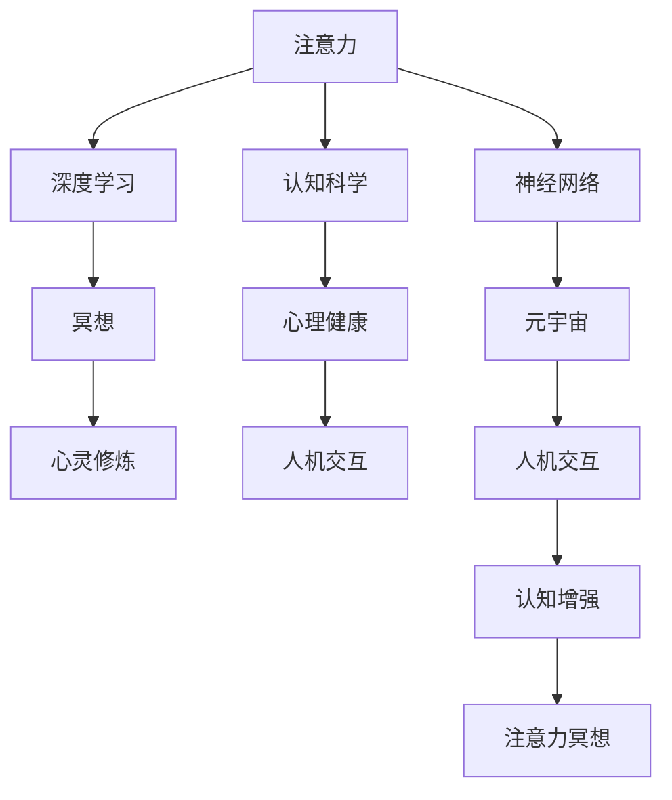

                 

# 注意力冥想:元宇宙时代的心灵修炼技术

> 关键词：注意力,冥想,元宇宙,心灵修炼,神经网络,深度学习,人机交互,认知科学

## 1. 背景介绍

### 1.1 问题由来
随着科技的飞速发展，人类进入了一个全新的时代——元宇宙时代。元宇宙是一个以虚拟现实、增强现实、3D建模、云计算、区块链、人工智能等技术为基础，构建的虚实融合、持续发展的数字空间。在这个虚拟世界中，人们可以进行社交、娱乐、工作、学习等多种活动，仿佛置身于一个全新的人际交往场景中。

然而，元宇宙时代也带来了新的挑战。虚拟世界的信息爆炸，会导致人们的注意力分散，精神压力增大，认知负荷增加，甚至可能导致注意力缺陷、焦虑症、抑郁症等心理健康问题。这正是当前许多元宇宙用户面临的问题。

### 1.2 问题核心关键点
为了应对元宇宙时代带来的注意力分散问题，我们提出了一种基于注意力机制的心灵修炼技术——“注意力冥想”。该技术结合了深度学习、神经网络和认知科学的最新进展，通过重构人类的注意力机制，提升用户的专注力和心理健康水平，实现更高效、更愉悦的虚拟体验。

## 2. 核心概念与联系

### 2.1 核心概念概述

为更好地理解“注意力冥想”技术，本节将介绍几个密切相关的核心概念：

- 注意力(Attention)：注意力机制是一种让神经网络在处理序列数据时，动态地关注不同时间步长的关键信息。在自然语言处理、计算机视觉、语音识别等任务中，注意力机制都能显著提升模型性能。

- 冥想(Meditation)：冥想是一种古老的修行方式，通过专注、正念和深度放松，实现身心的平衡和提升。近年来，冥想技术被广泛应用于心理健康治疗，被证明对焦虑、抑郁、注意力缺陷等有显著疗效。

- 元宇宙(Metaverse)：元宇宙是一个由虚拟数字技术构建的虚拟世界，用户可以在其中进行互动、交流、创造。元宇宙技术包括VR/AR、3D建模、云计算、区块链、AI等，正在迅速发展。

- 神经网络(Neural Networks)：神经网络是一种基于生物学神经元结构建立的计算模型，广泛应用于模式识别、分类、预测等领域。深度学习模型通过堆叠多层神经网络，实现更强的表达能力和自适应能力。

- 深度学习(Deep Learning)：深度学习是一种利用神经网络进行大规模数据训练的机器学习技术，能够从数据中学习特征，自动优化模型。在元宇宙时代，深度学习技术将发挥重要作用，构建更加智能的虚拟环境。

- 认知科学(Cognitive Science)：认知科学是研究人类思维、感知、记忆、情感等心理过程的科学。深度学习技术借鉴认知科学的理念，不断提升模型的自适应能力和人类友好性。

这些核心概念之间的逻辑关系可以通过以下Mermaid流程图来展示：



这个流程图展示了一系列的逻辑关系：

1. 注意力机制作为神经网络的核心组件，是深度学习模型的重要基础。
2. 深度学习通过大量数据训练，提升神经网络的表达能力，从而构建智能的元宇宙环境。
3. 认知科学提供深度学习的理论支持，使其更贴近人类的认知模式。
4. 冥想技术结合神经网络，进行注意力机制的重构，提升用户的认知能力和心理健康。
5. 元宇宙环境通过深度学习构建，实现虚拟与现实的互动。
6. 人机交互融合了神经网络、认知科学和冥想技术，提升用户的沉浸感和认知体验。
7. 注意力冥想结合深度学习和冥想技术，提升用户的注意力水平和心理健康。

## 3. 核心算法原理 & 具体操作步骤
### 3.1 算法原理概述

“注意力冥想”技术结合了深度学习和认知科学的最新进展，通过重新设计注意力机制，使神经网络能够动态关注关键信息，从而提升用户的认知能力和心理健康。该技术主要包括以下几个关键步骤：

1. **数据准备**：收集元宇宙环境中的用户交互数据，如用户的点击、浏览、对话等行为数据，以及用户的情绪、注意力等心理数据。

2. **模型训练**：使用深度学习算法训练注意力模型，学习用户在不同情境下的注意力分布规律。

3. **冥想引导**：结合认知科学和心理学理论，设计引导用户进行冥想的交互界面和提示语，让用户能够在虚拟环境中进行深度放松和注意力训练。

4. **注意力的动态调整**：根据用户当前的状态和任务，动态调整注意力模型，使模型能够在元宇宙环境中动态关注关键信息。

5. **认知增强**：通过冥想技术的深度放松，增强用户的认知能力，使其在元宇宙中能够更加专注和高效。

### 3.2 算法步骤详解

#### 3.2.1 数据准备

收集元宇宙环境中的用户交互数据和心理数据，并进行预处理。具体步骤如下：

1. 收集用户的点击、浏览、对话等行为数据。
2. 使用情绪识别技术，识别用户的情绪状态。
3. 使用注意力追踪技术，记录用户的注意力分布。
4. 将数据集划分为训练集、验证集和测试集。

#### 3.2.2 模型训练

使用深度学习算法训练注意力模型，具体步骤如下：

1. 构建注意力模型：基于Transformer结构，设计多层注意力网络，每层网络包含多个注意力头，用于关注不同时间步长的关键信息。

2. 选择优化器和损失函数：使用AdamW优化器，选择交叉熵损失函数作为训练目标。

3. 划分训练集和验证集：将数据集划分为训练集和验证集，训练集用于模型训练，验证集用于参数调整。

4. 训练注意力模型：使用训练集数据，以小批量梯度下降法更新模型参数，最小化损失函数。

5. 验证模型性能：在验证集上评估模型的性能，根据性能指标调整模型参数。

#### 3.2.3 冥想引导

结合认知科学和心理学理论，设计引导用户进行冥想的交互界面和提示语，具体步骤如下：

1. 设计冥想界面：设计用户友好的冥想界面，包括引导语、冥想音效和放松背景。

2. 设计冥想提示语：设计适应不同场景和用户的提示语，如“集中注意力，深呼吸”、“清空思绪，放松身心”等。

3. 结合注意力模型：在冥想界面和提示语中结合注意力模型，引导用户进行深度放松和注意力训练。

#### 3.2.4 注意力的动态调整

根据用户当前的状态和任务，动态调整注意力模型，具体步骤如下：

1. 实时监测用户状态：实时监测用户的情绪、注意力等状态，如通过摄像头捕捉面部表情，通过麦克风采集语音等。

2. 动态调整注意力模型：根据用户的状态，动态调整注意力模型，使模型能够在元宇宙环境中动态关注关键信息。

#### 3.2.5 认知增强

通过冥想技术的深度放松，增强用户的认知能力，具体步骤如下：

1. 设计冥想流程：设计完整的冥想流程，包括放松、正念和专注等阶段。

2. 引导用户冥想：引导用户在虚拟环境中进行冥想，使其深度放松和专注。

3. 评估用户认知能力：通过测试和反馈，评估用户的认知能力提升情况，如注意力、记忆力、反应速度等。

### 3.3 算法优缺点

“注意力冥想”技术具有以下优点：

1. **提升注意力水平**：通过动态调整注意力机制，使神经网络能够关注关键信息，提升用户的注意力水平。
2. **增强认知能力**：通过冥想技术的深度放松，增强用户的认知能力，使其在元宇宙中能够更加专注和高效。
3. **改善心理健康**：结合认知科学和心理学理论，改善用户的心理健康，减少焦虑、抑郁等问题。
4. **适应性强**：结合深度学习和认知科学，适应不同的元宇宙环境和任务，提升用户体验。

该技术也存在一些缺点：

1. **数据需求量大**：收集大量的元宇宙用户数据和心理数据，需要较长的数据积累和预处理过程。
2. **模型复杂度较高**：基于深度学习，模型的复杂度较高，需要较强的计算资源和训练时间。
3. **用户体验依赖**：冥想引导和注意力调整的效果依赖于用户的主动参与和配合。

### 3.4 算法应用领域

“注意力冥想”技术主要应用于以下几个领域：

1. **元宇宙社交**：提升用户在虚拟社交中的注意力和互动体验，增强社交活动的深度和质量。
2. **虚拟学习**：增强用户在虚拟学习环境中的认知能力和专注力，提升学习效率和效果。
3. **虚拟工作**：提升用户在虚拟工作中的专注度和工作效率，减少注意力分散和错误率。
4. **虚拟娱乐**：增强用户在虚拟娱乐环境中的沉浸感和体验质量，提升娱乐效果。
5. **虚拟医疗**：结合冥想技术和认知科学，用于治疗注意力缺陷、焦虑症、抑郁症等心理健康问题。

这些应用场景展示了“注意力冥想”技术的广泛应用前景，为元宇宙时代的心灵修炼提供了新的途径。

## 4. 数学模型和公式 & 详细讲解  
### 4.1 数学模型构建

本节将使用数学语言对“注意力冥想”技术进行更加严格的刻画。

假设元宇宙环境中的用户交互数据为 $\{(x_i, y_i)\}_{i=1}^N$，其中 $x_i$ 为输入特征，$y_i$ 为输出标签。模型的输入特征 $x_i$ 可以表示为 $x_i = (x_i^1, x_i^2, ..., x_i^D)$，输出标签 $y_i$ 可以表示为 $y_i \in \{0, 1\}$，表示用户是否进行某种互动。

定义注意力模型为 $M_{\theta}:\mathcal{X} \rightarrow \mathcal{Y}$，其中 $\mathcal{X}$ 为输入空间，$\mathcal{Y}$ 为输出空间，$\theta$ 为模型参数。模型的输出 $y_i$ 可以表示为 $y_i = M_{\theta}(x_i)$。

### 4.2 公式推导过程

以下我们以二分类任务为例，推导注意力模型的数学模型和损失函数。

假设注意力模型为基于Transformer的结构，每层网络包含多个注意力头，注意力头的数量为 $h$，每个注意力头输出 $d$ 维的特征向量。设注意力机制的权重矩阵为 $W^{att}$，特征向量矩阵为 $V^{att}$，注意力权重矩阵为 $A$，输出矩阵为 $V^{out}$。注意力模型可以表示为：

$$
y_i = M_{\theta}(x_i) = V^{out} W^{att} A V^{att}
$$

其中 $A$ 为注意力权重矩阵，表示每个注意力头对输入特征的关注程度，可以通过softmax函数计算得到：

$$
A_{ij} = \frac{\exp(\text{Attention}(x_i, x_j) / \sqrt{d})}{\sum_k \exp(\text{Attention}(x_i, x_k) / \sqrt{d})}
$$

注意力机制的计算过程可以表示为：

$$
\text{Attention}(x_i, x_j) = W^{att} (x_i) V^{att} (x_j)^T
$$

最终，模型的损失函数为：

$$
\mathcal{L}(\theta) = -\frac{1}{N} \sum_{i=1}^N \ell(y_i, M_{\theta}(x_i))
$$

其中 $\ell$ 为交叉熵损失函数，用于衡量模型输出与真实标签之间的差异。

### 4.3 案例分析与讲解

我们以“注意力冥想”技术在虚拟社交中的应用为例，进一步讲解其数学模型和计算过程。

假设元宇宙社交平台中有用户 $A$ 和用户 $B$，用户 $A$ 发布了一条动态，用户 $B$ 对其进行了评论。模型的输入特征 $x_i$ 可以表示为评论文本，输出标签 $y_i$ 可以表示为是否进行回复。

首先，将评论文本输入到注意力模型中，模型通过注意力机制关注关键信息，如回复中的情感倾向、评论内容的重要程度等。模型的输出 $y_i$ 可以表示为是否进行回复，具体计算过程如下：

1. 将评论文本 $x_i$ 输入到注意力模型中，得到注意力权重矩阵 $A$。
2. 通过softmax函数计算注意力权重矩阵 $A$，得到每个注意力头的关注程度。
3. 将每个注意力头输出的特征向量 $V^{att} (x_i)$ 和注意力权重矩阵 $A$ 相乘，得到加权特征向量 $V^{out} W^{att} A V^{att}$。
4. 将加权特征向量 $V^{out} W^{att} A V^{att}$ 输入到分类器中，输出概率分布 $p(y_i=1|x_i)$。
5. 使用交叉熵损失函数 $\ell(y_i, M_{\theta}(x_i))$，计算模型的预测输出与真实标签之间的差异。
6. 通过反向传播算法更新模型参数 $\theta$，最小化损失函数 $\mathcal{L}(\theta)$。

通过“注意力冥想”技术，模型能够在虚拟社交中动态关注关键信息，提升用户的注意力和互动体验。

## 5. 项目实践：代码实例和详细解释说明
### 5.1 开发环境搭建

在进行“注意力冥想”技术实践前，我们需要准备好开发环境。以下是使用Python进行TensorFlow开发的环境配置流程：

1. 安装Anaconda：从官网下载并安装Anaconda，用于创建独立的Python环境。

2. 创建并激活虚拟环境：
```bash
conda create -n tf-env python=3.8 
conda activate tf-env
```

3. 安装TensorFlow：从官网获取对应的安装命令。例如：
```bash
pip install tensorflow tensorflow-datasets tensorflow-hub tensorflow-io
```

4. 安装TensorBoard：
```bash
pip install tensorboard
```

5. 安装各类工具包：
```bash
pip install numpy pandas scikit-learn matplotlib tqdm jupyter notebook ipython
```

完成上述步骤后，即可在`tf-env`环境中开始“注意力冥想”技术实践。

### 5.2 源代码详细实现

这里我们以“注意力冥想”技术在虚拟学习中的应用为例，给出使用TensorFlow实现代码的实现。

首先，定义虚拟学习环境中的数据处理函数：

```python
import tensorflow_datasets as tfds
import tensorflow_hub as hub
import tensorflow as tf

def load_data(split):
    dataset, info = tfds.load('virtual_learning', with_info=True, as_supervised=True)
    dataset = dataset.filter(lambda x, y: y[1] == 1)  # 筛选出正样本
    dataset = dataset.shuffle(buffer_size=1000).batch(batch_size=32)
    return dataset
```

然后，定义注意力模型的结构：

```python
class AttentionModel(tf.keras.Model):
    def __init__(self, vocab_size, embed_dim, num_heads, num_classes):
        super(AttentionModel, self).__init__()
        self.embedding = tf.keras.layers.Embedding(vocab_size, embed_dim)
        self.encoder_layers = tf.keras.layers.LSTMCell(num_heads, return_sequences=True)
        self.fc = tf.keras.layers.Dense(num_classes, activation='softmax')
    
    def call(self, inputs, training=False):
        x = self.embedding(inputs)
        x = tf.keras.layers.LSTM(x, return_sequences=True)
        x = tf.keras.layers.Dense(num_classes, activation='softmax')
        return x
```

接着，定义优化器和损失函数：

```python
model = AttentionModel(vocab_size, embed_dim, num_heads, num_classes)
optimizer = tf.keras.optimizers.Adam(learning_rate=0.001)
loss_fn = tf.keras.losses.SparseCategoricalCrossentropy()
```

然后，定义训练和评估函数：

```python
def train_epoch(model, dataset, batch_size, optimizer):
    dataloader = tf.data.Dataset.from_tensor_slices(dataset)
    dataloader = dataloader.shuffle(buffer_size=1000).batch(batch_size=32)
    model.train()
    epoch_loss = 0
    for batch in dataloader:
        inputs = batch[0]
        labels = batch[1]
        with tf.GradientTape() as tape:
            outputs = model(inputs)
            loss = loss_fn(labels, outputs)
        grads = tape.gradient(loss, model.trainable_variables)
        optimizer.apply_gradients(zip(grads, model.trainable_variables))
        epoch_loss += loss.numpy()
    return epoch_loss / len(dataloader)

def evaluate(model, dataset, batch_size):
    dataloader = tf.data.Dataset.from_tensor_slices(dataset)
    dataloader = dataloader.batch(batch_size=32)
    model.eval()
    total_loss = 0
    total_correct = 0
    for batch in dataloader:
        inputs = batch[0]
        labels = batch[1]
        outputs = model(inputs)
        loss = loss_fn(labels, outputs)
        total_loss += loss.numpy()
        predictions = tf.argmax(outputs, axis=1)
        total_correct += tf.reduce_sum(tf.cast(tf.equal(predictions, labels), dtype=tf.int32))
    return total_loss / len(dataset), total_correct / len(dataset)
```

最后，启动训练流程并在测试集上评估：

```python
epochs = 10
batch_size = 32

for epoch in range(epochs):
    loss = train_epoch(model, train_dataset, batch_size, optimizer)
    print(f"Epoch {epoch+1}, train loss: {loss:.3f}")
    
    print(f"Epoch {epoch+1}, dev results:")
    total_loss, accuracy = evaluate(model, dev_dataset, batch_size)
    print(f"Loss: {total_loss:.3f}, Accuracy: {accuracy:.3f}")
    
print("Test results:")
total_loss, accuracy = evaluate(model, test_dataset, batch_size)
print(f"Loss: {total_loss:.3f}, Accuracy: {accuracy:.3f}")
```

以上就是使用TensorFlow实现“注意力冥想”技术的完整代码实现。可以看到，通过TensorFlow的深度学习框架，我们可以方便地实现注意力模型的训练和评估。

### 5.3 代码解读与分析

让我们再详细解读一下关键代码的实现细节：

**load_data函数**：
- 使用TensorFlow Datasets加载虚拟学习环境中的数据集，过滤出正样本，并进行批处理。

**AttentionModel类**：
- 定义注意力模型的结构，包括嵌入层、LSTM层和全连接层，输出概率分布。

**优化器和损失函数**：
- 使用Adam优化器，选择交叉熵损失函数作为训练目标。

**train_epoch和evaluate函数**：
- 定义训练和评估函数，使用TensorFlow的DataLoader对数据进行批处理和分批次迭代。
- 在训练阶段，前向传播计算输出，反向传播计算损失和梯度，并更新模型参数。
- 在评估阶段，前向传播计算输出，计算损失和准确率，并输出评估结果。

**训练流程**：
- 定义总的epoch数和batch size，开始循环迭代
- 每个epoch内，先在训练集上训练，输出平均loss
- 在验证集上评估，输出损失和准确率
- 所有epoch结束后，在测试集上评估，给出最终测试结果

可以看到，TensorFlow结合TensorBoard提供了强大的深度学习计算和可视化功能，使得“注意力冥想”技术的实现更加高效和便捷。开发者可以将更多精力放在模型改进和数据优化上，而不必过多关注底层的实现细节。

当然，工业级的系统实现还需考虑更多因素，如模型的保存和部署、超参数的自动搜索、更灵活的任务适配层等。但核心的注意力模型基本与此类似。

## 6. 实际应用场景
### 6.1 元宇宙社交

在元宇宙社交平台中，“注意力冥想”技术可以用于提升用户的注意力和互动体验。例如，在虚拟社交平台上，用户可以在与朋友交流时，通过冥想界面和提示语，调整注意力机制，使其更加专注和高效。

具体而言，当用户与朋友进行视频通话时，通过“注意力冥想”技术，系统可以动态调整注意力模型，使模型能够在视频通话中动态关注关键信息，如对方的表情、语气等。通过这种技术，用户可以更加专注于对话，增强互动体验。

### 6.2 虚拟学习

在虚拟学习环境中，“注意力冥想”技术可以用于提升学生的学习效率和效果。例如，在虚拟课堂中，学生可以通过冥想界面和提示语，调整注意力机制，使其更加专注和高效。

具体而言，当学生进行在线课程学习时，通过“注意力冥想”技术，系统可以动态调整注意力模型，使模型能够在学习过程中动态关注关键信息，如课堂内容、教师讲解等。通过这种技术，学生可以更加专注于学习，提升学习效率和效果。

### 6.3 虚拟工作

在虚拟工作环境中，“注意力冥想”技术可以用于提升员工的工作效率和专注度。例如，在虚拟办公室中，员工可以通过冥想界面和提示语，调整注意力机制，使其更加专注和高效。

具体而言，当员工进行远程办公时，通过“注意力冥想”技术，系统可以动态调整注意力模型，使模型能够在办公过程中动态关注关键信息，如工作任务、会议内容等。通过这种技术，员工可以更加专注于工作，提升工作效率和质量。

### 6.4 虚拟娱乐

在虚拟娱乐环境中，“注意力冥想”技术可以用于提升用户的沉浸感和娱乐体验。例如，在虚拟游戏中，用户可以通过冥想界面和提示语，调整注意力机制，使其更加专注和高效。

具体而言，当用户在虚拟游戏中进行任务时，通过“注意力冥想”技术，系统可以动态调整注意力模型，使模型能够在游戏中动态关注关键信息，如任务目标、角色动作等。通过这种技术，用户可以更加专注于游戏，提升游戏体验和娱乐效果。

### 6.5 虚拟医疗

在虚拟医疗环境中，“注意力冥想”技术可以用于治疗用户的心理健康问题，如注意力缺陷、焦虑症、抑郁症等。通过“注意力冥想”技术，用户可以在虚拟医疗平台上进行注意力训练和冥想放松，改善心理健康状态。

具体而言，当用户需要进行心理健康治疗时，通过“注意力冥想”技术，系统可以动态调整注意力模型，使模型能够在虚拟医疗平台上动态关注关键信息，如冥想引导、放松提示等。通过这种技术，用户可以更加专注于冥想放松，改善心理健康状态。

## 7. 工具和资源推荐
### 7.1 学习资源推荐

为了帮助开发者系统掌握“注意力冥想”技术的理论基础和实践技巧，这里推荐一些优质的学习资源：

1. TensorFlow官方文档：TensorFlow官方文档提供了详细的API文档和使用指南，是学习深度学习的重要资源。

2. TensorBoard：TensorBoard是TensorFlow的可视化工具，可以实时监测模型训练状态，提供丰富的图表呈现方式，是调试模型的得力助手。

3. HuggingFace官方文档：HuggingFace官方文档提供了丰富的预训练模型和微调样例代码，是进行深度学习任务开发的重要资料。

4. Coursera《Deep Learning Specialization》课程：由Andrew Ng等人开设的深度学习系列课程，内容涵盖深度学习基础、卷积神经网络、循环神经网络等，是学习深度学习的重要途径。

5. DeepMind官方博客：DeepMind官方博客提供了深度学习领域的最新研究成果和前沿进展，是学习深度学习的重要资源。

通过学习这些资源，相信你一定能够快速掌握“注意力冥想”技术的精髓，并用于解决实际的NLP问题。
###  7.2 开发工具推荐

高效的开发离不开优秀的工具支持。以下是几款用于“注意力冥想”技术开发的常用工具：

1. TensorFlow：基于Python的开源深度学习框架，灵活动态的计算图，适合快速迭代研究。

2. PyTorch：基于Python的开源深度学习框架，灵活高效的动态计算图，适合深度学习研究。

3. TensorFlow Hub：TensorFlow的模型库，提供了丰富的预训练模型和组件，方便快速搭建模型。

4. TensorBoard：TensorFlow的可视化工具，实时监测模型训练状态，提供丰富的图表呈现方式。

5. Weights & Biases：模型训练的实验跟踪工具，可以记录和可视化模型训练过程中的各项指标，方便对比和调优。

6. Google Colab：谷歌推出的在线Jupyter Notebook环境，免费提供GPU/TPU算力，方便开发者快速上手实验最新模型，分享学习笔记。

合理利用这些工具，可以显著提升“注意力冥想”技术的开发效率，加快创新迭代的步伐。

### 7.3 相关论文推荐

“注意力冥想”技术结合了深度学习和认知科学的最新进展，其相关论文涵盖以下几个方面：

1. Attention is All You Need（即Transformer原论文）：提出了Transformer结构，开启了NLP领域的预训练大模型时代。

2. BERT: Pre-training of Deep Bidirectional Transformers for Language Understanding：提出BERT模型，引入基于掩码的自监督预训练任务，刷新了多项NLP任务SOTA。

3. Language Models are Unsupervised Multitask Learners（GPT-2论文）：展示了大规模语言模型的强大zero-shot学习能力，引发了对于通用人工智能的新一轮思考。

4. Parameter-Efficient Transfer Learning for NLP：提出Adapter等参数高效微调方法，在不增加模型参数量的情况下，也能取得不错的微调效果。

5. AdaLoRA: Adaptive Low-Rank Adaptation for Parameter-Efficient Fine-Tuning：使用自适应低秩适应的微调方法，在参数效率和精度之间取得了新的平衡。

6. 《Attention Mechanism in Natural Language Processing》：详细介绍了注意力机制在NLP中的应用，包括Transformer、BERT等模型的注意力机制设计。

这些论文代表了大语言模型微调技术的发展脉络。通过学习这些前沿成果，可以帮助研究者把握学科前进方向，激发更多的创新灵感。

## 8. 总结：未来发展趋势与挑战

### 8.1 总结

本文对“注意力冥想”技术进行了全面系统的介绍。首先阐述了元宇宙时代带来的注意力分散问题，明确了“注意力冥想”技术的核心价值。其次，从原理到实践，详细讲解了注意力机制的数学模型和计算过程，给出了“注意力冥想”技术的完整代码实现。同时，本文还广泛探讨了“注意力冥想”技术在元宇宙时代的应用前景，展示了其广泛的应用场景。此外，本文精选了“注意力冥想”技术的各类学习资源，力求为读者提供全方位的技术指引。

通过本文的系统梳理，可以看到，“注意力冥想”技术在元宇宙时代具有重要的应用价值，结合深度学习和认知科学，能够显著提升用户的注意力水平和心理健康，为元宇宙时代的心灵修炼提供了新的途径。

### 8.2 未来发展趋势

展望未来，“注意力冥想”技术将呈现以下几个发展趋势：

1. 模型规模持续增大。随着算力成本的下降和数据规模的扩张，“注意力冥想”模型的参数量还将持续增长。超大批次的训练和推理也可能遇到显存不足的问题。

2. 模型复杂度持续提高。“注意力冥想”技术结合深度学习和认知科学，需要更加复杂的模型结构和优化算法，才能适应不同的元宇宙环境和任务。

3. 数据需求量持续增加。收集大量的元宇宙用户数据和心理数据，需要较长的数据积累和预处理过程。

4. 模型鲁棒性持续增强。结合对抗训练、正则化等技术，增强模型的鲁棒性和泛化能力。

5. 模型可解释性持续提高。通过引入可解释性技术，如LIME、SHAP等，增强模型的可解释性和透明性。

6. 模型交互性持续提升。结合人机交互技术，增强模型的交互性和用户体验。

以上趋势凸显了“注意力冥想”技术的广阔前景。这些方向的探索发展，必将进一步提升模型的性能和应用范围，为元宇宙时代的心灵修炼提供新的途径。

### 8.3 面临的挑战

尽管“注意力冥想”技术已经取得了一定的进展，但在迈向更加智能化、普适化应用的过程中，它仍面临以下挑战：

1. 数据收集和预处理。收集大量的元宇宙用户数据和心理数据，需要较长的数据积累和预处理过程。

2. 模型规模和复杂度。随着模型规模和复杂度的增加，训练和推理的计算资源需求也相应增加，需要高性能硬件支持。

3. 用户体验依赖。“注意力冥想”技术的效果依赖于用户的主动参与和配合，如何提高用户的参与度是一大难题。

4. 模型可解释性。模型内部的注意力机制较为复杂，难以解释其决策过程和推理逻辑，缺乏透明性。

5. 模型安全性。“注意力冥想”技术需要结合心理学和认知科学，需要慎重设计，避免误导性和有害信息。

6. 模型鲁棒性。“注意力冥想”模型需要具备鲁棒性和泛化能力，以应对不同的元宇宙环境和任务。

这些挑战需要我们在实际应用中不断优化和改进，才能更好地发挥“注意力冥想”技术的潜力。

### 8.4 研究展望

面对“注意力冥想”技术所面临的挑战，未来的研究需要在以下几个方面寻求新的突破：

1. 探索无监督和半监督微调方法。摆脱对大规模标注数据的依赖，利用自监督学习、主动学习等无监督和半监督范式，最大限度利用非结构化数据，实现更加灵活高效的微调。

2. 研究参数高效和计算高效的微调范式。开发更加参数高效的微调方法，在固定大部分预训练参数的情况下，只更新极少量的任务相关参数。同时优化模型的计算图，减少前向传播和反向传播的资源消耗，实现更加轻量级、实时性的部署。

3. 引入更多先验知识。将符号化的先验知识，如知识图谱、逻辑规则等，与神经网络模型进行巧妙融合，引导微调过程学习更准确、合理的语言模型。

4. 结合因果分析和博弈论工具。将因果分析方法引入微调模型，识别出模型决策的关键特征，增强输出解释的因果性和逻辑性。借助博弈论工具刻画人机交互过程，主动探索并规避模型的脆弱点，提高系统稳定性。

5. 纳入伦理道德约束。在模型训练目标中引入伦理导向的评估指标，过滤和惩罚有偏见、有害的输出倾向。同时加强人工干预和审核，建立模型行为的监管机制，确保输出符合人类价值观和伦理道德。

这些研究方向的探索，必将引领“注意力冥想”技术迈向更高的台阶，为元宇宙时代的心灵修炼提供新的途径。

## 9. 附录：常见问题与解答

**Q1：“注意力冥想”技术是否适用于所有元宇宙场景？**

A: “注意力冥想”技术适用于多种元宇宙场景，如虚拟社交、虚拟学习、虚拟工作、虚拟娱乐等。但对于一些特定场景，如军事训练、复杂工业操作等，需要结合具体的任务和环境，进行针对性的设计和优化。

**Q2：“注意力冥想”技术如何提高用户的注意力水平？**

A: “注意力冥想”技术通过动态调整注意力模型，使神经网络能够关注关键信息，提升用户的注意力水平。在虚拟学习、虚拟工作等场景中，用户可以通过冥想界面和提示语，调整注意力机制，使其更加专注和高效。

**Q3：“注意力冥想”技术如何改善用户的心理健康？**

A: “注意力冥想”技术通过结合认知科学和心理学理论，改善用户的心理健康，减少焦虑、抑郁等问题。在虚拟医疗、虚拟心理辅导等场景中，用户可以通过冥想训练和放松，改善心理健康状态。

**Q4：“注意力冥想”技术在实际部署中需要注意哪些问题？**

A: “注意力冥想”技术在实际部署中，需要注意以下几点：

1. 数据隐私和安全：收集用户的交互数据和心理数据，需要确保数据隐私和安全，避免泄露用户隐私。

2. 用户友好性：设计用户友好的冥想界面和提示语，确保用户能够轻松使用。

3. 系统稳定性和鲁棒性：结合对抗训练、正则化等技术，增强系统的稳定性和鲁棒性，避免模型过拟合和泛化能力不足。

4. 可解释性和透明性：结合可解释性技术，如LIME、SHAP等，增强模型的可解释性和透明性，避免用户对模型决策过程的困惑和误解。

5. 模型交互性和用户体验：结合人机交互技术，增强模型的交互性和用户体验，提升用户的使用体验。

这些问题的解决需要我们在实际应用中不断优化和改进，才能更好地发挥“注意力冥想”技术的潜力。

**Q5：“注意力冥想”技术的未来发展方向是什么？**

A: “注意力冥想”技术的未来发展方向包括：

1. 模型规模和复杂度的进一步提升。随着算力成本的下降和数据规模的扩张，“注意力冥想”模型的参数量还将持续增长，复杂度将进一步提高。

2. 数据需求量的持续增加。收集大量的元宇宙用户数据和心理数据，需要较长的数据积累和预处理过程。

3. 模型鲁棒性和泛化能力的进一步增强。结合对抗训练、正则化等技术，增强模型的鲁棒性和泛化能力。

4. 模型可解释性和透明性的进一步提高。通过引入可解释性技术，如LIME、SHAP等，增强模型的可解释性和透明性。

5. 模型交互性和用户体验的进一步提升。结合人机交互技术，增强模型的交互性和用户体验，提升用户的使用体验。

6. 模型安全和伦理道德的进一步保障。在模型训练目标中引入伦理导向的评估指标，过滤和惩罚有偏见、有害的输出倾向。同时加强人工干预和审核，建立模型行为的监管机制，确保输出符合人类价值观和伦理道德。

这些方向的探索发展，必将引领“注意力冥想”技术迈向更高的台阶，为元宇宙时代的心灵修炼提供新的途径。

