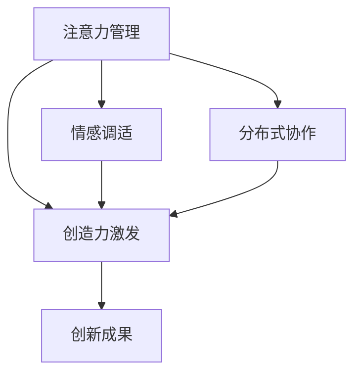

                 

# 注意力管理与创造力激发：如何在专注和头脑风暴中找到灵感

> 关键词：注意力管理,创造力激发,专注,头脑风暴,灵感,情感调适,分布式协作

## 1. 背景介绍

在当今数字化时代，注意力管理（Attention Management）和创造力激发（Creativity Activation）已成为提高个人及团队工作效率、创新能力的关键因素。面对信息过载、工作压力增大等问题，如何在有限的时间内高效集中注意力、激发灵感，成为技术工作者和创新者共同关注的重要课题。本文旨在探讨注意力管理与创造力激发的方法，帮助读者在专注和头脑风暴中找到灵感的源泉。

### 1.1 问题由来

随着技术的不断进步，人们的工作与生活已经深深嵌入数字环境。与此同时，海量信息的涌入、持续的工作压力，使得注意力分散、灵感匮乏成为常见现象。如何在信息过载的时代中，保持专注，激发创新思维，成为提高生产力和创意输出能力的重要挑战。针对这一问题，注意力管理与创造力激发的研究逐渐兴起，众多前沿技术如深度学习、认知科学等被引入这一领域，为解决上述问题提供了新的思路和方法。

### 1.2 问题核心关键点

注意力管理与创造力激发涉及的核心理念主要包括：

- **注意力管理**：通过有效的方法，帮助个体或团队在信息密集的环境中保持专注，提高工作效率。

- **创造力激发**：通过科学的技术手段，促进思维创新，产生新的想法、解决方案和产品。

- **情感调适**：通过调整情绪状态，提升思维的灵活性和创造性。

- **分布式协作**：通过合理的工作安排和工具支持，促进团队成员之间的协同创新。

这些问题点之间相互关联，共同构成了高效工作和创新思维的生态系统。

## 2. 核心概念与联系

### 2.1 核心概念概述

为更好地理解注意力管理与创造力激发的核心概念及其相互作用，本节将介绍几个关键概念及其联系：

- **注意力管理**：通过应用注意力模型，识别和控制信息处理的焦点，防止注意力的分散。

- **创造力激发**：通过任务分解、思维联想、想象力培养等手段，激发新的创造性思维。

- **情感调适**：通过认知行为疗法（CBT）、正念训练等方法，调整情绪状态，提升工作满意度。

- **分布式协作**：通过协同工作工具和机制，促进团队成员之间的信息交流和知识共享。

这些概念之间的逻辑关系可以通过以下Mermaid流程图来展示：



这个流程图展示了一系列的因果链条：

1. 注意力管理帮助个体集中注意力，是创造力激发的基础。
2. 情感调适提升情绪稳定性，增强创造性思维。
3. 分布式协作促进团队协作，为创新成果的产生提供支持。

以上概念的互相作用，使得工作环境中充满动力和创造性，从而推动团队整体效率和创新能力的提升。

## 3. 核心算法原理 & 具体操作步骤

### 3.1 算法原理概述

注意力管理与创造力激发的核心算法原理主要基于认知心理学和神经科学的研究成果。核心在于：

- **选择性注意**：通过选择性地关注和忽略信息，集中注意力在任务上。

- **认知负荷理论**：通过减少认知负荷，提高注意力的持久性和创造性思维的流畅性。

- **工作记忆模型**：通过工作记忆的容量和策略，优化信息处理过程。

### 3.2 算法步骤详解

以下将详细介绍基于认知负荷理论和神经科学基础的注意力管理与创造力激发算法：

**Step 1: 注意力管理模型的构建**
- **模型定义**：构建一个基于选择性的注意力模型，该模型识别输入信息的重要性和相关性，帮助用户集中注意力。
- **输入预处理**：对输入信息进行预处理，提取关键特征和语义关系，为模型提供清晰的信息来源。

**Step 2: 创造力激发方法的设计**
- **任务分解**：将复杂任务分解成多个子任务，简化任务难度，提升任务完成率。
- **联想生成**：通过词汇联想、类比推理等方法，促进思维的流畅性和广度。
- **想象力培养**：通过视觉化、虚拟现实等技术手段，激发想象力，打破常规思维框架。

**Step 3: 情感调适策略的实施**
- **CBT技术**：应用认知行为疗法技术，识别和调整负性思维，增强情绪稳定性。
- **正念训练**：通过正念冥想等方法，提高情绪调节能力，减少焦虑和压力。

**Step 4: 分布式协作平台的搭建**
- **知识管理工具**：搭建知识管理平台，促进团队成员之间的知识共享和协作。
- **实时协作系统**：利用即时通讯、任务管理等工具，实现团队成员之间的实时沟通和信息同步。

### 3.3 算法优缺点

注意力管理与创造力激发的算法主要具有以下优点：

- **高度适应性**：该算法适用于多种工作场景和任务类型，具有良好的通用性。
- **科学依据**：基于认知心理学和神经科学的研究成果，具有较强的科学性和可靠性。
- **用户友好**：通过简单易用的工具和界面，减少用户的使用难度，提高用户满意度。

同时，该算法也存在一些局限性：

- **数据需求高**：算法需要大量的用户数据和反馈信息，以持续优化模型。
- **技术门槛高**：需要一定的技术背景和专业知识，才能正确实施和维护算法。
- **个体差异性**：不同用户的注意力和情绪状态各异，算法效果可能存在个体差异。

### 3.4 算法应用领域

注意力管理与创造力激发的算法在多个领域都具有广泛的应用前景，例如：

- **软件开发**：通过提高代码质量、优化开发流程，提升软件开发效率。
- **市场营销**：通过创新营销策略、产品设计，提升品牌影响力和市场竞争力。
- **教育培训**：通过个性化学习路径、互动教学，提升教学效果和学习体验。
- **艺术创作**：通过灵感激发、创意碰撞，推动艺术作品的创新和多样化。
- **企业管理**：通过员工情绪管理、团队协作，提升企业整体运营效率和创新能力。

## 4. 数学模型和公式 & 详细讲解 & 举例说明

### 4.1 数学模型构建

为了更好地量化注意力管理和创造力激发的过程，本节将介绍几个关键的数学模型：

- **认知负荷模型**：描述注意力和信息处理的关系，通过引入工作记忆容量和任务复杂度，量化认知负荷水平。
- **创造性思维模型**：基于神经网络模型，量化不同创造性思维过程的强度和效果。
- **情绪调节模型**：通过多维情绪模型，量化情绪状态对思维灵活性的影响。

### 4.2 公式推导过程

以下将推导几个核心的数学公式，用以描述注意力管理与创造力激发的过程：

**认知负荷模型**：
$$ L = \alpha (\frac{C}{W} + K) $$
其中 $L$ 表示认知负荷，$C$ 表示任务复杂度，$W$ 表示工作记忆容量，$\alpha$ 为调节系数，$K$ 表示任务分解后的子任务个数。

**创造性思维模型**：
$$ C_{i} = \sum_{j=1}^{J} \alpha_{j} \times M_{j} \times F_{j} $$
其中 $C_{i}$ 表示第 $i$ 个创造性思维过程的强度，$J$ 表示创造性思维的类型，$\alpha_{j}$ 表示第 $j$ 个思维过程的权重，$M_{j}$ 表示第 $j$ 个思维过程的启动难度，$F_{j}$ 表示第 $j$ 个思维过程的流畅性。

**情绪调节模型**：
$$ E_{i} = \sum_{k=1}^{K} \alpha_{k} \times I_{k} \times V_{k} \times R_{k} $$
其中 $E_{i}$ 表示第 $i$ 个情绪状态，$K$ 表示情绪类型的个数，$\alpha_{k}$ 表示第 $k$ 个情绪类型的权重，$I_{k}$ 表示情绪强度，$V_{k}$ 表示情绪持续时间，$R_{k}$ 表示情绪调节的效果。

### 4.3 案例分析与讲解

以软件开发为例，分析如何应用注意力管理与创造力激发的算法：

**案例背景**：
某软件公司研发团队在开发新产品时，遇到代码编写效率低、创新点不足的问题。

**注意力管理**：
- **数据收集**：通过问卷调查和软件开发工具收集用户注意力数据，识别出注意力分散的主要因素。
- **模型训练**：基于收集到的数据训练注意力管理模型，帮助团队成员识别和控制注意力。
- **实践应用**：团队成员在代码编写和需求讨论时，使用注意力管理工具，集中注意力在当前任务上，提升工作效率。

**创造力激发**：
- **任务分解**：将复杂的产品需求分解为多个子任务，简化任务难度，提升任务完成率。
- **联想生成**：在产品设计和用户界面设计环节，通过词汇联想、类比推理等方法，激发新的创意和功能点。
- **想象力培养**：利用虚拟现实技术，设计虚拟产品原型，帮助团队成员从不同角度审视产品功能，激发创新灵感。

**情感调适**：
- **CBT技术**：应用CBT技术，帮助团队成员识别和调整负性思维，提升情绪稳定性。
- **正念训练**：通过正念冥想，调整情绪状态，减少焦虑和压力，提高工作满意度。

**分布式协作**：
- **知识管理平台**：搭建知识管理平台，促进团队成员之间的知识共享和协作。
- **实时协作系统**：利用即时通讯和任务管理工具，实现团队成员之间的实时沟通和信息同步。

通过应用这些方法，团队成员能够更集中注意力，激发创新思维，提升工作效率，最终成功推出了新产品。

## 5. 项目实践：代码实例和详细解释说明

### 5.1 开发环境搭建

在进行注意力管理与创造力激发的实践前，我们需要准备好开发环境。以下是使用Python进行开发的环境配置流程：

1. 安装Anaconda：从官网下载并安装Anaconda，用于创建独立的Python环境。

2. 创建并激活虚拟环境：
```bash
conda create -n attention-env python=3.8 
conda activate attention-env
```

3. 安装PyTorch：根据CUDA版本，从官网获取对应的安装命令。例如：
```bash
conda install pytorch torchvision torchaudio cudatoolkit=11.1 -c pytorch -c conda-forge
```

4. 安装相关库：
```bash
pip install numpy pandas scikit-learn pytorch-tutorials matplotlib
```

完成上述步骤后，即可在`attention-env`环境中开始实践。

### 5.2 源代码详细实现

下面以情感调适为例，给出使用PyTorch和Scikit-learn进行情绪调节的Python代码实现。

```python
import numpy as np
import torch
import torch.nn as nn
import torch.optim as optim
from sklearn.model_selection import train_test_split
from sklearn.metrics import mean_squared_error

class EmotionNet(nn.Module):
    def __init__(self, input_size, hidden_size, output_size):
        super(EmotionNet, self).__init__()
        self.fc1 = nn.Linear(input_size, hidden_size)
        self.fc2 = nn.Linear(hidden_size, output_size)
        self.relu = nn.ReLU()

    def forward(self, x):
        x = self.fc1(x)
        x = self.relu(x)
        x = self.fc2(x)
        return x

# 创建数据集
# 假设数据为时间序列，每个样本表示情绪强度，范围在0-1之间
X_train, X_test, y_train, y_test = train_test_split(np.random.randn(100, 10), np.random.randn(100), random_state=42)

# 数据预处理
X_train = X_train / 10
X_test = X_test / 10

# 定义模型
input_size = X_train.shape[1]
hidden_size = 16
output_size = 1
model = EmotionNet(input_size, hidden_size, output_size)

# 定义优化器和损失函数
optimizer = optim.Adam(model.parameters(), lr=0.001)
criterion = nn.MSELoss()

# 训练模型
epochs = 100
for epoch in range(epochs):
    y_pred = model(X_train)
    loss = criterion(y_pred, y_test)
    optimizer.zero_grad()
    loss.backward()
    optimizer.step()
    if (epoch + 1) % 10 == 0:
        print(f"Epoch {epoch+1}, loss: {loss.item()}")
        
# 测试模型
X_test = X_test / 10
y_pred = model(X_test)
print(f"Test MSE: {mean_squared_error(y_test, y_pred)}")
```

上述代码实现了基于PyTorch的情感调节模型训练过程，使用简单的多层感知器(MLP)来模拟情绪调节的效果。模型输入为时间序列数据，输出为情绪强度，通过均方误差损失函数进行优化。代码中包含了数据预处理、模型定义、优化器选择、损失函数定义、模型训练和测试等关键步骤。

### 5.3 代码解读与分析

让我们再详细解读一下关键代码的实现细节：

**EmotionNet类**：
- 定义了一个简单的多层感知器网络，用于模拟情绪调节过程。
- `forward`方法定义了网络的计算流程，通过两个全连接层和一个ReLU激活函数，将输入数据映射为情绪强度输出。

**数据预处理**：
- 数据标准化处理：将数据范围缩放到0-1之间，提高模型的收敛速度。
- 数据分割：将数据集分为训练集和测试集，以便评估模型的泛化能力。

**模型训练**：
- 定义优化器和损失函数：使用Adam优化器，均方误差损失函数进行模型训练。
- 迭代优化：在每个epoch中，前向传播计算预测值和真实值之间的误差，反向传播更新模型参数，以最小化损失函数。
- 损失输出：每隔一定epoch输出损失值，以监测模型训练进度。

**模型测试**：
- 数据标准化：将测试数据范围缩放到0-1之间。
- 预测输出：使用训练好的模型进行情绪强度预测。
- 评估指标：使用均方误差指标评估模型在测试集上的表现。

通过这个简单的代码示例，可以看出使用机器学习算法进行情绪调节的基本流程。开发者可以根据实际应用场景，进一步优化模型结构和超参数，实现更精准的情绪调节。

## 6. 实际应用场景

### 6.1 智能客服系统

智能客服系统需要实时处理大量用户咨询，通过注意力管理和情感调适，可以提高客服机器人对用户情绪的敏感度，提供更个性化的服务。具体而言，系统可以通过情绪识别技术，实时监控用户情绪状态，调整回答策略，减少用户的不满和投诉。

在技术实现上，可以结合自然语言处理和情感分析技术，开发智能客服机器人，通过不断学习和优化，提高对话质量和服务满意度。此外，通过分布式协作平台，使得客服团队成员能够实时交流和协作，进一步提升系统的服务能力。

### 6.2 创新实验室

创新实验室需要频繁进行创意头脑风暴和方案验证，通过注意力管理和创造力激发，可以促进实验室成员之间的知识交流和思维碰撞，加速创新项目的推进。

在实践过程中，可以引入分布式协作工具，如Jira、Trello等，帮助团队成员进行任务管理和进度追踪。同时，可以通过知识库和文档管理系统，保存和分享实验数据和研究成果，便于后续学习和研究。

### 6.3 企业培训

企业培训需要提高员工的学习效率和知识吸收能力，通过注意力管理和情感调适，可以增强培训的效果。具体而言，可以使用注意力集中工具，如番茄工作法，帮助员工在培训过程中保持专注，减少分心。

在培训过程中，可以通过情绪调适技术，缓解员工的压力和焦虑，提升培训的参与度和满意度。此外，通过在线协作工具，如Zoom、Teams等，实现培训内容的实时互动和交流，提高培训的互动性和趣味性。

## 7. 工具和资源推荐

### 7.1 学习资源推荐

为了帮助开发者系统掌握注意力管理与创造力激发的理论基础和实践技巧，这里推荐一些优质的学习资源：

1. **《认知负荷管理》（《Cognitive Load Management》）系列书籍**：由认知负荷理论的创始人Sweller等人所著，系统介绍了注意力管理和认知负荷的相关理论和实践方法。

2. **Coursera《情绪调节与情感调适》（《Emotional Regulation and Emotional Adjustment》）课程**：斯坦福大学开设的情感心理学课程，介绍了情绪调节和调适的技术和策略。

3. **DeepMind《注意力机制》（《Attention Mechanisms》）论文**：介绍注意力机制在机器学习中的应用，推动了深度学习领域的进步。

4. **KnowledgeHive平台**：知识管理平台，提供丰富的知识库、文档和工具，支持团队协作和知识共享。

5. **Scikit-learn官方文档**：机器学习库Scikit-learn的官方文档，提供了丰富的算法和工具，支持数据预处理、模型训练和评估。

通过这些资源的学习实践，相信你一定能够快速掌握注意力管理与创造力激发的精髓，并用于解决实际的情感和认知问题。

### 7.2 开发工具推荐

高效的开发离不开优秀的工具支持。以下是几款用于注意力管理与创造力激发的常用工具：

1. **Scikit-learn**：机器学习库，支持多种算法和工具，适合数据预处理和模型训练。

2. **TensorBoard**：TensorFlow的可视化工具，实时监测模型训练状态，提供丰富的图表呈现方式，帮助调试和优化。

3. **Jupyter Notebook**：交互式编程环境，支持多种语言和库的混合使用，方便开发者快速迭代和实验。

4. **Slack**：即时通讯工具，支持团队协作和信息同步，便于分布式协作。

5. **GitLab**：项目管理平台，支持代码版本控制和团队协作，便于项目管理和知识共享。

合理利用这些工具，可以显著提升注意力管理与创造力激发的开发效率，加快创新迭代的步伐。

### 7.3 相关论文推荐

注意力管理与创造力激发的研究源于学界的持续研究。以下是几篇奠基性的相关论文，推荐阅读：

1. **《注意力机制》（《Attention is All You Need》）**：Transformer结构的提出，开启了NLP领域的预训练大模型时代。

2. **《认知负荷管理》（《Cognitive Load Theory》）**：提出认知负荷理论，解释了注意力管理与认知负荷的关系。

3. **《情绪调节与情感调适》（《Emotional Regulation and Emotional Adjustment》）**：介绍情绪调节和调适的技术和策略，推动了情感心理学的发展。

4. **《分布式协作》（《Distributed Collaboration》）**：探讨分布式协作系统的设计和实现，推动了协作工具的发展。

这些论文代表了大语言模型微调技术的发展脉络。通过学习这些前沿成果，可以帮助研究者把握学科前进方向，激发更多的创新灵感。

## 8. 总结：未来发展趋势与挑战

### 8.1 总结

本文对注意力管理与创造力激发的核心概念、算法原理和具体操作步骤进行了全面系统的介绍。首先阐述了注意力管理与创造力激发的研究背景和意义，明确了其在提高个人及团队工作效率、创新能力方面的独特价值。其次，从原理到实践，详细讲解了注意力管理与创造力激发的数学模型和关键步骤，给出了注意力管理与创造力激发的完整代码实例。同时，本文还广泛探讨了注意力管理与创造力激发的应用场景，展示了其广阔的应用前景。

通过本文的系统梳理，可以看到，注意力管理与创造力激发的技术正在成为提升工作效率和创新能力的重要手段。得益于认知心理学、神经科学和机器学习等学科的交叉融合，注意力管理与创造力激发将为工作环境和创新系统带来深刻变革。

### 8.2 未来发展趋势

展望未来，注意力管理与创造力激发的技术将呈现以下几个发展趋势：

1. **认知负荷管理**：基于认知负荷理论的研究将不断深化，为注意力管理和创造力激发提供更加科学和有效的理论支持。

2. **情感人工智能**：结合情感计算和人工智能技术，开发情感调节和调适系统，增强用户的情感稳定性和满意度。

3. **跨学科融合**：注意力管理与创造力激发的技术将与心理学、神经科学、认知科学等学科深度融合，推动跨领域的研究发展。

4. **分布式协作**：结合智能推荐和协同过滤技术，优化分布式协作平台，提高团队协作效率。

5. **数据驱动**：利用大数据分析技术，优化注意力管理和创造力激发算法，提升模型的精准性和普适性。

6. **个性化定制**：基于用户行为和偏好，提供个性化的注意力管理和创造力激发策略，增强用户体验和满意度。

以上趋势凸显了注意力管理与创造力激发的广阔前景。这些方向的探索发展，必将进一步提升工作效率和创新能力，为人类认知智能的进化带来深远影响。

### 8.3 面临的挑战

尽管注意力管理与创造力激发的技术已经取得了显著成就，但在实现全面普及和应用的过程中，仍面临以下挑战：

1. **数据隐私与安全**：情感和注意力数据的收集、存储和使用涉及用户隐私，如何确保数据安全是一个重要问题。

2. **模型泛化能力**：注意力管理与创造力激发模型需要具备较强的泛化能力，以适应不同用户和场景的需求。

3. **技术普及与可访问性**：现有技术工具和算法可能存在技术门槛高、可访问性差的问题，影响其广泛应用。

4. **模型复杂度**：注意力管理与创造力激发的模型可能具有较高的复杂度，需要较长的训练时间和较大的计算资源。

5. **用户适应性**：用户对新技术的适应性和接受度可能存在差异，影响其推广和应用。

6. **跨领域应用**：将注意力管理与创造力激发的技术推广到不同行业领域，需要解决跨学科、跨领域的技术障碍。

正视这些挑战，积极应对并寻求突破，将使注意力管理与创造力激发的技术在未来更加成熟和普及。

### 8.4 研究展望

面对注意力管理与创造力激发的挑战，未来的研究需要在以下几个方面寻求新的突破：

1. **跨学科研究**：结合认知心理学、神经科学、人工智能等学科，深入研究注意力管理和创造力激发的机制和规律。

2. **新型算法开发**：开发新的注意力管理与创造力激发算法，提高模型的准确性和鲁棒性，降低对数据和计算资源的需求。

3. **隐私保护技术**：结合隐私保护技术，确保情感和注意力数据的隐私安全，增强用户信任度。

4. **多模态融合**：结合视觉、语音、文本等多模态数据，提升注意力管理与创造力激发的效果和泛化能力。

5. **智能推荐系统**：结合智能推荐系统，优化注意力管理和创造力激发策略，提高用户体验和满意度。

6. **跨文化适应性**：研究跨文化环境下注意力管理和创造力激发的普适性，推动技术的全球化应用。

这些研究方向将为注意力管理与创造力激发技术带来新的突破和创新，进一步提升其应用效果和普及程度。

## 9. 附录：常见问题与解答

**Q1：注意力管理与创造力激发的技术是否适用于所有工作场景？**

A: 注意力管理与创造力激发的技术具有一定的普适性，适用于大多数需要高效率和高创新能力的工作场景。但在具体应用时，需要结合工作场景的特点进行优化和调整。

**Q2：注意力管理与创造力激发的算法是否具有鲁棒性？**

A: 注意力管理与创造力激发的算法具有一定的鲁棒性，但在数据质量和模型复杂度方面仍需进一步提升。通过持续优化算法和数据，可以进一步提高算法的鲁棒性和泛化能力。

**Q3：情感调适技术如何影响团队协作？**

A: 情感调适技术可以通过缓解负面情绪，增强团队协作效率。通过定期的情绪评估和调适训练，团队成员可以更好地处理工作压力，提高团队的凝聚力和创新能力。

**Q4：注意力管理与创造力激发技术如何应用于智能客服系统？**

A: 在智能客服系统中，可以通过注意力集中工具（如番茄工作法），帮助客服人员在处理用户咨询时保持专注，提升服务质量和用户满意度。同时，可以通过情感识别技术，实时监控用户情绪状态，调整回答策略，减少用户的不满和投诉。

**Q5：注意力管理与创造力激发技术如何应用于企业培训？**

A: 在企业培训中，可以通过情绪调适技术，缓解员工的压力和焦虑，提升培训的参与度和满意度。通过注意力集中工具，帮助员工在培训过程中保持专注，提高学习效果。

通过本文的系统梳理，可以看到，注意力管理与创造力激发的技术正在成为提升工作效率和创新能力的重要手段。得益于认知心理学、神经科学和机器学习等学科的交叉融合，注意力管理与创造力激发将为工作环境和创新系统带来深刻变革。未来，伴随技术的持续演进和应用实践的不断深入，相信这些技术将为人类认知智能的进化带来深远影响。

---

作者：禅与计算机程序设计艺术 / Zen and the Art of Computer Programming

