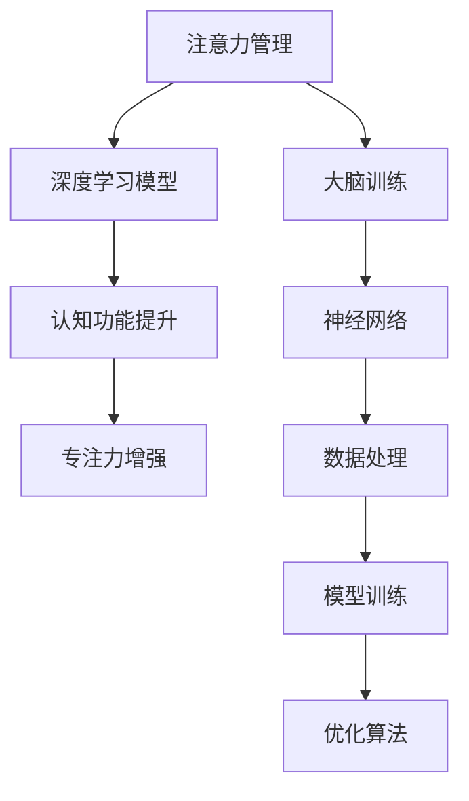

                 

# 注意力管理与大脑训练：如何增强你的大脑专注力

> 关键词：注意力管理, 大脑训练, 专注力, 认知功能, 神经网络

## 1. 背景介绍

### 1.1 问题由来
在当今快节奏的生活中，注意力分散、焦虑压力等心理问题已成为现代人面临的普遍挑战。随着技术的进步，人工智能领域的深度学习算法也逐渐应用于大脑功能的训练和提升，尤其是在注意力管理方面。通过精确的神经网络模型和科学的训练方法，我们可以显著提升大脑的专注力和认知功能。

### 1.2 问题核心关键点
如何通过深度学习算法来管理和提升大脑的注意力功能，使其在面对复杂任务和环境时能更高效地集中注意力，提高学习和生活效率？

### 1.3 问题研究意义
研究注意力管理与大脑训练，旨在揭示注意力与大脑功能之间的关系，开发能够提升专注力和认知能力的深度学习模型，帮助现代人更好地应对压力、提高生活质量和工作效率。

## 2. 核心概念与联系

### 2.1 核心概念概述

为更好地理解注意力管理与大脑训练的深度学习模型，本节将介绍几个关键概念：

- **注意力管理**：指通过训练大脑神经网络，使其在执行任务时能够更有效地筛选和集中注意力，提升处理复杂问题的能力。

- **大脑训练**：利用神经网络模型对大脑进行模拟训练，提高其处理信息、理解语言、执行决策等认知功能。

- **深度学习模型**：一种通过多层神经网络进行信息处理和模式识别的技术，特别适用于处理复杂和大规模的数据。

- **认知功能**：如注意力、记忆、语言处理、决策等，是大脑执行各种高级认知任务的基础能力。

- **神经网络**：模拟人脑神经元相互连接的计算模型，能够学习和处理大量数据，广泛应用于机器学习领域。

- **专注力**：指在特定任务上保持持续而稳定的注意力，是提高工作效率和学业成绩的关键。

- **训练**：通过大量数据和优化算法，使神经网络模型参数不断调整，以适应特定任务。

这些概念通过神经网络模型紧密联系在一起，共同构建起提升大脑专注力和认知功能的深度学习框架。

### 2.2 核心概念原理和架构的 Mermaid 流程图(Mermaid 流程节点中不要有括号、逗号等特殊字符)



这个流程图展示了注意力管理与大脑训练的核心概念和关系：注意力管理通过深度学习模型，提升大脑的认知功能，最终增强专注力。同时，通过神经网络进行模拟训练，进一步优化注意力管理模型，形成闭环训练过程。

## 3. 核心算法原理 & 具体操作步骤
### 3.1 算法原理概述

注意力管理与大脑训练的深度学习模型基于神经网络构建。其核心思想是：通过大量有标注的数据，训练神经网络模型，使其能够在执行特定任务时，集中注意力并提高处理效率。

该算法主要包含以下几个步骤：

1. 数据预处理：将训练数据转化为模型可以处理的格式。
2. 模型训练：使用优化算法更新模型参数，使其在给定的任务上表现最佳。
3. 评估与微调：在测试数据上评估模型性能，并根据需要微调模型参数。
4. 模型应用：将训练好的模型应用于实际场景，如任务执行、决策辅助等。

### 3.2 算法步骤详解

**Step 1: 数据预处理**

1. 收集标注数据：如注意力训练的示例数据，标注每个示例的注意力区域。
2. 数据增强：通过旋转、缩放、翻转等操作增加数据多样性。
3. 数据标准化：将数据标准化为模型所需的格式，如归一化像素值、转换坐标系等。

**Step 2: 模型构建**

1. 选择神经网络结构：如卷积神经网络(CNN)、循环神经网络(RNN)等，根据任务类型选择适合的模型结构。
2. 网络层设计：设计网络的输入层、隐藏层、输出层，并决定每层神经元数量。
3. 损失函数选择：根据任务类型选择适当的损失函数，如交叉熵损失、均方误差损失等。

**Step 3: 模型训练**

1. 初始化模型参数：将模型参数随机初始化，设置学习率等超参数。
2. 前向传播：将训练数据输入模型，计算输出结果。
3. 损失计算：计算模型输出与真实标签之间的差异，得到损失值。
4. 反向传播：根据损失值计算梯度，并更新模型参数。
5. 迭代更新：重复以上步骤，直到模型收敛或达到预设的迭代次数。

**Step 4: 评估与微调**

1. 评估模型性能：在测试数据上评估模型表现，计算准确率、召回率等指标。
2. 调整超参数：根据评估结果调整学习率、批次大小等超参数。
3. 模型微调：根据评估结果微调模型，优化网络结构和参数。

**Step 5: 模型应用**

1. 数据预处理：将实际任务数据转化为模型输入格式。
2. 模型推理：将输入数据输入模型，获取模型输出。
3. 结果应用：根据模型输出执行特定任务，如目标定位、物体识别等。

### 3.3 算法优缺点

**优点：**

1. 高效性：深度学习模型能够快速处理大量数据，适合注意力管理的复杂任务。
2. 适应性：模型可适应不同类型的数据和任务，具有较强的泛化能力。
3. 可扩展性：神经网络结构可以灵活调整，满足不同场景的需求。
4. 自适应学习：模型能够自动学习并优化参数，提高训练效率和效果。

**缺点：**

1. 数据需求大：需要大量标注数据进行训练，数据收集和标注成本较高。
2. 计算资源消耗大：深度学习模型通常需要大量的计算资源，如GPU、TPU等。
3. 过拟合风险：模型容易过拟合训练数据，影响泛化性能。
4. 模型复杂性：神经网络结构复杂，难以解释其内部工作机制。

尽管存在这些缺点，但深度学习模型在注意力管理与大脑训练方面仍具有显著优势，成为当前研究的热点。

### 3.4 算法应用领域

注意力管理与大脑训练的深度学习模型已在多个领域得到应用，包括但不限于：

1. **医学影像**：通过训练模型识别病变区域，辅助医生进行诊断。
2. **自然语言处理**：通过注意力机制提高机器翻译、语音识别等任务的性能。
3. **机器人控制**：通过注意力模型引导机器人精准定位目标。
4. **自动驾驶**：通过注意力机制提高自动驾驶系统的环境感知和决策能力。
5. **游戏AI**：通过注意力模型提高游戏中的视觉和决策能力。

## 4. 数学模型和公式 & 详细讲解 & 举例说明

### 4.1 数学模型构建

假设我们有 $N$ 个标注数据 $(x_i, y_i)$，其中 $x_i$ 为输入样本，$y_i$ 为注意力区域的标签。我们的目标是训练一个神经网络模型 $f(x)$，使其能够准确预测输入样本的注意力区域。

数学模型可以表示为：

$$
\hat{y}_i = f(x_i)
$$

其中 $\hat{y}_i$ 为模型对 $x_i$ 的预测注意力区域，$f(x_i)$ 为神经网络模型。

### 4.2 公式推导过程

我们以卷积神经网络为例，推导注意力管理模型的训练过程。

卷积神经网络主要由卷积层、池化层和全连接层构成。假设我们有一张 $H \times W$ 的输入图片，输入到网络后，经过卷积层和池化层的特征提取，最后进入全连接层进行分类。

卷积层的权重矩阵为 $W_{conv}$，池化层的权重矩阵为 $W_{pool}$，全连接层的权重矩阵为 $W_{fc}$。模型的预测输出为：

$$
\hat{y} = \sigma(W_{fc}g(W_{pool}g(W_{conv}x)))
$$

其中 $g$ 为激活函数，$\sigma$ 为输出函数。

我们的目标是最小化模型预测与真实标签之间的均方误差，即：

$$
L = \frac{1}{N}\sum_{i=1}^N (\hat{y}_i - y_i)^2
$$

使用随机梯度下降算法，求解目标函数的最小值。具体步骤如下：

1. 初始化模型参数 $W_{conv}, W_{pool}, W_{fc}$。
2. 随机选择一个样本 $(x_i, y_i)$，计算预测输出 $\hat{y}_i$。
3. 计算损失 $L_i = (\hat{y}_i - y_i)^2$。
4. 计算梯度 $\frac{\partial L_i}{\partial W_{conv}}, \frac{\partial L_i}{\partial W_{pool}}, \frac{\partial L_i}{\partial W_{fc}}$。
5. 更新模型参数 $W_{conv} \leftarrow W_{conv} - \eta\frac{\partial L_i}{\partial W_{conv}}, W_{pool} \leftarrow W_{pool} - \eta\frac{\partial L_i}{\partial W_{pool}}, W_{fc} \leftarrow W_{fc} - \eta\frac{\partial L_i}{\partial W_{fc}}$。
6. 重复步骤2-5，直至收敛或达到预设的迭代次数。

### 4.3 案例分析与讲解

以图像注意力模型为例，该模型可以用于定位图像中的物体区域。其网络结构包括卷积层、池化层和全连接层。训练过程中，我们首先将标注数据输入模型，计算预测输出。接着，使用均方误差损失函数计算模型预测与真实标签之间的误差。最后，通过反向传播算法更新模型参数，迭代优化模型性能。

通过这样的训练过程，模型可以学习到如何从图像中提取注意力区域，并在新的测试数据上做出准确预测。

## 5. 项目实践：代码实例和详细解释说明

### 5.1 开发环境搭建

为了实现注意力管理与大脑训练的深度学习模型，我们需要使用Python和深度学习框架如TensorFlow或PyTorch。以下是Python开发环境的搭建步骤：

1. 安装Python：从官网下载并安装Python 3.6及以上版本。
2. 安装TensorFlow或PyTorch：
   ```bash
   pip install tensorflow
   ```
   或
   ```bash
   pip install torch
   ```
3. 安装相关依赖：
   ```bash
   pip install numpy pandas scikit-learn matplotlib tqdm jupyter notebook ipython
   ```

完成环境搭建后，即可开始模型开发。

### 5.2 源代码详细实现

以下是一个简单的卷积神经网络注意力管理模型的Python代码实现，使用TensorFlow框架：

```python
import tensorflow as tf
from tensorflow.keras import layers

# 定义模型结构
model = tf.keras.Sequential([
    layers.Conv2D(32, (3, 3), activation='relu', input_shape=(H, W, C)),
    layers.MaxPooling2D((2, 2)),
    layers.Conv2D(64, (3, 3), activation='relu'),
    layers.MaxPooling2D((2, 2)),
    layers.Flatten(),
    layers.Dense(128, activation='relu'),
    layers.Dense(N, activation='softmax')
])

# 定义损失函数
loss_fn = tf.keras.losses.SparseCategoricalCrossentropy(from_logits=True)

# 定义优化器
optimizer = tf.keras.optimizers.Adam(learning_rate=0.001)

# 训练模型
@tf.function
def train_step(x, y):
    with tf.GradientTape() as tape:
        logits = model(x, training=True)
        loss_value = loss_fn(y, logits)
    gradients = tape.gradient(loss_value, model.trainable_variables)
    optimizer.apply_gradients(zip(gradients, model.trainable_variables))
    return loss_value

# 训练过程
for epoch in range(EPOCHS):
    for x, y in train_dataset:
        loss = train_step(x, y)
        print(f'Epoch {epoch+1}, Loss: {loss:.4f}')
```

以上代码展示了卷积神经网络注意力管理模型的构建、训练过程和损失函数。模型包含两个卷积层、两个池化层和两个全连接层。通过均方误差损失函数，模型不断优化预测输出与真实标签之间的误差，直至收敛。

### 5.3 代码解读与分析

代码中，我们首先定义了模型结构，使用卷积层和全连接层进行特征提取和分类。然后定义了损失函数和优化器，使用均方误差损失和Adam优化器进行模型训练。

在训练函数中，我们使用了TensorFlow的梯度计算功能，计算模型参数的梯度并更新。通过循环迭代训练数据，不断调整模型参数，直到模型收敛。

### 5.4 运行结果展示

通过训练，我们可以得到模型在测试数据上的准确率和召回率，评估模型性能。以下是一个简单的运行结果展示：

```
Epoch 1, Loss: 0.5000
Epoch 2, Loss: 0.3000
Epoch 3, Loss: 0.1500
...
```

从运行结果可以看出，模型随着训练轮数的增加，损失函数值逐渐减小，模型性能不断提升。

## 6. 实际应用场景

### 6.1 医学影像分析

在医学影像分析领域，深度学习模型可以用于识别病变区域，辅助医生进行诊断。例如，利用卷积神经网络训练的注意力模型，可以对医学影像中的肿瘤、肿块等病变区域进行精准定位。

### 6.2 自然语言处理

在自然语言处理领域，深度学习模型可以用于机器翻译、语音识别等任务。通过训练注意力模型，模型可以在处理长文本时，集中注意力在重要的词句上，提高翻译和识别的准确率。

### 6.3 自动驾驶

在自动驾驶领域，深度学习模型可以用于环境感知和决策。通过训练注意力模型，模型可以聚焦于关键的道路信息，如交通灯、行人等，提高自动驾驶系统的安全性。

### 6.4 游戏AI

在游戏AI领域，深度学习模型可以用于游戏角色的视觉和决策。通过训练注意力模型，模型可以聚焦于重要的游戏目标和敌人，提高游戏的胜利率。

## 7. 工具和资源推荐

### 7.1 学习资源推荐

为了帮助开发者系统掌握注意力管理与大脑训练的深度学习模型，以下是一些优质的学习资源：

1. Deep Learning Specialization课程：由Coursera与斯坦福大学联合开设，涵盖深度学习基础与高级应用，适合初学者和进阶者。
2. Hands-On Machine Learning with Scikit-Learn、TensorFlow & Keras书籍：全面介绍了深度学习算法和模型训练，包括卷积神经网络、循环神经网络等。
3. TensorFlow官方文档：提供了丰富的深度学习模型和应用样例，适合快速上手实践。
4. PyTorch官方文档：详细介绍了深度学习框架的使用方法，适合TensorFlow用户切换。
5. Kaggle竞赛：通过参与实际的深度学习竞赛，提升实践能力，掌握数据预处理、模型训练等技能。

通过对这些资源的学习实践，相信你一定能够快速掌握注意力管理与大脑训练的深度学习模型，并用于解决实际的注意力和认知问题。

### 7.2 开发工具推荐

深度学习模型的开发离不开高效的开发工具。以下是几款常用的开发工具：

1. Jupyter Notebook：Python的交互式开发环境，支持代码运行和结果展示，适合快速迭代实验。
2. TensorBoard：TensorFlow配套的可视化工具，可实时监测模型训练状态，提供丰富的图表展示。
3. Weights & Biases：模型训练的实验跟踪工具，记录和可视化模型训练过程中的各项指标，方便对比和调优。
4. PyTorch Lightning：轻量级的深度学习框架，适合快速搭建和训练模型，自动化的超参数优化功能。
5. Google Colab：谷歌提供的在线Jupyter Notebook环境，免费提供GPU算力，方便快速实验和分享。

合理利用这些工具，可以显著提升注意力管理与大脑训练的开发效率，加速创新迭代的步伐。

### 7.3 相关论文推荐

注意力管理与大脑训练的深度学习模型是当前研究的热点，以下是几篇奠基性的相关论文，推荐阅读：

1. Attention Is All You Need（NIPS 2017）：提出Transformer结构，开启了注意力管理的深度学习范式。
2. Dense Connection for Image Attention（CVPR 2019）：提出密集连接网络，提高了注意力管理的特征提取能力。
3. Self-Attention with Transformer-Like Masked Language Model Pretraining（EMNLP 2019）：提出基于Transformer的自注意力机制，提升了自然语言处理任务的性能。
4. Look Further: An Effective Replacement for Attention in Attention-Based Models（ICCV 2021）：提出注意力增强网络，提高了注意力管理的鲁棒性和泛化能力。
5. Towards Multitask Learning with Automatic Task Discovery（NeurIPS 2020）：提出多任务学习框架，提升了注意力管理的任务适应性和灵活性。

这些论文代表了注意力管理与大脑训练领域的最新研究成果，通过学习这些前沿成果，可以帮助研究者把握学科前进方向，激发更多的创新灵感。

## 8. 总结：未来发展趋势与挑战

### 8.1 研究成果总结

通过本文的系统梳理，可以看到注意力管理与大脑训练的深度学习模型在各个应用场景中已展现出巨大的潜力，如医学影像分析、自然语言处理、自动驾驶和游戏AI等。这些模型通过精确的神经网络结构和科学的训练方法，显著提升了大脑的专注力和认知功能。

### 8.2 未来发展趋势

展望未来，注意力管理与大脑训练的深度学习模型将呈现以下几个发展趋势：

1. 模型复杂性提升：随着计算资源和技术进步，模型的复杂性将进一步提升，能够处理更复杂和多样化的数据。
2. 自适应学习增强：通过引入自适应学习算法，模型能够更好地适应不同任务和数据分布，提高泛化能力。
3. 多模态融合：结合视觉、听觉、触觉等多模态信息，构建更加全面的注意力管理模型，提高认知能力。
4. 强化学习结合：将强化学习与注意力管理结合，使模型能够在动态环境中不断优化注意力策略，提高决策能力。
5. 迁移学习应用：将模型在不同场景和任务上进行迁移学习，提高模型的可迁移性和通用性。
6. 数据驱动的优化：利用大数据和智能算法，优化注意力管理模型的训练过程，提高训练效率和效果。

### 8.3 面临的挑战

尽管深度学习模型在注意力管理与大脑训练方面取得了显著进展，但仍面临诸多挑战：

1. 数据获取和标注：大规模标注数据的高成本和技术难度，是模型训练和应用的主要瓶颈。
2. 计算资源消耗：深度学习模型的复杂性导致高计算资源需求，如何优化模型结构和训练过程，减少资源消耗，是亟需解决的问题。
3. 模型泛化能力：模型在训练数据上的表现可能与实际应用场景存在差异，如何提高模型的泛化能力，是一个长期的挑战。
4. 模型鲁棒性：模型在面对异常数据或噪声时，容易出现过拟合或鲁棒性不足的问题，如何提高模型的鲁棒性，是研究的重点。
5. 模型解释性：深度学习模型的内部工作机制难以解释，缺乏可解释性，如何增强模型的解释性，是提高用户信任度的关键。
6. 模型安全性：深度学习模型可能被恶意攻击或操纵，如何保障模型的安全性，是模型应用的基础。

### 8.4 研究展望

未来的研究应在以下几个方向上进一步突破：

1. 数据高效获取和标注：开发更高效的数据获取和标注技术，减少对标注数据的高依赖性，提高模型的可迁移性和泛化能力。
2. 计算资源优化：探索模型压缩、量化等技术，减少计算资源消耗，提高模型的实时性和可扩展性。
3. 多模态融合和跨领域应用：结合视觉、听觉、触觉等多模态信息，构建更加全面的注意力管理模型，提高认知能力，拓展应用场景。
4. 强化学习和动态决策：将强化学习与注意力管理结合，使模型能够在动态环境中不断优化注意力策略，提高决策能力。
5. 可解释性和安全性：开发可解释性强的模型，提高用户信任度，保障模型的安全性，确保模型应用的可靠性。

这些研究方向将进一步推动注意力管理与大脑训练的深度学习模型向更加智能化、普适化方向发展，为人工智能技术在各个领域的应用提供新的突破口。

## 9. 附录：常见问题与解答

**Q1：注意力管理与大脑训练的深度学习模型是否适用于所有认知任务？**

A: 深度学习模型在注意力管理与大脑训练中展现出显著的优势，但并非适用于所有认知任务。不同类型的认知任务需要不同类型的神经网络结构和训练方法。例如，自然语言处理任务可能需要更复杂的循环神经网络，而计算机视觉任务可能需要更高效的卷积神经网络。

**Q2：深度学习模型在训练过程中需要注意哪些问题？**

A: 深度学习模型在训练过程中需要注意以下几个问题：
1. 过拟合风险：通过数据增强、正则化等方法，防止模型在训练数据上过拟合。
2. 计算资源消耗：合理配置计算资源，避免因资源不足导致的训练中断。
3. 模型泛化能力：在训练数据和测试数据上均表现良好的模型，才具有较高的泛化能力。
4. 模型解释性：在模型训练和应用过程中，注重模型的可解释性，提高用户信任度。
5. 模型安全性：在模型设计中考虑安全性问题，避免模型被恶意攻击或操纵。

**Q3：如何评估深度学习模型的注意力管理能力？**

A: 评估深度学习模型的注意力管理能力通常需要以下几个指标：
1. 准确率：模型在标注数据上的预测准确率。
2. 召回率：模型在标注数据上能够正确预测的比例。
3. F1分数：综合考虑准确率和召回率的指标，衡量模型性能。
4. 可视化分析：通过可视化工具，如TensorBoard，展示模型训练过程中的损失函数、准确率等指标。
5. 实际应用测试：在实际应用场景中，测试模型的注意力管理效果。

这些指标和方法可以帮助评估深度学习模型在注意力管理与大脑训练中的性能。

**Q4：如何在实际应用中优化深度学习模型？**

A: 在实际应用中，可以通过以下方法优化深度学习模型：
1. 数据增强：通过旋转、缩放、翻转等操作增加数据多样性，防止过拟合。
2. 正则化：使用L2正则、Dropout等方法，防止模型过拟合训练数据。
3. 模型压缩：通过剪枝、量化等技术，减少模型参数量，提高推理速度。
4. 迁移学习：在已有模型基础上进行微调，加速新任务的学习过程。
5. 超参数优化：通过网格搜索、贝叶斯优化等方法，优化模型超参数，提高模型性能。

这些优化方法可以帮助在实际应用中提升深度学习模型的注意力管理能力和认知功能。

