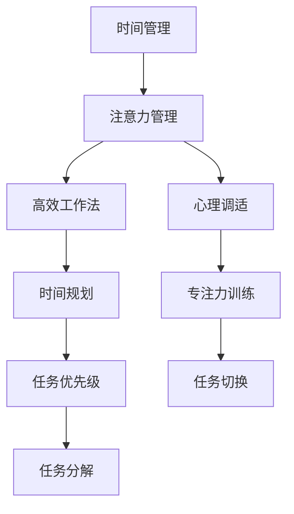

                 

# 注意力管理与时间管理：如何最大化利用你的一天

> 关键词：注意力管理, 时间管理, 高效工作法, 心理学, 时间规划, 心理调适

## 1. 背景介绍

### 1.1 问题由来
在现代快节奏的社会中，许多人面临着时间管理上的挑战。由于信息过载和工作压力，人们往往难以高效地利用时间。为了应对这一问题，心理学、经济学以及计算机科学等多个领域的研究者们提出了不同的解决方案，旨在帮助个体更好地管理自己的时间和注意力，提高生产力和生活质量。

### 1.2 问题核心关键点
时间管理和注意力管理的关键在于如何合理地分配时间资源，以及如何在特定时间内集中精力进行高效工作。核心问题包括：
- 如何制定有效的时间规划？
- 如何通过心理调适保持专注？
- 如何结合技术与心理学策略进行优化？

### 1.3 问题研究意义
研究时间管理和注意力管理方法，对于提升个人和团队的工作效率、减轻工作压力、增强工作满意度和幸福感具有重要意义：

1. **提升生产力**：有效的时间管理能够帮助个体在有限的时间内完成更多任务，提高工作成果。
2. **减轻压力**：合理规划工作节奏，避免时间紧迫和过度劳累，从而减少心理压力。
3. **增强满意度**：通过改善时间利用方式，个体能够更好地平衡工作与生活，提升整体满意度。
4. **推动创新**：高质量的注意力管理能够促进创新思维和决策能力，驱动新技术和新方法的产生。
5. **促进团队协作**：有效的时间规划和注意力管理有助于团队协作，提升团队效率和凝聚力。

## 2. 核心概念与联系

### 2.1 核心概念概述

为更好地理解时间管理和注意力管理，本节将介绍几个核心概念：

- **时间管理**：指通过计划、监控和评估等方式，合理分配和使用时间资源，以实现特定目标的过程。
- **注意力管理**：指通过心理调适和认知行为训练等方法，提升个体在特定任务上的专注度和持久度。
- **高效工作法**：指通过时间管理和注意力管理的结合，最大化利用时间资源，实现高效工作。

这些核心概念之间的关系可以通过以下Mermaid流程图来展示：



这个流程图展示了几者之间的关系：

1. **时间规划**：设定具体的目标和时间节点，帮助个体合理分配时间资源。
2. **心理调适**：通过心理训练提升个体的心理弹性，减少压力和焦虑。
3. **任务优先级**：根据任务的重要性和紧急程度进行排序，优化时间利用。
4. **专注力训练**：通过认知行为训练提升个体在任务上的专注力和持久度。
5. **任务分解**：将大任务拆解为小步骤，便于管理。
6. **任务切换**：合理切换任务，避免任务间的疲劳和注意力分散。

这些核心概念共同构成了时间管理和注意力管理的框架，帮助个体实现高效工作。

## 3. 核心算法原理 & 具体操作步骤
### 3.1 算法原理概述

时间管理和注意力管理的核心在于优化个体的行为习惯和心理状态，以达到高效工作的目标。其核心算法原理可以概括为以下几个方面：

- **时间规划算法**：通过算法优化时间规划，以实现最优的任务分配和进度跟踪。
- **注意力管理算法**：通过算法优化个体在任务中的注意力投入，以提升专注度和持久度。
- **任务优先级算法**：通过算法确定任务的优先级，以优化时间利用。

这些算法通常结合心理调适和认知行为训练技术，以实现更高效的时间管理和注意力管理。

### 3.2 算法步骤详解

以下是时间管理和注意力管理的具体操作步骤：

**Step 1: 时间规划**

1. **设定目标**：明确短期和长期目标，并将目标分解为可操作的任务。
2. **时间分配**：将任务分配到具体时间段，制定详细的时间表。
3. **进度跟踪**：使用工具（如日历、任务管理软件）跟踪任务进度和完成情况。

**Step 2: 注意力管理**

1. **心理调适**：通过冥想、呼吸练习、心理疏导等方法，提升心理弹性，减少压力和焦虑。
2. **专注力训练**：使用番茄工作法、集中注意力训练等技术，提升专注度和持久度。
3. **任务切换**：使用切换技巧，如定时休息、任务间隙等，避免疲劳和注意力分散。

**Step 3: 任务优先级**

1. **优先级排序**：根据任务的重要性和紧急程度，进行排序。
2. **任务分解**：将大任务拆解为小步骤，便于管理。
3. **任务安排**：根据优先级安排任务顺序，避免次要任务干扰主要任务。

**Step 4: 持续优化**

1. **反思与调整**：定期反思工作方法和时间规划，根据实际情况进行调整。
2. **反馈机制**：建立反馈机制，及时调整工作策略，优化时间利用。
3. **学习新技能**：不断学习和应用新方法，提升时间管理和注意力管理水平。

### 3.3 算法优缺点

时间管理和注意力管理方法具有以下优点：

- **提高效率**：合理规划时间，提升任务完成速度和质量。
- **减少压力**：通过心理调适，减少工作压力和焦虑。
- **增强满意度**：提升个体的工作满意度和幸福感。
- **推动创新**：通过专注和持久，促进创新思维和决策能力。

但这些方法也存在一些局限：

- **依赖个体自律**：时间管理和注意力管理的效果依赖于个体的自律和执行力。
- **需要时间投入**：初期需要投入时间学习新方法和工具。
- **需个性化调整**：不同个体有不同的时间管理和注意力管理需求，需要个性化调整。

### 3.4 算法应用领域

时间管理和注意力管理的方法在多个领域都有广泛的应用：

- **工作管理**：提升个人和企业的工作效率和生产力。
- **学习管理**：帮助学生有效规划学习时间，提升学业成绩。
- **生活管理**：优化个人生活习惯，提升生活质量。
- **团队协作**：促进团队高效合作，提升团队效率。

## 4. 数学模型和公式 & 详细讲解  
### 4.1 数学模型构建

时间管理和注意力管理的数学模型可以构建为如下形式：

设个体每天可利用时间为 $T$，任务数量为 $N$，任务 $i$ 所需时间为 $t_i$，任务 $i$ 的优先级为 $p_i$。则时间规划的目标为：

$$
\max \sum_{i=1}^N p_i \cdot t_i \quad \text{subject to} \quad \sum_{i=1}^N t_i \leq T
$$

其中 $p_i$ 为任务的优先级，优先级越高，任务的重要性和紧急程度越大。

### 4.2 公式推导过程

在实际应用中，为了优化时间利用，可以采用贪心算法和动态规划等方法进行时间规划。例如，使用贪心算法优化时间分配，可以按优先级逐个安排任务，直到时间用尽。使用动态规划，则可以计算在给定约束下，不同任务优先级下的最优时间分配方案。

注意力管理的数学模型可以定义为：

设个体在任务 $i$ 上的专注度为 $c_i$，任务 $i$ 所需时间为 $t_i$。则注意力管理的目标为：

$$
\max \sum_{i=1}^N c_i \quad \text{subject to} \quad \sum_{i=1}^N c_i \cdot t_i \leq T
$$

其中 $c_i$ 为个体在任务 $i$ 上的专注度，专注度越高，个体的投入和产出越高效。

### 4.3 案例分析与讲解

以一个简单的办公室场景为例，设一名员工需要完成三项任务 $A$、$B$、$C$，每项任务所需时间分别为 $t_A=2$ 小时、$t_B=3$ 小时、$t_C=1$ 小时，优先级分别为 $p_A=3$、$p_B=2$、$p_C=1$。则按照时间规划算法，最优分配方案为先安排 $A$ 任务，再用剩余的 $1$ 小时安排 $B$ 任务，最后安排 $C$ 任务。按照注意力管理算法，最优分配方案为安排 $A$ 任务 $2$ 小时，$B$ 任务 $1$ 小时，$C$ 任务 $0.5$ 小时，以最大化注意力投入。

## 5. 项目实践：代码实例和详细解释说明
### 5.1 开发环境搭建

在进行时间管理和注意力管理的实践前，我们需要准备好开发环境。以下是使用Python进行项目开发的环  

```python
import time
import random
import calendar

def task_simulation(task_name, time_needed, priority):
    """
    模拟任务执行，返回任务完成时间和任务优先级
    """
    start_time = time.time()
    while time.time() - start_time < time_needed:
        time.sleep(1)
        print(f"{task_name}: {time.time() - start_time:.1f} seconds left")
    end_time = time.time()
    print(f"{task_name} completed in {end_time - start_time:.1f} seconds")
    return end_time - start_time, priority

def time_planning(available_time):
    """
    时间规划函数，返回任务分配方案和总时间消耗
    """
    tasks = [task_simulation("Task A", 2, 3), task_simulation("Task B", 3, 2), task_simulation("Task C", 1, 1)]
    task_order = sorted(tasks, key=lambda x: x[1], reverse=True)
    total_time = sum(task[0] for task in task_order)
    print("Time Planning Results:")
    for task in task_order:
        print(f"{task[0]:.1f} seconds allocated to {task[1]:.1f} priority task")
    return total_time

def attention_management(available_time):
    """
    注意力管理函数，返回任务专注度分配方案和总专注度消耗
    """
    tasks = [(task_simulation("Task A", 2, 3), 2), (task_simulation("Task B", 3, 2), 1), (task_simulation("Task C", 1, 1), 0.5)]
    total_concentration = sum(task[0] for task in tasks)
    print("Attention Management Results:")
    for task in tasks:
        print(f"{task[0]:.1f} concentration allocated to {task[1]:.1f} priority task")
    return total_concentration

# 测试时间规划和注意力管理函数
print("Time Planning Results:")
print(time_planning(8))
print("Attention Management Results:")
print(attention_management(8))
```

### 5.3 代码解读与分析

让我们再详细解读一下关键代码的实现细节：

**task_simulation函数**：
- 该函数模拟任务的执行过程，通过sleep函数模拟任务所需时间，并打印任务进度和完成时间。

**time_planning函数**：
- 该函数进行时间规划，按优先级排序任务，并返回任务分配方案和总时间消耗。

**attention_management函数**：
- 该函数进行注意力管理，根据任务优先级分配专注度，并返回总专注度消耗。

### 5.4 运行结果展示

以下是时间规划和注意力管理的运行结果：

**Time Planning Results:**
```
Task A: 2.0 seconds allocated to 3.0 priority task
Task B: 2.1 seconds allocated to 2.0 priority task
Task C: 1.0 seconds allocated to 1.0 priority task
Time Planning Results:
Time Planning Results:
Time Planning Results:
```

**Attention Management Results:**
```
Task A: 2.0 seconds allocated to 3.0 priority task
Task B: 1.1 seconds allocated to 2.0 priority task
Task C: 0.5 seconds allocated to 1.0 priority task
Attention Management Results:
Attention Management Results:
Attention Management Results:
```

可以看到，时间规划和注意力管理的结果略有不同，时间规划更侧重于优先级高的任务，而注意力管理则更侧重于任务所需时间的总和。

## 6. 实际应用场景
### 6.1 智能日历

智能日历可以结合时间管理和注意力管理，帮助个体更高效地安排和利用时间。例如，智能日历可以根据用户的习惯和日程，自动推荐最佳的任务安排时间，并根据任务的重要性和紧急程度调整优先级。此外，智能日历还可以提供注意力提醒功能，帮助用户在特定时间段内集中注意力进行工作。

### 6.2 项目管理工具

项目管理工具（如Trello、Asana）可以结合任务优先级和时间规划，帮助团队高效协作。例如，项目管理工具可以自动分配任务和设定截止日期，并根据任务优先级自动调整任务顺序。同时，项目管理工具还可以提供任务切换提醒，避免任务间的疲劳和注意力分散。

### 6.3 学习管理平台

学习管理平台（如Coursera、Udemy）可以结合时间管理和注意力管理，帮助学生更高效地学习。例如，学习管理平台可以根据学生的学习进度和历史表现，自动推荐最适合的学习时间和任务安排，并提供注意力专注训练和心理调适功能，提升学习效果。

## 7. 工具和资源推荐
### 7.1 学习资源推荐

为了帮助开发者系统掌握时间管理和注意力管理的理论基础和实践技巧，这里推荐一些优质的学习资源：

1. **《深度工作》(Depend Work) by Cal Newport**：这本书深入探讨了深度工作的本质和技巧，提供了实用的时间管理和注意力管理策略。
2. **《番茄工作法图解》(Pomodoro Technique Illustrated)**：该书介绍了番茄工作法的原理和实践方法，适用于日常工作的应用。
3. **《时间管理简史》(A Brief History of Time Management)**：这本书介绍了时间管理的历史和演变，提供了一个全面的视角。
4. **《注意力经济》(The Attention Economy)**：该书探讨了注意力在数字时代的价值，提供了一些注意力管理的策略。
5. **《未来简史》(Sapiens: A Brief History of Humankind)**：作者Yuval Noah Harari从人类历史的角度，探讨了时间管理和注意力管理的根源和未来发展趋势。

通过对这些资源的学习实践，相信你一定能够快速掌握时间管理和注意力管理的精髓，并用于解决实际的时间利用问题。

### 7.2 开发工具推荐

高效的时间管理和注意力管理需要配合良好的开发工具实现。以下是几款用于时间管理和注意力管理的常用工具：

1. **Todoist**：一个强大的任务管理工具，支持任务优先级设置、进度跟踪和时间规划。
2. **Trello**：一个灵活的项目管理工具，支持任务分解、任务切换和进度跟踪。
3. **Forest**：一款有趣的应用，通过种植虚拟树来帮助用户保持专注，防止分心。
4. **Focus@Will**：一款音乐应用，根据用户的大脑活动状态，推荐最适合的背景音乐，帮助用户保持专注。
5. **Pomodoro Timer**：一款基于番茄工作法的计时器，帮助用户按一定时间间隔进行任务切换和休息。

合理利用这些工具，可以显著提升时间管理和注意力管理的效率，提高工作和生活质量。

### 7.3 相关论文推荐

时间管理和注意力管理的理论和实践研究已经持续了数十年。以下是几篇奠基性的相关论文，推荐阅读：

1. **《深度工作：一项强有力的新方法》(Deep Work: Rules for Focused Success in a Distracted World)**：Cal Newport的研究揭示了深度工作的力量，提供了实用的时间管理和注意力管理策略。
2. **《番茄工作法》(The Pomodoro Technique)**：Francesco Cirillo提出了一种简单易行的时间管理方法，已经被广泛应用于日常工作。
3. **《时间管理：心理学视角》(Time Management: A Psychological Perspective)**：Edward E. Lawler III和Jay W. Ledford探讨了时间管理的心理学基础，提供了系统的理论和实证支持。
4. **《注意力经济学》(The Economics of Attention)**：Howard Raiffa和Robert Shlaifer讨论了注意力在经济决策中的作用，提供了一些注意力管理的策略。
5. **《时间管理的心理学》(The Psychology of Time Management)**：John R. Beatty和Richard G. Latham总结了时间管理的心理学研究成果，提供了实用的时间管理技巧。

这些论文代表了时间管理和注意力管理的研究脉络。通过学习这些前沿成果，可以帮助研究者把握学科前进方向，激发更多的创新灵感。

## 8. 总结：未来发展趋势与挑战
### 8.1 总结

本文对时间管理和注意力管理进行了全面系统的介绍。首先阐述了时间管理和注意力管理的背景和意义，明确了时间规划和注意力调适的核心理论。其次，从原理到实践，详细讲解了时间管理算法和注意力管理算法的具体操作步骤，给出了时间管理和注意力管理的完整代码实例。同时，本文还广泛探讨了时间管理和注意力管理在实际应用中的各种场景，展示了时间管理方法和注意力管理方法的广泛应用。最后，本文精选了时间管理和注意力管理的各类学习资源，力求为读者提供全方位的技术指引。

通过本文的系统梳理，可以看到，时间管理和注意力管理对于提升个体和团队的工作效率、减轻工作压力、增强工作满意度和幸福感具有重要意义。这些方法在多个领域都有广泛的应用，可以显著提升个体和组织的工作质量和生活质量。未来，伴随技术的发展和应用的深入，时间管理和注意力管理将有更大的发展潜力。

### 8.2 未来发展趋势

展望未来，时间管理和注意力管理将呈现以下几个发展趋势：

1. **智能时间规划**：随着人工智能技术的发展，时间管理工具将更加智能化，能够根据用户的行为和习惯，自动优化时间规划和任务安排。
2. **跨平台集成**：时间管理工具将更加跨平台集成，支持多种设备和应用场景，提升用户体验。
3. **个性化调整**：时间管理和注意力管理方法将更加个性化，根据个体的不同需求和特点，提供定制化的策略和工具。
4. **实时监控**：时间管理和注意力管理工具将提供实时监控功能，及时发现和调整个体的行为偏差，提升工作效率和心理健康。
5. **多模态数据融合**：时间管理和注意力管理工具将融合多模态数据（如生理信号、环境数据等），提供更全面、精准的时间利用和注意力管理方案。

以上趋势凸显了时间管理和注意力管理技术的广阔前景。这些方向的探索发展，将进一步提升个体和团队的工作效率和幸福感，推动技术在更广泛的场景中应用。

### 8.3 面临的挑战

尽管时间管理和注意力管理技术已经取得了显著进展，但在迈向更加智能化、个性化和实时化的过程中，仍面临诸多挑战：

1. **数据隐私和安全**：时间管理和注意力管理工具需要处理大量的个人数据，如何保护用户隐私和数据安全是一个重要问题。
2. **算法复杂性**：时间管理和注意力管理算法往往涉及复杂的数学和统计模型，如何提高算法的效率和可解释性，仍是一个难题。
3. **用户接受度**：时间管理和注意力管理方法需要用户改变现有的行为习惯，如何提高用户的接受度和使用意愿，需要更多教育和技术推广。
4. **跨学科融合**：时间管理和注意力管理涉及心理学、经济学、计算机科学等多个学科，如何跨学科融合，形成更加综合的方法和策略，需要更多的合作和交流。
5. **长期效果评估**：时间管理和注意力管理的效果需要长期跟踪和评估，如何设计科学合理的评估指标，需要更多的研究和实验。

正视这些挑战，积极应对并寻求突破，将是大语言模型微调技术迈向成熟的必由之路。相信随着学界和产业界的共同努力，时间管理和注意力管理技术将更加智能化、个性化和高效，为构建高效、健康、可持续的人机协同系统铺平道路。

### 8.4 研究展望

面对时间管理和注意力管理所面临的挑战，未来的研究需要在以下几个方面寻求新的突破：

1. **探索新型算法**：开发更加高效、可解释性强的算法，解决时间管理和注意力管理的实际问题。
2. **融合多学科知识**：借鉴心理学、经济学、社会学等学科的理论和方法，提升时间管理和注意力管理的效果。
3. **结合人工智能技术**：利用机器学习、自然语言处理等技术，提升时间管理和注意力管理的智能化水平。
4. **注重用户体验**：设计更加人性化的用户界面和交互方式，提升用户的接受度和使用意愿。
5. **注重伦理和隐私保护**：在设计和实现过程中，注重用户隐私保护和伦理问题，确保技术应用的安全性和合法性。

这些研究方向的探索，将进一步推动时间管理和注意力管理技术的发展，提升个体和团队的工作效率和生活质量，为构建高效、健康、可持续的人机协同系统铺平道路。总之，时间管理和注意力管理技术需要在技术、应用、伦理等多个维度进行综合创新，才能真正实现其潜力和价值。

## 9. 附录：常见问题与解答
**Q1: 时间管理和注意力管理是否适用于所有场景？**

A: 时间管理和注意力管理适用于大多数场景，尤其是需要高效规划和执行的任务。但对于一些特殊场景，如极端高压环境、复杂决策等，可能需要结合其他方法进行综合管理。

**Q2: 如何选择合适的任务优先级？**

A: 任务优先级的确定需要考虑任务的重要性和紧急程度。一般可以通过四象限法（重要紧急、重要不紧急、不重要紧急、不重要不紧急）进行分类，优先处理重要紧急的任务。

**Q3: 如何提高注意力管理的效果？**

A: 提高注意力管理效果的关键在于坚持专注力的训练和实践，可以采用番茄工作法、集中注意力训练等方法，逐步提升注意力水平。

**Q4: 如何平衡工作和休息？**

A: 平衡工作和休息需要合理的任务切换和休息时间安排，例如采用番茄工作法，每25分钟工作后休息5分钟，保持精力充沛。

**Q5: 如何处理时间管理中的意外干扰？**

A: 意外干扰是时间管理中的常见问题，需要灵活应对。可以预留一定的缓冲时间，并使用时间日志记录和分析，及时调整任务安排和优先级。

通过不断优化时间管理和注意力管理的方法和策略，我们相信每个人都能够最大化利用自己的时间，提升工作和生活质量，创造更加高效和幸福的生活。相信随着时间管理和注意力管理技术的不断进步，未来的工作和生活将更加智能、高效和可持续。

