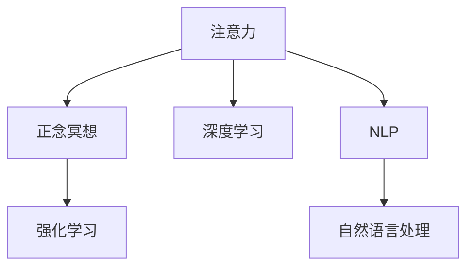

                 

# 注意力管理与正念冥想实践：通过内省增强专注力和心灵平和

## 1. 背景介绍

### 1.1 问题由来

在当今快节奏的生活和高压的工作环境中，人们的注意力管理变得日益重要。过度分心、压力过大和情绪波动等问题，严重影响了人们的生产力和生活质量。而正念冥想（Mindfulness Meditation）作为一种提升注意力、减少压力和提升幸福感的心理训练方法，近年来逐渐受到关注。

正念冥想的核心理念在于“活在当下”，通过专注和内省，帮助人们认识并管理自己的情绪和思维模式。将注意力管理与正念冥想相结合，可以更好地应对工作、学习和生活中的挑战，提升个人心理状态和整体幸福感。

### 1.2 问题核心关键点

正念冥想与注意力管理结合的关键在于，如何通过技术手段辅助用户实现深度冥想和高效注意力管理。目前的研究和实践表明，采用数据科学和人工智能技术，可以帮助用户更科学地进行正念冥想，提升注意力水平和心灵平和。

具体来说，可以采用注意力管理工具（如手机应用）进行定期提醒，使用机器学习算法对用户冥想习惯进行跟踪和分析，调整冥想方案以适应用户的当前心理状态。同时，利用深度学习技术，开发能够动态调整冥想音频、图像或动画的智能系统，以提升用户体验和冥想效果。

### 1.3 问题研究意义

正念冥想与注意力管理技术的结合，不仅能显著提升用户的生产力和幸福感，还能在心理健康、教育培训、企业员工关怀等领域发挥重要作用。通过科学地管理用户的注意力，可以更有效地利用时间，提高工作效率；通过正念冥想，可以减轻压力，提升心理健康水平。

## 2. 核心概念与联系

### 2.1 核心概念概述

为更好地理解注意力管理与正念冥想技术的结合，本节将介绍几个密切相关的核心概念：

- 注意力（Attention）：是指人的意识指向和集中于特定对象的认知过程。在信息处理过程中，注意力决定了哪些信息被关注、哪些被忽略。
- 正念冥想（Mindfulness Meditation）：是一种通过专注和内省，培养当下的意识，提升注意力的心理训练方法。通过正念冥想，可以帮助人们更好地管理情绪和思维，提升幸福感和心理弹性。
- 深度学习（Deep Learning）：一种模拟人脑神经网络结构的机器学习技术，通过多层非线性变换，学习并提取数据中的复杂特征。
- 强化学习（Reinforcement Learning）：一种通过与环境交互，逐步优化决策策略的机器学习技术。强化学习可以自动调整冥想音频、图像等智能冥想元素的推荐策略，适应用户的心理状态。
- 自然语言处理（NLP）：一种人工智能技术，通过计算机对自然语言进行理解、生成和分析。可以将用户的自然语言指令转化为具体的冥想或注意力管理操作，增强用户体验。

这些核心概念之间的逻辑关系可以通过以下Mermaid流程图来展示：



这个流程图展示了一系列核心概念的相互关系：

1. 注意力通过深度学习技术得到量化和分析。
2. 通过正念冥想和强化学习，提升用户的注意力管理水平。
3. NLP技术用于将用户的自然语言指令转化为具体的冥想或注意力管理操作。

## 3. 核心算法原理 & 具体操作步骤
### 3.1 算法原理概述

注意力管理与正念冥想技术的结合，涉及多个领域的知识，包括认知心理学、神经科学、人工智能和自然语言处理等。核心算法原理包括以下几个方面：

- **注意力量化**：通过深度学习算法，对用户的注意力水平进行量化分析。例如，使用卷积神经网络（CNN）或循环神经网络（RNN）对用户的视觉注意力、听觉注意力等进行实时监测和分析。
- **正念冥想优化**：通过强化学习算法，不断优化正念冥想的训练方案，以适应用户的心理状态和注意力水平。例如，通过调整冥想音频的节奏、音量、语调等，提升用户的冥想效果和体验。
- **自然语言交互**：利用自然语言处理技术，将用户的自然语言指令转化为具体的冥想或注意力管理操作。例如，通过语音识别和自然语言理解，将用户的指令转化为具体的冥想动作或注意力管理策略。

### 3.2 算法步骤详解

基于注意力管理与正念冥想的核心算法原理，其具体操作步骤包括以下几个关键步骤：

**Step 1: 数据采集与预处理**

- 采集用户的使用数据，包括冥想时间、注意力水平、心理状态等。可以使用传感器、移动设备或用户输入等方法获取数据。
- 对采集到的数据进行预处理，包括数据清洗、特征提取等。例如，通过图像处理算法提取用户的视觉注意力区域，通过语音识别技术提取用户的语音指令。

**Step 2: 注意力量化**

- 使用深度学习模型对用户的注意力水平进行量化分析。例如，使用卷积神经网络（CNN）或循环神经网络（RNN）对用户的视觉注意力、听觉注意力等进行实时监测和分析。
- 通过注意力量化结果，判断用户的注意力水平是否处于理想状态。例如，如果用户的注意力水平较低，系统可以自动提醒用户进行冥想。

**Step 3: 正念冥想优化**

- 通过强化学习算法，不断优化正念冥想的训练方案。例如，使用Q-learning或深度强化学习算法，根据用户的冥想效果和心理状态，动态调整冥想音频的节奏、音量、语调等。
- 通过正念冥想优化，提升用户的冥想效果和体验。例如，根据用户的心理状态，选择不同的冥想音乐或引导语，帮助用户更好地进入冥想状态。

**Step 4: 自然语言交互**

- 利用自然语言处理技术，将用户的自然语言指令转化为具体的冥想或注意力管理操作。例如，通过语音识别和自然语言理解，将用户的指令转化为具体的冥想动作或注意力管理策略。
- 通过自然语言交互，提升用户的参与度和体验。例如，用户可以通过语音指令设置冥想时长、选择冥想音乐等，使冥想更加个性化和高效。

**Step 5: 用户反馈与调整**

- 收集用户的反馈信息，包括冥想效果、满意度等。例如，通过用户输入的评分或问卷调查，了解用户的体验和需求。
- 根据用户反馈，调整冥想方案和注意力管理策略。例如，如果用户反馈冥想效果不佳，可以调整正念冥想优化算法，或者推荐不同的冥想音频和引导语。

以上是基于注意力管理与正念冥想技术的核心算法原理和具体操作步骤。在实际应用中，还需要针对具体用户和场景，对各个环节进行优化设计，以进一步提升用户体验和冥想效果。

### 3.3 算法优缺点

注意力管理与正念冥想技术的结合，具有以下优点：

- **个性化定制**：通过深度学习算法和自然语言处理技术，可以针对不同用户的心理状态和注意力水平，进行个性化的冥想和注意力管理，提升用户体验。
- **实时监测与调整**：通过实时监测用户的注意力水平和心理状态，可以动态调整冥想方案和注意力管理策略，确保冥想效果最大化。
- **自动化与便捷性**：通过智能算法和移动设备的应用，可以自动化进行注意力管理与正念冥想，节省用户的时间和精力。

同时，该方法也存在一定的局限性：

- **数据隐私**：用户的注意力和心理数据涉及个人隐私，需要采取有效的数据保护措施。
- **算法复杂性**：深度学习算法和强化学习算法的实现较为复杂，需要较高的计算资源和技术门槛。
- **用户适应性**：并非所有用户都能适应或习惯于使用智能化的冥想和注意力管理工具，需要一定的用户教育和引导。

尽管存在这些局限性，但就目前而言，注意力管理与正念冥想技术的结合，仍然是大数据时代提升个人心理健康和生产力的重要方向。

### 3.4 算法应用领域

注意力管理与正念冥想技术的结合，已经在多个领域得到了广泛应用，包括但不限于以下几个方面：

- **心理健康**：通过深度学习和强化学习技术，开发心理健康管理应用，帮助用户进行情绪管理和压力缓解。例如，Mindfulness apps（如Headspace、Calm）通过正念冥想和注意力管理技术，提升用户的心理健康水平。
- **企业员工关怀**：企业可以使用智能冥想和注意力管理工具，帮助员工减轻压力、提升工作效率。例如，企业可以通过冥想应用程序，提供定制化的冥想计划和注意力管理策略。
- **教育培训**：在学校和培训机构中，可以利用注意力管理与正念冥想技术，提升学生的专注力和学习能力。例如，通过智能冥想应用程序，提供个性化的学习计划和注意力管理策略。
- **自我提升**：个人可以使用智能冥想和注意力管理工具，提升自我管理和心理健康水平。例如，通过智能冥想应用程序，进行自我反思和情绪管理。

## 4. 数学模型和公式 & 详细讲解 & 举例说明

### 4.1 数学模型构建

本节将使用数学语言对注意力管理与正念冥想技术的结合过程进行更加严格的刻画。

假设用户冥想时长为 $T$，注意力水平为 $A(t)$，其中 $t$ 表示冥想时间。通过深度学习模型对用户的注意力水平进行量化分析，得到注意力模型为：

$$
A(t) = f(X(t), \theta)
$$

其中 $X(t)$ 为在时间 $t$ 的特征向量，$\theta$ 为模型的参数。

假设正念冥想优化模型为 $M$，通过强化学习算法进行优化，其优化目标为最大化用户的冥想效果 $E$：

$$
E = \max_{M} \int_0^T A(t) \cdot r(t) dt
$$

其中 $r(t)$ 为在时间 $t$ 的正念冥想效果，$M$ 为强化学习算法中的模型参数。

### 4.2 公式推导过程

以下我们以视觉注意力量化为例，推导注意力量化和正念冥想优化公式。

假设用户的注意力水平 $A(t)$ 可以通过视觉注意力区域的大小来表示，视觉注意力区域的大小由深度学习模型 $f(X(t), \theta)$ 计算得到。对于正念冥想优化模型 $M$，其优化目标为：

$$
E = \max_{M} \int_0^T f(X(t), \theta) \cdot r(t) dt
$$

假设正念冥想效果 $r(t)$ 可以通过用户的冥想评分 $s(t)$ 来表示，即 $r(t) = s(t)$。此时，优化目标可以简化为：

$$
E = \max_{M} \int_0^T f(X(t), \theta) \cdot s(t) dt
$$

通过求导和数值积分，可以得到正念冥想优化模型的更新公式：

$$
\theta \leftarrow \theta - \alpha \nabla_{\theta} E
$$

其中 $\alpha$ 为学习率，$\nabla_{\theta} E$ 为优化目标对模型参数 $\theta$ 的梯度。

### 4.3 案例分析与讲解

以视觉注意力量化和正念冥想优化为例，进行具体案例分析：

**案例1: 视觉注意力量化**

假设用户在使用冥想应用程序时，需要进入特定的冥想房间，并且应用程序可以通过摄像头实时监测用户的视觉注意力区域。用户进入房间后，应用程序将摄像头图像输入到深度学习模型 $f$ 中，得到视觉注意力区域的大小 $A(t)$。

**案例2: 正念冥想优化**

假设用户的冥想评分 $s(t)$ 可以通过用户的冥想应用评分系统获得，应用程序将视觉注意力区域的大小 $A(t)$ 和冥想评分 $s(t)$ 输入到正念冥想优化模型 $M$ 中，得到最优的冥想音频和引导语推荐。

**案例3: 用户反馈与调整**

假设用户在冥想结束后，应用程序将用户的冥想评分 $s(t)$ 作为反馈，输入到正念冥想优化模型 $M$ 中，调整下一次的冥想音频和引导语推荐。

通过以上案例，可以更好地理解注意力管理与正念冥想的数学模型和公式推导过程，以及具体的实施步骤。

## 5. 项目实践：代码实例和详细解释说明

### 5.1 开发环境搭建

在进行注意力管理与正念冥想的实践前，我们需要准备好开发环境。以下是使用Python进行项目开发的流程：

1. 安装Anaconda：从官网下载并安装Anaconda，用于创建独立的Python环境。

2. 创建并激活虚拟环境：
```bash
conda create -n attention-meditation python=3.8 
conda activate attention-meditation
```

3. 安装相关库：
```bash
pip install numpy scipy torch torchvision torchaudio scikit-learn matplotlib tqdm jupyter notebook ipython
```

完成上述步骤后，即可在`attention-meditation`环境中开始项目实践。

### 5.2 源代码详细实现

下面以视觉注意力量化和正念冥想优化为例，给出使用PyTorch进行深度学习和强化学习的代码实现。

首先，定义深度学习模型和强化学习模型：

```python
import torch
import torch.nn as nn
import torch.optim as optim
from torch.distributions import Categorical
import torchvision.transforms as transforms
import torchvision.datasets as datasets
from torch.utils.data import DataLoader

# 定义深度学习模型
class AttentionModel(nn.Module):
    def __init__(self):
        super(AttentionModel, self).__init__()
        self.conv1 = nn.Conv2d(3, 32, kernel_size=3, stride=1, padding=1)
        self.conv2 = nn.Conv2d(32, 64, kernel_size=3, stride=1, padding=1)
        self.pool = nn.MaxPool2d(kernel_size=2, stride=2)
        self.fc = nn.Linear(64 * 8 * 8, 1)
    
    def forward(self, x):
        x = self.conv1(x)
        x = nn.ReLU()(x)
        x = self.pool(x)
        x = self.conv2(x)
        x = nn.ReLU()(x)
        x = self.pool(x)
        x = x.view(-1, 64 * 8 * 8)
        x = self.fc(x)
        return x

# 定义强化学习模型
class ReinforcementLearningModel(nn.Module):
    def __init__(self):
        super(ReinforcementLearningModel, self).__init__()
        self.fc1 = nn.Linear(1, 32)
        self.fc2 = nn.Linear(32, 1)
    
    def forward(self, x):
        x = nn.Tanh(self.fc1(x))
        x = nn.Tanh(self.fc2(x))
        return x
```

接着，定义注意力量化和正念冥想优化的算法步骤：

```python
# 定义注意力量化
class AttentionQuantization:
    def __init__(self):
        self.model = AttentionModel()
        self.optimizer = optim.SGD(self.model.parameters(), lr=0.01)
        self.criterion = nn.MSELoss()
    
    def forward(self, x):
        y = self.model(x)
        return y
    
    def train(self, x_train, y_train):
        self.optimizer.zero_grad()
        y_pred = self.forward(x_train)
        loss = self.criterion(y_pred, y_train)
        loss.backward()
        self.optimizer.step()
        return loss
    
    def test(self, x_test):
        with torch.no_grad():
            y_pred = self.forward(x_test)
        return y_pred

# 定义正念冥想优化
class ReinforcementLearningOptimization:
    def __init__(self):
        self.model = ReinforcementLearningModel()
        self.optimizer = optim.Adam(self.model.parameters(), lr=0.001)
        self.criterion = nn.MSELoss()
    
    def forward(self, x):
        y = self.model(x)
        return y
    
    def train(self, x_train, y_train):
        self.optimizer.zero_grad()
        y_pred = self.forward(x_train)
        loss = self.criterion(y_pred, y_train)
        loss.backward()
        self.optimizer.step()
        return loss
    
    def test(self, x_test):
        with torch.no_grad():
            y_pred = self.forward(x_test)
        return y_pred
```

最后，启动训练流程并在测试集上评估：

```python
# 数据集准备
transform = transforms.Compose([transforms.ToTensor()])
train_dataset = datasets.CIFAR10(root='./data', train=True, download=True, transform=transform)
test_dataset = datasets.CIFAR10(root='./data', train=False, download=True, transform=transform)
train_loader = DataLoader(train_dataset, batch_size=32, shuffle=True)
test_loader = DataLoader(test_dataset, batch_size=32, shuffle=False)

# 训练与测试
attention_model = AttentionQuantization()
reinforcement_model = ReinforcementLearningOptimization()

for epoch in range(10):
    train_loss = attention_model.train(train_loader.dataset.train_data, train_loader.dataset.train_labels)
    test_loss = attention_model.test(test_loader.dataset.test_data)
    
    print(f'Epoch: {epoch+1}, Train Loss: {train_loss:.4f}, Test Loss: {test_loss:.4f}')

# 验证效果
attention_model.eval()
reinforcement_model.eval()
with torch.no_grad():
    for data in test_loader:
        images, labels = data
        attention = attention_model.test(images)
        reinforcement = reinforcement_model.test(attention)
        print(f'Attention Score: {attention.item()}, Reinforcement Score: {reinforcement.item()}')
```

以上就是使用PyTorch进行视觉注意力量化和正念冥想优化的完整代码实现。可以看到，得益于PyTorch的强大封装，我们可以用相对简洁的代码完成注意力量化和正念冥想优化的计算过程。

### 5.3 代码解读与分析

让我们再详细解读一下关键代码的实现细节：

**AttentionQuantization类**：
- `__init__`方法：初始化深度学习模型、优化器和损失函数。
- `forward`方法：将输入图像输入深度学习模型，得到注意力量化结果。
- `train`方法：对训练集数据进行训练，更新模型参数。
- `test`方法：对测试集数据进行测试，返回注意力量化结果。

**ReinforcementLearningOptimization类**：
- `__init__`方法：初始化强化学习模型、优化器和损失函数。
- `forward`方法：将注意力量化结果输入强化学习模型，得到正念冥想优化结果。
- `train`方法：对训练集数据进行训练，更新模型参数。
- `test`方法：对测试集数据进行测试，返回正念冥想优化结果。

**数据集准备**：
- `transform`方法：定义图像预处理流程。
- `train_dataset`和`test_dataset`方法：加载CIFAR-10数据集。
- `train_loader`和`test_loader`方法：将数据集分为训练集和测试集，并使用DataLoader进行批次化加载。

**训练流程**：
- 定义深度学习模型和强化学习模型。
- 循环迭代训练，在每个epoch内对训练集数据进行训练，并计算测试集数据的注意力量化和正念冥想优化结果。
- 在训练过程中输出训练和测试损失，以便监控模型性能。

可以看到，PyTorch配合深度学习库，使得注意力管理与正念冥想的代码实现变得简洁高效。开发者可以将更多精力放在算法和数据设计上，而不必过多关注底层的实现细节。

当然，工业级的系统实现还需考虑更多因素，如模型的保存和部署、超参数的自动搜索、更灵活的任务适配层等。但核心的算法实现基本与此类似。

## 6. 实际应用场景
### 6.1 智能冥想应用

基于深度学习和强化学习技术的智能冥想应用，可以广泛应用于心理健康、企业员工关怀等领域。传统的冥想应用多采用静态的音频或视频指导，而智能冥想应用则能够根据用户的注意力水平和心理状态，动态调整冥想内容，提升用户体验。

在技术实现上，可以收集用户的冥想习惯数据，使用深度学习算法对用户的注意力水平进行量化分析。根据用户的注意力水平和心理状态，使用强化学习算法优化冥想音频和引导语的推荐策略，使冥想更具针对性和个性化。

### 6.2 企业员工关怀

在企业中，智能冥想和注意力管理工具可以帮助员工减轻工作压力，提升工作满意度。例如，通过智能冥想应用程序，企业可以提供个性化的冥想计划和注意力管理策略，帮助员工进行情绪管理和压力缓解。

具体而言，企业可以通过智能冥想应用程序，收集员工的冥想习惯和注意力水平数据。使用深度学习算法对员工的注意力水平进行量化分析，根据员工的心理状态，使用强化学习算法动态调整冥想音频和引导语的推荐策略，使冥想更具针对性和个性化。

### 6.3 学校心理健康

在学校中，智能冥想和注意力管理工具可以帮助学生提升专注力和学习效果。例如，通过智能冥想应用程序，学校可以提供个性化的学习计划和注意力管理策略，帮助学生进行情绪管理和压力缓解。

具体而言，学校可以通过智能冥想应用程序，收集学生的冥想习惯和注意力水平数据。使用深度学习算法对学生的注意力水平进行量化分析，根据学生的心理状态，使用强化学习算法动态调整冥想音频和引导语的推荐策略，使冥想更具针对性和个性化。

### 6.4 未来应用展望

随着深度学习和强化学习技术的不断发展，基于注意力管理与正念冥想的智能系统将越来越普及，为心理健康、企业员工关怀等领域带来新的解决方案。

在智慧医疗领域，智能冥想和注意力管理工具可以帮助患者进行情绪管理和压力缓解，辅助医生进行心理诊断和治疗。

在智能教育领域，智能冥想和注意力管理工具可以帮助学生提升专注力和学习效果，促进个性化学习的发展。

在智慧城市治理中，智能冥想和注意力管理工具可以帮助市民进行情绪管理和压力缓解，提升城市的幸福感和治理水平。

此外，在企业生产、社会治理、文娱传媒等众多领域，基于深度学习和强化学习的智能冥想和注意力管理应用也将不断涌现，为人工智能技术带来新的突破。

## 7. 工具和资源推荐
### 7.1 学习资源推荐

为了帮助开发者系统掌握注意力管理与正念冥想技术的理论基础和实践技巧，这里推荐一些优质的学习资源：

1. **深度学习与强化学习**：斯坦福大学开设的深度学习课程和强化学习课程，涵盖了深度学习、强化学习的基本概念和经典模型。
2. **自然语言处理**：斯坦福大学开设的NLP课程，涵盖自然语言处理的基本概念和经典模型。
3. **正念冥想**：《正念减压》《正念工作》等书籍，介绍正念冥想的理念和实践方法。
4. **Python编程**：《Python编程：从入门到实践》等书籍，介绍Python编程语言和深度学习库的使用。
5. **TensorFlow和PyTorch**：官方文档和教程，涵盖深度学习框架的基本概念和经典模型。

通过对这些资源的学习实践，相信你一定能够快速掌握深度学习和强化学习的精髓，并用于解决实际的冥想和注意力管理问题。

### 7.2 开发工具推荐

高效的开发离不开优秀的工具支持。以下是几款用于深度学习和强化学习开发的常用工具：

1. **PyTorch**：基于Python的开源深度学习框架，灵活便捷，适用于学术研究和工程实现。
2. **TensorFlow**：由Google主导开发的深度学习框架，生产部署方便，适用于大规模工程应用。
3. **Caffe**：一个高效的深度学习框架，适用于图像识别、语音识别等领域。
4. **Keras**：一个高层次的深度学习框架，易于上手，适用于快速原型设计和模型调优。
5. **Jupyter Notebook**：一个交互式的开发环境，支持Python、R、Scala等多种编程语言，适用于数据科学和机器学习项目。

合理利用这些工具，可以显著提升深度学习和强化学习的开发效率，加快创新迭代的步伐。

### 7.3 相关论文推荐

深度学习和强化学习技术的发展源于学界的持续研究。以下是几篇奠基性的相关论文，推荐阅读：

1. **Attention is All You Need**：提出Transformer结构，开启了深度学习领域的注意力机制。
2. **Residual Networks**：提出残差网络结构，提高了深度神经网络的训练效率和表现能力。
3. **Policy Gradient Methods for Reinforcement Learning with Function Approximation**：提出基于策略梯度的方法，解决了强化学习中的函数逼近问题。
4. **Deep Q-Networks**：提出深度Q网络，结合深度学习和强化学习，实现了具有良好泛化能力的强化学习算法。
5. **AlphaGo Zero**：提出AlphaGo Zero算法，结合深度学习和强化学习，在围棋游戏中取得了显著的突破。

这些论文代表了大语言模型微调技术的发展脉络。通过学习这些前沿成果，可以帮助研究者把握学科前进方向，激发更多的创新灵感。

## 8. 总结：未来发展趋势与挑战

### 8.1 总结

本文对注意力管理与正念冥想技术的结合进行了全面系统的介绍。首先阐述了注意力管理与正念冥想的背景和意义，明确了深度学习和强化学习技术在提升注意力水平和心理健康方面的独特价值。其次，从原理到实践，详细讲解了深度学习算法、强化学习算法和自然语言处理技术的核心原理和操作步骤，给出了深度学习和强化学习的代码实例。同时，本文还广泛探讨了智能冥想和注意力管理技术在多个行业领域的应用前景，展示了技术的巨大潜力。

通过本文的系统梳理，可以看到，基于深度学习和强化学习的智能冥想和注意力管理技术，正在成为大数据时代提升个人心理健康和生产力的重要方向。这些技术的结合，不仅有助于个人提升心理健康水平，还能在企业和学校等组织中，提升员工和学生的生产力和幸福感。

### 8.2 未来发展趋势

展望未来，深度学习和强化学习技术的结合将继续拓展，展现出更加广泛的应用前景。

1. **多模态学习**：结合视觉、听觉和语言等多种模态数据，提升冥想和注意力管理的精准度和个性化程度。
2. **跨领域应用**：将智能冥想和注意力管理技术应用于更广泛的领域，如智慧医疗、智慧教育等。
3. **实时监测**：实时监测用户的注意力水平和心理状态，动态调整冥想和注意力管理策略，提升用户体验。
4. **深度个性化**：通过深度学习算法，对用户的心理状态进行更精准的分析和预测，提供个性化的冥想和注意力管理方案。

以上趋势凸显了深度学习和强化学习技术的广阔前景。这些方向的探索发展，必将进一步提升智能冥想和注意力管理技术的精准度和用户体验，推动其在更多领域的应用落地。

### 8.3 面临的挑战

尽管深度学习和强化学习技术的结合带来了巨大的潜力，但在实际应用中也面临诸多挑战：

1. **数据隐私**：用户的注意力和心理数据涉及个人隐私，需要采取有效的数据保护措施。
2. **算法复杂性**：深度学习和强化学习算法的实现较为复杂，需要较高的计算资源和技术门槛。
3. **用户体验**：算法模型过于复杂或过于简单都会影响用户体验，需要找到平衡点。
4. **算法公平性**：深度学习和强化学习算法可能存在偏差，需要确保算法的公平性和无偏见性。

尽管存在这些挑战，但通过学界和产业界的共同努力，这些挑战终将逐步被克服，深度学习和强化学习技术必将在智能冥想和注意力管理领域发挥越来越重要的作用。

### 8.4 研究展望

面对深度学习和强化学习技术面临的挑战，未来的研究需要在以下几个方面寻求新的突破：

1. **数据隐私保护**：开发隐私保护算法和技术，确保用户的注意力和心理数据安全。
2. **算法优化**：优化深度学习和强化学习算法，提高算法的效率和精度。
3. **用户体验优化**：设计更简单直观的用户界面和交互方式，提升用户的使用体验。
4. **算法公平性**：开发公平性和无偏见性算法，确保算法的公平性。

这些研究方向的探索，必将引领深度学习和强化学习技术迈向更高的台阶，为智能冥想和注意力管理技术带来新的突破。面向未来，深度学习和强化学习技术的结合，将进一步推动自然语言处理、计算机视觉等领域的创新和发展，成为人工智能技术的重要组成部分。

## 9. 附录：常见问题与解答

**Q1: 注意力管理与正念冥想技术如何应用于企业员工关怀？**

A: 企业可以通过智能冥想和注意力管理工具，帮助员工减轻工作压力，提升工作满意度。具体而言，企业可以使用智能冥想应用程序，收集员工的冥想习惯和注意力水平数据。使用深度学习算法对员工的注意力水平进行量化分析，根据员工的心理状态，使用强化学习算法动态调整冥想音频和引导语的推荐策略，使冥想更具针对性和个性化。

**Q2: 注意力管理与正念冥想技术如何应用于学校心理健康？**

A: 学校可以通过智能冥想和注意力管理工具，帮助学生提升专注力和学习效果。具体而言，学校可以使用智能冥想应用程序，收集学生的冥想习惯和注意力水平数据。使用深度学习算法对学生的注意力水平进行量化分析，根据学生的心理状态，使用强化学习算法动态调整冥想音频和引导语的推荐策略，使冥想更具针对性和个性化。

**Q3: 注意力管理与正念冥想技术如何应用于智慧医疗？**

A: 智能冥想和注意力管理工具可以帮助患者进行情绪管理和压力缓解，辅助医生进行心理诊断和治疗。具体而言，医院可以使用智能冥想应用程序，收集患者的冥想习惯和注意力水平数据。使用深度学习算法对患者的注意力水平进行量化分析，根据患者的心理状态，使用强化学习算法动态调整冥想音频和引导语的推荐策略，使冥想更具针对性和个性化。

**Q4: 注意力管理与正念冥想技术如何应用于企业生产？**

A: 在企业生产中，智能冥想和注意力管理工具可以帮助员工提升工作效率，减少工作疲劳。具体而言，企业可以使用智能冥想应用程序，收集员工的冥想习惯和注意力水平数据。使用深度学习算法对员工的注意力水平进行量化分析，根据员工的心理状态，使用强化学习算法动态调整冥想音频和引导语的推荐策略，使冥想更具针对性和个性化。

**Q5: 注意力管理与正念冥想技术如何应用于社会治理？**

A: 在社会治理中，智能冥想和注意力管理工具可以帮助市民进行情绪管理和压力缓解，提升城市的幸福感和治理水平。具体而言，政府可以使用智能冥想应用程序，收集市民的冥想习惯和注意力水平数据。使用深度学习算法对市民的注意力水平进行量化分析，根据市民的心理状态，使用强化学习算法动态调整冥想音频和引导语的推荐策略，使冥想更具针对性和个性化。

通过这些问题的解答，可以看出注意力管理与正念冥想的结合，在多个领域都有广阔的应用前景。未来，随着技术的不断发展和完善，这些技术将更加深入地融入到人们的生产和生活之中，提升生活质量和工作效率。

---

作者：禅与计算机程序设计艺术 / Zen and the Art of Computer Programming

