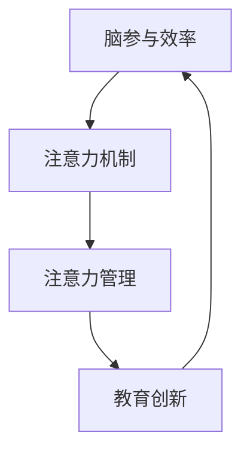

                 

# 注意力管理课程:提升全球脑参与效率的教育

> 关键词：脑参与效率、神经网络、注意力机制、注意力管理、教育创新

## 1. 背景介绍

### 1.1 问题由来
在信息化时代，全球学习者的脑参与效率成为决定其学习效果的关键因素。特别是对于广大发展中国家的学习者来说，由于受教育资源的不均衡、家庭经济条件的限制，以及自主学习能力的不足，往往难以充分发挥脑参与效率。

### 1.2 问题核心关键点
脑参与效率的提升，不仅仅是硬件设备的问题，更重要的是通过优化学习方法和训练技巧，提升学习者的认知能力和注意力集中度。基于此，文章聚焦于注意力管理课程的设计与实践，旨在帮助学习者通过科学的注意力训练，显著提高其学习效率和效果。

### 1.3 问题研究意义
通过系统化的注意力管理课程，可以极大地提升学习者的脑参与效率，使其在有限的时间内吸收和掌握更多的知识。这对于促进教育公平、提升全球教育质量具有重要意义。

## 2. 核心概念与联系

### 2.1 核心概念概述

为更好地理解注意力管理课程的原理和实施方法，本节将介绍几个关键概念：

- 脑参与效率(Brain Engagement Efficiency)：指学习者在学习过程中大脑的认知、情感和动机参与程度。
- 注意力机制(Attention Mechanism)：指神经网络中一种重要的信息选择机制，通过调整权重来加强或抑制神经元之间的连接，从而实现信息的选择性过滤。
- 注意力管理(Attention Management)：通过科学设计课程内容和训练方法，帮助学习者训练和管理其注意力资源，提升学习效果。
- 教育创新(Education Innovation)：利用新兴技术手段，结合传统教育理念和方法，进行教育模式的创新。

这些核心概念之间存在紧密的联系，共同构成了提升脑参与效率的教育框架：

1. **脑参与效率**是目标，即通过注意力管理课程提升学习者的认知和动机参与。
2. **注意力机制**是手段，通过模仿人类大脑的注意力选择过程，实现信息的选择性过滤。
3. **注意力管理**是方法，通过科学训练和技巧，帮助学习者管理其注意力资源。
4. **教育创新**是途径，利用新兴技术手段如神经网络、深度学习等，实现教育模式的创新和优化。

这些概念之间的逻辑关系可以通过以下Mermaid流程图来展示：



这个流程图展示了脑参与效率提升的关键路径，即通过注意力机制来管理注意力，结合教育创新手段实现脑参与效率的提升。

## 3. 核心算法原理 & 具体操作步骤

### 3.1 算法原理概述

注意力管理课程的核心理念是通过模仿人类大脑的注意力选择过程，训练学习者实现高效的信息选择和处理。这一过程可通过以下步骤实现：

1. **信息编码与表示**：将学习材料编码成神经网络可处理的数字形式，并通过嵌入层将输入转换为网络中节点。
2. **注意力权重计算**：根据节点的激活程度，计算出各节点对学习者的吸引力权重。
3. **注意力权重调整**：通过调整权重，优先选择与当前学习目标相关的信息，忽略无关信息。
4. **信息输出与反馈**：将加权后的节点输出作为学习者学习内容的参考，并通过反馈机制调整注意力权重。

### 3.2 算法步骤详解

#### 3.2.1 信息编码与表示

信息编码与表示是注意力管理的第一步。对于文本、图像、音频等多种类型的数据，需要使用不同的嵌入层将数据转换为网络可处理的数字形式。

以文本数据为例，其编码过程如下：

1. 使用自然语言处理(NLP)工具将文本分词并转换为数字向量。
2. 通过嵌入层将数字向量转换为神经网络节点，每个节点代表一个单词或字符。
3. 通过全连接层将节点连接到注意力机制，计算出节点对学习者的吸引力权重。

#### 3.2.2 注意力权重计算

注意力权重计算是注意力管理的核心步骤。通过计算各节点对学习者的吸引力权重，实现对信息的筛选和选择。

以图像数据为例，其注意力权重计算过程如下：

1. 将图像输入卷积神经网络(CNN)，提取图像特征。
2. 将特征图通过嵌入层转换为节点，计算各节点对学习者的吸引力权重。
3. 通过注意力机制，将权重较高的节点连接起来，生成最终的特征表示。

#### 3.2.3 注意力权重调整

注意力权重调整是注意力管理的关键环节。通过动态调整权重，帮助学习者优先选择与当前学习目标相关的信息。

以文本数据为例，其注意力权重调整过程如下：

1. 根据当前学习目标，将网络中权重较高的节点重新连接，形成新的信息路径。
2. 通过前向传播，输出加权后的节点信息，作为学习者学习内容的参考。
3. 通过反馈机制，根据学习效果调整注意力权重，优化后续的信息选择。

#### 3.2.4 信息输出与反馈

信息输出与反馈是注意力管理的结果反馈。通过将加权后的节点信息输出，帮助学习者理解当前学习内容的重点，并通过反馈机制调整注意力权重。

以文本数据为例，其信息输出与反馈过程如下：

1. 将加权后的节点信息输出，作为学习者学习内容的参考。
2. 通过学习者的反馈，调整注意力权重，优化后续的信息选择。
3. 通过多次迭代，逐步提高学习者对信息的选择能力和学习效果。

### 3.3 算法优缺点

#### 3.3.1 优点

1. **高效性**：通过优化注意力权重，优先选择与学习目标相关的信息，减少无关信息的干扰。
2. **可扩展性**：适用于文本、图像、音频等多种类型的数据，能够灵活应用于多种教育场景。
3. **鲁棒性**：通过动态调整权重，适应学习者个体差异，提高课程的普适性。
4. **自适应性**：通过反馈机制，根据学习效果调整注意力权重，实现个性化学习。

#### 3.3.2 缺点

1. **计算复杂性**：计算注意力权重的过程复杂，需要大量计算资源和时间。
2. **模型复杂度**：模型的复杂度较高，需要较多的训练数据和计算资源。
3. **数据依赖**：对数据的质量和多样性要求较高，需要大量高质量的标注数据。
4. **泛化能力**：模型在特定领域的泛化能力有限，可能不适用于所有的教育场景。

### 3.4 算法应用领域

注意力管理课程在教育领域有着广泛的应用前景，具体如下：

1. **K-12教育**：通过注意力管理课程，帮助学生提高课堂学习效率，实现知识的深度理解和掌握。
2. **成人教育**：帮助职场人士提升学习效率，提高职业技能和素质。
3. **在线教育**：利用注意力管理课程，提升在线学习的效果和参与度，降低辍学率。
4. **语言学习**：通过注意力管理课程，帮助学习者有效掌握新语言，提高语言学习的效率和效果。
5. **科学实验**：通过注意力管理课程，帮助学生提高实验操作的准确性和理解能力。
6. **虚拟课堂**：利用注意力管理课程，提升虚拟课堂的学习效果和互动性，促进学习者的深度参与。

## 4. 数学模型和公式 & 详细讲解

### 4.1 数学模型构建

注意力管理课程的数学模型主要基于神经网络的设计和训练，以下是其中的关键数学模型：

1. **输入层**：将输入数据编码成数字形式，通过嵌入层转换为网络节点。
2. **注意力层**：计算各节点对学习者的吸引力权重，实现信息的筛选和选择。
3. **输出层**：将加权后的节点信息输出，作为学习者学习内容的参考。

#### 4.1.1 输入层

以文本数据为例，其输入层模型如下：

$$
\text{Embedding}(x) = W_{\text{emb}} \cdot x + b_{\text{emb}}
$$

其中 $W_{\text{emb}}$ 为嵌入矩阵，$b_{\text{emb}}$ 为偏置向量。

#### 4.1.2 注意力层

以文本数据为例，其注意力层模型如下：

$$
\text{Attention}(h_i, h_j) = \frac{\exp(\text{Attn}(h_i, h_j))}{\sum_{j=1}^N \exp(\text{Attn}(h_i, h_j))}
$$

其中 $\text{Attn}(h_i, h_j)$ 为注意力函数，通常采用点积形式。

#### 4.1.3 输出层

以文本数据为例，其输出层模型如下：

$$
\text{Output}(h) = W_{\text{out}} \cdot h + b_{\text{out}}
$$

其中 $W_{\text{out}}$ 为输出矩阵，$b_{\text{out}}$ 为偏置向量。

### 4.2 公式推导过程

#### 4.2.1 输入层

输入层的编码过程如下：

1. 将文本序列 $x$ 转换为数字向量 $x \in \mathbb{R}^d$。
2. 通过嵌入层将向量转换为节点 $h_i \in \mathbb{R}^h$。

$$
h_i = \text{Embedding}(x_i) = W_{\text{emb}} \cdot x_i + b_{\text{emb}}
$$

#### 4.2.2 注意力层

注意力层的权重计算过程如下：

1. 计算注意力权重 $A_{ij}$，表示节点 $h_j$ 对节点 $h_i$ 的吸引力。
2. 通过softmax函数将权重归一化，得到最终的注意力分布 $a_{ij}$。

$$
\text{Attn}(h_i, h_j) = \text{W}^{\text{Attn}} h_j + b^{\text{Attn}}
$$

$$
a_{ij} = \frac{\exp(\text{Attn}(h_i, h_j))}{\sum_{j=1}^N \exp(\text{Attn}(h_i, h_j))}
$$

#### 4.2.3 输出层

输出层的输出过程如下：

1. 将加权后的节点信息 $h$ 输出，作为学习者学习内容的参考。
2. 通过学习者的反馈，调整注意力权重，优化后续的信息选择。

$$
h = \text{Attention}(H, H)
$$

$$
y = \text{Output}(h) = W_{\text{out}} \cdot h + b_{\text{out}}
$$

### 4.3 案例分析与讲解

以阅读理解任务为例，其数学模型构建和推导过程如下：

#### 4.3.1 输入层

1. 将文本序列 $x$ 转换为数字向量 $x \in \mathbb{R}^d$。
2. 通过嵌入层将向量转换为节点 $h_i \in \mathbb{R}^h$。

$$
h_i = \text{Embedding}(x_i) = W_{\text{emb}} \cdot x_i + b_{\text{emb}}
$$

#### 4.3.2 注意力层

1. 计算注意力权重 $A_{ij}$，表示节点 $h_j$ 对节点 $h_i$ 的吸引力。
2. 通过softmax函数将权重归一化，得到最终的注意力分布 $a_{ij}$。

$$
\text{Attn}(h_i, h_j) = \text{W}^{\text{Attn}} h_j + b^{\text{Attn}}
$$

$$
a_{ij} = \frac{\exp(\text{Attn}(h_i, h_j))}{\sum_{j=1}^N \exp(\text{Attn}(h_i, h_j))}
$$

#### 4.3.3 输出层

1. 将加权后的节点信息 $h$ 输出，作为学习者学习内容的参考。
2. 通过学习者的反馈，调整注意力权重，优化后续的信息选择。

$$
h = \text{Attention}(H, H)
$$

$$
y = \text{Output}(h) = W_{\text{out}} \cdot h + b_{\text{out}}
$$

## 5. 项目实践：代码实例和详细解释说明

### 5.1 开发环境搭建

在进行注意力管理课程的开发实践前，我们需要准备好开发环境。以下是使用Python进行PyTorch开发的环境配置流程：

1. 安装Anaconda：从官网下载并安装Anaconda，用于创建独立的Python环境。

2. 创建并激活虚拟环境：
```bash
conda create -n attention-env python=3.8 
conda activate attention-env
```

3. 安装PyTorch：根据CUDA版本，从官网获取对应的安装命令。例如：
```bash
conda install pytorch torchvision torchaudio cudatoolkit=11.1 -c pytorch -c conda-forge
```

4. 安装Transformer库：
```bash
pip install transformers
```

5. 安装各类工具包：
```bash
pip install numpy pandas scikit-learn matplotlib tqdm jupyter notebook ipython
```

完成上述步骤后，即可在`attention-env`环境中开始开发实践。

### 5.2 源代码详细实现

下面我们以文本分类任务为例，给出使用Transformers库对注意力机制进行开发的PyTorch代码实现。

首先，定义分类任务的数据处理函数：

```python
from transformers import BertTokenizer
from torch.utils.data import Dataset
import torch

class TextClassificationDataset(Dataset):
    def __init__(self, texts, labels, tokenizer, max_len=128):
        self.texts = texts
        self.labels = labels
        self.tokenizer = tokenizer
        self.max_len = max_len
        
    def __len__(self):
        return len(self.texts)
    
    def __getitem__(self, item):
        text = self.texts[item]
        label = self.labels[item]
        
        encoding = self.tokenizer(text, return_tensors='pt', max_length=self.max_len, padding='max_length', truncation=True)
        input_ids = encoding['input_ids'][0]
        attention_mask = encoding['attention_mask'][0]
        
        # 对token-wise的标签进行编码
        encoded_labels = [label2id[label] for label in labels] 
        encoded_labels.extend([label2id['O']] * (self.max_len - len(encoded_labels)))
        labels = torch.tensor(encoded_labels, dtype=torch.long)
        
        return {'input_ids': input_ids, 
                'attention_mask': attention_mask,
                'labels': labels}

# 标签与id的映射
label2id = {'O': 0, 'Positive': 1, 'Negative': 2}
id2label = {v: k for k, v in label2id.items()}

# 创建dataset
tokenizer = BertTokenizer.from_pretrained('bert-base-cased')

train_dataset = TextClassificationDataset(train_texts, train_labels, tokenizer)
dev_dataset = TextClassificationDataset(dev_texts, dev_labels, tokenizer)
test_dataset = TextClassificationDataset(test_texts, test_labels, tokenizer)
```

然后，定义模型和优化器：

```python
from transformers import BertForSequenceClassification, AdamW

model = BertForSequenceClassification.from_pretrained('bert-base-cased', num_labels=len(label2id))

optimizer = AdamW(model.parameters(), lr=2e-5)
```

接着，定义训练和评估函数：

```python
from torch.utils.data import DataLoader
from tqdm import tqdm
from sklearn.metrics import classification_report

device = torch.device('cuda') if torch.cuda.is_available() else torch.device('cpu')
model.to(device)

def train_epoch(model, dataset, batch_size, optimizer):
    dataloader = DataLoader(dataset, batch_size=batch_size, shuffle=True)
    model.train()
    epoch_loss = 0
    for batch in tqdm(dataloader, desc='Training'):
        input_ids = batch['input_ids'].to(device)
        attention_mask = batch['attention_mask'].to(device)
        labels = batch['labels'].to(device)
        model.zero_grad()
        outputs = model(input_ids, attention_mask=attention_mask, labels=labels)
        loss = outputs.loss
        epoch_loss += loss.item()
        loss.backward()
        optimizer.step()
    return epoch_loss / len(dataloader)

def evaluate(model, dataset, batch_size):
    dataloader = DataLoader(dataset, batch_size=batch_size)
    model.eval()
    preds, labels = [], []
    with torch.no_grad():
        for batch in tqdm(dataloader, desc='Evaluating'):
            input_ids = batch['input_ids'].to(device)
            attention_mask = batch['attention_mask'].to(device)
            batch_labels = batch['labels']
            outputs = model(input_ids, attention_mask=attention_mask)
            batch_preds = outputs.logits.argmax(dim=2).to('cpu').tolist()
            batch_labels = batch_labels.to('cpu').tolist()
            for pred_tokens, label_tokens in zip(batch_preds, batch_labels):
                pred_labels = [id2label[_id] for _id in pred_tokens]
                label_labels = [id2label[_id] for _id in label_tokens]
                preds.append(pred_labels[:len(label_labels)])
                labels.append(label_labels)
                
    print(classification_report(labels, preds))
```

最后，启动训练流程并在测试集上评估：

```python
epochs = 5
batch_size = 16

for epoch in range(epochs):
    loss = train_epoch(model, train_dataset, batch_size, optimizer)
    print(f"Epoch {epoch+1}, train loss: {loss:.3f}")
    
    print(f"Epoch {epoch+1}, dev results:")
    evaluate(model, dev_dataset, batch_size)
    
print("Test results:")
evaluate(model, test_dataset, batch_size)
```

以上就是使用PyTorch对注意力机制进行文本分类任务开发的完整代码实现。可以看到，得益于Transformers库的强大封装，我们可以用相对简洁的代码完成注意力机制的训练和评估。

### 5.3 代码解读与分析

让我们再详细解读一下关键代码的实现细节：

**TextClassificationDataset类**：
- `__init__`方法：初始化文本、标签、分词器等关键组件。
- `__len__`方法：返回数据集的样本数量。
- `__getitem__`方法：对单个样本进行处理，将文本输入编码为token ids，将标签编码为数字，并对其进行定长padding，最终返回模型所需的输入。

**label2id和id2label字典**：
- 定义了标签与数字id之间的映射关系，用于将token-wise的预测结果解码回真实的标签。

**训练和评估函数**：
- 使用PyTorch的DataLoader对数据集进行批次化加载，供模型训练和推理使用。
- 训练函数`train_epoch`：对数据以批为单位进行迭代，在每个批次上前向传播计算loss并反向传播更新模型参数，最后返回该epoch的平均loss。
- 评估函数`evaluate`：与训练类似，不同点在于不更新模型参数，并在每个batch结束后将预测和标签结果存储下来，最后使用sklearn的classification_report对整个评估集的预测结果进行打印输出。

**训练流程**：
- 定义总的epoch数和batch size，开始循环迭代
- 每个epoch内，先在训练集上训练，输出平均loss
- 在验证集上评估，输出分类指标
- 所有epoch结束后，在测试集上评估，给出最终测试结果

可以看到，PyTorch配合Transformers库使得注意力机制的训练代码实现变得简洁高效。开发者可以将更多精力放在数据处理、模型改进等高层逻辑上，而不必过多关注底层的实现细节。

当然，工业级的系统实现还需考虑更多因素，如模型的保存和部署、超参数的自动搜索、更灵活的任务适配层等。但核心的注意力管理课程训练过程基本与此类似。

## 6. 实际应用场景

### 6.1 智能阅读推荐系统

基于注意力管理课程的阅读推荐系统，可以显著提高学习者的阅读效率和质量。传统阅读推荐系统往往采用简单的评分排序算法，无法深入理解用户的阅读偏好和兴趣。通过注意力管理课程，可以深入挖掘用户的阅读行为数据，了解其关注点和兴趣点，从而推荐更加精准的阅读材料。

在技术实现上，可以收集用户的阅读行为数据，如阅读时间、兴趣领域、评分等，将其编码为神经网络可处理的数字形式，通过注意力机制选择重点关注内容。微调后的模型能够根据用户的历史阅读记录和当前兴趣点，推荐最适合的阅读材料，极大地提高学习者的阅读效率和质量。

### 6.2 在线课程自适应推荐

在线教育平台常常面临课程推荐不精准的问题，学习者难以找到适合自己的课程。通过注意力管理课程，可以动态调整学习者的注意力权重，实现课程的个性化推荐。

在技术实现上，可以收集学习者的学习行为数据，如观看时长、测试成绩、课程评分等，将其编码为神经网络可处理的数字形式，通过注意力机制选择与学习者最相关的课程内容。微调后的模型能够根据学习者的学习效果和兴趣偏好，动态调整课程推荐，实现自适应学习。

### 6.3 虚拟助教辅助学习

虚拟助教能够提供全天候的学习支持，帮助学习者解答疑问、督促学习进度。通过注意力管理课程，可以提升虚拟助教的注意力管理能力，使其更加智能和高效。

在技术实现上，可以收集学习者的学习行为数据，如提问频率、学习时长、反馈等，将其编码为神经网络可处理的数字形式，通过注意力机制选择学习者最需要关注的知识点。微调后的模型能够根据学习者的学习需求，动态调整注意力权重，实现更加精准的知识推送和问题解答。

### 6.4 未来应用展望

随着注意力管理课程的不断完善和推广，其在教育领域的应用前景将更加广阔。未来，该课程有望与更多新兴技术结合，如知识图谱、个性化学习推荐系统等，形成更加综合和智能的学习支持系统，推动全球教育质量的全面提升。

## 7. 工具和资源推荐

### 7.1 学习资源推荐

为了帮助开发者系统掌握注意力管理课程的理论基础和实践技巧，这里推荐一些优质的学习资源：

1. 《深度学习与神经网络》系列博文：由大模型技术专家撰写，深入浅出地介绍了深度学习的基础原理和注意力机制。

2. CS231n《卷积神经网络》课程：斯坦福大学开设的计算机视觉明星课程，有Lecture视频和配套作业，带您入门深度学习的基础知识。

3. 《Attention is All You Need》论文：Transformer原论文，提出了注意力机制，开创了预训练语言模型的时代。

4. 《Sequence to Sequence Learning with Neural Networks》论文：提出了Seq2Seq模型，是神经网络在文本生成、翻译等任务上的经典应用。

5. 《Neural Network Models for Natural Language Processing》书籍：介绍了基于神经网络的自然语言处理技术，包括注意力机制的详细讲解。

6. HuggingFace官方文档：Transformer库的官方文档，提供了海量预训练模型和完整的注意力机制开发样例，是上手实践的必备资料。

通过对这些资源的学习实践，相信你一定能够快速掌握注意力管理课程的精髓，并用于解决实际的NLP问题。

### 7.2 开发工具推荐

高效的开发离不开优秀的工具支持。以下是几款用于注意力管理课程开发的常用工具：

1. PyTorch：基于Python的开源深度学习框架，灵活动态的计算图，适合快速迭代研究。大部分预训练语言模型都有PyTorch版本的实现。

2. TensorFlow：由Google主导开发的开源深度学习框架，生产部署方便，适合大规模工程应用。同样有丰富的预训练语言模型资源。

3. Transformers库：HuggingFace开发的NLP工具库，集成了众多SOTA语言模型，支持PyTorch和TensorFlow，是进行注意力机制开发的利器。

4. Weights & Biases：模型训练的实验跟踪工具，可以记录和可视化模型训练过程中的各项指标，方便对比和调优。与主流深度学习框架无缝集成。

5. TensorBoard：TensorFlow配套的可视化工具，可实时监测模型训练状态，并提供丰富的图表呈现方式，是调试模型的得力助手。

6. Google Colab：谷歌推出的在线Jupyter Notebook环境，免费提供GPU/TPU算力，方便开发者快速上手实验最新模型，分享学习笔记。

合理利用这些工具，可以显著提升注意力管理课程的开发效率，加快创新迭代的步伐。

### 7.3 相关论文推荐

注意力管理课程的发展源于学界的持续研究。以下是几篇奠基性的相关论文，推荐阅读：

1. Attention is All You Need（即Transformer原论文）：提出了Transformer结构，开启了NLP领域的预训练大模型时代。

2. Transformer-XL: Attentive Language Models with Relative Self-Attention：提出Transformer-XL模型，通过相对位置编码，解决了长序列的注意力问题。

3. Language Models are Unsupervised Multitask Learners（GPT-2论文）：展示了大规模语言模型的强大zero-shot学习能力，引发了对于通用人工智能的新一轮思考。

4. Understanding the Difficulties of Training Recurrent Neural Networks for Language Modeling：通过对比LSTM和Transformer在语言建模任务上的表现，提出注意力机制的优势。

5. Attention is All You Need in Large-Scale Pretrained Models for Text Generation：探讨了注意力机制在文本生成任务上的应用，展示了其显著的性能提升。

这些论文代表了大语言模型和注意力机制的发展脉络。通过学习这些前沿成果，可以帮助研究者把握学科前进方向，激发更多的创新灵感。

## 8. 总结：未来发展趋势与挑战

### 8.1 研究成果总结

本文对基于注意力机制的课程设计进行了全面系统的介绍。首先阐述了脑参与效率提升的重要性，明确了注意力管理课程在教育中的关键作用。其次，从原理到实践，详细讲解了注意力管理课程的数学模型和关键步骤，给出了注意力机制的完整代码实现。同时，本文还广泛探讨了注意力管理课程在智能阅读推荐、在线课程自适应推荐等多个教育场景中的应用前景，展示了其广阔的应用潜力。

通过本文的系统梳理，可以看到，基于注意力机制的课程设计正在成为提升学习效率的重要手段，极大地拓展了教育技术的边界，为全球教育质量的提升提供了新的方向。未来，伴随深度学习、自然语言处理等技术的不断演进，基于注意力机制的教育课程将带来更多创新，推动教育模式的深刻变革。

### 8.2 未来发展趋势

展望未来，注意力管理课程的发展趋势如下：

1. **技术融合**：结合新兴技术如知识图谱、个性化推荐系统等，提升课程的智能性和适应性。
2. **多模态学习**：拓展到图像、视频、语音等多种模态数据的处理，实现全感官的脑参与教育。
3. **自适应学习**：通过动态调整注意力权重，实现个性化学习路径的定制，提升学习效果。
4. **情感计算**：引入情感识别和情感反馈机制，增强学习者对课程内容的情感参与。
5. **教育游戏化**：将课程设计成游戏形式，增加学习者的互动性和参与度。
6. **数据驱动**：通过收集和分析学习者的行为数据，优化课程设计，提升课程效果。

### 8.3 面临的挑战

尽管注意力管理课程在教育领域取得了显著成效，但在普及和推广过程中，仍面临以下挑战：

1. **技术门槛**：当前的技术实现复杂度较高，需要较高的技术储备和资源投入。
2. **数据隐私**：学习者的行为数据涉及隐私问题，如何确保数据安全和隐私保护是一个重要挑战。
3. **公平性**：课程设计需要考虑学习者个体差异，如何保证课程的公平性和普适性是一个难点。
4. **标准化**：不同教育机构和平台的标准化问题，如何统一课程设计和评估标准。
5. **持续优化**：课程效果依赖于不断的优化和更新，如何保证课程的持续改进和升级。

### 8.4 研究展望

面对注意力管理课程面临的挑战，未来的研究需要在以下几个方面寻求新的突破：

1. **技术简化**：开发更加轻量级、易用的工具和框架，降低技术门槛，促进课程的广泛应用。
2. **隐私保护**：引入隐私保护技术如差分隐私、联邦学习等，确保学习者数据的隐私安全。
3. **公平性设计**：设计更加公平、普适的课程，确保不同学习者群体都能从中受益。
4. **标准化推进**：推动教育机构和平台的标准化建设，促进课程的统一和互操作性。
5. **持续优化**：建立课程效果的持续评估机制，及时发现和解决问题，保证课程的不断优化和升级。

这些研究方向的探索，必将引领基于注意力机制的教育课程迈向更高的台阶，为全球教育质量的提升提供新的动力。面向未来，基于注意力机制的教育课程需要与其他教育技术进行更深入的融合，共同推动教育模式的创新和优化。只有勇于创新、敢于突破，才能真正实现教育技术的突破性进展。

## 9. 附录：常见问题与解答

**Q1：注意力管理课程是否适用于所有学习场景？**

A: 注意力管理课程在教育场景中具有广泛的应用前景，但并非所有学习场景都适合。对于一些需要高度互动、实时反馈的场景，如虚拟助教、实时课堂等，注意力管理课程能够显著提升学习效果。但对于一些需要高度自主学习的场景，如自学、独立研究等，注意力管理课程的效用相对有限。

**Q2：如何设计高效的注意力权重计算方法？**

A: 设计高效的注意力权重计算方法是提高注意力管理课程性能的关键。常用的方法包括：

1. **多头注意力**：通过多个独立的前向网络计算注意力权重，提高模型的表征能力和泛化能力。
2. **相对位置编码**：引入相对位置编码，解决长序列的注意力问题，提高模型的性能。
3. **注意力引导**：引入注意力引导机制，将注意力权重引导到重要的特征节点，提高模型的选择能力。
4. **多任务学习**：通过多任务学习，将注意力权重优化目标多样化，提升模型的鲁棒性和泛化能力。

这些方法需要根据具体任务和数据特点进行灵活选择和组合。

**Q3：注意力管理课程在实现过程中需要注意哪些问题？**

A: 实现过程中需要注意以下问题：

1. **数据预处理**：数据预处理是注意力管理课程的关键环节，需要确保数据的完整性和一致性。
2. **模型调参**：模型的超参数调整是提高课程效果的重要步骤，需要根据数据和任务特点进行调参。
3. **模型评估**：模型的评估需要考虑多方面的指标，如准确率、召回率、F1值等，以全面评估课程效果。
4. **模型部署**：将模型部署到生产环境中，需要注意模型的性能和稳定性，以及与现有系统的集成。
5. **反馈机制**：建立有效的反馈机制，收集学习者的反馈信息，持续优化课程设计。

**Q4：注意力管理课程在在线教育中的应用前景如何？**

A: 注意力管理课程在在线教育中具有广阔的应用前景。通过智能推荐、虚拟助教、自适应学习等手段，可以显著提升在线教育的效果和质量。具体应用场景包括：

1. **智能推荐系统**：利用注意力管理课程，提升在线课程的推荐精度和个性化程度。
2. **虚拟助教**：通过注意力管理课程，实现虚拟助教的高效互动和实时反馈。
3. **自适应学习**：利用注意力管理课程，实现学习者自适应学习路径的定制。
4. **情感计算**：引入情感识别和情感反馈机制，增强学习者的情感参与度。

通过这些应用，注意力管理课程可以极大地提升在线教育的效果和质量，推动教育模式的创新和优化。

**Q5：注意力管理课程在未来的技术演进中会有哪些新突破？**

A: 随着深度学习、自然语言处理等技术的不断演进，注意力管理课程在未来的技术演进中会有以下新突破：

1. **多模态注意力**：拓展到图像、视频、语音等多种模态数据的处理，实现全感官的脑参与教育。
2. **自适应学习**：通过动态调整注意力权重，实现个性化学习路径的定制，提升学习效果。
3. **情感计算**：引入情感识别和情感反馈机制，增强学习者对课程内容的情感参与。
4. **数据驱动**：通过收集和分析学习者的行为数据，优化课程设计，提升课程效果。
5. **知识图谱融合**：结合知识图谱技术，提升课程的智能性和知识关联度。
6. **教育游戏化**：将课程设计成游戏形式，增加学习者的互动性和参与度。

这些技术的融合和发展，将极大地提升注意力管理课程的性能和应用价值，推动教育模式的深刻变革。

---

作者：禅与计算机程序设计艺术 / Zen and the Art of Computer Programming

