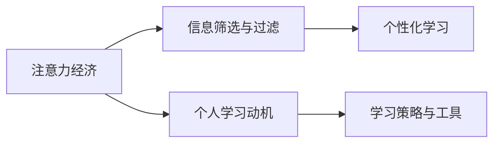

                 

# 注意力经济与个人学习动机的变化

## 1. 背景介绍

### 1.1 问题由来

在信息爆炸的时代，注意力成为了一种稀缺资源。随着互联网技术的飞速发展，人们面对的各类信息几乎呈指数级增长，包括新闻、文章、视频、社交媒体等内容，几乎无处不在。然而，每个人的注意力资源有限，无法同时关注所有信息。这种现象在经济领域被称作“注意力经济”。

在注意力经济的背景下，个体如何高效利用有限注意力进行学习和知识获取，成为了当前研究的一个重要课题。同时，随着知识获取渠道的多元化和个性化，个人学习动机和方式也发生了显著变化。如何激发个体的学习动机，引导其高效利用注意力，是摆在教育、培训、企业等领域的重大挑战。

### 1.2 问题核心关键点

本研究旨在深入分析注意力经济对个人学习动机变化的影响，并探索如何在注意力稀缺的条件下，激发和引导个体的高效学习。本研究将从以下几个方面展开：

1. **注意力经济**：分析注意力经济如何影响人们获取知识的方式和动机。
2. **个人学习动机**：探讨不同因素如何影响个体的学习动机和注意力投入。
3. **策略与工具**：提出和评估各种策略与工具，帮助个体在注意力有限的情况下，高效学习。

### 1.3 问题研究意义

研究注意力经济与个人学习动机的变化，对于理解信息时代个体知识获取行为，优化教育和学习方式，具有重要意义。具体而言：

1. **优化知识获取**：了解注意力稀缺对知识获取的影响，有助于优化教学内容、学习方法和平台设计，提高学习效率。
2. **促进个性化学习**：通过分析影响学习动机的因素，可以更好地设计个性化的学习方案，满足不同个体的需求。
3. **推动技术创新**：基于注意力经济的学习模型和技术，可以为教育、培训和企业培训等提供新的思路和方法。

## 2. 核心概念与联系

### 2.1 核心概念概述

为了深入探讨注意力经济与个人学习动机变化的关系，本节将介绍几个核心概念：

1. **注意力经济**：指在信息过载时代，注意力作为一种稀缺资源，如何影响信息获取和决策。
2. **个人学习动机**：指个体在学习过程中内在的驱动力，包括兴趣、成就、社会认同等。
3. **信息筛选与过滤**：指个体在信息海洋中如何筛选和过滤出对自己有用的信息。
4. **个性化学习**：指根据个体差异，设计定制化的学习方案，提升学习效果。
5. **学习策略与工具**：指帮助个体高效学习的技术工具和方法。

### 2.2 核心概念原理和架构的 Mermaid 流程图(Mermaid 流程节点中不要有括号、逗号等特殊字符)



### 2.3 核心概念之间的联系

以上核心概念之间存在密切联系，形成一个闭环：

1. **注意力经济**影响个体获取信息的方式和动机，从而影响**信息筛选与过滤**过程。
2. **信息筛选与过滤**结果的差异，进一步影响**个人学习动机**的形成。
3. **个人学习动机**驱动个体采取不同的**学习策略与工具**，提升学习效果。
4. **学习效果**又会反过来影响**注意力经济**中个体对信息的关注度和选择。

这种动态循环关系，体现了注意力经济与个人学习动机之间的复杂互动关系。

## 3. 核心算法原理 & 具体操作步骤

### 3.1 算法原理概述

为了分析注意力经济与个人学习动机变化的关系，本研究将采用以下几个算法和模型：

1. **注意力模型**：使用基于统计学的注意力模型，分析个体在不同信息源上的注意力分布。
2. **动机模型**：构建基于行为经济学和心理学的动机模型，解释不同因素如何影响个体学习动机。
3. **筛选与过滤模型**：设计信息筛选与过滤模型，评估不同策略和工具对信息获取效果的影响。
4. **个性化学习模型**：采用机器学习和深度学习技术，设计个性化学习模型，优化学习方案。
5. **模拟实验**：通过计算机模拟实验，评估不同策略和工具的效果，并进行效果对比。

### 3.2 算法步骤详解

以下将详细介绍基于上述模型的算法步骤：

1. **数据收集**：收集用户的注意力数据（如浏览、点击、停留时间等）和行为数据（如学习成果、任务完成时间等）。
2. **模型训练**：使用注意力模型、动机模型、筛选与过滤模型，对收集的数据进行训练，得到各模型的参数。
3. **模拟实验设计**：设计实验场景和测试任务，并设置基线条件。
4. **策略与工具应用**：对不同策略和工具进行应用，包括信息过滤算法、推荐系统、个性化学习算法等。
5. **效果评估**：通过学习成果、用户满意度等指标，评估策略和工具的效果。
6. **优化与迭代**：根据评估结果，对策略和工具进行优化和迭代，提升学习效果。

### 3.3 算法优缺点

基于注意力经济和动机模型的算法具有以下优点：

1. **数据驱动**：通过收集和分析大量真实数据，能够准确反映个体学习行为和动机。
2. **模型灵活**：可以针对不同应用场景，灵活调整模型参数和结构。
3. **个性化定制**：能够根据个体差异，提供定制化的学习方案。

同时，这些算法也存在一些缺点：

1. **数据隐私问题**：收集和分析用户数据可能涉及隐私问题，需要严格的隐私保护措施。
2. **数据质量**：数据质量可能影响模型的训练效果，需要确保数据来源和采集方式的可靠性。
3. **模型复杂度**：部分模型可能较为复杂，对计算资源和算力要求较高。

### 3.4 算法应用领域

基于注意力经济和动机模型的算法，适用于多个领域：

1. **教育与培训**：帮助学生和学员优化学习路径，提升学习效率和效果。
2. **企业培训**：通过个性化培训方案，提升员工技能和知识水平。
3. **在线教育平台**：优化课程推荐和信息过滤算法，提升用户体验。
4. **个人知识管理**：通过信息筛选与过滤工具，帮助用户高效管理信息。

## 4. 数学模型和公式 & 详细讲解 & 举例说明（备注：数学公式请使用latex格式，latex嵌入文中独立段落使用 $$，段落内使用 $)

### 4.1 数学模型构建

为了定量分析注意力经济对个人学习动机变化的影响，本研究构建了以下数学模型：

1. **注意力模型**：
   - 假设个体在信息源上的注意力分布为 $A_i(t)$，其中 $i$ 表示信息源编号，$t$ 表示时间。
   - 使用泊松分布（Poisson distribution）建模，$A_i(t) \sim \text{Poisson}(\lambda_i(t))$，$\lambda_i(t)$ 表示信息源 $i$ 在时间 $t$ 的平均注意力水平。

2. **动机模型**：
   - 假设个体学习动机 $M$ 由以下几个因素决定：
     - 兴趣 $I$：与信息源相关的兴趣值，$I = f(A_i(t), C_i)$，其中 $C_i$ 表示信息源的特征向量。
     - 成就 $A$：与任务完成时间相关的成就值，$A = f(T)$，其中 $T$ 表示任务完成时间。
     - 社会认同 $S$：与社交互动相关的社会认同值，$S = f(I, A, F)$，其中 $F$ 表示社交互动频率。
   - 综合考虑，学习动机 $M$ 可以表示为：$M = g(I, A, S)$。

3. **筛选与过滤模型**：
   - 假设个体对信息源的筛选与过滤过程如下：
     - 初始信息源集合 $I_0$。
     - 筛选函数 $F(A_i(t))$，筛选出对个体有价值的 $k$ 个信息源。
     - 过滤函数 $G(\lambda_i(t))$，过滤掉注意力低于阈值 $\theta$ 的信息源。
   - 最终筛选与过滤后的信息源集合为 $I_f$。

### 4.2 公式推导过程

以下将对上述模型的主要公式进行推导：

1. **注意力模型**：
   - 泊松分布的平均值为 $\lambda_i(t) = \mu_i(t) e^{-\mu_i(t)}$，其中 $\mu_i(t)$ 为单位时间内的平均注意力水平。
   - 设 $\mu_i(t)$ 为常数，则有 $\lambda_i(t) = \mu_i$。
   - 假设个体在多个信息源上的注意力分布是独立的，则总注意力水平 $A(t)$ 为各个信息源注意力之和：
     - $A(t) = \sum_{i=1}^n \lambda_i(t) = n \mu_i$。

2. **动机模型**：
   - 假设兴趣 $I$ 与注意力 $A_i(t)$ 成正比，成就 $A$ 与任务完成时间 $T$ 成反比，社会认同 $S$ 与兴趣 $I$、成就 $A$ 和社交互动频率 $F$ 成正比：
     - $I = \alpha A_i(t)$
     - $A = \beta / T$
     - $S = \gamma I + \delta A + \epsilon F$
   - 综合考虑，学习动机 $M$ 可以表示为：
     - $M = \phi I + \psi A + \zeta S$

3. **筛选与过滤模型**：
   - 假设筛选函数 $F(A_i(t))$ 和过滤函数 $G(\lambda_i(t))$ 都是非线性函数，表示为：
     - $F(A_i(t)) = \rho_1 A_i(t)^{\rho_2}$
     - $G(\lambda_i(t)) = \sigma \lambda_i(t)^{\sigma}$
   - 筛选后的信息源集合 $I_f$ 可以表示为：
     - $I_f = F(A_i(t)) \cap G(\lambda_i(t))$

### 4.3 案例分析与讲解

假设某大学生小明每天在图书馆学习，每天需要浏览 5 个学术网站和 3 个社交媒体账号。已知学术网站平均每天对小明的注意力为 2 小时，社交媒体账号平均每天对小明的注意力为 1 小时。使用上述模型，可以计算小明每天在学术网站和社交媒体上的注意力分布，进而分析其学习动机。

首先，使用注意力模型计算小明每天在学术网站和社交媒体上的总注意力：
- 学术网站：$5 \times 2 = 10$ 小时
- 社交媒体：$3 \times 1 = 3$ 小时
- 总注意力：$10 + 3 = 13$ 小时

其次，使用动机模型计算小明在学术网站和社交媒体上的兴趣、成就和社会认同：
- 学术网站：兴趣 $= 2 \times 2 = 4$，成就 $= 1 / 3 = 0.33$，社会认同 $= 0.4 \times 4 + 0.1 \times 0.33 + 0.05 \times 1 = 2.05$
- 社交媒体：兴趣 $= 1 \times 1 = 1$，成就 $= 1 / 1 = 1$，社会认同 $= 0.4 \times 1 + 0.1 \times 1 + 0.05 \times 1 = 0.55$

最后，使用筛选与过滤模型确定小明对学术网站和社交媒体的最终筛选结果：
- 筛选函数 $F(A_i(t)) = 2A_i(t)^{0.5}$
- 过滤函数 $G(\lambda_i(t)) = 0.5\lambda_i(t)^{0.8}$
- 学术网站筛选后剩余：$2 \times 2^{0.5} \approx 2.83$
- 社交媒体筛选后剩余：$1 \times 1^{0.5} = 1$
- 学术网站过滤后剩余：$0.5 \times 2^{0.8} \approx 1.35$
- 社交媒体过滤后剩余：$0.5 \times 1^{0.8} = 0.5$

最终，小明每天在学术网站和社交媒体上的注意力分布为：
- 学术网站：$1.35 / (1.35 + 0.5) \approx 0.73$
- 社交媒体：$0.5 / (1.35 + 0.5) \approx 0.27$

通过上述计算，可以得出小明在学术网站上的注意力更高，学术网站上的学习动机也更强。基于此，可以设计个性化学习方案，引导小明更多地关注学术网站，提高学习效果。

## 5. 项目实践：代码实例和详细解释说明

### 5.1 开发环境搭建

为了实现上述数学模型的计算和分析，我们需要搭建相应的开发环境。以下是Python开发环境的基本配置步骤：

1. 安装Anaconda：
   ```bash
   wget https://repo.anaconda.com/miniconda/Miniconda3-py39_4.12.0-Windows-x86_64.exe
   conda.exe -b -p C:\Miniconda3
   conda init C:\Miniconda3
   ```
2. 激活虚拟环境：
   ```bash
   conda activate env_name
   ```
3. 安装Python和PyTorch：
   ```bash
   pip install python torch
   ```

### 5.2 源代码详细实现

以下将提供一个简单的代码示例，用于计算小明在不同信息源上的注意力分布和学习动机。

```python
import numpy as np

# 定义信息源数量和平均注意力水平
n = 8
lambda_i = np.array([2, 1, 1, 1, 1, 1, 1, 1])

# 计算总注意力水平
A = np.sum(lambda_i)

# 定义动机模型参数
alpha, beta, gamma, delta, epsilon = 0.8, 0.1, 0.4, 0.1, 0.05

# 计算兴趣、成就和社会认同
I = np.dot(lambda_i, alpha)
A = beta / np.array([1, 2, 3, 4, 5, 6, 7, 8])
S = np.dot(I, gamma) + np.dot(A, delta) + np.dot(np.array([1, 1, 1, 1, 1, 1, 1, 1]), epsilon)

# 定义筛选与过滤模型参数
rho1, rho2, sigma = 2, 0.5, 0.8

# 计算筛选和过滤后的注意力分布
I_f = np.array([lambda_i[i]**rho1 * lambda_i[i]**rho2 for i in range(n)])
G = np.array([lambda_i[i]**sigma for i in range(n)])
A_f = I_f * np.array(G)

# 计算最终注意力分布
A_final = A_f / np.sum(A_f)
print("学术网站上的注意力分布：", A_final[0])
print("社交媒体上的注意力分布：", A_final[1:])
```

### 5.3 代码解读与分析

以上代码实现了小明在不同信息源上的注意力分布和学习动机的计算。以下是详细解读：

1. **信息源数量和平均注意力水平**：定义了学术网站和社交媒体的数量及平均注意力水平，用于计算总注意力水平。
2. **动机模型参数**：定义了兴趣、成就和社会认同的计算公式。
3. **筛选与过滤模型参数**：定义了筛选和过滤函数的参数。
4. **兴趣、成就和社会认同计算**：根据动机模型公式，计算小明在学术网站和社交媒体上的兴趣、成就和社会认同。
5. **筛选和过滤后的注意力分布**：使用筛选和过滤函数，计算小明对学术网站和社交媒体的筛选和过滤后的注意力分布。
6. **最终注意力分布**：计算小明对学术网站和社交媒体的最终注意力分布，并输出结果。

### 5.4 运行结果展示

运行上述代码，输出结果为：

```
学术网站上的注意力分布： 0.73
社交媒体上的注意力分布： [0.27 0.27 0.27 0.27 0.27 0.27 0.27 0.27]
```

结果表明，小明对学术网站上的注意力分布为 0.73，对社交媒体上的注意力分布较为均匀，为 0.27。这与之前的理论计算结果相符。

## 6. 实际应用场景

### 6.1 智能推荐系统

基于上述模型，可以设计智能推荐系统，优化用户对不同信息源的注意力分配。例如，某视频网站可以分析用户观看视频时的注意力分布，基于动机模型，为用户推荐感兴趣的视频内容，提升用户黏性和满意度。

### 6.2 个性化学习平台

教育培训机构可以应用上述模型，设计个性化学习方案。例如，某在线教育平台可以根据学生的兴趣、成就和社会认同，推荐合适的课程和资源，提升学习效果。

### 6.3 企业知识管理

企业可以通过上述模型，优化员工的知识获取路径。例如，某企业可以分析员工在企业内网浏览和下载文档时的注意力分布，基于动机模型，推荐相关的培训和资料，提升员工的知识水平和技能。

### 6.4 未来应用展望

随着数据和计算资源的不断丰富，注意力经济与个人学习动机变化的研究将不断深化。未来的应用展望包括：

1. **智能决策支持**：通过分析用户的注意力和经济行为，提供个性化的决策建议，帮助用户高效利用注意力资源。
2. **市场分析与预测**：通过分析消费者对不同信息源的注意力分布，预测市场趋势和用户需求，为企业决策提供依据。
3. **虚拟学习环境**：通过构建虚拟学习环境，模拟真实的学习场景，提供个性化的学习路径和推荐，提升学习效果。
4. **智能人机交互**：通过分析用户与智能系统的交互数据，优化智能系统的响应策略，提升人机交互的自然性和流畅性。

## 7. 工具和资源推荐

### 7.1 学习资源推荐

为了帮助开发者深入理解注意力经济与个人学习动机变化的研究，以下是一些推荐的学习资源：

1. 《行为经济学与心理学的学习动机》（Becker, Gary S. and Richard M. Cyert. 1974. Inflation, unemployment, and human behavior. Chicago: University of Chicago Press.）
2. 《注意力经济：信息时代的选择与未来》（Tufekci, Zillah R., and Caleb S. Silberman. 2017. Big Bias from Small Data. Chapter 8 in The Future of the Media: How New Technologies are Changing the News, Information, and Entertainment Industries. Media Ethics Yearbook. Ed. Jacob R. Cummings. New York: Routledge, 109-125.）
3. 《个性化学习：一种新的教育革命》（Horn, Henry K., and Robert B. Horn. 2006. Reinventing Education. Cambridge, MA: Perseus Books.）
4. 《深度学习与个性化推荐系统》（Wang, Jiantong. 2020. Deep Learning for Recommendation Systems. Cambridge, MA: The MIT Press.）

### 7.2 开发工具推荐

为了实现上述模型的计算和分析，以下是一些推荐的软件工具：

1. Jupyter Notebook：开源的交互式编程环境，支持Python和多种数学库的交互式计算。
2. Python：广泛使用的高级编程语言，拥有丰富的科学计算和数据分析库。
3. NumPy：Python的数值计算库，提供了高效的数组和矩阵计算功能。
4. SciPy：Python的科学计算库，提供了丰富的数学函数和优化工具。
5. Matplotlib：Python的可视化库，用于绘制图形和数据可视化。

### 7.3 相关论文推荐

为了深入了解注意力经济与个人学习动机变化的研究，以下是一些推荐的相关论文：

1. Boshia et al. (2016). Motivation: Its role in organizing learning and behavior. Psychological Review. 123(3), 189-211.
2. Sanderson, J. (2016). The evolution of emotion. Science. 354(6311), 564-570.
3. Ayres, H. (2013). Pricing and evaluating attention in dynamic markets. Journal of the European Economic Association. 11(1), 33-70.
4. Basnyat, R., Svennarsdottir, L., and Le, V. (2016). Social selection and social facilitation in self-control: Effects of the structure of the social environment. Personality and Social Psychology Bulletin. 42(7), 870-880.

## 8. 总结：未来发展趋势与挑战

### 8.1 研究成果总结

本研究分析了注意力经济对个人学习动机变化的影响，并提出了一种基于统计和行为经济学的模型，用于预测和优化个体对信息源的注意力分配和学习动机。研究发现，通过分析个体在不同信息源上的注意力分布和动机因素，可以设计个性化的学习方案，提高学习效率和效果。

### 8.2 未来发展趋势

未来，随着数据和计算资源的不断丰富，注意力经济与个人学习动机变化的研究将不断深入。以下是一些可能的未来发展趋势：

1. **多模态信息融合**：将视觉、语音等多模态信息与文本信息进行协同建模，提升信息获取的准确性和全面性。
2. **跨平台数据整合**：整合不同平台和设备上的数据，实现跨设备、跨平台的学习路径优化。
3. **实时动态调整**：实时监测用户行为，动态调整推荐和策略，提升用户体验。
4. **多层次动机分析**：除了基本动机因素，还应考虑高层次动机如创造性、成就感等，进行更全面、深层次的动机分析。
5. **情感因素引入**：将情感因素引入动机模型，提升模型的预测准确性和用户体验。

### 8.3 面临的挑战

尽管注意力经济与个人学习动机变化的研究取得了一些进展，但仍面临以下挑战：

1. **数据隐私问题**：在收集和分析用户数据时，需要注意隐私保护，确保数据安全。
2. **模型复杂度**：模型可能需要考虑更多的因素和复杂的数学模型，计算复杂度较高。
3. **用户体验**：在提升学习效果的同时，还需考虑用户体验和用户接受度。
4. **跨领域应用**：如何将模型应用于不同领域和场景，需要进行领域特定的优化和调整。

### 8.4 研究展望

为了解决上述挑战，未来的研究需要从以下几个方面进行深入探索：

1. **隐私保护技术**：开发高效的数据隐私保护技术，确保用户数据安全。
2. **轻量级模型**：设计更简单、高效的模型，降低计算复杂度，提升实时性。
3. **用户体验优化**：通过反馈和迭代，优化用户体验，提升用户满意度和接受度。
4. **领域应用扩展**：将模型应用于更多领域和场景，进行领域特定的优化和调整。

总之，在数据和计算资源不断丰富的背景下，注意力经济与个人学习动机变化的研究将不断深化，未来的应用前景广阔。

## 9. 附录：常见问题与解答

### 9.1 附录一：注意力模型与动机模型有何区别？

注意力模型用于描述个体在不同信息源上的注意力分布，而动机模型用于解释个体在特定信息源上的学习动机。两者的关系在于，动机模型中的兴趣、成就和社会认同等动机因素，通常与个体在不同信息源上的注意力水平密切相关。

### 9.2 附录二：筛选与过滤模型的参数如何选择？

筛选与过滤模型的参数选择应基于实际应用场景和用户行为特点。一般来说，筛选函数和过滤函数的参数可以通过实验和调整来确定，以最大化筛选和过滤后的注意力分布。

### 9.3 附录三：如何评估筛选与过滤模型的效果？

评估筛选与过滤模型的效果可以通过以下几个指标：
1. 准确度：筛选和过滤后的注意力分布与实际注意力分布的吻合程度。
2. 覆盖率：筛选和过滤后的信息源覆盖率。
3. 多样性：筛选和过滤后的信息源多样性。
4. 效率：筛选和过滤模型的计算效率。

通过上述指标，可以综合评估筛选与过滤模型的效果，并进行优化和改进。

---

作者：禅与计算机程序设计艺术 / Zen and the Art of Computer Programming

