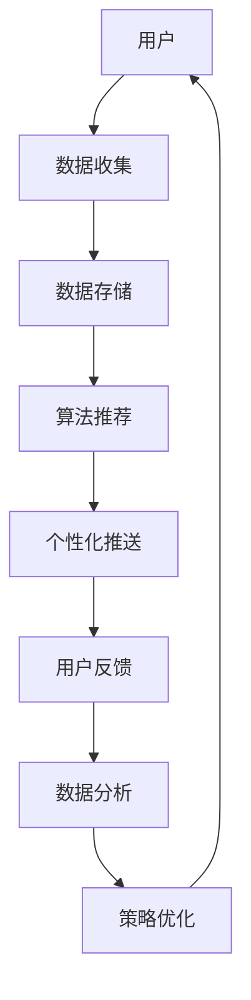

                 

# 注意力经济与个人情感表达方式的变迁

> 关键词：注意力经济, 个人情感表达, 社交媒体, 算法推荐, 内容消费, 个性化, 机器学习, 大数据

## 1. 背景介绍

### 1.1 问题由来
在现代社会，人们的注意力资源变得稀缺而宝贵。信息过载成为了一个普遍问题，海量的信息流充斥着我们的日常生活，如何有效地吸引和保持用户注意力，成为企业和内容创作者共同关注的核心议题。随着社交媒体和互联网平台的兴起，数据驱动的注意力经济应运而生，利用算法推荐、个性化推送等方式，实现精准对接用户需求，最大化吸引用户注意力，提升用户粘性，进而创造商业价值。

与此同时，人们的情感表达方式也发生了深刻变化。在传统线下环境中，情感表达通常依赖面对面交流或书信往来。然而，在互联网时代，社交媒体、即时通讯工具等数字平台的兴起，使得情感表达变得更加碎片化、即时化和数字化。社交网络、微博、微信朋友圈等平台，成为新一代情感表达的主渠道，情感的表达、传播和互动方式也随之发生了重大变迁。

本文旨在探讨注意力经济与个人情感表达方式变迁的内在联系，并揭示两者在技术层面的相互促进和影响。

### 1.2 问题核心关键点
注意力经济的核心在于如何利用算法和数据，高效地识别和匹配用户的兴趣偏好，从而最大化其注意力投入。而个人情感表达方式的变迁，则体现在社交媒体时代，情感表达的内容、形式和方式变得日益多样化和数字化的趋势上。二者之间的相互作用和融合，是本文研究的焦点。

## 2. 核心概念与联系

### 2.1 核心概念概述

#### 2.1.1 注意力经济

注意力经济是指通过有效吸引和利用用户注意力，从而创造商业价值的经济活动。其核心在于利用用户注意力资源进行有价值的商业活动，包括但不限于广告、推荐系统、内容订阅等。

#### 2.1.2 算法推荐

算法推荐是指通过数据分析和机器学习算法，预测用户兴趣，向用户推荐个性化内容，以提升用户参与度和满意度。推荐算法的主要目标是最大化用户对内容的点击率、停留时间和消费转化率。

#### 2.1.3 个性化

个性化是指根据用户的行为、偏好、历史数据等，提供量身定制的内容和服务，以提升用户体验和满意度。个性化在推荐算法中尤为重要，通过深入分析用户行为，可以更准确地推荐用户感兴趣的内容。

#### 2.1.4 社交媒体

社交媒体是指通过网络平台，用户可以发布、分享和互动内容的社交网络。主要形式包括微博、微信、Facebook、Twitter等。社交媒体不仅提供了情感表达的平台，也成为注意力经济的重要阵地。

#### 2.1.5 数据驱动

数据驱动是指利用大数据技术，对用户行为数据进行分析挖掘，指导业务决策和产品优化。在注意力经济和情感表达方式变迁中，数据驱动起到了关键作用。

### 2.2 核心概念原理和架构的 Mermaid 流程图



此图展示了注意力经济与个人情感表达方式变迁的相互作用机制。用户的数据通过收集、存储、分析和优化，转化为个性化推荐和情感表达的内容推送，最终影响用户的情感表达和行为反馈。

## 3. 核心算法原理 & 具体操作步骤
### 3.1 算法原理概述

基于算法的注意力经济和个性化推荐，其核心思想是通过用户行为数据的分析，构建用户兴趣模型，进而进行个性化推荐。算法的关键在于如何高效地捕捉用户兴趣和行为特征，以及如何通过模型预测和匹配这些特征。

在技术上，常见的算法包括协同过滤、基于内容的推荐、矩阵分解等。这些算法通过分析和挖掘用户行为数据，提取用户特征，构建用户兴趣模型，并通过模型预测，推荐相关内容。

### 3.2 算法步骤详解

1. **数据收集与预处理**：从社交媒体、电商网站、搜索引擎等渠道收集用户行为数据，包括点击、浏览、购买、评分等行为数据。对数据进行清洗、归一化和特征工程，提取用户特征。

2. **用户兴趣建模**：通过协同过滤、矩阵分解、深度学习等方法，构建用户兴趣模型。协同过滤通过用户行为相似性进行推荐，矩阵分解通过用户-物品矩阵进行分解，深度学习通过构建神经网络模型，预测用户兴趣。

3. **内容推荐**：将用户兴趣模型应用于推荐算法，通过模型预测，推荐用户可能感兴趣的内容。推荐算法主要包括基于内容的推荐、协同过滤、矩阵分解等。

4. **用户反馈收集与调整**：收集用户对推荐内容的行为反馈，如点击率、停留时间、评分等，调整模型参数，优化推荐算法。

5. **策略优化与部署**：根据用户反馈和分析结果，优化推荐策略，部署到实际应用中，提升推荐效果。

### 3.3 算法优缺点

#### 3.3.1 优点

1. **高效性**：算法推荐能够快速准确地推荐用户感兴趣的内容，提升用户满意度和粘性。
2. **个性化**：通过用户行为数据，构建个性化推荐模型，提供量身定制的服务。
3. **数据驱动**：利用大数据技术，进行深度分析和挖掘，指导业务决策和产品优化。

#### 3.3.2 缺点

1. **冷启动问题**：新用户或少有行为数据的用户，难以准确推荐。
2. **多样性问题**：长期单一推荐，可能导致用户的信息茧房，限制了用户对新内容的探索。
3. **隐私问题**：用户数据隐私和安全问题，需要谨慎处理。

### 3.4 算法应用领域

算法推荐广泛应用于电商、新闻、视频、音乐等各领域，通过个性化推荐，提升用户体验和满意度。例如，亚马逊、Netflix、YouTube等平台，都广泛应用了算法推荐，取得了显著的商业效果。

## 4. 数学模型和公式 & 详细讲解

### 4.1 数学模型构建

基于用户行为数据，构建推荐模型的数学模型如下：

$$
\hat{y} = f(x)
$$

其中，$x$ 表示用户行为数据，$y$ 表示推荐内容，$f$ 表示推荐算法模型。推荐算法模型的构建，通常依赖于以下数据：

1. 用户-物品评分矩阵 $R$
2. 用户行为序列 $X$
3. 物品属性向量 $I$

### 4.2 公式推导过程

以协同过滤算法为例，其核心思想是通过用户行为相似性，推荐用户可能感兴趣的内容。协同过滤的推荐公式如下：

$$
\hat{y}_{ui} = \frac{\sum_{j\neq i} R_{uj} \times R_{vi}}{\sqrt{\sum_{j\neq i} R_{uj}^2} \times \sqrt{\sum_{j\neq i} R_{vi}^2}}
$$

其中，$R$ 表示用户-物品评分矩阵，$u$ 表示用户，$i$ 表示物品，$v$ 表示与用户 $u$ 相似的用户。

协同过滤算法的核心在于构建用户相似性矩阵 $K$，通过相似性度量（如余弦相似度、皮尔逊相关系数等），找到与用户 $u$ 相似的用户 $v$，并根据相似性矩阵 $K$，计算推荐结果 $\hat{y}_{ui}$。

### 4.3 案例分析与讲解

以Netflix的推荐系统为例，Netflix的推荐系统采用协同过滤算法，通过用户行为数据，构建用户-物品评分矩阵 $R$，进行推荐。具体步骤如下：

1. 收集用户评分数据，构建用户-物品评分矩阵 $R$。
2. 对 $R$ 进行归一化和稀疏化处理，减少计算复杂度。
3. 通过用户行为序列 $X$ 和物品属性向量 $I$，构建用户相似性矩阵 $K$。
4. 根据相似性矩阵 $K$，计算用户 $u$ 对物品 $i$ 的评分 $\hat{y}_{ui}$。
5. 将评分 $\hat{y}_{ui}$ 作为推荐结果，推送给用户。

Netflix的推荐系统通过不断收集用户行为数据，实时更新评分矩阵 $R$ 和相似性矩阵 $K$，从而提升推荐效果。此外，Netflix还引入了深度学习技术，提升推荐算法的精准度。

## 5. 项目实践：代码实例和详细解释说明
### 5.1 开发环境搭建

在进行推荐系统开发前，我们需要准备好开发环境。以下是使用Python进行Scikit-learn开发的环境配置流程：

1. 安装Anaconda：从官网下载并安装Anaconda，用于创建独立的Python环境。

2. 创建并激活虚拟环境：
```bash
conda create -n recommendation-env python=3.8 
conda activate recommendation-env
```

3. 安装Scikit-learn：
```bash
pip install scikit-learn
```

4. 安装各类工具包：
```bash
pip install numpy pandas scikit-learn matplotlib tqdm jupyter notebook ipython
```

完成上述步骤后，即可在`recommendation-env`环境中开始推荐系统开发。

### 5.2 源代码详细实现

下面以协同过滤算法为例，给出使用Scikit-learn库对用户评分数据进行协同过滤的Python代码实现。

```python
from sklearn.metrics.pairwise import cosine_similarity
from sklearn.metrics.pairwise import euclidean_distances
from scipy.sparse import csr_matrix

# 构建用户评分矩阵
R = [[5, 3, 1], [4, 2, 4], [1, 5, 3], [3, 4, 5]]

# 构建用户相似性矩阵
K = cosine_similarity(csr_matrix(R))

# 计算用户推荐评分
def collaborative_filtering(R, K, u, i):
    return K[u][i] * R[i].sum()

# 测试
u = 0
i = 2
y_hat = collaborative_filtering(R, K, u, i)
print(f"用户{u}对物品{i}的推荐评分：{y_hat:.2f}")
```

以上代码实现了基于用户行为数据的协同过滤推荐，通过计算用户相似性矩阵 $K$ 和用户-物品评分矩阵 $R$，对用户进行推荐。

### 5.3 代码解读与分析

代码中，首先使用Scikit-learn库构建用户评分矩阵 $R$，并计算用户相似性矩阵 $K$。然后，定义协同过滤算法的推荐函数，根据用户相似性矩阵 $K$ 和用户-物品评分矩阵 $R$，计算用户对物品的推荐评分。

协同过滤算法的核心在于相似性度量，代码中使用了余弦相似度作为度量方法。余弦相似度可以有效地衡量两个向量之间的相似性，适用于稀疏矩阵的相似性计算。

## 6. 实际应用场景

### 6.1 电商推荐

在电商领域，推荐系统广泛应用于商品推荐、个性化搜索等环节。通过分析用户历史购买、浏览、评分等行为数据，构建用户兴趣模型，生成个性化推荐，提升用户体验和转化率。例如，亚马逊的推荐系统通过协同过滤算法，实时生成个性化推荐，用户可以根据推荐结果发现更多感兴趣的商品。

### 6.2 新闻推荐

新闻平台如今日头条、腾讯新闻等，通过推荐系统向用户推荐新闻内容，提升用户阅读体验。新闻推荐系统通过分析用户浏览历史和点击行为，预测用户兴趣，推荐相关新闻内容。例如，今日头条通过深度学习模型，实时生成个性化推荐，提升用户阅读时长和粘性。

### 6.3 音乐推荐

音乐平台如Spotify、网易云音乐等，通过推荐系统向用户推荐音乐内容，提升用户音乐消费体验。音乐推荐系统通过分析用户听歌历史和评分，构建用户兴趣模型，推荐相关音乐内容。例如，Spotify通过协同过滤算法和深度学习模型，实时生成个性化推荐，提升用户听歌时长和满意度。

## 7. 工具和资源推荐

### 7.1 学习资源推荐

为了帮助开发者系统掌握推荐系统的理论和实践，这里推荐一些优质的学习资源：

1. 《推荐系统实战》书籍：介绍了推荐系统的基础理论、算法实现和实践案例，适合初学者和进阶开发者。

2. 《机器学习实战》书籍：深入浅出地介绍了机器学习算法在推荐系统中的应用，包括协同过滤、矩阵分解、深度学习等。

3. 《深度学习》课程：斯坦福大学李飞飞教授主讲的深度学习课程，涵盖深度学习算法在推荐系统中的应用。

4. 《推荐系统》课程：北京大学王斌教授主讲的推荐系统课程，系统讲解了推荐系统的基本概念、算法和实际应用。

5. Kaggle竞赛平台：提供了丰富的推荐系统竞赛数据集和样例代码，适合实践学习。

### 7.2 开发工具推荐

高效的开发离不开优秀的工具支持。以下是几款用于推荐系统开发的常用工具：

1. Python：简单易学的编程语言，拥有丰富的科学计算和机器学习库，是推荐系统开发的首选语言。

2. Scikit-learn：Python的科学计算库，提供了多种机器学习算法，包括协同过滤、矩阵分解等。

3. TensorFlow：Google开发的深度学习框架，支持分布式计算和动态图机制，适合大规模推荐系统的开发。

4. PyTorch：Facebook开发的深度学习框架，提供了简单易用的API和丰富的模型库，适合推荐系统的深度学习模型开发。

5. Hadoop和Spark：大数据处理框架，支持分布式数据处理和存储，适合处理大规模推荐系统的数据。

### 7.3 相关论文推荐

推荐系统的发展得益于学界的持续研究。以下是几篇奠基性的相关论文，推荐阅读：

1. "Collaborative Filtering for Implicit Feedback Datasets"：提出了协同过滤算法，为推荐系统奠定了基础。

2. "Beyond the Correlation: Utility-based Probabilistic Matrix Factorization for Recommender Systems"：提出了基于概率矩阵分解的推荐模型，提升了推荐系统的准确度。

3. "Deep Neural Networks for Large-Scale Recommender Systems"：提出了深度学习在推荐系统中的应用，提升了推荐算法的精度。

4. "Matrix Factorization Techniques for Recommender Systems"：系统介绍了矩阵分解算法在推荐系统中的应用。

5. "Hybrid Recommender Systems: A Survey"：系统回顾了混合推荐系统，融合多种推荐算法，提升了推荐系统的综合性能。

这些论文代表了大规模推荐系统的发展脉络。通过学习这些前沿成果，可以帮助研究者把握学科前进方向，激发更多的创新灵感。

## 8. 总结：未来发展趋势与挑战

### 8.1 总结

本文对基于算法的注意力经济和个性化推荐方法进行了全面系统的介绍。首先阐述了推荐系统的背景和意义，明确了推荐系统在提升用户体验和创造商业价值方面的独特价值。其次，从原理到实践，详细讲解了推荐系统的数学模型和核心算法，给出了推荐系统开发的完整代码实例。同时，本文还广泛探讨了推荐系统在电商、新闻、音乐等多个领域的应用前景，展示了推荐范式的巨大潜力。此外，本文精选了推荐系统的各类学习资源，力求为读者提供全方位的技术指引。

通过本文的系统梳理，可以看到，基于算法的推荐系统正在成为电商、新闻、音乐等领域的重要工具，极大地提升了用户体验和消费转化率。推荐系统通过深入分析用户行为数据，构建个性化推荐模型，实现了精准对接用户需求，最大化吸引用户注意力。未来，伴随推荐算法的不断演进，推荐系统必将在更多领域得到应用，为各行各业带来变革性影响。

### 8.2 未来发展趋势

展望未来，推荐系统的趋势将呈现以下几个方向：

1. **多模态融合**：推荐系统将融合图像、音频、文本等多模态数据，提升推荐效果。例如，通过分析用户的图片和视频行为数据，推荐相关的物品或内容。

2. **实时动态更新**：推荐系统将实现实时动态更新，及时响应用户行为变化，提升推荐精度。例如，基于用户实时点击行为，实时调整推荐结果。

3. **个性化深度定制**：推荐系统将实现深度定制，为用户提供量身定制的推荐服务。例如，基于用户的特定兴趣和需求，提供个性化的商品推荐或内容推荐。

4. **跨领域推荐**：推荐系统将实现跨领域推荐，提升推荐的多样性和丰富性。例如，通过分析用户的电商行为和新闻阅读行为，推荐跨领域的商品或文章。

5. **协同学习与用户生成内容**：推荐系统将引入协同学习和用户生成内容，提升推荐的多样性和互动性。例如，通过分析用户生成的评论和反馈，优化推荐模型。

以上趋势凸显了推荐系统的广阔前景。这些方向的探索发展，必将进一步提升推荐系统的性能和应用范围，为人类信息消费提供更多元、更智能的体验。

### 8.3 面临的挑战

尽管推荐系统已经取得了瞩目成就，但在迈向更加智能化、普适化应用的过程中，仍面临诸多挑战：

1. **冷启动问题**：新用户或少有行为数据的用户，难以准确推荐。

2. **隐私问题**：用户数据隐私和安全问题，需要谨慎处理。

3. **多样性问题**：长期单一推荐，可能导致用户的信息茧房，限制了用户对新内容的探索。

4. **计算复杂度**：推荐系统的计算复杂度较高，需要优化算法和硬件资源。

5. **模型可解释性**：推荐系统的黑盒模型难以解释其内部工作机制和决策逻辑，亟需提高模型的可解释性。

6. **算法公平性**：推荐算法可能存在偏差，需要确保算法的公平性和透明性。

### 8.4 研究展望

面对推荐系统面临的种种挑战，未来的研究需要在以下几个方面寻求新的突破：

1. **多模态推荐模型**：开发更加智能的多模态推荐模型，融合图像、音频、文本等多模态数据，提升推荐效果。

2. **个性化推荐算法**：研究个性化推荐算法，实现深度定制的推荐服务。例如，基于用户特定兴趣和需求，提供个性化的商品推荐或内容推荐。

3. **推荐系统的可解释性**：提高推荐系统的可解释性，使其内部工作机制和决策逻辑更加透明，便于用户理解和使用。

4. **隐私保护技术**：研究隐私保护技术，确保用户数据隐私和安全。例如，采用差分隐私技术，保护用户隐私。

5. **公平性算法**：开发公平性算法，确保推荐算法在种族、性别、年龄等方面的公平性。

6. **实时动态推荐**：实现实时动态推荐，及时响应用户行为变化，提升推荐精度。

这些研究方向的探索，必将引领推荐系统技术迈向更高的台阶，为人类信息消费提供更加智能、多元的体验。

## 9. 附录：常见问题与解答

**Q1：推荐系统是否适用于所有应用场景？**

A: 推荐系统适用于大多数应用场景，特别是在电商、新闻、音乐等领域具有显著优势。但对于一些特定领域，如医疗、法律等，需要结合领域知识进行定制化推荐。

**Q2：推荐系统的学习速度如何？**

A: 推荐系统的学习速度主要取决于数据量和算法复杂度。一般来说，数据量越大，推荐系统的学习速度越快。算法复杂度越高，训练时间越长。通过分布式计算和模型压缩等技术，可以有效提升推荐系统的学习速度。

**Q3：推荐系统如何避免冷启动问题？**

A: 推荐系统通常采用基于内容的推荐和混合推荐等策略，通过分析用户历史行为数据，对新用户进行推荐。例如，基于用户兴趣模型，对新用户进行推荐。

**Q4：推荐系统的算法公平性如何保证？**

A: 推荐系统需要引入公平性算法，确保推荐算法在种族、性别、年龄等方面的公平性。例如，通过调整模型参数，避免对某些群体的偏见。

**Q5：推荐系统的实时动态更新如何实现？**

A: 推荐系统可以通过增量学习、在线学习等技术，实现实时动态更新。例如，基于用户实时点击行为，实时调整推荐结果。

---

作者：禅与计算机程序设计艺术 / Zen and the Art of Computer Programming

