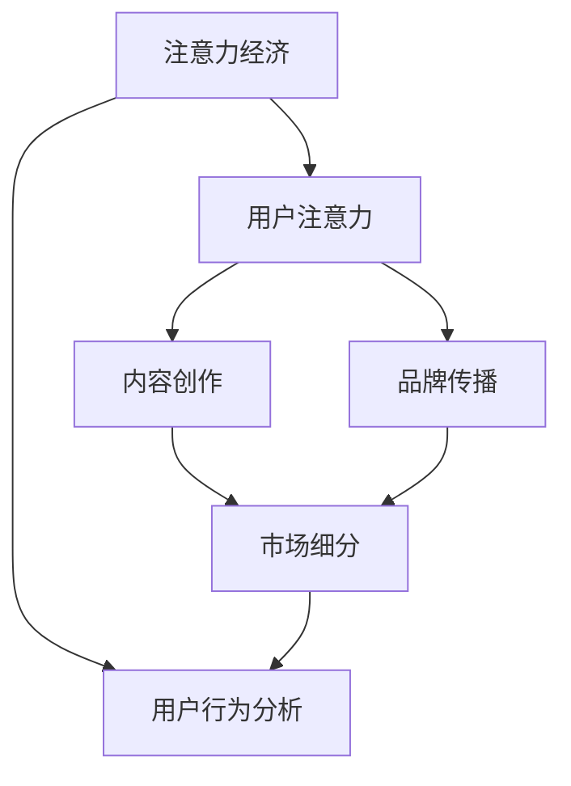

                 

# 注意力经济与个人职业规划的调整

## 1. 背景介绍

### 1.1 问题由来
随着移动互联网和社交媒体的普及，我们进入了一个被注意力经济所主导的时代。在这个时代，如何更好地吸引和利用人们的注意力，成为了企业和个人职业规划的关键词。例如，内容创作者如何在众多平台上获得更高的曝光率，企业如何通过广告、活动吸引更多的潜在客户，以及个人如何提升自身价值，吸引更多的关注和机会。

### 1.2 问题核心关键点
注意力经济的核心是如何在有限的时间、精力和资源内，最大化地吸引和利用人们的注意力。它涉及到的核心问题包括：

- **数据驱动的决策**：利用大数据、机器学习等技术手段，分析用户行为和偏好，制定科学的营销策略和内容创作计划。
- **内容质量与多样性**：在短时间内快速创作高质量、有价值的内容，同时保持内容的持续更新和多样化，以吸引不同兴趣的用户群体。
- **用户互动与留存**：通过社交互动、用户反馈等手段，提升用户参与度和品牌忠诚度，降低流失率。
- **跨平台运营**：在多个社交媒体平台、搜索引擎、APP等渠道上，实现内容分发和品牌推广的多渠道运营，提升整体曝光率和效果。

### 1.3 问题研究意义
研究注意力经济与个人职业规划的调整，对于企业和个人都具有重要意义：

1. **企业层面**：通过理解注意力经济的规律和特征，企业可以优化资源分配，制定更精准的市场营销策略，提升品牌影响力和市场竞争力。
2. **个人层面**：个人可以结合自身兴趣和能力，调整职业规划，提升自身品牌影响力，获取更多的职业发展机会和资源。

## 2. 核心概念与联系

### 2.1 核心概念概述

为了更好地理解注意力经济与个人职业规划的调整，我们首先需要定义一些核心概念：

- **注意力经济**：以吸引和利用人们的注意力为核心的经济形态，包括广告、内容创作、品牌推广等多个方面。
- **用户注意力**：用户在特定时间段内，对某品牌、产品、内容所投入的关注程度，包括浏览、点击、评论、互动等多种形式。
- **内容创作**：通过创作有价值、有趣的内容，吸引和保持用户注意力。
- **品牌传播**：通过各种媒介，将品牌信息传递给目标用户，提升品牌知名度和影响力。
- **市场细分**：根据用户行为、兴趣、特征等，将市场划分为不同细分市场，进行精准营销。
- **用户行为分析**：通过数据分析手段，理解用户行为模式和偏好，优化内容和推广策略。

### 2.2 核心概念原理和架构的 Mermaid 流程图



这个流程图展示了注意力经济的关键组件和它们之间的联系：

- **A (注意力经济)**：以吸引和利用用户注意力的经济形态，是整个模型的核心。
- **B (用户注意力)**：用户对品牌、内容的关注程度，是注意力经济的主要驱动力。
- **C (内容创作)**：通过创作有价值的内容，吸引和保持用户注意力。
- **D (品牌传播)**：通过各种媒介，提升品牌知名度和影响力。
- **E (市场细分)**：根据用户行为、兴趣、特征等，进行精准营销。
- **F (用户行为分析)**：通过数据分析手段，优化内容和推广策略。

这些核心概念共同构成了注意力经济的基本框架，为理解和优化个人职业规划提供了基础。

## 3. 核心算法原理 & 具体操作步骤

### 3.1 算法原理概述

注意力经济的优化，很大程度上依赖于数据驱动的决策和算法优化。核心算法原理包括以下几个方面：

- **用户行为分析**：通过收集、分析用户的点击、浏览、互动等行为数据，理解用户需求和兴趣，制定个性化内容创作和营销策略。
- **内容推荐算法**：利用协同过滤、内容过滤、混合推荐等算法，为用户推荐最符合其兴趣的内容，提升用户留存率。
- **广告投放优化**：通过A/B测试、多臂乐队、强化学习等算法，优化广告投放策略，提升广告效果和ROI。
- **品牌传播分析**：通过文本分析、情感分析等技术手段，分析品牌传播效果，调整传播策略。
- **市场细分与定位**：通过聚类、分类等机器学习算法，将市场划分为不同细分市场，进行精准营销。

### 3.2 算法步骤详解

1. **数据收集与预处理**：
   - 收集用户行为数据，如点击、浏览、互动等，存储到数据库中。
   - 对数据进行清洗、去重、归一化等预处理操作，确保数据质量和一致性。

2. **用户行为分析**：
   - 利用统计学、数据挖掘等技术手段，分析用户行为数据，提取用户兴趣、偏好等特征。
   - 使用聚类算法，将用户分成不同兴趣群体，为内容创作和广告投放提供依据。

3. **内容创作与推荐**：
   - 结合用户行为分析结果，创作有针对性的内容，如视频、文章、图片等。
   - 使用协同过滤、内容过滤等推荐算法，为用户推荐相关内容，提升用户留存率。

4. **广告投放优化**：
   - 通过A/B测试、多臂乐队等算法，测试不同的广告创意和投放策略，寻找最优方案。
   - 利用强化学习算法，动态调整广告投放策略，优化广告效果和成本。

5. **品牌传播分析**：
   - 使用文本分析、情感分析等技术手段，分析品牌传播效果，评估广告、活动等营销活动的效果。
   - 根据分析结果，调整品牌传播策略，提升品牌影响力和用户参与度。

6. **市场细分与定位**：
   - 使用聚类、分类等机器学习算法，将市场划分为不同细分市场，进行精准营销。
   - 根据市场细分结果，制定个性化营销策略，提升市场覆盖率和转化率。

### 3.3 算法优缺点

注意力经济的算法优化具有以下优点：

- **数据驱动**：通过数据分析，优化决策过程，提高营销策略的精准度和效果。
- **自动化程度高**：利用算法自动执行广告投放、内容推荐等任务，节省人力成本。
- **动态调整**：通过实时数据分析，动态调整策略，提升整体效果。

同时，这些算法也存在一些缺点：

- **数据依赖度高**：算法效果依赖于数据质量，数据偏差可能导致算法结果偏差。
- **复杂度高**：算法涉及多个环节，复杂度高，容易出现bug和误差。
- **资源消耗大**：算法优化需要大量的计算资源和时间，可能对小型企业不适用。

### 3.4 算法应用领域

注意力经济优化算法在多个领域都有广泛应用，包括但不限于：

- **内容平台**：如YouTube、微博、知乎等，通过内容推荐和广告投放优化，提升用户留存率和平台影响力。
- **电商平台**：如淘宝、京东等，通过个性化推荐和精准广告投放，提升转化率和销售额。
- **社交媒体**：如微信、QQ等，通过内容创作和品牌传播分析，提升用户粘性和品牌影响力。
- **广告公司**：通过广告投放优化和多臂乐队算法，提高广告效果和ROI。
- **品牌推广**：通过品牌传播分析，调整品牌推广策略，提升品牌知名度和影响力。

## 4. 数学模型和公式 & 详细讲解 & 举例说明

### 4.1 数学模型构建

注意力经济优化算法通常基于以下几个数学模型：

- **协同过滤模型**：用于推荐系统，通过用户历史行为数据，预测用户对未评价项目的评分。
- **内容过滤模型**：用于推荐系统，根据项目特征和用户特征，预测用户对项目的兴趣。
- **强化学习模型**：用于广告投放优化，通过奖励机制，动态调整广告投放策略。
- **聚类算法**：用于市场细分，将用户分成不同兴趣群体。
- **分类算法**：用于市场细分，对用户进行分类，识别不同细分市场的特征。

### 4.2 公式推导过程

以协同过滤模型为例，假设用户集为 $U$，项目集为 $I$，用户对项目的评分矩阵为 $R$，令 $\hat{R}_{ui} = \sum_{j=1}^{M} a_{uji} \hat{r}_{ij}$，其中 $a_{uji}$ 为用户对项目 $j$ 的评分，$\hat{r}_{ij}$ 为项目 $j$ 的平均评分。

协同过滤模型的公式推导如下：

$$
\hat{R}_{ui} = \sum_{j=1}^{M} a_{uji} \hat{r}_{ij}
$$

### 4.3 案例分析与讲解

假设某电商平台想要通过协同过滤算法提升用户留存率，其用户集为 $U$，项目集为 $I$，用户对项目的评分矩阵为 $R$。经过数据预处理和特征提取，得到一个评分矩阵 $R$，其中 $R_{ui}$ 表示用户 $u$ 对项目 $i$ 的评分。

使用协同过滤算法，对用户 $u$ 的所有历史评分进行加权平均，得到用户对项目 $i$ 的预测评分 $\hat{R}_{ui}$。

$$
\hat{R}_{ui} = \sum_{j=1}^{M} a_{uji} \hat{r}_{ij}
$$

在得到预测评分后，电商平台可以将评分高于某一阈值的项目推荐给用户，提升用户留存率。

## 5. 项目实践：代码实例和详细解释说明

### 5.1 开发环境搭建

在进行注意力经济优化算法实践前，我们需要准备好开发环境。以下是使用Python进行PyTorch开发的环境配置流程：

1. 安装Anaconda：从官网下载并安装Anaconda，用于创建独立的Python环境。

2. 创建并激活虚拟环境：
```bash
conda create -n attention-economy-env python=3.8 
conda activate attention-economy-env
```

3. 安装PyTorch：根据CUDA版本，从官网获取对应的安装命令。例如：
```bash
conda install pytorch torchvision torchaudio cudatoolkit=11.1 -c pytorch -c conda-forge
```

4. 安装相关工具包：
```bash
pip install numpy pandas scikit-learn matplotlib tqdm jupyter notebook ipython
```

完成上述步骤后，即可在`attention-economy-env`环境中开始注意力经济优化算法的开发。

### 5.2 源代码详细实现

以下是使用PyTorch实现协同过滤算法的代码示例：

```python
import torch
import torch.nn as nn
from torch.utils.data import Dataset, DataLoader

class CollaborativeFilteringModel(nn.Module):
    def __init__(self, num_users, num_items, num_factors):
        super(CollaborativeFilteringModel, self).__init__()
        self.user_factors = nn.Embedding(num_users, num_factors)
        self.item_factors = nn.Embedding(num_items, num_factors)
        self.factors = nn.Parameter(torch.randn(num_factors, num_factors))
    
    def forward(self, user_ids, item_ids):
        user_factors = self.user_factors(user_ids)
        item_factors = self.item_factors(item_ids)
        factors = self.factors.expand(user_factors.size(0), -1, -1)
        scores = (user_factors * factors).sum(dim=1)
        scores = scores + (item_factors * factors).sum(dim=1)
        scores = scores.sigmoid()
        return scores
    
class CollaborativeFilteringDataset(Dataset):
    def __init__(self, user_ids, item_ids, scores, num_users, num_items, num_factors):
        self.user_ids = user_ids
        self.item_ids = item_ids
        self.scores = scores
        self.num_users = num_users
        self.num_items = num_items
        self.num_factors = num_factors
    
    def __len__(self):
        return len(self.user_ids)
    
    def __getitem__(self, item):
        return {
            'user_ids': self.user_ids[item].unsqueeze(0),
            'item_ids': self.item_ids[item].unsqueeze(0),
            'scores': self.scores[item].unsqueeze(0)
        }

# 假设用户集为10，项目集为20，评分矩阵为100*20
num_users = 10
num_items = 20
num_factors = 5
user_ids = torch.randint(0, num_users, (1000, 1))
item_ids = torch.randint(0, num_items, (1000, 1))
scores = torch.rand(1000, 1)

# 创建dataset
dataset = CollaborativeFilteringDataset(user_ids, item_ids, scores, num_users, num_items, num_factors)

# 定义模型和优化器
model = CollaborativeFilteringModel(num_users, num_items, num_factors)
optimizer = torch.optim.Adam(model.parameters(), lr=0.001)

# 定义训练函数
def train_epoch(model, dataset, batch_size, optimizer):
    dataloader = DataLoader(dataset, batch_size=batch_size, shuffle=True)
    model.train()
    for batch in dataloader:
        user_ids = batch['user_ids']
        item_ids = batch['item_ids']
        scores = batch['scores']
        optimizer.zero_grad()
        outputs = model(user_ids, item_ids)
        loss = nn.BCELoss()(outputs, scores)
        loss.backward()
        optimizer.step()
    return loss.item()

# 启动训练流程
for epoch in range(10):
    loss = train_epoch(model, dataset, 32, optimizer)
    print(f"Epoch {epoch+1}, loss: {loss:.3f}")
```

### 5.3 代码解读与分析

上述代码实现了基于协同过滤算法的推荐模型，可以用于预测用户对项目的评分。我们简要解读一下关键代码实现：

**CollaborativeFilteringModel类**：
- `__init__`方法：初始化用户和项目的因子嵌入矩阵，以及因素矩阵。
- `forward`方法：接收用户ID和项目ID，计算用户对项目的评分预测。

**CollaborativeFilteringDataset类**：
- `__init__`方法：初始化用户ID、项目ID、评分矩阵等参数。
- `__len__`方法：返回数据集长度。
- `__getitem__`方法：对单个样本进行处理，返回模型所需输入。

**训练函数**：
- 使用DataLoader对数据集进行批次化加载。
- 在每个批次上，计算模型预测评分与真实评分的差异，进行反向传播更新模型参数。

## 6. 实际应用场景

### 6.1 智能客服系统

基于协同过滤算法的内容推荐技术，可以应用于智能客服系统的构建。传统客服往往需要配备大量人力，高峰期响应缓慢，且一致性和专业性难以保证。而使用协同过滤算法推荐系统，可以7x24小时不间断服务，快速响应客户咨询，用个性化的内容解答各类常见问题。

在技术实现上，可以收集企业内部的历史客服对话记录，将问题和最佳答复构建成监督数据，在此基础上对协同过滤算法进行训练。训练后的推荐系统能够自动理解用户意图，匹配最合适的答案模板进行回复。对于客户提出的新问题，还可以接入检索系统实时搜索相关内容，动态组织生成回答。如此构建的智能客服系统，能大幅提升客户咨询体验和问题解决效率。

### 6.2 电商平台推荐系统

当前推荐系统往往只依赖用户的历史行为数据进行物品推荐，无法深入理解用户的真实兴趣偏好。基于协同过滤算法的推荐系统可以更好地挖掘用户行为背后的语义信息，从而提供更精准、多样的推荐内容。

在实践中，可以收集用户浏览、点击、评论、分享等行为数据，提取和用户交互的物品标题、描述、标签等文本内容。将文本内容作为模型输入，用户的后续行为（如是否点击、购买等）作为监督信号，在此基础上训练协同过滤算法。训练后的模型能够从文本内容中准确把握用户的兴趣点。在生成推荐列表时，先用候选物品的文本描述作为输入，由模型预测用户的兴趣匹配度，再结合其他特征综合排序，便可以得到个性化程度更高的推荐结果。

### 6.3 智慧医疗推荐系统

智慧医疗领域的内容推荐系统，需要根据患者的病历、症状等信息，推荐最合适的医疗建议和治疗方案。通过协同过滤算法，可以构建患者-病历-症状的三元组知识图谱，利用图神经网络等技术，实现病历和症状的语义匹配，推荐最符合患者病情的治疗方案。

在技术实现上，可以收集医生的医疗记录、病历、症状等信息，构建知识图谱。利用协同过滤算法和图神经网络，训练推荐模型，推荐最合适的医疗建议和治疗方案。这种推荐系统能够显著提升医生的诊疗效率，帮助患者更快地找到合适的治疗方案，提升医疗服务质量。

### 6.4 未来应用展望

随着协同过滤算法和推荐系统的不断发展，基于微调范式将在更多领域得到应用，为传统行业带来变革性影响。

在智慧医疗领域，基于协同过滤算法的医疗推荐系统，将提升医疗服务的智能化水平，辅助医生诊疗，加速新药开发进程。

在智能教育领域，协同过滤算法可以应用于作业批改、学情分析、知识推荐等方面，因材施教，促进教育公平，提高教学质量。

在智慧城市治理中，协同过滤算法可应用于城市事件监测、舆情分析、应急指挥等环节，提高城市管理的自动化和智能化水平，构建更安全、高效的未来城市。

此外，在企业生产、社会治理、文娱传媒等众多领域，基于协同过滤算法的推荐系统也将不断涌现，为经济社会发展注入新的动力。相信随着技术的日益成熟，协同过滤算法必将在构建人机协同的智能时代中扮演越来越重要的角色。

## 7. 工具和资源推荐

### 7.1 学习资源推荐

为了帮助开发者系统掌握注意力经济与个人职业规划的理论基础和实践技巧，这里推荐一些优质的学习资源：

1. 《推荐系统实战》系列博文：由大模型技术专家撰写，深入浅出地介绍了推荐系统原理、协同过滤算法等前沿话题。

2. 《机器学习实战》课程：斯坦福大学开设的机器学习明星课程，有Lecture视频和配套作业，带你入门机器学习的基本概念和经典模型。

3. 《深度学习理论与实践》书籍：深度学习领域的经典教材，全面介绍了深度学习算法和应用，包括协同过滤算法。

4. Coursera《推荐系统》课程：由Coursera平台提供的推荐系统课程，由国际知名教授讲授，涵盖推荐系统的各个环节。

5. Kaggle推荐系统竞赛：通过Kaggle平台参加推荐系统竞赛，练习和提升自己的推荐系统设计能力。

通过对这些资源的学习实践，相信你一定能够快速掌握注意力经济优化算法的精髓，并用于解决实际的推荐系统问题。

### 7.2 开发工具推荐

高效的开发离不开优秀的工具支持。以下是几款用于注意力经济优化算法开发的常用工具：

1. PyTorch：基于Python的开源深度学习框架，灵活动态的计算图，适合快速迭代研究。大部分推荐算法都有PyTorch版本的实现。

2. TensorFlow：由Google主导开发的开源深度学习框架，生产部署方便，适合大规模工程应用。同样有丰富的推荐算法资源。

3. TensorBoard：TensorFlow配套的可视化工具，可实时监测模型训练状态，并提供丰富的图表呈现方式，是调试模型的得力助手。

4. Weights & Biases：模型训练的实验跟踪工具，可以记录和可视化模型训练过程中的各项指标，方便对比和调优。与主流深度学习框架无缝集成。

5. Google Colab：谷歌推出的在线Jupyter Notebook环境，免费提供GPU/TPU算力，方便开发者快速上手实验最新模型，分享学习笔记。

合理利用这些工具，可以显著提升注意力经济优化算法的开发效率，加快创新迭代的步伐。

### 7.3 相关论文推荐

注意力经济优化算法的发展源于学界的持续研究。以下是几篇奠基性的相关论文，推荐阅读：

1. Matrix Factorization Techniques for Recommender Systems（矩阵分解技术）：提出矩阵分解方法，用于推荐系统，是协同过滤算法的经典方法。

2. Factorization Machines for Ad Click Prediction：提出因子机方法，通过非线性特征映射提升推荐效果。

3. Implicit Matrix Factorization Techniques：提出隐式矩阵分解方法，用于推荐系统。

4. Deep Matrix Factorization for Recommender Systems：提出深度矩阵分解方法，利用深度神经网络提升推荐效果。

5. Multi-Task Learning for Recommender Systems：提出多任务学习方法，利用多任务学习的思想，提升推荐系统效果。

这些论文代表了大语言模型微调技术的发展脉络。通过学习这些前沿成果，可以帮助研究者把握学科前进方向，激发更多的创新灵感。

## 8. 总结：未来发展趋势与挑战

### 8.1 总结

本文对基于协同过滤算法的注意力经济与个人职业规划的调整进行了全面系统的介绍。首先阐述了注意力经济与个人职业规划的研究背景和意义，明确了协同过滤算法在注意力经济中的核心地位。其次，从原理到实践，详细讲解了协同过滤算法的数学模型和关键步骤，给出了推荐系统开发的完整代码实例。同时，本文还广泛探讨了协同过滤算法在智能客服、电商平台、智慧医疗等多个领域的应用前景，展示了算法范式的巨大潜力。此外，本文精选了协同过滤算法的各类学习资源，力求为读者提供全方位的技术指引。

通过本文的系统梳理，可以看到，基于协同过滤算法的推荐系统已经成为企业用户获取价值的关键工具，极大地提升了用户体验和平台运营效率。未来，伴随协同过滤算法和推荐系统的不断演进，基于注意力经济的系统将在更广泛的领域得到应用，为人类智能决策提供新的支持。

### 8.2 未来发展趋势

展望未来，协同过滤算法的推荐系统将呈现以下几个发展趋势：

1. **跨领域应用**：推荐系统将在更多领域得到应用，如医疗、教育、城市管理等，为用户提供个性化服务。
2. **多模态融合**：推荐系统将融合多种数据源，如文本、图像、视频等，提升推荐效果和用户体验。
3. **深度学习与强化学习结合**：结合深度学习和强化学习，推荐系统将具备更强的自适应能力和鲁棒性。
4. **实时性与个性化**：推荐系统将具备更强的实时性和个性化能力，根据用户实时行为进行动态调整，提升推荐效果。
5. **隐私保护与安全性**：推荐系统将加强隐私保护与安全性，确保用户数据的安全和隐私。

以上趋势凸显了协同过滤算法的广阔前景。这些方向的探索发展，必将进一步提升推荐系统的性能和应用范围，为人类智能决策提供更强大的支持。

### 8.3 面临的挑战

尽管协同过滤算法在推荐系统中已经取得了瞩目成就，但在迈向更加智能化、普适化应用的过程中，它仍面临着诸多挑战：

1. **数据质量与多样性**：推荐系统依赖于高质量、多样化的数据，数据偏差可能导致推荐效果差。
2. **冷启动问题**：对于新用户或新项目，推荐系统无法获取足够的历史数据，难以进行有效推荐。
3. **算力消耗**：协同过滤算法需要大量的计算资源和时间，可能对小型企业不适用。
4. **动态变化**：用户行为和兴趣可能随时间变化，推荐系统需要不断调整策略。
5. **隐私与安全**：推荐系统需要保护用户隐私和数据安全，避免数据泄露和滥用。

正视协同过滤算法面临的这些挑战，积极应对并寻求突破，将是大语言模型微调走向成熟的必由之路。相信随着学界和产业界的共同努力，这些挑战终将一一被克服，协同过滤算法必将在构建人机协同的智能时代中扮演越来越重要的角色。

### 8.4 研究展望

面对协同过滤算法面临的挑战，未来的研究需要在以下几个方面寻求新的突破：

1. **多任务学习与联合学习**：结合多任务学习与联合学习，提升推荐系统的泛化能力和鲁棒性。
2. **推荐模型的解释性与可解释性**：增强推荐模型的解释性，提升用户信任度和透明度。
3. **跨领域推荐与多模态推荐**：融合多领域数据和多种模态信息，提升推荐效果。
4. **实时推荐与动态调整**：结合实时数据和动态调整算法，提升推荐系统的响应速度和个性化能力。
5. **推荐系统的公平性与可信性**：提升推荐系统的公平性与可信性，避免偏见和歧视。

这些研究方向的研究突破，必将引领协同过滤算法走向更加智能化、普适化，为人类智能决策提供更强大的支持。面向未来，协同过滤算法还需要与其他人工智能技术进行更深入的融合，如知识表示、因果推理、强化学习等，多路径协同发力，共同推动推荐系统的进步。

## 9. 附录：常见问题与解答

**Q1：协同过滤算法是否适用于所有推荐系统？**

A: 协同过滤算法在大部分推荐系统中都能取得不错的效果，特别是在用户行为数据丰富的情况下。但对于一些特定领域的推荐系统，如电子商务中的个性化推荐，需要结合商品属性、用户画像等多维数据，协同过滤算法可能需要进行二次处理。

**Q2：协同过滤算法在推荐系统中的主要优势是什么？**

A: 协同过滤算法的主要优势包括：
- 不需要项目或用户的显式反馈数据，可以处理缺失数据。
- 模型结构简单，易于实现和优化。
- 能够处理大规模用户和项目数据，具备较好的可扩展性。
- 通过用户行为和项目特征的协同，推荐效果较好。

**Q3：协同过滤算法在推荐系统中是否容易过拟合？**

A: 协同过滤算法容易出现过拟合问题，特别是在数据量不足的情况下。解决过拟合的方法包括数据增强、正则化、特征选择等。

**Q4：协同过滤算法在推荐系统中的主要缺点是什么？**

A: 协同过滤算法的主要缺点包括：
- 对新项目或新用户，推荐效果较差，需要较长的冷启动时间。
- 推荐效果受数据质量和特征影响较大，数据偏差可能导致推荐效果差。
- 推荐模型缺乏解释性和可解释性，用户难以理解推荐逻辑。

**Q5：如何优化协同过滤算法的推荐效果？**

A: 优化协同过滤算法的推荐效果，可以从以下几个方面入手：
- 数据预处理：对数据进行清洗、归一化、特征提取等预处理操作，确保数据质量和一致性。
- 模型选择：选择合适的协同过滤算法，如矩阵分解、因子机等，提升推荐效果。
- 特征工程：结合用户行为、项目特征等多维数据，提升推荐效果。
- 模型调参：调整模型超参数，如正则化系数、学习率等，优化推荐效果。
- 结合其他算法：结合深度学习、强化学习等算法，提升推荐系统的泛化能力和鲁棒性。

这些方法结合使用，可以显著提升协同过滤算法的推荐效果，满足不同场景下的推荐需求。

