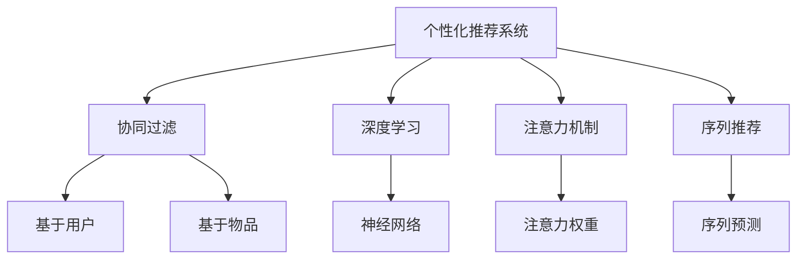

                 

# 注意力经济与个性化推荐算法：为受众提供定制、有针对性的内容

## 1. 背景介绍

### 1.1 问题由来

在互联网时代，信息爆炸使得我们每个人都面临着“信息过载”的困境。如何从海量信息中快速筛选出对自己有用的内容，成为每个用户必须面对的挑战。个性化推荐系统便应运而生，它通过分析用户的兴趣和行为，推荐符合用户偏好的内容，有效缓解了信息过载问题，极大提升了用户的体验。

随着用户对个性化推荐的需求日益增长，推荐系统逐渐从简单的基于内容的推荐演进到基于协同过滤、深度学习等更复杂的方法。这些方法在处理海量数据、识别用户兴趣、预测行为等方面取得了显著成效，但也面临着推荐精度不够、冷启动问题、推荐多样性不足等挑战。

为了进一步提升个性化推荐的效果，本文将深入探讨“注意力经济”的概念，并介绍基于“注意力”的个性化推荐算法。通过将用户的注意力分配到推荐对象上，算法能更准确地捕捉用户对不同内容的关注度，从而提供更加定制、有针对性的内容推荐。

### 1.2 问题核心关键点

个性化推荐的核心在于精准捕捉用户的兴趣和需求，并在合适的时间、地点以合适的形式将内容推荐给用户。本文将聚焦于“注意力经济”与个性化推荐算法，通过具体案例和算法步骤详解，带读者深入理解这一热门话题。

## 2. 核心概念与联系

### 2.1 核心概念概述

为更好地理解基于“注意力”的个性化推荐算法，本节将介绍几个核心概念：

- 个性化推荐系统：根据用户的历史行为和兴趣偏好，推荐符合其需求的内容的系统。
- 协同过滤(Collaborative Filtering)：通过分析用户的历史行为，预测用户可能感兴趣的物品，包括基于用户的协同过滤和基于物品的协同过滤。
- 深度学习：基于神经网络的推荐方法，通过学习用户与物品之间的复杂关系，提升推荐效果。
- 注意力机制(Attention Mechanism)：一种机制，通过动态分配注意力权重，选择性地关注输入中最重要的部分，常用于处理序列数据。
- 序列推荐：根据用户的历史行为，预测用户接下来可能感兴趣的内容。

这些概念之间的逻辑关系可以通过以下Mermaid流程图来展示：



这个流程图展示了个性化推荐系统的核心概念及其之间的关系：

1. 个性化推荐系统通过协同过滤、深度学习和注意力机制等多种方法，捕捉用户兴趣。
2. 协同过滤从用户行为中挖掘出潜在兴趣，深度学习通过模型学习用户与物品之间的关系，注意力机制用于关注重要信息。
3. 序列推荐根据历史行为预测用户未来的兴趣。

这些概念共同构成了个性化推荐系统的基本框架，为其提供理论支撑和实现手段。通过理解这些核心概念，我们可以更好地把握推荐算法的本质和优化方向。

## 3. 核心算法原理 & 具体操作步骤
### 3.1 算法原理概述

基于“注意力”的个性化推荐算法，通过动态调整注意力权重，将用户的注意力分配到不同的推荐对象上。其核心思想是：根据用户的行为和兴趣，计算每个推荐对象对用户的注意力权重，最终通过加权和的方式得到推荐结果。

形式化地，假设用户的历史行为向量为 $h$，物品的特征向量为 $x$，推荐模型为 $M$，则推荐算法可以表示为：

$$
r_i = M(h, x_i) \times \text{Attention}(h, x_i)
$$

其中，$r_i$ 表示物品 $i$ 对用户的推荐分数，$M(h, x_i)$ 表示模型对物品的预测分数，$\text{Attention}(h, x_i)$ 表示物品对用户的注意力权重。

在实际应用中，通常使用softmax函数对注意力权重进行归一化处理，计算方式为：

$$
\alpha_i = \frac{\exp(g(h, x_i))}{\sum_{j=1}^{n} \exp(g(h, x_j))}
$$

其中，$g(h, x_i)$ 为注意力计算函数，通常使用点积、加法等方式进行计算。

### 3.2 算法步骤详解

基于“注意力”的个性化推荐算法一般包括以下几个关键步骤：

**Step 1: 准备用户行为数据**
- 收集用户的历史行为数据，如浏览记录、点击历史、评分等，构建用户行为矩阵 $H$。

**Step 2: 特征提取与编码**
- 对物品特征进行编码，得到特征向量 $x$，可以是简单的数值特征，也可以是深度学习模型提取的抽象特征。
- 对用户行为进行编码，得到行为向量 $h$，可以使用协同过滤、深度学习等方法提取用户兴趣。

**Step 3: 计算注意力权重**
- 使用注意力计算函数 $g(h, x)$，计算物品对用户的注意力权重 $\alpha$。

**Step 4: 计算推荐分数**
- 根据注意力权重和模型预测分数，计算每个物品的推荐分数 $r_i$。

**Step 5: 排序与推荐**
- 根据推荐分数对物品进行排序，将推荐结果展示给用户。

### 3.3 算法优缺点

基于“注意力”的个性化推荐算法具有以下优点：
1. 动态性：通过动态调整注意力权重，算法能够根据用户的行为和兴趣实时更新推荐结果。
2. 灵活性：适用于多种推荐场景，如文本推荐、图片推荐等，只需修改注意力计算函数即可。
3. 鲁棒性：能够处理稀疏用户行为数据，具有较好的泛化能力。
4. 可解释性：通过注意力权重，可以直观地解释每个物品对用户的贡献度，便于调优和理解。

同时，该方法也存在一些局限性：
1. 计算复杂度高：注意力计算函数的复杂度较高，特别是在高维特征空间中。
2. 对数据质量敏感：注意力权重依赖于用户行为数据的准确性，噪声数据会对推荐结果产生干扰。
3. 冷启动问题：新用户没有历史行为数据时，无法进行准确的推荐。

尽管存在这些局限性，但“注意力”方法仍是大规模个性化推荐系统中不可或缺的一部分。未来相关研究的重点在于如何进一步降低计算复杂度，提高对稀疏数据的鲁棒性，并解决冷启动问题。

### 3.4 算法应用领域

基于“注意力”的个性化推荐算法在多个领域中得到广泛应用，例如：

- 电商推荐：根据用户浏览、购买历史，推荐符合其兴趣的商品。
- 视频推荐：根据用户观看历史，推荐用户可能感兴趣的视频内容。
- 新闻推荐：根据用户阅读历史，推荐相关的新闻文章。
- 社交媒体推荐：根据用户互动历史，推荐可能感兴趣的朋友和内容。
- 游戏推荐：根据用户游戏行为，推荐适合的游戏和道具。

除了这些典型场景外，“注意力”方法也被创新性地应用到更多场景中，如智能广告投放、虚拟试穿、音乐推荐等，为个性化推荐系统带来了新的突破。随着“注意力”技术的不断发展，相信个性化推荐系统将在更多领域中发挥更大的作用。

## 4. 数学模型和公式 & 详细讲解 & 举例说明

### 4.1 数学模型构建

本节将使用数学语言对基于“注意力”的个性化推荐算法进行更加严格的刻画。

假设用户的历史行为向量为 $h$，物品的特征向量为 $x$，推荐模型为 $M$。设 $M(h, x)$ 为模型对物品的预测分数，通常使用深度学习模型进行计算。设 $\alpha_i$ 为物品 $i$ 对用户的注意力权重，根据softmax函数计算：

$$
\alpha_i = \frac{\exp(g(h, x_i))}{\sum_{j=1}^{n} \exp(g(h, x_j))}
$$

其中 $g(h, x_i)$ 为注意力计算函数，可以使用点积、加法、注意力机制等方法进行计算。最终，每个物品的推荐分数 $r_i$ 可以表示为：

$$
r_i = M(h, x_i) \times \alpha_i
$$

### 4.2 公式推导过程

以下我们以点积注意力函数为例，推导计算注意力权重的公式。

设 $h$ 为 $d$ 维的用户行为向量，$x_i$ 为 $d$ 维的物品特征向量，点积注意力函数计算方式为：

$$
g(h, x_i) = h^\top x_i
$$

因此，物品 $i$ 对用户的注意力权重 $\alpha_i$ 可以表示为：

$$
\alpha_i = \frac{\exp(h^\top x_i)}{\sum_{j=1}^{n} \exp(h^\top x_j)}
$$

在实际应用中，通常将用户行为向量 $h$ 和物品特征向量 $x$ 分别嵌入到高维空间，通过神经网络模型计算预测分数 $M(h, x)$。设 $M(h, x)$ 为 $d'$ 维的向量，则物品 $i$ 的推荐分数 $r_i$ 可以表示为：

$$
r_i = M(h, x_i) \times \alpha_i
$$

### 4.3 案例分析与讲解

假设某电商网站有 $N$ 个商品，用户 $u$ 浏览了其中的 $K$ 个商品。每个商品的特征向量为 $x_i \in \mathbb{R}^d$，用户浏览历史表示为行为向量 $h \in \mathbb{R}^d$。

**案例1：点积注意力计算**
- 物品 $i$ 对用户的注意力权重 $\alpha_i$ 可以通过点积注意力函数计算，具体公式为：
  $$
  \alpha_i = \frac{\exp(h^\top x_i)}{\sum_{j=1}^{K} \exp(h^\top x_j)}
  $$
- 物品 $i$ 的推荐分数 $r_i$ 为：
  $$
  r_i = M(h, x_i) \times \alpha_i
  $$
- 根据推荐分数对商品进行排序，将推荐结果展示给用户。

**案例2：加法注意力计算**
- 物品 $i$ 对用户的注意力权重 $\alpha_i$ 可以通过加法注意力函数计算，具体公式为：
  $$
  \alpha_i = \exp(g(h, x_i)) / \sum_{j=1}^{K} \exp(g(h, x_j))
  $$
- 物品 $i$ 的推荐分数 $r_i$ 为：
  $$
  r_i = M(h, x_i) \times \alpha_i
  $$
- 根据推荐分数对商品进行排序，将推荐结果展示给用户。

通过这些具体案例，可以更好地理解基于“注意力”的个性化推荐算法的计算过程和实现细节。

## 5. 项目实践：代码实例和详细解释说明
### 5.1 开发环境搭建

在进行个性化推荐算法实践前，我们需要准备好开发环境。以下是使用Python进行TensorFlow和Keras开发的环境配置流程：

1. 安装Anaconda：从官网下载并安装Anaconda，用于创建独立的Python环境。

2. 创建并激活虚拟环境：
```bash
conda create -n tf-env python=3.8 
conda activate tf-env
```

3. 安装TensorFlow和Keras：
```bash
pip install tensorflow==2.4.1 keras==2.4.3
```

4. 安装各类工具包：
```bash
pip install numpy pandas scikit-learn matplotlib tqdm jupyter notebook ipython
```

完成上述步骤后，即可在`tf-env`环境中开始推荐算法实践。

### 5.2 源代码详细实现

下面我们以电商推荐为例，给出使用TensorFlow和Keras对基于“注意力”的个性化推荐模型进行训练和测试的代码实现。

首先，定义模型和损失函数：

```python
import tensorflow as tf
from tensorflow.keras.layers import Input, Dense, Embedding, Dot, Add
from tensorflow.keras.models import Model

# 定义模型输入
user_input = Input(shape=(num_users, ), name='user_input')
item_input = Input(shape=(num_items, ), name='item_input')

# 定义用户行为和物品特征的嵌入层
user_embed = Embedding(num_users, embed_size, name='user_embed')(user_input)
item_embed = Embedding(num_items, embed_size, name='item_embed')(item_input)

# 计算点积注意力权重
attention_weight = Dot(axes=[2, 1])([user_embed, item_embed])
attention_weight = tf.keras.layers.Lambda(tf.nn.softmax)(attention_weight)

# 计算预测分数
pred_score = Add()([user_embed, item_embed])

# 定义模型输出
output = Dot(axes=[1, 2])([pred_score, attention_weight])

# 定义模型
model = Model(inputs=[user_input, item_input], outputs=output)

# 定义损失函数和优化器
model.compile(optimizer='adam', loss='mse')
```

然后，进行模型训练和测试：

```python
# 准备训练数据
train_data = ...
valid_data = ...
test_data = ...

# 训练模型
model.fit(x=[train_data['user'], train_data['item']], y=train_data['label'], epochs=num_epochs, batch_size=batch_size, validation_data=(valid_data['user'], valid_data['item'], valid_data['label']))

# 测试模型
test_loss, test_pred = model.evaluate(x=[test_data['user'], test_data['item']], y=test_data['label'])
```

以上就是使用TensorFlow和Keras对基于“注意力”的个性化推荐模型进行训练和测试的完整代码实现。可以看到，利用Keras的高级API，构建和训练模型变得十分便捷。

### 5.3 代码解读与分析

让我们再详细解读一下关键代码的实现细节：

**定义模型输入**：
- `user_input` 和 `item_input` 分别表示用户行为和物品特征的输入，形状分别为 `(num_users,)` 和 `(num_items,)`。

**用户行为和物品特征的嵌入层**：
- `Embedding` 层将用户行为和物品特征映射到高维空间，得到 `user_embed` 和 `item_embed`，形状分别为 `(num_users, embed_size)` 和 `(num_items, embed_size)`。

**计算点积注意力权重**：
- `Dot` 层计算用户行为和物品特征的点积，得到 `attention_weight`。
- `softmax` 函数对点积结果进行归一化，得到物品对用户的注意力权重，形状为 `(num_items,)`。

**计算预测分数**：
- `Add` 层将用户行为和物品特征相加，得到 `pred_score`。

**定义模型输出**：
- `Dot` 层计算 `pred_score` 和 `attention_weight` 的点积，得到推荐分数 `output`。

**模型编译和训练**：
- `compile` 方法定义模型的损失函数和优化器，`mse` 表示均方误差损失。
- `fit` 方法进行模型训练，`num_epochs` 表示训练轮数，`batch_size` 表示批次大小。

**模型测试**：
- `evaluate` 方法进行模型测试，`test_loss` 表示测试集的均方误差，`test_pred` 表示模型对测试集的预测结果。

通过这些关键代码的解释，可以更好地理解基于“注意力”的个性化推荐模型的实现流程和主要功能。

## 6. 实际应用场景
### 6.1 电商推荐系统

基于“注意力”的个性化推荐算法在电商推荐系统中的应用非常广泛。电商推荐系统通过分析用户的历史浏览、点击、购买行为，推荐符合用户偏好的商品。推荐效果直接影响电商平台的销售转化率和用户满意度。

在技术实现上，电商推荐系统通常将用户的浏览记录、点击历史等行为数据作为输入，将商品的特征向量作为特征，通过“注意力”算法计算物品对用户的推荐分数，并根据分数进行排序，最终推荐给用户。电商推荐系统还应用了A/B测试等技术，不断优化推荐算法，提升推荐效果。

### 6.2 视频推荐系统

视频推荐系统根据用户的历史观看记录和评分，推荐用户可能感兴趣的视频内容。推荐算法能够动态调整注意力权重，关注用户对不同视频的关注度，从而提供更加个性化、多样化的视频推荐。

在技术实现上，视频推荐系统通常将用户的历史观看记录和评分作为输入，将视频特征向量作为特征，通过“注意力”算法计算每个视频的推荐分数，并根据分数进行排序，最终推荐给用户。视频推荐系统还应用了协同过滤、深度学习等技术，进一步提升推荐效果。

### 6.3 社交媒体推荐系统

社交媒体推荐系统根据用户的历史互动数据，推荐可能感兴趣的朋友和内容。推荐算法能够动态调整注意力权重，关注用户对不同内容、不同朋友的关注度，从而提供更加个性化、多样化的推荐。

在技术实现上，社交媒体推荐系统通常将用户的历史互动数据作为输入，将朋友和内容的特征向量作为特征，通过“注意力”算法计算每个朋友和内容的推荐分数，并根据分数进行排序，最终推荐给用户。社交媒体推荐系统还应用了用户兴趣挖掘、内容分类等技术，进一步提升推荐效果。

### 6.4 未来应用展望

随着“注意力”技术的发展，基于“注意力”的个性化推荐系统将在更多领域中得到应用，为各行各业带来新的发展机遇。

在智慧医疗领域，推荐系统可以推荐符合患者疾病特征的药物、治疗方案等，提升诊疗效率和效果。在金融领域，推荐系统可以推荐符合用户风险偏好的金融产品，提升用户体验和收益。在教育领域，推荐系统可以推荐适合用户学习风格的教育资源，提升学习效果和效率。

未来，“注意力”技术将进一步提升推荐系统的精度、多样性和鲁棒性，为各行各业提供更加智能化、个性化的服务。

## 7. 工具和资源推荐
### 7.1 学习资源推荐

为了帮助开发者系统掌握“注意力”推荐算法的理论基础和实践技巧，这里推荐一些优质的学习资源：

1. 《深度学习入门》系列博文：由知名AI学者撰写，深入浅出地介绍了深度学习基础和常见算法。
2. CS231n《卷积神经网络》课程：斯坦福大学开设的计算机视觉明星课程，有Lecture视频和配套作业，带你入门深度学习领域。
3. 《自然语言处理入门》书籍：详细介绍了NLP基础和深度学习在NLP中的应用，是NLP技术学习的入门级读物。
4. Kaggle数据科学竞赛平台：提供大量真实世界的数据集和竞赛题目，是实践和提高推荐算法技能的好地方。

通过这些资源的学习实践，相信你一定能够快速掌握“注意力”推荐算法的精髓，并用于解决实际的个性化推荐问题。

### 7.2 开发工具推荐

高效的开发离不开优秀的工具支持。以下是几款用于个性化推荐算法开发的常用工具：

1. TensorFlow：由Google主导开发的开源深度学习框架，生产部署方便，适合大规模工程应用。
2. PyTorch：基于Python的开源深度学习框架，灵活动态的计算图，适合快速迭代研究。
3. Keras：高层次的深度学习API，简单易用，适合快速原型设计和实验。
4. Weights & Biases：模型训练的实验跟踪工具，可以记录和可视化模型训练过程中的各项指标，方便对比和调优。
5. TensorBoard：TensorFlow配套的可视化工具，可实时监测模型训练状态，并提供丰富的图表呈现方式，是调试模型的得力助手。

合理利用这些工具，可以显著提升个性化推荐算法的开发效率，加快创新迭代的步伐。

### 7.3 相关论文推荐

“注意力”推荐技术的发展源于学界的持续研究。以下是几篇奠基性的相关论文，推荐阅读：

1. Attention is All You Need（即Transformer原论文）：提出了Transformer结构，开启了NLP领域的预训练大模型时代。
2. Seq2Seq with Attention Mechanism：提出了Seq2Seq模型结合注意力机制的框架，解决了传统Seq2Seq模型在长序列上的问题。
3. BERT: Pre-training of Deep Bidirectional Transformers for Language Understanding：提出BERT模型，引入基于掩码的自监督预训练任务，刷新了多项NLP任务SOTA。
4. Transformer-XL: Attentive Language Models Beyond a Fixed-Length Context：提出Transformer-XL模型，解决了长序列建模问题，提升了模型的记忆能力。

这些论文代表了大规模个性化推荐系统的发展脉络。通过学习这些前沿成果，可以帮助研究者把握推荐算法的未来方向，激发更多的创新灵感。

## 8. 总结：未来发展趋势与挑战
### 8.1 总结

本文对基于“注意力”的个性化推荐算法进行了全面系统的介绍。首先阐述了“注意力经济”的概念及其在推荐系统中的应用，明确了“注意力”方法在提升个性化推荐效果方面的独特价值。其次，从原理到实践，详细讲解了“注意力”算法的数学模型和计算步骤，给出了具体实现代码和解释。同时，本文还探讨了“注意力”方法在电商、视频、社交媒体等多个领域的应用前景，展示了其在实际应用中的强大潜力。

通过本文的系统梳理，可以看到，基于“注意力”的个性化推荐算法已经成为了推荐系统的重要组成部分，显著提升了推荐系统的精度、多样性和个性化程度。未来，随着技术的不断发展，“注意力”方法还将继续进化，为推荐系统带来更多的突破和创新。

### 8.2 未来发展趋势

展望未来，基于“注意力”的个性化推荐系统将呈现以下几个发展趋势：

1. 多模态推荐：将用户的多模态数据（如文本、图片、视频）与个性化推荐算法结合，提供更加全面、准确的推荐结果。
2. 自适应推荐：根据用户反馈和行为变化，动态调整推荐策略和模型参数，提升推荐系统的自适应能力。
3. 跨领域推荐：将推荐系统应用于不同领域（如电商、医疗、金融等），通过领域之间的知识迁移，提升推荐效果。
4. 联合优化：结合内容优化和用户优化，实现多目标优化，提升推荐效果和用户满意度。
5. 边缘计算推荐：在边缘设备上部署推荐模型，减少数据传输和计算延迟，提升推荐响应速度。

以上趋势凸显了基于“注意力”的个性化推荐算法的广阔前景。这些方向的探索发展，必将进一步提升推荐系统的性能和应用范围，为各行各业带来更多的价值。

### 8.3 面临的挑战

尽管基于“注意力”的个性化推荐技术已经取得了瞩目成就，但在迈向更加智能化、普适化应用的过程中，它仍面临着诸多挑战：

1. 数据质量问题：用户行为数据的质量直接影响到推荐效果，数据不完整、不一致等问题需进一步解决。
2. 计算复杂度：“注意力”计算函数通常计算复杂度高，如何优化算法，提高计算效率，是一个重要课题。
3. 冷启动问题：新用户没有历史行为数据时，如何通过其他数据进行推荐，是一个亟待解决的问题。
4. 隐私保护：推荐算法涉及用户行为数据，如何在保护用户隐私的同时，提供个性化推荐，是一个重要的伦理问题。
5. 鲁棒性问题：推荐算法面临噪声数据、对抗样本等干扰，如何提升算法的鲁棒性，是一个重要的研究方向。

尽管存在这些挑战，但“注意力”推荐技术的发展潜力巨大，需要在各个方面进行深入探索和创新，方能克服挑战，迈向新的高度。

### 8.4 研究展望

面对“注意力”推荐算法面临的种种挑战，未来的研究需要在以下几个方面寻求新的突破：

1. 数据增强：通过数据增强技术，生成高质量的用户行为数据，提升推荐算法的泛化能力。
2. 模型压缩：通过模型压缩技术，减少推荐模型的计算量和存储需求，提升推荐算法的效率和可部署性。
3. 跨领域迁移学习：通过跨领域迁移学习，将不同领域的推荐算法结合，提升推荐算法的通用性和可迁移性。
4. 隐私保护：通过隐私保护技术，如差分隐私、联邦学习等，在保护用户隐私的同时，提供个性化推荐。
5. 鲁棒性增强：通过鲁棒性增强技术，如对抗训练、噪声鲁棒性等，提升推荐算法的鲁棒性和稳定性。

这些研究方向的探索，必将引领基于“注意力”的个性化推荐算法迈向更高的台阶，为构建智能、高效、公平、安全的推荐系统提供新的方法。面向未来，推荐算法还需要与其他人工智能技术进行更深入的融合，如知识图谱、因果推理、强化学习等，多路径协同发力，共同推动推荐系统的进步。只有勇于创新、敢于突破，才能不断拓展推荐算法的边界，让推荐系统更好地服务于用户，推动智能时代的到来。

## 9. 附录：常见问题与解答

**Q1：基于“注意力”的个性化推荐算法是否可以用于处理冷启动问题？**

A: 基于“注意力”的个性化推荐算法本身并不能直接解决冷启动问题，但可以通过引入外部知识、多模态数据等方式，提升算法对新用户的推荐效果。例如，结合用户画像、社交关系等外部信息，或者使用基于内容的推荐算法作为冷启动阶段的补充，都可以提高推荐算法的鲁棒性和泛化能力。

**Q2：在实际应用中，如何判断推荐算法的推荐效果？**

A: 判断推荐算法的效果可以从多个维度进行评估，包括但不限于：
1. 点击率（Click-Through Rate, CTR）：用户点击推荐内容的概率，用于评估推荐的相关性和吸引力。
2. 转化率（Conversion Rate, CR）：用户完成某一特定行为（如购买、注册等）的概率，用于评估推荐的实际效果。
3. 用户满意度：通过用户调查、反馈等方式评估用户对推荐结果的满意度。
4. A/B测试：通过对比不同推荐策略的效果，找到最优推荐方法。

在实际应用中，通常会综合考虑以上指标，全面评估推荐算法的效果。

**Q3：如何优化基于“注意力”的推荐算法的计算效率？**

A: 基于“注意力”的推荐算法的计算复杂度较高，可以通过以下方式进行优化：
1. 预计算注意力权重：在推荐前预先计算注意力权重，减少每次推荐时的计算量。
2. 模型剪枝：通过剪枝技术，减少模型参数量，提升推理速度。
3. 并行计算：利用GPU/TPU等并行计算设备，提高计算效率。
4. 低秩矩阵分解：将高维矩阵分解为低秩矩阵，减少计算复杂度。

通过这些优化方法，可以显著提升基于“注意力”的推荐算法的计算效率，满足大规模应用的需求。

通过本文的系统梳理，可以看到，基于“注意力”的个性化推荐算法在推荐系统中的应用前景广阔，其动态性和灵活性为推荐算法带来了新的发展空间。尽管存在一些挑战，但通过不断的技术创新和应用实践，相信“注意力”方法将进一步提升推荐系统的性能和应用范围，为各行各业带来更多的价值。

---

作者：禅与计算机程序设计艺术 / Zen and the Art of Computer Programming

