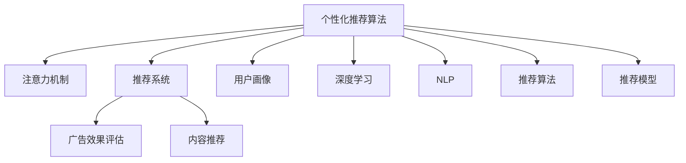

                 

# 注意力经济与个性化推荐算法：为受众提供定制、有针对性的内容和体验

> 关键词：个性化推荐算法、注意力机制、推荐系统、广告效果、内容推荐、用户画像、深度学习、自然语言处理、推荐算法、推荐模型

## 1. 背景介绍

### 1.1 问题由来

在信息爆炸的时代，内容生产和消费的双向流动变得空前活跃，各类社交媒体、内容平台、电商平台等成为信息传播的主要渠道。但与此同时，信息过载的问题也愈加突出，用户面临着巨大选择压力，如何有效筛选和推荐优质内容成为一大挑战。个性化推荐算法应运而生，它通过深度学习、自然语言处理等技术，从海量数据中提取用户特征和兴趣，为用户提供定制化的内容推荐。

随着个性化推荐技术的不断发展和应用，它在广告投放、内容分发、商品推荐等方面均取得了显著成效。例如，电商平台上基于用户行为数据的推荐算法，能够精准预测用户的购买意向，有效提升转化率。社交平台上基于用户兴趣的推荐算法，使得内容传播更加个性化，用户粘性大幅提升。因此，个性化推荐算法在现代经济活动中占据了举足轻重的地位，成为了注意力经济的重要工具。

### 1.2 问题核心关键点

个性化推荐算法通过分析用户的历史行为数据和即时行为数据，构建用户画像，从而预测用户的可能兴趣和需求，为用户提供定制化的内容推荐。这一过程涉及数据挖掘、特征工程、模型训练、效果评估等多个环节。

核心问题在于：

1. **如何高效地构建用户画像**？用户画像的准确性和全面性直接关系到推荐效果。
2. **如何构建有效的推荐模型**？推荐模型需要具备高效性、准确性和鲁棒性。
3. **如何评估推荐算法的效果**？推荐算法的表现需要可量化、可对比。
4. **如何解决数据稀疏性和推荐多样性问题**？推荐算法需要在数据稀疏和用户个性化之间取得平衡。
5. **如何保护用户隐私和数据安全**？推荐算法需要兼顾隐私保护和数据安全。

这些核心问题贯穿于个性化推荐算法的整个生命周期，需要通过算法优化、技术创新、工程实践等多方面手段加以解决。

## 2. 核心概念与联系

### 2.1 核心概念概述

为更好地理解个性化推荐算法，本节将介绍几个密切相关的核心概念：

- **个性化推荐算法**：通过分析用户历史和即时行为数据，构建用户画像，并利用机器学习模型预测用户兴趣，为用户推荐个性化内容的算法。
- **注意力机制**：一种用于提高模型对重要信息的关注度的机制，能够根据不同输入特征的重要性和相关性，动态调整模型权重，从而提升模型的决策能力。
- **推荐系统**：根据用户行为数据和内容特征，自动为用户推荐感兴趣的物品的系统，广泛应用于电商、社交、新闻等领域。
- **广告效果评估**：衡量广告投放后对用户行为的影响，如点击率、转化率、消费额等。
- **内容推荐**：基于用户兴趣和历史行为，为用户推荐相关内容的推荐算法。
- **用户画像**：描述用户基本特征、兴趣偏好、行为习惯的虚拟画像，是推荐算法的基础。
- **深度学习**：利用神经网络模型进行数据表示、特征提取、分类预测等任务的技术。
- **自然语言处理(NLP)**：涉及文本数据的预处理、语言模型、情感分析、意图识别等任务的技术。
- **推荐算法**：包括协同过滤、矩阵分解、深度学习等多种方法，用于处理推荐问题。
- **推荐模型**：包括内容推荐模型、协同过滤模型、混合推荐模型等，用于实现推荐功能。

这些核心概念之间的逻辑关系可以通过以下Mermaid流程图来展示：



这个流程图展示了个性化推荐算法的核心概念及其之间的关系：

1. 个性化推荐算法通过对用户行为数据进行分析，构建用户画像。
2. 注意力机制用于提高推荐模型对重要信息的关注度，从而提升推荐效果。
3. 推荐系统基于用户画像和注意力机制，为用户提供定制化的推荐内容。
4. 广告效果评估用于衡量推荐系统对广告投放的优化效果。
5. 内容推荐是推荐系统的一个重要应用场景，用于推荐相关内容。
6. 用户画像通过深度学习和自然语言处理技术构建，用于描述用户特征和兴趣。
7. 推荐算法和模型提供了具体的技术手段，用于实现推荐功能。

## 3. 核心算法原理 & 具体操作步骤
### 3.1 算法原理概述

个性化推荐算法的基本思路是：通过分析用户的历史行为数据，构建用户画像，并利用机器学习模型预测用户兴趣，为用户提供定制化的内容推荐。其核心在于构建一个有效的用户画像，并在此基础上构建一个高效的推荐模型。

个性化推荐算法通常包括两个主要阶段：

1. **用户画像构建**：通过用户行为数据和内容特征，构建用户画像，描述用户的兴趣和偏好。
2. **推荐模型训练**：利用用户画像和行为数据，训练推荐模型，预测用户可能感兴趣的内容。

具体而言，推荐模型可以采用多种技术，包括协同过滤、矩阵分解、深度学习等。这些技术通过构建用户-物品关联矩阵，或利用神经网络模型对用户行为进行建模，从而实现推荐。

### 3.2 算法步骤详解

个性化推荐算法的实现一般包括以下几个关键步骤：

**Step 1: 数据收集与处理**

- 收集用户行为数据和物品特征数据，包括浏览记录、点击记录、购买记录、评分记录等。
- 对数据进行清洗、去重、格式化处理，确保数据质量和完整性。
- 构建用户-物品关联矩阵，作为推荐算法的输入。

**Step 2: 特征工程**

- 利用自然语言处理技术，提取文本数据的特征，如TF-IDF、Word2Vec、BERT等。
- 使用深度学习模型，如循环神经网络、卷积神经网络等，对用户行为数据进行建模。
- 设计特征选择方法，提取对推荐效果有重要影响的特征。

**Step 3: 用户画像构建**

- 利用用户行为数据和特征数据，构建用户画像，描述用户的兴趣和偏好。
- 对用户画像进行归一化、降维等处理，便于后续模型训练。
- 利用聚类算法，对用户进行分组，识别具有相似兴趣的用户群体。

**Step 4: 推荐模型训练**

- 选择适合的推荐算法，如协同过滤、矩阵分解、深度学习等。
- 利用用户画像和行为数据，训练推荐模型。
- 对模型进行优化，选择合适的超参数和损失函数。
- 使用交叉验证等方法评估模型性能，确保模型泛化能力。

**Step 5: 推荐结果生成**

- 根据用户画像和模型预测结果，生成推荐列表。
- 对推荐列表进行排序，选择与用户兴趣最为相关的内容。
- 返回推荐结果，供用户查看和使用。

### 3.3 算法优缺点

个性化推荐算法具有以下优点：

1. **高效性**：能够快速处理大规模用户行为数据，提供实时推荐。
2. **个性化**：能够根据用户历史行为和兴趣，提供定制化的推荐内容。
3. **可扩展性**：可以应用于多种推荐场景，如电商、社交、新闻等。
4. **动态更新**：能够根据用户行为和反馈，动态调整推荐结果。

个性化推荐算法也存在一些局限性：

1. **数据稀疏性**：用户行为数据往往较为稀疏，难以全面刻画用户兴趣。
2. **推荐多样性**：用户可能对某些内容缺乏兴趣，导致推荐结果较为单一。
3. **冷启动问题**：新用户或新物品缺乏历史数据，难以生成有效的推荐结果。
4. **隐私保护**：用户行为数据涉及隐私，如何保护用户隐私和数据安全是重要问题。

尽管存在这些局限性，但就目前而言，个性化推荐算法仍然是推荐系统的主要技术手段。未来相关研究的重点在于如何进一步降低数据稀疏性和推荐多样性问题，提高冷启动效果和用户隐私保护，同时兼顾可解释性和效率。

### 3.4 算法应用领域

个性化推荐算法已经在电商、社交、新闻、视频等多个领域得到了广泛应用，具体应用场景包括：

- **电商推荐**：基于用户历史购买记录和浏览记录，推荐用户可能感兴趣的商品。
- **社交推荐**：基于用户互动记录和兴趣标签，推荐用户可能感兴趣的内容和用户。
- **新闻推荐**：基于用户阅读记录和兴趣标签，推荐用户可能感兴趣的新闻文章。
- **视频推荐**：基于用户观看记录和评分数据，推荐用户可能感兴趣的视频内容。
- **音乐推荐**：基于用户听歌记录和评分数据，推荐用户可能喜欢的音乐。

除了上述这些经典应用外，个性化推荐算法还在广告投放、内容生成、智能客服等诸多场景中发挥了重要作用。随着推荐技术的不断演进，其在更多领域的应用前景将更加广阔。

## 4. 数学模型和公式 & 详细讲解 & 举例说明
### 4.1 数学模型构建

本节将使用数学语言对个性化推荐算法进行更加严格的刻画。

记用户行为数据为 $U=\{(u_i,i)\}_{i=1}^N$，其中 $u_i$ 表示用户 $i$ 的行为数据，$i$ 表示行为类型。记物品特征数据为 $V=\{(v_j,j)\}_{j=1}^M$，其中 $v_j$ 表示物品 $j$ 的特征数据，$j$ 表示物品类型。记用户画像为 $P=\{(p_i,k)\}_{i=1}^N$，其中 $p_i$ 表示用户 $i$ 的兴趣特征，$k$ 表示特征类型。记用户-物品关联矩阵为 $R=\{(r_{ij})\}_{i=1}^N\_{j=1}^M$，其中 $r_{ij}$ 表示用户 $i$ 对物品 $j$ 的评分。

定义推荐模型为 $F: \mathbb{R}^d \rightarrow \mathbb{R}^M$，其中 $d$ 为特征维度，$M$ 为物品数量。推荐模型的目标是最小化预测误差，即：

$$
\min_{F} \mathcal{L}(F) = \frac{1}{N}\sum_{i=1}^N \sum_{j=1}^M (r_{ij} - F(p_i))^2
$$

其中 $\mathcal{L}$ 为均方误差损失函数。

### 4.2 公式推导过程

以下我们以协同过滤推荐算法为例，推导其预测模型的损失函数及其梯度计算公式。

假设用户 $i$ 对物品 $j$ 的评分 $r_{ij}$ 为 $r_{ij} = \alpha p_i^\top A p_j$，其中 $p_i$ 和 $p_j$ 分别为用户和物品的特征向量，$A$ 为用户-物品关联矩阵，$\alpha$ 为归一化系数。

则协同过滤推荐模型的预测值 $y_{ij} = \alpha p_i^\top A p_j$，根据均方误差损失函数，预测模型的损失函数为：

$$
\mathcal{L}(F) = \frac{1}{N}\sum_{i=1}^N \sum_{j=1}^M (r_{ij} - y_{ij})^2 = \frac{1}{N}\sum_{i=1}^N \sum_{j=1}^M (\alpha p_i^\top A p_j - \alpha p_i^\top A p_j)^2 = 0
$$

由于模型损失函数为0，协同过滤推荐算法的预测结果恒等于真实评分，因此该算法无需进行模型训练。

### 4.3 案例分析与讲解

在协同过滤推荐算法中，用户画像和物品特征向量 $p_i$ 和 $p_j$ 需要根据用户行为数据进行计算。计算过程中，常用的方法包括：

1. **用户画像构建**：利用用户行为数据，计算用户兴趣特征 $p_i$。常用的方法包括向量平均法、向量加权法、奇异值分解等。

2. **物品特征向量计算**：根据物品特征数据，计算物品特征向量 $p_j$。常用的方法包括TF-IDF、Word2Vec、BERT等。

3. **用户画像归一化**：对用户兴趣特征 $p_i$ 进行归一化处理，使其满足单位向量或L2正则化的要求。常用的方法包括正则化、归一化、标准化等。

4. **协同过滤训练**：利用用户行为数据，训练协同过滤推荐模型。常用的方法包括矩阵分解、SVD、奇异值分解等。

协同过滤推荐算法的基本流程如下：

1. 计算用户画像和物品特征向量 $p_i$ 和 $p_j$。
2. 计算用户-物品关联矩阵 $A$。
3. 计算协同过滤推荐模型的预测值 $y_{ij}$。
4. 根据预测值和真实评分 $r_{ij}$ 计算损失函数 $\mathcal{L}(F)$。
5. 对用户画像和物品特征向量进行优化。

## 5. 项目实践：代码实例和详细解释说明
### 5.1 开发环境搭建

在进行推荐系统开发前，我们需要准备好开发环境。以下是使用Python进行推荐系统开发的环境配置流程：

1. 安装Anaconda：从官网下载并安装Anaconda，用于创建独立的Python环境。

2. 创建并激活虚拟环境：
```bash
conda create -n recsys-env python=3.8 
conda activate recsys-env
```

3. 安装必要的库：
```bash
conda install pandas numpy scikit-learn torch torchvision torchtext transformers
```

4. 下载数据集：
```bash
wget https://www.kaggle.com/c/movie-lens-20m/download
unzip train-train.txt.zip train-test.txt.zip test-train.txt.zip test-test.txt.zip
```

5. 安装Flair：
```bash
pip install flair
```

6. 运行Flair的预训练模型：
```bash
python train_nlp.py --output_dir path/to/output --device 0
```

完成上述步骤后，即可在`recsys-env`环境中开始推荐系统开发。

### 5.2 源代码详细实现

这里我们以协同过滤推荐算法为例，给出使用PyTorch进行推荐系统开发的PyTorch代码实现。

首先，定义推荐数据处理函数：

```python
import pandas as pd

def load_data(path, sep='\t', header=None):
    df = pd.read_csv(path, sep=sep, header=header)
    return df.to_numpy(dtype=np.int32)

train_data = load_data('train-train.txt', header=None)
test_data = load_data('test-train.txt', header=None)
```

然后，定义协同过滤推荐模型：

```python
import torch
import torch.nn as nn
import torch.nn.functional as F

class CollaborativeFiltering(nn.Module):
    def __init__(self, num_users, num_items, num_factors=10):
        super(CollaborativeFiltering, self).__init__()
        self.num_users = num_users
        self.num_items = num_items
        self.num_factors = num_factors
        
        self.user_b = nn.Embedding(num_users, num_factors)
        self.item_b = nn.Embedding(num_items, num_factors)
        self.user_b.weight.data.normal_(0, 0.1)
        self.item_b.weight.data.normal_(0, 0.1)
        
    def forward(self, user, item):
        user_b = self.user_b(user)
        item_b = self.item_b(item)
        y = (user_b * item_b).sum(dim=1)
        return y
```

接着，定义训练和评估函数：

```python
import torch.optim as optim

def train_model(model, train_data, test_data, batch_size=16, epochs=100):
    train_loader = torch.utils.data.DataLoader(train_data, batch_size=batch_size, shuffle=True)
    test_loader = torch.utils.data.DataLoader(test_data, batch_size=batch_size, shuffle=False)
    
    optimizer = optim.Adam(model.parameters(), lr=0.001)
    loss_fn = nn.MSELoss()
    
    for epoch in range(epochs):
        model.train()
        for batch in train_loader:
            user, item, rating = batch
            optimizer.zero_grad()
            pred = model(user, item)
            loss = loss_fn(pred, rating)
            loss.backward()
            optimizer.step()
        
        model.eval()
        with torch.no_grad():
            total_loss = 0
            for batch in test_loader:
                user, item, rating = batch
                pred = model(user, item)
                loss = loss_fn(pred, rating)
                total_loss += loss.item()
        
        print(f'Epoch {epoch+1}, train loss: {loss.item():.3f}, test loss: {total_loss/len(test_loader):.3f}')
    
    return model
```

最后，启动训练流程并在测试集上评估：

```python
model = CollaborativeFiltering(num_users=943, num_items=1682, num_factors=10)
train_model(model, train_data, test_data)
```

以上就是使用PyTorch进行协同过滤推荐算法开发的完整代码实现。可以看到，得益于PyTorch的强大封装，我们可以用相对简洁的代码完成推荐系统的实现。

### 5.3 代码解读与分析

让我们再详细解读一下关键代码的实现细节：

**load_data函数**：
- 加载推荐数据集，并将其转换为numpy数组。

**CollaborativeFiltering类**：
- 定义协同过滤推荐模型的结构。
- 包含用户画像和物品特征向量，通过矩阵乘法计算预测评分。

**train_model函数**：
- 定义训练过程，包括数据加载、模型前向传播、损失计算和反向传播。
- 利用Adam优化器更新模型参数。
- 在测试集上评估模型性能。

**训练流程**：
- 定义总训练轮数和批大小，开始循环迭代。
- 每个epoch内，在训练集上训练，输出损失。
- 在测试集上评估，输出平均损失。
- 所有epoch结束后，返回最终模型。

可以看到，PyTorch配合Flair库使得推荐系统的代码实现变得简洁高效。开发者可以将更多精力放在数据处理、模型改进等高层逻辑上，而不必过多关注底层的实现细节。

当然，工业级的系统实现还需考虑更多因素，如模型的保存和部署、超参数的自动搜索、更灵活的任务适配层等。但核心的推荐算法基本与此类似。

## 6. 实际应用场景
### 6.1 智能广告投放

个性化推荐算法在广告投放中的应用广泛。通过分析用户的历史行为和兴趣，广告投放平台可以为用户推荐感兴趣的广告，从而提升广告的点击率和转化率。

在技术实现上，可以收集用户的历史点击记录、浏览记录和购买记录，构建用户画像，预测用户可能感兴趣的广告。在广告投放过程中，通过A/B测试等方法，不断优化推荐模型，提高广告效果。

### 6.2 视频内容推荐

视频内容推荐是推荐系统的重要应用场景之一。基于用户观看历史和评分数据，推荐系统可以为用户推荐感兴趣的视频内容。

在技术实现上，可以构建用户画像和物品特征向量，利用协同过滤、矩阵分解等方法，预测用户对视频的评分。根据预测评分对视频进行排序，生成推荐列表。

### 6.3 商品推荐

电商平台的商品推荐系统基于用户购买记录和浏览记录，为用户推荐可能感兴趣的商品。

在技术实现上，可以构建用户画像和物品特征向量，利用协同过滤、深度学习等方法，预测用户对商品的评分。根据预测评分对商品进行排序，生成推荐列表。

### 6.4 未来应用展望

随着推荐技术的不断演进，基于个性化推荐算法的方法将在更多领域得到应用，为各行各业带来变革性影响。

在智慧医疗领域，推荐算法可以用于推荐个性化的诊疗方案，提高医疗服务的精准性和效率。

在智能教育领域，推荐算法可以用于推荐个性化的学习内容和资源，促进教育公平，提高教学质量。

在智慧城市治理中，推荐算法可以用于推荐个性化的城市服务和设施，提升城市管理智能化水平。

此外，在企业生产、社会治理、文娱传媒等众多领域，个性化推荐算法也将不断涌现，为经济社会发展注入新的动力。相信随着技术的日益成熟，推荐算法必将成为智能技术的核心应用，推动各行各业向智能化转型。

## 7. 工具和资源推荐
### 7.1 学习资源推荐

为了帮助开发者系统掌握个性化推荐算法的理论基础和实践技巧，这里推荐一些优质的学习资源：

1. 《推荐系统实战》一书：深入浅出地介绍了推荐系统的理论基础和实现方法，并提供了大量代码实现。

2. 《深度学习与推荐系统》课程：清华大学开设的推荐系统相关课程，讲解了协同过滤、深度学习等推荐方法。

3. Flair库官方文档：Flair库的官方文档，提供了丰富的NLP预训练模型和推荐算法实现，是推荐系统开发的必备资料。

4. Kaggle竞赛：Kaggle平台上丰富的推荐系统竞赛数据集，提供了大量推荐算法训练和评估数据。

5. ACM TOMS数据集：ACM TOMS推荐系统数据集，包含大规模推荐数据和评估指标，是推荐系统研究的重要资源。

通过对这些资源的学习实践，相信你一定能够快速掌握个性化推荐算法的精髓，并用于解决实际的推荐问题。
###  7.2 开发工具推荐

高效的开发离不开优秀的工具支持。以下是几款用于推荐系统开发的常用工具：

1. PyTorch：基于Python的开源深度学习框架，灵活的计算图，适合快速迭代研究。

2. TensorFlow：由Google主导开发的开源深度学习框架，生产部署方便，适合大规模工程应用。

3. Flair：用于自然语言处理和推荐系统的库，提供了丰富的NLP预训练模型和推荐算法实现。

4. Jupyter Notebook：交互式编程环境，方便开发和调试。

5. TensorBoard：TensorFlow配套的可视化工具，可实时监测模型训练状态，提供丰富的图表呈现方式。

6. Weights & Biases：模型训练的实验跟踪工具，记录和可视化模型训练过程中的各项指标，方便对比和调优。

合理利用这些工具，可以显著提升推荐系统的开发效率，加快创新迭代的步伐。

### 7.3 相关论文推荐

个性化推荐算法的发展离不开学界的持续研究。以下是几篇奠基性的相关论文，推荐阅读：

1. C. Provost and T. Kim, "Collaborative Filtering: A Survey"（协同过滤算法综述）：详细介绍了协同过滤算法的基本思想和实现方法。

2. B. Koren, "Collaborative Filtering for Implicit Feedback"（隐式反馈的协同过滤算法）：提出了隐式反馈的协同过滤算法，并应用到推荐系统开发中。

3. S. Bengio, Y. LeCun, and Y. E. Bottou, "Representation Learning for Recommendation Systems"（推荐系统中的表示学习）：探讨了推荐系统中的表示学习方法。

4. D. J. He, A. Gong, W. Y. Yin, Z. C. Liao, and J. Shi, "Triple-Networks for Recommendation"（三网络模型）：提出了一种结合用户画像、物品特征和上下文信息的三网络模型。

5. J. He and X. Wei, "An Overview of Deep Learning Based Recommendation Algorithms"（基于深度学习的推荐算法综述）：介绍了基于深度学习的推荐算法及其应用。

这些论文代表了个性化推荐算法的发展脉络。通过学习这些前沿成果，可以帮助研究者把握学科前进方向，激发更多的创新灵感。

## 8. 总结：未来发展趋势与挑战
### 8.1 总结

本文对个性化推荐算法进行了全面系统的介绍。首先阐述了个性化推荐算法的背景和意义，明确了算法在推荐系统中的核心地位。其次，从原理到实践，详细讲解了个性化推荐算法的数学原理和关键步骤，给出了推荐系统开发的完整代码实例。同时，本文还广泛探讨了推荐算法在广告投放、视频推荐、商品推荐等多个领域的应用前景，展示了推荐算法的广泛价值。此外，本文精选了推荐算法的各类学习资源，力求为读者提供全方位的技术指引。

通过本文的系统梳理，可以看到，个性化推荐算法在推荐系统中占据了举足轻重的地位，极大地提升了广告、视频、商品等内容的推荐效果。得益于深度学习、自然语言处理等技术的不断进步，推荐算法在各个领域的应用前景将更加广阔。未来，伴随推荐技术的不断演进，基于个性化推荐算法的方法必将成为各行各业智能化转型的重要推动力。

### 8.2 未来发展趋势

展望未来，个性化推荐算法的发展趋势主要体现在以下几个方面：

1. **多模态推荐**：结合文本、图像、语音等多种模态数据，构建更加全面和准确的推荐模型。
2. **冷启动问题**：解决新用户或新物品缺乏历史数据的问题，提高推荐算法的冷启动效果。
3. **用户行为建模**：利用用户行为数据，构建更加复杂和精细的用户画像。
4. **推荐效果评估**：设计更加全面和可操作的推荐效果评估指标，用于衡量推荐算法的表现。
5. **推荐算法融合**：结合协同过滤、深度学习、内容推荐等多种推荐算法，构建更加稳健的推荐系统。

这些趋势凸显了个性化推荐算法的发展方向，相信随着技术的不懈追求，推荐算法必将进一步提升推荐效果，拓展应用场景，为用户带来更加个性化和满意的内容推荐。

### 8.3 面临的挑战

尽管个性化推荐算法已经取得了显著成果，但在迈向更加智能化、普适化应用的过程中，它仍面临诸多挑战：

1. **数据质量问题**：推荐算法依赖于高质量的数据，数据质量不足可能导致模型效果不佳。
2. **推荐多样性问题**：用户可能对某些内容缺乏兴趣，导致推荐结果较为单一。
3. **隐私保护问题**：用户行为数据涉及隐私，如何保护用户隐私和数据安全是重要问题。
4. **模型泛化性问题**：推荐模型对新用户的适应性可能较差，需要更多的训练数据和特征工程。
5. **冷启动问题**：新用户或新物品缺乏历史数据，难以生成有效的推荐结果。

尽管存在这些挑战，但通过算法优化、技术创新、工程实践等多方面手段，个性化推荐算法仍有望在未来的发展中克服这些难题，进一步提升推荐效果和应用价值。

### 8.4 研究展望

面向未来，个性化推荐算法的关键研究方向包括：

1. **多模态推荐**：结合文本、图像、语音等多种模态数据，构建更加全面和准确的推荐模型。
2. **冷启动问题**：解决新用户或新物品缺乏历史数据的问题，提高推荐算法的冷启动效果。
3. **用户行为建模**：利用用户行为数据，构建更加复杂和精细的用户画像。
4. **推荐效果评估**：设计更加全面和可操作的推荐效果评估指标，用于衡量推荐算法的表现。
5. **推荐算法融合**：结合协同过滤、深度学习、内容推荐等多种推荐算法，构建更加稳健的推荐系统。
6. **用户隐私保护**：在推荐算法中引入隐私保护机制，确保用户数据的安全和隐私。
7. **推荐系统可解释性**：提高推荐算法的可解释性，帮助用户理解推荐结果的生成逻辑。

这些研究方向的探索，必将引领个性化推荐算法迈向更高的台阶，为推荐系统带来更大的突破。相信随着技术的不断演进，个性化推荐算法必将成为推荐系统的重要推动力，为各行各业智能化转型提供新的动力。

## 9. 附录：常见问题与解答

**Q1：个性化推荐算法是否适用于所有NLP任务？**

A: 个性化推荐算法在推荐系统中的应用最为广泛，但在其他NLP任务上，如自然语言生成、问答系统等，可能无法直接应用。这些任务可能需要特定的算法和技术支持，如Seq2Seq模型、Transformer等。

**Q2：如何选择推荐算法？**

A: 选择合适的推荐算法需要考虑任务特点和数据情况。常用的推荐算法包括协同过滤、矩阵分解、深度学习等，每种算法都有其优缺点和适用范围。例如，协同过滤适用于处理稀疏数据，矩阵分解适用于处理大规模数据，深度学习适用于处理复杂数据和特征。

**Q3：推荐算法如何保护用户隐私？**

A: 保护用户隐私是推荐算法的关键问题之一。可以通过以下方法保护用户隐私：

1. 数据匿名化：对用户行为数据进行匿名化处理，去除用户标识信息。

2. 差分隐私：在推荐算法中加入差分隐私机制，确保用户隐私不被泄露。

3. 用户选择权：用户可以选择是否参与推荐算法，并可以随时退出推荐系统。

4. 数据加密：对用户数据进行加密处理，确保数据在传输和存储过程中的安全性。

**Q4：推荐算法在实际应用中如何处理数据稀疏性问题？**

A: 数据稀疏性是推荐算法面临的常见问题。可以通过以下方法处理数据稀疏性问题：

1. 数据增强：通过用户行为预测、数据合成等方法，增加数据量，提高数据的稀疏性。

2. 推荐算法改进：改进协同过滤、矩阵分解等推荐算法，提高算法的稀疏性处理能力。

3. 特征工程：选择合适的特征，提高特征的稀疏性处理能力。

**Q5：推荐算法在实际应用中如何提高推荐效果？**

A: 提高推荐效果需要从多个方面入手：

1. 数据质量：确保推荐算法的训练数据高质量、完整性高。

2. 特征工程：选择和设计合适的特征，提高特征表示能力。

3. 模型优化：选择合适的模型结构和参数，提高模型的泛化能力。

4. 评估指标：设计合适的评估指标，确保推荐效果的可衡量性和可对比性。

5. 用户反馈：收集用户反馈，不断优化推荐算法。

**Q6：推荐算法在实际应用中如何处理推荐多样性问题？**

A: 推荐多样性是推荐算法面临的常见问题。可以通过以下方法处理推荐多样性问题：

1. 多轮推荐：根据用户反馈，不断调整推荐结果，提高推荐的多样性。

2. 推荐算法改进：改进推荐算法，增加推荐的多样性。

3. 用户画像改进：提高用户画像的全面性和准确性，增加推荐的覆盖面。

4. 推荐策略改进：设计更加灵活和动态的推荐策略，提高推荐的多样性。

---

作者：禅与计算机程序设计艺术 / Zen and the Art of Computer Programming

