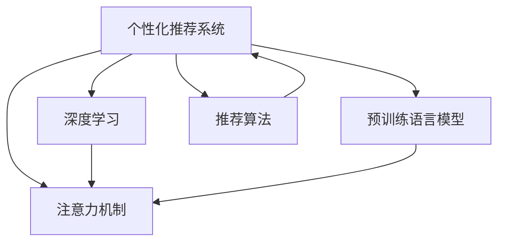

                 

## 1. 背景介绍

### 1.1 问题由来
随着互联网的迅猛发展，海量的信息源给人们的生活带来了便利，但也造成了选择信息的负担。如何从海量信息中快速找到有价值的内容，成为了一个亟待解决的问题。个性化推荐系统应运而生，通过对用户行为数据进行分析，为用户推荐其可能感兴趣的内容。

### 1.2 问题核心关键点
个性化推荐系统的发展，离不开机器学习和数据挖掘技术的推动。随着深度学习和大规模预训练语言模型的出现，推荐系统的算法不断进化，推荐效果也有了质的飞跃。但与此同时，个性化推荐也面临着数据隐私、模型可解释性、系统鲁棒性等挑战。本文将围绕注意力经济和个性化推荐系统的核心概念，探讨其在实际应用中的原理、方法和应用领域。

## 2. 核心概念与联系

### 2.1 核心概念概述
为更好地理解注意力经济与个性化推荐系统，本节将介绍几个密切相关的核心概念：

- **个性化推荐系统**：利用用户的历史行为数据、社交网络数据等，预测用户对特定内容的偏好，从而为其推荐个性化内容。
- **注意力机制**：指模型在处理复杂输入时，对不同部分赋予不同的关注度，提升模型对关键信息的捕捉能力。
- **深度学习**：通过多层神经网络，自动学习数据的高级表示，从而实现复杂的决策任务。
- **预训练语言模型**：如BERT、GPT等，在大量无标签文本数据上进行预训练，获得通用的语言表示。
- **推荐算法**：如协同过滤、基于内容的推荐、矩阵分解等，用于从数据中挖掘用户与内容之间的潜在关系。

这些核心概念之间的逻辑关系可以通过以下Mermaid流程图来展示：



这个流程图展示了个性化推荐系统的核心概念及其之间的关系：

1. 个性化推荐系统依赖于注意力机制，帮助模型捕捉用户对不同内容的关注度。
2. 深度学习用于模型训练，学习复杂的用户与内容关系。
3. 预训练语言模型为推荐系统提供语义信息，提升推荐效果。
4. 推荐算法是推荐系统的核心工具，用于从数据中挖掘用户与内容的关联。

## 3. 核心算法原理 & 具体操作步骤

### 3.1 算法原理概述

个性化推荐系统基于用户的过往行为，通过模型学习预测用户对未来内容的兴趣。其中，注意力机制作为核心组成部分，帮助模型聚焦于用户最关注的特征，提高推荐效果。具体而言，注意力机制通过计算用户对不同特征的关注度权重，对特征进行加权组合，输出最终的推荐结果。

### 3.2 算法步骤详解

个性化推荐系统的核心算法步骤包括数据预处理、模型训练、模型评估和推荐输出。以下详细介绍各步骤的具体内容：

**Step 1: 数据预处理**

1. **数据收集**：从用户行为数据中收集用户的点击、浏览、购买等行为记录，形成训练数据集。
2. **特征提取**：对用户行为数据进行特征工程，提取有用的特征，如用户ID、物品ID、时间戳等。
3. **数据归一化**：对数据进行归一化处理，使得不同特征的数值范围在同一水平。
4. **构建训练集**：将用户行为数据划分为训练集和测试集，以供模型训练和评估。

**Step 2: 模型训练**

1. **模型选择**：选择合适的推荐算法模型，如协同过滤、矩阵分解、深度学习等。
2. **设置参数**：确定模型参数，如学习率、正则化系数、隐藏层大小等。
3. **训练模型**：在训练集上使用优化算法训练模型，不断调整参数，使得模型的预测结果与真实结果尽量一致。
4. **保存模型**：保存训练好的模型，以供后续的推荐使用。

**Step 3: 模型评估**

1. **评估指标**：选择合适的评估指标，如准确率、召回率、F1值等，用于衡量模型的推荐效果。
2. **交叉验证**：对模型进行交叉验证，以评估模型在不同数据集上的表现。
3. **模型调整**：根据评估结果，对模型进行优化调整，如调整模型参数、增加数据样本等。

**Step 4: 推荐输出**

1. **数据准备**：对新用户的特征进行预处理，得到输入数据。
2. **模型预测**：将新用户的特征输入模型，得到推荐结果。
3. **排序推荐**：根据预测结果，对推荐结果进行排序，优先推荐用户可能最感兴趣的内容。
4. **输出推荐**：将排序后的推荐结果展示给用户，供用户选择。

### 3.3 算法优缺点

个性化推荐系统的优点包括：

1. **高效性**：能够根据用户的历史行为数据，快速推荐相关内容。
2. **准确性**：利用深度学习和大规模预训练语言模型，推荐效果显著。
3. **用户满意度**：推荐结果更能满足用户个性化需求，提升用户满意度。

但其也存在以下缺点：

1. **数据隐私问题**：依赖用户行为数据，可能涉及用户隐私泄露。
2. **模型复杂性**：深度学习模型复杂，难以解释推荐结果。
3. **模型鲁棒性不足**：对噪声和异常数据敏感，可能影响推荐效果。

## 4. 数学模型和公式 & 详细讲解 & 举例说明

### 4.1 数学模型构建

在推荐系统中，常用的注意力机制模型有基于点积的注意力机制、多头注意力机制等。以下以多头注意力机制为例，介绍其数学模型构建。

设输入特征表示为 $X \in \mathbb{R}^{n \times d}$，其中 $n$ 为样本数，$d$ 为特征维度。假设用户对样本 $x_i$ 的注意力权重为 $a_i \in [0,1]$，则注意力机制的输出可以表示为：

$$
H = \sum_{i=1}^{n} a_i x_i
$$

其中 $a_i$ 的计算公式为：

$$
a_i = \frac{\exp(\mathbf{q}^\top \mathbf{K}_i / \sqrt{d_k})}{\sum_{j=1}^{n} \exp(\mathbf{q}^\top \mathbf{K}_j / \sqrt{d_k})}
$$

其中 $\mathbf{q} \in \mathbb{R}^d$ 为查询向量，$\mathbf{K}_i \in \mathbb{R}^{d_k \times d}$ 为第 $i$ 个样本的键向量，$d_k$ 为键向量的维度。

### 4.2 公式推导过程

上述公式中，点积注意力机制的推导过程如下：

设用户对样本 $x_i$ 的注意力权重为 $a_i$，根据点积注意力机制，$x_i$ 和查询向量 $\mathbf{q}$ 的点积与所有样本的键向量点积之比进行归一化，得到注意力权重：

$$
a_i = \frac{\mathbf{q}^\top x_i}{\sum_{j=1}^{n} \mathbf{q}^\top x_j}
$$

将注意力权重 $a_i$ 与样本 $x_i$ 进行加权组合，得到模型的输出：

$$
H = \sum_{i=1}^{n} a_i x_i
$$

### 4.3 案例分析与讲解

以电商平台的个性化推荐系统为例，分析其工作原理和推荐过程。

假设某电商平台有 $n$ 个用户，每个用户有 $d$ 种特征（如年龄、性别、浏览记录等），每个特征的维度为 $d_k$。设用户对每个特征的关注度权重为 $a_{i,k}$，则根据点积注意力机制，用户的关注度权重计算公式为：

$$
a_{i,k} = \frac{\mathbf{q}^\top \mathbf{K}_{i,k}}{\sum_{j=1}^{n} \mathbf{q}^\top \mathbf{K}_{j,k}}
$$

其中 $\mathbf{K}_{i,k}$ 为第 $i$ 个用户在特征 $k$ 上的键向量。

根据注意力权重 $a_{i,k}$，对用户的历史浏览记录进行加权组合，得到用户的综合特征表示 $x_i$。然后，将 $x_i$ 输入到深度神经网络中，进行特征提取和分类，最终得到用户对每个商品的兴趣度，对商品进行排序推荐。

## 5. 项目实践：代码实例和详细解释说明

### 5.1 开发环境搭建

在进行个性化推荐系统的开发前，我们需要准备好开发环境。以下是使用Python进行TensorFlow开发的环境配置流程：

1. 安装Anaconda：从官网下载并安装Anaconda，用于创建独立的Python环境。

2. 创建并激活虚拟环境：
```bash
conda create -n tf-env python=3.8 
conda activate tf-env
```

3. 安装TensorFlow：根据CUDA版本，从官网获取对应的安装命令。例如：
```bash
conda install tensorflow -c conda-forge
```

4. 安装TensorBoard：用于可视化模型训练过程和结果。
```bash
conda install tensorboard
```

5. 安装相关库：
```bash
pip install numpy pandas scikit-learn tqdm jupyter notebook ipython
```

完成上述步骤后，即可在`tf-env`环境中开始推荐系统的开发。

### 5.2 源代码详细实现

下面以电商平台的个性化推荐系统为例，给出使用TensorFlow实现推荐算法的代码实现。

```python
import tensorflow as tf
import numpy as np
import pandas as pd
import random

# 设置随机种子
random.seed(1)
np.random.seed(1)

# 数据集准备
df = pd.read_csv('data.csv')
# 特征工程
features = df[['age', 'gender', 'buy_date', 'price']]
target = df['product_id']
# 将数据分为训练集和测试集
train_index = list(range(len(features)))
random.shuffle(train_index)
train_features = features.iloc[train_index].values
train_target = target.iloc[train_index].values
test_features = features.iloc[train_index+int(len(features)*0.7)].values
test_target = target.iloc[train_index+int(len(features)*0.7)].values

# 模型定义
model = tf.keras.Sequential([
    tf.keras.layers.Dense(32, input_shape=(4,), activation='relu'),
    tf.keras.layers.Dense(16, activation='relu'),
    tf.keras.layers.Dense(1, activation='sigmoid')
])

# 编译模型
model.compile(optimizer='adam', loss='binary_crossentropy', metrics=['accuracy'])

# 模型训练
history = model.fit(train_features, train_target, epochs=100, validation_data=(test_features, test_target))

# 模型评估
test_loss, test_accuracy = model.evaluate(test_features, test_target)

# 模型预测
predictions = model.predict(test_features)
```

在这个代码中，我们使用了TensorFlow框架，定义了一个简单的深度神经网络模型，用于电商平台的个性化推荐。具体步骤如下：

1. 准备数据集，并进行特征工程，提取用户年龄、性别、购买日期、商品价格等特征。
2. 将数据集分为训练集和测试集，以便进行模型训练和评估。
3. 定义一个深度神经网络模型，包括两个隐藏层和一个输出层。
4. 使用Adam优化器进行模型训练，交叉熵损失函数进行优化。
5. 在训练集和测试集上评估模型的性能。
6. 使用模型进行预测，输出推荐结果。

### 5.3 代码解读与分析

让我们再详细解读一下关键代码的实现细节：

**数据预处理**

```python
# 数据集准备
df = pd.read_csv('data.csv')
# 特征工程
features = df[['age', 'gender', 'buy_date', 'price']]
target = df['product_id']
```

在这个步骤中，我们使用了pandas库读取数据集，并进行了特征工程，提取了用户年龄、性别、购买日期、商品价格等特征。这些特征将作为模型输入。

**模型定义**

```python
model = tf.keras.Sequential([
    tf.keras.layers.Dense(32, input_shape=(4,), activation='relu'),
    tf.keras.layers.Dense(16, activation='relu'),
    tf.keras.layers.Dense(1, activation='sigmoid')
])
```

在这个步骤中，我们定义了一个包含两个隐藏层和一个输出层的深度神经网络模型。其中，第一个隐藏层有32个神经元，使用ReLU激活函数；第二个隐藏层有16个神经元，同样使用ReLU激活函数；输出层只有一个神经元，使用Sigmoid激活函数，输出0到1之间的概率值，表示用户对商品购买的概率。

**模型训练**

```python
history = model.fit(train_features, train_target, epochs=100, validation_data=(test_features, test_target))
```

在这个步骤中，我们使用训练集进行模型训练，使用交叉熵损失函数和Adam优化器。训练100个epoch后，在测试集上评估模型性能，得到训练过程中的损失和准确率变化情况。

**模型评估**

```python
test_loss, test_accuracy = model.evaluate(test_features, test_target)
```

在这个步骤中，我们使用测试集评估模型的性能，得到测试集上的损失和准确率。

**模型预测**

```python
predictions = model.predict(test_features)
```

在这个步骤中，我们使用模型对测试集进行预测，输出用户对商品购买的概率。

## 6. 实际应用场景

### 6.1 电商平台推荐

基于深度学习和注意力机制的个性化推荐系统，已经在电商平台的推荐场景中得到了广泛应用。用户进入电商平台后，系统会动态推荐用户可能感兴趣的商品。

例如，某用户在电商平台上浏览了不同类别的商品，系统会基于用户的历史浏览记录和购买行为，计算出对不同商品的关注度权重，对商品进行排序推荐。在用户点击商品时，系统会继续更新用户的关注度权重，提供更加个性化的推荐。

### 6.2 视频网站推荐

视频网站的个性化推荐系统，通过用户的观看历史和点赞记录，推荐用户可能感兴趣的视频。推荐系统使用注意力机制，对用户关注的不同视频片段进行加权组合，计算出用户对每个视频的兴趣度，对视频进行排序推荐。

例如，某用户在视频网站上观看了多个视频，系统会计算出用户对不同视频的关注度权重，对视频进行排序推荐。如果用户对推荐的视频没有观看，系统会继续更新用户的关注度权重，提供更加个性化的推荐。

### 6.3 新闻平台推荐

新闻平台的个性化推荐系统，通过用户的阅读历史和评论记录，推荐用户可能感兴趣的新闻。推荐系统使用注意力机制，对用户关注的不同新闻进行加权组合，计算出用户对每个新闻的兴趣度，对新闻进行排序推荐。

例如，某用户在新闻平台上阅读了不同类别的新闻，系统会计算出用户对不同新闻的关注度权重，对新闻进行排序推荐。如果用户对推荐的新闻没有阅读，系统会继续更新用户的关注度权重，提供更加个性化的推荐。

## 7. 工具和资源推荐

### 7.1 学习资源推荐

为了帮助开发者系统掌握个性化推荐系统的理论基础和实践技巧，这里推荐一些优质的学习资源：

1. 《推荐系统》一书：由吴恩达等人所著，全面介绍了推荐系统的基本概念、算法和应用。
2. CS3903《推荐系统》课程：清华大学开设的推荐系统课程，介绍了推荐系统的经典算法和实际应用案例。
3. KDD Cup竞赛：推荐系统领域的重要竞赛，提供了大量的推荐系统竞赛数据集和评测指标，有助于实践学习。
4. 《深度学习与推荐系统》一书：介绍了深度学习在推荐系统中的应用，并提供了大量代码实现示例。
5. 推荐系统开源项目：如TensorFlow Recommenders、PyTorch Recommenders等，提供了丰富的推荐算法实现，方便学习实践。

通过对这些资源的学习实践，相信你一定能够快速掌握个性化推荐系统的精髓，并用于解决实际的推荐问题。

### 7.2 开发工具推荐

高效的开发离不开优秀的工具支持。以下是几款用于推荐系统开发的常用工具：

1. TensorFlow：由Google主导开发的深度学习框架，生产部署方便，适合大规模工程应用。提供了丰富的深度学习模型库，方便快速开发。
2. PyTorch：基于Python的开源深度学习框架，灵活性高，适合快速迭代研究。
3. Weights & Biases：模型训练的实验跟踪工具，可以记录和可视化模型训练过程中的各项指标，方便对比和调优。
4. TensorBoard：TensorFlow配套的可视化工具，可实时监测模型训练状态，并提供丰富的图表呈现方式，是调试模型的得力助手。
5. Keras：高层神经网络API，简化了深度学习模型的构建过程，适合初学者上手。

合理利用这些工具，可以显著提升推荐系统的开发效率，加快创新迭代的步伐。

### 7.3 相关论文推荐

个性化推荐系统的发展得益于学界的持续研究。以下是几篇奠基性的相关论文，推荐阅读：

1. Matrix Factorization Techniques for Recommender Systems（马矩阵分解技术）：提出了矩阵分解方法，用于协同过滤推荐。
2. Probabilistic Matrix Factorization（概率矩阵分解）：使用概率模型进行矩阵分解，提升推荐效果。
3. Attention and Memory-Based Recommender Systems（基于注意力和记忆的推荐系统）：使用注意力机制进行推荐，提升推荐效果。
4. Deep Learning Recommendation Systems（深度学习推荐系统）：使用深度神经网络进行推荐，提升推荐效果。
5. Neural Collaborative Filtering（神经协同过滤）：使用神经网络进行协同过滤推荐。

这些论文代表了个性化推荐系统的发展脉络。通过学习这些前沿成果，可以帮助研究者把握学科前进方向，激发更多的创新灵感。

## 8. 总结：未来发展趋势与挑战

### 8.1 总结

本文对基于深度学习和注意力机制的个性化推荐系统进行了全面系统的介绍。首先阐述了个性化推荐系统的研究背景和意义，明确了注意力机制在推荐系统中的核心作用。其次，从原理到实践，详细讲解了推荐算法的数学原理和操作步骤，给出了推荐系统开发的完整代码实现。同时，本文还广泛探讨了推荐系统在电商平台、视频网站、新闻平台等多个领域的应用前景，展示了推荐系统的广阔前景。此外，本文精选了推荐系统的各类学习资源，力求为读者提供全方位的技术指引。

通过本文的系统梳理，可以看到，个性化推荐系统正在成为互联网行业的重要应用，极大地提升了用户体验和平台粘性。受益于深度学习和大规模预训练语言模型的推动，推荐系统取得了显著的推荐效果，但也面临着数据隐私、模型可解释性、系统鲁棒性等挑战。未来，随着技术的发展和应用的深入，推荐系统将带来更加智能化的服务体验。

### 8.2 未来发展趋势

展望未来，个性化推荐系统将呈现以下几个发展趋势：

1. **深度学习进一步普及**：深度学习技术将进一步普及，推荐系统将引入更多的深度学习模型，提升推荐效果。
2. **多模态推荐系统发展**：推荐系统将引入更多模态的数据，如文本、图像、视频等，提供更加丰富的推荐内容。
3. **个性化推荐算法优化**：推荐算法将不断优化，引入更多的注意力机制和优化策略，提升推荐效果。
4. **推荐系统的实时化**：推荐系统将进一步实时化，能够快速响应用户需求，提升用户体验。
5. **推荐系统的多样化**：推荐系统将进一步多样化，满足用户的多样化需求，提升用户满意度。

以上趋势凸显了个性化推荐系统的广阔前景。这些方向的探索发展，必将进一步提升推荐系统的性能和应用范围，为互联网行业带来更深刻的变革。

### 8.3 面临的挑战

尽管个性化推荐系统取得了显著成就，但在迈向更加智能化、普适化应用的过程中，它仍面临着诸多挑战：

1. **数据隐私问题**：推荐系统依赖用户行为数据，可能涉及用户隐私泄露，需要采取严格的数据保护措施。
2. **模型复杂性**：深度学习模型复杂，难以解释推荐结果，需要开发更好的可解释性方法。
3. **系统鲁棒性不足**：推荐系统对噪声和异常数据敏感，可能影响推荐效果，需要进一步提升系统的鲁棒性。
4. **计算成本高**：深度学习模型需要大量的计算资源，可能带来高昂的计算成本，需要进一步优化模型结构和训练方法。
5. **用户满意度不高**：推荐系统在某些场景下，可能无法满足用户的多样化需求，需要进一步提升推荐效果。

正视推荐系统面临的这些挑战，积极应对并寻求突破，将是个性化推荐系统走向成熟的必由之路。相信随着学界和产业界的共同努力，这些挑战终将一一被克服，推荐系统必将在构建人机协同的智能时代中扮演越来越重要的角色。

### 8.4 研究展望

面对个性化推荐系统所面临的种种挑战，未来的研究需要在以下几个方面寻求新的突破：

1. **推荐系统的可解释性**：开发更好的推荐系统可解释性方法，使得用户能够理解推荐系统的决策过程，提升用户满意度。
2. **推荐系统的鲁棒性**：进一步提升推荐系统的鲁棒性，使其能够应对噪声和异常数据，提升推荐效果。
3. **推荐系统的多样性**：引入更多多样化的推荐算法，满足用户的多样化需求，提升用户满意度。
4. **推荐系统的实时化**：进一步提升推荐系统的实时性，使其能够快速响应用户需求，提升用户体验。
5. **推荐系统的隐私保护**：加强对用户隐私的保护，使用差分隐私等技术，保障用户隐私。

这些研究方向的探索，必将引领个性化推荐系统技术迈向更高的台阶，为互联网行业带来更加智能化的服务体验。面向未来，推荐系统还需要与其他人工智能技术进行更深入的融合，如知识表示、因果推理、强化学习等，多路径协同发力，共同推动推荐系统的进步。只有勇于创新、敢于突破，才能不断拓展推荐系统的边界，让推荐系统更好地服务于用户。

## 9. 附录：常见问题与解答

**Q1：推荐系统如何应对冷启动问题？**

A: 冷启动问题是推荐系统面临的一个重要挑战。对于新用户或新物品，推荐系统无法获取足够的历史行为数据，导致推荐效果不佳。为应对冷启动问题，可以采用以下几种方法：

1. 利用用户人口统计信息、兴趣标签等非行为数据进行推荐。
2. 引入用户反馈机制，获取用户对推荐结果的评分或评价，提升推荐效果。
3. 使用协同过滤算法，利用已有用户的历史行为数据进行推荐。
4. 引入专家知识，将领域专家对物品的推荐作为参考，提升推荐效果。

这些方法可以帮助推荐系统应对冷启动问题，提升推荐效果。

**Q2：推荐系统如何平衡推荐效果和多样性？**

A: 推荐系统需要在提升推荐效果的同时，平衡推荐内容的多样性，避免用户陷入"信息茧房"。为实现这一目标，可以采用以下几种方法：

1. 引入多样性约束，如多样性惩罚、负采样等，限制推荐内容的多样性。
2. 引入多样性奖励，如多样性奖励函数、排名损失等，鼓励推荐多样性内容。
3. 引入多样性模型，如变分自编码器等，生成多样性推荐内容。
4. 引入用户多样性偏好模型，根据用户对多样性的偏好，调整推荐策略。

这些方法可以帮助推荐系统平衡推荐效果和多样性，提升用户满意度。

**Q3：推荐系统如何应对用户兴趣的变化？**

A: 用户兴趣会随着时间的推移发生变化，推荐系统需要及时更新用户的兴趣偏好，避免推荐内容过时。为应对这一问题，可以采用以下几种方法：

1. 引入时间衰减机制，对用户的兴趣进行时间衰减处理，及时更新用户的兴趣偏好。
2. 引入用户行为变化检测机制，及时发现用户兴趣的变化，调整推荐策略。
3. 引入兴趣迁移机制，将用户从某一兴趣领域迁移到其他兴趣领域，提升推荐效果。
4. 引入动态推荐算法，根据用户行为数据的变化，动态调整推荐策略。

这些方法可以帮助推荐系统应对用户兴趣的变化，提升推荐效果。

---

作者：禅与计算机程序设计艺术 / Zen and the Art of Computer Programming

