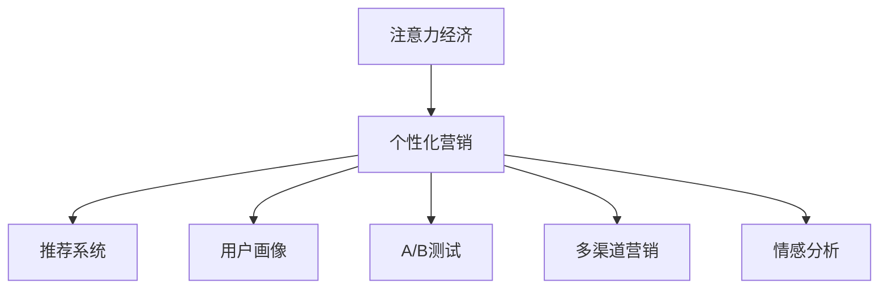

                 

# 注意力经济与个性化营销：如何针对受众定制你的信息

在数字时代，信息的爆炸式增长带来了前所未有的机遇和挑战。如何在这场信息洪流中吸引并保持用户的注意力，是所有品牌和内容创作者面临的首要问题。本文将探讨注意力经济的核心概念，并详细介绍如何利用个性化营销技术，精准定制信息，实现高效的受众互动和品牌推广。

## 1. 背景介绍

### 1.1 问题由来

随着互联网的普及和社交媒体的兴起，信息的传播速度和范围达到了新的高度。然而，在海量信息中，用户的时间和注意力成为稀缺资源。如何有效吸引并保持用户的注意力，成为了营销和品牌推广的关键。

### 1.2 问题核心关键点

注意力经济指的是在信息过载的环境下，通过精准定位和有效传播，争夺用户注意力的策略。其核心在于利用大数据和算法技术，分析用户行为和偏好，实现内容定制和定向推送，提高用户参与度和品牌影响力。

## 2. 核心概念与联系

### 2.1 核心概念概述

为更好地理解注意力经济和个性化营销，本节将介绍几个密切相关的核心概念：

- **注意力经济**：指在信息泛滥的背景下，通过精确定位和有效传播，争夺用户注意力的策略。其目标是最大化用户的参与度和忠诚度，从而提升品牌价值。

- **个性化营销**：指利用用户数据和算法技术，对不同用户群体进行精准定制化的营销活动，以提高营销效果和用户满意度。

- **推荐系统**：通过分析用户历史行为数据，预测用户未来兴趣，推荐个性化内容的技术。推荐系统是实现个性化营销的重要手段之一。

- **用户画像**：基于用户行为数据和社交媒体信息，构建用户特征模型，用于指导个性化内容制作和定向推送。

- **A/B测试**：通过对比不同版本的营销活动效果，确定最优策略的技术。

- **多渠道营销**：利用多个渠道（如社交媒体、电子邮件、短信等）同时推广产品或服务的策略。

- **情感分析**：分析用户情感倾向，识别用户反馈和评价，指导营销策略调整。

这些概念之间的逻辑关系可以通过以下Mermaid流程图来展示：



这个流程图展示了个注意力经济的核心概念及其之间的关系：

1. 注意力经济通过个性化营销实现。
2. 个性化营销依赖推荐系统和用户画像进行精准定制。
3. 推荐系统基于用户数据预测兴趣，构建推荐模型。
4. 用户画像基于用户行为构建，指导个性化推荐。
5. A/B测试用于优化营销策略。
6. 多渠道营销通过多平台协同推广。
7. 情感分析用于调整策略，提升用户体验。

这些概念共同构成了注意力经济的理论基础，是实现个性化营销的重要组成部分。

## 3. 核心算法原理 & 具体操作步骤

### 3.1 算法原理概述

个性化营销的核心是利用用户数据，构建用户画像，预测用户兴趣，实现精准推荐和定向推送。其核心算法包括协同过滤、基于内容的推荐、深度学习推荐等，以提高推荐系统的准确性和个性化水平。

具体步骤如下：

1. **数据收集**：收集用户行为数据，如浏览历史、购买记录、社交媒体互动等。
2. **用户画像构建**：通过数据挖掘和机器学习技术，构建用户特征模型。
3. **内容推荐**：根据用户画像和推荐模型，预测用户可能感兴趣的内容，进行推荐。
4. **效果评估**：通过A/B测试和情感分析等手段，评估推荐效果，调整策略。
5. **多渠道推广**：利用多个渠道同时推广内容，最大化用户覆盖和参与度。

### 3.2 算法步骤详解

#### 3.2.1 数据收集与预处理

数据收集是构建个性化推荐系统的第一步。通常从以下几个方面收集用户数据：

- **行为数据**：用户浏览、点击、购买等行为数据。
- **社交媒体数据**：用户在社交媒体上的互动信息，如点赞、评论、分享等。
- **人口统计数据**：用户的年龄、性别、职业等信息。
- **心理数据**：用户的兴趣、价值观、情感等心理特征。

数据收集完成后，需要进行预处理和清洗，去除噪音和冗余信息，保证数据质量和一致性。

#### 3.2.2 用户画像构建

用户画像通过机器学习算法，从数据中提取用户特征，形成用户画像模型。常用的方法包括：

- **聚类分析**：将用户分为不同群体，根据群体特征定制推荐内容。
- **关联规则挖掘**：发现用户行为中的规律和关联，指导推荐内容选择。
- **协同过滤**：通过用户相似度分析，推荐相似用户喜欢的内容。

#### 3.2.3 推荐模型构建

推荐系统使用机器学习算法，预测用户可能感兴趣的内容。常用的算法包括：

- **协同过滤算法**：基于用户历史行为，推荐相似用户喜欢的内容。
- **基于内容的推荐**：通过分析内容特征，预测用户对内容的兴趣。
- **深度学习算法**：使用神经网络模型，学习用户兴趣和内容特征的复杂关系。

#### 3.2.4 内容推荐与定向推送

基于用户画像和推荐模型，向用户推荐可能感兴趣的内容。推荐过程中，需要考虑以下因素：

- **个性化推荐**：根据用户画像，实现个性化定制。
- **多样化推荐**：避免推荐单一内容，增加内容多样性。
- **实时推荐**：根据用户当前行为，实时调整推荐内容。

#### 3.2.5 效果评估与优化

推荐效果需要通过A/B测试和情感分析等手段进行评估和优化。常用的评估指标包括：

- **点击率**：用户点击推荐内容的概率。
- **转化率**：用户最终购买或参与活动的概率。
- **用户满意度**：用户对推荐内容的满意度评分。

#### 3.2.6 多渠道营销

通过多个渠道同时推广内容，最大化用户覆盖和参与度。常用的推广渠道包括：

- **社交媒体**：利用社交网络平台，进行内容分享和互动。
- **电子邮件**：通过邮件营销，向用户推荐个性化内容。
- **短信营销**：利用短信平台，推送定向内容。
- **移动应用**：通过应用内推荐，提升用户参与度。

### 3.3 算法优缺点

#### 3.3.1 优点

个性化营销具有以下优点：

- **精准推荐**：利用用户数据，实现内容定制，提高推荐准确性。
- **提升用户体验**：通过个性化内容，提升用户满意度和参与度。
- **增加转化率**：提高用户点击和购买概率，增加收益。
- **降低营销成本**：通过精准定位，避免无效推广，降低营销成本。

#### 3.3.2 缺点

个性化营销也存在一些缺点：

- **数据隐私问题**：收集和分析用户数据，可能引发隐私问题。
- **算法偏见**：推荐算法可能存在偏见，影响公平性。
- **内容同质化**：过度依赖个性化推荐，可能导致内容同质化，减少多样性。
- **依赖历史数据**：推荐效果依赖用户历史行为，难以应对新用户和变化的用户需求。

### 3.4 算法应用领域

个性化营销在多个领域都有广泛应用，例如：

- **电商**：通过个性化推荐，提升用户购买转化率。
- **媒体**：利用推荐系统，推送个性化内容，增加用户黏性。
- **广告**：通过定向推送，提高广告投放效果。
- **教育**：根据用户学习行为，推送个性化学习资源。
- **旅游**：利用用户兴趣，推荐个性化旅游路线和内容。

## 4. 数学模型和公式 & 详细讲解 & 举例说明

### 4.1 数学模型构建

个性化推荐系统通常使用协同过滤和深度学习模型。以下以协同过滤为例，构建推荐模型。

设用户集合为 $U$，物品集合为 $I$，用户对物品的评分矩阵为 $R \in \mathbb{R}^{m \times n}$，其中 $m$ 为用户数，$n$ 为物品数。推荐系统的目标是最小化预测评分和实际评分之间的误差，即：

$$
\min_{\theta} \sum_{u \in U} \sum_{i \in I} (r_{ui} - \hat{r}_{ui})^2
$$

其中 $\theta$ 为协同过滤模型的参数，$\hat{r}_{ui}$ 为模型预测的用户 $u$ 对物品 $i$ 的评分。

### 4.2 公式推导过程

协同过滤算法通过计算用户和物品之间的相似度，预测用户对物品的评分。常用的相似度计算方法包括余弦相似度和皮尔逊相关系数等。以余弦相似度为例，用户 $u$ 和物品 $i$ 的相似度计算公式为：

$$
sim(u,i) = \frac{\sum_{j \in I} r_{uj} \cdot r_{ij}}{\sqrt{\sum_{j \in I} r_{uj}^2} \cdot \sqrt{\sum_{j \in I} r_{ij}^2}}
$$

根据相似度，预测用户 $u$ 对物品 $i$ 的评分：

$$
\hat{r}_{ui} = \sum_{j \in I} sim(u,j) \cdot r_{ij}
$$

通过训练协同过滤模型，不断调整参数 $\theta$，使得预测评分与实际评分尽可能接近。最终，模型可以根据用户 $u$ 和物品 $i$ 的特征，预测其评分。

### 4.3 案例分析与讲解

假设某电商网站，通过协同过滤算法，构建了个性化推荐系统。该网站收集了用户历史购买记录和物品评价数据，构建了用户-物品评分矩阵 $R$。用户 $u$ 对物品 $i$ 的评分 $r_{ui}$ 由用户对物品的平均评分 $\overline{r}_i$ 和用户对物品的相似度评分 $\hat{r}_{ui}$ 两部分组成：

$$
r_{ui} = \overline{r}_i + \hat{r}_{ui}
$$

其中 $\overline{r}_i$ 为物品 $i$ 的平均评分，$\hat{r}_{ui}$ 为物品 $i$ 在用户 $u$ 的推荐列表中，物品 $j$ 的评分，计算公式为：

$$
\hat{r}_{ui} = \sum_{j \in I} \alpha_j \cdot r_{uj} \cdot sim(u,j) \cdot r_{ij}
$$

其中 $\alpha_j$ 为物品 $j$ 的权重，通过交叉验证等方法确定。最终，网站可以根据用户 $u$ 的特征，预测其对物品 $i$ 的评分，实现个性化推荐。

## 5. 项目实践：代码实例和详细解释说明

### 5.1 开发环境搭建

在进行个性化推荐系统开发前，需要搭建开发环境。以下是使用Python进行PyTorch开发的环境配置流程：

1. 安装Anaconda：从官网下载并安装Anaconda，用于创建独立的Python环境。

2. 创建并激活虚拟环境：
```bash
conda create -n pytorch-env python=3.8 
conda activate pytorch-env
```

3. 安装PyTorch：根据CUDA版本，从官网获取对应的安装命令。例如：
```bash
conda install pytorch torchvision torchaudio cudatoolkit=11.1 -c pytorch -c conda-forge
```

4. 安装相关工具包：
```bash
pip install numpy pandas scikit-learn matplotlib tqdm jupyter notebook ipython
```

5. 安装TensorBoard：用于可视化训练过程。
```bash
pip install tensorboard
```

完成上述步骤后，即可在`pytorch-env`环境中开始个性化推荐系统的开发。

### 5.2 源代码详细实现

这里我们以一个简单的协同过滤推荐系统为例，展示其开发过程。具体代码如下：

```python
import torch
import torch.nn as nn
import torch.optim as optim
import numpy as np

# 定义协同过滤推荐模型
class CollaborativeFilteringModel(nn.Module):
    def __init__(self, num_users, num_items, hidden_dim):
        super(CollaborativeFilteringModel, self).__init__()
        self.hidden_dim = hidden_dim
        self.user_embedding = nn.Embedding(num_users, hidden_dim)
        self.item_embedding = nn.Embedding(num_items, hidden_dim)
        self.fc1 = nn.Linear(hidden_dim * 2, hidden_dim)
        self.fc2 = nn.Linear(hidden_dim, 1)
        
    def forward(self, user_id, item_id):
        user_embed = self.user_embedding(user_id)
        item_embed = self.item_embedding(item_id)
        concat_embed = torch.cat([user_embed, item_embed], dim=1)
        fc1_output = self.fc1(concat_embed)
        prediction = self.fc2(fc1_output).squeeze(dim=1)
        return prediction
    
# 定义损失函数和优化器
criterion = nn.MSELoss()
optimizer = optim.Adam(model.parameters(), lr=0.001)

# 训练模型
def train_model(model, data_loader, num_epochs, batch_size):
    model.train()
    for epoch in range(num_epochs):
        for user_id, item_id, rating in data_loader:
            optimizer.zero_grad()
            predictions = model(user_id, item_id)
            loss = criterion(predictions, ratings)
            loss.backward()
            optimizer.step()
    
    return model

# 构建数据集
user_ids = [1, 2, 3, 4, 5]
item_ids = [1, 2, 3, 4, 5]
ratings = [4.5, 3.2, 5.0, 4.0, 4.5]
num_users = len(user_ids)
num_items = len(item_ids)
hidden_dim = 10

data_loader = torch.utils.data.DataLoader(
    torch.utils.data.TensorDataset(torch.tensor(user_ids), 
                                  torch.tensor(item_ids), 
                                  torch.tensor(ratings)), 
    batch_size=batch_size, 
    shuffle=True)

# 训练模型
model = CollaborativeFilteringModel(num_users, num_items, hidden_dim)
train_model(model, data_loader, num_epochs=10, batch_size=4)

# 预测新物品的评分
user_id = 1
item_id = 6
rating = model(user_id, item_id).item()
print(f"User {user_id} scores item {item_id} as {rating:.1f}")
```

### 5.3 代码解读与分析

代码中，我们首先定义了协同过滤推荐模型的结构和超参数。模型包含两个嵌入层，分别用于用户和物品的表示，以及两个全连接层。在训练过程中，我们使用均方误差损失和Adam优化器。

训练模型时，我们使用了PyTorch的DataLoader，将数据集分为小批次进行训练。在每个批次中，我们前向传播计算预测评分和实际评分的误差，反向传播更新模型参数。

预测新物品的评分时，我们将用户和物品的ID作为输入，调用模型的`forward`方法计算预测评分。由于输出是一个标量，直接使用`item`方法获取预测结果。

## 6. 实际应用场景

### 6.1 电商推荐

电商网站可以利用个性化推荐系统，提升用户购买转化率。通过分析用户的浏览历史、购买记录和评价，推荐用户可能感兴趣的商品。电商网站可以在首页、商品详情页等位置，实时推送个性化商品推荐，增加用户点击和购买率。

### 6.2 内容推荐

视频网站、音乐平台等可以通过个性化推荐，提升用户活跃度和留存率。通过分析用户的历史观看记录和偏好，推荐用户可能感兴趣的视频、音乐等内容。平台可以在首页、播放页等位置，推送个性化内容，提高用户黏性和满意度。

### 6.3 新闻推荐

新闻媒体可以通过个性化推荐，增加用户点击率和阅读量。通过分析用户的历史浏览记录和偏好，推荐用户可能感兴趣的新闻内容。媒体可以在首页、栏目页等位置，推送个性化新闻推荐，提高用户停留时间和阅读深度。

## 7. 工具和资源推荐

### 7.1 学习资源推荐

为了帮助开发者系统掌握个性化推荐技术的原理和实践，这里推荐一些优质的学习资源：

1. 《推荐系统实战》一书：详细介绍了协同过滤、基于内容的推荐等核心技术，并提供了大量的代码示例。
2. Coursera《推荐系统》课程：由斯坦福大学开设的推荐系统课程，涵盖了推荐系统的主要算法和技术。
3. Kaggle推荐系统竞赛：通过参与Kaggle的推荐系统竞赛，了解最新的算法和实践，积累实际项目经验。

### 7.2 开发工具推荐

高效的开发离不开优秀的工具支持。以下是几款用于个性化推荐系统开发的常用工具：

1. PyTorch：基于Python的开源深度学习框架，支持动态图和静态图，适合快速迭代研究。
2. TensorFlow：由Google主导开发的深度学习框架，生产部署方便，适合大规模工程应用。
3. TensorBoard：TensorFlow配套的可视化工具，实时监测模型训练状态，提供丰富的图表呈现方式。
4. Weights & Biases：模型训练的实验跟踪工具，可以记录和可视化模型训练过程中的各项指标。
5. Jupyter Notebook：交互式编程环境，支持Python和R等语言，便于协作开发和共享代码。

### 7.3 相关论文推荐

个性化推荐技术的发展源于学界的持续研究。以下是几篇奠基性的相关论文，推荐阅读：

1. "Collaborative Filtering for Implicit Feedback Datasets"：提出了协同过滤算法的核心思想，奠定了推荐系统的基础。
2. "A Survey of Collaborative Filtering Techniques for Recommender Systems"：综述了协同过滤和基于内容的推荐算法，提供了全面的理论和方法。
3. "Deep Learning Recommender Systems"：介绍了深度学习在推荐系统中的应用，展示了深度学习算法的优越性。
4. "Attention is All You Need"：提出了Transformer模型，为推荐系统提供了新的思路和方法。

这些论文代表了个性化推荐技术的发展脉络。通过学习这些前沿成果，可以帮助研究者把握学科前进方向，激发更多的创新灵感。

## 8. 总结：未来发展趋势与挑战

### 8.1 总结

本文对个性化营销技术进行了全面系统的介绍。首先阐述了注意力经济的核心概念，明确了个性化营销在争夺用户注意力方面的独特价值。其次，从原理到实践，详细讲解了个性化推荐系统的构建流程，提供了完整的代码实现。同时，本文还探讨了个性化推荐系统在多个领域的应用前景，展示了其巨大的潜力。

通过本文的系统梳理，可以看到，个性化推荐系统正成为数字化时代的重要工具，通过精准定制内容，提升了用户参与度和品牌影响力。未来，伴随算法和技术的不懈创新，个性化推荐系统必将带来更多的应用场景和商业价值。

### 8.2 未来发展趋势

展望未来，个性化推荐系统将呈现以下几个发展趋势：

1. **多模态推荐**：利用视频、音频、图像等多模态数据，提升推荐系统的多样性和丰富性。
2. **深度学习推荐**：通过深度神经网络模型，提高推荐系统的准确性和泛化能力。
3. **实时推荐**：利用流式数据处理技术，实现实时推荐，提升用户体验。
4. **跨平台推荐**：通过多渠道数据融合，实现跨平台推荐，提升用户覆盖和参与度。
5. **个性化广告**：利用推荐系统，实现精准投放，提高广告投放效果和用户转化率。
6. **情感分析**：通过情感分析技术，识别用户情感倾向，优化推荐策略。

### 8.3 面临的挑战

尽管个性化推荐系统已经取得了显著成果，但在实现精准推荐的过程中，仍面临诸多挑战：

1. **数据隐私问题**：用户数据的收集和分析，可能引发隐私问题，需要制定严格的数据保护政策。
2. **算法偏见**：推荐算法可能存在偏见，影响公平性和多样性，需要引入公平性约束和多样性优化。
3. **计算资源限制**：推荐系统需要处理大规模数据，对计算资源和存储能力提出了高要求，需要优化算法和系统架构。
4. **用户动态变化**：用户需求和兴趣可能随时变化，推荐系统需要具备动态调整和自我适应的能力。
5. **多样性和新颖性**：过度依赖历史数据，可能导致推荐内容同质化，需要引入多样性和新颖性引导机制。

### 8.4 研究展望

面对个性化推荐系统面临的挑战，未来的研究需要在以下几个方面寻求新的突破：

1. **隐私保护技术**：研究数据匿名化和差分隐私技术，保护用户隐私。
2. **公平性和多样性**：引入公平性约束和多样性优化，提升推荐系统的公平性和多样性。
3. **实时推荐技术**：优化流式数据处理和实时推荐算法，提高推荐系统的实时性。
4. **跨平台推荐技术**：研究多平台数据融合和跨平台推荐算法，提高推荐系统的覆盖和参与度。
5. **用户动态预测**：研究动态兴趣预测和个性化推荐算法，适应用户动态变化。
6. **内容创新机制**：引入内容创新机制，提升推荐内容的多样性和新颖性。

这些研究方向将引领个性化推荐系统向更加智能化、普适化方向发展，为提升用户体验和品牌价值提供新的手段。总之，个性化推荐系统需要不断创新，才能在数字化时代中发挥更大的作用。

## 9. 附录：常见问题与解答

**Q1：个性化推荐系统是否适用于所有领域？**

A: 个性化推荐系统在大多数领域都有广泛应用，特别是对于数据量较大的领域。但对于一些数据量较小或隐私保护要求高的领域，可能需要综合考虑数据收集和隐私保护的问题。

**Q2：如何选择合适的推荐算法？**

A: 选择合适的推荐算法需要考虑以下几个因素：
1. 数据类型：选择适合处理不同类型数据的推荐算法。
2. 数据规模：选择适合处理不同规模数据的推荐算法。
3. 算法复杂度：选择算法复杂度适中的推荐算法。
4. 推荐效果：选择推荐效果好的推荐算法。

常用的推荐算法包括协同过滤、基于内容的推荐、深度学习推荐等，具体选择应根据数据和业务特点进行评估。

**Q3：个性化推荐系统如何处理用户动态变化？**

A: 个性化推荐系统需要具备动态调整和自我适应的能力，以应对用户动态变化。常用的方法包括：
1. 引入实时数据流处理技术，实现实时推荐。
2. 利用增量学习算法，更新推荐模型。
3. 引入在线学习算法，根据用户行为实时调整推荐策略。

这些方法可以帮助推荐系统及时捕捉用户动态变化，保持推荐的准确性和时效性。

**Q4：个性化推荐系统如何保护用户隐私？**

A: 个性化推荐系统需要保护用户隐私，常用的方法包括：
1. 数据匿名化：对用户数据进行去标识化处理，保护用户隐私。
2. 差分隐私：使用差分隐私技术，保护用户隐私的同时，保证推荐效果。
3. 数据加密：对用户数据进行加密处理，保护数据安全。

这些方法可以有效地保护用户隐私，同时确保推荐系统的正常运行。

**Q5：个性化推荐系统的评价指标有哪些？**

A: 个性化推荐系统的评价指标包括：
1. 准确率：推荐系统预测的准确率。
2. 召回率：推荐系统覆盖的真实商品的占比。
3. 用户满意度：用户对推荐结果的满意度评分。
4. 点击率：用户点击推荐内容的概率。
5. 转化率：用户最终购买或参与活动的概率。

这些指标可以帮助评估推荐系统的性能，指导系统优化和改进。

---

作者：禅与计算机程序设计艺术 / Zen and the Art of Computer Programming

