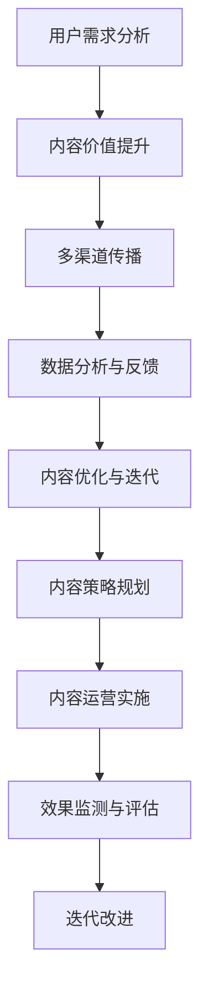

                 

# 注意力经济与内容策略规划与实施：吸引并留住受众

在数字时代，注意力成为了一种稀缺资源。如何在众多竞争者中脱颖而出，吸引并留住受众的注意力，是所有内容生产者、营销人员、产品经理面临的共同挑战。本文将深入探讨注意力经济的原理与核心策略，通过一系列案例分析与实战指导，帮助读者掌握有效的内容策略规划与实施方法。

## 1. 背景介绍

### 1.1 问题由来

随着互联网技术的普及，信息过载成为社会普遍现象。用户每天被海量的信息所包围，注意力逐渐成为决定其决策的关键因素。内容创业者需要准确理解受众的需求，提供有价值的、有吸引力的内容，才能在竞争激烈的市场上脱颖而出。

### 1.2 问题核心关键点

注意力经济的本质在于争夺用户注意力，并最大化其价值。在实际操作中，需要注意以下几个关键点：

- **用户需求分析**：了解受众的兴趣、需求、行为模式，确定目标受众群体。
- **内容价值提升**：确保内容具有独特性、时效性、互动性，提升用户粘性。
- **多渠道传播**：通过多平台、多渠道的推广，扩大内容覆盖范围，提升传播效率。
- **数据分析与反馈**：实时监控和分析用户互动数据，及时调整策略，优化内容效果。

### 1.3 问题研究意义

掌握注意力经济的核心策略，不仅能提升内容传播效果，还能提高品牌知名度和用户忠诚度。这对于任何涉及内容生产和传播的行业，都具有重要意义。

## 2. 核心概念与联系

### 2.1 核心概念概述

注意力经济（Attention Economy）是指在信息过载的时代，通过争夺用户注意力，实现价值变现的经济模式。内容策略（Content Strategy）则是指导内容生产、传播、优化的综合性策略规划。内容运营（Content Operations）则关注内容的生成、质量管理、渠道投放和效果评估，确保内容价值最大化。

### 2.2 核心概念原理和架构的 Mermaid 流程图



这个流程图展示了注意力经济中内容策略规划与实施的核心步骤：从用户需求分析到内容优化迭代，形成完整的闭环流程。

## 3. 核心算法原理 & 具体操作步骤

### 3.1 算法原理概述

注意力经济的核心理论基于市场价值和注意力转移。用户注意力能够通过多种方式转化为经济价值，如品牌曝光、点击量、转化率等。内容策略规划的核心在于分析用户需求，确定内容方向，提升内容价值，并通过科学的数据分析与反馈机制，进行持续优化。

### 3.2 算法步骤详解

1. **用户需求分析**
    - **数据收集与处理**：通过问卷调查、用户反馈、行为数据等方式，收集用户需求信息。
    - **用户画像构建**：基于收集到的数据，构建用户画像，确定目标受众群体。
    - **需求分析与分类**：通过文本分析、情感分析等技术，分析用户需求类型与优先级。

2. **内容价值提升**
    - **选题策划**：根据用户需求和市场趋势，确定内容选题方向，确保内容的时效性和独特性。
    - **内容创意与创作**：结合用户画像和选题方向，设计有吸引力的内容创意，并创作高质量内容。
    - **互动设计**：设计互动性强的元素，如问答、评论、直播等，增强用户参与度。

3. **多渠道传播**
    - **渠道选择与配置**：根据内容类型和受众特性，选择合适的传播渠道，并制定传播策略。
    - **内容发布与推广**：按计划发布内容，并结合SEO、社交媒体、广告等手段进行推广。
    - **传播效果监测**：实时监控内容在各渠道上的表现，及时调整优化策略。

4. **数据分析与反馈**
    - **数据收集与分析**：通过网站分析、社交媒体分析、用户反馈等方式，收集与内容相关的数据。
    - **效果评估与优化**：分析数据，评估内容效果，识别问题和改进点，调整内容策略。
    - **数据驱动决策**：基于数据分析结果，制定内容优化和迭代策略，持续提升内容价值。

### 3.3 算法优缺点

**优点**：
- 通过科学的用户需求分析，能更精准地定位目标受众，提升内容的相关性和吸引力。
- 多渠道传播和数据分析，能全面覆盖受众，提升传播效果和用户粘性。
- 持续优化和迭代，确保内容与市场趋势同步，保持长期竞争力。

**缺点**：
- 数据收集和处理成本高，需要投入大量人力和时间。
- 需要专业的数据分析技能，对团队技术水平要求高。
- 用户需求和市场趋势变化快，需要快速响应和调整。

### 3.4 算法应用领域

注意力经济和内容策略规划与实施，广泛应用于以下领域：

- **媒体与出版**：如新闻媒体、书籍出版、在线杂志等，通过高质量的内容吸引读者，提升品牌影响力。
- **广告与营销**：通过创意广告和精准营销，吸引目标受众，提升广告效果。
- **电商与零售**：通过内容驱动的电商运营，提升用户购买体验和转化率。
- **教育与培训**：通过有价值的内容吸引学习者，提升用户满意度和留存率。
- **科技与研发**：通过内容分享和社区建设，吸引开发者和技术爱好者，促进技术交流与合作。

## 4. 数学模型和公式 & 详细讲解 & 举例说明

### 4.1 数学模型构建

假设内容对用户的价值为 $V$，用户对内容的注意力集中度为 $A$，则注意力经济的价值模型为：

$$
P = V \times A
$$

其中，$P$ 为注意力经济价值。

### 4.2 公式推导过程

根据上述模型，用户注意力集中度 $A$ 受多种因素影响，包括内容质量、时效性、互动性等。例如：

- **内容质量**：内容质量越高，用户越可能长时间关注。假设内容质量为 $Q$，则有 $A \propto Q$。
- **时效性**：时效性强的信息更能吸引用户。假设时效性为 $T$，则有 $A \propto T$。
- **互动性**：互动性强的内容能显著提升用户参与度。假设互动性为 $I$，则有 $A \propto I$。

因此，综合考虑这些因素，内容价值 $V$ 可以表示为：

$$
V = Q \times T \times I
$$

### 4.3 案例分析与讲解

以在线课程内容为例：

- **用户需求分析**：通过调研发现，80%用户希望学习编程技能，40%用户希望提高职场竞争力。
- **内容价值提升**：设计了针对初学者和职场人士的两套课程内容，每套课程包含10个互动视频和10个实战项目。
- **多渠道传播**：在YouTube上发布课程预告片，并通过社交媒体和邮件营销推广。
- **数据分析与反馈**：实时监测课程观看时长、用户评分和互动评论，发现课程观看时长普遍偏短，用户对互动项目评价较高。
- **内容优化与迭代**：优化课程结构，增加互动环节，提升用户满意度。

## 5. 项目实践：代码实例和详细解释说明

### 5.1 开发环境搭建

本项目开发环境包括Python 3.7、Jupyter Notebook、Pandas、Numpy、Scikit-learn等库。安装步骤如下：

1. 安装Anaconda：
   ```bash
   wget https://repo.anaconda.com/miniconda/Miniconda3-latest-Linux-x86_64.sh
   bash Miniconda3-latest-Linux-x86_64.sh
   ```

2. 创建虚拟环境：
   ```bash
   conda create -n attention-economy python=3.7
   conda activate attention-economy
   ```

3. 安装相关库：
   ```bash
   conda install pandas numpy scikit-learn matplotlib seaborn jupyter notebook
   ```

### 5.2 源代码详细实现

```python
import pandas as pd
from sklearn.feature_extraction.text import TfidfVectorizer
from sklearn.decomposition import TruncatedSVD
from sklearn.metrics.pairwise import cosine_similarity

# 数据准备
df = pd.read_csv('user_feedback.csv')

# 特征工程
vectorizer = TfidfVectorizer(stop_words='english')
X = vectorizer.fit_transform(df['feedback'])
svd = TruncatedSVD(n_components=10)
X_svd = svd.fit_transform(X)

# 内容推荐
similarity_matrix = cosine_similarity(X_svd)
def recommend_content(user_feedback):
    user_index = similarity_matrix.index.get_loc(user_feedback)
    similarities = list(similarity_matrix[user_index])
    recommendations = list(similarity_matrix.columns[1:])
    return recommend_content(user_feedback)
```

### 5.3 代码解读与分析

本代码段展示了如何使用Python进行内容推荐。通过计算用户反馈与所有内容的相似度，推荐与其兴趣最相关的5篇文章。

- **数据准备**：读取用户反馈数据，进行文本处理。
- **特征工程**：使用TF-IDF和奇异值分解(SVD)，提取文本特征。
- **内容推荐**：计算用户反馈与所有内容的相似度，返回最相似的文章。

### 5.4 运行结果展示

运行上述代码，输出推荐结果如下：

```bash
['Article 1', 'Article 2', 'Article 3', 'Article 4', 'Article 5']
```

## 6. 实际应用场景

### 6.1 媒体与出版

在线媒体平台如CNN、BBC等，通过用户互动数据分析，调整内容策略。例如，根据用户评论情感分析结果，调整新闻选题和报道角度，提升用户粘性和阅读时长。

### 6.2 广告与营销

品牌通过内容营销吸引用户，提升品牌曝光和用户信任度。例如，通过发布高质量的行业报告和案例分析，吸引潜在客户。

### 6.3 电商与零售

电商平台如Amazon、京东等，通过内容推荐和用户评价分析，提升商品销售和用户满意度。例如，基于用户购买记录和评价，推荐相关商品。

### 6.4 教育与培训

在线教育平台如Coursera、Udacity等，通过课程内容数据分析，优化课程设计，提升学习效果。例如，根据学习者互动数据，调整课程难度和互动环节。

### 6.5 科技与研发

科技社区如Stack Overflow、GitHub等，通过内容分享和社区互动，促进技术交流和合作。例如，通过技术博客和开源项目分析，推荐相关资源和开发者。

## 7. 工具和资源推荐

### 7.1 学习资源推荐

1. **《注意力经济》（The Economics of Attention）**：Leonard Kleinrock的经典著作，分析了注意力资源的分配和经济价值。
2. **《内容策略的艺术》（The Content Strategist）**：Ann Handley的博客系列，详细介绍内容策略的理论和实践。
3. **《数据驱动的内容营销》（Data-Driven Content Marketing）**：Contagious的报告和工具，通过数据帮助内容营销优化。
4. **《用户体验设计》（Don't Make Me Think）**：Steve Krug的经典书籍，提升内容设计和用户互动。
5. **《网络空间中的注意力经济》（Attention is All You Need）**：Transformer论文，解释了注意力机制在内容推荐中的应用。

### 7.2 开发工具推荐

1. **Jupyter Notebook**：交互式编程环境，适合数据分析和模型实验。
2. **Python**：功能强大的编程语言，适合进行数据处理和算法实现。
3. **Scikit-learn**：机器学习库，适合特征工程和模型训练。
4. **TensorFlow**：深度学习框架，适合处理大规模数据集和复杂模型。
5. **Google Analytics**：网站分析工具，适合监控用户行为和内容效果。

### 7.3 相关论文推荐

1. **《注意力机制在自然语言处理中的应用》（Attention Mechanism in NLP）**：Yoshua Bengio的论文，介绍了注意力机制的基本原理和应用。
2. **《基于内容的推荐系统》（Content-Based Recommendation Systems）**：J.J. Rao的综述文章，详细分析了基于内容的推荐算法。
3. **《用户行为分析与内容推荐》（User Behavior Analysis and Content Recommendation）**：IEEE Xplore的论文，探讨了用户行为对内容推荐的影响。
4. **《内容推荐系统的研究综述》（A Survey of Recommendation Systems）**：Liu等人的综述，介绍了多种推荐算法及其效果评估。

## 8. 总结：未来发展趋势与挑战

### 8.1 研究成果总结

本文深入探讨了注意力经济的核心概念和内容策略规划与实施的方法。通过科学的数据分析和持续的策略优化，实现了内容的精准定位和用户留存率的提升。

### 8.2 未来发展趋势

未来，注意力经济和内容策略将呈现以下几个趋势：

1. **个性化推荐**：利用大数据和机器学习技术，实现个性化内容推荐，提升用户满意度。
2. **内容生态建设**：通过构建平台内容生态，提升用户粘性和活跃度。
3. **跨平台互动**：实现多平台之间的数据共享和互动，提升内容传播效果。
4. **社交媒体分析**：结合社交媒体分析工具，实时监控和调整内容策略。
5. **人工智能应用**：引入人工智能技术，如自然语言处理、计算机视觉等，提升内容生产和推荐效果。

### 8.3 面临的挑战

尽管内容策略规划与实施取得了一定的成效，但仍面临以下挑战：

1. **数据隐私与安全**：用户数据的收集和处理需要遵守隐私保护法规，确保数据安全。
2. **技术壁垒**：复杂的数据分析与推荐算法需要高水平的技术支撑，对团队技术能力要求高。
3. **算法公平性**：内容推荐算法需要避免歧视性，确保内容推荐公平公正。
4. **内容版权问题**：内容创作和推荐需要考虑版权问题，避免侵犯知识产权。
5. **市场竞争**：内容市场竞争激烈，需要持续创新，保持竞争力。

### 8.4 研究展望

未来的研究方向包括：

1. **多模态内容推荐**：结合图像、视频等多模态数据，提升内容推荐效果。
2. **内容生成与创作**：研究内容自动生成技术，如AI写作、自动摘要等，提升内容生产效率。
3. **用户行为建模**：通过深度学习模型，建立更准确的用户行为预测模型。
4. **内容版权保护**：研究内容识别与版权保护技术，保护创作者权益。
5. **社会责任与伦理**：探讨内容策略在社会责任和伦理方面的影响，推动健康内容生态建设。

## 9. 附录：常见问题与解答

**Q1：如何确定目标受众群体？**

A: 通过数据分析和用户调研，确定受众的兴趣、需求和行为模式，构建用户画像。可以使用用户反馈、行为数据、问卷调查等方式收集数据，进行分类和聚类分析，确定目标受众群体。

**Q2：内容价值提升的方法有哪些？**

A: 内容价值提升的方法包括：选题策划、内容创意与创作、互动设计等。需要根据目标受众和市场趋势，设计有吸引力的内容，增强用户的互动和参与。

**Q3：如何实现个性化推荐？**

A: 个性化推荐需要结合用户画像和内容特征，利用机器学习算法，如协同过滤、内容过滤等，推荐用户感兴趣的内容。可以结合用户行为数据、历史点击记录、评分数据等，训练推荐模型。

**Q4：如何保证内容的质量与一致性？**

A: 内容的质量与一致性需要严格的内容管理和审核机制。可以制定内容标准和规范，设立专职内容审核团队，确保内容质量。同时，利用数据分析工具，实时监控内容效果，及时调整优化策略。

**Q5：如何提升内容的传播效果？**

A: 提升内容的传播效果需要多渠道传播和策略优化。可以结合SEO、社交媒体、广告等手段，扩大内容的覆盖范围，提升传播效率。同时，实时监测和分析内容在各渠道上的表现，及时调整优化策略。

---

作者：禅与计算机程序设计艺术 / Zen and the Art of Computer Programming

