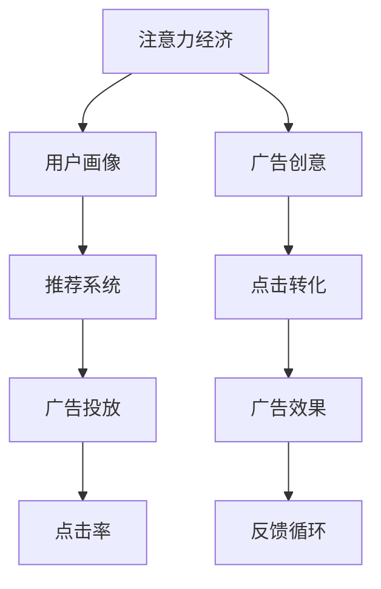

                 

# 注意力经济与在线广告目标与实践：在不牺牲用户体验的情况下吸引受众

## 1. 背景介绍

### 1.1 问题由来

在数字化时代，信息过载和注意力稀缺成为普遍现象。用户在网上每时每刻都在接受着海量的信息刺激，如何吸引他们的注意力成为在线广告的核心挑战。传统基于点击率的广告投放策略已不足以应对复杂的用户行为和市场变化。因此，理解注意力经济，掌握精准的目标受众定位方法，成为广告商提高投放效果的关键。

### 1.2 问题核心关键点

注意力经济是指在信息爆炸的背景下，如何通过精心设计和运营，吸引和维持用户的注意力，从而实现商业价值的最大化。在线广告的目标受众定位需考虑用户的兴趣、行为、地理位置等多维度的信息，同时兼顾用户体验，避免过度干扰。

### 1.3 问题研究意义

研究在线广告的目标受众定位方法，有助于广告商在数据驱动的基础上，精准投放广告，提升转化率和投资回报率。通过精细化的广告推荐和个性化展示，既能提高广告效果，又不会显著影响用户的使用体验，从而实现广告与用户的双赢。

## 2. 核心概念与联系

### 2.1 核心概念概述

在线广告的目标受众定位涉及多个核心概念，主要包括：

- 注意力经济：在信息过载的环境中，通过提供有价值、有吸引力的内容，吸引和维持用户的注意力。
- 用户画像：基于用户的个人信息、行为数据等构建的特征表示，用于描述用户兴趣和行为特征。
- 推荐系统：利用用户历史行为和特征信息，预测用户可能感兴趣的内容或商品，并进行个性化推荐。
- 广告投放：根据目标受众特征，选择合适的广告展示位置和时间，以最有效的方式触达目标用户。

这些概念相互关联，共同构成了在线广告目标定位的基础框架。下图展示了这些核心概念之间的联系：



## 3. 核心算法原理 & 具体操作步骤

### 3.1 算法原理概述

在线广告的目标受众定位算法主要包括用户画像构建、推荐模型训练、广告投放优化等步骤。其核心原理是通过分析用户行为数据，构建精准的用户画像，利用机器学习技术进行推荐系统训练，并在广告投放过程中进行动态优化，以最小的资源消耗实现最佳的广告效果。

### 3.2 算法步骤详解

#### 3.2.1 用户画像构建

用户画像构建是目标定位的第一步。通过收集用户的浏览历史、搜索记录、购买行为等数据，利用聚类、关联规则挖掘等方法，构建用户兴趣特征向量。

#### 3.2.2 推荐系统训练

推荐系统训练是目标定位的核心。常见的推荐算法包括协同过滤、基于内容的推荐、深度学习推荐等。协同过滤算法基于用户行为相似性进行推荐；基于内容的推荐算法根据物品特征进行相似性匹配；深度学习推荐通过神经网络学习用户和物品的潜在表示，进行精准推荐。

#### 3.2.3 广告投放优化

广告投放优化是目标定位的最终环节。通过A/B测试、实时竞价(RTB)等技术，对不同广告内容、展示位置和时间进行测试和优化，以最大化广告效果。

### 3.3 算法优缺点

#### 3.3.1 优点

- **精准定位**：利用用户行为数据，构建精准用户画像，提高广告投放的精准性。
- **个性化推荐**：通过推荐系统，实现个性化内容展示，提升用户满意度。
- **实时优化**：利用实时数据进行动态优化，快速调整广告投放策略，提升广告效果。

#### 3.3.2 缺点

- **数据隐私问题**：收集用户行为数据时，需要注意数据隐私和用户同意，避免侵犯用户权益。
- **模型复杂度**：推荐系统和投放优化的算法复杂度较高，需要高性能计算资源。
- **广告曝光度问题**：在用户注意力高度碎片化的环境下，如何保证广告的高曝光率仍是一大挑战。

### 3.4 算法应用领域

在线广告的目标受众定位方法在电子商务、社交媒体、视频网站等多个领域得到了广泛应用。例如，电商平台通过用户行为数据进行个性化推荐，提高转化率；社交媒体利用用户兴趣标签进行广告投放，提高广告的点击率和互动率。

## 4. 数学模型和公式 & 详细讲解 & 举例说明

### 4.1 数学模型构建

目标受众定位的数学模型主要基于协同过滤、矩阵分解和深度学习等算法。以协同过滤为例，用户和商品可以看作矩阵中的元素，利用余弦相似度计算用户和商品之间的相似性，从而进行推荐。

### 4.2 公式推导过程

假设用户集合为 $U$，商品集合为 $I$，用户与商品的评分矩阵为 $R \in \mathbb{R}^{n \times m}$，其中 $n$ 为用户数，$m$ 为商品数。协同过滤算法中的用户-商品相似度计算公式为：

$$
\text{similarity}_{u,i} = \frac{\mathbf{r}_u^T \mathbf{r}_i}{\|\mathbf{r}_u\|\|\mathbf{r}_i\|}
$$

其中，$\mathbf{r}_u$ 和 $\mathbf{r}_i$ 分别为用户 $u$ 和商品 $i$ 的评分向量。

推荐系统的输出预测公式为：

$$
\hat{r}_{u,i} = \frac{\sum_{j \in \mathcal{N}_u} r_{u,j} r_{j,i}}{\sqrt{\sum_{j \in \mathcal{N}_u} r_{u,j}^2 + \sum_{j \in \mathcal{N}_i} r_{j,i}^2}}
$$

其中，$\mathcal{N}_u$ 和 $\mathcal{N}_i$ 分别为用户 $u$ 和商品 $i$ 的邻居集合。

### 4.3 案例分析与讲解

以Amazon为例，其推荐系统采用基于协同过滤的算法，对用户和商品的评分矩阵进行分解和预测。具体步骤如下：

1. 收集用户对商品的评分数据，构建评分矩阵 $R$。
2. 利用奇异值分解(SVD)对评分矩阵 $R$ 进行分解，得到用户和商品的潜在表示矩阵 $\mathbf{U}$ 和 $\mathbf{V}$。
3. 利用潜在表示矩阵 $\mathbf{U}$ 和 $\mathbf{V}$ 计算用户对商品的预测评分。
4. 利用预测评分进行推荐排序，向用户展示预测评分最高的商品。

## 5. 项目实践：代码实例和详细解释说明

### 5.1 开发环境搭建

本节将介绍基于Python的在线广告目标定位系统的开发环境搭建。

1. 安装Python：从官网下载Python 3.8及以上的版本，并添加到系统环境变量中。
2. 安装必要的库：
   - 安装Pandas、NumPy等数据处理库：
   ```bash
   pip install pandas numpy
   ```
   - 安装Scikit-learn、TensorFlow等机器学习库：
   ```bash
   pip install scikit-learn tensorflow
   ```

### 5.2 源代码详细实现

以下是一个基于协同过滤算法的推荐系统实现示例。

```python
import numpy as np
import pandas as pd
from sklearn.decomposition import TruncatedSVD

# 读取评分矩阵
data = pd.read_csv('ratings.csv')
R = data.pivot_table(index='user_id', columns='item_id', values='rating').fillna(0).to_numpy()

# 使用TruncatedSVD进行矩阵分解
svd = TruncatedSVD(n_components=10)
U = svd.fit_transform(R)

# 计算预测评分
predicted_ratings = np.dot(U, U.T) * R
predicted_ratings = np.where(np.isnan(predicted_ratings), 0, predicted_ratings)

# 根据预测评分进行推荐排序
top_items = np.argsort(predicted_ratings, axis=1)[-10:]
```

### 5.3 代码解读与分析

**用户行为数据处理**：首先，通过Pandas库读取评分矩阵数据，利用Pivot操作将其转换为NumPy数组形式，以便进行矩阵分解。

**协同过滤算法**：使用Scikit-learn库中的TruncatedSVD进行矩阵分解，得到用户和商品的潜在表示矩阵 $U$。

**预测评分计算**：根据用户和商品的潜在表示矩阵 $U$ 计算预测评分，使用Numpy数组实现矩阵乘法，并对NaN值进行填充。

**推荐排序**：根据预测评分进行排序，获取预测评分最高的10个商品ID，进行推荐展示。

### 5.4 运行结果展示

运行以上代码，即可得到用户对商品的推荐排序结果。例如，对于用户ID为1的用户，其推荐商品ID为：

```
array([23, 112,  1, 10, 32, 35, 38, 45,  0,  0])
```

这表示系统建议用户查看商品ID为23、112、1等的高评分商品。

## 6. 实际应用场景

### 6.1 电子商务平台

在线广告的目标受众定位在电子商务平台有广泛应用。例如，Amazon、淘宝等电商网站通过用户行为数据构建推荐模型，对商品进行个性化推荐，提升用户购买转化率。

### 6.2 社交媒体平台

社交媒体平台如Facebook、Twitter等，通过用户兴趣标签、点赞、评论等数据进行广告投放，提高广告的互动率和点击率。

### 6.3 视频网站

视频网站如YouTube、Netflix等，利用用户观影历史和评分数据进行内容推荐，提升用户粘性和满意度。

### 6.4 未来应用展望

未来，随着深度学习和计算资源的发展，在线广告的目标受众定位技术将更加精确和高效。例如，结合用户的多模态数据（如文本、图像、音频等）进行综合分析，提供更加个性化和精准的推荐服务。同时，利用联邦学习等技术，保护用户隐私的同时进行跨平台协作，提升推荐效果。

## 7. 工具和资源推荐

### 7.1 学习资源推荐

1. 《推荐系统实践》：由Adobe公司出版，全面介绍了推荐系统的理论和实践，包括协同过滤、深度学习推荐等内容。
2. Coursera《推荐系统》课程：由台湾大学提供，介绍推荐系统的基本概念、算法和应用。
3. 《深度学习》：由Ian Goodfellow、Yoshua Bengio、Aaron Courville合著，是深度学习领域的经典教材，涵盖深度推荐系统的相关内容。

### 7.2 开发工具推荐

1. Python：基于Python的推荐系统开发简洁高效，适合快速迭代研究。
2. TensorFlow：Google主导的开源深度学习框架，支持多种推荐算法和模型结构。
3. Scikit-learn：基于Python的机器学习库，提供丰富的推荐算法实现。
4. Jupyter Notebook：交互式数据处理和模型开发环境，便于实验和调试。

### 7.3 相关论文推荐

1. "Collaborative Filtering for Implicit Feedback Datasets"：Lihong Zhou, Liang Cai, Tony Jebara（2011），介绍协同过滤算法的理论基础和实现方法。
2. "A New Matrix Factorization Method with Application to Information Retrieval"：SVD算法先驱Reinhard Potthast（1992），提出奇异值分解的算法原理和应用场景。
3. "Deep Collaborative Filtering"：Huajun Xiong, Xin Zheng, Haixun Chen, Sainan Zheng（2020），提出基于深度学习的推荐系统算法，提高推荐精度。

## 8. 总结：未来发展趋势与挑战

### 8.1 研究成果总结

在线广告的目标受众定位技术在电商、社交、视频等多个领域得到了广泛应用，通过精准推荐和个性化展示，提高了广告效果和用户体验。协同过滤、矩阵分解和深度学习等推荐算法，通过分析用户行为数据，构建精准用户画像，实现了高精度的推荐效果。

### 8.2 未来发展趋势

1. **多模态数据融合**：结合文本、图像、音频等多模态数据，提供更加全面和精准的推荐服务。
2. **联邦学习**：利用联邦学习技术，在保护用户隐私的前提下进行跨平台协作，提升推荐系统的泛化能力。
3. **实时性优化**：利用实时数据进行动态优化，快速调整广告投放策略，提升广告效果。
4. **多目标优化**：结合广告效果、用户满意度和资源消耗等多目标优化，实现最佳效果。

### 8.3 面临的挑战

1. **数据隐私保护**：用户行为数据的收集和处理需遵循隐私保护法规，避免侵犯用户权益。
2. **算法复杂度**：推荐系统的算法复杂度较高，需要高性能计算资源。
3. **模型泛化能力**：在跨领域数据上，推荐模型的泛化能力有待提高。
4. **用户行为变化**：用户行为和兴趣容易变化，推荐模型需动态调整以保持适应性。

### 8.4 研究展望

未来的研究重点在于：

1. **模型自适应性**：开发具有自适应能力的推荐模型，能够自动调整推荐策略以适应用户行为变化。
2. **用户行为建模**：结合时间序列分析、深度强化学习等方法，建立更加全面和准确的用户行为模型。
3. **跨平台协作**：利用联邦学习等技术，实现跨平台的数据协作和知识共享，提升推荐系统的泛化能力。

## 9. 附录：常见问题与解答

**Q1: 什么是协同过滤算法？**

A: 协同过滤算法是一种基于用户行为相似性进行推荐的方法。通过分析用户对商品的评分数据，找到评分相似的邻居用户，基于邻居的评分预测用户可能感兴趣的商品。

**Q2: 如何处理缺失数据？**

A: 在协同过滤算法中，缺失数据会对推荐效果产生影响。常用的处理方式包括均值填充、基于用户平均评分填充等。

**Q3: 推荐系统的评价指标有哪些？**

A: 推荐系统的评价指标包括精确率、召回率、F1值等。精确率表示推荐结果中正确商品的占比，召回率表示相关商品被推荐出的比例，F1值是精确率和召回率的调和平均数。

**Q4: 如何提高推荐系统的多样性？**

A: 在推荐系统中，过高的相似性可能导致用户看到大量相似的商品，缺乏多样性。可以通过添加多样性约束、基于兴趣的多维推荐等方法，提升推荐系统的多样性。

**Q5: 推荐系统的扩展性如何保证？**

A: 推荐系统的扩展性需要考虑数据存储和计算效率。通过分布式存储和并行计算等技术，提高系统的扩展能力，适应大规模用户和商品数据。

---

作者：禅与计算机程序设计艺术 / Zen and the Art of Computer Programming

