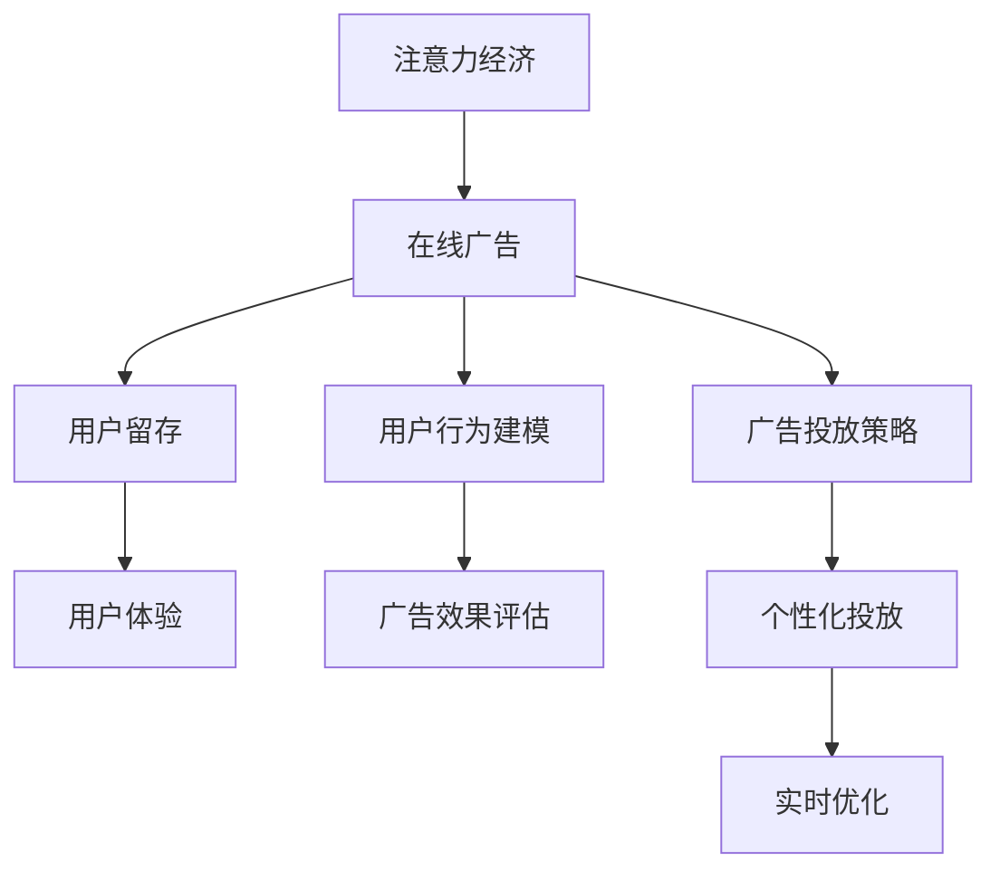

                 

# 注意力经济与在线广告目标：在不牺牲用户体验的情况下有效吸引受众

> 关键词：注意力经济,在线广告,用户留存,用户体验,数据驱动

## 1. 背景介绍

### 1.1 问题由来
在互联网高速发展的今天，注意力经济已成为推动在线广告业务发展的核心动力。广告主期望以最小的成本，吸引并留住更多用户，从而增加品牌曝光率和用户参与度。然而，简单的点击量或展示次数已不再能完全反映广告的效果，用户体验（User Experience, UX）越来越受到重视。如何在不牺牲用户体验的前提下，高效吸引目标受众，成为在线广告领域的一大难题。

### 1.2 问题核心关键点
本问题聚焦于在线广告目标的设定和优化，旨在探索如何在数据驱动的框架下，通过精确的算法和策略，在不影响用户体验的前提下，提升广告的转化率和留存率。主要问题点包括：

1. **广告投放策略**：如何通过数据分析，找到最有效的投放时机和渠道。
2. **用户行为建模**：如何通过机器学习，预测用户对广告的反应，以便进行个性化投放。
3. **广告效果评估**：如何设计评估指标，衡量广告在提升用户参与度和留存率方面的效果。
4. **用户体验保护**：如何在广告展示中，尽量减少对用户的干扰，提升用户体验。

### 1.3 问题研究意义
本研究对于在线广告的业务优化具有重要意义：

1. **提升广告效果**：通过数据驱动的策略，实现对用户行为的精准预测和广告效果的实时评估，提高广告转化率。
2. **改善用户体验**：保护用户隐私，避免广告对用户日常使用产生负面影响，提升用户满意度。
3. **优化广告投放**：找到最适合目标受众的投放策略和渠道，最大化广告效益。
4. **推动业务增长**：提高广告投放的精准度和效果，助力广告主实现商业目标。

## 2. 核心概念与联系

### 2.1 核心概念概述

为更好地理解问题解决思路，本节将介绍几个核心概念及其联系：

- **注意力经济（Attention Economy）**：指的是在信息过载时代，人们难以处理所有信息，因此注意力成为稀缺资源。在线广告业需通过吸引注意力，提高信息处理效率，实现价值增值。
- **在线广告（Online Advertising）**：通过互联网平台展示的广告形式，包括展示广告、搜索广告、社交广告等。目标是吸引用户注意力，促进用户参与和购买。
- **用户留存（User Retention）**：衡量用户长期使用产品的指标，包括日活（DAU）、月活（MAU）等，高留存率意味着用户对产品具有较强的粘性。
- **用户体验（User Experience, UX）**：用户在使用产品时的感觉和反应，包括界面设计、操作流畅性、内容相关性等。

这些核心概念构成了在线广告业务的基础，通过深入分析用户行为和偏好，设计个性化的广告投放策略，实现用户体验与广告效果的平衡。

### 2.2 核心概念原理和架构的 Mermaid 流程图



此流程图展示了注意力经济与在线广告之间的关系，以及各个核心概念间的联系。

- 注意力经济提供广告展示的基础价值。
- 在线广告通过吸引注意力，提升用户参与度。
- 用户留存是广告效果的关键指标。
- 用户体验是广告投放的制约因素。
- 用户行为建模和广告效果评估，是实现个性化投放和效果优化的基础。
- 广告投放策略和个性化投放，是实现广告目标的具体手段。
- 实时优化确保广告投放效果的最佳化。

## 3. 核心算法原理 & 具体操作步骤

### 3.1 算法原理概述

在线广告目标的设定和优化，本质上是多目标优化问题。广告主希望在提升用户参与度和留存率的同时，尽量减少对用户体验的负面影响。这需要设计有效的算法，通过数据分析和模型训练，找到最佳的广告投放策略和效果评估指标。

核心算法包括：

1. **个性化推荐算法**：根据用户历史行为和偏好，推荐最相关的广告内容。
2. **用户行为预测模型**：使用机器学习模型，预测用户对不同广告的反应，指导投放策略。
3. **广告效果评估指标**：定义能反映用户参与度和留存率的指标，如点击率（CTR）、转化率（CR）、日活增长率等。
4. **实时优化算法**：通过持续监测广告效果，动态调整投放参数和策略。

### 3.2 算法步骤详解

在线广告目标的优化主要包括以下步骤：

**Step 1: 数据收集与处理**
- 收集广告主的投放数据、用户行为数据和广告效果数据。
- 清洗数据，去除噪音和异常值，确保数据的质量和完整性。

**Step 2: 用户行为建模**
- 使用统计学和机器学习技术，建立用户行为模型。如使用协同过滤（Collaborative Filtering）算法，基于用户历史行为预测其未来行为。
- 分析用户在不同广告上的反应，识别用户对广告内容、形式、时机等特征的偏好。

**Step 3: 广告效果评估**
- 定义广告效果评估指标，如CTR、CR、用户留存率等。
- 使用A/B测试等方法，评估不同广告策略的效果，找到最优的投放组合。

**Step 4: 个性化广告投放**
- 根据用户行为模型，推荐最相关的广告内容。
- 使用动态广告投放策略，根据用户反馈实时调整广告内容和形式。

**Step 5: 实时优化**
- 使用强化学习等实时优化算法，动态调整投放参数和策略，如调整广告预算分配、优化投放渠道等。
- 持续监测广告效果，及时发现问题并进行调整。

### 3.3 算法优缺点

在线广告目标的优化方法具有以下优点：

1. **提升广告效果**：通过个性化推荐和精准投放，提高广告转化率和用户参与度。
2. **改善用户体验**：通过优化广告形式和时机，减少对用户的干扰，提升用户体验。
3. **实时调整策略**：通过实时优化算法，动态调整广告投放策略，适应用户行为变化。

同时，这些方法也存在一定的局限性：

1. **数据需求高**：需要大量的用户行为和广告效果数据，数据收集和处理成本较高。
2. **模型复杂**：涉及复杂的机器学习和强化学习模型，算法实现和维护难度较大。
3. **隐私保护**：在用户行为建模和广告投放中，可能涉及用户隐私保护问题，需要设计有效的隐私保护措施。

### 3.4 算法应用领域

在线广告目标的优化方法已在多个领域得到应用，如电商、新闻、社交媒体等。具体应用包括：

1. **电商平台**：通过个性化推荐和广告投放，提高用户购买转化率和平台活跃度。
2. **新闻媒体**：通过精准投放，提升广告点击率和用户留存率，增加平台流量。
3. **社交平台**：通过广告形式和时机的优化，提高用户参与度和平台粘性。

## 4. 数学模型和公式 & 详细讲解 & 举例说明

### 4.1 数学模型构建

本节将使用数学语言对在线广告目标的优化方法进行更加严格的刻画。

记广告主的投放数据为 $D=\{(x_i, y_i)\}_{i=1}^N$，其中 $x_i$ 为用户行为特征向量，$y_i$ 为广告投放结果（如点击与否）。定义广告效果评估指标 $L$ 为：

$$
L = \sum_{i=1}^N \omega_i f_i(x_i, y_i)
$$

其中 $\omega_i$ 为权重，$f_i(x_i, y_i)$ 为广告效果函数，如点击率、转化率等。目标是最小化广告成本 $C$，同时最大化广告效果 $L$：

$$
\min_{\theta} C + \lambda L
$$

其中 $\theta$ 为广告投放策略的参数，$\lambda$ 为正则化系数。

### 4.2 公式推导过程

以下我们以点击率（CTR）优化为例，推导广告效果评估函数 $f_i(x_i, y_i)$ 和最优广告策略的求解公式。

假设广告投放策略为 $g(x)$，用户行为特征为 $x$，点击概率为 $y$。广告效果函数定义为：

$$
f_i(x_i, y_i) = \mathbb{I}(y_i = 1) g(x_i)
$$

其中 $\mathbb{I}$ 为示性函数，$g(x)$ 为广告投放策略函数。广告投放策略的参数 $\theta$ 为模型的权重。

广告效果优化目标为：

$$
\min_{\theta} C + \lambda \sum_{i=1}^N \omega_i \mathbb{I}(y_i = 1) g(x_i)
$$

令 $L = \sum_{i=1}^N \omega_i \mathbb{I}(y_i = 1) g(x_i)$，则优化目标可以重写为：

$$
\min_{\theta} C + \lambda L
$$

假设广告投放策略函数 $g(x)$ 为线性函数：

$$
g(x) = \theta^T \phi(x)
$$

其中 $\theta \in \mathbb{R}^d$ 为模型参数，$\phi(x)$ 为特征映射函数。将 $g(x)$ 带入优化目标，得：

$$
\min_{\theta} C + \lambda \sum_{i=1}^N \omega_i \mathbb{I}(y_i = 1) \theta^T \phi(x_i)
$$

利用梯度下降等优化算法，求解上述最优化问题。假设 $\eta$ 为学习率，则参数的更新公式为：

$$
\theta \leftarrow \theta - \eta \nabla_{\theta}(C + \lambda L)
$$

其中 $\nabla_{\theta}(C + \lambda L)$ 为目标函数对参数 $\theta$ 的梯度，可通过反向传播算法高效计算。

### 4.3 案例分析与讲解

假设广告主在电商平台上进行广告投放，希望提升用户的购买转化率。具体步骤如下：

1. **数据收集**：收集用户在平台上的浏览记录、购买记录、点击记录等数据，构建用户行为特征向量 $x$。
2. **广告效果评估**：定义点击率（CTR）作为广告效果评估指标 $L$。
3. **优化目标**：最小化广告投放成本 $C$，同时最大化点击率 $L$。
4. **模型选择**：选择线性回归模型或逻辑回归模型，作为广告投放策略函数 $g(x)$。
5. **参数更新**：使用梯度下降等优化算法，最小化广告投放成本和点击率的最大化。

在模型训练过程中，需要注意以下几个关键点：

1. **特征工程**：选择合适的特征，构建特征向量 $\phi(x)$，提高模型的预测能力。
2. **模型选择**：根据广告效果的性质选择合适的模型，如线性回归、逻辑回归等。
3. **正则化**：使用L2正则化等技术，防止模型过拟合。
4. **超参数调优**：调整学习率、批大小、迭代轮数等超参数，优化模型效果。

## 5. 项目实践：代码实例和详细解释说明

### 5.1 开发环境搭建

在进行在线广告目标优化实践前，我们需要准备好开发环境。以下是使用Python进行PyTorch开发的环境配置流程：

1. 安装Anaconda：从官网下载并安装Anaconda，用于创建独立的Python环境。

2. 创建并激活虚拟环境：
```bash
conda create -n pytorch-env python=3.8 
conda activate pytorch-env
```

3. 安装PyTorch：根据CUDA版本，从官网获取对应的安装命令。例如：
```bash
conda install pytorch torchvision torchaudio cudatoolkit=11.1 -c pytorch -c conda-forge
```

4. 安装TensorFlow：如果需要在TensorFlow下进行广告效果优化，可以使用以下命令：
```bash
conda install tensorflow tensorflow-estimator tensorflow-addons
```

5. 安装各类工具包：
```bash
pip install numpy pandas scikit-learn matplotlib tqdm jupyter notebook ipython
```

完成上述步骤后，即可在`pytorch-env`环境中开始广告效果优化实践。

### 5.2 源代码详细实现

下面我们以电商平台的广告投放优化为例，给出使用PyTorch进行广告效果优化的PyTorch代码实现。

首先，定义广告投放数据和用户行为特征：

```python
import torch
import torch.nn as nn
from torch.utils.data import Dataset, DataLoader

class AdDataset(Dataset):
    def __init__(self, ads, users, click, ad_features):
        self.ads = ads
        self.users = users
        self.click = click
        self.ad_features = ad_features
        self.len = len(self.ads)

    def __len__(self):
        return self.len
    
    def __getitem__(self, index):
        ad = self.ads[index]
        user = self.users[index]
        click = self.click[index]
        ad_features = self.ad_features[index]
        
        return {'ad': ad, 'user': user, 'click': click, 'ad_features': ad_features}
```

然后，定义广告效果优化模型和优化器：

```python
import torch.optim as optim

class AdOptimizer(nn.Module):
    def __init__(self, ad, user, click, ad_features, optimizer):
        super(AdOptimizer, self).__init__()
        self.ad = ad
        self.user = user
        self.click = click
        self.ad_features = ad_features
        self.optimizer = optimizer

    def forward(self):
        ad = self.ad
        user = self.user
        click = self.click
        ad_features = self.ad_features

        # 构建广告效果评估函数
        click_loss = torch.nn.BCELoss()

        # 构建广告投放策略函数
        ad_model = nn.Sequential(
            nn.Linear(ad_features.shape[1], 1),
            nn.Sigmoid()
        )

        # 定义广告效果目标
        loss = click_loss(ad_model(ad_features), torch.tensor(click))

        # 计算梯度
        loss.backward()

        # 更新参数
        self.optimizer.step()

        return loss.item()
```

最后，启动广告效果优化流程：

```python
epochs = 10
batch_size = 32
learning_rate = 0.01

ad_dataset = AdDataset(ad_data, user_data, click_data, ad_features)

model = AdOptimizer(ad_dataset, batch_size=batch_size, optimizer=optim.Adam(ad_dataset, lr=learning_rate))

for epoch in range(epochs):
    loss = model(ad_dataset, batch_size, optimizer)
    print(f"Epoch {epoch+1}, loss: {loss:.4f}")
```

以上就是使用PyTorch进行广告效果优化的完整代码实现。可以看到，通过定义广告效果评估函数、广告投放策略函数和优化器，可以方便地实现广告效果的优化。

### 5.3 代码解读与分析

让我们再详细解读一下关键代码的实现细节：

**AdDataset类**：
- `__init__`方法：初始化广告数据、用户数据、点击数据和广告特征向量。
- `__len__`方法：返回数据集的样本数量。
- `__getitem__`方法：对单个样本进行处理，将广告数据、用户数据、点击数据和广告特征向量打包，并返回给模型。

**AdOptimizer类**：
- `__init__`方法：初始化广告数据、用户数据、点击数据、广告特征向量和优化器。
- `forward`方法：定义广告效果评估函数、广告投放策略函数和优化器，计算梯度并更新模型参数。

**广告效果优化流程**：
- 定义总的epoch数、batch size和学习率，开始循环迭代。
- 每个epoch内，在广告数据集上进行前向传播计算损失，反向传播计算梯度，并更新模型参数。
- 重复上述过程直至收敛，最终得到最小化广告投放成本和最大化广告效果的目标函数。

可以看到，通过使用PyTorch框架，广告效果优化任务的实现变得简洁高效。开发者可以将更多精力放在模型设计、特征选择和超参数调优等高层逻辑上，而不必过多关注底层的实现细节。

## 6. 实际应用场景

### 6.1 智能推荐系统

在线广告优化技术在智能推荐系统中得到了广泛应用。智能推荐系统通过分析用户历史行为和兴趣，推荐最相关的商品或内容，提升用户满意度和留存率。

在技术实现上，可以收集用户的历史浏览、点击、购买记录，利用机器学习模型预测用户对不同商品或内容的兴趣，实时调整推荐策略。例如，当用户点击某商品时，可以进一步展示类似商品或相关内容的广告，增加用户的购买概率。

### 6.2 精准营销

精准营销是广告主追求的目标，通过分析用户的行为特征和偏好，在合适的时间和地点展示最相关的广告，提高广告的点击率和转化率。

在实际应用中，可以收集用户的行为数据，如点击位置、点击时间等，结合地理信息、天气等外部的辅助信息，使用机器学习模型预测用户的兴趣点。例如，在用户浏览天气应用时，展示相关的旅游、酒店等广告，提高广告的转化率。

### 6.3 社交媒体广告

社交媒体广告的目标是提高用户的参与度和留存率，通过个性化推荐和精准投放，增加用户的活跃度和粘性。

在社交媒体平台上，可以收集用户的互动数据，如点赞、评论、分享等，利用机器学习模型预测用户对不同广告的反应。例如，在用户发布动态时，展示相关的产品广告，提高广告的点击率和转化率。

## 7. 工具和资源推荐

### 7.1 学习资源推荐

为了帮助开发者系统掌握在线广告目标优化的理论基础和实践技巧，这里推荐一些优质的学习资源：

1. 《Deep Learning for Advertising》系列博文：由在线广告技术专家撰写，介绍了深度学习在广告投放和效果优化中的应用。

2. CS231n《深度学习视觉识别》课程：斯坦福大学开设的计算机视觉课程，涵盖深度学习在图像和视频广告中的应用。

3. 《Hands-On Machine Learning with Scikit-Learn and TensorFlow》书籍：由机器学习专家撰写，全面介绍了使用Scikit-Learn和TensorFlow进行广告效果优化的实战技巧。

4. Kaggle在线竞赛平台：提供了大量广告效果优化的竞赛数据集，可供学习和实践。

5. Google AdWords广告优化指南：Google官方提供的广告效果优化指南，涵盖广告投放、效果评估和实时优化等多个方面。

通过对这些资源的学习实践，相信你一定能够快速掌握在线广告目标优化的精髓，并用于解决实际的广告效果优化问题。

### 7.2 开发工具推荐

高效的开发离不开优秀的工具支持。以下是几款用于在线广告目标优化开发的常用工具：

1. PyTorch：基于Python的开源深度学习框架，灵活动态的计算图，适合快速迭代研究。大部分预训练语言模型都有PyTorch版本的实现。

2. TensorFlow：由Google主导开发的开源深度学习框架，生产部署方便，适合大规模工程应用。同样有丰富的预训练语言模型资源。

3. Weights & Biases：模型训练的实验跟踪工具，可以记录和可视化模型训练过程中的各项指标，方便对比和调优。与主流深度学习框架无缝集成。

4. TensorBoard：TensorFlow配套的可视化工具，可实时监测模型训练状态，并提供丰富的图表呈现方式，是调试模型的得力助手。

5. Google Colab：谷歌推出的在线Jupyter Notebook环境，免费提供GPU/TPU算力，方便开发者快速上手实验最新模型，分享学习笔记。

合理利用这些工具，可以显著提升在线广告目标优化的开发效率，加快创新迭代的步伐。

### 7.3 相关论文推荐

在线广告目标优化技术的发展源于学界的持续研究。以下是几篇奠基性的相关论文，推荐阅读：

1. "Click-Through Rates Prediction and Cost Estimation with Deep Neural Networks"：由IBM的Alonso Smith等提出，讨论了深度神经网络在广告点击率预测和成本估计中的应用。

2. "Personalized Display Advertising: Learning Out-of-Home Impression Value from On-Line Behavior"：由微软的Liu Xinyan等提出，研究了如何将在线行为数据应用于广告效果的优化。

3. "Ad-Relevance Prediction with Deep Learning"：由Facebook的Zhang et al.提出，讨论了使用深度学习模型进行广告相关性预测的框架。

4. "Recommender Systems for Online Services: Architecture, Trends and Challenges"：由腾讯的Huawei et al.提出，综述了推荐系统在在线服务中的应用，包括广告效果优化。

5. "Online Advertising with Deep Learning: A Survey"：由Notre Dame University的Sia et al.提出，综述了深度学习在在线广告投放和效果优化中的应用。

这些论文代表了大语言模型微调技术的发展脉络。通过学习这些前沿成果，可以帮助研究者把握学科前进方向，激发更多的创新灵感。

## 8. 总结：未来发展趋势与挑战

### 8.1 总结

本文对在线广告目标的设定和优化方法进行了全面系统的介绍。首先阐述了在线广告业务优化背景和意义，明确了广告投放策略、用户行为建模、广告效果评估和用户体验保护等关键点。其次，从原理到实践，详细讲解了在线广告目标优化的数学模型和算法步骤，给出了广告效果优化的完整代码实例。同时，本文还广泛探讨了在线广告目标优化在智能推荐系统、精准营销、社交媒体广告等多个领域的应用前景，展示了广告目标优化的广阔空间。此外，本文精选了在线广告目标优化的各类学习资源，力求为读者提供全方位的技术指引。

通过本文的系统梳理，可以看到，在线广告目标优化技术在大数据、人工智能等技术支持下，正逐步成为在线广告业务优化的重要手段。通过数据驱动的精准投放和实时优化，广告主可以更高效地提升广告效果，同时保护用户隐私，提升用户体验。未来，随着数据技术和人工智能技术的进一步发展，在线广告目标优化将带来更多的可能性，助力广告主实现更高的商业目标。

### 8.2 未来发展趋势

展望未来，在线广告目标优化技术将呈现以下几个发展趋势：

1. **多模态广告效果优化**：结合图像、视频、语音等多模态数据，提升广告效果的准确性和用户参与度。
2. **实时动态优化**：通过实时监测广告效果，动态调整投放策略，实现广告效果的最大化。
3. **个性化推荐**：利用深度学习模型，实现更精准的用户行为预测和个性化广告推荐。
4. **隐私保护技术**：引入差分隐私、联邦学习等技术，保护用户隐私，确保广告投放的合法性和道德性。
5. **实时监测与分析**：通过大数据分析，实时监测广告效果，发现并解决广告投放中存在的问题，优化广告策略。

以上趋势凸显了在线广告目标优化技术的广阔前景。这些方向的探索发展，必将进一步提升在线广告系统的效率和效果，推动广告主的业务增长。

### 8.3 面临的挑战

尽管在线广告目标优化技术已经取得了瞩目成就，但在迈向更加智能化、普适化应用的过程中，它仍面临着诸多挑战：

1. **数据隐私问题**：广告投放和效果优化过程中，涉及大量用户隐私数据，如何在保障数据安全的同时，实现广告效果的最大化，是一大难题。
2. **广告投放策略的复杂性**：广告投放策略的设计和优化，需要考虑多个因素，如用户行为、广告内容、投放渠道等，复杂度高，难以找到最优策略。
3. **广告效果的实时性要求**：广告效果评估和优化需要实时进行，数据量庞大，计算复杂，对系统性能要求高。
4. **多渠道广告的整合**：不同渠道的广告投放和效果评估差异较大，如何整合多个渠道的广告数据，实现统一的效果评估和优化，仍是一大挑战。
5. **用户反馈的实时处理**：广告投放过程中，用户反馈的信息需要实时处理和分析，快速调整广告策略，以提升用户体验。

正视在线广告目标优化面临的这些挑战，积极应对并寻求突破，将是大数据、人工智能等技术进一步发展的必由之路。相信随着学界和产业界的共同努力，这些挑战终将一一被克服，在线广告目标优化技术必将在构建人机协同的智能广告生态中扮演越来越重要的角色。

### 8.4 研究展望

面对在线广告目标优化所面临的挑战，未来的研究需要在以下几个方面寻求新的突破：

1. **引入更多先验知识**：将符号化的先验知识，如知识图谱、逻辑规则等，与神经网络模型进行融合，引导广告效果优化的过程。
2. **多渠道广告整合**：结合不同渠道的广告数据，实现统一的效果评估和优化，提升广告投放的效率和效果。
3. **实时监测与优化**：引入实时监测与优化算法，动态调整广告投放策略，实现广告效果的最大化。
4. **用户隐私保护**：引入差分隐私、联邦学习等技术，保护用户隐私，确保广告投放的合法性和道德性。
5. **广告效果的全面评估**：引入更多广告效果评估指标，如用户满意度、品牌认知度等，全面评估广告效果。

这些研究方向的探索，必将引领在线广告目标优化技术迈向更高的台阶，为广告主的业务增长提供更强大的技术支持。面向未来，在线广告目标优化技术需要与其他人工智能技术进行更深入的融合，如知识表示、因果推理、强化学习等，多路径协同发力，共同推动广告系统的发展。只有勇于创新、敢于突破，才能不断拓展在线广告目标优化的边界，实现更高的商业价值。

## 9. 附录：常见问题与解答

**Q1：在线广告目标优化中，如何处理数据隐私问题？**

A: 在线广告目标优化中，数据隐私问题是一个需要特别关注的问题。以下是一些常见的处理方法：

1. **差分隐私（Differential Privacy）**：在数据收集和处理过程中，通过引入噪音，保护用户数据的隐私，确保单个用户的数据难以被识别。

2. **联邦学习（Federated Learning）**：在用户端进行模型训练，将模型参数汇总到中心服务器，进行全局优化。这种方法可以避免数据集中存储，保护用户隐私。

3. **匿名化（Anonymization）**：在数据处理过程中，去除与用户身份直接相关的信息，如IP地址、设备信息等，保护用户隐私。

4. **安全多方计算（Secure Multi-Party Computation）**：在多参与方之间进行数据处理时，各方保留自己的数据，通过加密和计算技术，实现数据处理的隐私保护。

通过采用这些隐私保护技术，可以在不损害广告效果的前提下，保护用户隐私，确保广告投放的合法性和道德性。

**Q2：如何选择合适的广告投放策略？**

A: 选择合适的广告投放策略，需要综合考虑多个因素，如广告内容、用户行为、广告预算等。以下是一些常用的方法：

1. **A/B测试**：通过随机分组的方式，比较不同广告策略的效果，选择最优的投放策略。

2. **多臂老虎机（Multi-Armed Bandit）算法**：通过模拟赌场的多臂老虎机问题，动态调整广告投放策略，选择最优的投放渠道和内容。

3. **强化学习**：通过学习用户对不同广告的反应，动态调整广告投放策略，优化广告效果。

4. **推荐系统**：利用用户历史行为和兴趣，推荐最相关的广告内容，提升广告的点击率和转化率。

选择合适的广告投放策略需要根据具体业务需求和数据特点进行灵活选择。只有找到最适合的广告投放策略，才能实现最佳的广告效果。

**Q3：广告效果评估有哪些关键指标？**

A: 广告效果评估的关键指标包括点击率（CTR）、转化率（CR）、用户留存率等。具体如下：

1. **点击率（CTR）**：衡量广告的曝光和点击效果，定义为广告点击次数与广告曝光次数的比率。

2. **转化率（CR）**：衡量广告的转化效果，定义为广告带来的有效行为（如购买、注册）次数与广告曝光次数的比率。

3. **用户留存率**：衡量用户在广告展示后的留存情况，包括日活（DAU）、月活（MAU）等，高留存率意味着用户对广告的认可和依赖。

4. **广告投放成本（CPC）**：衡量广告投放的效率，定义为广告点击成本或展示成本。

5. **广告收益（ROI）**：衡量广告投放的经济效益，定义为广告收益与广告成本的比率。

选择合适的广告效果评估指标，可以更准确地评估广告投放的效果，优化广告策略，提升广告主的市场竞争力。

**Q4：如何在广告投放过程中保护用户体验？**

A: 在广告投放过程中，保护用户体验是至关重要的。以下是一些常见的方法：

1. **非侵入性广告**：设计简洁、美观的广告内容，避免对用户日常使用产生干扰。

2. **可控广告展示**：允许用户自行选择是否展示广告，如使用弹出窗口的关闭按钮等。

3. **个性化广告**：根据用户兴趣和行为，推荐最相关的广告内容，提升用户满意度。

4. **广告频次控制**：限制广告的展示次数，避免用户过度接触同类型广告。

5. **用户体验评估**：定期收集用户反馈，分析广告对用户体验的影响，及时调整广告策略。

通过采用这些方法，可以在提升广告效果的同时，保护用户的隐私和体验，确保广告投放的可持续性。

**Q5：在线广告目标优化的未来趋势是什么？**

A: 在线广告目标优化的未来趋势主要包括以下几个方面：

1. **多模态广告效果优化**：结合图像、视频、语音等多模态数据，提升广告效果的准确性和用户参与度。

2. **实时动态优化**：通过实时监测广告效果，动态调整投放策略，实现广告效果的最大化。

3. **个性化推荐**：利用深度学习模型，实现更精准的用户行为预测和个性化广告推荐。

4. **隐私保护技术**：引入差分隐私、联邦学习等技术，保护用户隐私，确保广告投放的合法性和道德性。

5. **实时监测与分析**：通过大数据分析，实时监测广告效果，发现并解决广告投放中存在的问题，优化广告策略。

这些趋势展示了在线广告目标优化的广阔前景，未来的技术创新将带来更多可能性，推动广告主实现更高的商业目标。

---

作者：禅与计算机程序设计艺术 / Zen and the Art of Computer Programming

