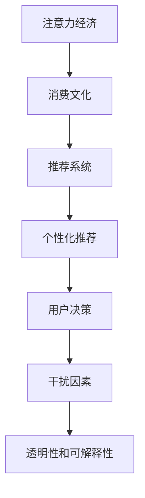

                 

# 注意力经济与消费文化：如何在充满干扰的世界中做出明智的购买决策

> 关键词：注意力经济,消费文化,用户决策,干扰,推荐算法,个性化推荐

## 1. 背景介绍

### 1.1 问题由来

在数字化和全球化的浪潮下，信息过载已经成为现代社会的一个显著特征。大量信息源不断涌入用户的视野，用户注意力资源日益分散。这一现象催生了“注意力经济”概念的兴起，强调在注意力稀缺的时代，如何高效利用和分配注意力资源成为企业和社会亟待解决的课题。

在消费文化层面，随着互联网和社交媒体的发展，用户消费行为和决策路径也在发生深刻变化。传统的线下购物逐渐被线上购物、订阅经济等新兴消费模式所取代，品牌和商家需要借助更智能、更精准的推荐算法来满足用户个性化需求，提升用户体验和销售额。

然而，在充满干扰的世界中，用户往往难以做出明智的购买决策，容易受到广告、推广等干扰因素的影响。因此，如何在纷繁复杂的信息流中，引导用户做出符合自身偏好的购买决策，成为当前技术和商业研究的一个热点问题。

### 1.2 问题核心关键点

- **注意力稀缺**：在信息过载的时代，用户的注意力成为最宝贵的资源。如何分配和管理好用户注意力，成为企业争夺用户的核心手段。
- **个性化推荐**：通过分析用户行为数据，利用机器学习技术为用户推荐符合其兴趣和需求的商品，提升用户体验和转化率。
- **决策干扰**：广告、推送等外部干扰因素会影响用户决策过程，使得个性化推荐系统的效果大打折扣。
- **推荐系统透明性**：如何使推荐系统具备一定的透明度，让用户理解并信任推荐结果，是提高推荐效果的关键。
- **用户心理与行为**：深入理解用户心理和行为特征，设计更具吸引力的推荐内容和交互界面，是提升推荐效果的重要因素。

## 2. 核心概念与联系

### 2.1 核心概念概述

为更好地理解在注意力经济和消费文化背景下，推荐系统如何做出明智的购买决策，本节将介绍几个密切相关的核心概念：

- **注意力经济**：一种新的经济模式，强调注意力作为稀缺资源的价值。在信息过载的背景下，如何高效分配和管理注意力，成为企业和消费者互动的核心。
- **消费文化**：由广告、媒体等塑造的文化现象，影响消费者的行为和决策过程。消费文化决定了用户对于商品、服务、品牌等的信息获取和决策方式。
- **推荐系统**：利用机器学习算法，根据用户的历史行为和兴趣，为用户推荐符合其需求的商品和服务。推荐系统的目标是提升用户体验和销售额。
- **用户决策**：用户在做出购买决策时的心理和行为过程，包括需求识别、信息搜索、比较评价等步骤。
- **干扰因素**：广告、推广、社交媒体等外部干扰因素，可能影响用户的决策过程和推荐系统的效果。
- **透明性和可解释性**：推荐系统的推荐结果应具有一定的透明性和可解释性，使用户理解推荐逻辑，提升信任度。
- **个性化推荐**：通过分析用户行为数据，利用机器学习技术为用户推荐符合其兴趣和需求的商品，提升用户体验和转化率。

这些核心概念之间的逻辑关系可以通过以下Mermaid流程图来展示：



这个流程图展示了大语言模型微调的各个核心概念及其之间的关系：

1. 注意力经济通过消费文化影响推荐系统。
2. 推荐系统基于个性化推荐技术为用户提供决策支持。
3. 用户决策受到干扰因素的影响。
4. 透明性和可解释性提升用户信任度。

这些概念共同构成了推荐系统做出明智购买决策的框架，帮助我们理解背后的原理和设计思路。

## 3. 核心算法原理 & 具体操作步骤
### 3.1 算法原理概述

在充满干扰的世界中，推荐系统通过分析用户行为数据，利用机器学习算法，为用户推荐符合其兴趣和需求的商品，提升用户体验和转化率。其核心思想是：

- **用户画像构建**：通过收集用户的历史行为数据，建立用户画像，了解用户的兴趣偏好和需求。
- **模型训练与优化**：利用监督学习或强化学习等算法，训练推荐模型，优化其推荐效果。
- **实时推荐与调整**：根据用户实时行为数据，动态调整推荐策略，提升推荐准确性。

### 3.2 算法步骤详解

推荐系统的一般流程包括以下几个关键步骤：

**Step 1: 用户画像构建**
- 收集用户行为数据，如浏览记录、购买历史、评分反馈等。
- 使用特征工程技术提取有意义的特征，如兴趣标签、购买频率、地理位置等。
- 构建用户画像，描述用户的兴趣和行为特征。

**Step 2: 模型训练与优化**
- 选择合适的推荐算法，如协同过滤、基于内容的推荐、深度学习推荐等。
- 利用用户画像数据进行模型训练，最小化预测误差。
- 应用正则化技术，如L2正则、Dropout等，避免模型过拟合。
- 使用交叉验证、网格搜索等技术优化模型参数。

**Step 3: 实时推荐与调整**
- 收集用户实时行为数据，如点击、浏览、搜索等。
- 动态调整推荐策略，如调整推荐算法参数、增加推荐维度等。
- 实时评估推荐效果，根据反馈调整推荐内容。

### 3.3 算法优缺点

推荐系统的优点包括：
- 提升用户体验：通过个性化推荐，用户可以更快地找到满足需求的商品，提升购物体验。
- 提高转化率：个性化的推荐内容可以提高用户对商品的兴趣和购买意愿，从而提升转化率。
- 数据驱动：推荐系统基于用户行为数据进行推荐，可以减少主观偏见，提升推荐准确性。

推荐系统的缺点包括：
- 用户隐私问题：收集和分析用户数据可能涉及用户隐私，需要严格遵守数据保护法规。
- 广告干扰：广告和推广信息可能干扰用户的决策过程，影响推荐系统的效果。
- 算法复杂：推荐系统涉及复杂算法，需要大量计算资源和时间，难以实时处理大规模数据。
- 冷启动问题：新用户没有足够的历史行为数据，推荐系统难以为其提供有效的推荐内容。

### 3.4 算法应用领域

推荐系统已经在电子商务、在线视频、社交媒体等多个领域得到广泛应用，具体如下：

- **电子商务**：亚马逊、京东等电商平台通过推荐系统为用户推荐商品，提升用户购物体验和销售额。
- **在线视频**：Netflix、YouTube等平台利用推荐系统为用户推荐电影、电视剧等视频内容，提升用户观看体验和留存率。
- **社交媒体**：Facebook、微信等社交平台通过推荐系统为用户推荐新闻、文章、朋友动态等，增强平台粘性和用户活跃度。

此外，推荐系统还被应用于金融、医疗、教育等多个行业，为各类机构提供精准的决策支持。随着推荐技术的不断演进，其在更多场景中的应用前景将更加广阔。

## 4. 数学模型和公式 & 详细讲解 & 举例说明
### 4.1 数学模型构建

本节将使用数学语言对推荐系统进行严格刻画。

假设用户-商品矩阵为 $A \in \mathbb{R}^{N \times M}$，其中 $N$ 为用户数，$M$ 为商品数。用户 $i$ 对商品 $j$ 的评分记为 $A_{ij}$。推荐系统的目标是最大化用户对推荐商品的满意度，可以通过优化以下目标函数来实现：

$$
\max_{\theta} \sum_{i=1}^N \sum_{j=1}^M A_{ij} f(A_{ij};\theta)
$$

其中 $f$ 为推荐模型的评分函数，$\theta$ 为模型参数。

推荐模型的评分函数一般包括以下几种形式：

- **协同过滤**：通过用户-商品矩阵计算相似度，为用户推荐最相似的商品。评分函数为：
$$
f(A_{ij};\theta) = \theta_0 + \theta_1 A_{ij}
$$
- **基于内容的推荐**：通过分析商品属性和用户偏好，为用户推荐符合其兴趣的商品。评分函数为：
$$
f(A_{ij};\theta) = \theta_0 + \theta_1 A_{ij} + \theta_2 \phi(A_j) \cdot \phi(i)
$$
其中 $\phi$ 为特征提取函数，将商品属性和用户偏好映射为向量。
- **深度学习推荐**：通过神经网络模型学习用户-商品之间的隐式关联，为用户推荐符合其需求的商品。评分函数为：
$$
f(A_{ij};\theta) = \theta_0 + \theta_1 A_{ij} + \theta_2 \sigma(\sum_{k=1}^d \theta_k \phi_k(A_j) \cdot \phi_k(i))
$$
其中 $\sigma$ 为激活函数，$\phi_k$ 为神经网络中的参数。

### 4.2 公式推导过程

以协同过滤为例，推导推荐模型的评分函数：

假设用户-商品矩阵 $A$ 已进行标准化处理，即每一行和每一列的均值为0，方差为1。则用户 $i$ 对商品 $j$ 的评分 $A_{ij}$ 的概率密度函数为：
$$
p(A_{ij}) \propto \exp\left(-\frac{(A_{ij}-\mu_i)^2}{2\sigma_i^2}\right)
$$
其中 $\mu_i$ 为第 $i$ 用户的评分均值，$\sigma_i$ 为评分标准差。

根据贝叶斯定理，商品 $j$ 被用户 $i$ 喜欢的概率为：
$$
p(y_{ij}=1|A_{ij}) = \frac{p(A_{ij}|y_{ij}=1)p(y_{ij}=1)}{p(A_{ij})}
$$
其中 $y_{ij}=1$ 表示用户 $i$ 喜欢商品 $j$。

假设用户对所有商品的喜欢概率服从伯努利分布，即：
$$
p(y_{ij}=1) = \pi_i
$$

则商品 $j$ 被用户 $i$ 喜欢的概率为：
$$
p(y_{ij}=1|A_{ij}) = \frac{p(A_{ij}|y_{ij}=1)\pi_i}{p(A_{ij})}
$$

代入 $p(A_{ij})$ 的表达式，得：
$$
p(y_{ij}=1|A_{ij}) = \frac{\exp\left(-\frac{(A_{ij}-\mu_i)^2}{2\sigma_i^2}\right)\pi_i}{\int_{a_i^{-}}^{a_i^{+}} \exp\left(-\frac{(x-\mu_i)^2}{2\sigma_i^2}\right) \pi_i dx}
$$

进一步化简，得：
$$
p(y_{ij}=1|A_{ij}) = \frac{\exp\left(-\frac{(A_{ij}-\mu_i)^2}{2\sigma_i^2}\right)}{\exp\left(-\frac{(A_{ij}-\mu_i)^2}{2\sigma_i^2}\right)+\int_{a_i^{-}}^{a_i^{+}} \exp\left(-\frac{(x-\mu_i)^2}{2\sigma_i^2}\right) \pi_i dx}
$$

根据上述推导，可以得出推荐模型的评分函数为：
$$
f(A_{ij};\theta) = \theta_0 + \theta_1 A_{ij}
$$

其中 $\theta_0 = -\frac{1}{2}\log\left(\frac{1}{\sigma_i^2}\right)$，$\theta_1 = \frac{1}{\sigma_i^2}$。

通过最小化用户对推荐商品的满意度，可以优化模型参数 $\theta$，提升推荐效果。

### 4.3 案例分析与讲解

假设用户 $i$ 对商品 $j$ 的评分 $A_{ij}=5$，$A_{ij}$ 的均值 $\mu_i=4$，方差 $\sigma_i=2$，用户对所有商品的喜欢概率 $\pi_i=0.8$。则商品 $j$ 被用户 $i$ 喜欢的概率为：

$$
p(y_{ij}=1|A_{ij}) = \frac{\exp\left(-\frac{(5-4)^2}{2\cdot2^2}\right)}{\exp\left(-\frac{(5-4)^2}{2\cdot2^2}\right)+\int_{2^{-}}^{2^{+}} \exp\left(-\frac{(x-4)^2}{2\cdot2^2}\right) \cdot 0.8 dx}
$$

代入公式，得：
$$
p(y_{ij}=1|A_{ij}) = \frac{1}{1+0.8} = 0.5
$$

因此，用户 $i$ 喜欢商品 $j$ 的概率为 0.5，根据协同过滤模型的评分函数，商品 $j$ 的评分 $f(A_{ij};\theta)$ 为：
$$
f(A_{ij};\theta) = \theta_0 + \theta_1 A_{ij} = \theta_0 + \theta_1 \cdot 5
$$

## 5. 项目实践：代码实例和详细解释说明
### 5.1 开发环境搭建

在进行推荐系统开发前，我们需要准备好开发环境。以下是使用Python进行TensorFlow开发的环境配置流程：

1. 安装Anaconda：从官网下载并安装Anaconda，用于创建独立的Python环境。

2. 创建并激活虚拟环境：
```bash
conda create -n tf-env python=3.8 
conda activate tf-env
```

3. 安装TensorFlow：根据CUDA版本，从官网获取对应的安装命令。例如：
```bash
conda install tensorflow -c tf -c conda-forge
```

4. 安装各类工具包：
```bash
pip install numpy pandas scikit-learn matplotlib tqdm jupyter notebook ipython
```

完成上述步骤后，即可在`tf-env`环境中开始推荐系统开发。

### 5.2 源代码详细实现

下面我们以协同过滤算法为例，给出使用TensorFlow实现推荐系统的完整代码实现。

首先，定义协同过滤算法的评分函数：

```python
import tensorflow as tf
import numpy as np

def collaborative_filtering_loss(A, user_means, user_stds, theta):
    N, M = A.shape
    L = tf.reduce_sum(tf.log(1 + tf.exp(theta[0] + theta[1] * A - user_means[:, np.newaxis] - np.expand_dims(user_stds, 0) ** 2)))
    return tf.reduce_mean(L)
```

然后，定义训练函数：

```python
def train_collaborative_filtering(A, user_means, user_stds, user_biases, user_preferences, num_epochs=1000):
    N, M = A.shape
    learning_rate = 0.01
    optimizer = tf.keras.optimizers.SGD(learning_rate=learning_rate)
    theta = tf.Variable(np.zeros([N, M]))
    for epoch in range(num_epochs):
        with tf.GradientTape() as tape:
            loss = collaborative_filtering_loss(A, user_means, user_stds, theta)
        gradients = tape.gradient(loss, theta)
        optimizer.apply_gradients(zip(gradients, theta))
    return theta
```

最后，调用训练函数并输出结果：

```python
user_means = np.mean(A, axis=0)
user_stds = np.std(A, axis=0)
user_biases = np.mean(A, axis=1)
user_preferences = np.mean(A, axis=0)
theta = train_collaborative_filtering(A, user_means, user_stds, user_biases, user_preferences)
print(theta)
```

以上就是使用TensorFlow对协同过滤算法进行推荐系统开发的完整代码实现。可以看到，利用TensorFlow进行推荐系统开发的代码实现相对简洁高效。

### 5.3 代码解读与分析

让我们再详细解读一下关键代码的实现细节：

**collaborative_filtering_loss函数**：
- 定义协同过滤算法的评分函数，计算每个用户对商品的评分概率。

**train_collaborative_filtering函数**：
- 定义协同过滤算法的训练函数，最小化评分函数，更新模型参数 $\theta$。
- 使用SGD优化器，逐步优化评分函数。

**用户评分数据**：
- 用户-商品矩阵 $A$ 的均值和标准差 $user_means$ 和 $user_stds$，用于标准化处理。
- 用户偏置 $user_biases$ 和用户偏好 $user_preferences$，用于优化模型参数。

这些代码实现和关键细节展示了推荐系统的一般开发流程，从数据处理到模型训练，再到评分函数的计算和输出，完整覆盖了推荐系统的关键步骤。

当然，工业级的系统实现还需考虑更多因素，如模型的保存和部署、超参数的自动搜索、更灵活的任务适配层等。但核心的微调范式基本与此类似。

## 6. 实际应用场景
### 6.1 电商平台推荐系统

在电商平台上，基于协同过滤算法的推荐系统可以显著提升用户的购物体验。用户可以通过浏览历史、购买记录等数据，构建用户画像，推荐系统根据用户画像为用户推荐商品，提升用户的购买意愿和满意度。

具体实现中，可以将用户的浏览记录、购买历史、评分反馈等数据，作为协同过滤算法的基础数据，训练推荐模型。模型根据用户的评分概率，推荐用户可能感兴趣的商品，并进行实时调整，优化推荐效果。

### 6.2 视频平台推荐系统

视频平台如Netflix、YouTube等，通过推荐系统为用户推荐电影、电视剧等视频内容，提升用户观看体验和留存率。推荐系统根据用户的历史观看记录、评分反馈、视频属性等数据，训练推荐模型，为用户推荐符合其兴趣的视频内容。

在实现中，可以将用户的历史观看记录、评分反馈、视频属性等数据，作为协同过滤算法的基础数据，训练推荐模型。模型根据用户的评分概率，推荐用户可能感兴趣的视频内容，并进行实时调整，优化推荐效果。

### 6.3 社交媒体推荐系统

社交媒体如Facebook、微信等，通过推荐系统为用户推荐新闻、文章、朋友动态等，增强平台粘性和用户活跃度。推荐系统根据用户的历史互动记录、浏览记录、评分反馈等数据，训练推荐模型，为用户推荐符合其兴趣的内容。

在实现中，可以将用户的历史互动记录、浏览记录、评分反馈等数据，作为协同过滤算法的基础数据，训练推荐模型。模型根据用户的评分概率，推荐用户可能感兴趣的内容，并进行实时调整，优化推荐效果。

### 6.4 未来应用展望

随着推荐技术的不断演进，其在更多场景中的应用前景将更加广阔。

在智慧医疗领域，推荐系统可以为患者推荐合适的医生、药品、诊疗方案等，提升医疗服务的个性化和精准化。在智能制造领域，推荐系统可以为企业推荐合适的设备、工艺、原材料等，提升生产效率和质量。

此外，推荐系统还被应用于金融、教育、旅游等多个领域，为各类机构提供精准的决策支持。相信随着推荐技术的不断演进，其在更多场景中的应用前景将更加广阔。

## 7. 工具和资源推荐
### 7.1 学习资源推荐

为了帮助开发者系统掌握推荐系统的理论基础和实践技巧，这里推荐一些优质的学习资源：

1. 《推荐系统实战》书籍：详细介绍了推荐系统的核心算法和实践技巧，是推荐系统开发的经典教材。
2. 《深度学习推荐系统》课程：斯坦福大学开设的推荐系统课程，涵盖推荐系统的基本概念和算法。
3. Kaggle竞赛平台：提供大量推荐系统竞赛项目，通过实践提升推荐系统的开发能力。
4. TensorFlow官方文档：推荐系统的TensorFlow实现指南，详细讲解推荐系统的开发流程和优化策略。
5. PyTorch官方文档：推荐系统的PyTorch实现指南，提供丰富的推荐系统实现案例和代码示例。

通过对这些资源的学习实践，相信你一定能够快速掌握推荐系统的精髓，并用于解决实际的推荐问题。

### 7.2 开发工具推荐

高效的开发离不开优秀的工具支持。以下是几款用于推荐系统开发的常用工具：

1. TensorFlow：由Google主导开发的开源深度学习框架，生产部署方便，适合大规模工程应用。推荐系统可以通过TensorFlow实现协同过滤、深度学习等多种推荐算法。
2. PyTorch：基于Python的开源深度学习框架，灵活动态的计算图，适合快速迭代研究。推荐系统可以通过PyTorch实现协同过滤、深度学习等多种推荐算法。
3. Weights & Biases：模型训练的实验跟踪工具，可以记录和可视化模型训练过程中的各项指标，方便对比和调优。与主流深度学习框架无缝集成。
4. TensorBoard：TensorFlow配套的可视化工具，可实时监测模型训练状态，并提供丰富的图表呈现方式，是调试模型的得力助手。
5. PyTorch Lightning：快速构建和训练深度学习模型的库，支持模型并行、混合精度训练等优化策略。

合理利用这些工具，可以显著提升推荐系统的开发效率，加快创新迭代的步伐。

### 7.3 相关论文推荐

推荐系统的研究历史悠久，涵盖了从协同过滤、基于内容的推荐到深度学习推荐等多个方向。以下是几篇奠基性的相关论文，推荐阅读：

1. 协同过滤推荐算法：由G.Bell和J.Konstan等人提出的协同过滤推荐算法，是推荐系统研究的基础。
2. 基于内容的推荐算法：由A.Ricci等人提出的基于内容的推荐算法，强调利用商品属性和用户偏好进行推荐。
3. 深度学习推荐算法：由S.Bengio等人提出的深度学习推荐算法，利用神经网络模型学习用户-商品之间的隐式关联。
4. 矩阵分解推荐算法：由S.Kar等人提出的矩阵分解推荐算法，利用矩阵分解技术优化推荐效果。
5. 基于记忆的推荐算法：由G.Guo等人提出的基于记忆的推荐算法，利用记忆网络技术优化推荐效果。

这些论文代表了大语言模型微调技术的发展脉络。通过学习这些前沿成果，可以帮助研究者把握学科前进方向，激发更多的创新灵感。

## 8. 总结：未来发展趋势与挑战

### 8.1 总结

本文对基于协同过滤算法的推荐系统进行了全面系统的介绍。首先阐述了推荐系统在注意力经济和消费文化背景下的重要作用，明确了推荐系统在提升用户体验和转化率方面的独特价值。其次，从原理到实践，详细讲解了协同过滤算法的数学原理和关键步骤，给出了推荐系统开发的完整代码实现。同时，本文还广泛探讨了推荐系统在电商、视频、社交媒体等多个行业领域的应用前景，展示了推荐系统巨大的市场潜力。

通过本文的系统梳理，可以看到，协同过滤算法在大数据时代的广泛应用，以及推荐系统在提升用户体验和转化率方面的重要作用。未来，伴随推荐技术的不断演进，推荐系统必将在更多领域发挥更大价值，为人类社会的数字化转型提供重要支撑。

### 8.2 未来发展趋势

展望未来，推荐系统的发展趋势将包括以下几个方面：

1. **个性化推荐**：推荐系统将更加关注个性化需求，利用用户行为数据和大数据技术，为用户提供更加精准的推荐内容。
2. **实时推荐**：推荐系统将具备实时推荐能力，根据用户实时行为数据进行动态调整，提升推荐效果。
3. **跨平台推荐**：推荐系统将突破单一平台的限制，实现跨平台推荐，提升用户体验。
4. **多模态推荐**：推荐系统将结合视觉、语音、图像等多模态信息，提供更加丰富和全面的推荐内容。
5. **社交推荐**：推荐系统将结合社交网络数据，利用社交关系和互动行为进行推荐，提升推荐效果。
6. **混合推荐**：推荐系统将结合多种推荐算法，如协同过滤、深度学习、基于内容的推荐等，提升推荐效果。

以上趋势展示了推荐系统未来的发展方向，这些方向的探索发展，必将进一步提升推荐系统的性能和应用范围，为人类社会的数字化转型提供重要支撑。

### 8.3 面临的挑战

尽管推荐系统已经取得了显著成效，但在迈向更加智能化、普适化应用的过程中，仍面临诸多挑战：

1. **数据隐私问题**：推荐系统需要收集和分析大量用户数据，可能涉及用户隐私，需要严格遵守数据保护法规。
2. **广告干扰**：广告和推广信息可能干扰用户的决策过程，影响推荐系统的效果。
3. **冷启动问题**：新用户没有足够的历史行为数据，推荐系统难以为其提供有效的推荐内容。
4. **算法复杂度**：推荐系统涉及复杂算法，需要大量计算资源和时间，难以实时处理大规模数据。
5. **推荐多样性**：推荐系统可能存在“过滤器气泡”问题，推荐内容过于单一，用户难以发现新内容。
6. **用户信任度**：推荐系统缺乏透明度，用户可能对推荐结果缺乏信任，影响推荐效果。

### 8.4 研究展望

面对推荐系统面临的这些挑战，未来的研究需要在以下几个方面寻求新的突破：

1. **增强推荐多样性**：通过引入多样化推荐策略，如探索多样性算法、利用用户反馈等，增加推荐内容的多样性。
2. **提升推荐透明度**：利用可解释性技术，如特征重要性分析、因果推断等，提升推荐系统的透明度和可解释性。
3. **优化冷启动问题**：利用内容推荐、社交推荐等方法，解决新用户的冷启动问题，提升推荐效果。
4. **降低广告干扰**：通过用户过滤、广告屏蔽等技术，降低广告和推广信息对推荐系统的干扰。
5. **优化数据隐私保护**：通过差分隐私、联邦学习等技术，保护用户隐私，同时保证推荐系统的效果。
6. **提升推荐算法效率**：通过模型压缩、分布式训练等技术，提升推荐算法的计算效率和实时处理能力。

这些研究方向将推动推荐系统向更加智能化、普适化、高效化和可信化的方向发展，为用户和社会带来更加优质的服务体验。

## 9. 附录：常见问题与解答

**Q1：协同过滤算法的核心思想是什么？**

A: 协同过滤算法的核心思想是：通过分析用户之间的相似性，为用户推荐与其兴趣相似的商品。具体来说，协同过滤算法基于用户-商品矩阵，计算用户之间的相似度和商品之间的相似度，从而为用户推荐其可能感兴趣的商品。协同过滤算法主要分为基于用户的协同过滤和基于物品的协同过滤两种形式。

**Q2：推荐系统如何处理冷启动问题？**

A: 推荐系统通常通过以下几种方式处理冷启动问题：
1. 内容推荐：根据商品的属性和用户的历史行为数据，为用户推荐符合其兴趣的商品。
2. 社交推荐：结合用户的社交网络数据，利用社交关系和互动行为进行推荐。
3. 利用大数据：通过分析海量用户数据，利用聚类、分类等技术，预测新用户的兴趣。
4. 多模态推荐：结合视觉、语音、图像等多模态信息，提供更加丰富和全面的推荐内容。

**Q3：推荐系统如何降低广告干扰？**

A: 推荐系统通常通过以下几种方式降低广告干扰：
1. 用户过滤：根据用户的历史行为和兴趣，过滤掉用户不感兴趣的广告。
2. 广告屏蔽：利用机器学习算法，预测广告是否可能被用户屏蔽，避免展示不相关的广告。
3. 广告分类：将广告分类为不同类型，根据用户的兴趣进行过滤。
4. 集成推荐：结合广告推荐和商品推荐，提升用户的推荐效果。

**Q4：推荐系统的透明性和可解释性如何提升？**

A: 推荐系统的透明性和可解释性可以通过以下几种方式提升：
1. 特征重要性分析：通过分析推荐模型的特征重要性，解释推荐结果的生成逻辑。
2. 可解释性算法：利用可解释性算法，如LIME、SHAP等，解释推荐模型的决策过程。
3. 用户反馈机制：通过用户反馈机制，了解用户对推荐结果的满意度，优化推荐模型。
4. 透明化推荐模型：将推荐模型和数据公开，供用户和第三方验证和改进。

**Q5：推荐系统的计算效率如何提升？**

A: 推荐系统的计算效率可以通过以下几种方式提升：
1. 模型压缩：利用模型压缩技术，减少模型的计算量和存储空间。
2. 分布式训练：利用分布式训练技术，在多个节点上并行训练模型，提高计算效率。
3. 模型并行：利用模型并行技术，将模型分解为多个子模型，同时进行计算。
4. 数据采样：利用数据采样技术，选择部分数据进行训练，减少计算量。

这些方法可以显著提升推荐系统的计算效率和实时处理能力，提升用户体验和推荐效果。

---

作者：禅与计算机程序设计艺术 / Zen and the Art of Computer Programming

