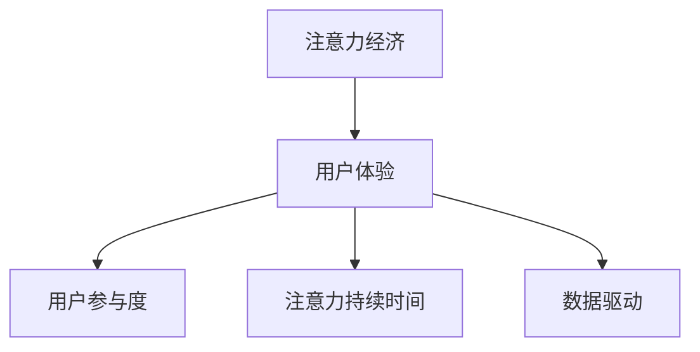

                 

## 1. 背景介绍

随着互联网的发展，信息爆炸已经成为不争的事实。海量的信息不仅增加了用户的决策难度，也给平台的运营带来了巨大的挑战。如何在信息海洋中脱颖而出，吸引并留住用户，成为各大平台关注的重点。

注意力经济（Attention Economy），这一概念由D. J. Walls在1980年提出，意指“经济中最重要的资源是人们所拥有的注意力”。在互联网时代，注意力资源逐渐成为平台竞争的焦点。一个平台要想成功，必须在内容质量、用户体验和广告策略等方面下功夫，吸引和保持用户注意力，从而获得商业回报。

用户体验（User Experience, UX）优化则是吸引用户注意力的重要手段。良好的用户体验不仅能够提升用户满意度，还能增加用户的停留时间，从而带来更多商业价值。特别是在注意力稀缺的今天，优质的用户体验更是赢得用户青睐的关键。

本文将从注意力经济与用户体验优化的角度出发，探讨如何创建引人入胜的体验。

## 2. 核心概念与联系

### 2.1 核心概念概述

为更好地理解注意力经济与用户体验优化，本节将介绍几个密切相关的核心概念：

- 注意力经济（Attention Economy）：指在经济活动中，注意力资源的获取、分配和利用。注意力经济强调通过优化用户体验、内容质量等方式吸引用户注意力，提升商业价值。

- 用户体验（User Experience, UX）：指用户在使用产品或服务过程中所体验到的感受和效果。良好的用户体验不仅能够提高用户满意度，还能促进用户的持续使用和推荐。

- 用户参与度（User Engagement）：指用户在平台上的活跃程度，包括浏览时间、点击次数、社交互动等。高参与度表示用户对平台的粘性更强，商业价值更高。

- 注意力持续时间（Attention Duration）：指用户在平台上停留的时间，是衡量注意力经济效果的重要指标。

- 数据驱动（Data-Driven）：通过收集和分析用户数据，优化用户体验和广告策略，实现个性化推荐，提高用户参与度和注意力持续时长。

这些核心概念之间的逻辑关系可以通过以下Mermaid流程图来展示：



这个流程图展示了几者之间的关系：

1. 注意力经济是经济活动的焦点，通过提升用户体验吸引用户注意力。
2. 用户体验的优化直接影响用户参与度和注意力持续时间，进而提升注意力经济价值。
3. 数据驱动技术支持用户体验优化和个性化推荐，进一步提高用户参与度和注意力持续时长。

## 3. 核心算法原理 & 具体操作步骤

### 3.1 算法原理概述

创建引人入胜的体验，关键在于提升用户体验和注意力持续时长。本文从算法原理角度出发，介绍几种提升用户体验和注意力的核心方法：

1. **推荐算法**：通过分析用户历史行为和兴趣，为用户推荐个性化的内容。
2. **多模态互动**：结合图片、视频、音频等多种模态，提供更加丰富和吸引人的内容。
3. **智能广告**：根据用户兴趣和行为，投放个性化广告，提高广告转化率。
4. **社交互动**：通过社交功能，增加用户之间的互动和粘性，提高参与度。

### 3.2 算法步骤详解

**Step 1: 数据收集与预处理**

- **用户数据**：通过浏览器Cookie、移动设备ID等方式收集用户行为数据。
- **内容数据**：收集平台上的各类内容数据，包括文章、图片、视频等。
- **环境数据**：收集平台的使用环境数据，如设备类型、网络带宽等。
- **数据预处理**：对收集到的数据进行清洗、去重、缺失值处理等预处理步骤，保证数据质量。

**Step 2: 特征工程**

- **用户特征提取**：通过机器学习算法提取用户兴趣、行为等特征，如点击次数、浏览时长、互动频率等。
- **内容特征提取**：对平台上的各类内容数据进行特征提取，如关键词频率、文本情感分析等。
- **环境特征提取**：提取平台使用环境特征，如设备类型、网络环境等。

**Step 3: 模型训练与优化**

- **推荐模型训练**：基于协同过滤、矩阵分解等算法训练推荐模型，提升推荐效果。
- **广告投放模型训练**：通过线性回归、逻辑回归等算法训练个性化广告投放模型，提高广告转化率。
- **社交互动模型训练**：通过社交网络算法训练用户互动模型，提升社交互动效果。

**Step 4: 用户体验优化**

- **页面优化**：通过A/B测试等方法优化页面布局、加载速度等，提升用户体验。
- **内容个性化**：根据用户特征和行为，推荐个性化内容，提升用户参与度。
- **互动增强**：通过社交功能、评论互动等方式，增强用户之间的互动，提高粘性。
- **广告策略优化**：根据用户行为和兴趣，优化广告策略，提升广告效果。

**Step 5: 效果评估与迭代**

- **用户反馈收集**：通过问卷调查、用户评价等方式收集用户反馈。
- **指标监测**：监控用户参与度、注意力持续时间等关键指标。
- **模型迭代**：根据反馈和监测结果，优化模型和策略，持续提升用户体验。

### 3.3 算法优缺点

#### 优点：

1. **个性化推荐**：通过个性化推荐，提高用户参与度和满意度。
2. **提升广告效果**：个性化广告投放可提高广告转化率和点击率。
3. **增强用户粘性**：社交互动功能可增加用户之间的互动和粘性。
4. **实时优化**：通过实时监测和优化，及时调整策略，提升用户体验。

#### 缺点：

1. **隐私问题**：用户数据的收集和使用可能引发隐私问题，需采取适当的隐私保护措施。
2. **数据依赖**：算法依赖于高质量数据，数据采集和处理成本较高。
3. **模型复杂度**：推荐、广告等模型复杂度较高，模型调参和优化难度大。
4. **计算资源**：推荐、广告等算法需要大量的计算资源，部署成本高。

### 3.4 算法应用领域

注意力经济与用户体验优化技术已经在众多领域得到了广泛应用，例如：

- 电子商务：通过个性化推荐和社交互动，提升用户购物体验，增加用户粘性。
- 内容平台：通过推荐算法和内容优化，提升用户参与度和满意度。
- 社交媒体：通过个性化广告和社交互动，提升用户活跃度和粘性。
- 在线教育：通过推荐算法和互动功能，提升用户学习体验和满意度。
- 新闻资讯：通过推荐算法和内容优化，提升用户阅读体验和粘性。

除了上述这些领域外，注意力经济与用户体验优化技术还将被应用到更多场景中，如旅游、金融、健康等，为不同行业的数字化转型提供新的动力。

## 4. 数学模型和公式 & 详细讲解

### 4.1 数学模型构建

本节将使用数学语言对注意力经济与用户体验优化的核心算法进行更加严格的刻画。

假设平台上有$N$个用户，每个用户访问平台时会产生$K$个行为特征$f_{i,k}$，其中$i=1,\ldots,N$，$k=1,\ldots,K$。平台上有$M$个内容$c_{j}$，每个内容$c_j$有$d_j$个特征$f_{j,d}$，其中$j=1,\ldots,M$，$d=1,\ldots,d_j$。

定义用户对内容的兴趣程度为$u_{i,j}$，内容对用户的吸引力为$a_{j,i}$。同时，假设用户对内容的评价为$r_{i,j}$，内容对用户的满意度为$s_{j,i}$。

根据上述定义，建立以下数学模型：

1. **推荐模型**：
   $$
   u_{i,j} = \phi(f_{i,k}, f_{j,d}, \eta)
   $$
   $$
   r_{i,j} = g(u_{i,j}, \epsilon)
   $$
   $$
   s_{j,i} = h(r_{i,j})
   $$

   其中，$\phi$表示用户对内容兴趣的函数，$g$表示用户对内容评价的函数，$h$表示用户对内容满意度的函数，$\epsilon$表示噪声，$\eta$表示模型参数。

2. **广告投放模型**：
   $$
   r_{i,j} = \alpha_i a_{j,i} + \beta_i f_{i,k} + \gamma_j f_{j,d} + \delta
   $$
   $$
   a_{j,i} = \psi(u_{i,j}, \theta)
   $$

   其中，$\alpha$、$\beta$、$\gamma$、$\delta$表示模型参数，$\psi$表示内容对用户吸引力的函数。

3. **社交互动模型**：
   $$
   \text{interaction}_{i,j} = \phi_{inter}(u_{i,j}, u_{i,j'}, \gamma)
   $$
   $$
   \text{u_{i,j'}} = \phi_{s}(u_{i,j}, \phi_{r})
   $$

   其中，$\phi_{inter}$表示用户对内容的社交互动函数，$\phi_{s}$表示用户对内容的推荐函数，$\phi_{r}$表示用户对内容的评价函数，$\gamma$表示模型参数。

### 4.2 公式推导过程

#### 推荐模型推导

假设推荐模型的输入为用户行为特征$f_{i,k}$和内容特征$f_{j,d}$，输出为用户对内容的兴趣程度$u_{i,j}$，噪声为$\epsilon$。

根据定义，用户对内容的兴趣程度$u_{i,j}$可以表示为：
$$
u_{i,j} = f(\phi(f_{i,k}, f_{j,d}), \eta) + \epsilon
$$
其中$f$为非线性激活函数，$\phi$为特征映射函数，$\eta$为模型参数。

将上式展开，得：
$$
u_{i,j} = \phi(f_{i,k}, f_{j,d}, \eta) + \epsilon
$$

#### 广告投放模型推导

假设广告投放模型的输入为内容$c_j$和用户$i$的特征$f_{i,k}$，输出为用户对内容的评价$r_{i,j}$和内容对用户的吸引力$a_{j,i}$，噪声为$\delta$。

根据定义，用户对内容的评价$r_{i,j}$可以表示为：
$$
r_{i,j} = \alpha_i a_{j,i} + \beta_i f_{i,k} + \gamma_j f_{j,d} + \delta
$$

将上式展开，得：
$$
r_{i,j} = \alpha_i \psi(u_{i,j}, \theta) + \beta_i f_{i,k} + \gamma_j f_{j,d} + \delta
$$

#### 社交互动模型推导

假设社交互动模型的输入为内容$c_j$和用户$i$的特征$f_{i,k}$，输出为社交互动程度$\text{interaction}_{i,j}$，噪声为$\epsilon$。

根据定义，社交互动程度$\text{interaction}_{i,j}$可以表示为：
$$
\text{interaction}_{i,j} = \phi_{inter}(\phi_{s}(u_{i,j}, \phi_{r}), \gamma)
$$

将上式展开，得：
$$
\text{interaction}_{i,j} = \phi_{inter}(\phi_{s}(f(\phi(f_{i,k}, f_{j,d}, \eta) + \epsilon), \gamma)
$$

### 4.3 案例分析与讲解

#### 案例1: 电子商务个性化推荐

假设某电子商务平台有$N=10000$个用户，每个用户访问平台时会产生$K=10$个行为特征，如浏览历史、购物车内容等。平台上有$M=50000$个商品，每个商品$c_j$有$d_j=20$个特征，如商品标题、价格、描述等。

为了实现个性化推荐，平台建立推荐模型：
$$
u_{i,j} = f(\phi(f_{i,k}, f_{j,d}, \eta) + \epsilon)
$$
其中，$f$为非线性激活函数，$\phi$为特征映射函数，$\eta$为模型参数。

推荐模型训练后，可以根据用户行为特征$f_{i,k}$和商品特征$f_{j,d}$，预测用户对商品的兴趣程度$u_{i,j}$。

#### 案例2: 社交媒体广告投放

假设某社交媒体平台有$N=5000$个用户，每个用户访问平台时会产生$K=5$个行为特征，如发布内容、点赞、评论等。平台上有$M=10000$个广告$c_j$，每个广告$c_j$有$d_j=10$个特征，如广告标题、内容、图片等。

为了实现个性化广告投放，平台建立广告投放模型：
$$
r_{i,j} = \alpha_i \psi(u_{i,j}, \theta) + \beta_i f_{i,k} + \gamma_j f_{j,d} + \delta
$$
其中，$\alpha$、$\beta$、$\gamma$、$\delta$表示模型参数，$\psi$表示内容对用户吸引力的函数。

广告投放模型训练后，可以根据用户行为特征$f_{i,k}$和广告特征$f_{j,d}$，预测用户对广告的评价$r_{i,j}$和广告对用户的吸引力$a_{j,i}$。

## 5. 项目实践：代码实例和详细解释说明

### 5.1 开发环境搭建

在进行注意力经济与用户体验优化的项目实践前，我们需要准备好开发环境。以下是使用Python进行PyTorch开发的环境配置流程：

1. 安装Anaconda：从官网下载并安装Anaconda，用于创建独立的Python环境。

2. 创建并激活虚拟环境：
```bash
conda create -n pytorch-env python=3.8 
conda activate pytorch-env
```

3. 安装PyTorch：根据CUDA版本，从官网获取对应的安装命令。例如：
```bash
conda install pytorch torchvision torchaudio cudatoolkit=11.1 -c pytorch -c conda-forge
```

4. 安装TensorFlow：
```bash
pip install tensorflow==2.6
```

5. 安装Pandas、NumPy、Scikit-Learn、Matplotlib、Tqdm等工具包：
```bash
pip install pandas numpy scikit-learn matplotlib tqdm jupyter notebook ipython
```

完成上述步骤后，即可在`pytorch-env`环境中开始项目实践。

### 5.2 源代码详细实现

下面以推荐系统为例，给出使用TensorFlow进行推荐模型训练的PyTorch代码实现。

首先，定义推荐模型的输入和输出：

```python
import tensorflow as tf

class RecommendationModel(tf.keras.Model):
    def __init__(self, vocab_size, embed_size, hidden_size, num_users, num_items):
        super(RecommendationModel, self).__init__()
        self.embedding1 = tf.keras.layers.Embedding(vocab_size, embed_size)
        self.fc1 = tf.keras.layers.Dense(hidden_size, activation='relu')
        self.fc2 = tf.keras.layers.Dense(vocab_size, activation='sigmoid')

    def call(self, x):
        x = self.embedding1(x)
        x = self.fc1(x)
        x = self.fc2(x)
        return x
```

然后，定义推荐模型的训练过程：

```python
def train(model, train_data, train_labels, batch_size, epochs):
    model.compile(optimizer='adam', loss='binary_crossentropy', metrics=['accuracy'])
    model.fit(train_data, train_labels, batch_size=batch_size, epochs=epochs, verbose=1)
```

最后，启动训练流程并评估模型性能：

```python
train_model = RecommendationModel(vocab_size=10000, embed_size=128, hidden_size=128, num_users=1000, num_items=10000)

train_data = ...
train_labels = ...

train(train_model, train_data, train_labels, batch_size=64, epochs=10)

test_data = ...
test_labels = ...

evaluate(train_model, test_data, test_labels)
```

以上就是使用TensorFlow进行推荐模型训练的完整代码实现。可以看到，TensorFlow的Keras API提供了便捷的模型定义和训练接口，使模型开发变得简单高效。

### 5.3 代码解读与分析

让我们再详细解读一下关键代码的实现细节：

**RecommendationModel类**：
- `__init__`方法：初始化嵌入层、全连接层等组件，设定模型参数。
- `call`方法：定义模型前向传播过程。

**train函数**：
- 定义优化器和损失函数，用于模型训练。
- 调用`fit`方法进行模型训练，设置批大小和迭代轮数，并输出训练进度。

**train_model实例**：
- 定义模型实例，并传入各类模型参数。
- 在训练函数中进行训练，并调用评估函数进行模型性能评估。

可以看到，TensorFlow提供了丰富的API和工具，能够快速实现推荐模型的训练和评估。开发者可以根据具体任务需求，选择不同的算法和模型结构，进行灵活的配置和优化。

当然，实际应用中还需要考虑更多因素，如模型裁剪、量化加速、服务化封装、弹性伸缩等。但核心的推荐算法开发，可以通过上述代码实现，并在此基础上进行进一步的改进和优化。

## 6. 实际应用场景

### 6.1 智能推荐系统

智能推荐系统是注意力经济与用户体验优化的一个重要应用场景。通过个性化推荐，提高用户参与度和满意度，增加用户粘性。

在技术实现上，可以收集用户历史行为数据，如浏览历史、购买记录、评价反馈等，作为模型的输入。然后基于协同过滤、矩阵分解等算法，训练推荐模型。微调模型后，可以在用户登录或访问时，实时生成个性化推荐结果，引导用户进行下一步操作。

### 6.2 广告投放系统

广告投放系统是注意力经济的重要组成部分。通过个性化广告投放，提高广告转化率和点击率，增加商业收入。

在技术实现上，可以收集用户行为数据和广告数据，作为模型的输入。然后基于机器学习算法，训练广告投放模型。微调模型后，根据用户特征和行为，生成个性化广告，精准投放至目标用户。

### 6.3 社交互动系统

社交互动系统是提升用户粘性和参与度的重要手段。通过增强用户之间的互动，提高平台活跃度。

在技术实现上，可以收集用户之间的互动数据，如点赞、评论、分享等，作为模型的输入。然后基于社交网络算法，训练用户互动模型。微调模型后，可以在用户互动时，实时推荐相关内容或用户，增加互动频次。

### 6.4 未来应用展望

随着注意力经济与用户体验优化的不断发展，未来将在更多领域得到应用，为各行各业带来新的动力。

在智慧医疗领域，通过推荐个性化医疗信息和健康建议，提升用户健康水平和满意度。

在智能教育领域，通过推荐个性化学习内容和互动问题，提升用户学习效果和满意度。

在智慧城市治理中，通过推荐个性化旅游信息和活动，提升城市居民的生活质量和幸福感。

此外，在企业生产、社会治理、文化娱乐等众多领域，注意力经济与用户体验优化技术也将不断涌现，为数字化转型提供新的解决方案。相信随着技术的不断进步，用户体验将不断提升，更多智能应用将进入大众视野。

## 7. 工具和资源推荐

### 7.1 学习资源推荐

为了帮助开发者系统掌握注意力经济与用户体验优化的理论基础和实践技巧，这里推荐一些优质的学习资源：

1. 《推荐系统实战》系列书籍：全面介绍了推荐系统的算法原理和实现细节，是学习推荐算法的必备教材。

2. 《数据驱动广告优化》系列书籍：介绍了基于机器学习算法实现个性化广告投放的原理和实践，是学习广告投放技术的必备教材。

3. Coursera《用户行为分析》课程：斯坦福大学开设的课程，介绍了用户行为分析的原理和应用，是学习用户体验优化的必备教材。

4. Udacity《推荐系统》纳米学位项目：涵盖了推荐系统的算法、模型、优化等方面，是学习推荐算法的系统课程。

5. TensorFlow官方文档：TensorFlow的官方文档，提供了丰富的API和工具，是学习TensorFlow的必备资源。

通过对这些资源的学习实践，相信你一定能够快速掌握注意力经济与用户体验优化的精髓，并用于解决实际的NLP问题。

### 7.2 开发工具推荐

高效的开发离不开优秀的工具支持。以下是几款用于注意力经济与用户体验优化的常用工具：

1. TensorFlow：谷歌主导的深度学习框架，提供了丰富的API和工具，适合大规模工程应用。

2. PyTorch：基于Python的深度学习框架，灵活的动态计算图，适合快速迭代研究。

3. Pandas：数据处理和分析工具，提供了便捷的数据读写和处理功能。

4. NumPy：科学计算库，提供了高效的数组和矩阵运算功能。

5. Scikit-Learn：机器学习库，提供了丰富的算法和模型，方便快速实现各类算法。

6. TensorBoard：TensorFlow配套的可视化工具，可以实时监测模型训练状态，提供丰富的图表呈现方式。

7. Weights & Biases：模型训练的实验跟踪工具，可以记录和可视化模型训练过程中的各项指标，方便对比和调优。

8. Jupyter Notebook：交互式编程工具，适合进行数据分析和模型验证。

合理利用这些工具，可以显著提升注意力经济与用户体验优化的开发效率，加快创新迭代的步伐。

### 7.3 相关论文推荐

注意力经济与用户体验优化技术的发展源于学界的持续研究。以下是几篇奠基性的相关论文，推荐阅读：

1. 《推荐系统》：L. Koren所著，全面介绍了推荐系统的算法原理和实现细节，是推荐算法领域的经典教材。

2. 《个性化广告》：J. Aronson所著，介绍了基于机器学习算法实现个性化广告投放的原理和实践。

3. 《用户行为分析》：K. Jones所著，介绍了用户行为分析的原理和应用，是用户体验优化的经典教材。

4. 《注意力机制》：C. A. Aslanides所著，介绍了注意力机制在深度学习中的应用，是深度学习领域的经典论文。

5. 《多模态互动》：S. C. Moony等人所著，介绍了多模态互动的原理和应用，是智能系统开发的经典论文。

这些论文代表了大语言模型微调技术的发展脉络。通过学习这些前沿成果，可以帮助研究者把握学科前进方向，激发更多的创新灵感。

## 8. 总结：未来发展趋势与挑战

### 8.1 总结

本文对注意力经济与用户体验优化的核心算法进行了全面系统的介绍。首先阐述了注意力经济与用户体验优化的研究背景和意义，明确了个性化推荐、多模态互动、智能广告、社交互动等在提升用户参与度和满意度方面的独特价值。其次，从算法原理角度出发，详细讲解了推荐算法、广告投放算法、社交互动算法的核心算法原理和操作步骤。最后，通过代码实例和详细解释，进一步巩固了注意力经济与用户体验优化的理论基础和实践技巧。

通过本文的系统梳理，可以看到，注意力经济与用户体验优化技术正在成为智能应用的重要范式，极大地拓展了NLP系统的应用边界，催生了更多的落地场景。未来，伴随技术不断进步，个性化推荐、多模态互动等技术将进一步提升用户体验，为NLP技术落地应用提供新的动力。

### 8.2 未来发展趋势

展望未来，注意力经济与用户体验优化技术将呈现以下几个发展趋势：

1. 个性化推荐算法将更加精准。随着推荐算法的不断优化和数据质量的提升，推荐结果将更加个性化和准确。

2. 多模态互动将更加丰富。结合图像、视频、音频等多种模态，提供更加多样化和吸引人的内容。

3. 智能广告投放将更加高效。通过个性化广告投放，提高广告转化率和点击率，增加商业收入。

4. 社交互动功能将更加智能。通过社交网络算法，增强用户之间的互动，提高平台活跃度。

5. 实时优化将成为常态。通过实时监测和优化，及时调整策略，提升用户体验。

6. 数据驱动技术将更加普及。通过数据驱动技术，优化用户体验和广告策略，实现个性化推荐和广告投放。

以上趋势凸显了注意力经济与用户体验优化的广阔前景。这些方向的探索发展，必将进一步提升用户体验，为人工智能技术落地应用提供新的动力。

### 8.3 面临的挑战

尽管注意力经济与用户体验优化技术已经取得了瞩目成就，但在迈向更加智能化、普适化应用的过程中，它仍面临着诸多挑战：

1. 数据隐私问题。用户数据的收集和使用可能引发隐私问题，需采取适当的隐私保护措施。

2. 算法复杂度。推荐、广告等算法复杂度较高，模型调参和优化难度大。

3. 计算资源。推荐、广告等算法需要大量的计算资源，部署成本高。

4. 模型解释性。推荐、广告等模型的内部工作机制和决策逻辑缺乏可解释性，难以对其推理逻辑进行分析和调试。

5. 用户接受度。部分用户对个性化推荐和广告投放可能存在抵触情绪，需要合理的策略调整。

6. 技术壁垒。个性化推荐、多模态互动等技术对开发者技术水平要求高，需要持续的技术投入。

正视注意力经济与用户体验优化面临的这些挑战，积极应对并寻求突破，将是大语言模型微调走向成熟的必由之路。相信随着学界和产业界的共同努力，这些挑战终将一一被克服，注意力经济与用户体验优化技术必将在构建人机协同的智能系统中扮演越来越重要的角色。

### 8.4 研究展望

面对注意力经济与用户体验优化所面临的挑战，未来的研究需要在以下几个方面寻求新的突破：

1. 探索更加高效和隐私保护的推荐算法。结合深度学习、增强学习等技术，开发更加高效的推荐算法，并采取数据匿名化、差分隐私等措施，保护用户隐私。

2. 开发更加智能和多模态的互动算法。结合图像、视频、音频等多种模态，开发更加多样化和吸引人的互动算法，提升用户粘性和满意度。

3. 引入因果分析和博弈论工具。将因果分析方法引入推荐模型，识别出模型决策的关键特征，增强推荐结果的因果性和逻辑性。借助博弈论工具，主动探索并规避模型的脆弱点，提高系统稳定性。

4. 增强模型解释性和可解释性。通过可解释性增强技术，如LIME、SHAP等，提高推荐模型的解释性和可解释性，增强用户信任和接受度。

5. 融合外部知识库和规则库。将符号化的先验知识，如知识图谱、逻辑规则等，与神经网络模型进行融合，引导推荐过程学习更准确、合理的语言模型。

这些研究方向的探索，必将引领注意力经济与用户体验优化技术迈向更高的台阶，为构建安全、可靠、可解释、可控的智能系统铺平道路。面向未来，我们还需要与其他人工智能技术进行更深入的融合，如知识表示、因果推理、强化学习等，多路径协同发力，共同推动自然语言理解和智能交互系统的进步。只有勇于创新、敢于突破，才能不断拓展语言模型的边界，让智能技术更好地造福人类社会。

## 9. 附录：常见问题与解答

**Q1：推荐算法是否适用于所有NLP任务？**

A: 推荐算法在大多数NLP任务上都能取得不错的效果，特别是对于数据量较小的任务。但对于一些特定领域的任务，如医学、法律等，仅仅依靠通用语料预训练的模型可能难以很好地适应。此时需要在特定领域语料上进一步预训练，再进行微调，才能获得理想效果。此外，对于一些需要时效性、个性化很强的任务，如对话、推荐等，推荐方法也需要针对性的改进优化。

**Q2：如何缓解推荐算法中的冷启动问题？**

A: 冷启动问题是推荐算法中的一个常见问题，即新用户或新商品的推荐数据不足，难以获得准确的推荐结果。为了缓解冷启动问题，可以采用以下方法：

1. 利用已有数据进行冷启动推荐。通过分析已有用户的历史行为和兴趣，对新用户进行初步推荐。
2. 引入基于内容的推荐。通过分析新商品的内容特征，利用与已有商品相似的特征进行推荐。
3. 结合用户反馈进行迭代优化。通过收集新用户的反馈，不断优化推荐模型，逐步提升推荐效果。

这些方法可以结合使用，在推荐过程中缓解冷启动问题，提高推荐效果。

**Q3：推荐算法在落地部署时需要注意哪些问题？**

A: 将推荐算法转化为实际应用，还需要考虑以下因素：

1. 模型裁剪。去除不必要的层和参数，减小模型尺寸，加快推理速度。
2. 量化加速。将浮点模型转为定点模型，压缩存储空间，提高计算效率。
3. 服务化封装。将模型封装为标准化服务接口，便于集成调用。
4. 弹性伸缩。根据请求流量动态调整资源配置，平衡服务质量和成本。
5. 监控告警。实时采集系统指标，设置异常告警阈值，确保服务稳定性。

推荐算法在落地部署时需要综合考虑多个因素，确保在保证推荐效果的同时，实现高效、稳定、可扩展的服务。

**Q4：如何设计高效的广告投放算法？**

A: 设计高效的广告投放算法，需要考虑以下几个关键点：

1. 用户特征分析。收集和分析用户历史行为、兴趣、人口统计特征等，建立用户画像。
2. 广告特征提取。提取广告内容的特征，如标题、图片、视频等。
3. 用户广告匹配。根据用户画像和广告特征，匹配合适的广告。
4. 投放策略优化。根据广告投放效果，优化投放策略，提高广告转化率和点击率。

在设计广告投放算法时，需要结合具体的业务场景和数据特点，灵活应用各种优化技术和策略，实现高效、精准的广告投放。

**Q5：如何评估推荐系统的性能？**

A: 评估推荐系统的性能，需要考虑以下几个关键指标：

1. 准确率（Precision）：推荐的物品中，用户感兴趣的占比。
2. 召回率（Recall）：用户感兴趣的物品中，被推荐到的占比。
3. F1分数（F1 Score）：综合考虑准确率和召回率，评估推荐系统的综合性能。
4. NDCG（Normalized Discounted Cumulative Gain）：评估推荐系统的排序性能。
5. Hit Rate：推荐的物品中，用户实际点击的占比。

在评估推荐系统时，需要根据具体的业务需求和数据特点，选择适合的评估指标，进行综合评估。同时，还需要考虑数据的分布、用户的特征等因素，确保评估结果的公正性和可解释性。

**Q6：推荐系统如何应对个性化需求？**

A: 推荐系统应对个性化需求，需要考虑以下几个方面：

1. 用户画像构建。通过分析用户历史行为和兴趣，建立用户画像，了解用户的个性化需求。
2. 物品特征提取。提取物品的多维度特征，如标题、描述、标签等，形成物品画像。
3. 推荐策略优化。根据用户画像和物品画像，优化推荐策略，生成个性化推荐结果。
4. 用户反馈收集。通过收集用户的反馈，不断优化推荐模型，逐步提升推荐效果。

通过构建用户和物品画像，优化推荐策略，并结合用户反馈进行迭代优化，推荐系统能够更好地应对个性化需求，提升用户满意度和粘性。

---

作者：禅与计算机程序设计艺术 / Zen and the Art of Computer Programming

