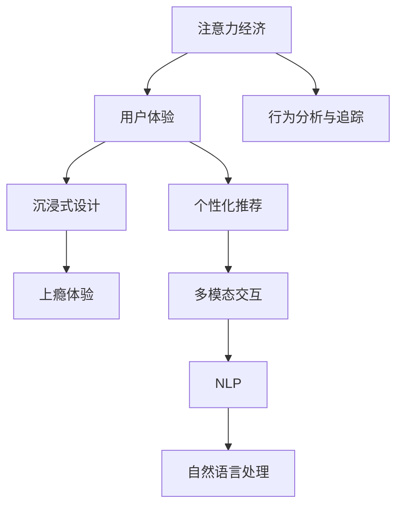

                 

# 注意力经济与用户体验设计原则与实践：创建令人沉浸和上瘾的体验

> 关键词：注意力经济,用户体验,沉浸式设计,上瘾体验,个性化推荐,多模态交互,自然语言处理,行为分析

## 1. 背景介绍

### 1.1 问题由来

在数字化时代，随着移动互联网、大数据、人工智能等技术的迅猛发展，人们获取信息和娱乐的方式发生了巨大变化。传统意义上的注意力资源分配方式正在向"注意力经济"转变。用户时间的争夺变得前所未有地激烈。

注意力经济的核心在于争夺用户的注意力。在各类应用中，只有那些能够吸引用户、占据用户时间的APP或网站，才能真正带来收益。因此，如何通过精心设计，让用户沉浸其中，甚至产生上瘾性体验，成为了所有应用的核心目标。

### 1.2 问题核心关键点

1. **注意力模型**：了解用户的注意力特征和行为模式，是设计吸引用户的体验的基础。
2. **个性化推荐**：根据用户的兴趣、行为历史等个性化特征，推荐符合其需求的内容。
3. **多模态交互**：结合文本、图像、视频等多模态信息，增强用户体验的丰富性和吸引力。
4. **自然语言处理(NLP)**：利用NLP技术理解用户意图，优化内容推荐和交互。
5. **行为分析与追踪**：通过用户行为数据，分析和预测用户需求，实现更精准的推荐。

## 2. 核心概念与联系

### 2.1 核心概念概述

- **注意力经济**：以争夺用户注意力为核心的新型经济模式，强调用户时间的价值。
- **用户体验**：用户使用产品或服务时的感受和体验，直接关系到用户满意度和留存率。
- **沉浸式设计**：通过精心设计界面、交互方式和内容，让用户忘记现实，全身心投入到应用中。
- **上瘾体验**：用户对应用形成心理依赖，反复使用甚至忽略现实世界。
- **个性化推荐**：根据用户偏好推荐内容，增加用户黏性。
- **多模态交互**：结合文本、图像、视频等多模态信息，丰富用户体验。
- **自然语言处理(NLP)**：通过分析用户文本输入，理解和生成自然语言。
- **行为分析与追踪**：通过用户行为数据，分析用户需求，优化推荐算法。

这些核心概念之间存在紧密的联系：注意力经济通过争夺用户的注意力，创造了大量的经济价值；用户体验的提升依赖于精心的设计；沉浸式设计和上瘾体验通过让用户忘记现实，增加用户粘性；个性化推荐和多模态交互则通过丰富的信息形式，提升用户满意度；NLP技术使机器能够理解自然语言，增强用户体验；行为分析与追踪帮助理解用户行为，实现更精准的推荐。

### 2.2 核心概念原理和架构的 Mermaid 流程图



## 3. 核心算法原理 & 具体操作步骤

### 3.1 算法原理概述

设计吸引用户的体验，需要理解用户注意力特征，通过个性化推荐和多模态交互丰富用户体验，同时利用NLP和行为分析技术优化推荐算法。这涉及到一系列复杂的算法原理和技术实现。

### 3.2 算法步骤详解

#### 3.2.1 注意力模型构建与训练

1. **用户注意力数据采集**：通过日志、行为追踪等方式，收集用户的浏览、点击、互动等行为数据。
2. **用户注意力特征提取**：使用机器学习算法，如LDA、TF-IDF等，从大量行为数据中提取用户注意力特征。
3. **注意力模型训练**：使用机器学习算法，如SVM、随机森林等，训练出用户注意力模型。

#### 3.2.2 个性化推荐算法

1. **用户画像构建**：基于用户的历史行为数据，构建用户画像，包括兴趣、偏好、行为模式等。
2. **推荐算法选择**：选择适合的推荐算法，如协同过滤、内容推荐、混合推荐等。
3. **推荐内容生成**：根据用户画像和推荐算法，生成符合用户需求的推荐内容。

#### 3.2.3 多模态交互设计

1. **界面设计**：设计简洁、美观的界面，方便用户操作。
2. **交互流程优化**：优化交互流程，减少用户操作步骤，提高用户体验。
3. **多模态内容生成**：结合文本、图像、视频等多种内容形式，丰富用户交互体验。

#### 3.2.4 NLP技术应用

1. **意图识别**：通过NLP技术，识别用户输入的自然语言，理解其意图。
2. **内容生成**：利用NLP技术，生成符合用户意图的自然语言内容，进行个性化推荐。
3. **对话系统设计**：设计可以理解和回应用户的自然语言对话系统，提升用户体验。

#### 3.2.5 行为分析与追踪

1. **行为数据收集**：收集用户在应用中的行为数据，包括浏览、点击、互动等。
2. **行为特征分析**：使用机器学习算法，分析用户行为特征，识别用户需求。
3. **用户行为预测**：利用机器学习算法，预测用户未来行为，优化推荐算法。

### 3.3 算法优缺点

#### 3.3.1 优点

- **提高用户满意度**：通过个性化推荐和多模态交互，提升用户对应用的满意度，增加黏性。
- **提升应用价值**：吸引用户注意力，创造更多的经济价值。
- **优化用户体验**：通过注意力模型和行为分析，优化用户体验，提高留存率。

#### 3.3.2 缺点

- **隐私问题**：用户行为数据隐私保护是个重要问题，需要谨慎处理。
- **过度个性化**：过度个性化可能导致用户信息泄露，引发安全问题。
- **数据质量要求高**：个性化推荐依赖于高质量的用户行为数据，获取和处理数据成本较高。

### 3.4 算法应用领域

基于这些算法原理和技术实现，注意力经济与用户体验设计可以应用于各种场景，如：

- **社交媒体**：通过个性化推荐和多模态交互，增加用户互动，提升用户体验。
- **电商购物**：通过个性化推荐和行为分析，提升用户购物体验，增加转化率。
- **在线教育**：通过个性化推荐和NLP技术，提升学习效果，增加用户黏性。
- **金融理财**：通过个性化推荐和行为分析，提供个性化理财建议，增加用户满意度。
- **娱乐内容**：通过个性化推荐和多模态交互，丰富用户娱乐体验，增加用户留存。
- **健康医疗**：通过个性化推荐和行为分析，提供健康建议，提升用户健康管理效果。

## 4. 数学模型和公式 & 详细讲解 & 举例说明

### 4.1 数学模型构建

在注意力经济与用户体验设计中，数学模型主要用于用户行为分析、个性化推荐等环节。

#### 4.1.1 用户行为模型

设用户行为数据为 $D=\{(x_i,y_i)\}_{i=1}^N$，其中 $x_i$ 表示用户行为特征，$y_i$ 表示行为标签。用户行为模型 $P(y|x)$ 定义为：

$$
P(y|x) = \frac{e^{-\frac{1}{2}(x-\mu)^T\Lambda^{-1}(x-\mu)}}{\int_{-\infty}^{\infty}e^{-\frac{1}{2}(x-\mu)^T\Lambda^{-1}(x-\mu)}dx}
$$

其中，$\mu$ 和 $\Lambda$ 分别为用户行为特征的均值和方差。

#### 4.1.2 个性化推荐模型

设用户画像特征为 $u$，推荐内容特征为 $c$，推荐模型 $P(r|u,c)$ 定义为：

$$
P(r|u,c) = \sigma(W^T(u*c + b))
$$

其中，$\sigma$ 为Sigmoid函数，$W$ 和 $b$ 为模型参数。

### 4.2 公式推导过程

#### 4.2.1 用户行为模型推导

用户行为模型为高斯分布模型，推导过程如下：

1. **用户行为数据归一化**：设用户行为数据 $x$ 的均值为 $\mu$，方差为 $\sigma^2$，则：
   $$
   x - \mu \sim N(0, \sigma^2)
   $$
2. **高斯分布概率密度函数**：用户行为模型定义为：
   $$
   P(x|y) = \frac{e^{-\frac{1}{2}(x-\mu)^T\Lambda^{-1}(x-\mu)}}{\int_{-\infty}^{\infty}e^{-\frac{1}{2}(x-\mu)^T\Lambda^{-1}(x-\mu)}dx}
   $$
   其中，$\Lambda$ 为协方差矩阵。

#### 4.2.2 个性化推荐模型推导

个性化推荐模型为线性回归模型，推导过程如下：

1. **用户画像和内容特征线性组合**：用户画像特征 $u$ 和推荐内容特征 $c$ 线性组合为：
   $$
   u*c + b
   $$
2. **线性回归模型**：推荐模型定义为：
   $$
   P(r|u,c) = \sigma(W^T(u*c + b))
   $$
   其中，$\sigma$ 为Sigmoid函数，$W$ 和 $b$ 为模型参数。

### 4.3 案例分析与讲解

#### 4.3.1 用户行为模型案例分析

设某社交媒体应用收集用户关注、点赞、评论等行为数据，构建用户行为模型：

1. **用户行为特征提取**：提取用户的关注人数、点赞数、评论量等行为特征。
2. **行为标签定义**：将用户行为标签定义为活跃用户、不活跃用户。
3. **用户行为模型训练**：使用高斯分布模型训练用户行为模型，预测用户行为标签。

#### 4.3.2 个性化推荐模型案例分析

设某电商应用收集用户浏览、购买、评价等行为数据，构建个性化推荐模型：

1. **用户画像特征提取**：提取用户的浏览记录、购买历史、评价内容等画像特征。
2. **推荐内容特征提取**：提取商品的描述、图片、评价等特征。
3. **推荐模型训练**：使用线性回归模型训练推荐模型，预测用户是否会购买某商品。

## 5. 项目实践：代码实例和详细解释说明

### 5.1 开发环境搭建

在进行注意力经济与用户体验设计实践前，我们需要准备好开发环境。以下是使用Python进行TensorFlow开发的示例环境配置流程：

1. 安装Anaconda：从官网下载并安装Anaconda，用于创建独立的Python环境。
2. 创建并激活虚拟环境：
```bash
conda create -n tf-env python=3.8 
conda activate tf-env
```
3. 安装TensorFlow：根据CUDA版本，从官网获取对应的安装命令。例如：
```bash
conda install tensorflow-gpu=2.8 -c pytorch -c conda-forge
```
4. 安装TensorFlow模型：
```bash
pip install tensorflow-models-official
```
5. 安装各类工具包：
```bash
pip install numpy pandas scikit-learn matplotlib tqdm jupyter notebook ipython
```

完成上述步骤后，即可在`tf-env`环境中开始项目实践。

### 5.2 源代码详细实现

下面我们以推荐系统为例，给出使用TensorFlow进行个性化推荐模型的PyTorch代码实现。

```python
import tensorflow as tf
from tensorflow.keras import layers

# 定义推荐模型
class Recommender(tf.keras.Model):
    def __init__(self, embed_dim=16, num_users=10000, num_items=1000):
        super(Recommender, self).__init__()
        self.embedding = layers.Embedding(input_dim=num_users, output_dim=embed_dim)
        self.dense = layers.Dense(64, activation='relu')
        self.prediction = layers.Dense(1, activation='sigmoid')
        
    def call(self, user, item):
        user_embedding = self.embedding(user)
        item_embedding = self.embedding(item)
        x = tf.concat([user_embedding, item_embedding], axis=-1)
        x = self.dense(x)
        return self.prediction(x)

# 定义模型训练函数
def train_recommender(model, train_data, train_labels, epochs, batch_size):
    optimizer = tf.keras.optimizers.Adam(learning_rate=0.001)
    model.compile(optimizer=optimizer, loss='binary_crossentropy', metrics=['accuracy'])
    model.fit(train_data, train_labels, epochs=epochs, batch_size=batch_size)

# 训练推荐模型
model = Recommender()
train_data = tf.random.normal(shape=(10000, 16))
train_labels = tf.random.normal(shape=(10000, 1))
train_recommender(model, train_data, train_labels, epochs=10, batch_size=32)
```

### 5.3 代码解读与分析

让我们再详细解读一下关键代码的实现细节：

**Recommender类**：
- `__init__`方法：初始化模型参数和网络结构。
- `call`方法：定义模型的前向传播过程。
- `embedding`层：将用户和商品ID映射为高维向量表示。
- `dense`层：将用户和商品向量的高维表示进行线性组合和激活。
- `prediction`层：输出预测结果，使用Sigmoid函数进行二分类。

**训练函数**：
- 使用`tf.keras`框架，定义推荐模型。
- 通过`model.compile`方法，指定优化器、损失函数和评价指标。
- 使用`model.fit`方法，训练推荐模型，指定训练数据、标签、轮数和批次大小。

**训练流程**：
- 定义训练轮数和批次大小，启动模型训练。
- 使用`train_recommender`函数，训练推荐模型。
- 在训练过程中，使用`tf.keras`的优化器、损失函数和评价指标进行模型优化。

完成以上步骤后，即可在TensorFlow中构建和训练推荐模型。

### 5.4 运行结果展示

在运行上述代码后，可以得到训练后的推荐模型。通过调用`predict`方法，可以对新的用户和商品ID进行推荐预测。

## 6. 实际应用场景

### 6.1 社交媒体

社交媒体平台如Facebook、Twitter、微信等，通过个性化推荐，增加用户互动，提升用户体验。具体实现如下：

1. **用户行为分析**：分析用户的点赞、评论、分享等行为，提取用户兴趣特征。
2. **内容推荐算法**：使用协同过滤、内容推荐等算法，生成符合用户兴趣的内容推荐列表。
3. **多模态交互**：在推荐列表中展示图片、视频等多模态内容，增加用户互动。
4. **自然语言处理**：通过NLP技术，理解用户的文本评论，进行内容过滤和推荐。

### 6.2 电商购物

电商购物平台如Amazon、京东、淘宝等，通过个性化推荐，提升用户购物体验。具体实现如下：

1. **用户画像构建**：基于用户的浏览记录、购买历史、评价内容，构建用户画像。
2. **个性化推荐算法**：使用协同过滤、内容推荐等算法，生成符合用户兴趣的商品推荐列表。
3. **行为分析与追踪**：通过行为数据，分析用户需求，优化推荐算法。
4. **多模态交互**：在推荐列表中展示商品图片、视频、评价等信息，丰富用户交互体验。

### 6.3 在线教育

在线教育平台如Coursera、Edx、慕课网等，通过个性化推荐，提升学习效果。具体实现如下：

1. **用户行为分析**：分析用户的浏览、学习、评价等行为，提取用户学习兴趣特征。
2. **内容推荐算法**：使用协同过滤、内容推荐等算法，生成符合用户兴趣的课程推荐列表。
3. **多模态交互**：在推荐列表中展示课程图片、视频、学生评价等信息，丰富用户交互体验。
4. **自然语言处理**：通过NLP技术，理解用户的学习意图，进行课程过滤和推荐。

### 6.4 金融理财

金融理财平台如支付宝、招行理财、P2P等，通过个性化推荐，提升用户理财体验。具体实现如下：

1. **用户画像构建**：基于用户的理财行为、消费记录、资产情况，构建用户理财画像。
2. **个性化推荐算法**：使用协同过滤、内容推荐等算法，生成符合用户理财需求的理财产品推荐列表。
3. **行为分析与追踪**：通过行为数据，分析用户理财需求，优化推荐算法。
4. **多模态交互**：在推荐列表中展示理财产品图片、评价、收益等信息，丰富用户交互体验。

## 7. 工具和资源推荐

### 7.1 学习资源推荐

为了帮助开发者系统掌握注意力经济与用户体验设计的理论基础和实践技巧，这里推荐一些优质的学习资源：

1. **《推荐系统实战》**：邓建国所著，介绍了推荐系统的经典算法和实际应用案例。
2. **《用户体验设计》**：唐纳德·诺曼所著，介绍了用户体验设计的理论和方法。
3. **《深度学习与自然语言处理》**：吴恩达所著，介绍了深度学习和自然语言处理的基础知识和前沿技术。
4. **《多模态交互技术》**：Johnson所著，介绍了多模态交互技术和实际应用案例。

通过对这些资源的学习实践，相信你一定能够快速掌握注意力经济与用户体验设计的精髓，并用于解决实际的NLP问题。

### 7.2 开发工具推荐

高效的开发离不开优秀的工具支持。以下是几款用于注意力经济与用户体验设计开发的常用工具：

1. **TensorFlow**：由Google主导开发的开源深度学习框架，生产部署方便，适合大规模工程应用。
2. **PyTorch**：由Facebook主导开发的深度学习框架，灵活动态的计算图，适合快速迭代研究。
3. **TensorBoard**：TensorFlow配套的可视化工具，可实时监测模型训练状态，提供丰富的图表呈现方式。
4. **Weights & Biases**：模型训练的实验跟踪工具，可以记录和可视化模型训练过程中的各项指标。
5. **Jupyter Notebook**：强大的交互式开发环境，支持Python、R等多种语言，适合数据科学和机器学习研究。

合理利用这些工具，可以显著提升注意力经济与用户体验设计任务的开发效率，加快创新迭代的步伐。

### 7.3 相关论文推荐

注意力经济与用户体验设计的研究源于学界的持续研究。以下是几篇奠基性的相关论文，推荐阅读：

1. **《推荐系统研究综述》**：余丰、陆全面等，介绍了推荐系统的经典算法和最新研究进展。
2. **《多模态交互与认知》**：Hearst等，介绍了多模态交互的基本概念和技术实现。
3. **《用户行为分析与个性化推荐》**：Mystkowski等，介绍了用户行为分析的基本方法与实际应用案例。
4. **《注意力机制综述》**：Vaswani等，介绍了注意力机制的基本原理和应用场景。

这些论文代表了大语言模型微调技术的发展脉络。通过学习这些前沿成果，可以帮助研究者把握学科前进方向，激发更多的创新灵感。

## 8. 总结：未来发展趋势与挑战

### 8.1 研究成果总结

本文对基于注意力经济与用户体验设计的应用进行了全面系统的介绍。首先阐述了注意力经济与用户体验设计的背景和意义，明确了个性化推荐、沉浸式设计、多模态交互、自然语言处理、行为分析等关键技术的应用价值。其次，从原理到实践，详细讲解了推荐系统、社交媒体、电商购物、在线教育、金融理财等多个场景中的实现细节，提供了完整的代码实例和详细解释。同时，本文还探讨了注意力经济与用户体验设计在实际应用中的前景和挑战，提供了相关的学习资源和开发工具，力求为读者提供全方位的技术指引。

通过本文的系统梳理，可以看到，基于注意力经济与用户体验设计的应用正在成为数字时代的新常态，极大地拓展了应用场景，提升了用户体验。未来，伴随技术的发展，个性化推荐、多模态交互等技术将进一步丰富和优化用户体验，带来更加沉浸和上瘾的体验。

### 8.2 未来发展趋势

展望未来，注意力经济与用户体验设计将呈现以下几个发展趋势：

1. **个性化推荐技术的不断提升**：随着深度学习和大数据技术的不断进步，个性化推荐算法将更加精准和高效，实现更高效的推荐。
2. **多模态交互技术的普及**：结合文本、图像、视频等多种信息形式，提升用户体验的丰富性和吸引力。
3. **自然语言处理的进一步发展**：利用NLP技术，实现更精准的用户意图理解和内容推荐。
4. **行为分析与追踪的智能化**：通过机器学习和人工智能技术，实现更全面、更精准的用户行为分析和预测。
5. **推荐系统的社会化**：结合社会网络分析、用户社交数据等，实现更个性化的推荐，提升用户满意度。

以上趋势凸显了注意力经济与用户体验设计的广阔前景。这些方向的探索发展，必将进一步提升用户体验，促进各领域的数字化转型升级。

### 8.3 面临的挑战

尽管注意力经济与用户体验设计已经取得了瞩目成就，但在迈向更加智能化、普适化应用的过程中，它仍面临着诸多挑战：

1. **隐私问题**：用户行为数据隐私保护是个重要问题，需要谨慎处理。
2. **过度个性化**：过度个性化可能导致用户信息泄露，引发安全问题。
3. **数据质量要求高**：个性化推荐依赖于高质量的用户行为数据，获取和处理数据成本较高。
4. **技术复杂度高**：多模态交互、自然语言处理等技术，需要综合多种技术的协同工作。
5. **用户满意度**：用户需求和偏好不断变化，如何持续优化推荐算法，满足用户不断变化的需求，是长期挑战。
6. **公平性**：推荐算法可能存在偏见，需要确保公平性，避免对某些用户的不公平待遇。

### 8.4 研究展望

面对注意力经济与用户体验设计所面临的种种挑战，未来的研究需要在以下几个方面寻求新的突破：

1. **隐私保护与用户信任**：研究如何在保护用户隐私的前提下，提升推荐系统的效率和效果。
2. **推荐系统的公平性与透明性**：研究如何设计公平、透明的推荐算法，确保推荐系统的公平性。
3. **多模态交互与认知**：研究多模态交互的认知机制，提升用户对多模态交互的体验和理解。
4. **自然语言处理的深度学习**：研究如何利用深度学习技术，提升自然语言处理的效率和效果。
5. **用户行为分析的智能化**：研究如何利用人工智能技术，实现更全面、更精准的用户行为分析。
6. **推荐系统的社会化**：研究如何结合社会网络分析、用户社交数据等，实现更个性化的推荐。

这些研究方向的探索，必将引领注意力经济与用户体验设计技术迈向更高的台阶，为构建安全、可靠、可解释、可控的智能系统铺平道路。面向未来，注意力经济与用户体验设计需要与其他人工智能技术进行更深入的融合，如知识表示、因果推理、强化学习等，多路径协同发力，共同推动人工智能技术的发展和应用。只有勇于创新、敢于突破，才能不断拓展用户体验设计的边界，让智能技术更好地造福人类社会。

## 9. 附录：常见问题与解答

**Q1：个性化推荐如何实现？**

A: 个性化推荐通过分析用户的历史行为数据，提取用户画像特征，使用推荐算法生成符合用户兴趣的推荐内容。常见的推荐算法包括协同过滤、内容推荐、混合推荐等。

**Q2：多模态交互如何实现？**

A: 多模态交互通过结合文本、图像、视频等多种信息形式，丰富用户体验。常见的方法包括：
1. 在推荐列表中展示商品图片、视频、评价等信息。
2. 使用自然语言处理技术，理解用户输入的文本，进行内容过滤和推荐。
3. 结合用户交互数据，优化推荐算法。

**Q3：如何设计沉浸式体验？**

A: 沉浸式体验的设计需要考虑多个方面：
1. 界面设计：设计简洁、美观的界面，方便用户操作。
2. 交互流程优化：优化交互流程，减少用户操作步骤，提高用户体验。
3. 内容设计：结合文本、图像、视频等多种内容形式，丰富用户交互体验。
4. 多模态交互：结合文本、图像、视频等多种信息形式，提升用户体验的丰富性。

**Q4：如何评估推荐系统的效果？**

A: 推荐系统的效果评估可以通过以下几个指标：
1. 准确率：推荐系统推荐内容与用户实际需求的匹配程度。
2. 召回率：推荐系统推荐内容与用户需求覆盖的程度。
3. 用户满意度：用户对推荐系统的满意程度，可以通过用户反馈、评分等方式评估。
4. 用户留存率：用户对推荐系统的持续使用率，可以通过用户行为数据等方式评估。

通过这些指标，可以全面评估推荐系统的性能，并进行优化。

**Q5：如何保护用户隐私？**

A: 用户隐私保护是个重要问题，可以通过以下方法实现：
1. 数据匿名化：对用户行为数据进行匿名化处理，保护用户隐私。
2. 数据加密：对用户数据进行加密处理，防止数据泄露。
3. 数据去重：对用户行为数据进行去重处理，减少数据泄露风险。
4. 隐私保护算法：使用隐私保护算法，如差分隐私、同态加密等，保护用户隐私。

通过这些方法，可以在保护用户隐私的前提下，提升推荐系统的效率和效果。

---

作者：禅与计算机程序设计艺术 / Zen and the Art of Computer Programming

