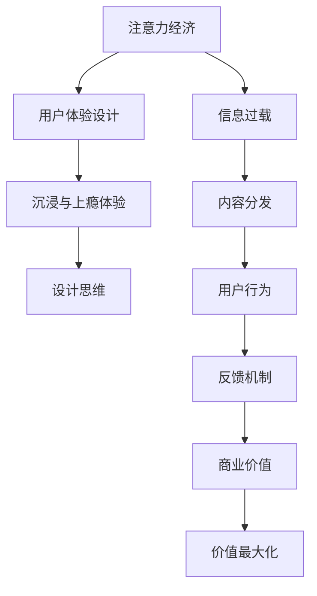

                 

# 注意力经济与用户体验设计思维：创建令人沉浸和上瘾的体验

在数字化时代，注意力成为一种稀缺资源，如何有效捕获和利用用户注意力，实现价值最大化，是数字经济的核心命题之一。本文将深入探讨注意力经济与用户体验设计的核心思想，详细阐述创建令人沉浸和上瘾体验的策略与方法，从技术、艺术、心理学等多个角度全面解析这一命题。

## 1. 背景介绍

### 1.1 问题由来

随着互联网和移动设备的普及，信息洪流铺天盖地，用户在面对海量内容时，注意力分散、筛选困难。这不仅导致信息传播效果降低，也使得内容创作者难以获得应有的回报。注意力经济（Attention Economy）的概念应运而生，它强调在信息过载的语境下，如何高效分配稀缺的注意力资源，创造更大的价值。

用户体验设计（User Experience Design, UXD）作为关注用户感受和行为的设计方法论，通过提升用户满意度和参与度，进而增强用户黏性和忠诚度，最终实现商业价值。本文将结合注意力经济和用户体验设计，探讨如何创建令人沉浸和上瘾的体验，驱动用户价值最大化。

### 1.2 问题核心关键点

本文聚焦于以下几个关键点：
1. 注意力资源的有效利用
2. 用户体验设计思维
3. 沉浸与上瘾的体验设计策略
4. 创建令人上瘾的用户体验

## 2. 核心概念与联系

### 2.1 核心概念概述

- **注意力经济**：强调在信息过载的背景下，如何合理分配注意力资源，提升信息传播和内容消费的效率与质量，从而实现更高的商业价值。
- **用户体验设计**：通过用户行为和心理模型，创造满足用户需求且能够带来愉悦感的体验，增强用户黏性和忠诚度，实现商业目标。
- **沉浸与上瘾体验**：利用心理学原理和设计技巧，让用户长时间保持高度专注与兴趣，进而不断增加用户互动与消费频率。
- **设计思维**：以用户为中心，通过共情、原型、迭代等步骤，系统地设计满足用户需求的产品与服务。

这些概念之间存在着紧密的联系，共同构成了数字时代注意力经济与用户体验设计的理论框架。注意力经济是用户经济行为的基础，用户体验设计则是实现注意力经济的手段，而沉浸与上瘾体验则是终极目标。

### 2.2 核心概念原理和架构的 Mermaid 流程图



这个流程图展示了注意力经济与用户体验设计的核心关系与流程：

1. **信息过载**：现代社会的信息爆炸现象。
2. **内容分发**：利用算法和推荐系统，将内容推送至用户。
3. **用户行为**：用户对内容的互动与消费行为。
4. **反馈机制**：用户反馈循环，优化内容分发。
5. **商业价值**：通过用户行为驱动的商业模型。
6. **价值最大化**：最终目标是通过提升用户体验实现价值最大化。

## 3. 核心算法原理 & 具体操作步骤

### 3.1 算法原理概述

注意力经济与用户体验设计的核心算法围绕着以下几个方面展开：

- **内容推荐算法**：通过用户行为数据（如浏览历史、点击率等），使用机器学习模型预测用户可能感兴趣的内容，进行个性化推荐。
- **交互设计**：通过用户界面和交互元素（如按钮、链接等），优化用户体验，减少操作复杂度，提升用户满意度。
- **情感计算**：通过自然语言处理（NLP）和机器学习技术，分析用户情感倾向，调整内容推荐策略，提升用户情感连接。
- **个性化设计**：利用用户偏好和行为数据，定制化设计和推荐，提升用户参与度。

### 3.2 算法步骤详解

#### 步骤1：用户行为分析

1. **数据收集**：使用日志分析、用户调查等手段，收集用户的行为数据，如点击率、浏览时长、页面跳转等。
2. **数据清洗**：去除噪音和异常数据，确保数据质量。
3. **特征提取**：从行为数据中提取特征，如用户偏好、兴趣等。

#### 步骤2：个性化内容推荐

1. **模型选择**：选择适合的推荐算法，如协同过滤、基于内容的推荐、深度学习等。
2. **模型训练**：利用用户行为数据训练模型，优化推荐效果。
3. **推荐生成**：根据用户特征和模型预测，生成个性化推荐内容。

#### 步骤3：交互设计优化

1. **界面设计**：设计直观、易用的用户界面，减少操作复杂度。
2. **交互优化**：通过A/B测试等手段，优化交互效果，提升用户满意度。
3. **反馈机制**：建立用户反馈通道，持续改进产品功能。

#### 步骤4：情感计算与调整

1. **情感分析**：使用NLP技术，分析用户情感倾向，如积极、消极、中性等。
2. **情感调整**：根据情感分析结果，调整内容推荐策略，提升用户情感连接。
3. **情感反馈**：收集用户情感反馈，进一步优化推荐算法。

### 3.3 算法优缺点

#### 优点

1. **个性化推荐**：通过个性化内容推荐，提升用户满意度，增加消费频次。
2. **减少操作复杂度**：通过优化用户界面和交互，减少用户操作步骤，提升用户体验。
3. **情感连接增强**：通过情感计算，增强用户情感连接，提升用户忠诚度。
4. **数据驱动优化**：利用用户数据进行持续优化，提升推荐效果。

#### 缺点

1. **数据隐私问题**：收集和分析用户行为数据，可能侵犯用户隐私。
2. **算法偏见**：推荐算法可能存在偏见，影响用户体验。
3. **资源消耗高**：个性化推荐和情感计算需要大量计算资源。
4. **用户体验单一**：过度依赖推荐算法，可能导致用户体验单一化。

### 3.4 算法应用领域

基于注意力经济与用户体验设计的方法，广泛应用在以下几个领域：

1. **电商推荐系统**：通过个性化推荐，提升用户体验和购买率。
2. **内容分发平台**：如新闻、视频、音乐等，通过内容推荐，增加用户黏性。
3. **社交网络**：如微信、微博等，通过情感分析和个性化推荐，提升用户互动。
4. **智能客服**：通过自然语言处理和情感计算，优化用户体验，提升客户满意度。
5. **移动应用**：如游戏、教育等，通过沉浸与上瘾设计，增加用户参与度。

## 4. 数学模型和公式 & 详细讲解 & 举例说明

### 4.1 数学模型构建

以内容推荐系统为例，构建用户行为与内容推荐的数学模型。

1. **用户行为矩阵**：$U_{ij} = 1$ 表示用户 $i$ 浏览了内容 $j$，$U_{ij} = 0$ 表示未浏览。
2. **内容特征矩阵**：$V_{ij} = 1$ 表示内容 $j$ 具有特征 $i$，$V_{ij} = 0$ 表示不具有该特征。
3. **用户-内容互动矩阵**：$P_{ij} = \min(U_{ij}, V_{ij})$，表示用户对内容的兴趣程度。
4. **用户偏好向量**：$\boldsymbol{u}_i = \frac{P_{i1} + P_{i2} + \cdots + P_{in}}{\sum_{k=1}^{n}P_{ik}}$，表示用户对内容的偏好。

### 4.2 公式推导过程

基于上述模型，内容推荐系统的目标是最大化用户对内容的兴趣度，构建目标函数：

$$
\max_{\boldsymbol{u}, \boldsymbol{v}} \sum_{i=1}^{m} \sum_{j=1}^{n} u_i v_j P_{ij}
$$

其中 $m$ 表示用户数，$n$ 表示内容数。使用梯度上升算法优化目标函数，求解用户偏好向量和内容特征向量。

### 4.3 案例分析与讲解

假设某电商平台收集了用户对商品的历史浏览数据，如用户A浏览了商品B、C、D，未浏览商品E、F。构建用户行为矩阵 $U$ 和内容特征矩阵 $V$，计算用户A对内容的兴趣度，得到用户偏好向量 $\boldsymbol{u}_A$。然后，利用机器学习算法（如矩阵分解、深度学习等）训练推荐模型，预测用户A可能感兴趣的后续商品，进行个性化推荐。

## 5. 项目实践：代码实例和详细解释说明

### 5.1 开发环境搭建

1. **安装Python和相关库**：使用Anaconda创建虚拟环境，安装Numpy、Pandas、Scikit-learn、TensorFlow等库。
2. **数据准备**：收集用户行为数据，如浏览记录、点击率等，并清洗、预处理数据。
3. **模型训练**：使用TensorFlow或PyTorch搭建推荐模型，训练数据集。

### 5.2 源代码详细实现

#### 代码1：数据预处理

```python
import pandas as pd
import numpy as np

# 读取用户行为数据
data = pd.read_csv('user_behavior.csv')

# 计算用户对内容的兴趣度
user_interest = data.groupby('user_id').mean().dropna()

# 构建用户行为矩阵和内容特征矩阵
U = np.array(user_interest['user_id'].map(lambda x: 1 if x in data['user_id'] else 0))
V = np.array(data.groupby('content_id').agg({'user_id': 'count'}))

# 计算用户-内容互动矩阵
P = np.minimum(U, V)

# 计算用户偏好向量
user_preference = np.sum(P, axis=1) / np.sum(P, axis=0)

# 保存结果
np.save('U.npy', U)
np.save('V.npy', V)
np.save('P.npy', P)
np.save('user_preference.npy', user_preference)
```

#### 代码2：模型训练与推荐

```python
import tensorflow as tf
import tensorflow_datasets as tfds
import tensorflow_addons as tfa

# 加载推荐模型
model = tf.keras.models.load_model('recommender_model.h5')

# 加载用户行为数据
U = np.load('U.npy')
V = np.load('V.npy')
P = np.load('P.npy')
user_preference = np.load('user_preference.npy')

# 用户行为数据
user_id = user_preference.index

# 预测推荐内容
recommendations = model.predict(user_preference).argmax(axis=-1)

# 输出推荐内容
for i, recommendation in zip(user_id, recommendations):
    print(f"User {i} is recommended to browse content {recommendation}")
```

### 5.3 代码解读与分析

- **数据预处理**：使用Pandas和NumPy对用户行为数据进行预处理，构建用户行为矩阵、内容特征矩阵和用户偏好向量。
- **模型训练**：使用TensorFlow搭建推荐模型，进行模型训练和预测。
- **推荐生成**：根据用户偏好向量，使用推荐模型预测用户可能感兴趣的内容。

### 5.4 运行结果展示

运行代码后，将输出用户ID及其推荐内容列表，展示推荐系统的个性化推荐效果。

## 6. 实际应用场景

### 6.1 电商平台推荐系统

电商平台通过个性化推荐，提升用户体验和销售额。利用用户浏览记录和购买历史，训练推荐模型，生成个性化推荐商品列表，增加用户停留时间和购买频次。

### 6.2 内容分发平台

内容分发平台如Netflix、YouTube等，通过个性化推荐，提升用户观看时长和订阅率。分析用户行为数据，预测用户可能感兴趣的内容，进行精准推荐，增加用户黏性。

### 6.3 社交网络

社交网络如Facebook、Twitter等，通过情感分析和个性化推荐，增强用户互动。分析用户情感倾向，调整内容推荐策略，增加用户情感连接和互动频率。

### 6.4 智能客服

智能客服系统通过自然语言处理和情感计算，提升用户体验。利用用户输入的文本，进行情感分析，调整回答策略，提升客户满意度。

## 7. 工具和资源推荐

### 7.1 学习资源推荐

1. **《用户界面设计基础》**：深入讲解用户体验设计的核心原则和设计方法。
2. **《设计心理学》**：介绍用户行为心理学，指导设计决策。
3. **《推荐系统实战》**：详细解析推荐系统的实现细节和算法优化。
4. **《自然语言处理》**：讲解自然语言处理技术，为情感计算提供基础。
5. **《机器学习》**：系统学习机器学习算法，为个性化推荐提供理论支持。

### 7.2 开发工具推荐

1. **Anaconda**：创建和管理虚拟环境，便于多项目管理。
2. **TensorFlow**：深度学习框架，适合构建推荐系统。
3. **PyTorch**：灵活的深度学习框架，适合原型设计和优化。
4. **TensorFlow Addons**：提供高级组件和模型，加速推荐系统开发。
5. **Scikit-learn**：机器学习库，适合数据处理和特征工程。

### 7.3 相关论文推荐

1. **《推荐系统：个性化排序与过滤》**：讲解推荐系统的基本原理和推荐算法。
2. **《用户界面设计模式》**：介绍设计模式和最佳实践，提升界面设计质量。
3. **《情感计算在推荐系统中的应用》**：探讨情感计算在推荐系统中的作用和效果。
4. **《个性化推荐系统的构建与优化》**：介绍个性化推荐系统的构建和优化方法。
5. **《注意力机制在推荐系统中的应用》**：探讨注意力机制在推荐系统中的应用效果。

## 8. 总结：未来发展趋势与挑战

### 8.1 总结

本文深入探讨了注意力经济与用户体验设计的核心思想，详细阐述了创建令人沉浸和上瘾体验的策略与方法。从技术、艺术、心理学等多个角度，全面解析了这一命题。

通过本文的系统梳理，可以看到，注意力经济与用户体验设计是数字时代商业成功的关键因素。设计思维、个性化推荐、情感计算等技术手段，可以有效提升用户体验，增加用户黏性和忠诚度，驱动商业价值的最大化。未来，这些技术将在更多行业领域得到应用，为传统行业数字化转型提供新的动力。

### 8.2 未来发展趋势

未来，注意力经济与用户体验设计将呈现以下几个趋势：

1. **多模态交互**：结合文本、语音、图像等多模态信息，提升用户互动体验。
2. **增强现实与虚拟现实**：利用AR/VR技术，创造沉浸式用户体验，增加用户黏性。
3. **智能家居与物联网**：通过智能设备收集用户行为数据，实现个性化推荐。
4. **区块链技术**：利用区块链去中心化特性，保障数据隐私和安全。
5. **联邦学习**：在用户数据隐私保护的前提下，实现个性化推荐。

这些趋势凸显了数字时代技术发展的方向，必将为注意力经济与用户体验设计带来新的机遇和挑战。

### 8.3 面临的挑战

尽管注意力经济与用户体验设计已经取得了显著成就，但在迈向更加智能化、普适化应用的过程中，仍面临诸多挑战：

1. **数据隐私与安全**：用户行为数据的收集和使用可能侵犯隐私，需要建立严格的隐私保护机制。
2. **算法公平性**：推荐算法可能存在偏见，影响用户体验，需要保证算法的公平性和透明性。
3. **计算资源消耗**：个性化推荐和情感计算需要大量计算资源，如何优化算法效率，降低计算成本，是重要挑战。
4. **用户体验单一化**：过度依赖推荐算法，可能导致用户体验单一化，需要多元化设计策略。

### 8.4 研究展望

未来，关注以下几点将有助于推动注意力经济与用户体验设计的进一步发展：

1. **跨模态交互技术**：结合文本、语音、图像等多模态信息，提升用户体验。
2. **用户行为建模**：利用深度学习模型，更好地理解用户行为和需求，优化推荐效果。
3. **情感计算与情绪管理**：结合情绪计算技术，实现用户情绪的实时监测和反馈，提升用户体验。
4. **个性化推荐系统优化**：利用分布式计算和联邦学习，实现高效推荐，保障用户隐私。
5. **智能互动设计**：利用人工智能技术，提升智能客服和智能助手的互动效果。

## 9. 附录：常见问题与解答

**Q1：如何平衡个性化推荐与用户隐私保护？**

A: 可以通过联邦学习等技术，在不共享用户数据的前提下，实现个性化推荐。同时，建立严格的隐私保护机制，如数据加密、匿名化处理等。

**Q2：推荐算法的公平性如何保证？**

A: 可以通过公平性评估和算法优化，确保推荐算法的公平性。同时，引入专家评审和用户反馈，及时调整算法策略。

**Q3：如何提升推荐算法的效率？**

A: 可以使用分布式计算、模型压缩等技术，提升推荐系统的效率。同时，优化数据处理流程，减少不必要的计算。

**Q4：如何设计沉浸与上瘾体验？**

A: 可以通过游戏化设计、个性化推荐等手段，提升用户互动和参与度。同时，利用情感计算和用户行为分析，优化用户体验。

**Q5：如何处理用户行为数据的噪音？**

A: 可以通过数据清洗、异常检测等手段，去除噪音数据，提高数据质量。同时，引入时间序列分析等方法，更好地理解用户行为趋势。

---

作者：禅与计算机程序设计艺术 / Zen and the Art of Computer Programming

