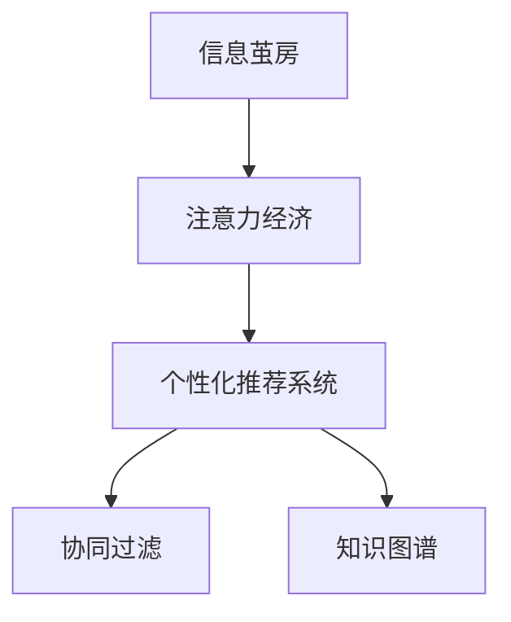

                 

# 注意力经济中的信息茧房效应

> 关键词：信息茧房,注意力经济,推荐系统,用户行为,认知偏差

## 1. 背景介绍

### 1.1 问题由来

在信息爆炸的今天，互联网为人们提供了海量的内容源，无论是新闻、文章、视频，还是音乐、游戏、直播，应有尽有。然而，面对如此纷繁复杂的信息，用户却往往难以分辨其价值，常常陷入"信息过载"的困境。为了解决这一问题，个性化推荐系统应运而生。通过学习用户的历史行为数据，推荐系统能够精准推荐符合用户兴趣的内容，提升用户体验，为用户节约宝贵的时间。

然而，随着推荐系统应用的普及，一种被称为"信息茧房"的现象逐渐显现。信息茧房指用户长期处于个性化推荐系统构建的闭环中，只接触到自己感兴趣的或看似相似的信息，形成知识孤岛，难以获取更广泛的知识和信息。信息茧房的存在，不仅加剧了"回声室"效应，也影响了用户的认知和判断能力，可能导致社会共识的分裂和极化。

如何构建既能提供个性化服务，又能防止信息茧房出现的多元化推荐系统，成为了当前研究的热点问题。本文将重点探讨信息茧房产生的机制，分析当前推荐系统的优缺点，提出一系列应对策略，并展望未来的发展趋势。

## 2. 核心概念与联系

### 2.1 核心概念概述

为更好地理解信息茧房现象及其与推荐系统的联系，本节将介绍几个关键概念：

- 信息茧房(Information Bubble)：用户长期接触特定类型的信息，难以获取更广泛的知识，形成认知偏差的闭环。
- 注意力经济(Attention Economy)：互联网时代，用户注意力成为稀缺资源，商家通过推荐系统争夺用户注意力的经济模式。
- 个性化推荐系统(Personalized Recommendation System)：利用用户历史行为数据，向用户推荐其感兴趣的内容的系统。
- 协同过滤(Collaborative Filtering)：推荐系统中最经典的算法，通过用户行为数据的协同关系推荐相似物品。
- 知识图谱(Knowledge Graph)：结构化的大型知识库，用于描述实体之间的关系。

这些核心概念之间的逻辑关系可以通过以下Mermaid流程图来展示：



这个流程图展示了几者之间的内在联系：

1. 信息茧房与注意力经济紧密相关，用户只接触感兴趣的、获取注意力的信息，难以跳出闭环。
2. 个性化推荐系统利用用户历史行为数据，推荐相似内容，加剧了信息茧房现象。
3. 协同过滤算法是推荐系统的主流方法，通过用户间行为的相似性推荐物品。
4. 知识图谱用于丰富推荐系统的知识表示，弥补协同过滤的局限性。

这些概念共同构成了互联网推荐系统的核心框架，使用户能够获得个性化推荐的同时，也面临信息茧房的风险。

## 3. 核心算法原理 & 具体操作步骤

### 3.1 算法原理概述

个性化推荐系统通过学习用户的历史行为数据，预测其对物品的兴趣，从而推荐相似的物品。其核心思想是：通过用户的兴趣特征和物品的属性特征，计算二者之间的相似度，进而找到用户可能感兴趣的物品。

具体而言，推荐系统通常包括以下几个步骤：

1. 数据采集：从用户行为数据、商品属性数据等来源获取数据。
2. 特征工程：对数据进行预处理和特征提取，生成用户画像和物品特征向量。
3. 相似度计算：根据用户画像和物品特征向量，计算二者之间的相似度。
4. 推荐排序：将相似度较高的物品推荐给用户。

### 3.2 算法步骤详解

以下是具体推荐系统的步骤详解：

**Step 1: 数据采集**
- 从用户点击、浏览、购买、评分等行为中提取特征，生成用户画像。
- 收集商品的属性、标签、类别等信息，生成物品特征向量。

**Step 2: 特征工程**
- 对用户行为数据进行标准化和归一化，生成用户画像。
- 对物品属性进行特征选择和降维，生成物品特征向量。
- 利用聚类算法，对用户和物品进行分类，便于后续相似度计算。

**Step 3: 相似度计算**
- 计算用户画像与物品特征向量之间的相似度，可采用余弦相似度、欧式距离等。
- 根据相似度大小，对物品进行排序，并选取前N个物品推荐给用户。

**Step 4: 推荐排序**
- 综合考虑用户画像、物品属性、相似度等特征，对物品进行多维度排序。
- 引入排名算法，如AdaBoost、LRM等，提高推荐效果。

### 3.3 算法优缺点

个性化推荐系统具有以下优点：
1. 精准推荐：通过用户历史行为数据，推荐用户可能感兴趣的物品。
2. 提高用户满意度：个性化推荐系统能够提升用户的使用体验，增加黏性。
3. 资源优化：根据用户兴趣推荐物品，减少资源浪费。

同时，该系统也存在一定的局限性：
1. 数据需求高：推荐系统依赖大量用户行为数据，收集和存储成本高。
2. 算法复杂：协同过滤等算法计算复杂，难以处理大规模数据。
3. 模型泛化差：推荐模型往往在特定用户数据上表现良好，泛化到其他用户效果差。
4. 信息孤岛：只推荐相似物品，难以跳出用户兴趣闭环，形成信息茧房。

尽管存在这些局限性，但推荐系统目前仍是最主流的信息提供方式之一，在大数据时代具有不可替代的重要作用。未来相关研究将重点关注如何从根本上缓解信息茧房现象，提高推荐系统的多样化与泛化能力。

### 3.4 算法应用领域

个性化推荐系统目前已经被广泛应用于电子商务、社交媒体、视频网站等多个领域，成为信息提供的重要手段。以下是几个典型的应用场景：

- 电商推荐：根据用户购买和浏览历史，推荐相似商品。
- 社交网络：根据用户的朋友圈、点赞、评论等信息，推荐相关内容。
- 视频网站：根据用户观看的视频历史，推荐类似视频。
- 新闻网站：根据用户阅读的新闻历史，推荐相关文章。
- 智能音箱：根据用户的语音指令，推荐相关音频内容。

除了上述这些经典应用外，推荐系统还在更多领域得到了应用，如金融、医疗、旅游等，为各行各业提供精准的信息推荐。

## 4. 数学模型和公式 & 详细讲解  
### 4.1 数学模型构建

本节将使用数学语言对个性化推荐系统进行更加严格的刻画。

记用户画像为 $u \in \mathbb{R}^d$，物品特征向量为 $i \in \mathbb{R}^d$，相似度为 $s(u, i) \in [0, 1]$。则推荐模型可以表示为：

$$
r(u, i) = s(u, i) \times f(i)
$$

其中 $f(i)$ 为物品的特征函数。

在实际推荐系统中，往往使用协同过滤算法来计算相似度，具体公式为：

$$
s(u, i) = \frac{\mathbf{u} \cdot \mathbf{i}}{\|\mathbf{u}\| \|\mathbf{i}\|}
$$

其中 $\mathbf{u} \cdot \mathbf{i}$ 表示向量内积，$\|\mathbf{u}\|$ 和 $\|\mathbf{i}\|$ 分别表示向量的欧氏范数。

### 4.2 公式推导过程

设用户历史行为数据为 $\mathcal{U} = \{u_1, u_2, ..., u_N\}$，物品特征向量为 $\mathcal{I} = \{i_1, i_2, ..., i_M\}$。则推荐系统可以进一步表示为：

$$
\mathbf{U} = [u_1; u_2; ...; u_N], \mathbf{I} = [i_1; i_2; ...; i_M]
$$

其中 $u_k$ 和 $i_j$ 分别表示用户和物品的特征向量。

用户和物品的相似度矩阵为：

$$
\mathbf{S} = \mathbf{U} \mathbf{I}^T
$$

在推荐系统中，通常采用AdaBoost算法对相似度进行排序，并选取前K个物品进行推荐。AdaBoost算法的目标函数为：

$$
\min \quad \sum_{k=1}^{N} w_k \log \frac{p_k}{\sum_{j=1}^{M} s(u_k, i_j) w_j}
$$

其中 $p_k$ 为第 $k$ 个用户的点击概率，$w_j$ 为物品 $i_j$ 的权重。

### 4.3 案例分析与讲解

以电商推荐为例，具体分析推荐系统的工作流程：

- 数据采集：电商网站记录用户点击、浏览、购买等行为，生成用户画像。
- 特征工程：对用户行为数据进行标准化和归一化，生成用户画像。
- 物品特征：记录商品的属性、标签、类别等信息，生成物品特征向量。
- 相似度计算：计算用户画像与物品特征向量之间的相似度，并排序。
- 推荐排序：根据相似度大小，选取前N个物品推荐给用户。

具体来说，用户画像和物品特征向量的计算公式为：

$$
u_k = \sum_{j=1}^{M} w_j x_{k,j}
$$

其中 $x_{k,j}$ 表示第 $k$ 个用户在商品 $j$ 上的点击次数，$w_j$ 为商品的权重。

物品特征向量的计算公式为：

$$
i_j = \sum_{k=1}^{N} w_k x_{k,j}
$$

其中 $x_{k,j}$ 表示第 $k$ 个用户对商品 $j$ 的评分。

## 5. 项目实践：代码实例和详细解释说明
### 5.1 开发环境搭建

在进行推荐系统实践前，我们需要准备好开发环境。以下是使用Python进行Scikit-learn开发的环境配置流程：

1. 安装Anaconda：从官网下载并安装Anaconda，用于创建独立的Python环境。

2. 创建并激活虚拟环境：
```bash
conda create -n recommendation-env python=3.8 
conda activate recommendation-env
```

3. 安装Scikit-learn：
```bash
conda install scikit-learn
```

4. 安装各类工具包：
```bash
pip install numpy pandas scikit-learn matplotlib tqdm jupyter notebook ipython
```

完成上述步骤后，即可在`recommendation-env`环境中开始推荐系统开发。

### 5.2 源代码详细实现

下面我们以电商推荐为例，给出使用Scikit-learn对协同过滤算法进行实现的PyTorch代码。

首先，定义数据集：

```python
from sklearn.datasets import load_breast_cancer
from sklearn.model_selection import train_test_split

X, y = load_breast_cancer(return_X_y=True)
train_X, test_X, train_y, test_y = train_test_split(X, y, test_size=0.2, random_state=42)

# 计算特征值
X_train_mean = train_X.mean(axis=0)
X_train_std = train_X.std(axis=0)
X_train = (X_train - X_train_mean) / X_train_std
X_test = (test_X - X_train_mean) / X_train_std
```

然后，定义协同过滤模型：

```python
from sklearn.neighbors import NearestNeighbors

model = NearestNeighbors(n_neighbors=5, algorithm='brute', leaf_size=30)
model.fit(X_train)
```

最后，进行推荐测试：

```python
def recommend(model, X_test, y_test, k=5):
    # 计算相似度
    distances, indices = model.kneighbors(X_test)
    
    # 生成推荐列表
    recommend_list = []
    for i, index in enumerate(indices[0]):
        recommend_list.append((y_test[index], indices[0][i]))
    return recommend_list

# 进行推荐
recommend_list = recommend(model, X_test, test_y, k=5)
print(recommend_list)
```

以上就是使用Scikit-learn对协同过滤算法进行电商推荐的具体代码实现。可以看到，Scikit-learn提供了简单易用的接口，使得推荐系统的开发变得简单高效。

### 5.3 代码解读与分析

让我们再详细解读一下关键代码的实现细节：

**数据集加载与预处理**：
- 使用Scikit-learn自带的乳腺癌数据集作为示例数据。
- 对数据进行标准化处理，将特征值归一化到均值为0，方差为1的区间。

**协同过滤模型**：
- 定义NearestNeighbors模型，设置近邻数为5，采用暴力搜索算法，叶子节点大小为30。
- 使用训练数据对模型进行拟合，学习用户画像与物品特征向量的相似度。

**推荐测试**：
- 定义推荐函数，计算测试数据与训练数据的相似度，生成推荐列表。
- 输出推荐列表，展示推荐结果。

可以看到，Scikit-learn的协同过滤算法能够高效地处理用户画像和物品特征向量，推荐系统也易于理解和调试。

当然，工业级的系统实现还需考虑更多因素，如模型的训练和测试、超参数的自动搜索、推荐策略的优化等。但核心的协同过滤范式基本与此类似。

## 6. 实际应用场景
### 6.1 电子商务推荐

个性化推荐系统在电子商务中得到了广泛应用。电商网站通过记录用户的历史购买和浏览行为，为用户推荐相似的商品，提升销售额。

在技术实现上，可以收集用户对商品的属性、评分、浏览时间等数据，生成用户画像和物品特征向量，利用协同过滤算法进行推荐。电商网站可以实时更新推荐列表，增加用户的购物体验和购买意愿。

### 6.2 视频网站推荐

视频网站利用个性化推荐系统，为用户推荐感兴趣的影片、纪录片、综艺节目等视频内容，提升用户观看时长和满意度。

在技术实现上，视频网站可以记录用户的观看历史、评分、点赞等行为，生成用户画像和视频特征向量，利用协同过滤算法进行推荐。视频网站可以实时更新推荐列表，提供个性化视频推荐服务。

### 6.3 社交网络推荐

社交网络通过个性化推荐系统，为用户推荐相关的朋友、帖子、话题等，丰富用户的内容消费体验。

在技术实现上，社交网络可以记录用户的点赞、评论、分享等行为，生成用户画像和内容特征向量，利用协同过滤算法进行推荐。社交网络可以实时更新推荐列表，提供个性化内容推荐服务。

### 6.4 未来应用展望

随着推荐系统的不断发展，未来将在更多领域得到应用，为各行各业带来变革性影响。

在智慧城市治理中，推荐系统可以用于城市事件监测、舆情分析、应急指挥等环节，提高城市管理的自动化和智能化水平。

在智能家居领域，推荐系统可以用于家电推荐、智能家居场景控制等，提升用户生活体验。

在智能交通中，推荐系统可以用于路线推荐、出行方案规划等，优化用户出行体验。

此外，在医疗、教育、金融等多个领域，推荐系统也将不断涌现，为各行各业提供精准的信息推荐服务。

## 7. 工具和资源推荐
### 7.1 学习资源推荐

为了帮助开发者系统掌握推荐系统的理论基础和实践技巧，这里推荐一些优质的学习资源：

1. 《推荐系统实战》系列博文：由大模型技术专家撰写，深入浅出地介绍了推荐系统原理、协同过滤算法、深度学习等前沿话题。

2. CS4701《推荐系统》课程：斯坦福大学开设的推荐系统课程，涵盖了协同过滤、深度学习等推荐算法，是推荐系统入门的不二之选。

3. 《推荐系统》书籍：李航所著的经典书籍，全面介绍了推荐系统的发展历程和核心算法，是推荐系统研究的权威教材。

4. Weights & Biases：模型训练的实验跟踪工具，可以记录和可视化模型训练过程中的各项指标，方便对比和调优。

5. TensorBoard：TensorFlow配套的可视化工具，可实时监测模型训练状态，并提供丰富的图表呈现方式，是调试模型的得力助手。

通过对这些资源的学习实践，相信你一定能够快速掌握推荐系统的精髓，并用于解决实际的推荐问题。

### 7.2 开发工具推荐

高效的开发离不开优秀的工具支持。以下是几款用于推荐系统开发的常用工具：

1. PyTorch：基于Python的开源深度学习框架，灵活动态的计算图，适合快速迭代研究。大部分推荐模型都有PyTorch版本的实现。

2. TensorFlow：由Google主导开发的开源深度学习框架，生产部署方便，适合大规模工程应用。同样有丰富的推荐模型资源。

3. Scikit-learn：基于Python的开源机器学习库，提供简单易用的接口，适合快速原型开发。

4. Jupyter Notebook：基于Web的交互式编程环境，便于快速调试和分享代码。

5. Weights & Biases：模型训练的实验跟踪工具，可以记录和可视化模型训练过程中的各项指标，方便对比和调优。

6. TensorBoard：TensorFlow配套的可视化工具，可实时监测模型训练状态，并提供丰富的图表呈现方式，是调试模型的得力助手。

合理利用这些工具，可以显著提升推荐系统的开发效率，加快创新迭代的步伐。

### 7.3 相关论文推荐

推荐系统的研究起源于学界的持续研究。以下是几篇奠基性的相关论文，推荐阅读：

1. Collaborative Filtering for Recommendation Learning: A Systematic Analysis and Comparison of Methods：介绍了协同过滤算法的经典方法，分析了不同算法的优缺点。

2. Neural Collaborative Filtering: User-Item Interaction via Matrix Factorization and Deep Learning：提出了深度协同过滤算法，通过神经网络模型提升推荐效果。

3. Knowledge-Graph-Based Recommendation：探讨了知识图谱在推荐系统中的应用，利用知识图谱丰富推荐系统的知识表示。

4. Hybrid Recommendation Systems: A Survey and Future Trends：总结了混合推荐系统的发展历程和未来趋势，提出了多种混合推荐算法的框架。

这些论文代表了大规模推荐系统的发展脉络。通过学习这些前沿成果，可以帮助研究者把握学科前进方向，激发更多的创新灵感。

## 8. 总结：未来发展趋势与挑战

### 8.1 总结

本文对个性化推荐系统的原理、步骤和应用进行了全面系统的介绍。首先阐述了推荐系统与信息茧房现象的联系，明确了推荐系统在用户注意力经济中的重要地位。其次，从原理到实践，详细讲解了推荐系统的数学模型和算法步骤，给出了推荐系统开发的完整代码实例。同时，本文还广泛探讨了推荐系统在电商、视频、社交等多个领域的应用前景，展示了推荐系统的强大能力。

通过本文的系统梳理，可以看到，个性化推荐系统通过精准推荐，极大地提升了用户体验，但同时也面临信息茧房的风险。为了解决这一问题，推荐系统需要在推荐算法、数据获取、用户行为分析等多个维度进行优化。未来，伴随推荐技术的不断演进，我们相信推荐系统必将带来更加多样化和智能化的推荐服务，助力互联网经济迈向新的高度。

### 8.2 未来发展趋势

展望未来，推荐系统的发展将呈现以下几个趋势：

1. 深度学习优化：引入深度神经网络，提升推荐系统的精度和泛化能力。
2. 多模态融合：融合视觉、听觉、文本等多模态数据，提供更加全面的推荐服务。
3. 知识图谱扩展：利用知识图谱丰富推荐系统的知识表示，提升推荐效果。
4. 动态推荐：利用用户实时行为数据进行动态推荐，提高推荐的时效性。
5. 可解释性增强：增强推荐系统的可解释性，提高透明度和可信度。
6. 公平性优化：优化推荐算法，减少数据偏见，提升推荐公平性。

这些趋势凸显了推荐系统的广阔前景。这些方向的探索发展，必将进一步提升推荐系统的性能和应用范围，为互联网经济带来更多的价值。

### 8.3 面临的挑战

尽管推荐系统目前已经取得了不错的效果，但在迈向更加智能化、普适化应用的过程中，仍面临诸多挑战：

1. 数据隐私问题：推荐系统依赖大量用户行为数据，如何保护用户隐私，确保数据安全，是一大难题。
2. 冷启动问题：对于新用户，推荐系统难以提供个性化推荐，需要进行更复杂的冷启动策略。
3. 算力成本：深度学习模型和复杂算法需要强大的算力支持，如何降低算力成本，优化模型计算图，是推荐系统未来的重要研究方向。
4. 多目标优化：推荐系统往往需要同时考虑多个目标，如点击率、转化率、用户满意度等，如何协调不同目标，是推荐系统面临的挑战。
5. 推荐效果评估：推荐系统的评价标准繁多，如何设计科学的评估指标，评估推荐效果，是一大难题。

这些挑战凸显了推荐系统的复杂性。只有通过跨学科合作，从算法、数据、工程等多个维度进行全面优化，才能真正实现推荐系统的多目标优化，提升用户体验和系统效果。

### 8.4 研究展望

面对推荐系统面临的种种挑战，未来的研究需要在以下几个方面寻求新的突破：

1. 探索推荐系统的公平性：推荐系统需要考虑用户的公平性，避免推荐算法偏见和歧视。
2. 研究推荐系统的可解释性：增强推荐系统的可解释性，提高透明度和可信度。
3. 发展推荐系统的多目标优化：优化推荐算法，实现点击率、转化率、用户满意度等多目标优化。
4. 提高推荐系统的泛化能力：通过深度学习等技术，提升推荐系统的泛化能力，减少数据偏差。
5. 利用知识图谱丰富推荐系统：利用知识图谱丰富推荐系统的知识表示，提升推荐效果。
6. 增强推荐系统的动态性：利用用户实时行为数据进行动态推荐，提高推荐的时效性。

这些研究方向的探索，必将引领推荐系统技术迈向更高的台阶，为互联网经济带来更多的价值。

## 9. 附录：常见问题与解答

**Q1：如何缓解推荐系统中的信息茧房现象？**

A: 信息茧房现象可以通过以下几种方法缓解：
1. 数据多样化：引入更多的数据源，提高推荐系统的多样性。
2. 推荐多样化：改变推荐算法，引入更多维度的特征，减少对用户历史行为的依赖。
3. 引导用户探索：通过推荐多样化的内容，引导用户跳出舒适区。
4. 引入知识图谱：利用知识图谱丰富推荐系统的知识表示，提升推荐效果。

这些方法可以结合使用，最大化地缓解信息茧房现象。

**Q2：推荐系统中的冷启动问题如何解决？**

A: 推荐系统中的冷启动问题可以通过以下几种方法解决：
1. 利用用户的基本信息：收集用户的基本信息，如性别、年龄、职业等，作为初始推荐基础。
2. 引入协同过滤：利用用户相似用户的行为数据，推荐相似物品。
3. 引入知识图谱：利用知识图谱丰富推荐系统的知识表示，提升推荐效果。
4. 引入深度学习：利用深度神经网络模型，提高推荐精度和泛化能力。

这些方法可以结合使用，最大化地缓解冷启动问题。

**Q3：推荐系统如何应对用户行为变化？**

A: 推荐系统应对用户行为变化，可以采取以下几种方法：
1. 实时更新用户画像：利用用户实时行为数据，更新用户画像。
2. 动态推荐策略：引入动态推荐算法，根据用户实时行为数据进行推荐。
3. 引入知识图谱：利用知识图谱丰富推荐系统的知识表示，提升推荐效果。

这些方法可以结合使用，最大化地应对用户行为变化。

**Q4：推荐系统的可解释性如何增强？**

A: 推荐系统的可解释性可以通过以下几种方法增强：
1. 引入可解释的推荐算法：如协同过滤、基于规则的推荐等，增强推荐算法的可解释性。
2. 利用知识图谱：利用知识图谱丰富推荐系统的知识表示，提升推荐效果，同时增强推荐系统的可解释性。
3. 引入用户反馈：通过用户反馈，优化推荐算法，提高推荐系统的可解释性。

这些方法可以结合使用，最大化地增强推荐系统的可解释性。

**Q5：推荐系统的公平性如何优化？**

A: 推荐系统的公平性可以通过以下几种方法优化：
1. 引入公平性评估指标：如性别、种族等敏感属性的公平性评估指标，优化推荐算法。
2. 引入多目标优化：考虑推荐系统的多个目标，如点击率、转化率、用户满意度等，优化推荐算法。
3. 利用知识图谱：利用知识图谱丰富推荐系统的知识表示，提升推荐效果，同时确保推荐系统的公平性。

这些方法可以结合使用，最大化地优化推荐系统的公平性。

**Q6：推荐系统的算力成本如何降低？**

A: 推荐系统的算力成本可以通过以下几种方法降低：
1. 引入深度学习：利用深度神经网络模型，提升推荐精度和泛化能力，同时降低模型计算量。
2. 引入模型压缩技术：如剪枝、量化、稀疏化等，减小模型参数量，降低算力需求。
3. 引入模型并行化：通过模型并行化，将大模型分解为多个小模型，降低单模型的算力需求。

这些方法可以结合使用，最大化地降低推荐系统的算力成本。

综上所述，推荐系统面临着信息茧房、冷启动、用户行为变化、可解释性、公平性和算力成本等诸多挑战。为了应对这些挑战，未来的研究需要在推荐算法、数据获取、用户行为分析等多个维度进行全面优化。只有通过跨学科合作，从算法、数据、工程等多个维度进行全面优化，才能真正实现推荐系统的多目标优化，提升用户体验和系统效果。

