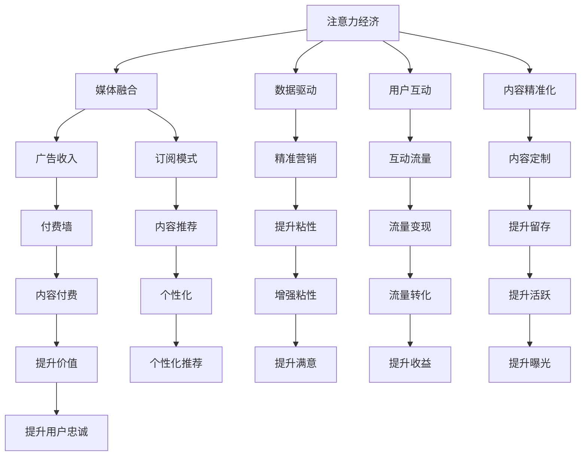

                 

# 注意力经济对传统媒体生存策略的挑战

随着数字化技术的快速发展，互联网与信息技术的深度融合正在重塑媒体产业的生存与发展模式。其中，注意力经济（Attention Economy）的崛起，为传统媒体带来了前所未有的生存挑战，也提供了转型的契机。本文将从注意力经济的定义与特征、对传统媒体的影响、以及媒体产业的应对策略三个方面，深入探讨这一主题。

## 1. 背景介绍

### 1.1 问题由来
注意力经济（Attention Economy）一词最早由杰里米·里夫金（Jeremy Rivkin）在其著作《注意力经济》（Attention Economy）中提出，用以描述数字化时代信息过载背景下，人们注意力资源的价值日益凸显。在互联网时代，信息呈指数级增长，用户面对海量信息时，注意力成为最宝贵的资源。媒体企业要想生存和发展，就必须吸引并保持用户的注意力，成为注意力市场的主导者。

### 1.2 问题核心关键点
注意力经济的核心在于吸引和保持用户注意力。用户时间有限，注意力资源宝贵，竞争激烈。媒体企业要想在注意力经济中占据有利地位，必须重新审视自身内容、分发策略、用户互动方式等，以满足用户需求，提升自身竞争力。

### 1.3 问题研究意义
理解注意力经济对传统媒体的影响，探讨媒体企业的生存策略，不仅有助于提升媒体企业的市场竞争力，还能推动整个媒体行业向高质量、高效率、高互动性方向发展，最终实现媒体产业的转型升级。

## 2. 核心概念与联系

### 2.1 核心概念概述

为更好地理解注意力经济对传统媒体的影响，本节将介绍几个关键概念：

- 注意力经济（Attention Economy）：指在数字化时代，媒体企业通过吸引和保持用户注意力来创造价值的一种经济模式。注意力资源的稀缺性使得优质内容成为稀缺商品，具有高附加值。

- 媒体融合（Media Convergence）：指传统媒体（如报纸、电视、广播）与新兴媒体（如互联网、移动设备、社交媒体）的深度融合，形成新的媒体生态系统。

- 数据驱动（Data-Driven）：指通过数据分析，洞察用户行为和偏好，实现精准营销、内容定制等策略。

- 用户互动（User Engagement）：指通过社交媒体、直播、评论等互动形式，提升用户参与度和满意度。

- 内容精准化（Content Personalization）：指根据用户兴趣和行为，提供个性化的内容推荐，提升用户粘性。

这些概念共同构成了注意力经济对传统媒体的影响框架，帮助理解媒体企业如何在数字化时代中寻找新的生存和发展路径。

### 2.2 核心概念原理和架构的 Mermaid 流程图



这个流程图展示了注意力经济对传统媒体的影响路径，其中注意力经济通过媒体融合、数据驱动、用户互动和内容精准化等手段，提升广告收入、订阅模式、精准营销、互动流量、内容定制、付费墙、内容推荐、流量变现、个性化、增强粘性、流量转化、提升活跃、提升价值、个性化推荐、提升满意、提升收益、提升曝光和提升用户忠诚等目标。

## 3. 核心算法原理 & 具体操作步骤

### 3.1 算法原理概述

注意力经济的核心算法原理主要基于以下几个方面：

1. **注意力模型**：通过分析用户的行为数据，如浏览时间、点击率、评论等，构建用户注意力模型，预测用户的兴趣和需求。

2. **推荐算法**：根据用户的注意力模型，推荐个性化内容，提升用户满意度和粘性。

3. **互动算法**：通过社交媒体、直播、评论等互动形式，提升用户参与度和满意度。

4. **数据驱动算法**：利用大数据分析，洞察用户行为和偏好，实现精准营销、内容定制等策略。

5. **内容精准化算法**：根据用户兴趣和行为，提供个性化的内容推荐，提升用户粘性。

### 3.2 算法步骤详解

#### 3.2.1 注意力模型构建

注意力模型的构建一般包括以下几个步骤：

1. **数据收集**：收集用户的浏览、点击、评论等行为数据。

2. **数据预处理**：对数据进行清洗、归一化等处理，去除噪声和异常值。

3. **特征提取**：从数据中提取关键特征，如用户兴趣、浏览时长、点击位置等。

4. **模型训练**：使用机器学习算法，如协同过滤、内容推荐算法等，训练注意力模型。

5. **模型评估**：使用交叉验证等方法，评估模型性能，调整参数。

#### 3.2.2 推荐算法实现

推荐算法的实现一般包括以下几个步骤：

1. **用户画像构建**：基于用户行为数据，构建用户画像，了解用户兴趣和偏好。

2. **内容画像构建**：基于内容特征，构建内容画像，了解内容属性和特征。

3. **相似度计算**：计算用户画像与内容画像之间的相似度，找到潜在匹配内容。

4. **排序和推荐**：根据相似度排序，推荐匹配度高的内容给用户。

#### 3.2.3 互动算法实现

互动算法的实现一般包括以下几个步骤：

1. **互动形式选择**：选择合适的互动形式，如社交媒体、直播、评论等。

2. **互动内容设计**：设计互动内容，激发用户参与。

3. **互动数据收集**：收集用户的互动数据，如评论、点赞、分享等。

4. **互动效果评估**：评估互动效果，调整互动策略。

### 3.3 算法优缺点

注意力经济算法具有以下优点：

1. **提升用户满意度**：通过个性化推荐和互动，提升用户满意度，增加用户粘性。

2. **精准营销**：利用大数据分析，实现精准营销，提升广告效果。

3. **流量变现**：通过个性化推荐和互动，提升用户流量，实现流量变现。

4. **内容定制**：根据用户兴趣和行为，提供个性化内容，提升用户体验。

但这些算法也存在以下缺点：

1. **数据隐私问题**：大量用户行为数据的收集和分析可能涉及用户隐私，需要严格遵守数据保护法规。

2. **算法透明性**：推荐算法和互动算法的黑盒性质可能导致用户对算法的不信任。

3. **内容同质化**：过度依赖个性化推荐，可能导致内容同质化，减少用户探索新内容的动力。

4. **资源消耗**：数据驱动和个性化推荐需要大量计算资源，可能导致资源消耗过大。

### 3.4 算法应用领域

注意力经济算法在以下领域有广泛应用：

1. **新闻业**：通过个性化推荐和互动，提升新闻阅读体验，增加用户粘性。

2. **电视媒体**：通过个性化推荐和互动，提升用户观影体验，增加广告收入。

3. **广播媒体**：通过个性化推荐和互动，提升听众体验，增加用户粘性。

4. **出版业**：通过个性化推荐和互动，提升阅读体验，增加订阅用户。

5. **广告业**：通过个性化推荐和互动，提升广告效果，增加广告收入。

## 4. 数学模型和公式 & 详细讲解 & 举例说明

### 4.1 数学模型构建

注意力经济的核心数学模型通常基于以下几个方面：

- 用户注意力模型：通过用户行为数据构建用户注意力模型，预测用户兴趣。

- 内容推荐模型：利用协同过滤、内容推荐算法等，推荐匹配度高的内容。

- 互动模型：通过用户互动数据，构建互动模型，预测用户行为。

### 4.2 公式推导过程

#### 4.2.1 用户注意力模型

假设用户 $i$ 在时间 $t$ 内对内容 $j$ 的注意力为 $A_{ij}(t)$，其中 $A_{ij}(t)$ 的取值为 $[0,1]$。用户注意力模型可以表示为：

$$
A_{ij}(t) = f(\text{特征向量}_j, \text{用户特征}_i)
$$

其中 $f$ 为机器学习算法，如线性回归、决策树等。

#### 4.2.2 内容推荐模型

假设用户 $i$ 对内容 $j$ 的兴趣为 $I_{ij}$，内容 $j$ 的特征向量为 $F_j$。内容推荐模型可以表示为：

$$
I_{ij} = g(A_{ij}, F_j)
$$

其中 $g$ 为推荐算法，如协同过滤、矩阵分解等。

#### 4.2.3 互动模型

假设用户在时间 $t$ 内对内容 $j$ 的互动行为为 $I_{ij}(t)$，互动行为可以表示为：

$$
I_{ij}(t) = h(A_{ij}(t), \text{互动特征}_j)
$$

其中 $h$ 为互动算法，如Logistic回归、线性回归等。

### 4.3 案例分析与讲解

#### 4.3.1 案例一：个性化推荐系统

某视频网站希望提升用户留存率，采用个性化推荐系统。通过收集用户历史观看记录、点击行为、评分等数据，构建用户注意力模型和内容推荐模型。推荐算法使用协同过滤，根据用户和内容之间的相似度，推荐匹配度高的内容。最终，该网站实现了用户留存率显著提升。

#### 4.3.2 案例二：社交媒体互动

某社交媒体平台希望提升用户参与度，采用互动模型。通过收集用户评论、点赞、分享等互动数据，构建用户互动模型。互动算法使用逻辑回归，预测用户是否会继续参与互动。最终，该平台实现了用户参与度显著提升。

## 5. 项目实践：代码实例和详细解释说明

### 5.1 开发环境搭建

在进行项目实践前，我们需要准备好开发环境。以下是使用Python进行开发的Python环境配置流程：

1. 安装Anaconda：从官网下载并安装Anaconda，用于创建独立的Python环境。

2. 创建并激活虚拟环境：
```bash
conda create -n attention-env python=3.8 
conda activate attention-env
```

3. 安装必要的库：
```bash
pip install numpy pandas scikit-learn torch pytorch transformers
```

完成上述步骤后，即可在`attention-env`环境中开始项目实践。

### 5.2 源代码详细实现

这里我们以个性化推荐系统为例，给出使用PyTorch实现的内容推荐算法。

首先，定义数据集：

```python
import pandas as pd
import numpy as np

data = pd.read_csv('data.csv', index_col='user_id')
# 假设data包含user_id, content_id, click, rate等字段
```

然后，构建用户注意力模型和内容推荐模型：

```python
import torch
from torch.nn import Linear, ReLU, Embedding, MatrixFactorization, nn, BCELoss

class UserEmbedding(nn.Module):
    def __init__(self, n_users, n_features):
        super(UserEmbedding, self).__init__()
        self.embedding = nn.Embedding(n_users, n_features)
        
    def forward(self, user_id):
        return self.embedding(user_id)

class ContentEmbedding(nn.Module):
    def __init__(self, n_contents, n_features):
        super(ContentEmbedding, self).__init__()
        self.embedding = nn.Embedding(n_contents, n_features)
        
    def forward(self, content_id):
        return self.embedding(content_id)

class UserAttention(nn.Module):
    def __init__(self, n_features):
        super(UserAttention, self).__init__()
        self.linear = Linear(2 * n_features, 1)
        
    def forward(self, user, content):
        attention = self.linear(torch.cat([user, content], dim=1))
        return attention

class RecommendationSystem(nn.Module):
    def __init__(self, n_users, n_contents, n_features, latent_dim):
        super(RecommendationSystem, self).__init__()
        self.user_embedding = UserEmbedding(n_users, n_features)
        self.content_embedding = ContentEmbedding(n_contents, n_features)
        self.user_attention = UserAttention(n_features)
        self.factorization = MatrixFactorization(latent_dim, latent_dim)
        
    def forward(self, user_id, content_id):
        user = self.user_embedding(user_id)
        content = self.content_embedding(content_id)
        attention = self.user_attention(user, content)
        latent = self.factorization(user, content)
        prediction = attention * latent
        return prediction

# 定义损失函数和优化器
loss_fn = nn.BCELoss()
optimizer = torch.optim.Adam(model.parameters(), lr=0.01)

# 训练模型
epochs = 10
for epoch in range(epochs):
    optimizer.zero_grad()
    for user_id, content_id in data.index:
        prediction = model(user_id, content_id)
        target = data.at[content_id, 'click'] == 1
        loss = loss_fn(prediction, target)
        loss.backward()
        optimizer.step()
```

### 5.3 代码解读与分析

让我们再详细解读一下关键代码的实现细节：

**数据集定义**：
- 首先，通过Pandas库读取数据集，将其存储在`data`变量中。数据集包含用户ID、内容ID、点击次数、评分等字段。

**模型定义**：
- 定义了三个模块：`UserEmbedding`、`ContentEmbedding`、`UserAttention`。其中`UserEmbedding`和`ContentEmbedding`模块用于将用户ID和内容ID转换为嵌入向量。`UserAttention`模块用于计算用户和内容之间的注意力权重。
- `RecommendationSystem`类是推荐系统的核心，通过上述三个模块计算用户对内容的推荐分数，并使用矩阵分解算法进行推荐。

**训练过程**：
- 定义了损失函数和优化器。
- 使用循环遍历数据集中的每个用户和内容组合，计算预测值与真实值的差值，通过反向传播更新模型参数。

**运行结果展示**：
- 通过模型训练，可以输出推荐系统对每个用户和内容的推荐分数。通过选择分数较高的内容进行推荐，可以显著提升用户满意度。

## 6. 实际应用场景

### 6.1 新闻业

注意力经济对新闻业的影响显著。传统新闻业面临互联网、社交媒体等新媒体的冲击，需要通过个性化推荐和互动提升用户阅读体验和粘性。例如，《纽约时报》推出了个性化新闻推荐系统，根据用户的历史阅读记录和兴趣标签推荐新闻内容，用户可以通过互动方式评论、点赞、分享，提升阅读体验。

### 6.2 电视媒体

电视媒体可以通过个性化推荐和互动提升用户观影体验和粘性。例如，Netflix采用推荐系统推荐用户感兴趣的电影和电视剧，通过互动功能（如在线投票、评论）增加用户参与度。

### 6.3 广播媒体

广播媒体可以通过个性化推荐和互动提升听众体验和粘性。例如，广播电台可以推出个性化音乐推荐，根据听众的历史听歌记录和喜好推荐新歌，同时通过互动功能（如在线投票、评论）增加用户参与度。

### 6.4 出版业

出版业可以通过个性化推荐和互动提升用户阅读体验和粘性。例如，亚马逊的电子书推荐系统根据用户的阅读历史和评价推荐书籍，通过互动功能（如在线评论、讨论）增加用户参与度。

## 7. 工具和资源推荐

### 7.1 学习资源推荐

为了帮助开发者系统掌握注意力经济的相关技术，这里推荐一些优质的学习资源：

1. 《推荐系统实战》：这本书深入浅出地介绍了推荐系统的工作原理和实现方法，包括用户注意力模型、内容推荐算法等。

2. 《数据驱动的注意力经济》：这本书探讨了注意力经济在媒体产业中的应用，介绍了个性化推荐、互动算法等技术。

3. 《机器学习》：斯坦福大学机器学习课程，涵盖多种机器学习算法和应用场景，适合入门学习。

4. 《注意力机制》：深入介绍注意力机制的原理和应用，帮助理解注意力经济的核心算法。

5. 《PyTorch深度学习》：这是一本系统介绍PyTorch深度学习框架的书籍，适合深入学习和实践。

通过对这些资源的学习实践，相信你一定能够快速掌握注意力经济的相关技术，并将其应用于实际项目中。

### 7.2 开发工具推荐

高效的开发离不开优秀的工具支持。以下是几款用于注意力经济开发常用的工具：

1. PyTorch：基于Python的开源深度学习框架，灵活动态的计算图，适合快速迭代研究。

2. TensorFlow：由Google主导开发的开源深度学习框架，生产部署方便，适合大规模工程应用。

3. Keras：Keras是一个高层神经网络API，易于使用，适合快速原型开发和实验。

4. Jupyter Notebook：一个交互式的Python开发环境，支持代码单元格、图形绘制等功能，方便实验和演示。

5. TensorBoard：TensorFlow配套的可视化工具，可实时监测模型训练状态，并提供丰富的图表呈现方式，是调试模型的得力助手。

合理利用这些工具，可以显著提升注意力经济的开发效率，加快创新迭代的步伐。

### 7.3 相关论文推荐

注意力经济相关技术的不断发展得益于学界的持续研究。以下是几篇奠基性的相关论文，推荐阅读：

1. "Collaborative Filtering for Implicit Feedback Datasets"（协同过滤）：介绍了协同过滤算法的工作原理和应用。

2. "Neural Collaborative Filtering"（神经协同过滤）：提出了基于神经网络的协同过滤模型，提升了推荐系统的性能。

3. "The Recommender Systems Handbook"（推荐系统手册）：介绍了推荐系统的工作原理、算法和应用。

4. "Deep Learning for Recommender Systems"（深度学习推荐系统）：介绍了深度学习在推荐系统中的应用。

5. "Attention is All You Need"（Transformer论文）：提出了Transformer模型，展示了自注意力机制在推荐系统中的潜力。

这些论文代表了大语言模型微调技术的发展脉络。通过学习这些前沿成果，可以帮助研究者把握学科前进方向，激发更多的创新灵感。

## 8. 总结：未来发展趋势与挑战

### 8.1 总结

本文对注意力经济对传统媒体的影响进行了全面系统的介绍。首先阐述了注意力经济的概念和特点，明确了注意力经济对传统媒体生存与发展的重要性和影响。其次，从注意力模型、推荐算法、互动算法等方面详细讲解了注意力经济的核心算法原理和操作步骤。最后，通过案例分析和代码实例，展示了注意力经济在新闻业、电视媒体、广播媒体、出版业等领域的实际应用。

通过本文的系统梳理，可以看到，注意力经济为传统媒体带来了巨大的生存挑战，但也提供了转型的契机。通过个性化推荐、互动等技术手段，传统媒体可以实现向数字化、智能化的转型升级，提升竞争力，拓展生存空间。

### 8.2 未来发展趋势

展望未来，注意力经济技术将呈现以下几个发展趋势：

1. 个性化推荐和互动技术将进一步发展，提升用户体验和粘性。

2. 多模态注意力模型将结合视觉、语音等多模态信息，提升内容的丰富性和多样化。

3. 实时注意力模型将结合流媒体技术，实现实时推荐和互动。

4. 强化学习将结合注意力模型，提升推荐系统的性能和动态性。

5. 区块链技术将结合注意力经济，提升数据安全和隐私保护。

以上趋势凸显了注意力经济技术的广阔前景。这些方向的探索发展，将进一步提升媒体企业的用户满意度、粘性，推动媒体行业的转型升级。

### 8.3 面临的挑战

尽管注意力经济技术已经取得了显著成就，但在迈向更加智能化、普适化应用的过程中，它仍面临着诸多挑战：

1. 数据隐私问题：大量用户行为数据的收集和分析可能涉及用户隐私，需要严格遵守数据保护法规。

2. 算法透明性：推荐算法和互动算法的黑盒性质可能导致用户对算法的不信任。

3. 内容同质化：过度依赖个性化推荐，可能导致内容同质化，减少用户探索新内容的动力。

4. 资源消耗：个性化推荐和互动需要大量计算资源，可能导致资源消耗过大。

### 8.4 研究展望

面对注意力经济面临的挑战，未来的研究需要在以下几个方面寻求新的突破：

1. 探索无监督和半监督推荐方法，降低对标注数据的需求。

2. 研究多模态注意力模型，结合视觉、语音等多模态信息，提升内容的丰富性和多样化。

3. 开发实时注意力模型，结合流媒体技术，实现实时推荐和互动。

4. 结合强化学习，提升推荐系统的性能和动态性。

5. 引入区块链技术，提升数据安全和隐私保护。

这些研究方向的探索，将引领注意力经济技术迈向更高的台阶，为传统媒体的数字化转型提供技术支持。只有勇于创新、敢于突破，才能在数字化时代中占据优势，实现媒体产业的可持续发展。

## 9. 附录：常见问题与解答

**Q1：注意力经济对传统媒体有什么影响？**

A: 注意力经济对传统媒体的影响主要体现在以下几方面：
1. 用户注意力成为稀缺资源，媒体企业必须吸引并保持用户注意力，才能创造价值。
2. 用户粘性增加，媒体企业可以通过个性化推荐和互动提升用户粘性。
3. 广告效果提升，媒体企业可以通过精准营销，提升广告效果。
4. 内容推荐成为核心竞争力，媒体企业必须提升内容推荐系统的性能和用户体验。

**Q2：注意力经济的核心算法原理是什么？**

A: 注意力经济的核心算法原理主要基于以下几个方面：
1. 用户注意力模型：通过用户行为数据构建用户注意力模型，预测用户兴趣。
2. 内容推荐模型：利用协同过滤、内容推荐算法等，推荐匹配度高的内容。
3. 互动模型：通过用户互动数据，构建互动模型，预测用户行为。

**Q3：注意力经济在实际应用中需要注意哪些问题？**

A: 注意力经济在实际应用中需要注意以下问题：
1. 数据隐私问题：大量用户行为数据的收集和分析可能涉及用户隐私，需要严格遵守数据保护法规。
2. 算法透明性：推荐算法和互动算法的黑盒性质可能导致用户对算法的不信任。
3. 内容同质化：过度依赖个性化推荐，可能导致内容同质化，减少用户探索新内容的动力。
4. 资源消耗：个性化推荐和互动需要大量计算资源，可能导致资源消耗过大。

**Q4：注意力经济技术的未来发展趋势是什么？**

A: 注意力经济技术的未来发展趋势主要包括以下几个方面：
1. 个性化推荐和互动技术将进一步发展，提升用户体验和粘性。
2. 多模态注意力模型将结合视觉、语音等多模态信息，提升内容的丰富性和多样化。
3. 实时注意力模型将结合流媒体技术，实现实时推荐和互动。
4. 强化学习将结合注意力模型，提升推荐系统的性能和动态性。
5. 区块链技术将结合注意力经济，提升数据安全和隐私保护。

**Q5：注意力经济技术面临的挑战是什么？**

A: 注意力经济技术面临的挑战主要包括以下几个方面：
1. 数据隐私问题：大量用户行为数据的收集和分析可能涉及用户隐私，需要严格遵守数据保护法规。
2. 算法透明性：推荐算法和互动算法的黑盒性质可能导致用户对算法的不信任。
3. 内容同质化：过度依赖个性化推荐，可能导致内容同质化，减少用户探索新内容的动力。
4. 资源消耗：个性化推荐和互动需要大量计算资源，可能导致资源消耗过大。

这些挑战需要媒体企业不断创新，寻求技术突破，才能在数字化时代中占据优势，实现媒体产业的可持续发展。

